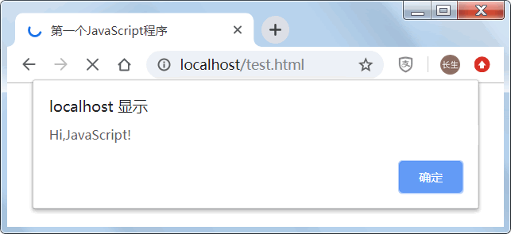

# 初写JS脚本

**JavaScript 程序不能够独立运行，只能在宿主环境中执行。一般情况下可以把 JavaScript 代码放在网页中，借助浏览器环境来运行。**

## 第一个程序

新建一个名称为“test.html”的 HTML 文档，在 HTML 代码中的 \<head> 标签内嵌入 JavaScript 脚本需要使用 \<script> 标签，并设置标签属性 `type="text/javascript"`，在 \<script> 标签中直接编写 JavaScript 代码：`document.write("<h1>Hi,JavaScript!</h1>")；`。

```html
<!DOCTYPE html>
<html>
<head>
    <meta charset="UTF-8">
    <title>第一个JavaScript程序</title>
    <script type="text/javascript">
        document.write("<h1>Hi,JavaScript!</h1>");
    </script>
</head>
<body></body>
</html>
```

**在 JavaScript 脚本中，`document` 表示网页文档对象；`document.write()` 表示调用 Document 对象的 `write()` 方法，在当前网页源代码中写入 HTML 字符串`"<h1>Hi,JavaScript!</h1>"`。**

保存 HTML 文档，在浏览器中预览，显示效果如图所示：


?> 现代浏览器默认 \<script> 标签的脚本类型为 JavaScript，因此可以省略 type 属性；如果考虑到兼容早期版本浏览器，则需要设置 type 属性。

## JavaScript 文件

JavaScript 程序不仅可以直接放在 HTML 文档中，也可以放在 JavaScript 文件中。**JavaScript 文件是文本文件，扩展名为 `.js`，使用任何文本编辑器都可以编辑。**新建一个名称为“test.js”的js文件，打开后在其中编写如下 JavaScript 代码：

```javascript
alert("Hi,JavaScript!");
```

**JavaScript 文件不能够独立运行，需要导入到网页中，通过浏览器来执行。使用 \<script> 标签导入 JavaScript 文件。**

!> 使用 \<script> 标签包含外部文件时，不管加载的文件扩展名是不是 .js，浏览器都会按 JavaScript 脚本来解析。

我们可以修改上面建立的“test.html”文件当中的HTML代码：

```html
<!DOCTYPE html>
<html>
<head>
    <meta charset="UTF-8">
    <title>第一个JavaScript程序</title>
    <!--把test.html文件和test.js文件放在同一个目录下-->
    <script type="text/javascript" src="test.js">
    </script>
</head>
<body></body>
</html>
```

**在上面代码中，alert() 表示 Window 对象的方法，调用该方法将弹出一个提示对话框，显示参数字符串 "Hi, JavaScript!"。**

保存 HTML 文档，在浏览器中预览，显示效果如图所示：



!> 定义 src 属性的 \<script> 标签不应再包含 JavaScript 代码。如果嵌入了代码，则只会下载并执行外部 JavaScript 文件，嵌入代码将被忽略。

## 执行顺序

浏览器在解析 HTML 文档时，是从上到下逐行解析和显示。JavaScript 代码也是 HTML 文档的组成部分，因此 JavaScript 脚本的执行顺序也是根据 \<script> 标签的位置来确定的。

下面这代码运行效果：首先弹出提示文本“顶部脚本”，然后显示网页标题“test”，接着弹出提示文本“头部脚本”，下面才显示一级标题文本“网页标题”，继续弹出提示文本“页面脚本”， 接着显示段落文本“正文内容”，最后弹出提示文本“底部脚本”。

```html
<!DOCTYPE html>
<script>
    alert("顶部脚本");
</script>
<html>
<head>
    <meta charset="UTF-8">
    <title>test</title>
    <script>
        alert("头部脚本");
    </script>
</head>
<body>
    <h1>网页标题</h1>
    <script>
        alert("页面脚本");
    </script>
    <p>正文内容</p>
</body>
<script>
    alert("底部脚本");
</script>
</html>
```

### 延迟执行

—般情况下，在 HTML 文档的 \<head> 标签中包含 JavaScript 脚本或导入 JavaScript 文件。这意味着必须等到全部 JavaScript 代码都被加载、解析和执行完以后，才能继续解析后面的 HTML 部分。如果加载的 JavaScript 文件很大， HTML 文档解析就容易出现延迟。

**为了避免这个问题，在开发 Web 应用程序时，建议把导入 JavaScript 文件的操作放在 \<body> 后面，让浏览器先将网页内容解析并呈现出来后，再去加载 JavaScript 文件，以便加快网页响应速度。**

**\<script> 标签有一个布尔型属性 defer，设置该属性能够将 JavaScript 文件延迟到页面解析完毕后再运行。**

test.js 源码：

```javascript
alert("外部文件");
```

test.html 源码：

```html
<!DOCTYPE html>
<html>
<head>
    <meta charset="UTF-8">
    <script type="text/javascript" defer src="test.js"></script>
</head>
<body>
    <h1>网页标题</h1>
    <p>正文内容</p>
</body>
</html>
```

保存 HTML 文档，在浏览器中显示效果：浏览器先显示网页标题和段落文本，然后才弹出提示文本。如果不设置 defer 属性，则执行顺序是相反的。

!> defer 属性适用于外部 JavaScript 文件，不适用于 \<script>签包含的 JavaScript 脚本。

### 异步加载

除了最后加载 JavaScript 文件来提高网页响应速度外，**现在可以为 \<script> 标签设置 async 属性，让浏览器异步加载 JavaScript 文件，即在加载 JavaScript 文件时，浏览器不会暂停，而是继续解析。这样能节省时间，提升响应速度。**

test.js 源码：

```javascript
alert("外部文件");
```

test.html 源码：

```html
<!DOCTYPE html>
<html>
<head>
    <meta charset="UTF-8">
    <script type="text/javascript" async src="test.js"></script>
</head>
<body>
    <h1>网页标题</h1>
    <p>正文内容</p>
</body>
</html>
```

保存 HTML 文档，在浏览器中显示效果：网页标题和段落文本同步，或者先显示出来，然后同步弹出提示文本。如果不设置 async 属性，则先弹出提示文本，然后才开始解析并显示网页标题和段落文本。

!> async 是 HTML5 新增的布尔型属性，通过设置 async 属性，就不用考虑 \<script> 标签的放置位置，用户可以根据习惯继续把很多大型 JavaScript 库文件放在 \<head> 标签内。

## JavaScript 代码块

**代码块就是使用 \<script> 标签包含的 JavaScript 代码段。**

在下面示例中，使用了两个 \<script> 标签分别定义两个 JavaScript 代码块：

```html
<script>
    //JavaScript 代码块 1
    var a = 1;
</script>
<script>
    //JavaScript 代码块 2
    function f(){
        alert(1);
    }
</script>
```


执行流程：**浏览器在解析这个 HTML 文档时，遇到第一个 \<script> 标签，则 JavaScript 解释器会等到这个代码块的代码都加载完后，再对代码块进行预编译，然后执行。执行完毕，将继续解析后面的 HTML 代码，同时 JavaScript 解释器也准备好处理下一个代码块。**

在下面示例中，使用了两个 \<script> 标签分别定义两个 JavaScript 代码块：

```html
<script>
    //JavaScript 代码块 1
    alert(a);
</script>
<script>
    //JavaScript 代码块 2
    var a = 1;
</script>
```

执行流程：JavaScript 解释器执行下面代码时就会提示语法错误，显示变量 a 未定义。

**JavaScript 是按块执行的，但是不同块都属于同一个作用域（全局作用域），下面块中的代码可以访问上面块中的变量。因此，如果把上面示例中两个代码块的顺序调换一下，就不会出现语法错误。**

```html
<script>
    //JavaScript 代码块 2
    var a = 1;
</script>
<script>
    //JavaScript 代码块 1
    alert(a);
</script>
```

如果把两块代码放在一起，也不会出现上述错误：

```html
<script>
    var a = 1;
    alert(a);
</script>
```

