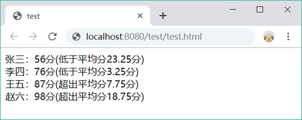

# 数据类型

## 基本数据类型

JavaScript 的数据类型分为两种：

- **简单的值（原始值）：包含字符串、数字和布尔值，此外，还有两个特殊值——null（空值）和 undefined（为定义）。**
- **复杂的数据结构（泛指对象）：包括狭义的对象、数组和函数。**

JavaScript 定义了 6 种基本数据类型，如表所示：

| 数据类型  | 说明                             |
| --------- | -------------------------------- |
| null      | 空值，表示非对象                 |
| undefined | 未定义的值，表示未赋值的初始化值 |
| number    | 数字，数学运算的值               |
| string    | 字符串，表示信息流               |
| boolean   | 布尔值，逻辑运算的值             |
| object    | 对象，表示复合结构的数据集       |

?> 在 JavaScript 中，函数是一种比较特殊的结构。它可以是一段代码集合，也可以是一种数据类型；可以作为对象来使用，还可以作为构造函数创建类型。JavaScript 函数的用法比较灵活，这也是 JavaScript 语言敏捷的一种表现（函数式编程）。

### Null

**Null 类型只有一个值，即 null，它表示空值，定义一个空对象指针。**

### Undefined

**undefined 是 Undefined 类型的唯一值，它表示未定义的值。当声明变量未赋值时，或者定义属性未设置值时，默认值都为 undefined。**

初始变量的默认值都为 `undefined`：

```javascript
var a; //声明变量
console.log(a);  //返回变量默认值为 undefined
```

对于函数来说，如果没有明确的返回值，则默认返回值也为

```javascript
function f(){}
console.log(f());  //返回"undefined"
```

!> undefined 隐含着意外的空值，而 null 隐含着意料之中的空值。因此，设置一个变量、参数为空值时，建议使用 null，而不是 undefined。

### 布尔型

**布尔型（Boolean）仅包含两个固定的值：`true` 和 `false`。其中，`true` 代表"真”，而 `false` 代表“假”。**

**在 JavaScript 中，`undefined`、`null`、`""`、`0`、`NaN` 和 `false` 这 6 个特殊值转换为布尔值时为 `false`，被称为假值。除了假值以外，其他任何类型的数据转换为布尔值时都是 `true`。**

```javascript
//使用 Boolean() 函数可以强制转换值为布尔值。
console.log(Boolean(0)); //返回 false
console.log(Boolean(NaN)); //返回 false
console.log(Boolean(null)); //返回 false
console.log(Boolean("")); //返回 false
console.log(Boolean(undefined)); //返回 false
```

### 字符串

**JavaScript 字符串（String）就是由零个或多个 Unicode 字符包含在单引号或双引号中的字符序列。**

1) **如果字符串包含在双引号中，则字符串内可以包含单引号；反之，也可以在单引号中包含双引号。**例如，定义 HTML 字符串时，习惯使用单引号表示字符串，HTML 中包含的属性值使用双引号表示， 这样不容易出现错误。

```javascript
console.log('<meta charset="UTF-8">');
```

2) **在 ECMAScript 3 中，字符串必须在一行内表示，换行表示是不允许的。例如，下面字符串直接量的写法是错误的。**

```javascript
console.log("字符串
直接量"); //抛出异常
```

如果要换行显示字符串，可以在字符串中添加换行符`\n`。例如：

```javascript
console.log("字符串\n直接量");  //在字符串中添加换行符
```

3) **在 ECMAScript 5 中，字符串允许多行表示。实现方法：在换行结尾处添加反斜杠`\`。反斜杠和换行符不作为字符串直接量的内容。**例如：

```javascript
console.log("字符串\
直接量");  //显示“字符串直接量”
```

4) **在字符串中插入特殊字符，需要使用转义字符，如单引号、双引号等。**例如，英文中常用单引号表示撇号，此时如果使用单引号定义字符串，就应该添加反斜杠转义字符，单引号就不再被解析为字符串标识符，而是作为撇号使用。

```javascript
console.log('I can\'t read.');  //显示"I can't read."
```

借助 String 类型的原型方法，可以灵活操作字符串。再配合正则表达式，还可以完成复杂的字符串处理任务。

**在 JavaScript 中，可以使用加号+运算符连接两个字符串，使用字符串的 length 属性获取字符串的字符个数（长度）。**下面代码先合并两个字符串，然后计算它们的长度：

```javascript
var str1 = "学而不思则罔",
    str2 = "思而不学则殆",
    string = str1 + "，" + str2;
document.write(string);  //显示“学而不思则罔，思而不学则殆”
document.write(string.length);  //显示 13
```

**JavaScript 字符串是固定不变的字符序列，虽然可以使用各种方法对字符串执行操作，但是返回的都是新的字符串，原字符串保持固定不变。此外，也不能使用 delete 运算符删除字符串中指定位置的字符。**

**在 ECMAScript 5 中，字符串可以作为只读数组使用。除了使用 `charAt()` 访问其中的字符外，还可以使用中括号运算符来访问。字符串中每个字符都有固定的位置。第 1 个字符的下标位置为 0，第 2 个字符的下标位置为 1…… 以此类推，最后一个字符的下标位置是字符串长度减1。**下面代码使用 for 语句逐个读取字符串中每个字符并显示出来。

```javascript
var str = "学而不思则罔，思而不学则殆";
for(var i=0; i<str.length; i++){
  console.log(str[i]);
}
```

!> 注意：字符串中的字符不能被 `for/in` 语句循环枚举。

#### 定义字符

在 JavaScript 中，定义字符串有以下 3 种方法。

**字符串直接量**：使用双引号或单引号包含任意长度的文本。

任何被引号包含的文本都被称为字符串型数据。

```javascript
var s = "true";  //把布尔值转换为字符串
var s = "123";  //把数值转换为字符串
var s = "[1,2,3]";  //把数组转换为字符串
var s = "{x : 1; y : 2}";  //把对象转换为字符串
var s = "console.log('Hello,World')";  //把可执行表达式转换为字符串
```

单引号和双引号可以配合使用，定义特殊形式的字符串。

```javascript
var s = 'console.log("Hello,World")';
```

单引号可以包含双引号，或者双引号包含单引号。但是，不能够在单引号中包含单引号，或者双引号中包含双引号。

由于一些字符包含多重语义，在字符串中需要转义表示，避免产生歧义。转义字符的基本方法：在字符前面加反斜杠。

```javascript
var s = "\"";  //有效的引号字符
```

对于字符串化脚本，可以调用全局方法 eval() 执行字符串代码。

```javascript
var s = "console.log('Hello,World')";  //表达式字符串
eval(s);  //执行表达式字符串
```

**构造字符串**：使用 `String()` 类型函数可以构造字符串，该函数可以接收一个参数，并把它作为值来初始化字符串。

下面使用 new 运算符调用 String() 构造函数创建一个字符串型对象。

```javascript
var s = new String();  //创建一个空字符串对象，并赋值给变量s
var s = new String("我是构造字符串");  //创建字符串对象，初始化之后赋值给变量s
```

通过 String 构造函数，构造的字符串与字符串直接量的类型是不同的。前者为引用型对象，后者为值类型字符串

下面代码比较了构造字符串和字符串直接量的数据类型的不同。

```javascript
var s1 = new String(1);  //构造字符串
var s2 = "1";  //定义字符串直接量
console.log(typeof s1);  //返回object，说明是引用型对象
console.log(typeof s2);  //返回string，说明是值类型字符串
```

`String()` 也可以作为普通函数使用，把参数转换为字符串类型的值返回。

```javascript
var s = String(123456);  //包装字符串
console.log(s);  //返回字符串“123465”
console.log(typeof s);  //返回string，说明是简单的值
```

`String()` 允许传入多个参数，但是仅处理第一个参数，并把它转换为字符串返回。

```javascript
var s = String(1,2,3,4,5,6);  //带有多个参数
console.log(s);  //返回字符串“1”
console.log(typeof s);  //返回string，数值被转换为字符串
```

但是，所有参数表达式都会被 JavaScript 计算。

下面变量 n 在构造函数内经过多次计算之后，最后值递增为 5。

```javascript
var n = 1;  //初始化变量
var s = new String(++n; ++n; ++n; ++n);  //字符串构造处理
console.log(s);  //返回2
console.log(n);  //返回5
console.log(typeof s);  //返回object，说明是引用型对象
console.log(typeof n);  //返回number，说明是数值类型
```

**使用字符编码**：使用 `fromCharCode()` 方法可以把字符编码转换为字符串。该方法可以包含多个整数参数，每个参数代表字符的 Unicode 编码，返回值为字符编码的字符串表示。

下面代码演示了如何把一组字符串编码转换为字符串。

```javascript
var a = [35835,32773,24744,22909], b = [];  //声明一个字符编码的数组
for (var i in a) {  //遍历数组
    b.push(String.fromCharCode(a[i]));  //把每个字符编码都转换为字符串存入数组
}
console.log(b.join(""));  //返回字符串“C语言中文网”
```

可以把所有字符串按顺序传给 fromCharCode()。

```javascript
var b = String.fromCharCode(35835,32773,24744,22909);  //传递多个参数
```

也可以使用 apply() 方法动态调用 fromCharCode() 方法。

```javascript
var a = [35835,32773,24744,22909], b = [];
var b = String.fromCharCode.apply(null,a);  //动态调用fromCharCode()方法，并传递数组
console.log(b);  //返回字符串“C语言中文网”
```

?> `fromCharCode()` 方法是 String 类型的静态方法，不能通过字符串来调用。与 `fromCharCode()` 方法相反，`charCodeAt()` 方法可以把字符串转换为 Unicode 编码。

#### 字符串长度

在 JavaScript 中，使用字符串的 length 属性可以读取字符串的长度。长度以字符为单位，该属性为只读属性。

下面代码使用字符串的 length 属性获取字符串的长度。

```javascript
var s = "String 类型长度";  //定义字符串
console.log(s.length);  //返回10个字符
```

JavaScript 支持的字符包括单字节、双字节两种类型，为了精确计算字符串的字节长度，可以采用下面方法来计算。

#### 字符串拼接

在 JavaScript 中，使用字符串连接有 3 种方式。

**加号运算符**：连接字符串最简便的方法是使用加号运算符。

下面代码使用加号运算符连接两个字符串。

```javascript
var s1 = "abc" , s2 = "def";
console.log(s1 + s2);  //返回字符串“abcdef”
```

**concat()方法**：使用字符串 concat() 方法可以把多个参数添加到指定字符串的尾部。该方法的参数类型和个数没有限制，它会把所有参数都转换为字符串，然后按顺序连接到当前字符串的尾部最后返回连接后的字符串。

下面代码使用 concat() 方法把多个字符串连接在一起。

```javascript
var s1 = "abc";
var s2 = s1.concat("d" , "e" , "f");  //调用concat()连接字符串
console.log(s2);  //返回字符串“abcdef”
```

concat() 方法不会修改原字符串的值，与数组的 concat() 方法操作相似。

**join()方法**：在特定的操作环境中，也可以借助数组的 join() 方法来连接字符串，如 HTML 字符串输出等。

下面代码演示了如何借助数组的方法来连接字符串。

```javascript
var s = "JavaScript" , a = [];
for (var i = 0; i < 1000; i ++) {
    a.push(s);
var str = a.join("");
a = null;
document.write(str);
```

在上面示例中，使用 for 语句把 1000 个 “JavaScript”字符串装入数组，然后调用数组的 join() 方法把元素的值连接成一个长长的字符串。使用完毕应该立即清除数组，避免占用系统资源。

在传统浏览器中，使用数组的 join() 方法连接超大字符串时，速度会很快，是推荐的最佳方法。随着现代浏览器优化了加号运算符的算法，使用加号运算符连接字符串速度也非常快，同时使用简单。一般推荐使用加号运算符来连接字符串，而 concat() 和 join() 方法可以用在特定的代码环境中。

#### 字符串查找

在开发中经常需要检索字符串、查找特定字符串。用户可以选用下面的方法执行对应的操作，说明如表所示。

| 字符串方法    | 说明                            |
| ------------- | ------------------------------- |
| charAt()      | 返回字符串中的第 n 个字符       |
| charCodeAt()  | 返回字符串中的第 n 个字符的代码 |
| indexOf()     | 检索字符串                      |
| lastIndexOf() | 从后向前检索一个字符串          |
| match()       | 找到一个或多个正则表达式的匹配  |
| search()      | 检索与正则表达式相匹配的子串    |

**查找字符**：使用字符串的 `charAt()` 和 `chatCodeAt()` 方法，可以根据参数（非负整数的下标值）返回指定位置的字符或字符编码。

对于 `charAt()` 方法来说，如果参数不在 0 和字符串的 length-1 之间，则返回空字符串；而对于 `charCodeAt()` 方法来说，则返回 NaN，而不是 0 或空字符串。

下面示例为 String 类型扩展一个原型方法，用来把字符串转换为数组。在函数中使用 `charAt()` 方法读取字符串中每个字符，然后装入一个数组并返回。

```javascript
String.prototype.toArray = function () {  //把字符串转换为数组
    var 1 = this.length; a = [];  //获取当前字符串长度，并定义空数组
    if (1) {  //如果存在则执行循环操作，预防空字符串
        for (var i = 0; i < 1; i ++) {  //遍历字符串，枚举每个字符
            a.push(this.charAt(i));  //把每个字符按顺序装入数组
        }
    }
    return a;  //返回数组
}
```

应用原型方法：

```javascript
var s = "abcdefghijklmn".toArray();  //把字符串转换为数组
for (var i in s) {  //遍历返回数组，显示每个字符
    console.log(s[i]);
}
```

**查找字符串**：使用字符串的 indexOf() 和 lastIndexOf() 方法，可以根据参数字符串，返回指定子字符串的下标位置。这两个方法都有两个参数，说明如下。

- 第一个参数为一个子字符串，指定要查找的目标。
- 第二个参数为一个整数，指定查找的起始位置，取值范围是 0~length-1。

对于第二个参数来说，需要注意一下几个特殊情况。

- 如果值为负数，则视为 0，相当于从第一个字符开始查找。
- 如果省略了这个参数，也将从字符串的第一个字符开始查找。
- 如果值大于等于 length 属性值，则视为当前字符串中没有指定的子字符串，返回 -1。

下面代码查询字符串中首个字母 a 的下标位置。

```javascript
var s = "JavaScript";
var i = s.indexOf("a");
console.log(i);  //返回值为1，即字符串中第二个字符
```

indexOf() 方法只返回查找到的第一个子字符串的起始下标值，如果没有找到则返回 -1。

下面代码查询 URL 字符串中首个字母 n 的下标位置。

```javascript
var s = "c.biancheng.net";
var a = s.indexOf("biancheng");  //返回值为3，即第一个字符n的下标位置
```

如果要查找下一个子字符串，则可以使用第二个参数来限定范围。

下面代码分别查询 URL 字符串中两个点号字符下标的位置。

```javascript
var s = "c.biancheng.net";
var b = s.indexOf(".");  //返回值为1，即第一个字符.的下标位置
var e = s.indexOf(".", b + 1);  //返回值为11，即第二个字符.的下标位置
```

indexOf() 方法是按照从左到右的顺序进行查找的。如果希望从右到左来进行查找，则可以使用 lastIndexOf() 方法来查找。 

下面代码按从右到左的顺序查询 URL 字符串中最后一个点号字符的下标位置。

```javascript
var s = "c.biancheng.net";
var n = s.lastIndexOf(".");  //返回值为11，即第二个字符.的下标位置
```

lastIndexOf() 方法的查找顺序是从右到左但是其参数和返回值都是根据字符串的下标按照从左到右的顺序来计算的，即字符串第一个字符下标值始终都是 0，而最后一个字符的下标值始终都是 length-1。

lastIndexOf() 方法的第二个参数指定开始查找的下标位置，但是，将从该点开始向左查找，而不是向右查找。

```javascript
var s = "http://c.biancheng.net";
var n = s.lastIndexOf(".", 11);  //返回值是8，而不是18
```

其中第二个参数值 11 表示字符 a （第一个）的下标位置，然后从左侧开始向左查找，所以就返回第一个点号的位置。如果找到，则返回第一次找到的字符串的起始下标值。

```javascript
var s = "http://c.biancheng.net";
var n = s.lastIndexOf("c");  //返回值为7
```

如果没有设置第二个参数，或者为参数负值，或者参数大于等于 length，则将遵循 indexOf() 方法进行操作。

**搜索字符串**：search() 方法和 indexOf() 的功能是相同的，查找指定字符串第一次出现的位置。但是 search() 方法仅有一个参数，定义匹配模式。该方法没有 lastIndexOf() 的反向检索功能，也不支持全局模式。

下面代码使用 search() 方法匹配斜杠字符在 URL 字符串的下标位置。

```javascript
var s = "c.biancheng.net";
n="s.search("//");"
```

search() 方法参数定义：

- search() 方法的参数为正则表达式（RegExp 对象）。如果参数不是 RegExp 对象，则 JavaScript 会使用 RegExp() 函数把它转换为 RegExp 对象。
- search() 方法遵循从左到右的查找顺序，并返回第一个匹配的子字符串的起始下标位置值。如果没有找到，则返回 -1。
- search() 方法无法查找指定的范围，始终返回的第一个匹配子字符串的下标值，没有 indexOf() 方法灵活。

#### 字符串匹配

match() 方法能够找出所有匹配的子字符串，并以数组的形式返回。

下面代码使用 match() 方法找到字符串中所有字母 c，并返回它们。

```javascript
var s = "http://c.biancheng.net";
var a = s.match(/c/n);  //全局匹配所有字符c
console.log(a);  //返回数组[c,c]。
```

match() 方法返回的是一个数组，如果不是全局匹配，那么 match() 方法只能执行一次匹配。例如，下面匹配模式没有 n 的修饰符，只能够执行一次匹配，返回仅有一个元素 c 的数组。

```javascript
var a = s.match(/c/);  //返回数组[h]
```

如果没有找到匹配字符，则返回 null，而不是空数组。

当不执行全局匹配时，如果匹配模式包含子表达式，则返回子表达式匹配的信息。

下面代码使用 match() 方法匹配 URL 字符串中所有点号字符。

```javascript
var s = "http://c.biancheng.net";
var a = s.match(/(\.).*(\.).*(\.)/ );  //执行一次匹配检索
console.log(a.length);
console.log(a[0]);
console.log(a[1]);
console.log(a[2]);
console.log(a[3]);
```

在这个正则表达式 “/(\.).*(\.).*(\.)/”中，左右两个斜杠是匹配模式分隔符，JavaScript 解释器能够根据这两个分隔符来识别正则表达式。在正则表达式中小括号表示子表达式，每个子表达式匹配的文本信息会被独立存储。点号需要转义，因为在正则表达式中它表示匹配任意字符，星号表示前面的匹配字符可以匹配任意多次。

在上面示例中，数组 a 包含 4 个元素，其中第一个元素存放的是匹配文本，其余元素存放的是每个正则表达式的子表达式匹配的文本。

另外，返回的数组还包含两个对象属性，其中 index 属性记录匹配文本的起始位置，input 属性记录的是被操作的字符串。

```javascript
console.log(a.index);
console.log(a.input);
```

在全局匹配模式下，match() 将执行全局匹配。此时返回的数组元素存放的是字符串中所有匹配文本，该数组没有 index 属性和 input 属性；同时不再提供子表达式匹配的文本信息，也不提示每个匹配子串的位置。如果需要这些信息，可以使用 RegExp.exec() 方法。

#### 字符串截取

String 定义了 3 个字符串截取的原型方法，说明如表所示。

| 字符串方法  | 说明                 |
| ----------- | -------------------- |
| slice()     | 抽取一个子串         |
| substr()    | 抽取一个子串         |
| substring() | 返回字符串的一个子串 |

**截取指定长度字符串**：substr() 方法能够根据指定长度来截取子字符串。它包含两个参数，第一个参数表示准备截取的子字符串起始下标，第二个参数表示截取的长度。

在下面示例中使用 lastIndexOf() 获取字符串的最后一个点号的下标位置，然后从其后的位置开始截取 4 个字符。

```javascript
var s = "http://c.biancheng.net/index.html";
var b = s.substr(s.lastIndexOf(".") + 1,4);  //截取最后一个点号后4个字符
console.log(b);  //返回子字符串“html”
```

如果省略第二个参数，则表示截取从起始位置开始到结尾的所有字符。考虑到扩展名的长度不固定，省略第二个参数会更灵活。

```javascript
var b = s.substr(s.lastIndexOf(".") + 1);
```

如果第一个参数为负值，则表示从字符串的尾部开始计算下标位置，即 -1表示最后一个字符，-2 表示倒数第二个字符，以此类推。这对于左侧字符长度不固定时非常有用。

?> ECMAScript 不再建议使用该方法，推荐使用 slice() 和 substring() 方法。

**截取起止下标位置字符串**：slice() 和 substring() 方法都是根据指定的起止下标位置来截取字符串，它们都可以包含两个参数，第一个参数表示起始下标，第二个参数表示结束下标。

下面代码使用 substring() 方法截取 URL 字符串中网站主机名信息。

```javascript
var s  = "http://c.biancheng.net/index.html";
var a = s.indexOf("c");
var b = s.indexOf("/", a);
var c = s.substring(a,b);
var d = s.slice(a,b);
```

- 截取的字符串包含第一个参数所指定的字符。结束点不被截取，即不包含在字符串。
- 第二个参数如果省略，表示截取到结尾的所有字符串。


如果第一个参数值比第二个参数值大，substring() 方法能够在执行截取之前先交换两个参数，而对于 slice() 方法来说，则被无视为无效，并返回空字符串。

下面代码比较 substring() 方法和 slice() 方法用法不同。

```javascript
var s = "http://c.biancheng.net/index.html";
var a = s.indexOf("c");
var b = s.indexOf("/", a);
var c = s.substring(b, a);
var d = s.slice(b, a);
```

- 当起始点和结束点的值大小无法确定时，使用 substring() 方法更合适。
- 如果参数值为负值，slice() 方法能够把负号解释为从右侧开始定位，这与 Array 的 slice() 方法相同。但是 substring() 方法会视其为无效，并返回空字符串。

下面代码比较 substring() 方法和 slice() 方法的用法不同。

```javascript
var s = "http://c.biancheng.net/index.html";
var a = s.indexOf("c");
var b = s.indexOf("/", a);
var 1 = s.length;
var c = s.substring(a-1, b-1);
var d = s.slice(a-1, b-1);
```

#### 字符串替换

replace() 方法的第二个参数可以使用函数，当匹配时会调用该函数，函数的返回值将作为替换文本使用，同时函数可以接收以`$`为前缀的特殊字符，用来引用匹配文本的相关信息。

| 约定字符串                | 说明                                           |
| ------------------------- | ---------------------------------------------- |
| $1、$2、...、$99          | 与正则表达式中的第 1~99 个子表达式相匹配的文本 |
| $&（美元符号+连字符）     | 与正则表达式相匹配的子字符串                   |
| $’（美元符号+切换技能键） | 位于匹配子字符串左侧的文本                     |
| $'（美元符号+单引号）     | 位于匹配字符串右侧的文本                       |
| $$                        | 表示 $ 字符串                                  |

下面代码把字符串中每个单词转换为首字母大写形式显示。

```javascript
var s = 'javascript is script , is not java.';  //定义字符串
//定义替换文本函数，参数为第一个子表达式匹配文本
var f = function ($1) {
    //把匹配文本的首字母转换为大写
    return $1.substring(0,1).toUpperCase() + $1.substring(1).toLowerCase();}
var a = s.replace(/(\b\w+\b)/g, f);  //匹配文本并进行替换
console.log(a);  //返回字符串“JavaScript Is Script ， Is Not Java.”
```

在上面示例中替换函数的参数为特殊字符“$1”，它表示正则表达式 /(\b\w+\b)/ 中小括号匹配的文本，然后在函数结构内对这个匹配文本进行处理，截取其首字母并转换为大写形式，余下字符全为小写，然后返回新处理的字符串。replace() 方法是在原文本中使用这个返回的新字符串替换掉每次匹配的子字符串。

对于上面的示例还可以进一步延伸，使用小括号来获取更多匹配信息。例如，直接利用小括号传递单词的首字母，然后进行大小写转换处理，处理结果都是一样的。

```javascript
var s = 'javascript is script , is not java.';  //定义字符串
var f = function ($1,$2,$3) {  //定义替换文本函数，请注意参数的变化
    return $2.toUpperCase() + $3;
}
var a = s.replace(/(\b\w+\b)/g, f);
console.log(a);
```

在函数 f() 中，第一个参数表示每次匹配的文本，第二个参数表示第一个小括号的子表达式所匹配的文本，即单词的首字母，第二个参数表示第二个小括号的子表达式所匹配的文本。

replace() 方法的第二个参数是一个函数，replace() 方法会给它传递多个实参，这些实参都包含一定的意思，具体说明如下。

- 第一个参数表示与匹配模式相匹配的文本，如上面示例中每次匹配的单词字符串。
- 其后的参数是与匹配模式中子表达式相匹配的字符串，参数个数不限，根据子表达式数而定。
- 后面的参数是一个整数，表示匹配文本在字符串中的下标位置。
- 最后一个参数表示字符串自身。

把上面示例中替换文本函数改为如下形式。

```javascript
var f = function() {
    return arguments[1].toUpperCase() + arguments[2];
}
```

也就是说，如果不为函数传递形参，直接调用函数的 arguments 属性同样能够读取到正则表达式中相关匹配文本的信息。其中：

- arguments[0]：表示每次匹配的文本，即单词。
- arguments[1]：表示第一个子表达式匹配的文本，即单词的首个字母。
- arguments[2]：表示第二个子表达式匹配的文本，即单词的余下字母。
- arguments[3]：表示匹配文本的下标位置，如第一个匹配单词“javascript”的下标位置就是0，以此类推。
- arguments[4]：表示要执行匹配的字符串，这里表示“javascript is script , is not java.”。

下面代码利用函数的 arguments 对象主动获取 replace() 方法的第一个参数中正则表达式所匹配的详细信息。

```javascript
var s = 'javascript is script , is not java.';  //定义字符串
var f = function () {
    for (var i = 0; i < arguments.length; i++) {
        console.log("第" + (i + 1) + "个参数的值："+ arguments[i]);
    }
    console.log("-----------------------------");
}
var a = s.replace(/(\b\w+\b)/g, f);
```

在函数结构体中，使用 for 循环结构遍历 arguments 属性时，发现每次匹配单词时，都会弹出 5 次提示信息，分别显示上面所列的匹配文本信息。其中，arguments[1]、arguments[2] 会根据每次匹配文本的不同，分别显示当前匹配文本中子表达式匹配的信息，arguments[3] 显示当前匹配单词的下标位置。而 arguments[0] 总是显示每次匹配的单词，arguments[4] 总是显示被操作的字符串。

下面代码设计从服务器端读取学生成绩（JSON格式），然后使用 for 语句把所有数据转换为字符串。再来练习自动提取字符串中的分数，并汇总、算出平均分。最后，利用 replace() 方法提取每个分值，与平均分进行比较以决定替换文本的具体信息。

```javascript
var scope = {
    "张三" : 56,
    "李四" : 76,
    "王五" : 87,
    "赵六" : 98
}, _scope = "";
for (var id in scope) {  //把JSON数据转换为字符串
    _scope += id + scope[id];
}
var a = _scope.match(/\d+/g), sum = 0;  //匹配出所有分值，输出位数组
for (var i = 0; i <a.length; i++) {  //遍历数组，求总分
    sum += parseFloat(a[i]);  //把元素值转换为数值后递加
};
var avg = sum / a.length;  //求平均分
function f() {
    var n = parseFloat(arguments[1]);  //把匹配的分数转换为数值，第一个子表达式
    return "：" + n + "分" + "(" + ((n > avg) ? ("超出平均分" + (n - avg)) :
    ("低于平均分" + (avg - n))) + "分)<br>";  //设计替换文本的内容
}
var s1 = _scope.replace(/(\b\w+\b)/g, f);  //执行匹配、替换操作
document.write(s1);
```

运行结果如下：



遍历数组时不能使用 for/in 语句因为数组中还存储有其他相关的匹配文本信息。应该使用 for 结构来实现。由于截取的数字都是字符串类型，应该把它们都转换为数值类型，再把数字连接在一起，或者按字母顺序进行比较等。

#### 去除前后空格

ECMAScript 5 为 String 新增了 trim() 原型方法，用以从字符串中去除前导空字符、尾随空字符和行终止符。该方法在表达处理中非常实用。

空字符包括：空格、制表符、换页符、回车符和换行符。

下面代码使用 trim() 方法快速清除掉字符串首尾空格。

```javascript
var s = "    abc def   \r\n  ";
s = s.trim();
console.log("[" + s + "]");  //[abc def]
console.log(s.length);  //7
```

#### 字符串比较

JavaScript 能够根据字符的 Unicode 编码大小逐位比较字符串大小。

**直接比较字符串大小**：在 JavaScript 中，可以直接使用 >、<、==、=== 来比较两个字符串的大小，就像比较两个数字一样。

例如，小写字母 a 的编码为 97，大写字母 A 的编码为 65，则字符“a”就大于“A”。

```javascript
console.log("a" > "A");  //返回true
```

再如，“中国人”的 Unicode 编码是 \u4e2d\u56fd\u4eba，“编程语言”的编码是 \u7f16\u7a0b\u8bed\u8a00，因为 \u4e2d 小于 \u7f16，所以“中国人”就小于“编程语言”。

```javascript
console.log("中国人"<"编程语言");  //返回true
```

使用字符串的 localeCompare() 方法，可以根据本地约定顺序来比较两个字符串的大小。ECMAScript 标准没有规定如何进行本地化比较操作。

localeCompare() 方法包含一个参数，指定要比较的目标字符串。如果当前字符串小于参数字符串，则返回小于 0 的数；如果大于参数字符串，则返回大于 0 的数；如果两个字符串相等，或与本地排序约定没有区别，则该方法返回 0。

【实例】下面代码把字符串“JavaScript”转换为数组，然后按本地字符顺序进行排序。

```javascript
var s = "JavaScript";  //定义字符串直接量
var a = s.split("");  //把字符串转换为数组
var s1 = a.sort(function (a, b)) {  //对数组进行排序
    return a.localeCompare(b);  //将根据前后字符在本地的约定进行排序
});
a = s1.join("");  //然后再把数组还原为字符串
console.log(a);  //返回字符串“aaciJprStv”
```

#### 大小写转换

String 定义了 4 个原型方法实现字符串大小写转换操作，说明如表所示。

| 字符串方法          | 说明               |
| ------------------- | ------------------ |
| toLocaleLowerCase() | 把字符串转换成小写 |
| toLocaleUpperCase() | 将字符串转换成大写 |
| toLowerCase()       | 将字符串转换成小写 |
| toUpperCase()       | 将字符串转换成大写 |

下面代码把字符串全部转换成大写形式。

```javascript
var s = "JavaScript";
console.log(s.toUpperCase());  //返回字符串“JAVASCRIPT”
```


toLocaleLowerCase() 和 toLocaleUpperCase() 是两个本地化原型方法。它们能够按照本地方式转换大小写字母，由于只有几种语言（如土耳其语）具有地方特有的大小写映射，所以通常与 toLowerCase() 和 toUpperCase() 方法的返回值一样。

#### 和数组转换

使用字符串的 split() 方法可以根据指定的分隔符把字符串切分为数组。

如果使用数组的 join() 方法，可以把数组元素连接为字符串。

如果参数为空字符串，则 split() 方法能够按单个字符进行切分，然后返回与字符串等长的数组。

```javascript
var s = "JavaScript";
var a = s.split("");  //按字符空隙分隔
console.log(s.length);  //返回值为10
console.log(a.length);  //返回值为10
```

如果参数为空，则 split() 方法能够把整个字符串作为一个元素的数组返回。

```javascript
var s = "JavaScript";
var a = s.split("");  //空分隔
console.log(a.constructor == Array);  //返回true，说明Array是实例
console.log(a.length);  //返回值为1，说明没有对字符串进行分割
```

如果参数为正则表达式，则 split() 方法能够以匹配文本作为分隔符进行切分。

```javascript
var s = "a2b3c4d5e678f12g";
var a = s.split(/\d+/);  //把以匹配的数字为分隔符来切分字符串
console.log(a);  //返回数组[a,b,c,d,e,f,g]
console.log(a.length);  //返回数组长度为7
```

如果正则表达式匹配的文本位于字符串的边沿，则 split() 方法也执行切分操作，且为数组添加一个空数组。

```javascript
var s = "122a2b3c4d5e678f12g";
var a = s.aplit(/\d+/);
console.log(a);
console.log(a.length);
```

如果在字符串中指定的分隔符没有找到，则返回一个包含整个字符串的数组。

split() 方法支持第二个参数，该参数是一个可选的整数，用来指定返回数组的最大长度。如果设置了该参数，则返回的数组长度不会大于这个参数指定的值；如果没有设置该参数，那么整个字符串都被分割，不会考虑数组长度。

```javascript
var s = "JavaScript";
var a = s.split("", 4);  //按顺序从左到右，仅分切4个元素的数组
console.log(a);  //返回数组[J,a,v,a]
console.log(a.length);  //返回值为4
```

如果想使返回的数组包括分隔符或分隔符的一个或多个部分，可以使用带子表达式的正则表达式来实现。

```javascript
var s = "aa2bb3cc4dd5e678f12g";
var a = s.split(/(\d)/);  //使用小括号包含数字分隔符
console.log(a);  //返回数组[aa,2,bb,3,cc,4,dd,5,e,6,,7,,8,f,1,,2,g]
```

#### 添加HTML标签

JavaScript 定义了一组格式化字符串显示（给字符串添加 HTML 标签）的方法，说明如表所示。

| 方法        | 说明                                                       |
| ----------- | ---------------------------------------------------------- |
| anchor()    | 返回 HTML a 标签中 name 属性值为 String 字符串文本的锚     |
| big()       | 返回使用 HTML big 标签定义的大字体                         |
| blink()     | 返回使用 HTML blink标签定义的闪烁字符串                    |
| bold()      | 返回使用 HTML b 标签定义的粗体字符串                       |
| fixed()     | 返回使用 HTML tt 标签定义的单间距字符串                    |
| fontcolor() | 返回使用 HTML font 标签中 color 属性定义的带有颜色的字符串 |
| fontsize()  | 返回使用 HTML font 标签中 size 属性定义的指定尺寸的字符串  |
| italics()   | 返回使用 HTML i 标签定义的斜体字符串                       |
| link()      | 返回使用 HTML a 标签定义的链接                             |
| small()     | 返回使用 HTML small 标签定义的小字体的字符串               |
| strike()    | 返回使用 HTML strike 标签定义删除线样式的字符串            |
| sub()       | 返回使用 HTML sub 标签定义的下标字符串                     |
| sup()       | 返回使用 HTML sup 标签定义的上标字符串                     |

由于这些方法没有获得 ECMAScript 标准的支持，应慎重使用。

下面示例演示了如何使用上面字符串方法为字符串定义格式化显示属性。

```javascript
var s = "abcdef";
document.write(s.bold());  //定义加粗显示字符串“abcdef”
document.write(s.link("c.biancheng.net"));  //为字符串“abcdef”定义超链接
document.write(s.italics());  //定义斜体显示字符串“abcdef”
document.write(s.fontcolor("red"));  //定义字符串“abcdef”红色显示
```

?> 由于这些方法都是针对早期浏览器定义的，虽然获得大部分浏览器的支持，但是 IE 不支持 blink 标签，所以字符串调用 blink() 之后，在 IE 下是无效的。

#### 过滤特殊字符

在接收表单数据时，经常需要检测特殊字符，过滤敏感词汇。本例为 String 扩展一个原型方法 filter()，用来检测字符串中是否包含指定的特殊字符。

定义 filter() 的参数为任意长度和个数的特殊字符列表，检测的返回结果为布尔值。如果检测到任意指定的特殊字符，则返回 true，否则返回 false。

```javascript
//检测特殊字符，蚕食为特殊字符列表，返回true表示存在，否则不存在
String.prototype.filter = function () {
    if (arguments.length < 1) throw new Error("缺少参数");  //如果没有参数，则抛出异常
    var a = [], _this = this;  //定义空数组，把字符串存储在内部变量中
    for (var i = 0; i <arguments.length; i ++) {  //遍历参数，把参数列表转换为数组
        a.push(arguments[i]);   //把每个参数值推入数组
    }
    var i = -1;  //初始化临时变量为-1
    a.forEach(function(key) {  //迭代数组，检测字符串中是否包含特殊字符
        if (i != -1) return true;  //如果临时变量不等于-1，提前返回true
        i = _this.indexOf(key);  //检索到字符串下标位置
    });
    if(i == -1) {  //如果i等于-1，返回false，说明没有检测到特殊字符
        return false;
    } else {  //如果i不等于-1，返回true，说明检测到特殊字符
        return true;
    }
}
```

下面应用 String 类型的扩展方法 check() 来检测字符串中是否包含特殊字符尖角号，以判断字符串中是否存在 HTML 标签。

```javascript
var s = '<script language="javascript" type="text/javascript">';  //定义字符串直接量
var b = s.filter("<",">");  //调用String扩展方法，检测字符串
console.log(b);  //返回true，说明存在 "<"或">" ，即存在标签
```

由于 Array 的原型方法 forEach() 能够多层迭代数组，，所以可以以数组的形式传递参数。

```javascript
var s = '<script language="javascript" type="text/javascript">';
var a = ["<", ">", "\"","\'","\/","\;","\|"];
var b = s.check(a);
console.log(b);
```

把特殊字符存储在数组中，这样更方便管理和引用。

### 数字

**数字（Number）也称为数值或数。**

**数值可以细分为整型直接量和浮点型直接量。浮点数就是带有小数点的数值，而整数是不带小数点的数值。**

```javascript
var int = 1;  //整型数值
var float = 1.0;  //浮点型数值
```

**JavaScript 中的所有数字都是以 64 位浮点数形式存储，包括整数。例如，2 与 2.0 是同一个数。**

浮点数可以使用科学计数法来表示。其中 e （或 E）表示底数，其值为 10，而 e 后面跟随的是 10 的指数。指数是一个整型数值，可以取正负值。

```javascript
var float = 1.2e3;
```

上述代码等价于：

```javascript
var float = 1.2*10*10*10;
var float = 1200;
```

科学计数法表示的浮点数也可以转换为普通的浮点数。

```javascript
var float = 1.2e-3;
```

等价于：

```javascript
var float = 0.0012;
```

执行数值计算时，要防止浮点数溢出。例如，0.1+0.2 并不等于 0.3。

```javascript
num = 0.1+0.2;   //0.30000000000000004
```

**这是因为 JavaScript 遵循二进制浮点数算术标准（IEEE 754）而导致的问题。这个标准适合很多应用，但它违背了数字基本常识。**

**解决方法：浮点数中的整数运算是精确的，所以小数表现出来的问题可以通过指定精度来避免。**例如，针对上面的相加可以这样进行处理。

```javascript
a = (1+2)/10;   //0.3
```

?> 这种处理经常在货币计算中用到。例如，元可以通过乘以 100 而转成分，然后就可以准确地将每项相加，求和后的结果可以除以 100 再转换回元。

使用算数运算符，数值可以参与各种计算，如加、减、乘、除等运算操作。

为了解决复杂数学运算，JavaScript 提供了大量的数值运算函数，这些函数作为 Math 对象的方法可以直接调用。

```javascript
var a = Math.floor(20.5);  //调用数学函数，向下舍入
var b = Math.round(20.5);  //调用数学函数，四舍五入
document.write(a);  //返回20
document.write(b);  //返回21
```

JavaScript 定义了几个特殊的数值常量，说明如表所示。

| 特殊值                        | 说明                                                         |
| ----------------------------- | ------------------------------------------------------------ |
| Infinity                      | 无穷大。当数值超过浮点型所能够表示的范围；反之，负无穷大为-Infinity |
| NaN（Not a Number，非数字值） | 非数值。不等于任何数值，包括自己。如当0除以0时会返回这个特殊值 |
| Number.MAX_VALUE              | 表示最大数值                                                 |
| Number.MIN_VALUE              | 表示最小数值，一个接近0的值                                  |
| Number.NaN                    | 非数值，与NaN常量相同                                        |
| Number.POSITIVE_INFINITY      | 表示正无穷大的数值                                           |
| Number.NEGATIVE_INFINITY      | 表示负无穷大的数值                                           |

当试图将非数字形式的字符串转换为数字时或者 NaN 参与数学运算时，就会生成 NaN。因此，如果表达式的运算值为 NaN，那么可以推断其中至少一个运算数是 NaN。

```javascript
+ '0' //0
+ 'oops' //NaN
```

**进制转换：JavaScript 支持把十进制数值转换为二进制、八进制和十六进制等不同进制的数值。**

十六进制数值以“0X”或“0x”作为前缀，后面跟随十六进制的数值直接量。十六进制的数值是 0~9 和 a~f 的数字或字母任意组合，用来表示 0~15 之间的某个字。

```javascript
var num = 0x1F4;  //十六进制数值
document.write(num);  //返回 500
```

八进制数值以数字 0 为前缀，其后跟随一个八进制的数值直接量。

```javascript
var num = 0764;  //八进制数值
document.write(num);  //返回 500
```

二进制数值以“0B”或“0b”作为前缀，后面跟随二进制的数值直接量。例如：

```javascript
0b11  //等于十进制的 3
```

`toString()` 方法可以根据所传递的参数把数值转换为对应进制的数字字符串。参数范围为 2~36 之间的任意整数。

```javascript
var a = 32;
document.writeln(a.toString(2));  //返回字符串100000
document.writeln(a.toString(4));  //返回字符串200
document.writeln(a.toString(16));  //返回字符串20
document.writeln(a.toString(30));  //返回字符串12
document.writeln(a.toString(32));  //返回字符串10
```

数值直接量不能直接调用 `toString()` 方法，必须先使用小括号或其他方法强制把数字转换为对象。

```javascript
document.writeln(32.toString(16));  //抛出语法错误
document.writeln((32).toString(16));   //返回20
```

## 类型判断

### 使用 `typeof` 

**使用 `typeof` 可以检测数据的基本类型，类似于 Python 当中的 `type` 方法。**

`typeof` 运算符以字符串的形式返回 6 种基本类型

```javascript
console.log(typeof 1);  //返回字符串"number"
console.log(typeof "1");  //返回字符串"string"
console.log(typeof true);  //返回字符串"boolean"
console.log(typeof {});  //返回字符串"object"
console.log(typeof []);  //返回字符串"object"
console.log(typeof function(){});  //返回字符串"function"
console.log(typeof null);  //返回字符串"object"
console.log(typeof undefined) ;  //返回字符串"undefined"
```

通过比较可以发现，`typeof` 返回值与上表存在两点差异，简单说明如下：

- 把 `null` 归为 Object 类型，而不是作为一种特殊类型（Null）的值。
- 把 `function(,){}` 归为 Function 类型。即把函数视为一种独立的基本数据类型，而不是 Object 类型的一种特殊子类。

由于 null 值返回类型为 Object，使用下面自定义函数可以避开因为 null 值影响基本类型检测。

```javascript
//如果是 null 值，则先返回字符串 "null" 否则返回（typeof o）的值
function typeOf(o){
    return (o === null) ? "null" : (typeof o);
}
console.log(typeOf(null));  //返回字符串"null"
```

!> `typeof` 不能分辨数字和 NaN，并且 NaN 不等同于它自己。

### 使用 `isNaN`

**使用 `isNaN()` 全局函数可以判断 NaN。**

```javascript
isNaN(NaN) //true
isNaN(0) //false
isNaN('oops') //true
isNaN('0') //false
```

### 使用 `isFinite`

**使用 `isFinite()` 全局函数可以判断 NaN 和 Infinity（无穷大）。**因此，可以使用它来检测 NaN、正负无穷大。如果是有限数值，或者可以转换为有限数值，那么将返回 `true`。如果只是 NaN、正负无穷大的数值，则返回 `false`。

```javascript
isFinite(NaN) //false
isFinite(Infinity)  //false
isFinite(-Infinity) //false
isFinite(0)  //true
isFinite(132456)  //true
isFinite(-132456)  //true
```

`isFinite()` 会试图把检测到的值转换为一个数字。如果值不是一个数字，那么使用 `isFinite()` 直接检测就不是有效的方法。

```javascript
isFinite('123456')  //true
isFinite('a123456')  //false
```

通过自定义 isNumber 函数可以避免 `isFinite()` 的缺陷。下面自定义函数先判断值是否为数值类型，如果是数值类型，再使用 `isFinite()` 过滤出有效数字。

```javascript
var isNumber = function isNumber(value){
    return typeof value === 'number' && isFinite(value);
}
```

### 使用 `constructor`

**`constructor` 是 Object 类型的原型属性，它能够返回当前对象的构造器（类型函数）。利用该属性，可以检测复合型数据的类型，如对象、数组和函数等。**

下面代码可以检测对象和数组的类型，以此可以过滤对象、数组：

```javascript
var o = {};
var a =[];
if (o.constructor == Object) document.write("o 是对象");
if (a.constructor == Array) document.write("a 是数组");
```

`undefined` 和 `null` 没有 `constructor` 属性，不能够直接读取，否则会抛出异常。因此，一般应先检测值是否为 `undefined` 和 `null` 等特殊值，然后再调用 `constructor` 属性。

```javascript
var value = undefined;
console.log(value && value.constructor);  //返回 undefined
var value = null;
console.log(value && value.constructor);  //返回 null
```

数值直接量也不能直接读取 `constructor` 属性，应该先把它转换为对象再调用。

```javascript
console.log(10.construetor);  //抛出异常
console.log((10).constructor);  //返回 Number 类型
console.log(Number(10).constructor);  //返回 Number 类型
```

### 使用 `toString`

**`toString` 是 Object 类型的原型方法，它能够返回当前对象的字符串表示。利用该属性，可以检测复合型数据的类型，如对象、数组、函数、正则表达式、错误对象、宿主对象、自定义类型对象等；也可以对值类型数据进行检测。**

```javascript
var o = {}; //对象
var a = [1,2]; //数组
var f = function(){}; //函数
console.log(o.toString()); //表示为 "[object Object]"
console.log(a.toString()); //表示为 "1,2"
console.log(f.toString()); //表示为 "function (){}"
```

测试发现，不同类型对象调用 `toString()` 方法时返回的字符串格式并不统一，这是因为不同类型的子类在继承 Object 的原型方法 `toString`，时重写了该方法。如果在对象上调用 Object 的原型方法 `toString()`，就会返回统一格式的字符串表示。例如：

```javascript
var _toString = Object.prototype.toString;  //引用 Objget 的原型方法 toString ()
//使用 apply 方法在对象上动态调用 Object 的原型方法 toString ()
console.log(_toString.apply(o));  //表示为 "[object Object]"
console.log(_toString.apply(a));  //表示为 "[object Array]"
console.log(_toString.apply(f));  //表示为 "[object Function]"
```

## 类型转换

JavaScript 能够根据运算环境自动转换值的类型，以满足运算需要。在自动转换中，JavaScript 一般根据运算的类型环境，按需进行转换。例如，如果在执行字符串为字符串；如果在执行基本数学运算，则会尝试把字符串转换为数值；如果在逻辑运算环境中，则会尝试把值转换为布尔值等。但是在很多情况下需要开发者手动转换数据类型，以控制运算过程。

### 转换为字符串

**加号运算符有两个计算功能**：**数值求和、字符串连接。但是字符串连接操作的优先级要大于求和运算。**因此，在可能的情况下，即运算元的数据类型不一致时，加号运算符会尝试把数值运算元转换为字符串，再执行连接操作。

1) **当值与空字符串相加运算时，JavaScript 会自动把值转换为字符串。**

2) **把数字转换为字符串，返回数字本身。**

```javascript
var n = 123;
n = n + "";
console.log(typeof n); //返回类型为 string
```

3) **把布尔值转换为字符串，返回字符串 "true" 或 "false"。**

```javascript
var b = true;
b = b + "";
console.log(b); //返回字符串"true"
```

4) **把数组转换为字符串，返回数组元素列表，以逗号分隔。如果是空数组，则返回空字符串。**

```javascript
var a = [1,2,3];
a = a + "";
console.log(a); //返回字符串 "1,2,3"
```

5) **把函数转换为字符串，返回函数的具体代码字符串。**

```javascript
var f = function(){return 1;};
f = f + "";
console.log(f);  //返回字符串 "function (){return 1;}"
```

6) **如果是内置类型函数，则只返回构造函数的基本结构，省略函数的具体实现代码。而自定义类型函数与普通函数一样，返回函数的具体实现代码字符串**。

```javascript
d = Date + "";
console.log(d);  //返回字符串 "function Date () { [ native code ] } "
```

如果是内置静态函数，则返回 `[object Class]` 格式的字符串表示。

```javascript
m = Math +"";
console.log(m);  //返回字符串 "[object Math]"
```

7) 但是当多个加号运算符位于同一行时，这个问题就比较复杂。例如：

```javascript
var a = 1 + 1 + "a";
var b= "a" + 1 + 1;
console.log(a);  //返回字符串 "2a"
console.log(b);  //返回字符串"a11"
```

通过上面代码可以看到，加号运算符还会考虑运算的顺序。对于变量 a 来说，按照从左到右的运算顺序，加号运算符会执行求和运算，然后再执行连接操作。但是对于变量 b 来说，由于 "a" + 1 表达式运算将根据连接操作来执行，所以返回字符串 "a1"，然后再用这个字符串与数值 1 进行运算，再次执行连接操作，最后返回字符串 "a11”，而不是字符串 "a2”。

如果要避免此类现象的发生，可以考虑使用小括号运算符来改变表达式的运算顺序。

```javascript
var b = "a" + (1 + 1) ; //返回字符串 "a2"
```

**使用 `toString`：当为简单的值调用 `toString()` 方法时，JavaScript 会自动把它们封装为对象，然后再调用 `toString()` 方法，获取对象的字符串表示。**

```javascript
var a = 123456;
a.toString();
console.log(a);  //返回字符串“123456”
```

?> 使用加号运算符转换字符串，实际上也是调用 `toString()` 方法来完成，只不过是 JavaScript 自动调用 `toString()` 方法实现的。

toString() 方法能够直接输出整数和浮点数，保留小数位。小数位末尾的零会被清除。但是对于科学计数法，则会在条件许可的情况下把它转换为浮点数，否则就用科学计数法形式输出字符串。

```javascript
var c = 1e-1;
console.log(c.toString());  //返回字符串“0.1”
var a = 1e-14;
console.log(a.toString());  //返回字符串“1e-14”
```

**`toFixed()` 能够把数值转换为字符串，并显示小数点后的指定位数。**

```javascript
var a = 10;
console.log(a.toFixed(2));  //返回字符串“10.00”
console.log(a.toFixed(4));  //返回字符串“10.0000”
```

**`toExponential()` 方法专门用来把数字转换为科学计数法形式的字符串。**

```javascript
var a = 123456789;
console.log(a.toExponential(2));  //返回字符串“1.23e+8”
console.log(a.toExponential(4));  //返回字符串“1.2346e+8”
```

**`toPrecision()` 方法与 `toExponential()` 方法相似，但它可以指定有效数字的位数，而不是指定小数位数。**

```javascript
var a = 123456789;
console.log(a.toPrecision(2));  //返回字符串“1.2e+8”
console.log(a.toPrecision(4));  //返回字符串“1.235e+8”
```

### 转换为数字

`parseInt()` 是一个全局方法，它可以把值转换为整数。转换的过程如下：

- 先解析位置 0 处的字符，如果不是有效数字，则直接返回 NaN。
- 如果位置 0 处的字符是数字，或者可以转换为有效数字，则继续解析位置 1 处的字符，如果不是有效数字，则直接返回位置 0 处的有效数字。
- 以此类推，按照从左到右的顺序，逐个分析每个字符，直到发现非数字字符为止。
- `parseInt()` 将把前面分析合法的数字字符全部转换为数值并返回。

```javascript
console.log(parseInt("123abc"));  //返回数字123
console.log(parseInt("1.73"));   //返回数字1
console.log(parseInt(".123"));   //返回值NaN
```

?> 浮点数中的点对于 parseInt() 来说属于非法字符，因此不会转换小数部分的值。

如果是以 0 开头的数字字符串，则 parseInt() 会把它作为八进制数字处理：先把它转换为八进制数值，然后再转换为十进制的数字返回。

如果是以 0x 开头的数字字符串，则 parseInt() 会把它作为十六进制数字处理：先把它转换为十六进制数值，然后再转换为十进制的数字返回。

```javascript
var d = 010;  //八进制数字字符串
var e = 0x10;  //十六进制数字字符串
console.log(parseInt(d));  //返回十进制数字8
console.log(parseInt(e));  //返回十进制数字16
```

【实例1】下面代码把十六进制数字字符串“123abc”转换为十进制整数。

```javascript
var a = "123abc";  console.log(parseInt(a,16));  //返回十进制整数1194684
```


【实例2】下面代码把二进制、八进制和十进制数字字符串转换为十进制的整数。

```javascript
console.log(parseInt("10",2));  //把二进制数字 10 转换为十进制整数，为 2
console.log(parseInt("10",8));  //把八进制数字 10 转换为十进制整数，为 8
console.log(parseInt("10",10));  //把十进制数字 10 转换为十进制整数，为 10
```


【实例3】如果第一个参数是十进制的值，包含 0 前缀，为了避免被误解为八进制的数字，则应该指定第二个参数值为 10，即显示定义基模式，而不是采用默认基模式。

```javascript
console.log(parseInt("010"));  //把默认基模式数字 010 转换为十进制整数为 10
console.log(parseInt("010",8));  //把八进制数字 010 转换为十进制整数为 8
console.log(parseInt("010",10));  //把十进制数字 010 转换为十进制整数为 10
```

`parseFloat()` 也是一个全局方法，它可以把值转换为浮点数，即它能够识别第一个出现的小数点，而第二个小数点被视为非法。解析过程与 parseInt() 方法相同。

```javascript
console.log(parseFloat("1.234.5"));  //返回数值 1.234
```

`parseFloat()` 的参数必须是十进制形式的字符串，而不能使用八进制或十六进制的数字字符串。同时，对于数字前面的 0（八进制数字标识）会忽略，对于十六进制的数字将返回 0。

```javascript
console.log(parseFloat("123"));  //返回数值 123
console.log(parseFloat("123abc"));  //返回数值 123
console.log(parseFloat("010"));  //返回数值 10
console.log(parseFloat("0x10"));  //返回数值 0
console.log(parseFloat("x10"));  //返回数值 NaN
```

**使用乘号运算符**：如果变量乘以 1，则变量会被 JavaScript 自动转换为数值。乘以 1 之后，结果没有发生变化，但是值的类型被转换为数值。如果值无法被缓缓为合法的数值，则返回 NaN。

```javascript
var a = 1;  //数值
var b = "1";  //数字字符串
console.log(a + (b * 1));  //返回数值 2
```

### 转换为布尔值

**1. 使用双重逻辑非**：一个逻辑非运算符!可以把值转换为布尔值并取反，两个逻辑非运算符就可以把值转换为正确的布尔值。

```javascript
console.log(!!0);  //返回false
console.log(!!1);  //返回true
console.log(!!"");  //返回false
console.log(!!NaN);  //返回false
console.log(!!null);  //返回false
console.log(!!undefined);  //返回false
console.log(!![]);  //返回true
console.log(!!{});  //返回true
console.log(!!function(){});  //返回true
```

**2. 使用 Boolean() 函数**：使用 `Boolean()` 函数可以强制把值转换为布尔值。

```javascript
console.log(Boolean(0));  //返回false
console.log(Boolean(1));  //返回true
```

### 转换为对象

使用 new 命令调用 String，Number，Boolean 类型函数执行实例化操作，并把值“123”传进去，使用 new 运算符创建实例对象，简单值分别被封装为字符串型对象、数值型对象和布尔型对象。

```javascript
var n = "123";
console.log(typeof new String(n));  //返回Object
console.log(typeof new Number(n));  //返回Object
console.log(typeof new Boolean(n));  //返回Object
console.log(Object.prototype.toString.call(new String(n)));  //返回 [object String]
console.log(Object.prototype.toString.call(new Number(n)));  //返回 [object Number]
console.log(Object.prototype.toString.call(new Boolean(n)));  //返回 [object Boolean]
```

### 转换为简单值

**1. 在逻辑运算环境中**：在逻辑运算环境中，所有复合型数据对象转换为布尔值都为 true。

下面代码创建 3 个不同类型的对象，然后参与逻辑与运算。因为不管其值是什么，凡事对象转换为布尔值都为 true，所以才看到不同的显示结果。

```javascript
var b = new Boolean(false);  //封装false为对象
var n = new Number(0);  //封装数字0为对象
var s = new String("");  //封装空字符串对象
b && console.log(b);  //如果b为true，则显示 "false"
n && console.log(n);  //如果n为true，则显示 "0"
s && console.log(s);  //如果s为true，则显示""
```

**2. 在数值运算环境中**：在数值运算环境中，对象会尝试调用 `valueOf()` 方法；如果不成功，则再调用 `toString()` 方法，获取一个值。然后尝试把该值转换为数字，如果成功，则取用该值参与运算；如果转换失败，则取用 NaN 参与运算。

下面代码使用 Boolean 类型函数把布尔值 true 转换为布尔型对象，然后通过 b-0 数值运算，把布尔型对象转换为数字 1。

```javascript
var b = new Boolean(true);  //把true封装为对象
console.log(b.valueOf());  //测试该对象的值为true
console.log(typeof(b.valueOf));  //测试值得类型为boolean
var n = b-0;  //投放到数值运算环境中
console.log(n);  //返回值为1
console.log(typeof n);  //测试类型，则为number
```

**3. 在字符串运算环境中**：在字符串运算环境中，对象会调用 `toString()` 方法，获取对象的字符串表示，以此作为转换的值。

**4. 转换数组**：数组转换为简单值时，会调用 `toString()` 方法，获取一个字符串表示，然后根据具体运算环境，再把该字符串转换为对应类型的简单值。

- 如果为空数组，则转换为空字符串。
- 如果仅包含一个元素，则取该元素值。
- 如果包含多个元素，则转换为多个元素的值组合的字符串，并以逗号分隔。

**5. 转换对象**：当对象与数值进行加运算时，会尝试把对象转换为数值，然后参与求和运算。如果不能转换为有效数值，则执行字符串连接操作。

```javascript
var a = new String("a");  //字符串封装为对象
var b = new Boolean(true);  //布尔值封装为对象
console.log(a+0);  //返回字符串"a0"
console.log(b+0);  //返回数值1
```

当对象与字符串进行加运算时，则直接转换为字符串，执行连接操作。

```javascript
var a = new String(1); 
var b = new Boolean(true); 
console.log(a+"");  //返回字符串"1"
console.log(b+"");  //返回字符串"true"
```

当对象与数值进行比较运算时，则尝试把对象转换为数值，然后参与比较运算。如果不能转换为有效数值，则执行字符串比较运算。

```javascript
var a = new String("true");  //无法转换为数值
var b = new Boolean(true);  //可以转换为数值
console.log(a>0);  //返回false，以字符串形式进行比较
console.log(b<0);  //返回true，以数值形式进行比较
```

当对象与字符串进行比较运算时，则直接转换为字符串，进行比较操作。

?> 对于 Date 对象来说，加号运算符会先调用 `toString()` 方法进行转换。因为当加号运算符作用于 Date 对象时，一般都是字符串连接操作。当比较运算符作用于 Date 对象时，则会转换为数字，以便比较时间的先后。

**6. 转换函数**：函数转换为简单值时，会调用 `toString()` 方法，获取字符串表示（对于普通函数，则返回的是函数代码本身）。然后根据不同运算环境，再把该字符串表示转换为对应类型的值。

```javascript
var f = function(){return 5; };
console.log(String(f));  //返回字符串function (){return 5; }
console.log(Number(f));  //返回NaN
console.log(Boolean(f));  //返回true
```

### 强制类型转换

JavaScript 支持使用以下函数进行强制类型转换。

- Boolean(value)：把参数值转换为布尔型值。
- Number(value)：把参数值转换为数字。
- String(value)：把参数值转换为字符串。

在下面代码中，分别调用上述 3 个函数，把参数值强制转换为新的类型值。

```javascript
console.log(String(true));  //返回字符串"true"
console.log(String(0));  //返回字符串"0"
console.log(Number("1"));  //返回数值1
console.log(Number(true));  //返回数值1
console.log(Number("a"));  //返回NaN
console.log(Boolean(1));  //返回true
console.log(Boolean(""));  //返回false
```

1) true 被强制转换为数值 1，false 被强制转换为数值 0，而使用 parseInt() 方法转换时，都返回 NaN。

```javascript
console.log(Number(true));  //返回1
console.log(Number(false));  //返回0
console.log(parseInt(true));  //返回NaN
console.log(parseInt(false));  //返回NaN
```

2) 当值包括至少一个字符的字符串、非 0 数字或对象时，Boolean() 强制转换后都会返回 true。
3) 如果值是空字符串、数字 0、undefined 或 null，Boolean() 强制转换后都会返回true。
4) Number() 强制转换与 parseInt() 和 parseFloat() 方法的处理方式不同，Number() 转换的是整体，而不是局部值。

```javascript
console.log(Number("123abc"));  //返回NaN
console.log(Number("123abc"));  //返回数值123
```

5) String() 能够把 null 和 undefined 强制转换为对应字符串，而调用 toString() 方法将引发错误。

```javascript
console.log(String(null));
console.log(String(undefined));
console.log(null.toString());
console.log(undefined.toString());
```

?> 在 JavaScript 中，使用强制类型转换非常有用，但是应该根据具体应用场景使用，以确保正确转换值。

### 自动类型转换

JavaScript 能够根据具体运算环境自动转换参与运算的值得类型。下面简单介绍常用值在不同运算环境中被自动转换的值列表。

| 值（value）              | 字符串操作环境            | 数字运算环境                   | 逻辑运算环境 | 对象操作环境 |
| ------------------------ | ------------------------- | ------------------------------ | ------------ | ------------ |
| undefined                | "undefined"               | NaN                            | false        | Error        |
| null                     | "null"                    | 0                              | false        | Error        |
| 非空字符串               | 不转换                    | 字符串对应的数字值NaN          | true         | String       |
| 空字符串                 | 不转换                    | 0                              | false        | String       |
| 0                        | "0"                       | 不转换                         | false        | Number       |
| NaN                      | "NaN"                     | 不转换                         | false        | Number       |
| Infinity                 | "Infinity"                | 不转换                         | true         | Number       |
| Number.POSITIVE_INFINITY | "Infinity"                | 不转换                         | true         | Number       |
| Number.NEGATIVE_INFINITY | "-Infinity"               | 不转换                         | true         | Number       |
| -Infinity                | "-Infinity"               | 不转换                         | true         | Number       |
| Number.MAX_VALUE         | "1.7976931348623157e+308" | 不转换                         | true         | Number       |
| Number.MIN_VALUE         | "5e-324"                  | 不转换                         | true         | Number       |
| 其他所有数字             | "数字的字符串值"          | 不转换                         | true         | Number       |
| true                     | "true"                    | 1                              | 不转换       | Boolean      |
| false                    | "false"                   | 0                              | 不转换       | Boolean      |
| 对象                     | toString()                | valueOf() 或 toString() 或 NaN | true         | 不转换       |