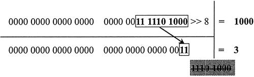

# 运算符与运算

## 运算符

JavaScript 定义了 47个运算符，另有 4 个存在争议的运算符。它们具有多重功能，在不同环境中可能会执行不同的操作，而且它们拥有更高的优先级（15级）。简单说明如下：

- `.（点号）`：读、写对象的属性，语法格式为“对象...属性”。
- `[]（中括号）`：读、写数组的元素，或者读、写对象的属性，语法格式为“数组[整数]”“对象['属性名称']”。
- `()（小括号）`：定义函数、调用函数、表达式分组等，常用语法格式为“函数(参数)”“(表达式)”。
- `new`：创建实例对象或者调用函数，语法格式为“new类型”“new函数”。

### 运算符的优先级

运算符的优先级决定执行运算的顺序。例如，1+2*3 结果是 7。而不是 9，因为乘法优先级高，虽然加号位于左侧。

使用小括号可以改变运算符的优先顺序。例如，(1+2)*3 结果是 9，而不是7。

在下面代码中，第二行与第三行返回结果相同，但是它们的运算顺序是不同的。第二行先计算 5 减 2，最后赋值给变量 n，并显示变量 n 的值；而第三行先计算 5 减 2，再把结果赋值给变量 n，最后变量 n 乘以 2 ，并显示两者所乘结果。

```javascript
console.log(n=5-2*2);  //返回1
console.log(n=(5-2)*2);  //返回6
console.log((n=5-2)*2);  //返回6
```

**注意：不正确的使用小括号也会引发异常。**

```javascript
console.log((1+n=5-2)*2);   //返回异常
```

在上面代码中，加号运算符优先级高，先执行加运算，但是此时的变量 n 还是一个未知数，所以就会抛出异常。

### 运算符的结合性

一元运算符、三元运算符和赋值运算符都是按照先右后左的顺序进行结合并运算。

在下面代码中，右侧的 typeof 运算符先与数字 5 结合，运算结果是字符串“number”，然后左侧的 typeof 运算符再与返回的字符串“number”结合，运算结果是字符串“string”。

```javascript
console.log(typeof typeof 5);  //返回“string”
```

其运算数序使用小括号表示如下：

```javascript
console.log(typeof (typeof 5));   //返回“string”
```

对于下面表达式，左侧加号先结合，1+2 等于 3；然后 3 与右侧加号结合，3+3 等于 6；6 再与右侧加号结合，6+4 等于 10；最后返回结果。

```javascript
1+2+3+4
```

其运算顺序使用小括号表示如下：

```javascript
((1+2)+3)+4
```

### 赋值运算符

赋值运算符左侧的操作数必须是变量、对象属性或数组元素，也称为左值。左值就是只能出现在赋值运算符左侧的值，在 JavaScript 中主要指变量、对象的属性、数组的元素。

例如，下面的写法是错误的，因为左侧的值是一个固定的值，不允许操作。

```javascript
1 = 100;  //返回错误
```

赋值运算有以下两种形式：

- 简单的赋值运算`=`：把等号右侧操作数的值直接复制给左侧的操作数，因此左侧操作数的值会发生变化。
- 附加操作的赋值运算：赋值之前先对右侧操作数执行某种操作，然后把运算结果复制给左侧操作数。

| 赋值运算符 | 说明                     | 示例     | 等效于      |
| ---------- | ------------------------ | -------- | ----------- |
| +=         | 加法运算或连接操作并赋值 | a += b   | a = a + b   |
| -=         | 减法运算并赋值           | a -= b   | a= a - b    |
| *=         | 乘法运算并赋值           | a *= b   | a = a * b   |
| /=         | 除法运算并赋值           | a /= b   | a = a / b   |
| %=         | 取模运算并赋值           | a %= b   | a = a % b   |
| <<=        | 左移位运算并赋值         | a <<= b  | a = a << b  |
| >>=        | 右移位运算并赋值         | a >>= b  | a = a >> b  |
| >>>=       | 无符号右移位运算并赋值位 | a >>>= b | a = a >>> b |
| &=         | 位与运算并赋值           | a &= b   | a = a & b   |
| \|=        | 位或运算并赋值           | a \|= b  | a = a \|= b |
| ^=         | 位异或运算并赋值         | a ^= b   | a = a ^ b   |

使用赋值运算符设计复杂的连续赋值表达式。

```javascript
var a = b = c = d = e = f = 100;  //连续赋值
//在条件语句的小括号内进行连续赋值
for((a = b = 1;a < 5;a++) {console.log(a + "" + b)};)
```

在下面表达式中，逻辑与左侧的操作数是一个赋值表达式，右侧的操作数也是一个赋值表达式。但是左侧赋的值是一个简单值，右侧是把一个函数赋值给变量b。

```javascript
var a;
console.log(a = 6 && (b = function(){
        return a;
    })()
);
```

在逻辑与运算中，左侧的赋值并没有真正的复制给变量 a，当逻辑与运算执行右侧的表达式时，该表达式是把一个函数赋值给变量 b，然后利用小括号运算符调用这个函数，返回变量 a 的值，结果并没有返回变量 a 的值 6，而是 undefined。

由于赋值运算作为表达式使用具有副作用，使用时要慎重，确保不会引发风险。对上面的表达式更安全的写法如下：

```javascript
var a = 6;  //定义并初始化变量a
b = function () {  //定义函数对象b
    return a;
}
console.log(a && b());  //逻辑与运算，根据a决定是否调用函数b
```

### 算术运算符

算术运算符包括：加`+`、减`-`、乘`*`、除`/`、求余运算符`%`、数值取反运算符`-`。

注意特殊操作数的求和运算。

```javascript
var n = 5;  //定义并初始化任意一个数值
console.log(NaN + n);  //NaN与任意操作数相加，结果都是NaN
console.log(Infinity + n);  //Infinity与任意操作数相加，结果都是Infinity
console.log(Infinity + Infinity);  //Infinity与Infinity相加，结果是Infinity
console.log((-Infinity) + (-Infinity));  //负Infinity相加，结果是负Infinity
console.log((-Infinity) + Infinity);  //正负Infinity相加，结果是NaN
```

加运算符能够根据操作数的数据类型，决定是相加操作，还是相连操作。

```javascript
console.log(1 + 1);  //如果操作数都是数值，则进行相加运算
console.log(1 + "1");  //如果操作数中有一个是字符串，则进行相连运算
console.log(3.0 + 4.3 + "");  //先求和，再连接，返回"7.3"
console.log(3.0 + "" + 4.3);  //3.0转换为字符串3，再连接，返回"34.3"
```

?> 在使用加法运算符时，应先检查操作数的数据类型是否符合需要。

注意特殊操作数的减法运算。

```javascript
var n = 5;  //定义并初始化任意一个数值
console.log(NaN - n);  //NaN与任意操作数相减，结果都是NaN
console.log(Infinity - n);  //Infinity与任意操作数相减，结果都是Infinity
console.log(Infinity - Infinity);  //Infinity与Infinity相减，结果是NaN
console.log((-Infinity) - (-Infinity));  //负Infinity相减，结果是NaN
console.log((-Infinity) - Infinity);  //正负Infinity相减，结果是-Infinity
```

在减法运算中，如果操作数为字符串，先尝试把它转换为数值，再进行运算。如果有一个操作数不是数字，则返回 NaN。

```javascript
console.log(2 - "1");  //返回1
console.log(2 - "a");  //返回NaN
```

?> 使用值减去 0，可以快速把值转换为数字。例如 HTTP 请求中查询字符串一般都是字符串型数字，可以先把这些参数值减去 0 转换为数值。这与调用 `parseFloat()` 方法的结果相同，但减法更高效、快捷。减法运算符的隐性转换如果失败，则返回 NaN，这与使用 `parseFloat()` 方法执行转换时的返回值是不同的。

例如，对于字符串“100aaa”而言，`parseFloat()` 方法能够解析出前面几个数字，而对于减法运算符来说，则必须是完整的数字，才可以进行转换。

```javascript
console.log(parseFloat("100aaa"));  //返回100
console.log("100aaa" - 0);  //返回NaN
```


对于布尔值来说，`parseFloat()` 方法能够把 true 转换为 1，把 false 转换为 0，而减法运算符视其为 NaN。

对于对象来说，`parseFloat()` 方法会尝试调用对象的 `toString()` 方法进行转换，而减法运算符先尝试调用对象的 `valueOf()` 方法进行转换，失败之后再调用 `toString()` 进行转换。

注意特殊操作数的乘法运算。

```javascript
var n = 5;  //定义并初始化任意一个数值
console.log(NaN * n);  //NaN与任意操作数相乘，结果都是NaN
console.log(Infinity * n);  //Infinity与任意非零正数相乘，结果都是Infinity
console.log(Infinity * (- n));  //Infinity与任意非零负数相乘，结果是-Infinity
console.log(Infinity * 0);  //Infinity与0相乘，结果是NaN
console.log(Infinity * Infinity);  //Infinity与Infinity相乘，结果是Infinity
```

注意特殊操作数的除法运算。

```javascript
var  n = 5;  //定义并初始化任意一个数值
console.log(NaN / n);  //如果一个操作数是NaN，结果都是NaN
console.log(Infinity / n);  //Infinity被任意数字除，结果是Infinity或-Infinity，符号由第二个操作数的符号决定
console.log(Infinity / Infinity);  //返回NaN
console.log(n / 0);  //0除一个非无穷大的数字，结果是Infinity或-Infinity，符号由第二个操作数的符号决定
console.log(n / -0);  //返回-Infinity，解释同上
```

**求余运算也称模运算**，例如：

```javascript
console.log(3 % 2);  //返回余数1
```

模运算主要针对整数进行操作，也适用于浮点数。例如：

```javascript
console.log(3.1 % 2.3);  //返回余数0.8000000000000003
```

注意特殊操作数的求余运算。

```javascript
var n = 5;  //定义并初始化任意一个数值
console.log(Infinity % n);  //返回NaN
console.log(Infinity % Infinity);  //返回NaN
console.log(n % Infinity);  //返回5
console.log(0 % n);  //返回0
console.log(0 % Infinity);  //返回0
console.log(n % 0);  //返回NaN
console.log(Infinity % 0);  //返回NaN
```

**取反运算符是一元运算符，也称一元减法运算符。**

注意特殊操作数的取反运算。

```javascript
console.log(- 5);  //返回-5。正常数值取负数
console.log(- "5");  //返回-5。先转换字符串数字为数值类型
console.log(- "a");  //返回NaN。无法完全匹配运算，返回NaN
console.log(- Infinity);  //返回-Infinity
console.log(- (- Infinity));  //返回Infinity
console.log(- NaN);  //返回NaN
```


与一元减法运算符相对应的是一元加法运算符，利用它可以快速把一个值转换为数值。

**递增`++`和递减`--`运算就是通过不断的加 1 或减 1，然后把结果赋值给左侧操作数，以实现改变自身结果的一种简洁方法。**

作为一元运算符，递增运算符和递减运算符职能作用于变量、数组元素或对象属性，不能作用于直接量。根据位置不同，可以分为 4 种运算方式：

- 前置递增（++n）：先递增，再赋值。
- 前置递减（--n）：先递减，再赋值。
- 后置递增（n++）：先赋值，再递增。
- 后置递减（n--）：先赋值，再递减。

下面比较递增和递减的 4 种运算方式所产生的结果。

```javascript
var a = b = c = 4;
console.log(a++);  //返回4，先赋值，再递增运算结果不变
console.log(++b);  //返回5，先递增，再赋值，运算结果加1
console.log(c++);  //返回4，先赋值，再递增，运算结果不变
console.log(c);  //返回5，变量的值加1
console.log(++c);  //返回6，先递增，再赋值，运算结果加1
console.log(c);  //返回6
```

?> 递增和递减是相反的操作，在运算之前都会试图转换值为数值类型，如果失败则返回 NaN。

### 比较运算符

**关系运算也称比较运算，需要两个操作数，运算返回值总是布尔值。**

比较大小的运算符有 4 个，说明如表所示。

| 大小运算符 | 说明                                                         |
| ---------- | ------------------------------------------------------------ |
| <          | 如果第一个操作数小于第二个操作数，则返回true；否则返回 false |
| <=         | 如果第一个操作数小于或等于第二个操作数，则返回true；否则返回 false |
| >=         | 如果第一个操作数大于或等于第二个操作数，则返回true；否则返回 false |
| >          | 如果第一个操作数大于第二个操作数，则返回true；否则返回 false |

**比较运算中的操作数可以是任意类型的值，但是在执行运算时，会被转换为数字或字符串，然后再进行比较。如果是数字，则比较大小；如果是字符串，则根据字符编码表中的编号值从左到右逐个比较每个字符。**

1) 如果两个操作数都是数字，或者一个是数值，另一个可以转换成数字，则将根据数字大小进行比较。

```javascript
console.log( 4 > 3 );
console.log("4" > Infinity );
```

2) 如果两个操作数都是字符串，则执行字符串比较。

```javascript
console.log("4" >"3");
console.log("a" > "b");
console.log("ab" >"cb");
console.log("abd" > "abc");
```

3) 如果一个操作数是数字，或者被转换为数字，另一个是字符串，或者被转换为字符串，则使用 `parseInt()` 将字符串转换为数字（对于非数字字符串，将被转换为 NaN），最后以数字方式进行比较。

4) 如果一个操作数为 NaN，或者被转换为 NaN，则始终返回 false。

```javascript
console.log("a" >"3");  //返回true，字符a编码为61，字符3编码为33
console.log("a" > 3);  //返回false，字符a被强制转换为NaN
```

5)如果一个操作数是对象，则先使用 `valueOf()` 取其值，再进行比较；如果没有 `valueOf()` 方法，则使用 `toString()` 取其字符串表示，再进行比较。

6) 如果一个操作数是布尔值，则先转换为数值，再进行比较。

7) 如果操作数都无法转换为数字或字符串，则比较结果为 false。

?> 字符比较是区分大小写的，一般小写字符大于大写字符。如果不区分大小写，则建议使用 `toLowerCase()` 或 `toUpperCase()` 方法把字符串统一为小写或大写形式之后再比较。

?> 为了设计可控的比较运算，建议先检测操作数的类型，主动转换类型。

### 等值检测运算符

等值检测运算符包括 4 个，详细说明如表所示。

| 等值检测运算符 | 说明                                                       |
| -------------- | ---------------------------------------------------------- |
| ==（相等）     | 比较两个操作数的值是否相等                                 |
| !=（不想等）   | 比较两个操作数的值是否不相等                               |
| ===（全等）    | 比较两个操作数的值是否相等，同时检测它们的类型是否相同     |
| !==（不全等）  | 比较两个操作数的值是否不相等，同时检测它们的类型是否不相同 |

在相等运算中，应注意以下几个问题：

- 如果操作数是布尔值，则先转换为数值，其中 false 转为 0，true 转换为 1。
- 如果一个操作数是字符串，另一个操作数是数字，则先尝试把字符串转换为数字。
- 如果一个操作数是字符串，另一个操作数是对象，则先尝试把对象转换为字符串。
- 如果一个操作数是数字，另一个操作数是对象，则先尝试把对象转换为数字。
- 如果两个操作数都是对象，则比较引用地址。如果引用地址相同，则相等；否则不等。

下面是特殊操作数的相等比较。

```javascript
console.log("1" == 1);  //返回true。字符串被转换为数字
console.log(true == 1);  //返回true。true被转换为1
console.log(false == 0);  //返回true。false被转换为0
console.log(null == 0);  //返回false
console.log(undefined == 0);  //返回false
console.log(undefined == null);  //返回true
console.log(NaN == "NaN");  //返回false
console.log(NaN ==1);  //返回false
console.log(NaN == NaN);  //返回false
console.log(NaN != NaN);  //返回true
```

NaN与任何值都不相等，包括它自己。null 和 undefined 值相等，但是它们是不同类型的数据。在相等比较中，null 和 undefined 不允许被转换为其他类型的值。

下面两个变量的值是相等的。

```javascript
var a = "abc" + "d";
var b = "a" + "bcd";
console.log(a == b);  //返回true
```

数值和布尔值的相等比较运算效率比较高，而字符串需要逐个字符进行比较，相等比较运算效率比较低。

在全等运算中，应注意以下几个问题：

- 如果两个操作数都是简单的值，则只要值相等，类型相同，就全等。
- 如果一个操作数是简单的值，另一个操作数是复合型对象，则不全等。
- 如果两个操作数都是复合型对象，则比较引用地址是否相同。

下面是特殊操作数的全等比较。

```javascript
console.log(null === undefined);  //返回false
console.log(0 === "0");  //返回false
console.log(0 === false);  //返回false
```

下面是两个对象的比较，由于它们都引用了相同的地址，所以返回 true。

```javascript
var a = {};
var b = a;
console.log(a === b);  //返回true
```

下面两个对象虽然结构相同，但是地址不同，所以不全等。

```javascript
var a = {};
var b = {};
console.log(a === b);  //返回false
```

对于复合型对象，主要比较引用的地址，不比较对象的值。

```javascript
var a = new String("abcd);  //定义字符串“abcd”对象
var b = new String("abcd);  //定义字符串“abcd”对象
console.log(a === b);  //返回false
console.log(a == b);  //返回false
```

在上面示例中，两个对象的值相等，但是引用地址不同，所以它们既不想等，也不全等。因此，对于复合型对象来说，相等`==`和全等`===`运算的结果是相同的。

对于简单的值，只要类型相同、值相等，它们就是全等，不考虑表达式运算的过程变化，也不用考虑变量的引用地址。

```javascript
var a = "1" + 1;
var b = "11";
console.log(a ===b);  //返回true
```

表达式（a>b || a==b）与表达式（a>=b）并不完全相等。

```javascript
var a = 1;
var b = 2;
console.log((a > b || a == b) == (a >= b));  //返回true，此时似乎相等
```

如果为变量 a 和 b 分别赋值 null 和 undefined，则返回值 false，说明这两个表达式并非完全等价。

```javascript
var a = null;
var b = undefined;
console.log((a > b || a == b) == (a >= b));  //返回false，表达式的值并非相等
```

因为 null == undefined 等于 true，所以表达式（a > b || a == b）的返回值为 true，但是表达式 null >= undefined 的返回值为 false。

### 对象操作运算符

**对象操作运算主要是针对对象、数组、函数这 3 类复合型对象执行某种程序，设计的运算符包括 `in`、`instanceof`、`delete`。**

**`in`运算符能够检测左侧操作数是否为右侧操作数的成员。其中，左侧操作数是一个字符串，或者可以转换为字符串的表达式，右侧操作数是一个对象或数组。**

下面代码使用 in 运算符检测属性 a、b、c、valueOf 是否为对象 o 的成员。

```javascript
var o = {  //定义对象
    a : 1,  //定义属性a
    b : function() {}  //定义方法b
}
console.log("a" in o);  //返回true
console.log("b" in o);  //返回true
console.log("c" in o);  //返回false
console.log("valueOf" in o);  //返回true，继承Object的原型方法
console.log("constructor" in o);  //返回true，继承Object的原型属性
```

**`instanceof` 运算符能够检测左侧的对象是否为右侧类型的示例。**

下面代码使用 instanceof 检测数组 a 是否为 Array、Object 和 Function 的示例。

```javascript
var a = new Array();  //定义数组
console.log(a instanceof Array);  //返回true
console.log(a instanceof Object);  //返回true，Array是Object的子类
console.log(a instanceof Function);  //返回false
```

?> 如果左侧操作数不是对象，或者操作数不是类型函数，则返回 false。如果右侧操作数不是复合型对象，则将返回错误。

**`delete` 运算符能够删除指定对象的属性、数组元素或变量。如果删除操作成功，则返回 true；否则返回 false。**

下面代码使用 delete 运算符删除对象 a 的属性 x。

```javascript
var a = {  //定义对象a
    x : 1,  //定义对象成员
    y : 2  //定义对象成员
};
console.log(a.x);  //调用对象成员，返回1
console.log(delete a.x);  //删除对象成员x成功，返回true
console.log(a.x);  //返回undefined，没有找到该对象成员
```

部分 JavaScript 内置成员和客户端成员，以及使用 var 语句声明的变量不允许删除。

```javascript
c = 1;  //初始化变量c，没有使用var语句声明
console.log(delete c);  //返回true，说明删除成功
var b = 1;  //使用var语句声明并初始化变量
console.log(delete b);  //返回false，说明不允许删除
console.log(delete Object.constructor);  //返回true，说明部分内部成员可以被删除
```

如果删除不存在的对象成员、数组元素、变量，则返回 true。因此，使用 delete 运算符时，要注意区分成功删除与无效操作。

```javascript
var s = {};  //定义对象a
console.log(delete a);  //返回false，说明不允许删除
console.log(delete a.z);  //返回true，说明不存在该属性
console.log(delete b);  //返回true，说明不存在该变量
```

下面代码使用 delete 运算符，配合 in 运算符，实现对数组成员执行检测、插入、删除或更新操作。 

```javascript
var a = [];  //定义数组对象
if("x" in a){  //如果对象a中存在x 
    delete a["x"];  //则删除成员x
}else{  //如果不存在成员x
    a["x"] = true;  //则插入成员x，并为其赋值true
}
console.log(a.x);  //返回true。查看成员x的值
if(delete a["x"]){  //如果删除成员x成功
    a["x"] = false;  //更新成员x的值为false
}
console.log(a.x);  //返回false。查看成员x的值
```

### 逻辑位运算符

**位运算就是对二进制数执行计算，是整数的逐位运算。例如，1+1=2，在十进制计算中是正确的，但是在二进制计算中，1+1=10；对于二进制数 100 取反，等于 001，而不是 -100。**

位运算符有 7 个，分为两类：

- 逻辑位运算符：位与（&）、位或（|）、位异或（^）、非位（~）
- 移位运算符：左移（<<）、右移（>>）、无符号右移（>>>）

逻辑位运算符与逻辑运算符的运算方式是相同的，但是针对的对象不同。逻辑位运算符针对的是二进制的整数值，而逻辑运算符针对的是非二进制的值。

**“&”运算符（位与）用于对两个二进制操作数逐位进行比较，并根据下表所示的换算表返回结果。在位运算中，数值 1 表示 true，0 表示 false，反之亦然。**

| 第一个数的位值 | 第二个数的位值 | 运算结果 |
| -------------- | -------------- | -------- |
| 1              | 1              | 1        |
| 1              | 0              | 0        |
| 0              | 1              | 0        |
| 0              | 0              | 0        |

12 和 5 进行位与运算，则返回值为 4。

```javascript
console.log(12 & 5);  //返回值4
```

下图以算式的形式解析了 12 和 5 进行位与运算的过程。通过位与运算，只有第 3 位的值为全为 true，故返回 true，其他位均返回 false。


**“|”运算符（位或）用于对两个二进制操作数逐位进行比较，并根据如表格所示的换算表返回结果。**

| 第一个数的位值 | 第二个数的位值 | 运算结果 |
| -------------- | -------------- | -------- |
| 1              | 1              | 1        |
| 1              | 0              | 1        |
| 0              | 1              | 1        |
| 0              | 0              | 0        |

12 和 5 进行位或运算，则返回值为 13。

```javascript
console.log(12 | 5);  //返回值13
```


下图以算式的形式解析了 12 和 5 进行位或运算的过程。通过位或运算，除第 2 位的值为 false 外，其他位均返回 true。


**“^”运算符（位异或）用于对两个二进制操作数逐位进行比较，并根据如表格所示的换算表返回结果。**

| 第一个数的位值 | 第二个数的位值 | 运算结果 |
| -------------- | -------------- | -------- |
| 1              | 1              | 0        |
| 1              | 0              | 1        |
| 0              | 1              | 1        |
| 0              | 0              | 0        |

12 和 5 进行位异或运算，则返回值为 9。

```javascript
console.log(12 ^ 5);  //返回值9
```


下图以算式的形式解析了 12 和 5 进行位异或运算的过程。通过位异或运算，第 1、4 位的值为 true，而第 2、3 位的值为 false。


**“~”运算符（位非）用于对一个二进制操作数逐位进行取反操作。**

- 第 1 步：把运算数转换为 32 位的二进制整数。
- 第 2 步：逐位进行取反操作。
- 第 3 步：把二进制反码转换为十进制浮点数。

对 12 进行位非运算，则返回值为 -13。

```javascript
console.log( ~ 12 );  //返回值-13
```

下图以算式的形式解析了对 12 进行位非运算的过程。


位非运算实际上就是对数字进行取负运算，再减 1。例如：

```javascript
console.log( ~ 12 == 12-1);  //返回true
```

### 移位运算符

**移位运算就是对二进制进行有规律低移位。移位运算可以设计很多奇妙的效果，在图形图像编程中应用广泛。**

**“<<”运算符执行左移位运算。在移位运算过程中，符号位始终保持不变。如果右侧空出位置，则自动填充为 0；超出 32 位的值，则自动丢弃。**

把数字 5 向左移动 2 位，则返回值为 20。

```javascript
console.log(5 << 2);  //返回值20
```


**“>>”运算符执行有符号右移位运算。与左移运算操作相反，它把 32 位数字中的所有有效位整体右移，再使用符号位的值填充空位。移动过程中超出的值将被丢弃。**

把数值 1000 向右移 8 位，则返回值为 3。

```javascript
console.log(1000 >> 8);  //返回值3
```



把数值 -1000 向右移 8 位，则返回值为 -4。

```javascript
console.log(-1000  >> 8);  //返回值 -4
```

当符号位值为 1 时，则有效位左侧的空位全部使用 1 进行填充。


**“>>>”运算符执行五符号右移位运算。它把无符号的 32 位整数所有数位整体右移。对于无符号数或正数右移运算，无符号右移与有符号右移运算的结果是相同的。**

下面两行表达式的返回值是相同的。

```javascript
console.log(1000 >> 8);  //返回值3
console.log(1000 >>> 8);  //返回值3
```

对于负数来说，无符号右移将使用 0 来填充所有的空位，同时会把负数作为正数来处理，所得结果会非常大所以，使用无符号右移运算符时要特别小心，避免意外错误。

```javascript
console.log(-1000 >> 8);  //返回值 -4
console.log(-1000 >>> 8);  //返回值 16777212
```

左侧空位不再用符号位的值来填充，而是用 0 来填充。


### 条件运算符

**条件运算符是唯一的三元运算符**，其语法格式如下：`b ? x : y`

b 操作数必须是一个布尔型的表达式，x 和 y 是任意类型的值。

- 如果操作数 b 的返回值为 true，则执行 x 操作数，并返回该表达式的值。
- 如果操作数 b 的返回值为 false，则执行 y 操作数，并返回该表达式的值。

定义变量 a，然后检测 a 是否被赋值，如果赋值则使用该值；否则设置默认值。

```javascript
var a = null;  //定义变量a
typeof a != "undefined" ? a = a : a = 0;  //检测变量a是否赋值，否则设置默认值
console.log(a);  //显示变量a的值，返回null
```

条件运算符可以转换为条件结构：

```javascript
if(typeof a != "undefined"){  //赋值
    a = a;
}else{  //没有赋值
    a = 0;
}
console.log(a);
```

也可以转换为逻辑表达式：

```javascript
(typeof a != "undefined") && (a =a) || (a = 0);  //逻辑表达式
console.log(a);
```

在上面表达式中，如果 a 已赋值，则执行 (a = a) 表达式，执行完毕就不再执行逻辑或运算符后面的 (a = 0) 表达式；如果 a 未赋值，则不再执行逻辑与运算符后面的 (a = a) 表达式，转而执行逻辑或运算符后面的表达式 (a = 0)。

!> 在实战中需要考虑假值的干扰。使用 typeof a != "undefined" 进行检测，可以避开变量赋值为 false、null、""、NaN等假值时，也被误认为没有赋值。

### 逗号运算符

**逗号运算符是二元运算符，它能够先执行运算符左侧的操作数，然后再执行右侧的操作数，最后返回右侧操作数的值。**

逗号运算符可以实现连续运算，如多个变量连续赋值。

```javascript
var a = 1,b = 2,c = 3,d = 4;
```

等价于：

```javascript
var a = 1;
var b = 2;
var c = 3;
var d = 4;
```

?> 与条件运算符、逻辑运算符根据条件来决定是否执行所有或特定操作数不同的是，逗号运算符会执行所有的操作数，但并非返回所有操作数的结果，它只返回最后一个操作数的值。

在下面代码中，变量 a 的值是逗号运算之后，通过第二个操作数 c=2 的执行结果赋值得到的。第一个操作数的执行结果没有返回，但是这个表达式被执行了。

```javascript
a = (b = 1,c = 2);  //连续执行和赋值
console.log(a);  //返回2
console.log(b);  //返回1
console.log(c);  //返回2
```

?> 逗号运算符可以作为仅需执行表达式的工具，这些表达式不需要返回值，但必须要运算。在特定环境中，可以在一个表达式中包含多个子表达式，通过逗号运算符让它们全部执行，而不用返回结果。

for 循环结构的小括号内包含 3 个表达式，第一个表达式为初始化值，第二个表达式为检测条件，第三个表达式为递增表达式。使用逗号运算符可以在 3 个表达式中添加多个额外的计算任务，但要确保第二个表达式的最后一个子表达式返回一个可控布尔值，否则会导致死循环。

```javascript
for(var a = 1,b = 10,c = 100;++ c,a < b;a ++,c --){
    console.log(a * c);
}
```

逗号运算符的优先级是最低的。在下面代码中，赋值运算符优先于逗号运算符，也就是说数值 1 被赋值给变量 b 之后，继续赋值给变量 a，最后才执行逗号运算符。

```javascript
a = b = 1,c = 2;  //连续执行和赋值
console.log(a);  //返回1
console.log(b);  //返回1
console.log(c);  //返回2
```

### void运算符

**void 是一元运算符，它可以出现在任意类型的操作数之前执行操作数，却忽略操作数的返回值，返回一个 undefined。void 常用语 HTML 脚本中执行 JavaScript 表达式，但不需要返回表达式的计算结果。**

在下面代码中，使用 void 运算符让表达式返回 undefined。

```javascript
var a = b = c = 2;  //定义并初始化变量的值
d = void (a -= (b *= (c += 5)));  //执行void运算符，并把返回值赋予变量d
console.log(a);  //返回-12
console.log(b);  //返回14
console.log(c);  //返回7
console.log(d);  //返回undefined
```

由于 void 运算符的优先级比较高（14），高于普通运算符的优先级，所以在使用时应该使用小括号明确 void 运算符操作的操作数，避免引发错误。

在下面两行代码中，由于第一行代码没有使用小括号运算符，则 void 运算符优先执行，返回值 undefined 再与 1 执行减法运算，所以返回值为 NaN。在第二行代码中由于使用小括号运算符明确 void 的操作数，减法运算符先被执行，然后执行 void 运算，最后返回值是 undefined。

```javascript
console.log(void 2 - 1);  //返回NaN
console.log(void (2 - 1));  //返回undefined
```

void 运算符也能像函数一样使用，如 void(0) 也是合法的。在特殊环境下一些复杂的语句可能不方便使用 void 运算符，而必须使用 void 函数。

```javascript
console.log(void (i = 0));  //返回undefined
console.log(void (i = 0;i++));  //返回undefined
```

### 括号和点号

**使用中括号运算符`[]`可以存取数组元素值，使用点运算符`.`可以存取对象属性值。**其语法格式如下：

```
a.b //点运算符的用法
c[b] //中括号运算符的用法

操作数 a 表示对象，操作数 b 表示属性名。如果属性值是函数，应增加小括号，实现方法调用操作。注意，操作数 b 是不能使用字符串或字符串表达式的。

操作数 c 可以是数组，也可以是对象。具体说明如下：

- 如果左侧操作数是数组，则中括号包含的操作数应是一个值为非负整数的表达式，作为下标值，用来指定元素在数组中的位置。
- 如果左侧操作数是对象，则中括号包含的操作数应是一个值为字符串的表达式，映射对象的属性名。

中括号和点号应该属于运算符范畴，但是新版本 JavaScript 把它们视为语言核心命令来使用。

使用中括号运算符`[]`不仅可以存取数组元素的值，也可以存取对象属性值。
1) 存取数组元素的值。

```javascript
var a = [1,"x",true,{}];  //定义数组a
console.log(a[1]);  //读取第二个元素的值，返回字符串"x"
a[3] = false;  //为第4个元素写入false值
console.log(a[3]);  //第四个元素原来的值被覆盖，返回false
```

2) 存取对象属性的值。

```javascript
var a = {  //定义对象a
    x : 1,  //定义对象属性x
    y : function() {  //定义对象方法y
        return 2;  //返回值
        }
};
console.log(a["y"] ());  //调用方法y，返回2
a["x"] = 3;  //重置属性x的值
console.log(a["x"]);  //读取属性x的值，返回3
```

使用点运算符`.`可以存取对象属性的值，它比中括号灵活、方便，因为点运算符右侧可以直接指定属性名称，而不是属性名称的字符串。

```javascript
var a = {x : 1};  //定义对象a
console.log(a.x);  //返回1。读取对象属性a的值
a.x = 2; //重写对象属性a的值
console.log(a.x);  //返回2。再次读取对象属性a的值
```

对于中括号运算符，可以通过变量或字符串表达式来传递特定值。

```javascript
var b = "x";  //把属性x的标识符名作为字符串存储在变量b中
var a = {x : 1};  //定义对象a
console.log(a[b]);  //返回1。通过变量间接获取对象a的属性x的值
console.log(a.b);  //返回undefined。点运算符无法识别变量引用
```

下面两种方法都可以读取数组 a 的第二个元素值。虽然说 a["1"] 中参数是一个字符串，但是中括号运算符能够把它转换为数字。

```javascript
var a = ["x",true,{}];  //定义数组
console.log(a[1]);  //返回true
console.log(a["1"]);  //返回true
```

如果中括号运算符的第二个操作数为对象，会调用 toString() 方法把对象转换为字符串表示。如果是布尔值 true 和 false，将被转换为字符串 "true" 和 "false"，而不是 1 和 0。

```javascript
var a = {  //定义对象
    "true" : 1,  //定义属性“true”
    "false" : 0  //定义属性“false”
}
console.log(a[true]);  //返回1。把布尔值true转换为字符串“true”
console.log(a[false]);  //返回0。把布尔值false转换为字符串“false”
```

在不确定对象属性时，使用中括号运算符来遍历对象属性会很方便，但如果使用点运算符则容易引发异常。下面代码使用中括号运算符变量客户端 window 对象的所有属性以及属性值。

```javascript
for(o in window){
    document.write("window." + o + "=" + window[o] + "<br />");
}
```

### new运算符

**new 是一个运算符，可以创建对象，初始化实例。其语法格式如下：`new contructor(arguments)`**

**constructor 必须是一个构造函数表达式，参数 arguments 可有可无，参数之间用逗号分隔。如果没有逗号，可以省略小括号。**

在最新的参考资料中，new 已从运算符列表中被移出，作为命令使用，扮演多重角色。

下面代码使用 new 运算符实例化 Array，并演示 3 种不同的使用方法。

```javascript
var a = new Array;  //创建数组，省略小括号
var b = new Array();  //创建数组
var c = new Array(1,2,3);  //创建数组，并初始化元素值
console.log(c[2]);  //读取创建数组对象的元素值，返回3
```

new 被执行时，首先会创建一个新对象，然后调用指定的构造函数，并根据传入参数初始化实例最后把初始化的实例传递给新对象。

下面代码自定义类，然后使用它创建新的对象。

```javascript
var a = function(){  //自定义类型函数a
    this.x = 1;  //属性x
    this.y = 2;  //属性y
};
var b = new a;  //创建对象
console.log(b.x);  //调用对象属性x，返回1
```

### 副作用

运算符一般不会对操作数本身产生影响。例如，a=b+c，其中的操作数 b 和 c 不会因为加法运算而导致自身的值发生变化。不过，具有赋值功能的运算符能够改变操作数的值，进而潜在干扰程序的运行状态，并可能对后面的运算造成影响，因此具有一定的副作用，使用时应该保持警惕。具体说明如下：

- 赋值运算符`=`
- 附加操作的赋值运算符如`+=`、`%=`等
- 递增`++`或递减`--`运算符
- delete运算符（功能等同于赋值 undefined）

在下面代码中，变量 a 经过赋值运算和递加运算后，其值发生了两次变化。

```javascript
var a = 0;
a++;
console.log(a);  //返回1
```

在下面代码中，变量 a 在参与运算的过程中，其值不断的被改写，显然这个程序干扰了程序的正常运行结果。

```javascript
var a = 1;
a = (a++) + (++a) - (a++) - (++a);  //返回-4
```

拆解 (a++) + (++a) - (a++) - (++a) 表达式如下：

```javascript
var a = 1;
b = a++;
c = ++a;
d = a++;
e = ++a;
console.log(b+c-d-e);
```

从可读性考虑，在一个表达式中最好不要对同一个操作数执行两次或多次赋值运算。

下面代码由于每个操作数仅执行了一次赋值运算，所以不会引发歧义，也不会干扰后续运算。

```javascript
a = (b++) + (++c) - (d++) - (++e);
console.log(a);  //返回-4
```

## 操作数

### 操作数的个数

一般情况下，运算符与操作数配合才能使用。其中，运算符指定执行运算的方式，操作数提供运算的内容。例如，1 加 1 等于 2，用表达式表示就是“n=1+1”。其中，1 是被操作的数，符号`+`表示两个值相加的运算，符号`=`表示赋值运算，n 表示接受赋值的变量。

不同的运算符需要配合的操作数的个数不同，可以分为以下 3 类：

- 一元运算符：一个操作符仅对一个操作数执行某种运算，如取反、递加、递减、转换数字、类型检测、删除属性等运算。
- 二元运算符：一个运算符必须包含两个操作数。例如，两个数相加、两个值比较大。大部分运算符都需要操作数配合才能够完成运算。
- 三元运算符：一个运算符必须包含三个操作数。JavaScript 中仅有一个三元运算符——条件运算符`?:`（if语句的简化形式）。

### 操作数的类型

运算符操作的数据并不是随意的，大部分都有类型限制。例如加、减、乘、除四则运算要求参与的操作数必须是数值，逻辑运算要求参与的操作数必须是布尔值。另外，每个运算符执行运算之后，都会有明确的返回类型。

?> JavaScript 能够根据运算环境自动转换操作数的类型，以便完成运算任务。

在下面代码中，两个操作数都是字符串，于是 JavaScript 自动把它们转换为数字，并执行减法运算，返回数字结果。

```javascript
console.log("10"-"20");  //返回-10
```

在下面代码中，数字 0 本是数值类型，JavaScript 会把它转换为布尔值 false，然后再执行条件运算。

```javascript
console.log(0 ? 1 : 2);  //返回2
```

在下面代码中，字符串 5 被转换为数字，然后参与大小比较运算，并返回布尔值。

```javascript
console.log(3 > "5");  //返回false
```

在下面代码中，数字 5 被转换为字符编码，参与字符串的顺序比较运算。

```javascript
console.log("a" > 5);  //返回false
```

在下面代码中，加号运算符能够根据数据类型执行相加或者相连运算。

```javascript
console.log(10 + 20);  //返回30console.log("10" + "20");  //返回"1020"
```

在下面代码中，布尔值 true 被转换为数字 1，参与乘法运算，并返回 5。

```javascript
console.log(true * "5");  //返回5
```

## 运算

**null 和 undefined 属于两种不同类型，使用全等运算符（===）或 typeof 运算符可以进行检测。**

```javascript
NaN === NaN //false
NaN !== NaN //true
```

null 和 undefined 都表示空缺的值，转化为布尔值时都是假值，可以相等。

```javascript
console.log(null == undefined);  //返回 true
```

如果直接在表达式中使用未声明的变量 b ，会引发异常。

```javascript
console.log(b == undefined); //b未定义的错误信息
```

逻辑运算又称布尔代数，就是布尔值（true 和 false）的“算数”运算。逻辑运算符包括：逻辑与`&&`、逻辑或`||`和逻辑非`!`。

### 逻辑与运算

**逻辑与运算（&&）是 AND 布尔操作。只有两个操作数都为 true 时，才返回 true，否则返回 false。**具体描述如表所示。

| 第一个操作数 | 第二个操作数 | 运算结果 |
| ------------ | ------------ | -------- |
| true         | true         | true     |
| true         | false        | false    |
| false        | true         | false    |
| false        | false        | false    |

逻辑与是一种短路逻辑，如果左侧表达式为 false，则直接短路返回结果，不再运算右侧表达式。运算逻辑如下：

- 第 1 步：计算第一个操作数（左侧表达式）的值。
- 第 2 步：检测第一个操作数的值。如果左侧表达式的值可转换为 false（如 null、undefined、NaN、0、""、false），那么就会结束运算，直接返回第一个操作数的值。
- 第 3 步：如果第一个操作数可以转换为 true，则计算第二个操作数（右侧表达式）的值。
- 第 4 步：返回第二个操作数的值。

下面代码利用逻辑与运算检测变量并进行初始化。

```javascript
var user;  //定义变量
(! user && console.log("没有赋值"));  //返回提示信息“没有赋值”
```

等效于：

```javascript
var user;  //定义变量
if (! user){  //条件判断
    console.log("变量没有赋值");
}
```

如果变量 user 的值为 0 或空字符串等假值转换为布尔值时，则为 false，那么当变量赋值之后，依然提示变量没有赋值。因此，在设计时必须确保逻辑与左侧的表达式返回值是一个可以预测的值。

```javascript
var user = 0;  //定义并初始化变量
(! user && console.log("变量没有赋值"));  //返回提示信息“变量没有赋值”
```

右侧表达式不应该包含赋值、递增、递减和函数调用等有效运算，因为当左侧表达式为 false 时，则直接跳过右侧表达式，会给后面的运算带来潜在影响。

使用逻辑与运算符可以代替设计多重分支结构。

```javascript
var n = 3;
(n == 1) && console.log(1);
(n == 2) && console.log(2);
(n == 3) && console.log(3);
( ! n ) && console.log("null");
```

上面代码等效于下面多重分支结构。

```javascript
var n = 3;
switch(n){
    case1:
        console.log(1);
        break;
    case2:
        console.log(2);
        break;
    case3:
        console.log(3);
        break;
    default:
        console.log("null");
```

逻辑与运算的操作数可以是任意类型的值，并返回原始表达式的值，而不是把操作数转换为布尔值再返回。

1) 对象被转换为布尔值时为 true。例如，一个空对象与一个布尔值进行逻辑与运算。

```javascript
console.log(typeof ({} && true));  //返回第二个操作数的值true的类型：布尔型
console.log(typeof (true && {}));  //返回第二个操作数的值{}的类型：对象
```

2) 如果操作数中包含 null，则返回值总是 null。例如，字符串 "null" 与 null 类型值进行逻辑与运算，不管位置如何，始终都返回 null。

```javascript
console.log(typeof ("null" && null));  //返回null的类型：对象console.log(typeof (null && "null"));  //返回null的类型：对象
```

3) 如果操作数中包含 NaN，则返回值总是 NaN。例如，字符串 "NaN" 与 NaN 类型值进行逻辑与运算，不管位置如何，始终都返回 NaN。

```javascript
console.log(typeof ("NaN" && NaN));  //返回NaN的类型：数值console.log(typeof (NaN && "NaN"));  //返回NaN的类型：数值
```

4) 对于 Infinity 来说，将被转换为 true，与普通数值一样参与逻辑与运算。

```javascript
console.log(typeof ("Infinity" && Infinity));  //返回第二个操作数Infinity的类型：数值
console.log(typeof (Infinity && "Infinity"));  //返回第二个操作数"Infinity"的类型：字符串
```

5) 如果操作数中包含 undefined，则返回 undefined。例如，字符串 "undefined" 与 undefined 类型值进行逻辑与运算，不管位置如何，始终都返回 undefined。

```javascript
console.log(typeof ("undefined" && undefined));  //返回undefined
console.log(typeof (undefined && "undefined"));  //返回undefined
```

### 逻辑或运算

**逻辑或运算`||`是布尔 OR 操作。如果两个操作数都为 true，或者其中一个为 true，就返回 true，否则就返回 false。**

| 第一个操作数 | 第二个操作数 | 运算结果 |
| ------------ | ------------ | -------- |
| true         | true         | true     |
| true         | false        | true     |
| false        | true         | true     |
| false        | false        | false    |

逻辑或也是一种短路逻辑，如果左侧表达式为 true，则直接短路返回结果，不再运算右侧表达式。运算逻辑如下：

- 第 1 步：计算第一个操作数（左侧表达式）的值。
- 第 2 步：检测第一个操作数的值。如果左侧表达式的值可转换为 true，那么就会结束运算，直接返回第一个操作数的值。
- 第 3 步：如果第一个操作数可以转换为 false，则计算第二个操作数（右侧表达式）的值。
- 第 4 步：返回第二个操作数的值。

针对下面 4 个表达式：

```javascript
var n = 3;
(n == 1) && console.log(1);
(n == 2) && console.log(2);
(n == 3) && console.log(3);
( ! n ) && console.log("null");
```

可以使用逻辑或对其进行合并：

```javascript
var n = 3;
(n == 1) && console.log(1) || 
(n == 2) && console.log(2) || 
(n == 3) && console.log(3) || 
( ! n ) && console.log("null");
```

由于`&&`运算符的优先级高于`||`运算符的优先级，所以不必使用小括号进行分组。不过使用小括号分组后，代码更容易阅读。

```javascript
var n = 3;
((n == 1) && console.log(1)) ||
((n == 2) && console.log(2)) ||
((n == 3) && console.log(3)) ||
(( ! n ) && console.log("null")) ||
```

逻辑与和逻辑或运算符具有以下 2 个特点：

- 在逻辑运算过程中，临时把操作数转换为布尔值，然后根据布尔值决定下一步的操作，但是不会影响操作数的类型和最后返回结果。
- 受控于第一个操作数，可能不会执行第二个操作数。

在下面条件分支中，由于 a="string" 操作数可以转换为 true，则逻辑或运算就不再执行右侧的定义对象表达式。最后 console.log(b.a); 语句抛出异常。

```javascript
if(a = "string" || (b = {
    a : "string"
    })
) console.log(b.a);  //调用b的属性a
```

如果使用逻辑与运算，就可以避免上述问题。

```javascript
if(a = "string" && (b = (
    a : "string"
    })
) console.log(b.a);  //调用b的属性a，返回字符串“string”
```

下面代码设计了一个复杂的嵌套结构，根据变量 a 决定是否执行下一个循环。

```javascript
var a = b = 2;  //定义并连续初始化
if(a){  //条件结果
    while(b ++ < 10){  //循环结构
        console.log(b++);  //循环执行语句
    }
)
```

使用逻辑与和逻辑或运算符进行简化：

```javascript
var a = b = 2;  //定义并连续初始化
while(a && b ++ < 10) console.log(b++);  //逻辑与运算符合并的多条件表达式
```

如果转换为如下嵌套结构就不能够继续使用上述表达式进行简化，因为下面的代码时先执行循环体，后执行条件检测。

```javascript
while(b ++ < 10){  //先执行循环
    if(a){  //再判断条件
        console.log(b++);
    }
}
```

### 逻辑非运算

**逻辑非运算`!`是布尔取反操作（NOT）。作为一元运算符，直接放在操作数之前，把操作数的值转换为布尔值，然后取反并返回。**

下面列举一些特殊操作数的逻辑非运算返回值。

```javascript
console.log( ! {} );  //如果操作数是对象，则返回false
console.log( ! 0 );  //如果操作数是0，则返回true
console.log( ! (n = 5));  //如果操作数是非零的任何数字，则返回false
console.log( ! null );  //如果操作数是null，则返回true
console.log( ! NaN );  //如果操作数是NaN，则返回true
console.log( ! Infinity );  //如果操作数是Infinity，则返回false
console.log( ! ( - Infinity ));  //如果操作数是-Infinity，则返回false
console.log( ! undefined );  //如果操作数是undefined，则返回true
```

如果对操作数执行两次逻辑非运算操作，就相当于把操作数转换为布尔值。

```javascript
console.log( ! 0 );  //返回true
console.log( ! ! 0 );  //返回false
```

逻辑与和逻辑或运算的返回值不必是布尔值，但是逻辑非运算的返回值一定是布尔值。

### 连续运算

JavaScript 是函数式编程语言，表达式运算的能力比较强大，通过连续运算可以设计敏捷的程序代码。

最常用的是连续赋值运算。

```javascript
var a = b = c = 1;
```

上面代码相当于声明 3 个变量，并全部初始化值为 1。

条件运算符在连续运算中扮演者重要的角色，它可以把复杂的分支结构浓缩到一个表达式中。例如，在事件处理函数中，经常会用下面表达式处理事件对象兼容问题。

```javascript
event ? event : window.event;
```

拆分为分支结构：

```javascript
if(event){
    event = event;  //如果支持event参数，则直接使用event
}else{
    event = window.event;  //否则调用window对象event属性
}
```

下面使用条件运算符设计多重分支结构。

```javascript
var a = ((a == 1) ? console.log(1)) :  //如果a等于1，则提示1
              (a == 2) ? console.log(2) :  //如果a等于2，则提示2
              (a == 3) ? console.log(3) :  //如果a等于3，则提示3
              (a == 4) ? console.log(4) :  //如果a等于4，则提示4
    console.log(undefined)  //否则提示undefined
);
```

拆分为多重分支结构：

```javascript
switch(a) {
    case 1 :
        console.log(1);
        break;
    case 2 :
        console.log(2);
        break;
    case 3 :
        console.log(3);
        break;
    case 4 :
        console.log(4);
        break;
    default:
        console.log(undefined);
```

对于复合型数据——对象、数组、函数，都可以作为操作数，参与表达式运算。例如，对于下面的操作：先定义函数，再调用函数。

```javascript
var f = function(x,y){  //定义匿名函数
    return (x+y) / 2;
}
console.log(f(10,20));调用匿名函数
```


使用表达式表示：

```javascript
console.log(
    (function(x,y){
        return (x+y) / 2;
    }) (10,20)  //直接调用匿名函数
);  //返回值15
```

通过小括号连续调用，使用表达式可以设计多层嵌套的函数结构。

```javascript
console.log(
    (function() {
        return function(x,y) {
            return function() {
                return (x+y) /2;
            }
        }
    }) () (10,20) ()  //连续3次运算
);  //返回值15
```

如果转换为命令式语句，则代码如下：

```javascript
var f = function() {
    return function(x,y) {
        return function() {
            return (x+y) /2;
        }
    }
}
var f1 = f();  //第一次调用外层函数
var f2 = f1(10,20);  //第二次调用中层函数
var f3 = f2();  //第三次调用内层函数
console.log(f3);  //返回值15
```

下面示例演示如何使用表达式创建对象。

```javascript
var o = typeof 56;  //返回数值56的类型
console.log(
    (new (  //根据多条件运算式返回值创建
        (o == "string") ? String :
        (o == "number") ? Number :
        (o == "boolean") ? Boolean :
        (o == "array") ? Array:
        Object
        )
    ).toString()  //把创建的对象转换为字符串返回
);
```

上面代码使用条件运算符的嵌套，连续判断变量 o 的值，然后使用 new 创建对象，最后通过点运算符调用 toString() 方法把新创建的对象转换为字符串并返回。

如果使用逻辑运算符，可以进一步浓缩表达式。代码如下：

```javascript
console.log((new ((o == "string") ? String : (o == "number") ? Number : (o == "boolean") ? Boolean : (o == "array") ? Array : Object)).toString();
```