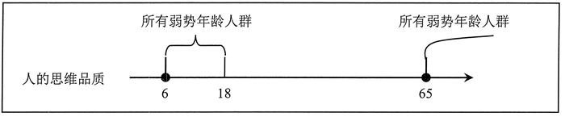
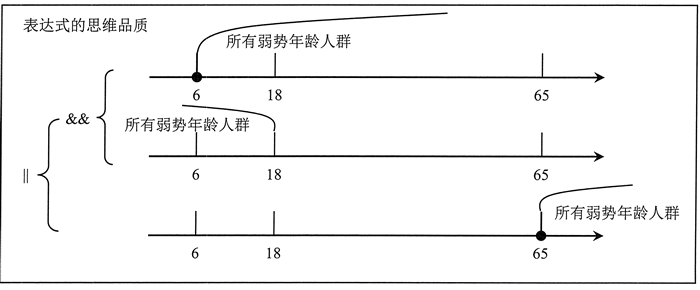

# 表达式

在语法概念中，运算符属于词，表达式属于短语。表达式由一个或多个运算符、操作数组成的运算式。表达式的功能是执行计算，并返回一个值。

## 表达式的形式

表达式是一个比较富有弹性的运算单元。简单的表达式就是一个直接量、常量或变量。例如：

```javascript
1  //数值直接量，计算后返回数值 1
"string"  //字符串直接量，计算后返回字符串“string”
false  //布尔直接量，计算后返回布尔值false
null  //特殊值直接量，计算后返回直接量null
/regexp/  //正则直接量，计算后返回正则表达式对象
{a : 1,b : "1"}  //对象直接量，计算后返回对象
[1,"1"]  //数组直接量，计算后返回数组
function(a,b){return a+b}  //函数直接量，计算后返回函数
a  //变量，计算后返回变量的值
```

它们是最原始的表达式，一般很少单独使用。

使用运算符把一个或多个简单的表达式连接起来，可以构成复杂的表达式。复杂的表达式还可以嵌套组成更复杂的表达式。但是，不管表达式的形式多么复杂，最后都要求返回一个唯一的值。

## 表达式的类型

根据功能的不同，表达式可以分为很多类型。常用类型说明如下：
1) 定义表达式，如定义变量、定义函数。

```javascript
var a = [];
var f = function(){};
```

2) 初始化表达式，与定义表达式和赋值表达式常常混用。

```javascript
var a = [1,2];
var o = {x :1,y : 2};
```

3) 访问表达式

```javascript
console.log([1,2] [1]);  //返回2
console.log(({x : 1,y : 2}).x );  //返回1
console.log(({x : 1,y : 2}) ["x"]);  //返回1
```

4) 调用表达式

```javascript
console.log(function(){return 1;}());  //返回1console.log([1,3,2].sort());  //返回1,2,3
```

5) 实例化对象表达式

```javascript
console.log(new Object());  //返回实例对象
console.log(new Object);  //返回实例对象
```

根据运算符的类型，表达式还可以分为：算术表达式、关系表达式、逻辑表达式、赋值表达式等。

## 表达式的运算顺序

表达式可以嵌套组成复杂的表达式。JavaScript 在解析时先计算最小单元的表达式，然后把返回值投入到外围表达式（上级表达式）的运算，依次逐级上移。

表达是严格遵循“从左到右”的顺序执行运算，但是也会受到每个运算符的优先级和结合性的影响。同时，为了控制计算，用户可以通过小括号分组提升子表达式的优先级。

对于下面这个表达式来说，通过小括号可以把表达式分为 3 组，形成 3 个子表达式，每个子表达式又嵌套多层表达式。

```javascript
(3-2-1) * (1+2+3) / (2*3*4);
```

JavaScript 首先计算“3-2-1”子表达式，然后计算“1+2+3”子表达式，接着计算“2*3*4”子表达式，最后再执行乘法运算和除法运算。其逻辑顺序如下：

```javascript
var a = 1+2+3;
    b = 2*3*4;
    c = 3-2-1;
    d = c * a / b;
```

下面这个表达式不容易阅读。

```
纯文本复制
(a + b > c && a -b < c || a > b > c)
```

使用小括号进行分组优化，则逻辑运算的顺序就非常清楚了，这是一种好的设计习惯。

```
((a + b > c) && ((a - b < c) || (a >b >c)))
```

## 表达式的优化

表达式的优化包括两种方法：

- 运算顺序分组优化。
- 逻辑运算结构优化。

下面重点介绍逻辑优化。

在复杂表达式中，一些不良的逻辑结构与人的思维方式相悖，会影响代码阅读，这时就应该根据人的思维习惯来优化表达式的逻辑结构。

设计一个筛选学龄人群的表达式。如果使用表达式来描述就是：年龄大于等于 6 岁，且小于 18 岁的人。

```javascript
if(age >= 6 && age < 18){ }
```

如果再设计一个更复杂的表达式：筛选所有弱势年龄人群，以便在购票时实施半价优惠。如果使用表达式来描述，就是年龄大于等于 6 岁，且小于 18 岁，或者年龄大于等于 65 岁的人。

```javascript
if(age >= 6 && age < 18 || age >= 65){ }
```

从逻辑上分析，上面表达式没有错误；但是在结构上分析就比较紊乱。为此先使用小括号对逻辑结构进行分组，以便于阅读。

```javascript
if((age >= 6 && age <18) || age >= 65){ }
```

人的思维具有线性的、有联系的、有参照的品质，模型如图所示。



如果仔细分析 age >= 6 && age < 1 || age >= 65 表达式的逻辑，模型如图所示。可以看到它是一种非线性的，呈多线交叉模式。



对于机器来说，表达式本身没有问题。但是对于阅读者来说，思维比较紊乱，不容易形成一条逻辑线。逻辑结构紊乱的原因：随意混用关系运算符。

如果调整一下表达式的结构顺序，就会非常清晰。

```javascript
if((6 <= age && age < 18 || 65 <= age)){ }
```

这里使用统一的大于小于号，即所有参与比较的项都按照从左到右、从小到大的思维顺序进行排序，而不在恪守变量位置。

优化逻辑表达式的嵌套。例如，对于下面这个条件表达式，该如何进行思维？

```javascript
if(! ( ! isA || ! isB)){ }
```

经过优化如下：

```javascript
if(! (! (isA && ! isB))){ }
```

类似的逻辑表达式嵌套如下：

```javascript
if(! ( ! isA && ! isB)){ }
```

经过优化如下：

```javascript
if(! (! (isA || isB))){ }
```

条件运算符在表达式运算中经常使用，但是不容易阅读，必要时可以考虑使用 if 语句对其进行优化。例如，下面代码使用条件运算符设计一个复杂表达式。

```javascript
var a = {};
a.e = function(x) { return x; };
a.f = function(x) { return x + ""; };
a.b = new Object(a.d ? a.e(1) : a.f(1));
```

使用 if 语句优化之后，就非常清晰了。

```javascript
if(a.d){
    a.b = new Object(a.e(1));  
}else{
    a.b = new Object(a.f(0));
```