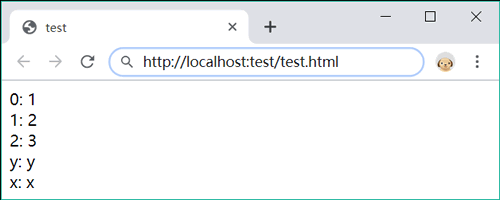

# 常用语句

JavaScript 语言定义了 20 套（或个）语句命令，分别执行不同的操作。

以用途划分，JavaScript 语句可以分为：声明、分支控制、循环控制、流程控制异常处理和其他。

以结构划分，JavaScript 语句又可以分为单句和复句。

- 单句：也称单行语句，由一个或多个关键字和表达式构成，用来完成简单的运算。
- 复句：使用大括号包含一个或多个单句，用来设计代码块、控制流程等复杂操作。

## 定义语句

在 JavaScript 中，使用分号可以定义一条语句。例如：

```javascript
var a;
```

当语句单独一行显示时，可以省略分号，JavaScript 在解析时会自动补全分号。

只有当省略分号，JavaScript 无法合并上下行进行解析时，才会补加分号。例如：

```javascript
var aa = 1
```

合并为一行后等于：

```javascript
var a a = 1
```

JavaScript 无法理解这句话的意思，于是添加分号，定义为两条语句来解析。但是，对于下面 3 行代码：

```javascript
var b = ""
var a = b
(a = "abc").toUpperCase()
```

如果不添加分号，JavaScript 就会错误解析为如下两条语句：

```javascript
var b = "";
var a = b(a = "abc").toUpperCase();
```

第二行结尾是变量 b，第三行开头是小括号，于是 JavaScript 就理解为 b() 函数的调用。

以 [、(、/、+、- 这 5 个符号开头的一行代码，很容易与上一行代码结合。例如：

```javascript
a
[3].length  //上下行合并解析为：a[3].length
a
/b/  //上下行合并解析为：a/b/
a
-1  //上下行合并解析为：a-1
a
+1  //上下行合并解析为：a+1
```

但是对于下面两种特例需要警惕。

1) return、break 和 continue 三个语句，如果分行显示，JavaScript 不会自动合并下一行进行解析。例如：

```javascript
return
1;  //不会合并，直接解析为两条语句：return 和 1；
```

2) ++(递增)和 --（递减）运算符会与下一行变量主动合并解析，但不会与上一行变量合并解析。例如：

```javascript
var a = b = 1;
a  //结果为1
++
b  //结果为2
```

因此，当所有句子结束时，建议养成良好习惯，使用分号进行定义。只有这样，当代码被压缩时，才不至于出现各种异常。

## 单句

单句比较简单，一般占据一行，可以不执行任何任务，或者运算表达式，或者执行简短的命令等。单句主要包括：

- 空语句
- 表达式语句
- 声明语句
- 调试语句
- 启用严格模式语句

## 复句

多个子句（Statement）放在一起就是一个语句段（Statement Block），如果使用大括号括起来，就成了复句（Statements）。单个句子被包括在大括号中也是复句。

复句又称语句块，语句块是一个独立运行的单元。在没有流程控制的情况下，块内语句要么都执行，要么都不执行。复句不需要使用分号与后面代码进行分隔，不过添加分号也不会出错。

复句结构比较复杂，它可以包含子句，也可以包含复句，形成结构嵌套。复句内的子句可以通过缩排版式以增强代码的可读性。

```javascript
{
    //空复句
}
{
    console.log("单复句);
}
{
    console.log("外层复句");
    {
        console.log("内层复句");
    }
}
```

## 空语句

空语句就是没有任何可执行的代码，是有一个分号`;`。空语句没有任何副作用，也不会执行任何操作，相当于一个占位符。

在循环结构中使用空语句可以设计假循环。下面代码在大括号内没有写入分号，但是 JavaScript 能够自动添加分号，定义一个空语句。

```javascript
for(var i = 0;i < 10;i++){ }
```

上面代码可以简写为：

```javascript
for(var i = 0;i < 10;i++);
```

上面语法容易引发错误，可以加上注释，或者复合使用。

```javascript
for(var i = 0;i < 10;i++)/*空语句*/；
for(var i = 0;i < 10;i++){ ; }
```

## 表达式语句

任何表达式加上分号就是表达式语句。

下面是一行最简单的句子。只有一个直接量，也是最简单的表达式。

```javascript
true;  //最简单的句子
```

下面是赋值语句，代码虽然很长，不过也只是一个表达式语句。

```javascript
o = new ((o == "String") ? String : (o == "Array") ? Array : (o =="Number") ? Number : (o == "Math") ? Math : (o == "Date") ? Date : (o == "Boolean") ? Boolean : (o == "RegExp") ? RegExp : Object);
```

赋值运算符右侧是一个多重条件运算，格式化显示如下：

```javascript
new ((o == "String") ? String  :
    (o == "Array") ? Array  :
    (o == "Number") ? Number  :
    (o == "Math") ? Math  : 
    (o == "Date") ? Date  :
    (o == "Boolean") ? Boolean  :
    (o == "RegExp") ? RegExp  :
    Object);
```

表达式与语句的区别：

- 子句法角度分析，表达式是短句；语句是一个句子。
- 从结构角度分析，表达式由操作数和运算符组成；语句由命令（关键字）和表达式组成。表达式之间可以通过空格分隔；而语句之间必须通过分号分隔。表达式可以包含子表达式，语句也可以包含子语句。
- 从表现角度分析，表达式呈现静态性；而语句呈现动态性。
- 从结果趋向分析，表达式必须返回一个值；而语句则是完成特定操作。

## 声明语句

声明语句包括三种：声明变量、声明函数和生命标签。使用 var 语句可以声明变量。

下面代码分别以不同形式声明多个变量并初始化（赋值）。

```javascript
var a = 0,b = true,c,d;  //声明四个变量，并部分赋值
```

使用 function 语句可以声明函数。

下面代码使用 function 语句声明一个函数，函数名为 f。

```javascript
function f() {
    console.log("声明函数");
}
```

## 调试语句

debugger 语句用于停止执行 JavaScript，同时如果调试函数可用，会调用调试函数。

debugger 语句可以放在代码的任何位置用以中止脚本执行，但不会关闭任何文件或清除任何变量，类似于在代码中设置断点。

如果调试工具不可用，则调试语句将无法工作。一般可以在浏览器中按 F12 键开启调试工具。

下面代码使用 debugger 语句中止执行 for 循环的每一次迭代。现在谷歌浏览器中开启调试工具，演示效果如图所示。


## with语句

with 语句能够临时改变作用域。语法格式如下：

```javascript
with (object)
    statement
```

参数 object 表示一个对象，它临时定义了 with 结构体内所有变量的作用域，当执行完 with 结构后，又恢复变量的原始状态。

with 关键字后面必须跟随一个由小括号包含的对象，而不是表达式。这个对象能够临时划定一个范围，指定 with 结构体内的变量都以它作为作用域。

对于下面语句。

```javascript
document.getElementByTagName("input") [0].value = 0;
document.getElementByTagName("input") [1].value = 1;
document.getElementByTagName("input") [2].value = 2;
```

可以把它转换为 with 结构来表示。

```javascript
with(o = document.getElementByTagName("input"){
    o[0].value = 0;
    o[1].value = 1;
    o[2].value = 3;
}
```

with 结构可能会破坏变量的作用域，不推荐使用。建议使用变量引用方法。

```javascript
var o = document.getElementByTagName("input");
o[0].value = 0;
o[1].value = 1;
o[2].value = 3;
```

## if语句

if 语句允许根据特定的条件执行特定的语句。语法格式如下：

```javascript
if(expr)
    statement
```


如果表达式 expr 的值为真，则执行语句 statement；否则，将忽略语句 statement。流程控制示意如图所示。


下面示例使用内置函数 Math.random() 随机生成一个 0 到 100 之间的整数，然后判断该数能否被 2 整除，如果可以整除，则输出显示。

```javascript
var num = parseInt(Math.random() * 99 + 1);  //使用random()函数生成一个随机数
if (num % 2 == 0){  //判断变量num是否为偶数
    console.log(num + "是偶数。");
}
```


如果 statement 为单句可以省略大括号，例如：

```javascript
if (num % 2 == 0)
    console.log(num + "是偶数。");
```


建议养成良好的编码习惯，不管是单句，还是复句，都应使用大括号，以避免疏忽大意引发的错误。例如，不小心在 if(num % 2 == 0) 加上分号，JavaScript 解释器就会把条件表达式之后的分号视为一个空语句，从而该变条件表达式影响的范围，导致后面的语句永远被执行。

```javascript
if(num % 2 == 0);
    console.log(num + "是偶数。");
```

这种错误不容易被发现，也不会引发异常。

## else语句

else 语句仅在 if 或 else/if 语句的条件表达式为假的时候执行。语法格式如下：

```javascript
if(expr)
    statement1
else
    statement2
```

如果表达式 expr 的值为真，则执行语句 statement1；否则，将执行语句 statement2。流程控制示意如图所示。


针对上面示例，可以设计二重分支，实现根据条件显示不同的提示信息。

```javascript
var num = parseInt(Math.random() * 99 + 1);
if (num % 2 == 0){
    console.log(num + "是偶数。");
}else{
    console.log(num + "是奇数。");
}
```

if/else 结构可以嵌套，以便设计多重分支结构。

```javascript
var num = parseInt(Math.random() * 99 + 1);
if (num < 60){
    console.log("不及格");
}else{
    if (num < 70){
        console.log(""及格);
    }else{
        if (num < 85){
            console.log("良好");
        }else{
            console.log("优秀");
    }
}
```

一般可以简化为如下语法格式，这样更方便编写和维护。

```javascript
var num = parseInt(Math.random() * 99 + 1);
if (num < 60) {console.log("不及格"); }
else if (num < 70) {console.log("及格"); }
else if (num < 85) {console.log(""良好"); }
else {console.log("优秀"); }
```


把 else 与 if 关键字组合在一行内显示，然后重新格式化每个句子，使整个嵌套结构的逻辑思路就变得清晰。其流程控制示意如图所示。


设计嵌套分支结构时，建议使用复句。如果是一行单句，也应该使用大括号包裹起来，避免条件歧义。例如，下面嵌套结构就容易引发误解。

```javascript
if(0)
    if(1)
        console.log(1);
else
    console.log(0);
```

针对上面代码，JavaScript 解释器将根据就近原则，按如下逻辑层次进行解释。

```javascript
if(0)
    if(1)
        console.log(1);
    else
        console.log(0);
```

因此使用复句可以避免很多问题。

```javascript
if(0) {
    if(1)  console.log(1);
}else{
    console.log(0);
}
```

## switch语句

switch 语句专门用来设计多分支条件结构。与 else/if 多分支结构相比，switch 结构更简洁，执行效率更高。语法格式如下：

```javascript
switch (expr) {
    case value1 :
        statementList1
        break;
    case value2 :
        statementList2
        break;
    ...
    case valuen :
        statementListn
        break;
    default :
        default statementList
}
```

switch 语句根据表达式 expr 的值，依次与 case 后表达式的值进行比较，如果相等，则执行其后的语句段，只有遇到 break 语句，或者 switch 语句结束才终止；如果不相等，则继续查找下一个 case。switch 语句包含一个可选的 default 语句，如果在前面的 case 中没有找到相等的条件，则执行 default 语句，它与 else 语句类似。

switch 语句流程控制示意如图所示：


下面示例使用 switch 语句设计网站登录会员管理模块。

```javascript
var id = 1;
switch (id) {
    case 1 :
        console.log("普通会员");
        break;  //停止执行，跳出switch
    case 2 :
        console.log("VIP会员");
        break;  //停止执行，跳出switch
    case 3 :
        console.log("管理员");
        break;  //停止执行，跳出switch
    default :  //上述条件都不满足时，默认执行的代码
        console.log("游客");
```

?> 当 JavaScript 解析 switch 结构时，先计算条件表达式，然后计算第一个 case 子句后的表达式的值，并使用全等`===`运算符来检测两值是否相同。由于使用的是全等运算符，因此不会自动转换每个值的类型。

case 子句可以省略语句，这样当匹配时，不管下一个 case 条件是否满足，都会继续执行下一个 case 子句的语句。下面示例演示了把普通会员和 VIP 会员合并在一起进行检测。

```javascript
var id = 1;
switch (id) {
    case 1 :
    case 2 :
        console.log("VIP会员");
        break;
    case 3 :
        console.log("管理员");
        break;
    default : 
        console.log("游客");
```


在 switch 语句中，case 子句只是指明了执行起点，但是没有指明执行的终点，如果在 case 子句中没有 break 语句，就会发生连续执行的情况，从而忽略后面 case 子句的条件限制，这样就容易破坏 switch 结构的逻辑。如果在函数中使用 switch 语句，可以使用 return 语句终止 switch 语句，防止代码继续执行。

## default语句

default 是 switch 子句，可以位于 switch 内任意位置，不会影响多重分支耳朵正常执行。下面结合示例介绍使用 default 语句应该注意 3 个问题。

如果 default 下面还有 case 子句，应该在 default 后面添加 break 语句，终止 switch 结构，防止程序突破 case 条件的限制继续执行下面 case 子句。

```javascript
var id = 1;
switch (id) {
    default : 
        console.log("游客");
        break;
    case 1 : 
        console.log("普通会员");
        break;
    case 2 :
        console.log("VIP会员");
        break；
    case 3 :
        console.log("管理员");
        break;
}
```

在下面代码中，JavaScript 先检测 case 表达式的值，由于 case 表达式的值都不匹配，则跳转到 default 子句执行，然后继续执行 case 1 和 case 2 子句。但是，最后不会返回 default 子句再重复执行。

```javascript
var id = 3;
switch (id) {
    default : 
        console.log("游客");
    case 1 :
        console.log("普通会员");
    case 2 :
        console.log("VIP会员");
}
```

下面示例使用 switch 语句设计一个四则运算函数。在 switch 结构内，先使用 case 枚举 4 种可预知的算术运算，当然还可以继续扩展 case 子句，枚举所有可能的操作，但是无法枚举所有不测，因此最后使用 default 处理意外情况。

```javascript
function oper (a,b,opr) {
    switch (opr) {
        case "+" :  //正常枚举
            return a + b;
        case "-" :  //正常枚举
            return a - b;
        case "*" :  //正常枚举
            return a * b;
        case "/" :  //正常枚举
            return a / b;
        default :  //异常处理
            return "非预期的 opr 值";
    }
}
console.log(oper (2,5,"*"));  //返回10
```

default 语句与 case 语句简单比较如下：

- 语义不同：default 为默认项，case 为判例。
- 功能扩展：default 选项是唯一的，不可以扩展。而 case 选项是可扩展的，没有限制。
- 异常处理：default 与 case 扮演的角色不同，case 用于枚举，default 用于异常处理。

## while语句

while 语句是最基本的循环结构。语法格式如下：

```javascript
while (expr)
    statement
```


当表达式 expr 的值为真时，将执行 statement 语句，执行结束后，再返回到 expr 表达式继续进行判断。直到表达式的值为假，才跳出循环，执行下面的语句。while 循环语句


下面使用 while 语句输出 1 到 100 之间的偶数。

```javascript
var n = 1;  //声明并初始化循环变量
while(n <= 100){  //循环条件
    n++;  //递增循环变量
    if (n % 2 == 0) document.write(n + "");   //执行循环操作
}
```

也可以在循环的条件表达式中设计循环变量。代码如下：

```javascript
var n = 1;  //声明并初始化循环变量
while (n++ <= 100){  //循环条件
    if (n % 2 == 0) document.write(n + "");   //执行循环操作
}
```

## do/while语句

do/while 与 while 循环非常相似，区别在于表达式的值是在每次循环结束时检查，而不是在开始时检查。因此 do/while 循环能够保证至少执行一次循环，而 while 循环就不一定了，如果表达式的值为假，则直接终止循环不进入循环。语法格式如下：

```javascript
do
    statement
while(expr)
```


do/while 循环语句的流程控制示意如图所示。


针对上面使用 do/while 结构来设计，则代码如下：

```javascript
var n = 1;  //声明并初始化循环变量
do {  //循环条件
    n++;  //递增循环变量
    if (n % 2 == 0) document.write(n + "");  //执行循环操作
} while (n <= 100);
```


?> 建议在 do/while 结构的尾部使用分号表示语句结束，避免意外情况发生。

## for语句

for 语句是一种更简洁的循环结构。语法格式如下：

```javascript
for (expr1;expr2;expr3)
    statement
```


表达式 expr1 在循环开始前无条件地求值一次，而表达式 expr2 在每次循环开始前求值。如果表达式 expr2 的值为真，则执行循环语句，否则将终止循环，执行下面代码。表达式 expr3 在每次循环之后被求值。for 循环语句的流程控制示意如图所示。


for 语句中 3 个表达式都可以为空，或者包括以逗号分隔的多个子表达式。在表达式 expr2 中，所有用逗号分隔的子表达式都会计算，但只取最后一个子表达式的值进行检测。expr2 为空，会默认其值为真，意味着将无限循环下去。除了 expr2 表达式结束循环外，也可以在循环语句中使用 break 语句结束循环。

针对上面示例，使用 for 循环来设计。

```javascript
for (var n = 1;n <=100;n++){
    if (n % 2 == 0) document.write(n + "");  //执行循环操作
}
```

下面示例使用嵌套循环求 1 到 100 之间的所有素数。外层 for 循环遍历每个数字，在内层 for 循环中，使用当前数字与其前面的数字求余。如果有至少一个能够整除，则说明它不是素数；如果没有一个被整除，则说明它是素数，最后输出当前数字。

```javascript
for (var i = 2;i < 100;i++) {
    var b = true;
    for (var j = 2;j < i;j++) {
        if (i % j == 0) b = false;  //判断i能否被j整除，能被整除则说明不是素数，修改布尔值为false
    }
    if (b) document.write(i + "");  //打印素数
}
```

## for/in语句

for/in 语句是 for 语句的一种特殊形式。语法格式如下：

```javascript
for ( [var] variable in <object | array)
    statement
```

variable 表示一个变量，可以在其前面附加 var 语句，用来直接声明变量名。in 后面是一个对象或数组类型的表达式。在遍历对象或数组过程中，把或取的每一个值赋值给 variable。

然后执行 statement 语句，其中可以访问 variable 来读取每个对象属性或数组元素的值。执行完毕，返回继续枚举下一个元素，以此类推知道所有元素都被枚举为止。

?> 对于数组来说，值是数组元素的下标；对于对象来说，值是对象的属性名或方法名。

下面示例使用 for/in 语句遍历数组，并枚举每个元素及其值。

```javascript
var a = [1,true,"0",[false],{}];  //声明并初始化数组变量 
for (var n in a) {  //遍历数组
    document.write("a["+n+"] = " + a[n] + "<br>");  //显示每个元素及其值
}
```


使用 while 或 for 语句可以实现相同的遍历操作。例如：

```javascript
var a = [1,true,"0",[false],{}];  //声明并初始化数组变量
for (var n = 0;n < a.length;n++) {  //遍历数组
    document.write("a["+n+"] = " + a[n] + "<br>");  //显示每个元素的值
```

在下面示例中，定义一个对象 o，设置 3 个属性。然后使用 for/in 迭代对象属性，把每个属性值寄存到一个数组中。

```javascript
var o = {x : 1,y : true,z : "true"},  //定义包含三个属性的对象
    a = [],  //临时寄存数组
    n = 0;  //定义循环变量，初始化为0
for (a[n++] in o);  //遍历对象o，然后把所有属性都赋值到数组中
```

其中 for (a[n++] in o); 语句实际上是一个空循环结构，分号为一个空语句。

for/in 适合枚举不确定长度的对象。在下面示例中，使用 for/in 读取客户端 document 对象的所有可读属性。

```javascript
for (var i = 0 in document) {
    document.write("document." + i + "=" +document[i] +"<br />");
```


如果对象属性被设置为只读、存档或不可枚举等限制特性，那么使用 for/in 语句就无法枚举了。枚举没有固定的顺序，因此在遍历结果中会看到不同的排列顺序。

for/in 能够枚举可枚举的属性，包括原生属性和继承属性。

```javascript
Array.prototype.x = "x";  //自定义数组对象的继承属性
var a = [1,2,3];  //定义数组对象，并赋值
a.y = "y"  //定义数组对象的额外属性
for (var i in a) {  //遍历数组对象a
    document.write(i + ": " + a[i] + "<br />");
}
```

在上面示例中，共获取 5 个元素，其中包括 3 个原生元素，一个继承的属性 x 和一个额外的属性 y，结果如图所示。



如果仅想获取数组 a 的元素值，只能使用 for 循环结构。

```javascript
for (var i = 0;i < a.length;i++) 
    document.write(i + ": " + a[i] + "<br />");
```


?> for/in 语句适合枚举长度不确定的对象属性。

## label关键字

在 JavaScript 中，使用 label 语句可以为一行语句添加标签，以便在复杂结构中，设置跳转目标。语法格式如下：

```
label : states
```

label 为任意合法的标识符，但不能使用保留字。然后使用冒号分隔签名与标签语句。

由于标签名与变量名属于不同的命名体系，所以标签名与变量名可以重复。但是，标签名与属性名语法相似，就不能重名，例如，下面写法是错误的。

```javascript
a : {  //标签名
    a : true  //属性名
}
```

使用点语法、中括号语法可以访问属性，但是无法访问标签语句。

```javascript
console.log(o.a);  //可以访问属性
console.log(b.a);  //不能访问标签语句，将抛出异常
```


label 与 break 语句（请转到《JS break和continue语句》了解更多）配合使用，主要应用在循环结构、多分支结构中，以便跳出内层嵌套体。

## break语句

break 语句能够结束当前 for、for/in、while、do/while 或者 switch语句的执行；同时 break 也可以接受一个可选的标签名（请转到《JS label关键字》了解更多），来决定跳出的结构语句。

```
break label;
```

如果没有设置标签名，则表示跳出当前最内层结构。

break 语句流程控制示意如图所示。


下面示例设计在客户端查找 document 的 bgColor 属性。如果完全遍历 document 对象，会浪费时间，因此设计一个条件判断所有枚举的属性名是否等于“bgColor”，如果相等，则使用 break 语句跳出循环。

```javascript
for (i in document) {
    if (i.toString() == "bgColor") {
        document.write("document." +  i + "=" + document[i] + "<br />");
        break;
    }
}
```

在上面代码中，break 语句并非跳出当前的 if 结构体，而是跳出当前最内层的循环结构。

在下面嵌套结构中，break 语句并没有跳出 for/in 结构，仅仅退出 switch 结构。

```javascript
for (i in document) {
    switch (i.toString()) {
        case "bgColor" :
            document.write("document." + i + "=" + document[i] + "<br />");
            break;
        default :
            document.write("没有找到");
    }
}     
```

针对示例 2，可以为 for/in 语句定义一个标签 outloop，然后在最内层的 break 语句中设置该标签名，这样当条件满足时就可以跳出最外层的 for/in 循环结构。

```javascript
outloop : for (i in document) {
    switch (i.toString()) {
        case "bgColor" :
            document.write("document." + i + "=" + document[i] + "<br />");
            break outloop;
        default : 
            document.write("没有找到");
    }
}
```

break 语句和 label 语句配合使用仅限于嵌套的循环结构，或者嵌套的 switch 结构，且需要退出非当前层结构。break 与标签名之间不能包含换行符，否则 JavaScript 会解析为两个句子。

## continue语句

continue 语句用在循环结构内，用于跳过本次循环中剩余的代码，并在表达式的值为真时，继续执行下一次循环。它可以接受一个可选的标签名，开决定跳出的循环语句。语法格式如下：

```
continue label;
```

continue语句流程控制示意如图所示。


下面示例使用 continue 语句过滤数组中的字符串值。

```javascript
var a = [1,"hi",2,"good","4", ,"",3,4],  //定义并初始化数组a
    b = [], j = 0;  //定义数组b和变量j
for (var i in a) {  //遍历数组a
    if (typeof a[i] == "string")  //如果为字符串，则返回继续下一次循环
        continue;
    b[j ++] = a[i];  //把数字寄存到数组b
}
document.write(b);  //返回1,2,3,4
```

continue 语句只能用在 while、do/while、for、for/in 语句中，对于不同的循环结构其执行顺序略有不同。

- 对于 for 语句来说将会返回顶部计算第 3 个表达式，然后再计算第 2 个表达式，如果第 2 个表达式为 true，则继续执行下一次循环。
- 对于 for/in 语句来说，将会以下一个赋给变量的属性名开始，继续执行下一次循环。
- 对于 while 语句来说，将会返回顶部计算表达式，如果表达式为 true，则继续执行下一次循环。
- 对于 do/while 语句来说，会跳转到底部计算表达式，如果表达式为 true，则会返回顶部开始下一次循环。

## 异常处理语句

ECMA-262 规范了 7 种错误类型，具体说明如下。其中 Error 是基类，其他 6 种错误类型是子类，都继承 Error 基类。Error 类型的主要用途是自定义错误对象。

- Error：普通异常。与 throw 语句和 try/catch 语句一起使用，属性 name 可以读写异常类型，message 属性可以读写详细错误信息。
- EvalError：不正确的使用 eval() 方法时抛出。
- SyntaxError：出现语法错误时抛出。
- RangeError：数字超出合法范围时抛出、
- ReferenceError：读取不存在的变量时抛出。
- TypeError：值得类型发生错误时抛出。
- URIError：URI 编码和解码错误时抛出。

**try/catch/finally 是 JavaScript 异常处理语句。**语法格式如下：

```javascript
try{
    //调试代码块
}
catch(e) {
    //捕获异常，并进行异常处理的代码块
}
finally{
    //后期清理代码块
}
```

在正常情况下，JavaScript 按顺序执行 try 子句中的代码，如果没有异常发生，将会忽略 catch 子句，跳转到 finally 子句中继续执行。

如果在 try 子句运行时发生错误，或者使用 throw 语句主动抛出异常，则执行 catch 子句中的代码，同时传入一个参数，引用 Error 对象。

?> 在异常处结构中，大括号不能省略。

下面示例先在 try 子句中制造一个语法错误，然后在 catch 子句中获取 Error 对象，读取错误信息，最后在 finally 子句中提示代码。

```javascript
try {
    1 = 1;  //非法语句
}
catch (error) {  //捕获错误
    console.log(error.name);  //访问错误类型
    console.log(error.message);  //访问错误详细信息
}
finally {  //清除处理
    console.log("1=1");  //提示代码
}
```

catch 和 finally 子句是可选的，在正常情况下应该包含 try 和 catch 子句。

```javascript
try {1 = 1;}
catch (error) { }
```

?> 不管 try 语句是否完全执行，finally 语句最后都必须要执行，即使使用了跳转语句跳出了异常处理结构，也必须在跳出之前先执行 finally 子句。

下面示例在函数体内设计一个异常处理结构，为每个子句添加一个 return 语句。调用函数后，实际返回的是“finally”，而不是“try”，因为 finally 子句必须最后执行，把 finally 子句去掉，函数才会返回“try”。

```javascript
function test() {
    try {
        return "try";
    }catch {
        return "catch";
    }finally {
        return "finally";
    }
}
console.log(test());  //返回“finally”
```

try/catch/finally 语句允许嵌套使用，嵌套的层数不限，同时形成一条词法作用域链。在 try 中发生异常时，JavaScript 会停止程序的正常运行，并跳转到层级最近的 catch 子句（异常处理器）。如果没有找到异常处理器，则会沿着作用域链，检查上一级的 catch 子句，以此类推，直到找到一个异常处理器。如果在程序中没有找到任何异常处理器，将会显示错误。

下面代码就是一个多层嵌套的异常结构，在处理一系列的异常时，内层的 catch 子句通过将异常抛出，就可以将异常抛给外层的 catch 子句来处理。

```javascript
try {  //外层异常处理结构
    try {  //内层异常处理结构
        test();  //错误调用
    }
    catch(error) {
        if (error.name == "ReferenceError") console.log("错误参考");   //如果是异常引用，则提示这样的信息
        else throw error;  //否则再次抛出一个异常，并把错误信息向上传递
        }
}
catch (error) {  //获取内层异常处理结构中抛出的异常
    console.log("内层 try/catch 不能够处理这个错误");
}
```

## throw语句

throw 语句能够主动抛出异常，语法格式如下：

```javascript
throw expression;
```

expression 是任意类型的表达式，一般为 Error 对象，或者 Error 子类示例。

当执行 throw 语句时，程序会立即停止执行。只有当使用 try/catch 语句捕获到被抛出的值时，程序才会执行。

下面示例在循环体内设计当循环变量大于 5 时，定义并抛出一个异常。

```javascript
try {
    for (var i = 0;i < 10;i++) {
        if (i > 5) throw new Error ("循环变量的值大于 5 了");  //定义错误对象，并抛出异常
        console.log(i);
    }
}
catch (error) { }  //捕获错误，其中error就是new Error() 的实例
```

在抛出异常时，JavaScript 也会停止程序的正常执行，并跳转到最近的 catch 子句。如果没有找到 catch 子句，则会检查上一级的 catch 子句，以此类推，直到找到一个异常处理器为止。如果在程序中没有找到任何异常处理器，将会显示错误。

