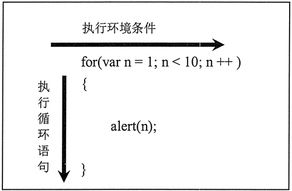
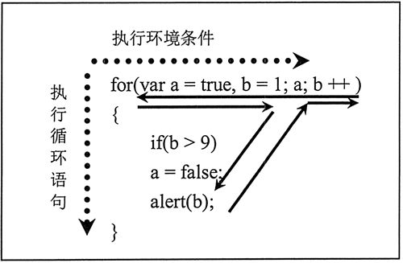
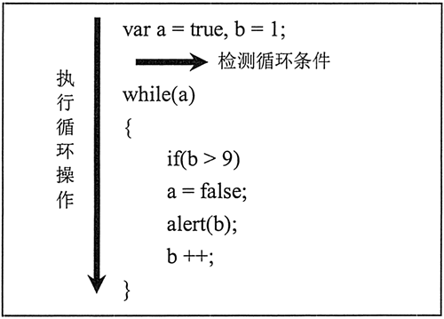
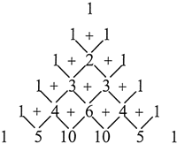
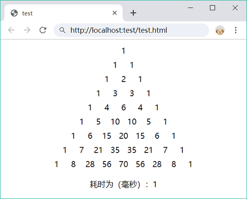

# 选择优化

## 选择if或switch

if 和 switch 都可以设计多重分支结构，一般情况下 switch 执行效率要高于 if 语句。但是也不能一概而论，应根据具体问题具体分析。简单比较如表所示。

| 语句     | If 语句                  | Switch 语句                      |
| -------- | ------------------------ | -------------------------------- |
| 结构     | 通过嵌套结构实现多重分支 | 专为多重分支设计                 |
| 条件     | 可以测试多个条件表达式   | 仅能测试一个条件表达式           |
| 逻辑关系 | 可以处理复杂的逻辑关系   | 仅能处理多个枚举的逻辑关系       |
| 数据类型 | 可以适用任何数据类型     | 仅能应用整数、枚举、字符串等类型 |

相对而言，下面情况更事宜选用 switch 语句。

- 枚举表达式的值。这种枚举是可以期望的、平行的逻辑关系。
- 表达式的值具有离散性，是不具有线性的非连续的区间值。
- 表达式的值是固定的，不会动态变化。
- 表达式的值是有限的，不是无限的，一般应该比较少。
- 表达式的值一般为整数、字符串等简单的值。

下面情况更事宜用 if 语句。

- 具有复杂的逻辑关系。
- 表达式的值具有线性特征，去对连续的区间值进行判断。
- 表达式的值是动态的。
- 测试任意类型的数据。

本例设计根据学生分数进行等级评定：如果分数小于 60，则不及格；如果分数在 60 与 75 之间，则评定为合格；如果分数在75 与 85 之间，则评定为良好；如果分数在 85 与 100 之间，则评定为优秀。

根据上述需求描述，确定检测的分数是一个线性区间值，因此选用 if 语句会更合适。

```javascript
if (score < 60) {console.log("不及格");}
else if (score < 75) {console.log("合格");}
else if (score <85) {console.log("良好");}
else {console.log("优秀");}
```

如果使用 switch 结构，则需要枚举 100 种可能，如果分数值还包括小数，这种情况就更佳复杂了，此时使用 switch 结构就不是明智之举。

设计根据性别进行分类管理。这和案例属于有效枚举条件，使用 switch 会更高效。

```javascript
switch (sex) {  //离散值判断
    case 1 :
        console.log("女士");
        break;
    case 2 :
        console.log("男士");
        break;
    default :
        console.log("请选择性别");
}
```

## 优化多分支

多分支结构的优化有很多好处：既方便代码维护，又可以提升代码执行效率。例如，设计有多个条件，只有当多个条件都成立时，才允许执行特定任务。

遵循简单的设计思路，使用多重分支逐个检测这些条件。

```javascript
if (a) {
    if (b) {
        if (c) {
            if (d) {console.log("所有条件都成立！"); }
            else {console.log("条件 d 不成立！"); }
        } else {console.log("条件 c 不成立！"); }
    } else {console.log("条件 b 不成立！"); }
} else {console.log("条件 a 不成立！"); }
```

上述设计没有错误，结构嵌套合法。不过可以使用逻辑运算符进行优化。

```javascript
if (a && b && c && d) {console.log("所有条件都成立！"); }
```

比较而言，使用 if 语句逐个检测每个条件的合法性，并对某个条件是否成立进行个性化处理，以方便跟踪。但是使用 if (a && b && c && d) 条件表达式，就没法进行过程跟踪。例如，如果 a 条件不成立，则程序会自动退出整个流程，而不管 b、c 和 d 的条件是否成立。这会使代码跟踪变得很困难。

优化设计思路，采用排除法，对每个条件逐一进行排除，如果全部成立则再执行特定任务。在排除过程中，使用一个标志变量把每一次条件检测联系在一起，最后根据这个标志变量决定是否完成特定任务。

```javascript
var t = true;  //初始化标志变量为true
if (! a) {
    console.log("条件 a 不成立!");
    t = false;  //如果条件a不成立则标志变量为false
}
if (! b) {
    console.log("条件 b 不成立!");
    t = false;  //如果条件a不成立则标志变量为false
}
if (! c) {
    console.log("条件 c 不成立!");
    t = false  //如果条件a不成立则标志变量为false
}
if (! d) {
    console.log("条件 d 不成立!");
    t = false;  //如果条件a不成立则标志变量为false
}
if (t) {  //如果标志变量为true，则执行特定任务
    console.log("所有条件都成立!");
}
```

排除法有效避免了条件嵌套的复杂性，不过这种设计也存在一定的局限性，例如，一旦发生错误，后面的操作将被放弃。为此还可以再设计一个标志变量来跟踪错误。

### 数据映射

在多分支检测中，表达式的重复运算会影响性能。如果检测的条件满足下面两条，可以考虑使用数据映射来快速匹配，这样有助于代码的可读性，大大提高了代码的响应速度。

- 条件体的数量庞大
- 测试的条件值呈现离散状态

实现方法：通过数组或普通对象实现。

在下面代码中，使用 switch 多分支检测离散值。

```javascript
function map(value) {
    switch (value) {
        case 0 : return "result0";
        case 1 : return "result1";
        case 2 : return "result2";
        case 3 : return "result3";
        case 4 : return "result4";
        case 5 : return "result5";
        case 6 : return "result6";
        case 7 : return "result7";
        case 8 : return "result8";
        case 9 : return "result9";
        default : return "result10"
    }
}
```

针对示例 1 可以使用数组查询替代 switch 语句。下面代码把所有离散值存储到一个数组中，然后通过数组下标快速检测元素的值。

```javascript
function map(value) {
    var results = ["result0","result1","result2","result3","result4","result5",
                   "result6","result7","result8","result9","result10"]
    return results[value];
}
```

使用数据映射法可以消除所有条件判断，但由于没有条件判断，当候选值数量增加时，基本不会增加额外的性能开销。

如果每个键映射的不是简单的值，而是一系列的动作，则使用 switch 更适合。当然，也可以把这些动作包装在函数中，再把函数作为一个值与键进行映射。

如果条件查询中键名不是有序数字，则无法与数组下标映射，这时可以使用对象数据映射法。

```javascript
function map(value) {
    var results = {
        "a" : "result0","b" : "result1","c" : "result2","d" : "result3","e" : "result4","f" : "result5",
        "g" : "result6","h" : "result7","i" : "result8","j" : "resukt9","k" : "result10"
    }
    return results[value];
}
```

### 调整分支顺序

在多分支结构中，各种条件存在先后、轻重的顺序。如果把最可能的条件放在前面，把最不可能的条件放在后面，那么程序被执行时总会按照代码先后顺序检测所有条件，直到发现匹配的条件时才停止。如果把最可能的条件放在前面，就等于降低了程序的检测次数，自然也就提升了分支结构的执行效率，避免空转。这在大批量数据检测中效果非常明显。

对于一个论坛系统来说，普通会员的数量要远远大于版主和管理员的数量。大部分登录的用户都是普通会员，如果把普通会员的检测放在分支结构的前面，就会减少每次检测的次数。

```javascript
switch (level) {  //优化分支顺序
    case 1 :
        console.log("普通会员");
        break;
    case 2 :
        console.log("版主");
        break;
    case 3 :
        console.log("管理员");
        break;
    default :
        console.log("请登录");
}
```

在性能影响不大的情况下，遵循条件检测的自然顺序会更易于理解。

设计检测周一到周五值日任务安排的分支结构。可能周五的任务比较重要，或者周一的任务比较轻，但是对于这类有着明显顺序的结构，遵循自然顺序比较好。打乱顺序，把周五的任务安排在前面，对于整个分支结构的执行性能没有太大帮助，打乱的顺序不方便阅读。因此，按自然顺序来安排结构会更富有可读性。

```javascript
switch (day) {
    case 1 :
        console.log("周一任务安排");
        break;
    case 2 :
        console.log("周二任务安排");
        break;
    case 3 :
        console.log("周三任务安排");
        break;
    case 4 :
        console.log("周四任务安排");
        break;
    case 5 :
        console.log("周五任务安排");
        break;
    default : 
        console.log("异常处理");
}
```

分支之间的顺序应注意优化，当然，对于同一个表达式内部也应该考虑逻辑顺序问题。由于逻辑与或逻辑或运算时，有可能会省略右侧表达式的计算，如果希望右侧表达式不管条件是否成立都被计算，就应该考虑逻辑顺序问题。

有两个条件 a 和 b，其中条件 a 多为真，而 b 是一个必须执行的表达式，那么下面逻辑顺序的设计就欠妥当。

```javascript
if (a && b) {
    //执行任务
}
```

如果条件 a 为 false，则 JavaScript 会忽略表达式 b 的计算。如果 b 表达式影响到后面的运算，则不执行表达式 b，自然会对后面的逻辑产生影响。因此，可以采用下面的设计思路，在 if 结构前先执行表达式 b，这样即使条件 a 的返回值为 false，也能够保证 b 表达式被计算。

```javascript
var c = b;
if (a && b) {
    //执行任务
}
```

## 选择while或for

for 和 while 语句都可以完成特定动作的重复性操作。简单比较如下。

for 语句是以变量的变化来控制循环进程的，整个循环流程是计划好的，可以事先知道循环的次数、每次循环的状态等信息。

while 语句是根据特定条件来决定循环进程的，这个条件时动态的，无法预知的，存在不确定性，每一次循环时都不知道下一次循环的状态如何，只能通过条件的动态变化来确定。

因此，for 语句常用于有规律的重复操作中，如数组、对象等迭代。while 语句更适用于特定条件的重复操作，以及依据特定事件控制的循环操作。

在 for 语句中，把循环的三要素（起始值、终止值和步长）定义为 3 个基本表达式，作为结构语法的一部分固定在 for 语句内，使用小括号进行语法分隔，这与 while 语句内条件表达式截然不同，这样更有利于 JavaScript 解释器进行快速编译。

for 语句适合简单的数值迭代操作。

下面代码使用 for 语句迭代 10 之内的正整数。

```javascript
for (var n = 1;n < 10;n ++) {  //循环操作的环境条件
    console.log(n);  //循环操作的语句
}
```

用户可以按以下方式对 for 循环进行总结。

- 执行循环条件：1<n<10，步长为 n++。
- 执行循环语句：console.log(n);

这种把循环操作的环境条件和循环操作语句分离开的设计模式能够提高程序的执行效率，同时也避免了把循环条件与循环语句混在一起而造成的贻误。如果使用简化的示意图来描述这种思维模式则如图所示。



如果循环结构比较复杂，for 语句就必须考虑如何把循环条件和循环语句联系起来才可以正确执行整个 for 结构。因为根据 for 结构的运算顺序，for 语句首先计算第一、二个表达式，然后执行循环体语句，最后返回执行 for 语句第三个表达式，如此周而复始。

下面代码使用 for 语句模拟 while 语句在循环体内的检测条件，并根据递增变量的值是否小于 10。如果大于等于 10，则设置条件变量 a 的值为 false，终止循环。

```javascript
for (var a = true,b = 1,a;b ++) {
    if (b > 9)  //在循环体内间接计算迭代的步长
    a = false;
    console.log(b);
}
```

在上面示例中，for 语句的第三个表达式不是直接计算步长的，整个 for 结构也没有明确告知循环步长的表达式，要确知迭代的步长就必须根据循环体内的语句来决定。于是整个 for 结构的逻辑思维就存在一个循环的过程，如图所示。



由于 for 结构的特殊性，导致在执行复杂条件时会大大降低效率。相对而言，while 结构天生就是为复杂的条件而设计的，它将复杂的循环控制放在循环体内执行，而 while 语句自身仅用于检测循环条件，这样就避免了结构分离和逻辑跳跃。

下面代码使用 while 语句迭代 10 之内的正整数。如果使用示意图来勾勒这种思维变化，则如下图所示。

```javascript
var a = true,b = 1;
while (a) {
    if (b > 9) {
    a = false;  //在循环体内间接计算迭代
    console.log(b);
    b ++;  //在循环体内间接计算迭代
}
```



有些循环次数在循环之前就可以预测，如计算 1~100 之间的数字和；而有些循环则具有不可预测性，用户无法事先确定循环的次数，甚至无法预知循环操作的趋向。这些都构成了在设计循环结构时必须考虑的达成目标问题。

即使是相同的操作，如果达成目标的角度不同，可能重复操作的设计也不同。例如，统计全班学生的成绩和统计合格学生的成绩就是两个不同的达成目标。

一般来说，在循环结构中动态改变循环变量的值时，建议使用 while 结构，而对于静态的循环变量，则可以考虑使用 for 结构。简单比较 while 和 for 语句，区别如表所示。

| 语句 | while 语句                     | for 语句                 |
| ---- | ------------------------------ | ------------------------ |
| 条件 | 根据条件表达式的值决定循环操作 | 根据操作次数决定循环操作 |
| 结构 | 比较复杂，结构相对宽松         | 比较简洁，要求比较严格   |
| 效率 | 存在一定的安全隐患             | 执行效率比较高           |
| 变种 | do/while 语句                  | for/in 语句              |

## 优化循环结构

循环时最耗费资源的操作，任意一点小小的损耗都会被成倍放大，从而影响到程序整体运行的效率。一下两个因素会影响到循环的性能。

- 每次迭代做什么
- 迭代的次数

通过减少这两者中一个或全部的执行时间，可以提高循环的整体性能。如果一次循环需要较长时间，那么多次循环将需要更长时间。

下面使用 3 类循环语句设计一个典型的数组遍历操作。

```javascript
//方法1
for (var i = 0;i < items.length;i ++) {
    process(items[i]);
}
//方法2
var j = 0;
while (j < items.length) {
    process(items[j++]);
}
//方法3
var k = 0;
do {
    process(items[k++]);
} while (k < items.length);
```

### 减少循环

对于任何循环来说，每次执行循环体都要发生一下操作。

- 在控制条件中读一次属性（items.length）。
- 在控制条件中执行一次比较（i < itesm.length）。
- 判断 i<items.length 表达式的值是不是 true(i < items.length == true)。
- 一次自加操作（i++）。
- 一次数组查找（items[i]）。
- 一次函数调用（process(items[i])）。


在循环体内，代码运行速度很大程度上由 process() 对每个项目的操作决定，即便如此，减少每次迭代中操作的总数也可以大幅度提高循环的性能。

优化循环的第一步是减少对象成员和数组项查找的次数。在大多数浏览器上，这些操作比访问局部变量或直接量需要更长的时间。

在上面代码中，每次循环都查找 items.length，这是一种浪费，因为该值在循环体执行过程中不会改变，因此产生了不必要的性能损失。可以简单的将此值存入一个局部变量中，在控制条件中使用这个局部变量，从而提高循环性能。

```javascript
for (var i = 0;len = items.length;i < len;i ++) {
    process(items[i]);
}
var j = 0,count = items.length;
while (j < count) {
    process(items[j++]);
}
var k = 0,num = items.length;
do {
    process(items[k++]);
} while (k < num);
```

这些重写后的循环只在循环之前对数组长度进行一次属性查询，使控制条件中只有局部变量参与运算，所以速度更快。

### 倒序循环

还可以通过改变循环的顺序来提高循环性能。通常，数组元素的处理顺序与任务无关，可以从最后一个开始，直到处理完第一个元素。倒序循环是编程语言中常用的性能优化方法。

在 JavaScript中，倒序循环可以略微提高循环性能。

```javascript
for (var i = items.length;i --) {
    process(items[i]);
}
var j = items.length;
while (j --) {
    process(items.[j]);
}
var k = items.length - 1;
do {
    process(items[k]);
} while (k --);
```

在上面代码中使用了倒序循环，并在控制条件中使用了自减。每个控制条件只是简单地与 0 进行比较。控制条件与 true 值进行比较，任何非零数字自动强制转换为 true，而 0 等同于 false。

实际上，控制条件已经从两次比较减少到一次比较，大幅提高了循环速度。与原始版本相比，现在每次迭代中只进行以下操作。

- 在控制条件中进行一次比较（i == true）。
- 一次减法操作（i --）。
- 一次数组查询（items[i]）。
- 一次函数调用（process(items[i])）。


每次迭代中减少两个操作，如果迭代次数成千上万的增长，那么性能将显著提升。

### 嵌套设计

循环结构常与分支结构混用在一起，但是如何嵌套就就非常讲究了。

在一个循环体内，设计只有在特定条件下才执行循环体。

```javascript
var a = true;
for (var b = 1;b < 10 ;b ++) {  //循环结构
    if (a == true) {  //条件判断
        console.log(b);
    }
}
```

很明显，在这个循环中，if 语句会被反复执行。如果 if 的条件不受循环遍历影响，则不妨采用下面嵌套结构来设计。

```javascript
if (a == true) {  //条件判断
    for (var b = 1; b < 10; b ++ ) {  //循环结构
        console.log(b);
    }
}
```

这样 if 语句只被循环一次，如果 if 条件不成立，则直接省略 for 语句的执行，从而使程序的执行效率大大提高。但是如果 if 条件表达式受循环结构的制约，就不能采用这种方式。

### 重复声明

在循环体内经常会存在不必要的重复声明。

下面示例设计在循环内声明数组

```javascript
for (var b = 0; b < 10; b ++) {  //循环
    var a = new Array(1,2,3,4,5,6,7,8,9,10);  //声明并初始化数组
    console.log(a[b]);
}
```

如果把声明数组放在循环体外会更高效。

```javascript
var a = new Array(1,2,3,4,5,6,7,8,9,10);  //声明并初始化数组
for (var b = 0; b < 10; b ++) {  //循环
    console.log(a[b]);
}
```

### 定义循环变量

对于 for 语句来说，当循环变量仅用于循环控制时，不妨在 for 内定义。

计算 100 之内数字的和。

```javascript
var s = 0;  //声明变量
for (var i = 0; i <= 100; i ++) {  //循环语句
    s += i;
}
console.log(s);
```

显然下面的做法就不妥当，会增大系统开销。

```javascript
var i = 0;  //声明变量
var s = 0;  //声明变量
for (i = 0; i <= 100; i ++) {  //循环语句
    s += i;
}
```

## 杨辉三角

杨辉三角是一个经典的编程案例，它揭示了多次放二项式展开后各项系数的分布规律。简单描述，就是每行开头和结尾的数字为 1，出第一行外，每个数都等于它上方两数之和，如图所示。



### 设计思路

定义两个数组，数组 1 为上一行数字列表，为已知数组；数组 2 为下一行数字列表，为待求数组。假设上一行数组为 [1,1]，即第二行数字。那么，下一行数组的元素值就等于上一行相邻两个数字的和，即为 2，然后数组两端的值为 1，这样就可以求出下一行数组，即第三行数字列表。求第四行数组的值，可以把已计算出的第三数组作为上一行数组，而第四行数字为待求的下一行数组，以此类推。

### 实现代码

使用嵌套循环结构，外层循环遍历高次方的幂数（即行数），内层循环遍历每次方的项数（即列数）。具体代码如下：

```javascript
function print(v){
if (typeof v == "number") {
    var w = 30;
    if(n>30) w = (n-30) + 40;
   var s = '<span style="padding:4px 2px;display:inline-block;text-align:center;width:' + w + 'px;">'+v+'</span>';
   document.write(s);
}else{
    document.write(v);
}
}
var n = prompt("请输入幂数：",9);
n = n - 0;
var t1 = new Date();
var a1 = [1,1];
var a2 = [1,1];
print('<div style=text-align:center;">');
for (var i = 0;i <=n;i++){
    for (var j = 1; j < i + 2; j++) {
      print(c(i,j));
}
print("<br />");
}
print("</div>");
var t2 = new Date();
print("<p style='text-align:center;'>耗时为（毫秒）："+(t2-t1)+"</p>");
function c(x,y){
    if ((y == 1) || (y == x + 1)) return 1;
    return c(x-1,y-1) + c(x-1,y);
}
```

完成算法设计之后就可以设计输出数表。如图所示。

