# JS逆向实战

## 章节简介

**本章节针对的重点是JS加密网站的实战破解，目标是提升爬虫的防JS反爬能力。**以下是各个小结的加密方式分析以及使用的JS文件：

| 名称                                                      | 难度     | 加密方式             | 总结                                                         |
| --------------------------------------------------------- | -------- | -------------------- | ------------------------------------------------------------ |
| [JS逆向03-调试干扰.md](JS逆向03-调试干扰.md) | 非常简单 | 控制台检测、无限debugger、内存爆破 | 一JS能实现事件监听，因此控制台检测一定是通过JS实现的；二在Sources选项右侧的 `Event Listener Breakpoints` 事件监听断点中勾选 `Script` 选项，对执行JS的位置打断点；三编写Hook代码，并注入Hook代码。 |
| [JS逆向04-简单访问逻辑](JS逆向04-简单访问逻辑.md)| 非常简单 | 访问逻辑、请求头顺序 | 一有的请求需要保持会话并通过判断sign值来确定是否返回脏数据；二确定页面的访问逻辑；三使用Fiddler进行重放攻击；四拷贝Fiddler展示的请求头的顺序；五请求头顺序固定到session会话中。 |
| [JS逆向05-简单参数加密](JS逆向05-简单参数加密.md) | 非常简单 | GET参数加密、Cookie加密、请求头参数加密 | 一通过Initiator里的request、call等定位发送请求的代码；二百度获取 `btoa()` 方法JS源码，返回base64编码；三请求头中Hm_lvt开头的参数一般不验证；四用Fiddler能抓到Chrome开发工具不显示的包，Cookie藏身其中；五 `$.ajax` 中 `beforeSend` 就是发送ajax请求之前的操作，`request.setRequestHeader` 就是设置请求头的操作；六用execjs库执行JS文件里面的函数，并传递参数接受结果。 |
| [JS逆向06-文件加密](JS逆向06-文件加密.md) | 简单 | `.wasm` 文件加密、`.woff` 文件加密 | 一是通过双击开发者工具里的`main.wasm`文件可以进行下载；二是读取调用 `.wasm` 格式文件里面的方法；三是通过JS代码 `return Array(t1,t2);` 返回一个数组；四直接看 `woff` 字体文件不容易找出字体和编码的对应规律需要转换为XML文件才行；五利用 `matplotlib` 可以对XML文件字体轮廓画像。 |
| [JS逆向08-有道翻译](JS逆向08-有道翻译.md) | 简单 | JS加密 | 一是通过关键参数进行定位；二是熟悉JS代码分析替换的过程；三是md5加密。 |
| [JS逆向09-Window蜜罐](JS逆向09-Window蜜罐.md) | 简单 | JS加密（关键词换算） | 一是通过 `函数.toString()` 将长函数拷贝；二是注意变量污染；三是注意异常处理以及逻辑运算符的影响。 |
| [JS逆向10-JS混淆源码乱码](JS逆向10-JS混淆源码乱码.md) | 简单 | JS加密（简单混淆） | 一是简单的utf-8、unicode编码反混淆；二是debugger置为false；三是JS加密函数其他文件。 |
| [JS逆向11-动态Cookie加密](JS逆向11-动态Cookie加密.md) | 简单 | JS加密（ob混淆）                   | 一是ob混淆和反混淆；二是 `setInterval` 定时函数里面 `timeout` 参数多少毫秒运行一次。 |
| [JS逆向12-JS混淆乱码增强](JS逆向12-JS混淆乱码增强.md) | 中等 | JS加密（ob混淆） | 一是了解虚拟机和临时文件VM，临时文件抓不到；二是注入hook钩子函数；三是 `Call Stack` 调用堆栈；四是js代码中的 `,` 逗号不能随便改成 `;` 分号；五是js标准库引用；六是补node环境 `window = global`。 |
| [JS逆向13-回溯](JS逆向13-回溯.md) | 中等 | JS编码 | 一是重点关注请求成功响应的success；二是有三种js编码，aaencode，jjencode，JSFuck；三是补V8环境 `window = this;` 要注释其他代码，例如 `window = {};` 等的干扰。 |

## JS逆向简介

### 大势所趋

随着爬虫技术的普及，其产生的经济效益也是不容小觑，例如，公司通过爬虫获取数据再以付费的形式提供给需要数据服务的人。但任何技术都是有两面性的，各大权威数据发布网站对于爬虫就不是那么友好了，因为爬虫会给他们网站服务器造成格外的压力和虚假的流量，例如，有的网站访问量达到了90亿次，但其中几乎90%的访问量都是爬虫带来。

因此，许多被爬的网站针对爬虫设置了许多的反爬措施，例如，请求头必须是浏览器，一个ip不能高频率访问，各式各样的验证码等。其中JS加密成为了许多网站反爬的选择，原因是：

- JS在所有浏览器中都通用；
- JS有改变网页内容的能力；
- JS是在浏览器进行加载和解析，不会消耗服务器资源；
- 爬虫想要获取JS加密前的网站内容，那么爬虫开发者必须熟练JS，并且通过逆向还原；

综上所述，学会了JS逆向，我们有相当于又多了一条解决JS加密的道路，而且优势巨大，找爬虫类的工作也是轻而易举。

### 逆向流程

**JS逆向简单说，就是对JS加密后的内容（POST参数、Cookie、网页内容等）进行JS解密的一个过程。**这个解密的过程大体上都是相似的：

1. 访问网站，抓取数据包，并进行分析；
2. 找出加密内容，定位到JS代码加密的节点；
3. 分析JS加密过程，在能运行JS环境的工具中进行逆向还原；
4. JS调试成功后，让爬虫运行过程中加载JS，成功获取网页内容。

## 准备工作

### Chrome无痕

现在 Chrome（谷歌浏览器）已经是我们分析网络请求的最常用的工具之一了，但 Chrome 提供了一种无痕模式会更加有助于我们分析。打开Chrome无痕模式有三种方法：

方法一：点击浏览器右上方×号下方的菜单按钮，选择“打开新的无痕窗口”；

方法二：右键单击任务栏中的谷歌浏览器，点击“打开新的无痕窗口”；

方法三：快捷键Ctrl+Shift+N

打开Chrome无痕模式后，会跳出一个新的黑色窗口，会提示你使用了无痕模式，并提示无痕模式不会保存信息：**因此后期我们分析爬虫请求Chrome一律在无痕模式下（这点很重要）。**

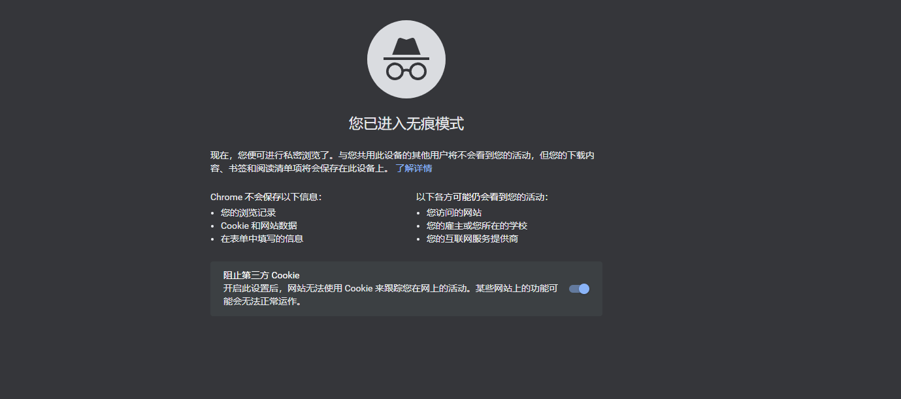

### 分析小工具

猿人学网站集合了一批写爬虫经常使用工具，算是一些实用的分析小工具。有JS反混淆的，自动把请求头信息组装成Python代码的，有抓包参数对比的，有格式化json工具等等。网址：http://tool.yuanrenxue.com/

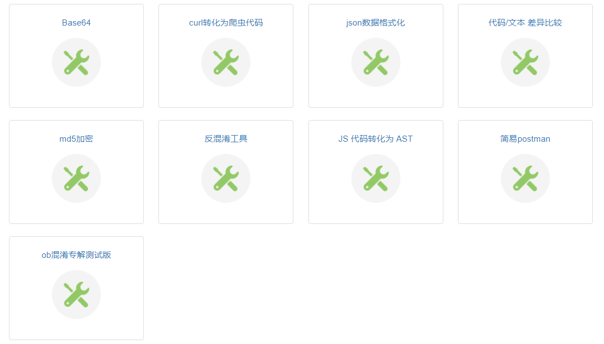

### 安装JS环境

首先需要安装一个能执行Js的环境，推荐 [**Node.js**](https://nodejs.org/en/download/)，**一个基于 Chrome V8 引擎的 JavaScript 运行环境**。

解压下载的文件，拷贝解压路径，添加到环境变量。命令行中输入：`node --version` ，检查Node.js版本。

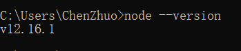

### 安装JS插件

如果你觉得没有必要安装一个完整的JS环境，我们可以选择安装小而精的JS插件，同样能够运行JS代码。

打开PyCharm——选择”File“——选择”Settings“

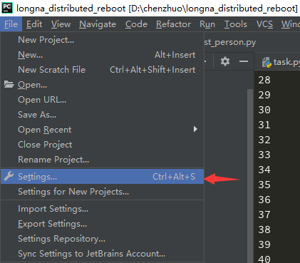

选择”Plugins“——选择”Marketplace“——输入”Node“——点击”Install“（已经安装显示”Installed“）

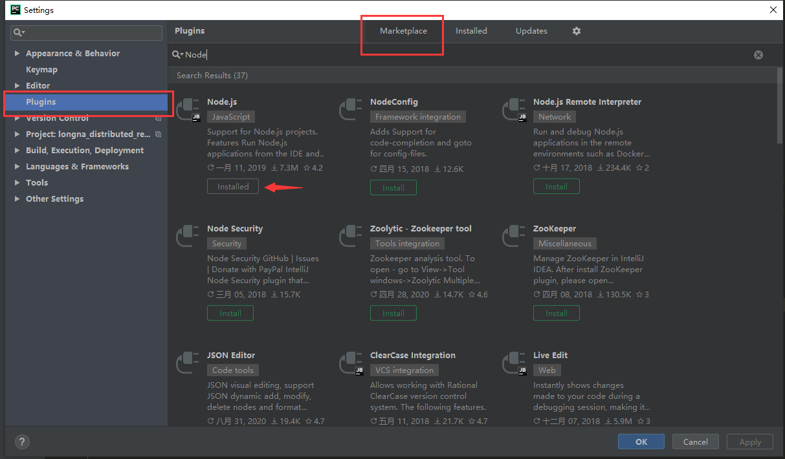

安装好了以后，我们你就可以直接在PyCharm中运行js代码文件了：

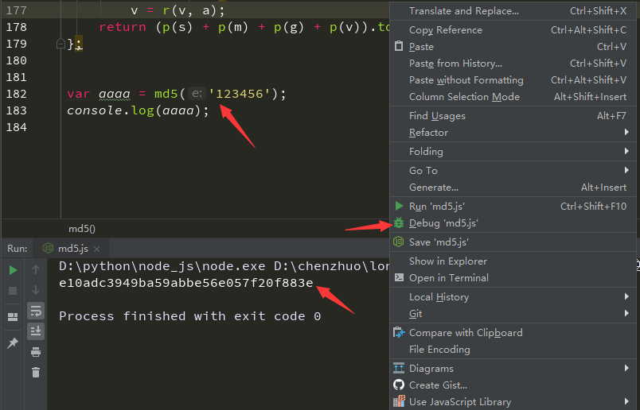

### 安装PyExecJS

**PyExecJS 是一个可以使用 Python 来模拟运行 JavaScript 的库。**大家可能听说过 PyV8，它也是用来模拟执行 JavaScript 的库，可是由于这个项目已经不维护了，而且对 Python3 的支持不好，而且安装出现各种问题，所以这里选用了 PyExecJS 库。

接下来我们安装第三方库PyExecJS：

```
pip install -i https://pypi.douban.com/simple PyExecJS
```

运行代码检查一下运行环境：

```python
# 注意：在导入的时候是execjs不是PyExecJS
import execjs
print(execjs.get().name)

'''
# 解释：js运行环境为Node.js
Node.js (V8)
'''
```

常用的方法：

```
execjs.eval()
输入参数：source(JS语句)、cwd(路径)
返回值：result(语句执行结果)

execjs.compile()
输入参数：source(JS语句)、cwd(路径)
返回值：编译后的对象

execjs.call()
输入参数：name(要调用的JS方法名称)、*args(方法所需要的参数，可多个)
返回值：result(运行方法的返回结果)
```

开发爬虫对JS进行逆向的过程中，经常使用PyExecJS库对js文件当中的方法进行调用：

```python
import execjs

def read_js_file():
    with open("md5.js", 'r', encoding = 'utf-8') as f: # 打开JS文件
        content = f.read()
        return content

jsstr = read_js_file()
JsObj = execjs.compile(jsstr) #加载JS文件
# 调用js方法，第一个参数是JS的方法名，后面则是js方法的参数
ret = JsObj.call('md5', '123456')
print(ret)
```

这里运行的结果和上面插件运行出来的结果一模一样：

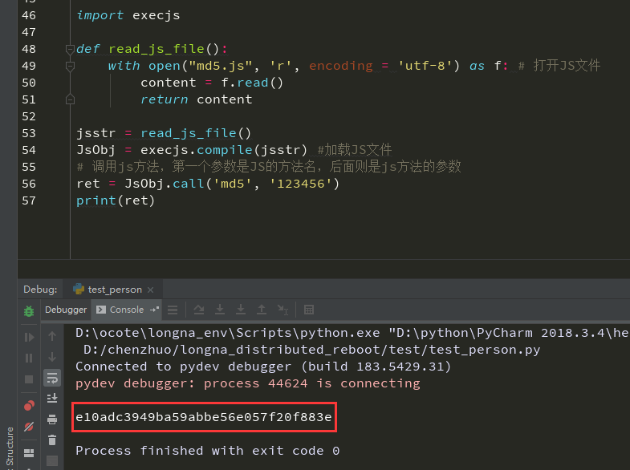

## 常见产品

任何时候我都不会教大家如何破解其他公司的安全产品，但是我们可以学习一下他们在前端的代码，看看他们前端的逻辑是怎么样的。

一线产品（值得学习的对手）：

```
阿里滑块、akamai、自家产品（京东虚拟机、拼多多、各种银行等金融支付接口）、谷歌验证码（含无感验证码）
```

阿里滑块：也叫淘宝滑块，即阿里自家研发的滑块验证。当我们频繁的翻页商品评论时，就会触发该阿里对爬虫的检测，从而弹出滑块进行验证。

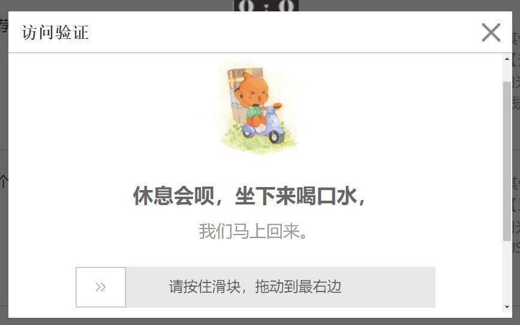

该滑块的核心内容在Chrome开发者工具中的Sources中可以看到，其路径为：`g.alicdn.com\AWSC\uab/1.140.0\collina.js`（注释：1.140.0是版本号）；文件内容特点就是：**使用了大量的三元表达式以及编码。**

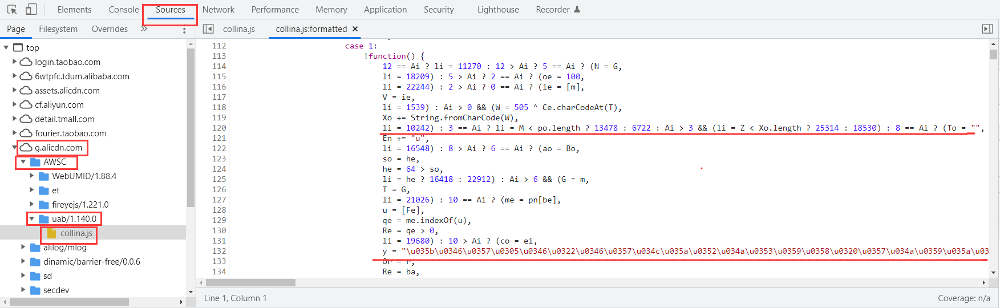

akamai：国内产品很少使用，这里就看一下简介即可。

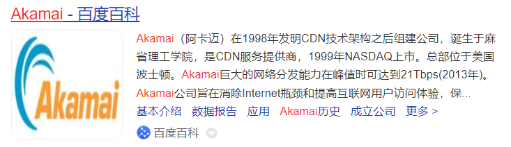

拼多多：拼多多商城，里面不仅使用了webpack打包，还有强混淆。现在的对抗不仅限于JS了，对风控的要求更高了，例如：高质量的代理IP、访问逻辑要求很高等。

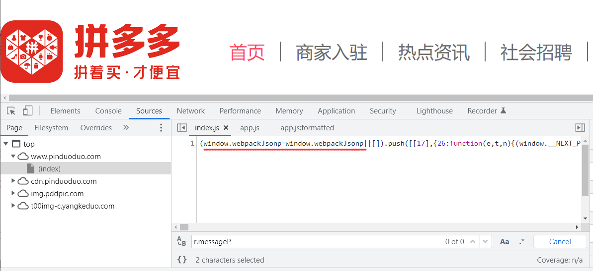

谷歌验证码：即谷歌自己开发的人机身份验证码，其实就是图片识别，这个难度颇高，有时候真人都不一定能通过。


二线产品（值得尊敬的对手）：

```
瑞数安全、极验、数美、创宇超防（也叫加速乐）、五秒盾（新）、易盾、顶象
```

瑞数：由瑞数安全公司研发的产品，更新频率不是很高，难度不是特别高。文件内容特点：**很多使用 `_$**` 的形式为变量名。**瑞数产品是由版本号的，目前有：3代、4代、5代、6代（最新）；我们可以通过Chrome开发者工具中的Application来查看产品的版本号：**点击Cookies，选中网站，查看其中两个Name最相似的字段的值，如果是4开头就是4代，如果是5开头就是5代。**下图就是瑞数5代的产品：

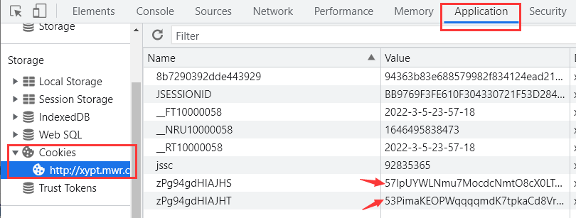

极验：在爬虫中讲过极验就是缺口滑块验证码，当时使用的是Selenium驱动浏览器通过的，其实还有一种方法就是通过JS来通过。验证码的主要文件路径：`https://static.geetest.com/static/js/fullpage.9.0.9.js`；文件内容特点就是：**许多值被编码成了 `\u****` 这样的形式。**

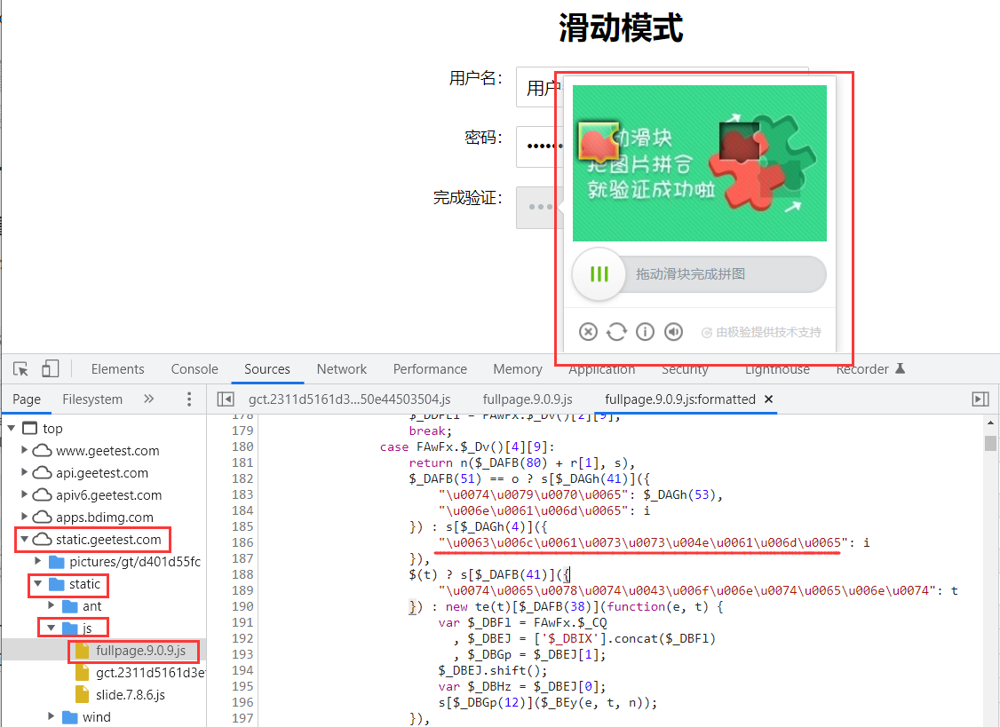

数美：更新频率很高的验证码，基本一天一改。主要文件路径：`https://castatic.fengkongcloud.com/pr/v1.0.3/smcp.min.js`；文件内容特点：**长的很像ob混淆。**

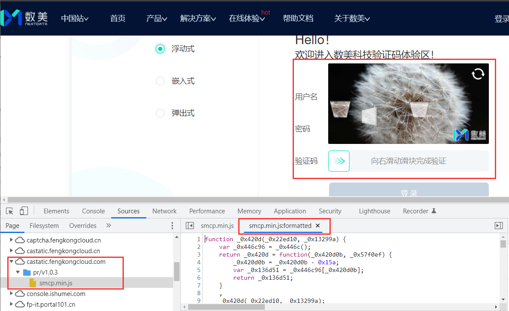

创宇超防（也叫加速乐）：**这里首先解释一下为什么叫加速乐，其原因就是设置的Cookie字段当中带有 `jsl` 字符串，相当于是它的一个特点。**里面有三层访问逻辑，但都不难，特色是一个纯动态的访问过程。下图就是访问一个使用了加速乐的网站抓包后的数据包：

第一层：返回一个需要带上的Cookie的js内容。

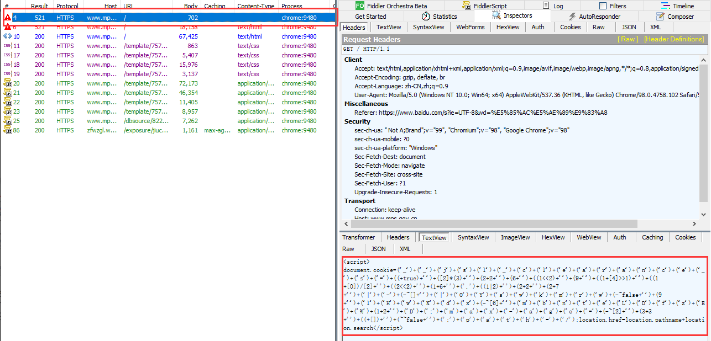

第二层：带上第一层的Cookie访问，返回一个ob混淆后的JS内容 。

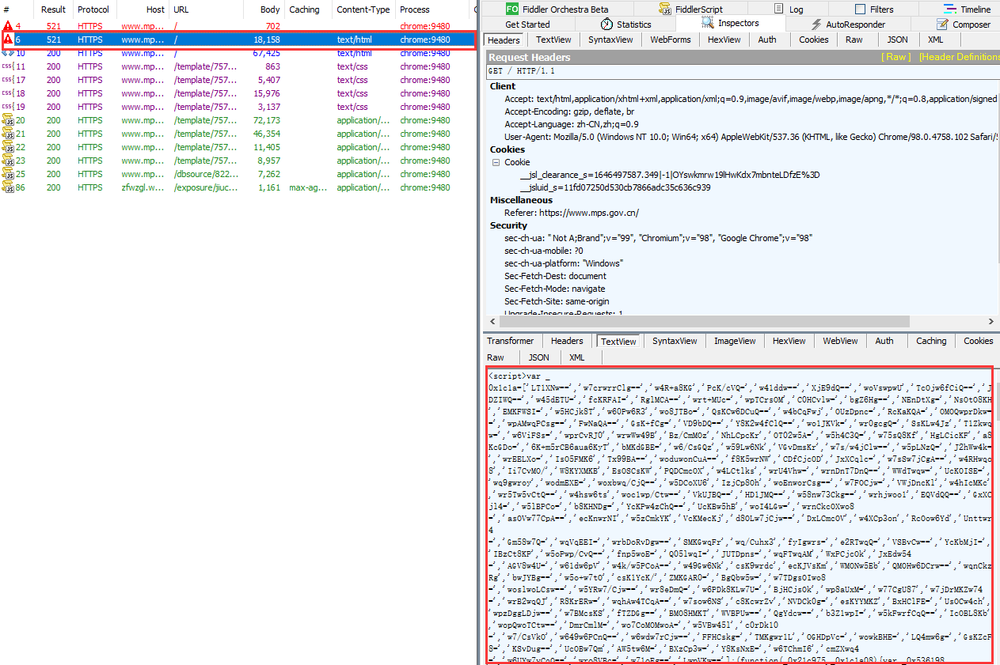

第三层：带上第二层通过JS内容设置的Cookie后返回网页内容。


网易易盾：这个是网易公司自己旗下的验证码产品，这个验证码其实也不太好处理，有的甚至包含空间推理。主要文件路径：`https://acstatic-dun.126.net/2.7.1_7c08033d/watchman.min.js`

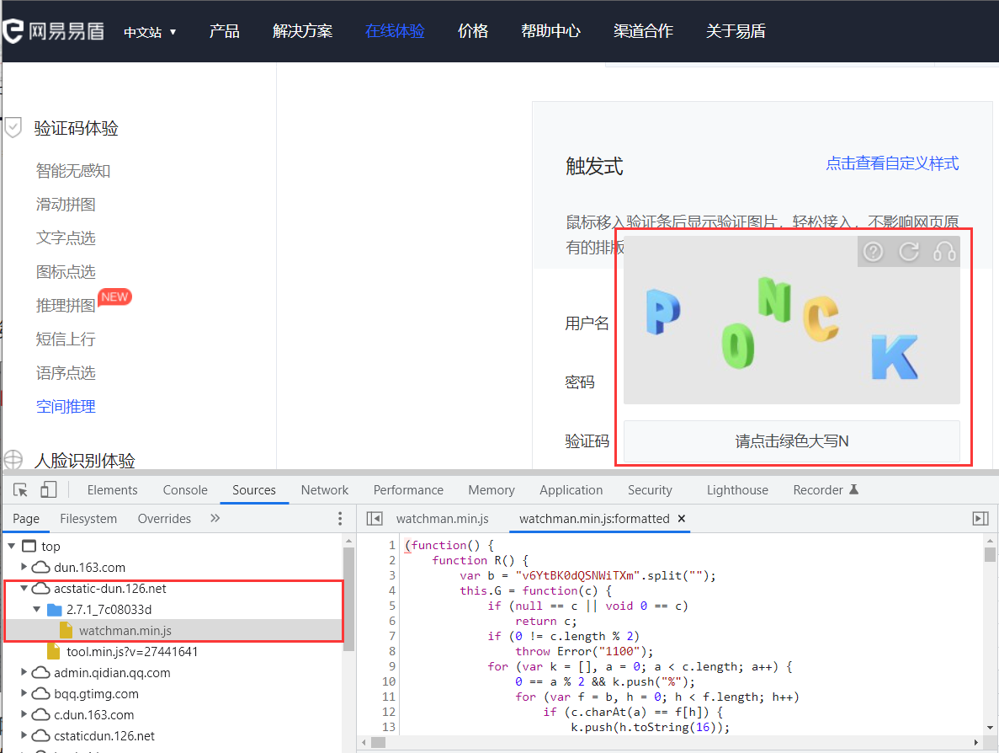

顶象：也是一款验证码产品，且更新频率很高几乎也是一天一变，对抗的话也是一个长期对抗的过程。

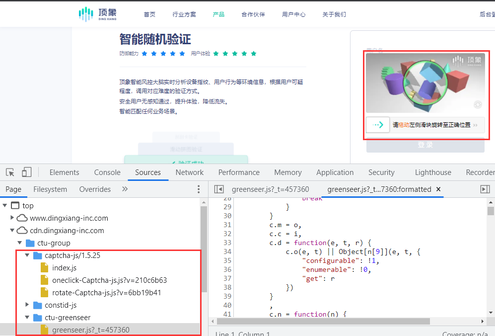

三线产品（多数为开源框架/混淆了，不能叫产品，这个后面会仔细讲）：

```
ob混淆系（obfuscator.io、sojson v5.0 v6.0、JShaman）、jsfuck、JJEncode、AAEncode、eval类等
```

容易被误认为是产品，但是实际上是前端框架的东西：

```
webpack、vue、react、angular等打包后（实际上有些也是基于webpack）
