# JS逆向实战

## 章节简介

**本章节针对的重点是JS加密网站的实战破解，目标是提升爬虫的防JS反爬能力。**以下是各个小结的加密方式分析以及使用的JS文件：

| 名称                                                      | 难度     | 加密方式             | 总结                                                         |
| --------------------------------------------------------- | -------- | -------------------- | ------------------------------------------------------------ |
| [JS逆向02-简单访问逻辑](JS逆向02-简单访问逻辑.md)         | 非常简单 | 访问逻辑，请求头顺序 | 一是访问页面的逻辑；二是请求头的顺序需要使用Fiddler展示的。  |
| [JS逆向03-简单GET参数加密](JS逆向03-简单GET参数加密.md) | 非常简单 | JS加密（GET参数） | 一是通过Initiator里的request定位发送请求的代码；二是百度得到 `btoa()` 方法JS源码，返回base64编码。 |
| [JS逆向04-简单Cookie加密](JS逆向04-简单Cookie加密.md)     | 非常简单 | JS加密（Cookie）     | Fiddler能抓到了Chrome开发工具抓不到的数据包，Cookie就藏身其中。 |
| [JS逆向05-读取wasm文件](JS逆向05-读取wasm文件.md) | 非常简单 | JS加密（读文件）     | 一是读取 `.wasm` 格式文件；二是通过JS代码 `return Array(t1,t2);` 返回一个数组。 |
| [JS逆向06-有道翻译](JS逆向06-有道翻译.md) | 简单 | JS加密 | 一是通过关键参数进行定位；二是熟悉JS代码分析替换的过程；三是md5加密。 |
| [JS逆向07-Window蜜罐](JS逆向07-Window蜜罐.md) | 简单 | JS加密（关键词换算） | 一是通过 `函数.toString()` 将长函数拷贝；二是注意变量污染；三是注意异常处理以及逻辑运算符的影响。 |
| [JS逆向08-JS混淆源码乱码](JS逆向08-JS混淆源码乱码.md) | 简单 | JS加密（简单混淆） | 一是简单的utf-8、unicode编码反混淆；二是debugger置为false；三是JS加密函数其他文件。 |
| [JS逆向09-动态Cookie加密](JS逆向09-动态Cookie加密.md) | 简单 | JS加密（ob混淆）                   | 一是ob混淆和反混淆；二是 `setInterval` 定时函数里面 `timeout` 参数多少毫秒运行一次。 |
| [JS逆向10-JS混淆乱码增强](JS逆向10-JS混淆乱码增强.md) | 中等 | JS加密（ob混淆） | 一是了解虚拟机和临时文件VM，临时文件抓不到；二是注入hook钩子函数；三是 `Call Stack` 调用堆栈；四是js代码中的 `,` 逗号不能随便改成 `;` 分号；五是js标准库引用；六是补node环境 `window = global`。 |
| [JS逆向1１-回溯](JS逆向10-回溯.md) | 中等 | JS编码 | 一是重点关注请求成功响应的success；二是有三种js编码，aaencode，jjencode，JSFuck；三是补V8环境 `window = this;` 要注释其他代码，例如 `window = {};` 等的干扰。 |

## JS逆向简介

### 大势所趋

随着爬虫技术的普及，其产生的经济效益也是不容小觑，例如，公司通过爬虫获取数据再以付费的形式提供给需要数据服务的人。但任何技术都是有两面性的，各大权威数据发布网站对于爬虫就不是那么友好了，因为爬虫会给他们网站服务器造成格外的压力和虚假的流量，例如，有的网站访问量达到了90亿次，但其中几乎90%的访问量都是爬虫带来。

因此，许多被爬的网站针对爬虫设置了许多的反爬措施，例如，请求头必须是浏览器，一个ip不能高频率访问，各式各样的验证码等。其中JS加密成为了许多网站反爬的选择，原因是：

- JS在所有浏览器中都通用；
- JS有改变网页内容的能力；
- JS是在浏览器进行加载和解析，不会消耗服务器资源；
- 爬虫想要获取JS加密前的网站内容，那么爬虫开发者必须熟练JS，并且通过逆向还原；

综上所述，学会了JS逆向，我们有相当于又多了一条解决JS加密的道路，而且优势巨大，找爬虫类的工作也是轻而易举。

### 逆向流程

**JS逆向简单说，就是对JS加密后的内容（POST参数、Cookie、网页内容等）进行JS解密的一个过程。**这个解密的过程大体上都是相似的：

1. 访问网站，抓取数据包，并进行分析；
2. 找出加密内容，定位到JS代码加密的节点；
3. 分析JS加密过程，在能运行JS环境的工具中进行逆向还原；
4. JS调试成功后，让爬虫运行过程中加载JS，成功获取网页内容。

## 准备工作

### Chrome无痕

现在 Chrome（谷歌浏览器）已经是我们分析网络请求的最常用的工具之一了，但 Chrome 提供了一种无痕模式会更加有助于我们分析。打开Chrome无痕模式有三种方法：

方法一：点击浏览器右上方×号下方的菜单按钮，选择“打开新的无痕窗口”；

方法二：右键单击任务栏中的谷歌浏览器，点击“打开新的无痕窗口”；

方法三：快捷键Ctrl+Shift+N

打开Chrome无痕模式后，会跳出一个新的黑色窗口，会提示你使用了无痕模式，并提示无痕模式不会保存信息：**因此后期我们分析爬虫请求Chrome一律在无痕模式下。**


### 分析小工具

猿人学网站集合了一批写爬虫经常使用工具，算是一些实用的分析小工具。有JS反混淆的，自动把请求头信息组装成Python代码的，有抓包参数对比的，有格式化json工具等等。网址：http://tool.yuanrenxue.com/


### 安装JS环境

首先需要安装一个能执行Js的环境，推荐 [**Node.js**](https://nodejs.org/en/download/)，**一个基于 Chrome V8 引擎的 JavaScript 运行环境**。

解压下载的文件，拷贝解压路径，添加到环境变量。命令行中输入：`node --version` ，检查Node.js版本。


### 安装JS插件

如果你觉得没有必要安装一个完整的JS环境，我们可以选择安装小而精的JS插件，同样能够运行JS代码。

打开PyCharm——选择”File“——选择”Settings“


选择”Plugins“——选择”Marketplace“——输入”Node“——点击”Install“（已经安装显示”Installed“）


安装好了以后，我们你就可以直接在PyCharm中运行js代码文件了：


### 安装PyExecJS

**PyExecJS 是一个可以使用 Python 来模拟运行 JavaScript 的库。**大家可能听说过 PyV8，它也是用来模拟执行 JavaScript 的库，可是由于这个项目已经不维护了，而且对 Python3 的支持不好，而且安装出现各种问题，所以这里选用了 PyExecJS 库。

接下来我们安装第三方库PyExecJS：

```
pip install -i https://pypi.douban.com/simple PyExecJS
```

运行代码检查一下运行环境：

```python
# 注意：在导入的时候是execjs不是PyExecJS
import execjs
print(execjs.get().name)

'''
# 解释：js运行环境为Node.js
Node.js (V8)
'''
```

常用的方法：

```
execjs.eval()
输入参数：source(JS语句)、cwd(路径)
返回值：result(语句执行结果)

execjs.compile()
输入参数：source(JS语句)、cwd(路径)
返回值：编译后的对象

execjs.call()
输入参数：name(要调用的JS方法名称)、*args(方法所需要的参数，可多个)
返回值：result(运行方法的返回结果)
```

开发爬虫对JS进行逆向的过程中，经常使用PyExecJS库对js文件当中的方法进行调用：

```python
import execjs

def read_js_file():
    with open("md5.js", 'r', encoding = 'utf-8') as f: # 打开JS文件
        content = f.read()
        return content

jsstr = read_js_file()
JsObj = execjs.compile(jsstr) #加载JS文件
# 调用js方法，第一个参数是JS的方法名，后面则是js方法的参数
ret = JsObj.call('md5', '123456')
print(ret)
```

这里运行的结果和上面插件运行出来的结果一模一样：


## 环境基础

以下操作全部在Chrome（谷歌浏览器）中的Console执行。打开方式如下：按F12键，选择Console即可。


### 清理缓存

在认识的环境的过程当中，会有许多代码案例，**可能会存在变量重名冲突的情况，因此我们就要需要清理一下缓存，方法也很简单，点击刷新按钮即可。**


### 初识环境

**首先JS代码还没运行的时候，JS环境里已经有一个 `window` 对象了。可以说，`window` 是整个浏览器中最底层的对象。很多时候我们都会把 `window` 对象省略，因为它是源头，例如 `eval等价于window.eval` 等：**


?> 提示：在node.js当中没有 `window` 对象，它的全局对象是 `global`。

**`window` 对象有一个 `Object` 属性是一个函数对象，也是原生底层对象，在里面有一个重要属性是 `prototype` ，在里面又有许多属性：**

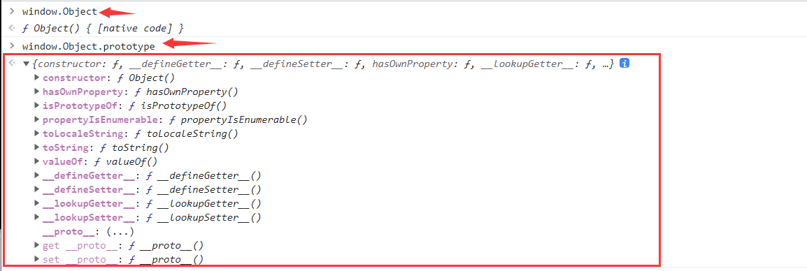

**`constructor` 是反向的 `prototype` 作用：**


### 原型链

理解原型链首先我们先记住下面这四个前提：

1. **JS中所有事物都是对象，对象是拥有属性和方法的数据；**
2. **每一个对象都有 `__proto__` 属性；**
3. **每个函数不仅有 `__proto__` 属性还有 `prototype` 属性；**
4. **`__proto__` 是浏览器厂商实现的，W3C规范中并没有这个东西。**

**实例对象的 `__proto__` 实质是指向构造函数的 `prototype`。**如下：


**当实例对象调用方法的时候，js引擎会沿着 `__proto__` -> `ptototype` 的顺序一直往上方查找，找到 `window.Object.prototype` 为止，如果没有找到，就会报错或者返回 `undefined` 。**如下：

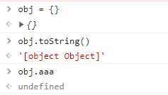

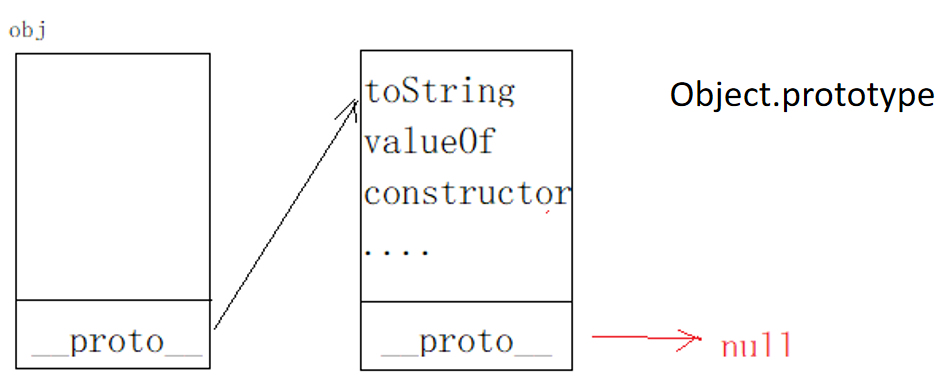

如果用相同的名称重写图中的 `toString()` 方法，当js引擎向上查找的时候，就使用的重写方法，而不是使用的 `Object.toString()` 方法，以此来达到以假乱真的目的。

**同样的，定义一个数组就会产生一个更长的原型链。arr没有 `valueOf`，就去 `arr.__proto__` 上找，发现也没有 `valueOf`，就去 `arr.__proto__.__proto__` 就是 `window.Object.prototype` 上找，所以 `arr.valueOf` 其实就是 `window.Object.prototype.valueOf`。**原型链如下：


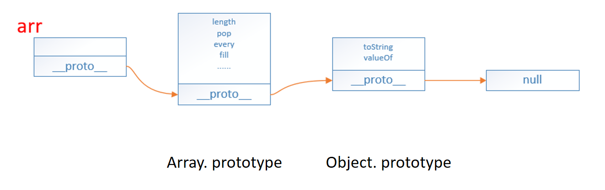

### 函数对象

**函数是Function类型的实例对象，所以函数本身拥有的对象属性，可以简单的理解：函数即对象。**因此，函数的 `__proto__` 是指向 `Function.prototype` 的：


用 new 关键字来调用的函数时，过程如下：

1. 产生一个新对象，使用new关键字调用函数时，就会开辟一个新的内存空间，用来存储该函数实例化的对象；
2. 链接到原型；
3. 绑定 this，函数体内部的 this 指向该内存空间，给 this 添加属性，就相当于给实例添加属性；
4. 返回新对象。

```javascript
function create(...rest) {
    // 创建一个空的对象
    let obj = new Object()
    // 获得构造函数
    let Con = rest.shift()
    // 链接到原型
    obj.__proto__ = Con.prototype
    // 确定this执行构造函数
    let result = Con.apply(obj, arguments)
    // 确定new出来的是个对象
    return typeof result === 'object' ? result : obj
}
```


**函数内部的属性通过实例化的对象可以在外部调用，但函数内部的变量和方法只能在函数内部调用。**如下：

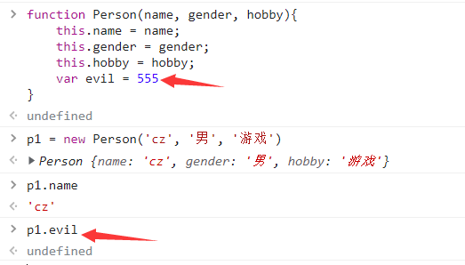

**p1是Person函数的实例对象，也就是说Person是p1的构造函数。**按照上面原型链的解释，就会有如同上面的函数的等价关系：


?> 提示：如果不写new，那么p1就等于Person的返回值，即 `undefined` 。

### 自执行匿名函数

**在js中使用声明式 `function XXX() {}` 会导致函数提升，因为解释器会优先编译函数。**例如：

```javascript
fn1();  //可以正常调用
function fn1() {}  //优先编译
```

**表达式中的函数则不会出现函数提升，而是解释器逐行解释，因此如果调用在函数表达式之前，则会调用失败。**如下

```javascript
fn2();  //未定义
fn2 = function fn1() {}  //开始解释
fn2();  //可以正常调用
```

**编译过程当中，同名函数的的返回值会相互覆盖。**如下：


自执行匿名函数有如下5种表达方式：

```javascript
(function(){})()  //返回undefined
!function(){}()  //返回true
~function(){}()  //返回返回返回-1
-function(){}()  //返回返回NaN
+function(){}()  //返回NaN
```

### 原型链继承

**继承：继承就是子类可以使用父类的所有功能，并且对这些功能进行扩展。**

比如，有两个构造函数A、B，但是B想要使用A里的一些属性和方法，一种办法就是复制粘贴一波，还有一种就是利用继承，我让B直接继承了A里的功能，这样我就能用它了。这里我们讲解原型链继承：

**原型链继承：将要继承构造函数的实例化对象赋值给被继承函数的 `prototype` 属性。**

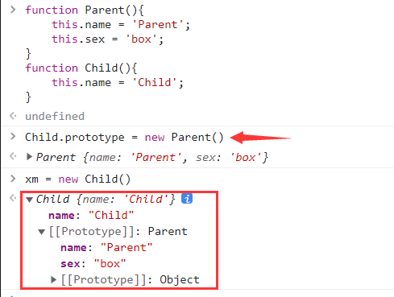

**当我们输出xm对象的sex属性时，就会去Child里面找，找不到，就去Parent里面找，而name属性在Child里面有，就直接输出了。**如下：

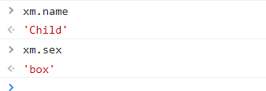

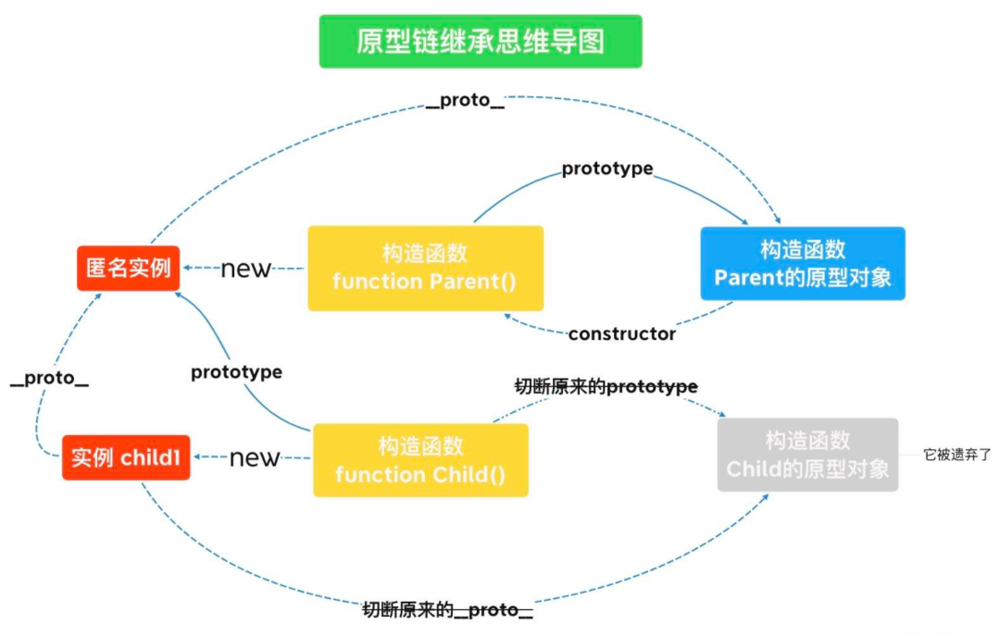

**`instanceof` 可以检测构造函数的prototype属性是否出现在某个实例对象的原型链上。**例如 `A instanceof B` ，即实例对象A的原型链（`__proto__`）是否有构造函数B.prototype，有则返回 `true`，否则返回`false`。如下：


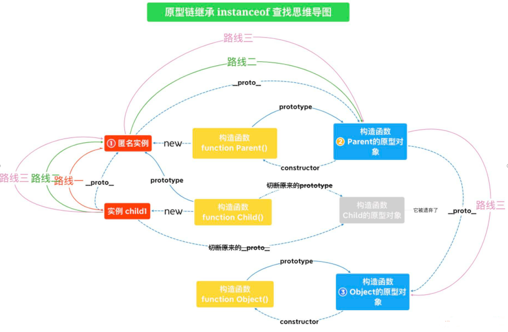

### Class继承

我们还可通过 `class` 的方式来继承：

 

### 多态

**多态：指同一操作作用于不同的对象上，可以产生不同的解释和不同的执行结果。**


### this绑定

this是指当前的内存空间下，学习this绑定最重要的一点就是，**this永远指向最后调用它的对象。**

**默认绑定：在函数当中，非严格模式下this指向全局对象window，严格模式下this会绑定到undefined；**

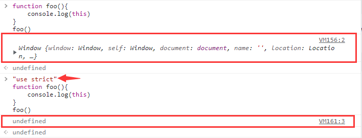

这里解释一下图中，在非严格模式下 `this` 是指向全局对象window，所以 `foo` 函数中 `this.a` 输出了最上面定义的 `var a = 10` 的值，在严格模式下 `this` 是指向undefined，所以 `foo` 函数中 `this.a` 输出了undefined；


函数当中里面定义的变量，由于作用域的影响是不会绑定到window，即使在闭包函数中也是同样的效果中；


使用 `let`、`const` 等关键字是不会与this绑定的；

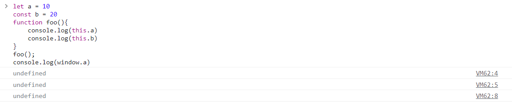

**隐式绑定：当函数引用有上下文对象时，如 `obj.foo()` 的调用方式，foo内的this指向obj。**


**被隐式绑定的函数在特定的情况下会丢失绑定对象，即隐式丢失。同样丢失后的this，非严格模式下指向全局对象window，严格模式下会绑定到undefined；**

**一种是使用另一个变量来给函数取别名**：下图中 `obj.foo()` 中的this指向调用者 `obj`；`foo2()` 发生了隐式丢失，调用者是window，使得 `foo()` 中的 `this` 指向window；`foo3()`发生了隐式丢失，调用者是 `obj2`，使用 `foo()` 中的 `this` 指向 `obj2`；


**另一种是将函数作为参数传递时会被隐式赋值，回调函数丢失this绑定**：把一个函数当成参数传递到另一个函数的时候，也会发生隐式丢失的问题，且与包裹着它的函数的this指向无关。

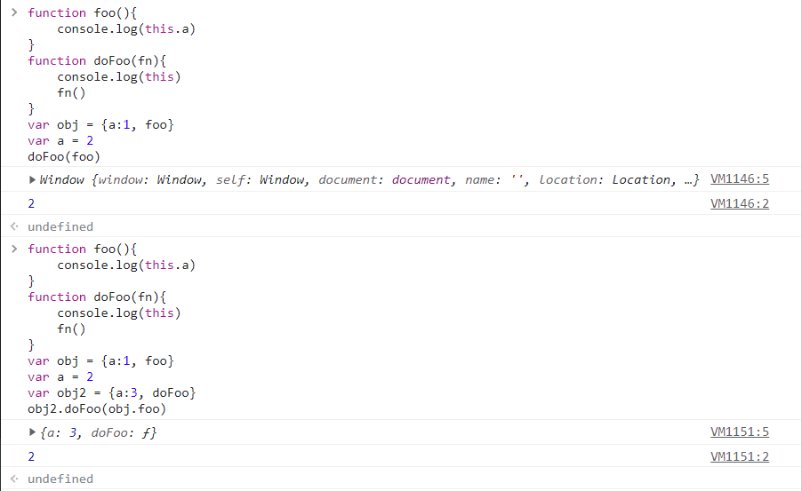

**显示绑定(通过 `call()` 或者 `apply()` 方法直接指定this的绑定对象)，需要注意的是使用 `call()` 或者 `apply()` 的函数是会直接执行的，`call()` 接收若干参数，例 `fn.call(this, 1, 2, 3)`， `apply()` 接收的是一个数组，例 `fn.apply(this,[1, 2, 3])`，`bind()` 是返回值为一个新的函数，需要再次调用 `fn.bind(this)(1, 2, 3)` 才会执行。**如果call、apply、bind接受到的第一个参数是空或者null、undefined的话，则会忽略这个参数。另外，forEach、map、filter函数的第二个参数也是能显式绑定this的。


**this永远指向最后调用它的对象。**下图中，有一个setTimeout定时器实质就是 `window.setTimeot` 当中的方法，因此this也就指向了window。


下图就通过 `call()` 绑定了obj1：

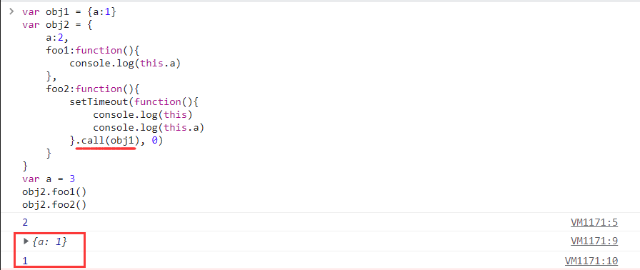

下图中第一个数字2是 `foo()` 输出的，**虽然 `foo()` 函数也返回了一个函数，但是并没有调用它，只有写成 `foo()()` 才算是调用匿名函数；**第二个数字1是 `foo.call(obj)` 输出的，由于 `.call()` 是紧跟 `foo` 的，所以改变的是 `foo()` 内this的指向，并且 `.call()` 是会使函数立即执行，因此打印出1，同样他也没有调用返回函数；第三个数字2是 `foo().call(obj)` 先执行 `foo()` 时打印出来的，此时 `foo()` 内的this还是指向window，在执行完 `foo()` 之后，返回一个匿名函数，并且后面使用了 `.call(obj)` 来改变这个匿名函数的this指向并调用了它，所以输出了1。


**new绑定：下图中重新定义了name，因此后面 `this.name` 输出了123456，但即使刷新清理缓存后也还是会输出123456，除非重新打开一个新的选项卡，输出才会为空，这是由于浏览器的特性，不清理window的name属性。**


深入理解再看下面一个例子：

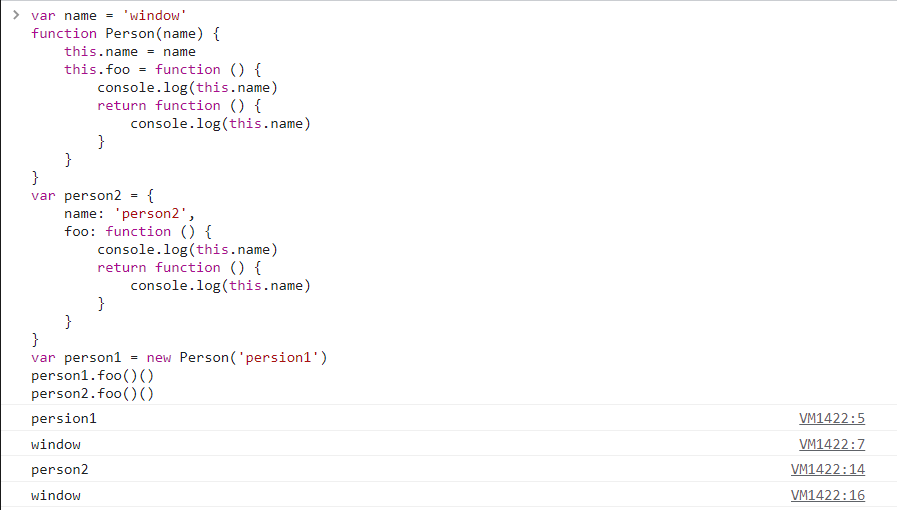

new和call绑定可以看下面的例子： `Person1.foo.call(person2)()` 这种写法改变的是foo函数内的this指向。


**箭头函数绑定：this的指向由外层作用域决定的。**

```
Arrow Function（箭头函数）是ES6标准新增了一种新的函数，因为它的定义用的就是一个箭头：
x => x * x
相当于：
function (x) {
    return x * x;
}
```

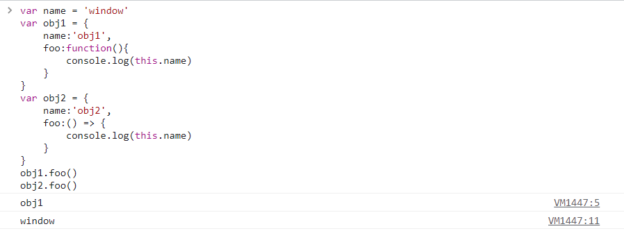

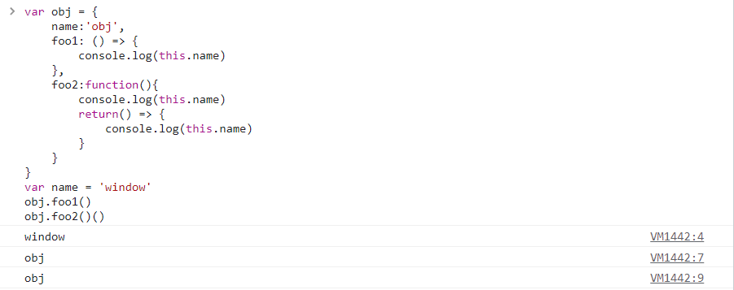

箭头函数的this无法通过bind、call、apply来直接修改，但是可以通过改变作用域中的this的指向来间接修改。


### 非指纹built-in函数

一些常见非指纹built-in函数（必须记住）：

```
decodeURIComponent encodeURI encodeURIComponent
Math 、round 、 random、parseInt 等强制转换
shift、pop、push、unshift
slice、splice、split、substring、substr、concat
String 、 fromCharCode、 charCodeAt
atob 、btoa、Uint8Array、 ArrayBuffer、 Int32Array、 Int16Array
setTimeout 、setInterval、 clearTimeout
```

`unescape` 解码函数：返回解码后的字符。

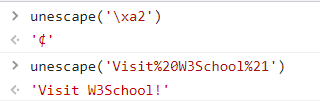

`Function` 构造：构造返回一个函数。

```javascript
var fun = new Function("a", "return a")
// 等价于
function fun(a){
    return a
}
```

`eval` 函数：将字符串当作js代码执行。

```javascript
eval('alert(111)')
```

`Array` 函数：构造一个新的数组。


`Object` 函数：底层原型对象，返回一个空对象。

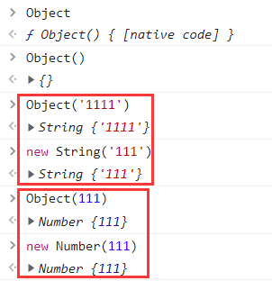

`Date` 函数：返回本地时间，而非服务器的时间。


`RegExp` 函数：正则相关的函数。


`indexOf` 函数：返回查找结果的索引值。


`hasOwnProperty` 函数：


