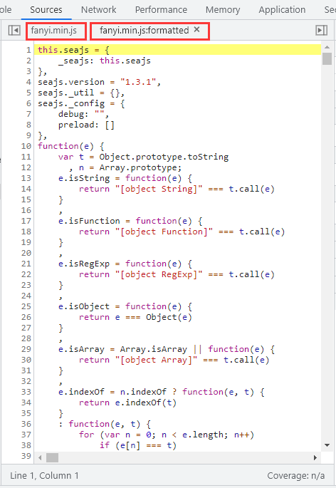

# 有道翻译

## 简介

有道翻译是网易公司开发的一款翻译软件，其最大特色在于翻译引擎是基于搜索引擎，网络释义的，也就是说它所翻译的词释义都是来自网络。

有道桌面词典背靠其强大的搜索引擎（有道搜索）后台数据和“网页萃取”技术，从数十亿海量网页中提炼出传统词典无法收录的各类新兴词汇和英文缩写，如影视作品名称、品牌名称、名人姓名、地名、专业术语等。由于互联网上的网页内容是时刻更新的，因此有道桌面词典提供的词汇和例句也会随之动态更新，以致将互联网上最新、最酷、最鲜活的中英文词汇及句子一网打尽。

有道翻译网站地址：https://fanyi.youdao.com/

## 逆向流程

### 抓包解析

输入一个词“逆向”，通过Chrome自带的开发者工具抓取数据包，在Network(网络部分)的Fetch/XHR选项筛选出返回内容的数据包，在Response部分可以看到返回的结果。


切换到header部分，比较两次相同内容的请求，发现Request Headers参数没有什么变化，但POST参数有三个参数有变化：

```
salt: 16303966363048
sign: a5ede67eabd2c6a8b06975b09e2c5a6b
lts: 1630396636304


可以看到 `salt` 和 `lts` 参数差不多，有爬虫经验的人，第一直觉就是时间戳，因为这个两个参数随着时间在不断的变大，而且数值和时间戳类似，确保万一取数值的前10位进行验证一下：


看来时间戳猜想完全正确，**一般来说，网络上使用时间戳都会精确到毫秒。这里可以进行下一步确定，`lts` 参数是精确到毫秒的9位时间戳，`salt` 参数就是9位时间戳加1个未知参数。**

### 逆向分析

现在我们未知参数就剩下 `sign` 参数和 `salt` 最后一位参数。我们全局搜索一下 `salt` 的名称：


发现就在一个js文件中出现了 `salt` 的名称，点击进入，跳转到Sources选项中查看 `fanyi.min.js` 文件：


js文件中所有的代码都在一行，点击下方的 `{}` 按钮，在上方出现了 `fanyi.min.js:formatted` 这就是将 `fanyi.min.js` 文件中js代码格式化后的结果，方便我们阅读：



继续在文件中搜索 `salt` 名称，共有12处匹配，经过比对，在8979行找到了和POST参数最为接近的代码：


点击8988行处打上断点，点击翻译，代码运行卡在断点处，里面显示许多我们要使用的参数及来源：


通过观察可得出 `salt` 、`sign`、`lts` 、`bv` 参数与js代码中的 `r` 参数关系密切，查看 `r` 参数就在上方面：


**`r` 参数的构造也很简单，就是一个 `v` 类调用了 `generateSaltSign()` 方法传入了参数 `n` ，即翻译的内容“逆向”。选中方法名称，提示来自于8383行，点击位置跳转。**在8393行打上断点，点击翻译，断点卡住：


一看显示的内容，所有的参数基本都豁然开朗了。有没显示的参数，点击Search点击Console输入参数名称，直接打印出来。到这里就可以对参数做一个总结了：

```
r = {
  ts: 字符串类型的时间戳,
  bv: 浏览器user-agent的md5加密,
  salt: 字符串类型的时间戳 + 0到9随机取整,
  sign: "fanyideskweb" + （查询的内容） + （字符串类型的时间戳 + 0到9随机取整） + "Y2FYu%TNSbMCxc3t2u^XT"的md5加密
}

i: 动态值（查询的内容）
from: 默认值“AUTO”（被翻译的语言类型）
to: 默认值“AUTO”（翻译结果的语言类型）
smartresult: 固定值“dict”
client: 固定值“fanyideskweb”
salt: r参数.salt
sign: r参数.sign
lts: r参数.ts
bv: r参数.bv
doctype: 固定值“json”
version: 固定值“2.1”
keyfrom: 固定值“fanyi.web”
action: 固定值“FY_BY_CLICKBUTTION“
```

### 扣JS代码