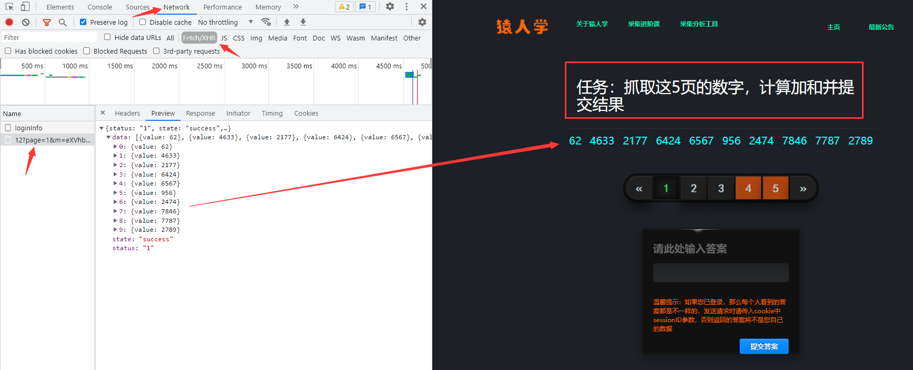
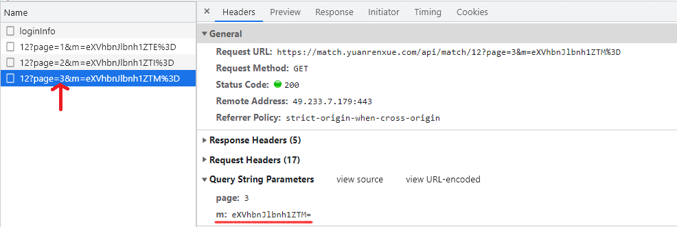
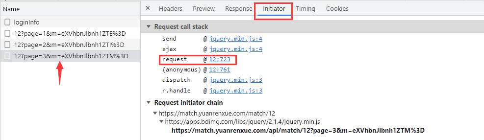
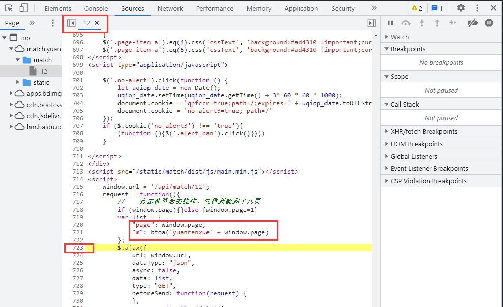

# 简单POST参数加密

## 简介

猿人学是一个专注做爬虫和数据结构的卖课平台。猿人学第一届Web端爬虫攻防赛于2020年10月16日开始，总奖金3万，共设10题，主要涉及JS反混淆，CSS反加密，图文验证码对抗等技术。 参加该比赛，你能获得物质奖励，能结识一批志同道合的人，可能拿到更好的offer，欢迎你的参加。比赛已于2020年10月20日结束。

第一届Web端猿人学攻防大赛【官方网站】：https://match.yuanrenxue.com/

网址：https://match.yuanrenxue.com/match/12

难度：非常简单

## 逆向流程

### 抓包解析

首先右键单击任务栏中的谷歌浏览器，点击“打开新的无痕窗口”，按F12打开“开发者工具”：


访问网址获取任务，在Network里面的Fetch/XHR选项中定位到了该网页数据的来源请求：



访问前面3页，分析前3页请求头参数后，得出初步接结论：**page参数就是页码，m参数是加密参数**



### 逆向分析

现在我们需要定位到，哪一行的代码发送了当前的请求，点击左侧的Initiator选项，它主要是标记请求是由哪个对象或进程发起的（请求源），重点关注里面的request请求：



显示从一个名称为“12”的文件的第723行代码发送了当前请求，点击后面的地址，跳转到了该文件的第723行，看上面有两个很熟悉的参数page和m，再看后面跟的值，一切豁然开朗：



这下就可以对加密参数完全得出结论了：

```
page的参数值为window.page，即页码。
m的参数值为'yuanrenxue'+页码，再通过btoa()方法转为Base64编码。
```

### 扣JS代码

虽然Python当中有现成的库，可以将字符串转为Base64编码，但这里为了练习和提升我们的JS能力，我们需要自己通过JS脚本来实现此功能。

**这里需要注意一点的是，`btoa()` 方法之所以能在浏览器使用，是因为已经加载关于该方法的源码，但源码的位置并不在上面的“12”文件中，因此我们代码中要使用 `btoa()` 方法就必须要获取该方法的源码，可自行百度得到。**

```javascript
var base64hash = 'ABCDEFGHIJKLMNOPQRSTUVWXYZabcdefghijklmnopqrstuvwxyz0123456789+/';

// btoa方法源码
btoa = function (s) {
        if (/([^\u0000-\u00ff])/.test(s)) {
            throw new Error('INVALID_CHARACTER_ERR');
        }
        var i = 0,
            prev,
            ascii,
            mod,
            result = [];

        while (i < s.length) {
            ascii = s.charCodeAt(i);
            mod = i % 3;

            switch(mod) {
                case 0:
                    result.push(base64hash.charAt(ascii >> 2));
                    break;
                case 1:
                    result.push(base64hash.charAt((prev & 3) << 4 | (ascii >> 4)));
                    break;
                case 2:
                    result.push(base64hash.charAt((prev & 0x0f) << 2 | (ascii >> 6)));
                    result.push(base64hash.charAt(ascii & 0x3f));
                    break;
            }

            prev = ascii;
            i ++;
        }

        if(mod == 0) {
            result.push(base64hash.charAt((prev & 3) << 4));
            result.push('==');
        } else if (mod == 1) {
            result.push(base64hash.charAt((prev & 0x0f) << 2));
            result.push('=');
        }

        return result.join('');
    };
```

## 爬虫代码

```python
#!/usr/bin/env python
#-*- coding:utf-8 -*-
# @Time    : 2021/9/27 1:23
# @Author  : chenzhuo
# @Desc    :
import re
import execjs
import requests

# 打开JS文件并加载JS文件
with open("上面的js文件名称.js", 'r', encoding = 'utf-8') as f:
    content = f.read()
JsObj = execjs.compile(content)

# 请求头
headers = {
    'accept': 'application/json, text/javascript, */*; q=0.01',
    'accept-encoding': 'gzip, deflate, br',
    'accept-language': 'zh-CN,zh;q=0.9',
    'cookie': '温馨提示：如果您已登录，那么每个人看到的答案都是不一样的，发送请求时请传入cookie中 sessionID参数，否则返回的答案将不是您自己的数据',
    'referer': 'https://match.yuanrenxue.com/match/12',
    'sec-ch-ua': '"Google Chrome";v="93", " Not;A Brand";v="99", "Chromium";v="93"',
    'sec-ch-ua-mobile': '?0',
    'sec-ch-ua-platform': '"Windows"',
    'sec-fetch-dest': 'empty',
    'sec-fetch-mode': 'cors',
    'sec-fetch-site': 'same-origin',
    'user-agent': 'yuanrenxue',
    'x-requested-with': 'XMLHttpRequest'
}

# 数值
values = 0

# 共5页数据
for page in range(1, 6):
    # 加密参数m
    m = JsObj.call('btoa', f"yuanrenxue{page}"),  # 调用js方法，第一个参数是JS的方法名，后面则是js方法的参数
    # 接口地址
    url = f'https://match.yuanrenxue.com/api/match/12?page={page}&m={m}'
    # 输出响应
    response = requests.get(url=url, headers=headers, verify=False)
    print(f'第{page}页:{response.text}')
    # 提示：会有负数存在
    for v in re.findall(r'{"value": (-?\d+)}', response.text):
        values += int(v)

# 总值
print(values)
```

