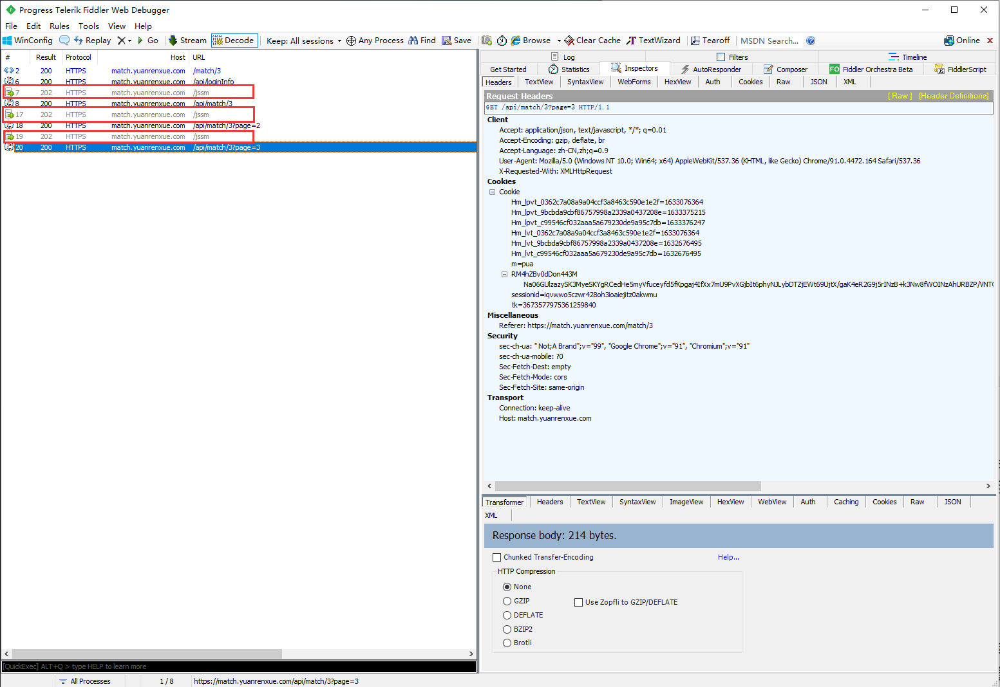

# 简单访问逻辑

## 简介

猿人学是一个专注做爬虫和数据结构的卖课平台。猿人学第一届Web端爬虫攻防赛于2020年10月16日开始，总奖金3万，共设10题，主要涉及JS反混淆，CSS反加密，图文验证码对抗等技术。 参加该比赛，你能获得物质奖励，能结识一批志同道合的人，可能拿到更好的offer，欢迎你的参加。比赛已于2020年10月20日结束。

第一届Web端猿人学攻防大赛【官方网站】：https://match.yuanrenxue.com/

网址：https://match.yuanrenxue.com/match/3

难度：非常简单

## 逆向流程

### 抓包解析

首先打开Fiddler抓包工具，开启抓包状态：


然后右键单击任务栏中的谷歌浏览器，点击“打开新的无痕窗口”，按F12打开“开发者工具”：


访问网址获取任务，在Network里面的Fetch/XHR选项中定位到了该网页数据的来源请求：


访问前面3页，分析前3页请求头参数后，结合题目的提示，得出初步接结论：**每次向数据的接口发送请求时，都会先去访问一次后缀为jssm的页面。**


### 逆向分析

回到我们的抓包工具Fiddler上面来，抓包的请求结果和Chrome开发者工具抓包的情况一模一样，结合对请求头和题目提示的分析，更加印证了我们结论的正确性。



### 扣JS代码

这道题目并不涉及JS代码方面，因此也就不涉及扣JS代码了。

## 爬虫代码

这里有一点需要注意的，本题的考察的是访问逻辑。**但题目却有一个大坑，就是会检测请求头的参数位置顺序，如果位置顺序不正确，也是请求不到参数的，而且Chrome开发者工具的请求头参数是经过调整了的，使用这个请求头是拿不到数据的，必须使用Fiddler里面的请求头参数顺序，最简单的方式就是：选中数据包——点击右侧“header”——右键“Copy All Headers”**


```python
import requests

s = requests.session()

s.headers = {
    'Host': 'match.yuanrenxue.com',
    'Connection': 'keep-alive',
    'Content-Length': '0',
    'sec-ch-ua': '" Not;A Brand";v="99", "Google Chrome";v="91", "Chromium";v="91"',
    'sec-ch-ua-mobile': '?0',
    'Accept': '*/*',
    'User-Agent': 'yuanrenxue.project',
    'Origin': 'https://match.yuanrenxue.com',
    'Sec-Fetch-Site': 'same-origin',
    'Sec-Fetch-Mode': 'cors',
    'Sec-Fetch-Dest': 'empty',
    'Referer': 'https://match.yuanrenxue.com/match/3',
    'Accept-Encoding': 'gzip, deflate, br',
    'Accept-Language': 'zh-CN,zh;q=0.9',
    'Cookie': 'sessionid=iqvwwo5czwr428oh3ioaiejitz0akwmu',
}

all_data = []

# 共5页数据
for page in range(1, 6):
    # 忽略警告
    requests.packages.urllib3.disable_warnings()
    # 接口地址
    jssm_url = 'https://match.yuanrenxue.com/jssm'
    # 输出响应
    jssm_response = s.post(url=jssm_url, verify=False)
    # 接口地址
    url = f'https://match.yuanrenxue.com/api/match/3?page={page}'
    # 输出响应
    response = s.get(url=url, verify=False).json()
    print(f'第{page}页:{response}')
    all_data += response.get("data")

# 出现频率最高的值（众值）
print(max(all_data, key=all_data.count))
```

