# 逆向基础

这节我们先不进行实战，而是先回顾一下基础，以及学习一些JS调试、抠代码、补环境技巧。

## 语言基础

### 位运算符

位运算符有 7 个，分为两类：

逻辑位运算符：**位与（&）、位或（|）、位异或（^）、非位（~）**

移位运算符：**左移（<<）、右移（>>）、无符号右移（>>>）**

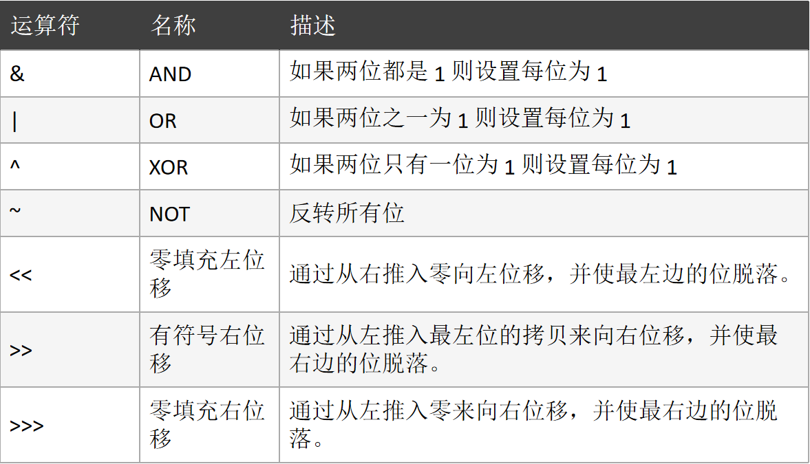


逻辑运算符（没有“位”）：**与（&&）、或（||）、非（!）**

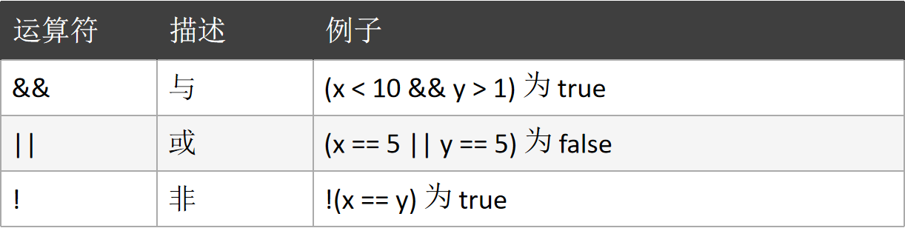

若不是比较判断数值，则记住公式约定：真与真，出右真；真或真，出左真；真与假，则出假；真或假，则出真。

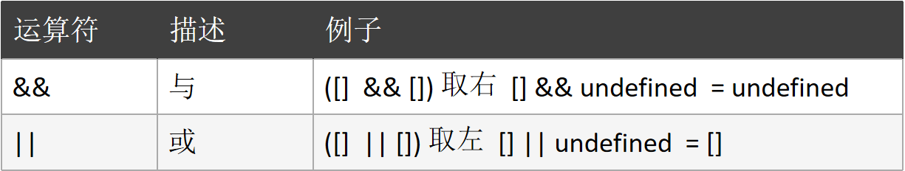

### 三元表达式

三元表达式格式：`boolean_expression ? true_value : false_value;`

`boolean_expression`: 布尔表达式，表达式在参与三元运算中必须求得一个布尔类型的值，要么是 true，要么是 false，结果作为判断依据，判断到底去：前面的值还是后面的值。

`true_value`：布尔表达式的值为真时，三元表达式的结果。

`false_value`：布尔表达式的值为假时，三元表达式的结果

作用：根据布尔表达式的结果，如果为真，三元表达式结果就是真值，如果为假，三元表达式结果就是假值。

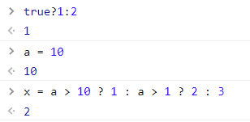

```
解释第二个例子：
1.定义a等于10
2.判断a是否大于10，不大于，则执行a > 1 ? 2 : 3
3.判断a是否大于1，大于，则执行2
4.输出2
```

?> 提示：若遇到特别长的三元表达式且在没有括号的情况下，就从左至右一个 `?` 一个 `:` 的看。

### 常用函数

一些常见非指纹built-in函数（必须记住）：

`unescape` 解码函数：返回解码后的字符。

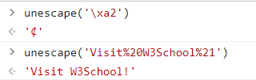

`Function` 构造：构造返回一个函数。

```javascript
var fun = new Function("a", "return a")
// 等价于
function fun(a){
    return a
}
```

`eval` 函数：将字符串当作js代码执行。

```javascript
eval('alert(111);')
```

`Array` 函数：构造一个新的数组。

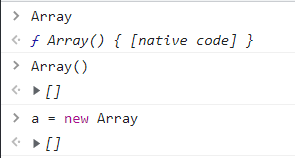

`Object` 函数：底层原型对象，返回一个空对象。

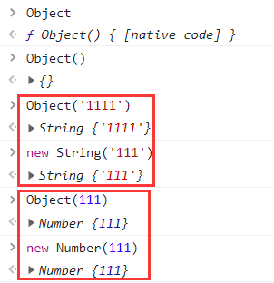

`Date` 函数：返回本地时间，而非服务器的时间。

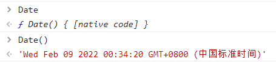

`RegExp` 函数：正则相关的函数。

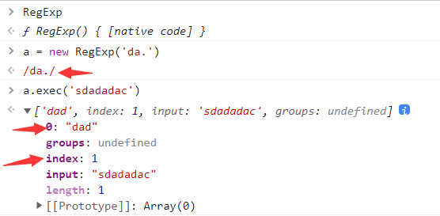

`indexOf` 函数：返回查找结果的索引值。

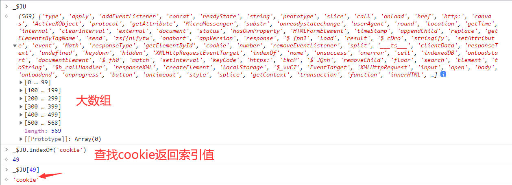

`hasOwnProperty` 函数：检测属性是否是自由属性。

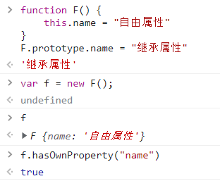

`encodeURI` 函数：编码函数。

`encodeURIComponent` 函数：解码函数。

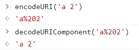

`Math.random()` 函数：返回0到1的随机小数。

`Math.round(小数)` 函数：四舍五入将数取整。

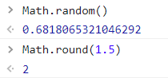

`parseInt()` 函数：将一个数字字符串强行转为一个整数。

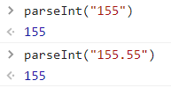

`数组.push(元素)` 函数：将元素从数组的末尾推入。

`数组.unshift(元素)` 函数：将元素从数组的头部推入。

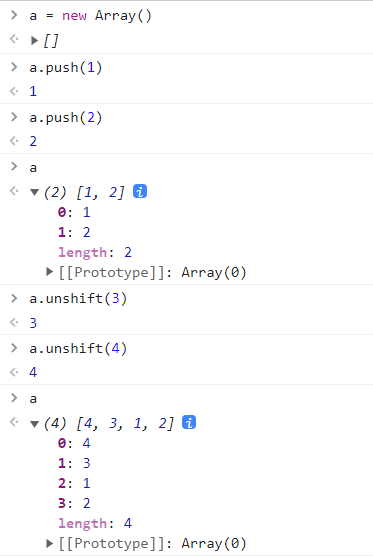

`数组.pop()` 函数：将数组末尾的元素移除。

`数组.shift()` 函数：将数组头部的元素移除，可删除指定值，若有多个相同的值默认删除第一个。

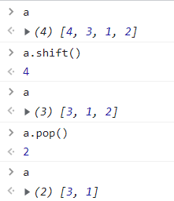

`数组.slice(起始下标, 结束下标)` 函数：按下标范围在数组中选取一段，原数组不发生改变，注意下标范围是前闭后开。

`数组.splice(起始下标, 删除个数)` 函数：在数组中从起始下标起删除指定个数的元素，原数组变为删除后的数组。

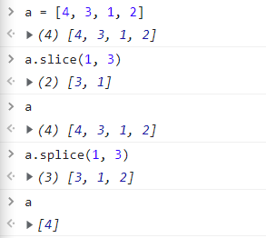

`数组.concat(数组1, 数组2...)` 函数：将多个数组拼接在一起。

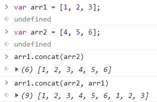

`字符串.concat(字符串1, 字符串2...)` 函数：将多个字符串拼接在一起。

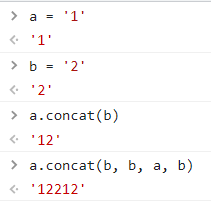

`字符串.split(切割字符)` 函数：通过切割字符将字符串切割成多个元素数组。

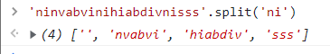

`字符串.substr(起始下标, 数目)` 函数：在字符串中从起始下标抽取指定数目的字符。

`字符串.substring(起始下标, 结束下标)` 函数：在字符串中从起始下标抽到结束下标的字符，如果没有结束下标，则一直取到末尾。

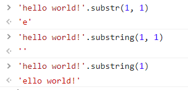

`String.fromCharCode(ASCII码值)` 函数：返回ASCII码值对应的字符。

`字符.charCodeAt()` 函数：返回字符的ASCII码值。

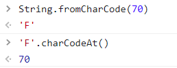

`atob` 函数：将base64码解码成字符串格式。

`btoa` 函数：将字符串编码成base64码格式。

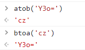

`setTimeout` 函数：延迟多少秒后执行的定时器函数。

`setInterval(函数名称, 秒数)` 函数：间隔多少秒一直循环执行的定时器函数。

`clearTimeout` 函数：清除定时器函数。

### 查询机制

查询机制分为：LHS查询、RHS查询

LHS查询：赋值操作左侧的查询，LHS查询试图找到变量的容器本身，，从而对其赋值。

RHS查询：赋值操作右侧的查询，可以理解为“取到某某的值”。所以说，当 `console.log(a)` 时候，就进行的是RHS查询

## Chrome环境

在认识的环境的过程当中，会有许多代码案例，**可能会存在变量重名冲突的情况，因此我们就要需要清理一下缓存，方法也很简单，点击刷新按钮即可。**

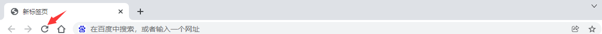

### 临时文件

**JavaScript 是一种解释型语言，在执行 JavaScript 代码过程中会生成字节码。字节码不能直接被运行，而是运行在 JavaScript 引擎之上，一般也称为虚拟机（Virtual Machine，简称VM），它负责从头到尾整个JavaScript程序的编译及执行过程。**

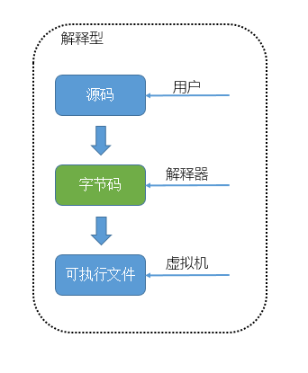

**虚拟机可以理解成软件、代码的运行环境模拟器，其中又分为“系统虚拟机”和“进程虚拟机”。“系统虚拟机”提供了一个可以运行操作系统的真完整仿平台。**Mac 用户很熟悉的 Parallels 就是一个允许你在 Mac 上运行 Windows系统虚拟机。**“进程虚拟机”不具备全部的功能，(只)能运行一个程序或者进程。**Wine 是一个允许你在 Linux 机器上运行 Windows 应用的进程虚拟机，但是并不在 Linux 中提供完整的 Windows 操作系统。**JavaScript 虚拟机是一种进程虚拟机，专门设计来解释和执行的 JavaScript 代码**。下面是目前现代浏览器采用的常见JavaScript虚拟机：

- Chakra(Microsoft Internet Explorer)
- Nitro/JavaScript Core (Safari)
- Carakan (Opera)
- SpiderMonkey (Firefox)
- V8 (Chrome, Chromium)  

理解了虚拟机，接下来讲解“临时js文件”。**临时js文件名称通常以 `VM` 开头后面跟数字**，在Chrome调试中经常可以看到VM+数字的JS文件：

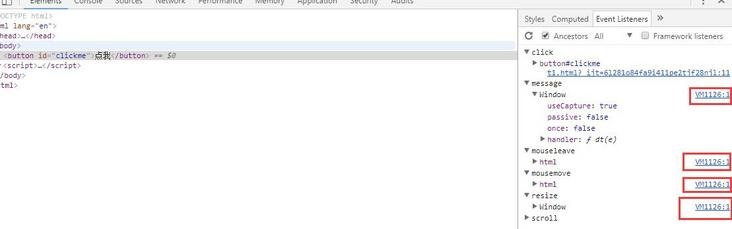

临时的js文件生成方式有两种：在**控制台里执行代码**生成临时文件、在**代码中执行了eval方法**生成临时文件。

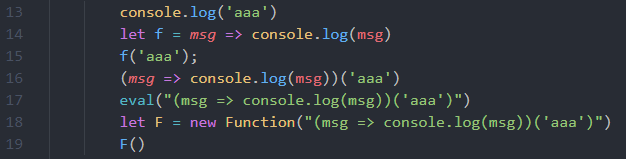

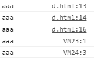

除此之外，**使用Chrome产生的临时js文件其背景为黄色**：

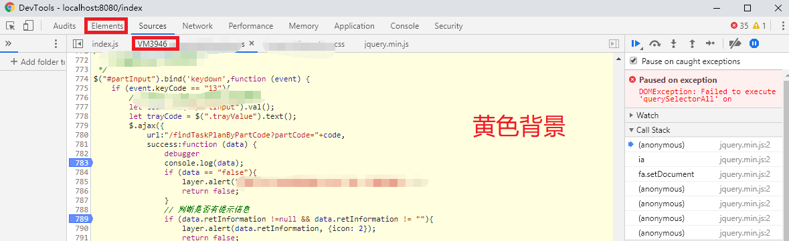

?> 提示：虚拟机产生的这种临时文件是抓包工具抓不到的。

### window对象

以下操作全部在Chrome（谷歌浏览器）中的Console执行。打开方式如下：按F12键，选择Console即可。

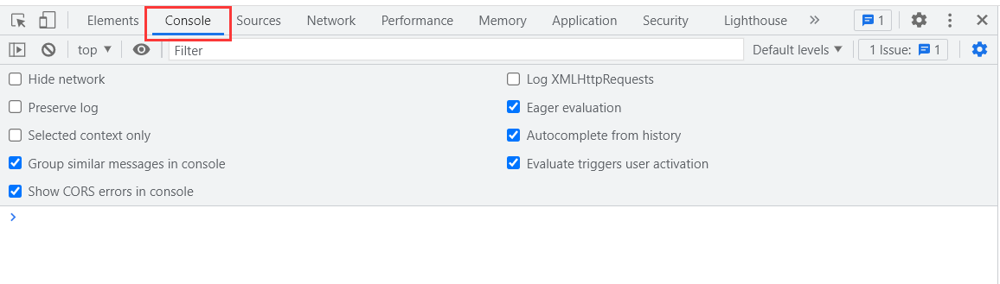

**首先JS代码还没运行的时候，JS环境里已经有一个 `window` 对象了。可以说，`window` 是整个浏览器中最底层的对象。很多时候我们都会把 `window` 对象省略，因为它是源头，例如 `eval等价于window.eval` 等：**

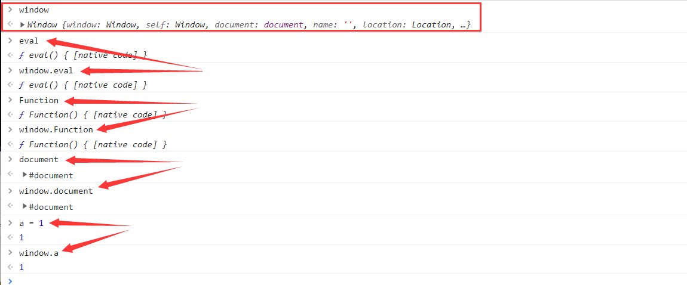

?> 提示：在node.js当中没有 `window` 对象，它的全局对象是 `global`。

**`window` 对象有一个 `Object` 属性是一个函数对象，也是原生底层对象，在里面有一个重要属性是 `prototype` ，在里面又有许多属性：**

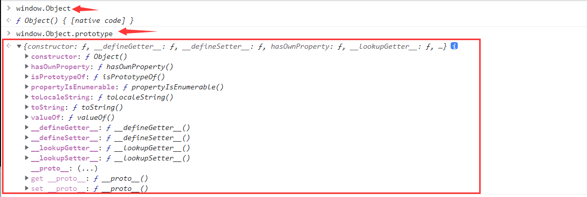

**`constructor` 是反向的 `prototype` 作用：**

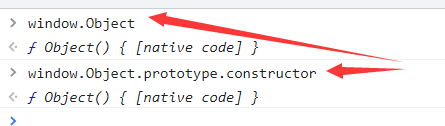

### 原型链

理解原型链首先我们先记住下面这四个前提：

1. **JS中所有事物都是对象，对象是拥有属性和方法的数据；**
2. **每一个对象都有 `__proto__` 属性；**
3. **每个函数不仅有 `__proto__` 属性还有 `prototype` 属性；**
4. **`__proto__` 是浏览器厂商实现的，W3C规范中并没有这个东西。**

**实例对象的 `__proto__` 实质是指向构造函数的 `prototype`。**如下：

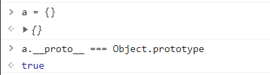

**当实例对象调用方法的时候，js引擎会沿着 `__proto__` -> `ptototype` 的顺序一直往上方查找，找到 `window.Object.prototype` 为止，如果没有找到，就会报错或者返回 `undefined` 。**如下：

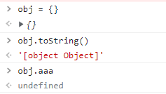


如果用相同的名称重写图中的 `toString()` 方法，当js引擎向上查找的时候，就使用的重写方法，而不是使用的 `Object.toString()` 方法，以此来达到以假乱真的目的。

**同样的，定义一个数组就会产生一个更长的原型链。arr没有 `valueOf`，就去 `arr.__proto__` 上找，发现也没有 `valueOf`，就去 `arr.__proto__.__proto__` 就是 `window.Object.prototype` 上找，所以 `arr.valueOf` 其实就是 `window.Object.prototype.valueOf`。**原型链如下：

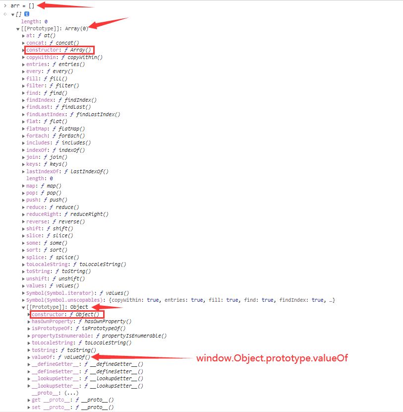

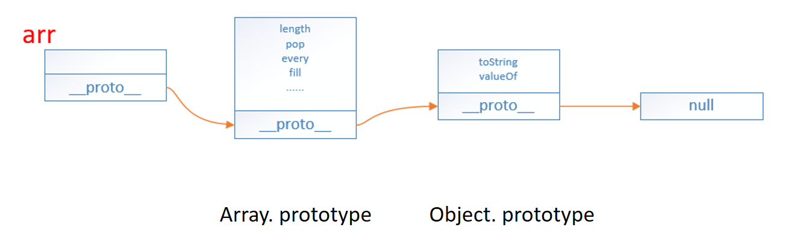

### 函数对象

**函数是Function类型的实例对象，所以函数本身拥有的对象属性，可以简单的理解：函数即对象。**因此，函数的 `__proto__` 是指向 `Function.prototype` 的：

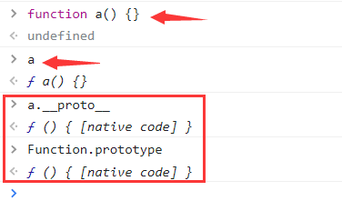

用 new 关键字来调用的函数时，过程如下：

1. 产生一个新对象，使用new关键字调用函数时，就会开辟一个新的内存空间，用来存储该函数实例化的对象；
2. 链接到原型；
3. 绑定 this，函数体内部的 this 指向该内存空间，给 this 添加属性，就相当于给实例添加属性；
4. 返回新对象。

```javascript
function create(...rest) {
    // 创建一个空的对象
    let obj = new Object()
    // 获得构造函数
    let Con = rest.shift()
    // 链接到原型
    obj.__proto__ = Con.prototype
    // 确定this执行构造函数
    let result = Con.apply(obj, arguments)
    // 确定new出来的是个对象
    return typeof result === 'object' ? result : obj
}
```

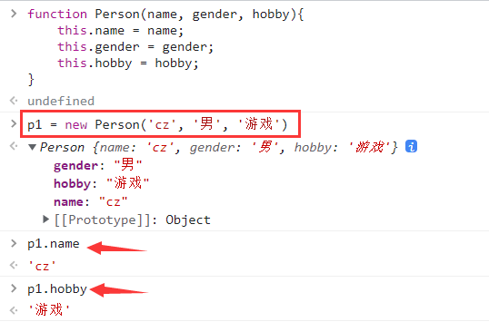

**函数内部的属性通过实例化的对象可以在外部调用，但函数内部的变量和方法只能在函数内部调用。**如下：

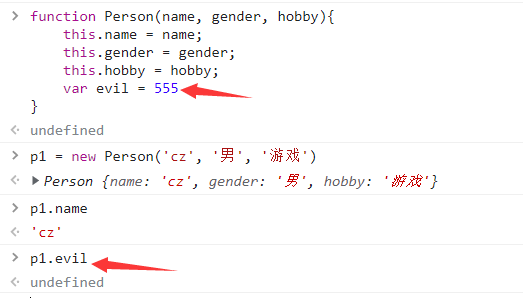

**p1是Person函数的实例对象，也就是说Person是p1的构造函数。**按照上面原型链的解释，就会有如同上面的函数的等价关系：

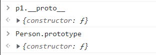

?> 提示：如果不写new，那么p1就等于Person的返回值，即 `undefined` 。

### 深入构造器


### 自执行匿名函数

**在js中使用声明式 `function XXX() {}` 会导致函数提升，因为解释器会优先编译函数。**例如：

```javascript
fn1();  //可以正常调用
function fn1() {}  //优先编译
```

**表达式中的函数则不会出现函数提升，而是解释器逐行解释，因此如果调用在函数表达式之前，则会调用失败。**如下

```javascript
fn2();  //未定义
fn2 = function fn1() {}  //开始解释
fn2();  //可以正常调用
```

**编译过程当中，同名函数的的返回值会相互覆盖。**如下：

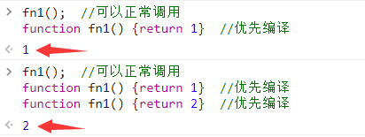

自执行匿名函数有如下5种表达方式：

```javascript
(function(){})()  //返回undefined
!function(){}()  //返回true
~function(){}()  //返回返回返回-1
-function(){}()  //返回返回NaN
+function(){}()  //返回NaN
```

### 继承

**继承：继承就是子类可以使用父类的所有功能，并且对这些功能进行扩展。**

比如，有两个构造函数A、B，但是B想要使用A里的一些属性和方法，一种办法就是复制粘贴一波，还有一种就是利用继承，我让B直接继承了A里的功能，这样我就能用它了。这里我们讲解原型链继承：

**原型链继承：将要继承构造函数的实例化对象赋值给被继承函数的 `prototype` 属性。**

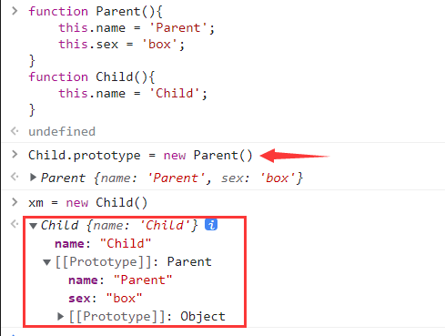

**当我们输出xm对象的sex属性时，就会去Child里面找，找不到，就去Parent里面找，而name属性在Child里面有，就直接输出了。**如下：

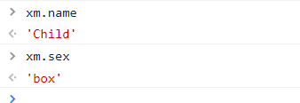

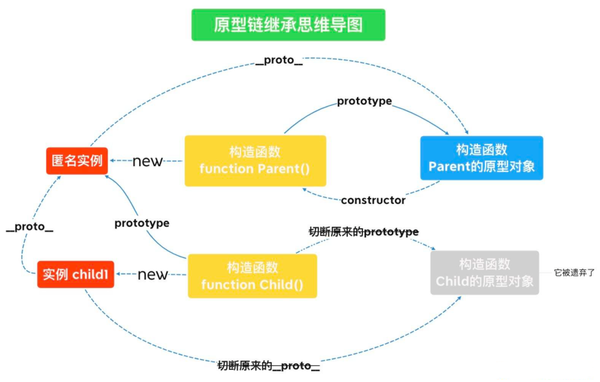

**`instanceof` 可以检测构造函数的prototype属性是否出现在某个实例对象的原型链上。**例如 `A instanceof B` ，即实例对象A的原型链（`__proto__`）是否有构造函数B.prototype，有则返回 `true`，否则返回`false`。如下：

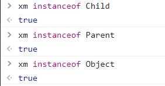

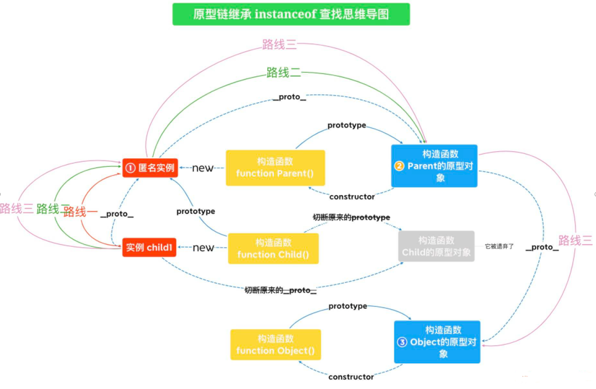

**Class继承**，我们还可通过 `class` 的方式来继承：

 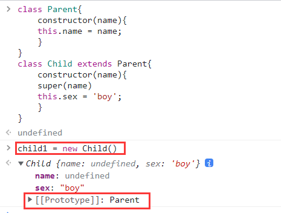

### 多态

**多态：指同一操作作用于不同的对象上，可以产生不同的解释和不同的执行结果。**

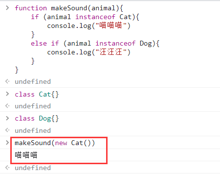

### this绑定

this是指当前的内存空间下，学习this绑定最重要的一点就是，**this永远指向最后调用它的对象。**

**默认绑定：在函数当中，非严格模式下this指向全局对象window，严格模式下this会绑定到undefined；**

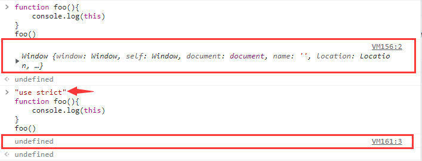

这里解释一下图中，在非严格模式下 `this` 是指向全局对象window，所以 `foo` 函数中 `this.a` 输出了最上面定义的 `var a = 10` 的值，在严格模式下 `this` 是指向undefined，所以 `foo` 函数中 `this.a` 输出了undefined；


函数当中里面定义的变量，由于作用域的影响是不会绑定到window，即使在闭包函数中也是同样的效果中；


使用 `let`、`const` 等关键字是不会与this绑定的；


**隐式绑定：当函数引用有上下文对象时，如 `obj.foo()` 的调用方式，foo内的this指向obj。**


**被隐式绑定的函数在特定的情况下会丢失绑定对象，即隐式丢失。同样丢失后的this，非严格模式下指向全局对象window，严格模式下会绑定到undefined；**

**一种是使用另一个变量来给函数取别名**：下图中 `obj.foo()` 中的this指向调用者 `obj`；`foo2()` 发生了隐式丢失，调用者是window，使得 `foo()` 中的 `this` 指向window；`foo3()` 发生了隐式丢失，调用者是 `obj2`，使用 `foo()` 中的 `this` 指向 `obj2`；


**另一种是将函数作为参数传递时会被隐式赋值，回调函数丢失this绑定**：把一个函数当成参数传递到另一个函数的时候，也会发生隐式丢失的问题，且与包裹着它的函数的this指向无关。


**显示绑定(通过 `call()` 或者 `apply()` 方法直接指定this的绑定对象)，需要注意的是使用 `call()` 或者 `apply()` 的函数是会直接执行的，`call()` 接收若干参数，例 `fn.call(this, 1, 2, 3)`， `apply()` 接收的是一个数组，例 `fn.apply(this,[1, 2, 3])`，`bind()` 是返回值为一个新的函数，需要再次调用 `fn.bind(this)(1, 2, 3)` 才会执行。**如果call、apply、bind接受到的第一个参数是空或者null、undefined的话，则会忽略这个参数。另外，forEach、map、filter函数的第二个参数也是能显式绑定this的。


**this永远指向最后调用它的对象。**下图中，有一个setTimeout定时器实质就是 `window.setTimeot` 当中的方法，因此this也就指向了window。


下图就通过 `call()` 绑定了obj1：


下图中第一个数字2是 `foo()` 输出的，**虽然 `foo()` 函数也返回了一个函数，但是并没有调用它，只有写成 `foo()()` 才算是调用匿名函数；**第二个数字1是 `foo.call(obj)` 输出的，由于 `.call()` 是紧跟 `foo` 的，所以改变的是 `foo()` 内this的指向，并且 `.call()` 是会使函数立即执行，因此打印出1，同样他也没有调用返回函数；第三个数字2是 `foo().call(obj)` 先执行 `foo()` 时打印出来的，此时 `foo()` 内的this还是指向window，在执行完 `foo()` 之后，返回一个匿名函数，并且后面使用了 `.call(obj)` 来改变这个匿名函数的this指向并调用了它，所以输出了1。


**new绑定：下图中重新定义了name，因此后面 `this.name` 输出了123456，但即使刷新清理缓存后也还是会输出123456，除非重新打开一个新的选项卡，输出才会为空，这是由于浏览器的特性，不清理window的name属性。**


深入理解再看下面一个例子：


new和call绑定可以看下面的例子： `Person1.foo.call(person2)()` 这种写法改变的是foo函数内的this指向。


**箭头函数绑定：this的指向由外层作用域决定的。**

```
Arrow Function（箭头函数）是ES6标准新增了一种新的函数，因为它的定义用的就是一个箭头：
x => x * x
相当于：
function (x) {
    return x * x;
}
```


箭头函数的this无法通过bind、call、apply来直接修改，但是可以通过改变作用域中的this的指向来间接修改。


### arguments对象

简单来说：**arguments是一个对应于传递给函数的参数的类数组对象，但并不是一个数组，并没有数组的一些 `__proto__` 里面的方法如push等。**

**arguments对象是所有（非箭头）函数中都可用的局部变量。**你可以使用arguments对象在函数中引用函数的参数。此对象包含传递给函数的每个参数，第一个参数在索引0处。例如，如果一个函数传递了三个参数，你可以以如下方式引用他们：

- `arguments.callee`：**指向当前执行的函数（在严格模式下，第5版ECMAScript (ES5) 禁止使用）。**
- `argunments.length`：**指向传递给当前函数的参数数量。**

**在严格模式下，剩余参数、默认参数和解构赋值参数的存在不会改变 arguments对象的行为，但是在非严格模式下就有所不同了。**


### 伪代码

1. 自执行函数嵌套执行 `function(a, b){}(fn1,fn2)`，这里a,b是形参，fn1,fn2为实参来执行该函数。
2. 混淆的变量名（不可逆）：_0x319289  _$SW  Oo0o00o0 a b c；
3. 函数名与不一致原因（1.构造函数、2. 重新赋值）；
4. 三元表达式嵌套；
5. 控制流平坦化，例如能一行代码解决，写成多行代码让爬虫工程师来跟踪调试；
6. 打包；
7. 魔改加密包，比方魔改 `btoa` 函数；
8. 重构解释器（很少），对js内置的方法进行了一些重构；

剩下的想到了再说 =.=。肯定还有很多，只能以后再总结进去了。

## 编码与混淆

在后面的实战过程中，我们会遇到很多JS编码和JS混淆后的代码，但要注意JS编码和JS混淆是两个概念：

- **JS混淆就是在不改变JS代码逻辑的情况下，对变量名称、函数名称等进行改变来提高代码阅读门槛，JS代码混淆越厉害则阅读门槛就越高，且还原JS代码就越困难；**
- **JS编码就是将JS代码按照某种规律进行编码，编码后的JS完全不具备可读性，但是我们可以通过浏览器中的 `Console` 很简单的进行还原，也可以通过专门的网站进行还原。**

### 简单编码

可以看到文件的内容不那么直观了，代码进行了一定的编码，熟悉字符编码格式的人就能看出来，这其实就是将一部分字符进行了utf-8编码，另一部分字符进行了unicode编码：


好在猿人学对这类简单的编码提供了还原工具（地址：http://tool.yuanrenxue.com/deobfuscator），我们可以将编码内容直接粘贴过去进行还原，得到更加容易阅读的代码：


### aaencode代码

aaencode代码，则是将正常的js代码转码好玩的特殊网络表情符号。如：` ﾟωﾟﾉ= /｀ｍ´）ﾉ ~┻━┻ //*´∇｀*/ ['_']; o=(ﾟｰﾟ)` 这样的表情文字

解码网站：https://www.qtool.net/decode

例如，下图中的代码就是aaencode代码：


我们打开解码网站，将aaencode代码代码粘贴进去，解码后的结果为：`window.o = 1;`


### jjencode代码

jjencode代码，就是将正常的js代码转换成的只有如下符号的字符串编码进行加密。如：`[$._$_]+$._$+",\\"+$.$__+$.___+"\\"+$.__$+$.__$+$` 这样的组合

解码网站：https://www.qtool.net/decode

jjencode代码解码流程和aaencode代码解码流程没有什么差别，这里就不详细介绍了。

### JSFuck代码

JSFuck代码：**就是将正常的js代码编码成的只有 `!、[]、+` 的字符串编码进行加密。**

解码网站：http://codertab.com/JsUnFuck

```
![] = false（布尔false）
!+[] = true（布尔true）
!+[]+[] = 'true'（布尔true变为字符串'true'）
!+[]+!+[] = 2（true用作运算时等于1）
[!+[]+!+[]] = [2]（变成一个数组里只有2）
[!+[]+!+[]]+[!+[]+!+[]] = '22'（两个数组[2]相加等于字符串22）
!+[]+[][!+[]+!+[]] = 'u'（取字符串'true'下标为2的字符）
(![]+[])[+!+[]]+(![]+[])[!+[]+!+[]]+(!![]+[])[!+[]+!+[]+!+[]]+(!![]+[])[+!+[]]+(!![]+[])[+[]]+([][(![]+[])[+[]]+(![]+[])[!+[]+!+[]]+(![]+[])[+!+[]]+(!![]+[])[+[]]]+[])[+!+[]+[!+[]+!+[]+!+[]]]+[+!+[]]+([+[]]+![]+[][(![]+[])[+[]]+(![]+[])[!+[]+!+[]]+(![]+[])[+!+[]]+(!![]+[])[+[]]])[!+[]+!+[]+[+[]]] = 'alert(1)'
```

例如，下图中的代码就是JSFuck代码：


我们打开解码网站，将代码粘贴进去，解码后的结果为：`false`


编码后的代码放在控制台中执行，可能有如下四种情况：

1. 控制台执行报错，且非 unsafe错误：点击报错信息即可还原代码
2. 控制台执行不报错，删除一些语法（以括号为主），强制令其报错
3. 控制台报unsafe错误：自写个html运行，然后删除语法令其报错即可还原
4. 仅仅混淆部分数字的情况，一般情况下，上面的说法就失效了，只能一段一段的敲入console中或者采取网上一键解混淆。

### ob混淆

ob混淆全称是 obfuscator，其官网 https://obfuscator.io/ 它是**一款免费、开源的 JavaScript 混淆工具，用以保护你的核心 JavaScript 代码不轻易被破解。ob混淆的常见特性：两大段。**

**第一段：第一行可以看到明显的一个数组。**


**第二段：通常会有一个数组移位方法（有内存泄露风险、建议不格式化）。**


**第三段：解密函数（有内存泄露风险、建议不格式化）**

**------ 可能有定时器 --------（看加密的开关开启数量）**

**第四段：实际代码+控制流平坦化（整体ob的强度几乎完全取决于这段的代码强度，这里面是加密前的逻辑）**

**第五段：控制流平坦化+无限debugger自执行函数+死代码注入。一般情况下不会有业务逻辑**

爬虫工程师，面对这样的代码，就算经验丰富，硬刚的话，掉头发是少不了的事情，所以不要问，ob、sojson如何破解。这些东西只是一层壳，破解强度完全取决于第四段代码，也就是其他网站作者写的代码强度，但如果你掌握了AST，将这些代码进行还原，则可以大大的降低硬钢的难度，非常的nice！这里顺便也提供一个可以简单反混淆的工具：http://tool.yuanrenxue.com/decode_obfuscator

## Hook技术

**Hook技术，当中的hook是”钩、钩子“的意思，又叫做Hook钩子函数，其实就是一小段代码。**在系统没有调用该函数之前，钩子函数就先捕获该消息得到控制权，这时钩子函数既可以加工处理（改变）该函数的执行行为，还可以强制结束消息的传递。**简单来说，就是把系统的程序拉出来变成我们自己执行代码片段。**在js中，系统程序可以指浏览器API，也可以指代码中实现的一些方法等。

1. **Hook钩子函数本质就是代码注入，在文件代码开始运行时（可以在第一行代码打上断点）将其断住，就将Hook代码注入进去，继续运行代码等待Hook被触发。**
2. 当钩子函数被触发时，就执行我们定义的钩子函数的逻辑。
3. **注入的Hook代码仅当前页面有效使用，如果刷新页面或者打开的新的标签页，需要重新注入Hook代码。**
4. **客户端拥有js的最高解释权，可以决定在任何时候注入js，而服务器只能通过检测和混淆手段令Hook难度加大，但无法阻止。**

Hook分类：**手动Hook，自动Hook。**

Hook步骤：**1、寻找hook点；2、编写hook逻辑；3、调试。**

Hook目的：**找到函数入口以及一些参数变化，便于分析js逻辑，但是 hook的能力远不及此，我们只借助其寻找函数入口。**

### 通用公式

通用公式总共两个：**Hook函数公式、Hook对象中属性公式。**

**Hook函数公式**：

```javascript
// 第一步：赋值（func:要hook的函数）
old_func = func
// 第二步：重写（重写func方法）
func = function(argument){
	my task;
	return old_func.apply(argument)
}
// 第三步：原型链（修改一些原生的方法伪装它没有被Hook）
func.prototype..... = .......
```

上面还可以改为局部Hook：

```javascript
// 针对b的值等于5的时候进行Hook
old_b = b;
b = function(val){
    if(val === 5){
        debugger;
    }
    return old_b(val)
}
```

接下来讲Hook对象中属性公式前，我们首先要讲解 `Object.defineProperty()` 函数，**作用就是直接在一个对象上定义一个新属性，或者修改一个已经存在的属性。**

```javascript
Object.defineProperty(obj, prop, desc)
// obj 需要定义属性的当前对象
// prop 当前需要定义的属性名
// desc 属性描述符
```

**数据描述符 --特有的两个属性（value,writable）**是针对数据描述的属性定义，其中value代表值，writable代表值是否可以被赋值改变。


**存取描述符 --是由一对 getter、setter 函数功能来描述的属性。**

`get`：一个给属性提供`getter`的方法，如果没有 `getter` 则为 `undefined`。该方法返回值被用作属性值。默认为 `undefined`。
`set`：一个给属性提供`setter`的方法，如果没有 `setter` 则为 `undefined`。该方法将接受唯一参数，并将该参数的新值分配给该属性。默认值为 `undefined`。


**数据描述符和存取描述均具有**以下描述符：

1. `configrable` 描述属性是否配置，以及可否删除。
2. `enumerable` 描述属性是否会出现在 `for in` 或者 `Object.keys()` 的遍历中。

最后，如果描述符中的某些属性被省略，会使用以下默认规则：


**Hook对象中属性公式**：

```javascript
// 把对象属性赋值给一个变量
old_attr = obj.attr
Object.defineProperty(obj, 'attr', {
    // 获取obj.attr属性时就会执行get里面的函数内容
    get: function() {
        console.log(cookie_cache);
        return old_attr 
	},
    // 设置obj.attr属性时就会执行set里面的函数内容
    set: function(val) {
		return  ......
    }
})
```

同样的，上面的可以改为全局Hook：

```javascript
// 针对全局变量a（相当于window.a）进行Hook
Object.defineProperty(window, 'a', {
    set: function(val) {
		debugger;
    }
})
```

### 简单使用

**在JS调试过程中，我们常用Hook来监控一些调试信息或者进行debugger。**

```javascript
// hook钩子document.cookie属性
document.old_cookie = document.cookie
Object.defineProperty(document, 'cookie', {
    // 获取document.cookie属性时就会执行get里面的函数内容
    get: function() {
        debugger;
        return document.old_cookie
	}
})
```


回车后就直接进入了 `get` 函数里面的debugger了，这样就实现了对 `document.cookie` 的监控：


```javascript
//常用JS的HOOK代码

// hook原型链中的方法（以字符串的split方法为例）
String.prototype.split_bk = String.prototype.split;  // 保存原始方法
String.prototype.split = function(val){  // 重写eval方法
    str = this.toString()
    debugger;
    return str.split_bk(val)
}

// hook eval方法
window.__cr_eval = window.eval;  // 保存原始方法
var myeval = function(src){  // 重写eval方法
    console.log(src);
    debugger;
    return window.__cr_eval(src);
}
var _myeval = myeval.bind(null);
_myeval.toString = window.__cr_eval.toString;
Object.defineProperty(window, 'eval', {value: _myeval});

// hook Function函数
window.__cr_fun = window.Function;
var myfun = function(){
    var args = Array.prototype.slice.call(arguments, 0, -1).join(","), src = arguments[arguments.length - 1]
    console.log(src);
    console.log("=============== Function end ===============");
    debugger;
    return window.__cr_fun.apply(this, arguments);
}
myfun.toString = function(){return window.__cr_fun + ""} 
Object.defineProperty(window, 'Function', {value: myfun});

// hook JSON.stringify
var my_stringify = JSON.stringify;
JSON.stringify = function(params){
    console.log("hook", params);
    debugger;
    return my_stringify(params);
};

// hook JSON.parse
var my_parse = JSON.parse;
JSON.parse = function(params){
    console.log("hook", params);
    debugger;
    return my_parse(params);
};

// hook cookie字段RM4hZBv0dDon443M
(function () {
   Object.defineProperty(document, 'cookie', {
       set: function (cookie) {
           // 方法indexOf检索字符串的值若没有出现，则该方法返回-1。
           if(cookie.indexOf('RM4hZBv0dDon443M') != -1){
                debugger;
           }
           return cookie;
       }
   })
})();

// hook window对象
var window_flag_1 = 'object1'; // 修改为需要hook的对象
var window_flag_2 = 'object2'; // hook对象的对象

var key_value_map = {};
var window_value = window[window_flag_1];

Object.defineProperty(window, window_flag_1, {
    get: function(){
        console.log('Getting', window, window_flag_1, '=', window_value);
        debugger;
        return window_value;
    },
    set: function(val){
        console.log('Setting', window, window_flag_1, '=', val);
        debugger;
        window_value = val;
        key_value_map[window[window_flag_1]] = window_flag_1;
        set_obj_attr(window[window_flag_1], window_flag_2);
    },
});

function set_obj_attr(obj, attr){
    var obj_arrt_value = obj[attr];
    Object.defineProperty(obj, attr, {
        get:function(){
            console.log('Getting', key_value_map[obj], attr, '=', obj_arrt_value);
            debugger;
            return obj_arrt_value
        },
        set: function(val){
            console.log('Setting', key_value_map[obj], attr, '=', val);
            debugger;
            obj_arrt_value = val;
        },
    });
};
```

### 缺陷弊端

1. 函数hook一般情况下不会出现hook失败的情况，只有可能是 `__proto__` 模拟的不好导致被检测到了。
2. **属性hook一般只绑定一次，所以当网站的逻辑都采用 `Object.defineProperty` 绑定后，属性hook就会失效，暂时没有发现好的解决方案。**


```javascript
// 因此我们需要注意下面逻辑
try:
    hook
catch:
    另外的逻辑
```

3. 这里还有一种我没讲的hook，叫局部hook，原理是一样的，只不过需要在进入作用域的那一刻进行hook。

### 油猴脚本

前面我们提过Hook分为**手动Hook，自动Hook。**上面的所举的例子都是手动Hook，如果不想手动Hook，可以试试 Tampermonkey 油猴脚本，简单讲就是一个给浏览器注入js代码的脚本，支持Chrome（谷歌）、Firefox（火狐）等浏览器。

安装油猴脚本，首先需要**科学上网**，进入Google搜索，搜索“Chrome应用商店”关键词：


进入商店后，输入 Tampermonkey 进行查找，点击第一个进行安装：


如果安装不成功，本地会有一个油猴脚本的 `crx` 文件：


我们打开chrome浏览器的“更多工具”中的“扩展程序”选项：


打开开发者模式，将 `crx` 文件拖入其中，油猴脚本就自动安装成功了：


接下来，我们点击扩展程序按钮，再点击固定按钮将油猴程序固定再工具栏：


现在我们点击图标，点击“添加新脚本”：


就会出现编辑脚本的页面：


其中里面有些参数信息如下：

```
@name :脚本名，随便命名。
@namespace ：脚本的命名空间，一般就是写个url，告诉自己用在哪里。
@version：版本，随便命名。
@author：作者，随便命名。
@description：描述，随便描述。
@homepage, @homepageURL, @website and @source：从脚本名称链接到给定页面的作者主页。
@icon, @iconURL and @defaulticon：低分辨率脚本图标。
@icon64 and @icon64URL：高分辨率脚本图标。
@updateURL：更新检查的url，@version参数开启，会向url检查更新。
@downloadURL：定时监测到更新会自动下载url内容，若为 none则不检查
@include @match：匹配规则相关。支持精确匹配与正则匹配。（重要）
@exclude是排除，不写相当于脚本白写（重要）
@require @resource ：导包，支持url引入。比如，引入jquery，可以使用$
@connect：标记定义域，感觉很有用，但是我菜，所以很少用。
@grant：白名单函数：比如：@grant window.close 。很强大，如果默认不写则会对一些原生函数如：eval等进行保护，显然这不是我们所期待的，所以就直接 @grant none了
@antifeature ：官方文档的意思：开发人员是否允许别人把脚本货币化。
@noframes：在主页上运行而不在iframes上运行。
@unwrap：卵用没有，官方文档的意思：在chrome上，不需要它，自动被忽略了（淦！）
@nocompat：一般默认，官方文档写了好长，大概的意思指支持标记浏览器。如：@nocompat Chrome，这样就不能在火狐浏览器运行它了。
@run-at： 指定油猴脚本在什么时候执行，默认是在所有js加载完成后执行。（那hook脚本还有个屁用啊！重要）
参数：
@run-at document-start  ：脚本尽快注入（相当于script断点之后，进入页面一瞬间注入）
@run-at document-body ：如果页面body元素存在，则注入（所以练习平台第二题就注不进去了）
@run-at document-end ：脚本将在DOMContentLoaded事件发生注入。
**@run-at document-idle：默认值。脚本将在DOMContentLoaded事件发生之后才注入。**
@run-at context-menu：如果在浏览器上下文菜单中单击脚本（仅限于基于桌面Chrome的浏览 器），则会注入脚本。
```

脚本案例：

```javascript
// ==UserScript==
// @name         万能hook eval函数
// @namespace    http://tampermonkey.net/
// @version      0.1
// @description  eval-everything
// @author       An-lan
// @include      *
// @grant        none
// @run-at      document-start
// ==/UserScript==

alert('hook success');
var eval_bk = eval;
eval = function(val){
    console.log(val)
    return eval_bk(val);
};
eval.toString = function(){
    return "function eval() { [native code] }"
};
eval.length = 1;
```

将脚本拷贝到油猴当中，Ctrl+S进行保存，就会自动启用：


这样，油猴脚本就能自动对网站JS当中的eval进行Hook了。

## 逆向核心

JS逆向的核心分为：**抠代码、补环境。**

抠代码流程技巧以及优缺点：

```
流程：
1.缺啥补啥，深度优先
2.见文知义，化繁为简
3.了然于胸，如履平地
技巧：
1.如果Console方法在JS中被重写了，我们可以在第一行用一个变量保存Console_old=Console，在最后一行使用Console_old进行输出。这种解决方式，同样也适用其他方法。
2.当我们抠出了所有的JS代码时，最好放在一个大函数内，最后用return返回结果。
优点：
1.执行效率高
2.并发能力强
3.能感受到进度（抠出一行是一行）
4.只要有耐心，笨办法也能成大事
缺点：
1.比较吃经验，只有勤学苦练才能更快
2.若想精通则对js基础要求较高（尤其是对于浏览器API的掌握程度）
3.网站即使微调，js可能就会失效
4.做不到完全还原浏览器的某些值，对风控响应不够及时。
```

补环境优缺点：

```
优点：
1.复用性强、开发速度快
2.有现成的库可供调用（如 jsdom）
3.简单网站，相对于抠代码，对熟练度要求更低
4.仅需对服务器的混淆代码做少量处理即可。
缺点：
1. 占用资源大，计算速度可能慢
2. 若想高并发可能需要开发多种浏览器环境，增加时间成本
3. 对于极复杂的网站，可能更靠玄学。无法感受到进度的变化
4. 若想精通则对需对node指纹和浏览器API都足够精通
```

小结：

```
1.难的网站这两种方法都难。反而抠代码由于可以看到进度不容易轻易放弃。
2.简单的网站补环境更爽，可能会秒破而且耗费不了多少资源。
3.我的建议：你爱用啥用啥（狗头护体）
```
