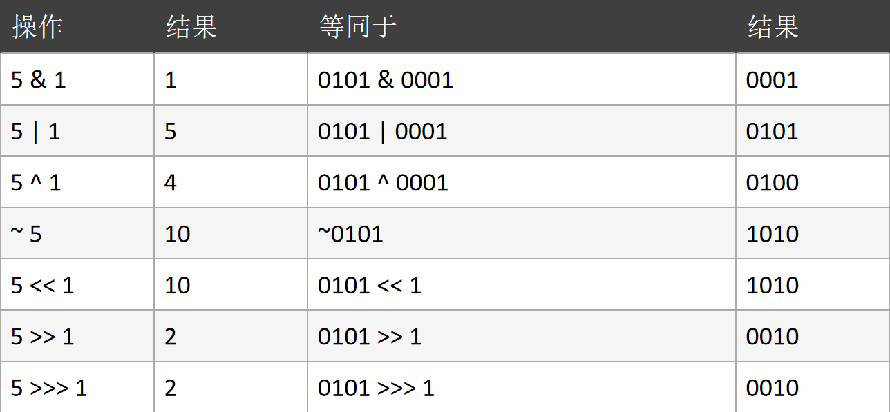
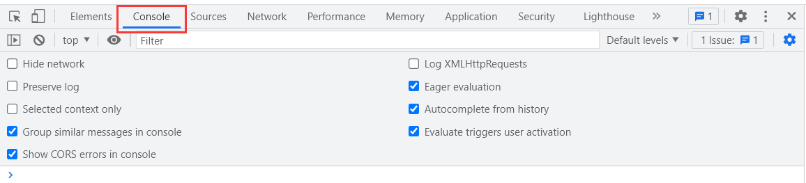
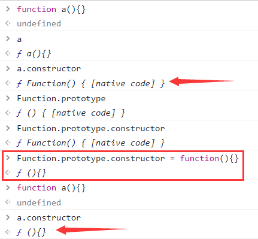
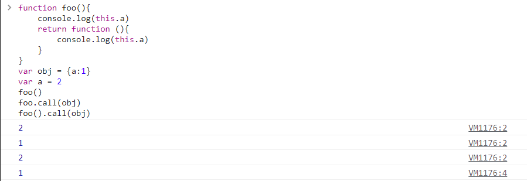
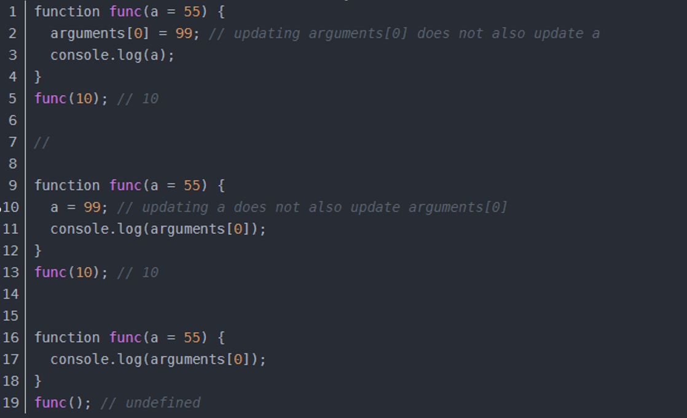
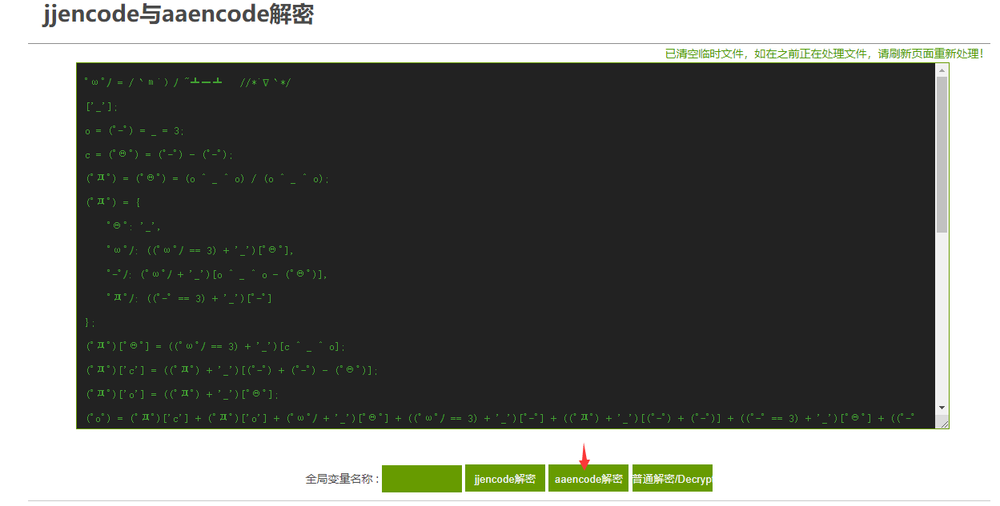

# 逆向基础

这节我们先不进行实战，而是先回顾一下基础，以及学习一些JS调试、抠代码、补环境技巧。

## 语言基础

### 位运算符

位运算符有 7 个，分为两类：

逻辑位运算符：**位与（&）、位或（|）、位异或（^）、非位（~）**

移位运算符：**左移（<<）、右移（>>）、无符号右移（>>>）**




逻辑运算符（没有“位”）：**与（&&）、或（||）、非（!）**


若不是比较判断数值，则记住公式约定：真与真，出右真；真或真，出左真；真与假，则出假；真或假，则出真。


连续执行语句：||  && 当不是逻辑判断的时候而是执行返回的时候会有些奇妙的特点（语法糖）

```javascript
function a(){console.log('a');return true}
function b(){console.log('b');return false}
function c(){console.log('c');return undefined}
function d(){console.log('d');return null}

// true&false等价于1&0
result = a() & b()                     // 0
// true&&false
result = a() && b()                    // false
// true|false等价于1|0
result = a() | b()                     // 1
// 执行a()为true，后面是||，不执行b()
result = a() || b()                    // true
// 执行a()为true，后面是||，不执行b()&&c()||d()
result = a() || b() && c() || d()      // true
// 执行a()为true，后面是||，不执行(b()&&c())||d()
result = a() || (b() && c()) || d()    // true
// 执行a()为true，后面是||，不执行b()&&(c()||d())
result = a() || b() && (c() || d())    // true
// 执行a()&&b()返回false，执行c()返回undefined，不执行d()
result = a() && b() || c() && d()      // undefined
// 执行a()为true，后面是||，不执行b()，执行c()返回undefined，执行d()返回null
result = (a() || b()) && c() || d()    // null
// 执行a()为true，后面是||，不执行b()，执行c()返回undefined，执行d()返回null
result = (a() || b()) && (c() || d())  // null
```

理解上面的结果，我们就可以进行一些替换：

```javascript
// 当a()为true时，执行b()
if (a()){
    b()
}
// 替换为如下代码
a() && b()
```

这里提供一个优先级汇总表，各种执行优先级 ------  【这个需要背下来的！】：https://developer.mozilla.org/zh-CN/docs/Web/JavaScript/Reference/Operators/Operator_Precedence

### 三元表达式

三元表达式格式：`boolean_expression ? true_value : false_value;`

`boolean_expression`: 布尔表达式，表达式在参与三元运算中必须求得一个布尔类型的值，要么是 true，要么是 false，结果作为判断依据，判断到底去：前面的值还是后面的值。

`true_value`：布尔表达式的值为真时，三元表达式的结果。

`false_value`：布尔表达式的值为假时，三元表达式的结果

作用：根据布尔表达式的结果，如果为真，三元表达式结果就是真值，如果为假，三元表达式结果就是假值。


```
解释第二个例子：
1.定义a等于10
2.判断a是否大于10，不大于，则执行a > 1 ? 2 : 3
3.判断a是否大于1，大于，则执行2
4.输出2
```

?> 提示：若遇到特别长的三元表达式且在没有括号的情况下，就从左至右一个 `?` 一个 `:` 的看。

### 常用函数

一些常见非指纹built-in函数（必须记住）：

`unescape` 解码函数：返回解码后的字符。


`Function` 构造：构造返回一个函数。

```javascript
var fun = new Function("a", "return a")
// 等价于
function fun(a){
    return a
}
```

`eval` 函数：将字符串当作js代码执行。

```javascript
eval('alert(111);')
```

`Array` 函数：构造一个新的数组。


`Object` 函数：底层原型对象，返回一个空对象。


`Date` 函数：返回本地时间，而非服务器的时间。


`RegExp` 函数：正则相关的函数。


`indexOf` 函数：返回查找结果的索引值。


`hasOwnProperty` 函数：检测属性是否是自由属性。


`encodeURI` 函数：编码函数。

`encodeURIComponent` 函数：解码函数。


`Math.random()` 函数：返回0到1的随机小数。

`Math.round(小数)` 函数：四舍五入将数取整。


`parseInt()` 函数：将一个数字字符串强行转为一个整数。


`数组.push(元素)` 函数：将元素从数组的末尾推入。

`数组.unshift(元素)` 函数：将元素从数组的头部推入。


`数组.pop()` 函数：将数组末尾的元素移除。

`数组.shift()` 函数：将数组头部的元素移除，可删除指定值，若有多个相同的值默认删除第一个。


`数组.slice(起始下标, 结束下标)` 函数：按下标范围在数组中选取一段，原数组不发生改变，注意下标范围是前闭后开。

`数组.splice(起始下标, 删除个数)` 函数：在数组中从起始下标起删除指定个数的元素，原数组变为删除后的数组。


`数组.concat(数组1, 数组2...)` 函数：将多个数组拼接在一起。


`字符串.concat(字符串1, 字符串2...)` 函数：将多个字符串拼接在一起。


`字符串.split(切割字符)` 函数：通过切割字符将字符串切割成多个元素数组。


`字符串.substr(起始下标, 数目)` 函数：在字符串中从起始下标抽取指定数目的字符。

`字符串.substring(起始下标, 结束下标)` 函数：在字符串中从起始下标抽到结束下标的字符，如果没有结束下标，则一直取到末尾。


`String.fromCharCode(ASCII码值)` 函数：返回ASCII码值对应的字符。

`字符.charCodeAt()` 函数：返回字符的ASCII码值。


`atob` 函数：将base64码解码成字符串格式。

`btoa` 函数：将字符串编码成base64码格式。


`setTimeout` 函数：延迟多少秒后执行的定时器函数。

`setInterval(函数名称, 秒数)` 函数：间隔多少秒一直循环执行的定时器函数。

`clearTimeout` 函数：清除定时器函数。

### 查询机制

查询机制分为：LHS查询、RHS查询

LHS查询：赋值操作左侧的查询，LHS查询试图找到变量的容器本身，，从而对其赋值。

RHS查询：赋值操作右侧的查询，可以理解为“取到某某的值”。所以说，当 `console.log(a)` 时候，就进行的是RHS查询

## Chrome环境

在认识的环境的过程当中，会有许多代码案例，**可能会存在变量重名冲突的情况，因此我们就要需要清理一下缓存，方法也很简单，点击刷新按钮即可。**


### 临时文件

**JavaScript 是一种解释型语言，在执行 JavaScript 代码过程中会生成字节码。字节码不能直接被运行，而是运行在 JavaScript 引擎之上，一般也称为虚拟机（Virtual Machine，简称VM），它负责从头到尾整个JavaScript程序的编译及执行过程。**


**虚拟机可以理解成软件、代码的运行环境模拟器，其中又分为“系统虚拟机”和“进程虚拟机”。“系统虚拟机”提供了一个可以运行操作系统的真完整仿平台。**Mac 用户很熟悉的 Parallels 就是一个允许你在 Mac 上运行 Windows系统虚拟机。**“进程虚拟机”不具备全部的功能，(只)能运行一个程序或者进程。**Wine 是一个允许你在 Linux 机器上运行 Windows 应用的进程虚拟机，但是并不在 Linux 中提供完整的 Windows 操作系统。**JavaScript 虚拟机是一种进程虚拟机，专门设计来解释和执行的 JavaScript 代码**。下面是目前现代浏览器采用的常见JavaScript虚拟机：

- Chakra(Microsoft Internet Explorer)
- Nitro/JavaScript Core (Safari)
- Carakan (Opera)
- SpiderMonkey (Firefox)
- V8 (Chrome, Chromium)  

理解了虚拟机，接下来讲解“临时js文件”。**临时js文件名称通常以 `VM` 开头后面跟数字**，在Chrome调试中经常可以看到VM+数字的JS文件：


临时的js文件生成方式有两种：在**控制台里执行代码**生成临时文件、在**代码中执行了eval方法**生成临时文件。


除此之外，**使用Chrome产生的临时js文件其背景为黄色**：


?> 提示：虚拟机产生的这种临时文件是抓包工具抓不到的。

### window对象

以下操作全部在Chrome（谷歌浏览器）中的Console执行。打开方式如下：按F12键，选择Console即可。



**首先JS代码还没运行的时候，JS环境里已经有一个 `window` 对象了。可以说，`window` 是整个浏览器中最底层的对象。很多时候我们都会把 `window` 对象省略，因为它是源头，例如 `eval等价于window.eval` 等：**


?> 提示：在node.js当中没有 `window` 对象，它的全局对象是 `global`。

**`window` 对象有一个 `Object` 属性是一个函数对象，也是原生底层对象，在里面有一个重要属性是 `prototype` ，在里面又有许多属性：**


**`constructor` 是反向的 `prototype` 作用：**


### 原型链

理解原型链首先我们先记住下面这四个前提：

1. **JS中所有事物都是对象，对象是拥有属性和方法的数据；**
2. **每一个对象都有 `__proto__` 属性；**
3. **每个函数不仅有 `__proto__` 属性还有 `prototype` 属性；**
4. **`__proto__` 是浏览器厂商实现的，W3C规范中并没有这个东西。**

**实例对象的 `__proto__` 实质是指向构造函数的 `prototype`。**如下：


**当实例对象调用方法的时候，js引擎会沿着 `__proto__` -> `ptototype` 的顺序一直往上方查找，找到 `window.Object.prototype` 为止，如果没有找到，就会报错或者返回 `undefined` 。**如下：


如果用相同的名称重写图中的 `toString()` 方法，当js引擎向上查找的时候，就使用的重写方法，而不是使用的 `Object.toString()` 方法，以此来达到以假乱真的目的。

**同样的，定义一个数组就会产生一个更长的原型链。arr没有 `valueOf`，就去 `arr.__proto__` 上找，发现也没有 `valueOf`，就去 `arr.__proto__.__proto__` 就是 `window.Object.prototype` 上找，所以 `arr.valueOf` 其实就是 `window.Object.prototype.valueOf`。**原型链如下：


### 函数对象

**函数是Function类型的实例对象，所以函数本身拥有的对象属性，可以简单的理解：函数即对象。**因此，函数的 `__proto__` 是指向 `Function.prototype` 的：


用 new 关键字来调用的函数时，过程如下：

1. 产生一个新对象，使用new关键字调用函数时，就会开辟一个新的内存空间，用来存储该函数实例化的对象；
2. 链接到原型；
3. 绑定 this，函数体内部的 this 指向该内存空间，给 this 添加属性，就相当于给实例添加属性；
4. 返回新对象。

```javascript
function create(...rest) {
    // 创建一个空的对象
    let obj = new Object()
    // 获得构造函数
    let Con = rest.shift()
    // 链接到原型
    obj.__proto__ = Con.prototype
    // 确定this执行构造函数
    let result = Con.apply(obj, arguments)
    // 确定new出来的是个对象
    return typeof result === 'object' ? result : obj
}
```


**函数内部的属性通过实例化的对象可以在外部调用，但函数内部的变量和方法只能在函数内部调用。**如下：


**p1是Person函数的实例对象，也就是说Person是p1的构造函数。**按照上面原型链的解释，就会有如同上面的函数的等价关系：


?> 提示：如果不写new，那么p1就等于Person的返回值，即 `undefined` 。

### 深入构造器

给对象添加属性：


深入构造器：



### 自执行匿名函数

**在js中使用声明式 `function XXX() {}` 会导致函数提升，因为解释器会优先编译函数。**例如：

```javascript
fn1();  //可以正常调用
function fn1() {}  //优先编译
```

**表达式中的函数则不会出现函数提升，而是解释器逐行解释，因此如果调用在函数表达式之前，则会调用失败。**如下

```javascript
fn2();  //未定义
fn2 = function fn1() {}  //开始解释
fn2();  //可以正常调用
```

**编译过程当中，同名函数的的返回值会相互覆盖。**如下：


自执行匿名函数有如下5种表达方式：

```javascript
(function(){})()  //返回undefined
!function(){}()  //返回true
~function(){}()  //返回返回返回-1
-function(){}()  //返回返回NaN
+function(){}()  //返回NaN
```

### 继承

**继承：继承就是子类可以使用父类的所有功能，并且对这些功能进行扩展。**

比如，有两个构造函数A、B，但是B想要使用A里的一些属性和方法，一种办法就是复制粘贴一波，还有一种就是利用继承，我让B直接继承了A里的功能，这样我就能用它了。这里我们讲解原型链继承：

**原型链继承：将要继承构造函数的实例化对象赋值给被继承函数的 `prototype` 属性。**


**当我们输出xm对象的sex属性时，就会去Child里面找，找不到，就去Parent里面找，而name属性在Child里面有，就直接输出了。**如下：


**`instanceof` 可以检测构造函数的prototype属性是否出现在某个实例对象的原型链上。**例如 `A instanceof B` ，即实例对象A的原型链（`__proto__`）是否有构造函数B.prototype，有则返回 `true`，否则返回`false`。如下：


**Class继承**，我们还可通过 `class` 的方式来继承：

 

### 多态

**多态：指同一操作作用于不同的对象上，可以产生不同的解释和不同的执行结果。**


### this绑定

this是指当前的内存空间下，学习this绑定最重要的一点就是，**this永远指向最后调用它的对象。**

**默认绑定：在函数当中，非严格模式下this指向全局对象window，严格模式下this会绑定到undefined；**


这里解释一下图中，在非严格模式下 `this` 是指向全局对象window，所以 `foo` 函数中 `this.a` 输出了最上面定义的 `var a = 10` 的值，在严格模式下 `this` 是指向undefined，所以 `foo` 函数中 `this.a` 输出了undefined；


函数当中里面定义的变量，由于作用域的影响是不会绑定到window，即使在闭包函数中也是同样的效果中；


使用 `let`、`const` 等关键字是不会与this绑定的；


**隐式绑定：当函数引用有上下文对象时，如 `obj.foo()` 的调用方式，foo内的this指向obj。**


**被隐式绑定的函数在特定的情况下会丢失绑定对象，即隐式丢失。同样丢失后的this，非严格模式下指向全局对象window，严格模式下会绑定到undefined；**

**一种是使用另一个变量来给函数取别名**：下图中 `obj.foo()` 中的this指向调用者 `obj`；`foo2()` 发生了隐式丢失，调用者是window，使得 `foo()` 中的 `this` 指向window；`foo3()` 发生了隐式丢失，调用者是 `obj2`，使用 `foo()` 中的 `this` 指向 `obj2`；


**另一种是将函数作为参数传递时会被隐式赋值，回调函数丢失this绑定**：把一个函数当成参数传递到另一个函数的时候，也会发生隐式丢失的问题，且与包裹着它的函数的this指向无关。


**显示绑定(通过 `call()` 或者 `apply()` 方法直接指定this的绑定对象)，需要注意的是使用 `call()` 或者 `apply()` 的函数是会直接执行的，`call()` 接收若干参数，例 `fn.call(this, 1, 2, 3)`， `apply()` 接收的是一个数组，例 `fn.apply(this,[1, 2, 3])`，`bind()` 是返回值为一个新的函数，需要再次调用 `fn.bind(this)(1, 2, 3)` 才会执行。**如果call、apply、bind接受到的第一个参数是空或者null、undefined的话，则会忽略这个参数。另外，forEach、map、filter函数的第二个参数也是能显式绑定this的。


**this永远指向最后调用它的对象。**下图中，有一个setTimeout定时器实质就是 `window.setTimeot` 当中的方法，因此this也就指向了window。


下图就通过 `call()` 绑定了obj1：


下图中第一个数字2是 `foo()` 输出的，**虽然 `foo()` 函数也返回了一个函数，但是并没有调用它，只有写成 `foo()()` 才算是调用匿名函数；**第二个数字1是 `foo.call(obj)` 输出的，由于 `.call()` 是紧跟 `foo` 的，所以改变的是 `foo()` 内this的指向，并且 `.call()` 是会使函数立即执行，因此打印出1，同样他也没有调用返回函数；第三个数字2是 `foo().call(obj)` 先执行 `foo()` 时打印出来的，此时 `foo()` 内的this还是指向window，在执行完 `foo()` 之后，返回一个匿名函数，并且后面使用了 `.call(obj)` 来改变这个匿名函数的this指向并调用了它，所以输出了1。



**new绑定：下图中重新定义了name，因此后面 `this.name` 输出了123456，但即使刷新清理缓存后也还是会输出123456，除非重新打开一个新的选项卡，输出才会为空，这是由于浏览器的特性，不清理window的name属性。**


深入理解再看下面一个例子：


new和call绑定可以看下面的例子： `Person1.foo.call(person2)()` 这种写法改变的是foo函数内的this指向。


**箭头函数绑定：this的指向由外层作用域决定的。**

```
Arrow Function（箭头函数）是ES6标准新增了一种新的函数，因为它的定义用的就是一个箭头：
x => x * x
相当于：
function (x) {
    return x * x;
}
```


箭头函数的this无法通过bind、call、apply来直接修改，但是可以通过改变作用域中的this的指向来间接修改。


### arguments对象

简单来说：**arguments是一个对应于传递给函数的参数的类数组对象，但并不是一个数组，并没有数组的一些 `__proto__` 里面的方法如push等。**

**arguments对象是所有（非箭头）函数中都可用的局部变量。**你可以使用arguments对象在函数中引用函数的参数。此对象包含传递给函数的每个参数，第一个参数在索引0处。例如，如果一个函数传递了三个参数，你可以以如下方式引用他们：

- `arguments.callee`：**指向当前执行的函数（在严格模式下，第5版ECMAScript (ES5) 禁止使用）。**
- `argunments.length`：**指向传递给当前函数的参数数量。**

**在严格模式下，剩余参数、默认参数和解构赋值参数的存在不会改变 arguments对象的行为，但是在非严格模式下就有所不同了。**




### 伪代码

1. 自执行函数嵌套执行 `function(a, b){}(fn1,fn2)`，这里a,b是形参，fn1,fn2为实参来执行该函数。
2. 混淆的变量名（不可逆）：_0x319289  _$SW  Oo0o00o0 a b c；
3. 函数名与不一致原因（1.构造函数、2. 重新赋值）；
4. 三元表达式嵌套；
5. 控制流平坦化，例如能一行代码解决，写成多行代码让爬虫工程师来跟踪调试；
6. 打包；
7. 魔改加密包，比方魔改 `btoa` 函数；
8. 重构解释器（很少），对js内置的方法进行了一些重构；

剩下的想到了再说 =.=。肯定还有很多，只能以后再总结进去了。

## 编码与混淆

在后面的实战过程中，我们会遇到很多JS编码和JS混淆后的代码，但要注意JS编码和JS混淆是两个概念：

- **JS混淆就是在不改变JS代码逻辑的情况下，对变量名称、函数名称等进行改变来提高代码阅读门槛，JS代码混淆越厉害则阅读门槛就越高，且还原JS代码就越困难；**
- **JS编码就是将JS代码按照某种规律进行编码，编码后的JS完全不具备可读性，但是我们可以通过浏览器中的 `Console` 很简单的进行还原，也可以通过专门的网站进行还原。**

### 简单编码

可以看到文件的内容不那么直观了，代码进行了一定的编码，熟悉字符编码格式的人就能看出来，这其实就是将一部分字符进行了utf-8编码，另一部分字符进行了unicode编码：


好在猿人学对这类简单的编码提供了还原工具（地址：http://tool.yuanrenxue.com/deobfuscator），我们可以将编码内容直接粘贴过去进行还原，得到更加容易阅读的代码：


### aaencode代码

aaencode代码，则是将正常的js代码转码好玩的特殊网络表情符号。如：` ﾟωﾟﾉ= /｀ｍ´）ﾉ ~┻━┻ //*´∇｀*/ ['_']; o=(ﾟｰﾟ)` 这样的表情文字

解码网站：https://www.qtool.net/decode

例如，下图中的代码就是aaencode代码：


我们打开解码网站，将aaencode代码代码粘贴进去，解码后的结果为：`window.o = 1;`




### jjencode代码

jjencode代码，就是将正常的js代码转换成的只有如下符号的字符串编码进行加密。如：`[$._$_]+$._$+",\\"+$.$__+$.___+"\\"+$.__$+$.__$+$` 这样的组合

解码网站：https://www.qtool.net/decode

jjencode代码解码流程和aaencode代码解码流程没有什么差别，这里就不详细介绍了。

### JSFuck代码

JSFuck代码：**就是将正常的js代码编码成的只有 `!、[]、+` 的字符串编码进行加密。**

解码网站：http://codertab.com/JsUnFuck

```
![] = false（布尔false）
!+[] = true（布尔true）
!+[]+[] = 'true'（布尔true变为字符串'true'）
!+[]+!+[] = 2（true用作运算时等于1）
[!+[]+!+[]] = [2]（变成一个数组里只有2）
[!+[]+!+[]]+[!+[]+!+[]] = '22'（两个数组[2]相加等于字符串22）
!+[]+[][!+[]+!+[]] = 'u'（取字符串'true'下标为2的字符）
(![]+[])[+!+[]]+(![]+[])[!+[]+!+[]]+(!![]+[])[!+[]+!+[]+!+[]]+(!![]+[])[+!+[]]+(!![]+[])[+[]]+([][(![]+[])[+[]]+(![]+[])[!+[]+!+[]]+(![]+[])[+!+[]]+(!![]+[])[+[]]]+[])[+!+[]+[!+[]+!+[]+!+[]]]+[+!+[]]+([+[]]+![]+[][(![]+[])[+[]]+(![]+[])[!+[]+!+[]]+(![]+[])[+!+[]]+(!![]+[])[+[]]])[!+[]+!+[]+[+[]]] = 'alert(1)'
```

例如，下图中的代码就是JSFuck代码：


我们打开解码网站，将代码粘贴进去，解码后的结果为：`false`


编码后的代码放在控制台中执行，可能有如下四种情况：

1. 控制台执行报错，且非 unsafe错误：点击报错信息即可还原代码
2. 控制台执行不报错，删除一些语法（以括号为主），强制令其报错
3. 控制台报unsafe错误：自写个html运行，然后删除语法令其报错即可还原
4. 仅仅混淆部分数字的情况，一般情况下，上面的说法就失效了，只能一段一段的敲入console中或者采取网上一键解混淆。

### ob混淆

ob混淆全称是 obfuscator，其官网 https://obfuscator.io/ 它是**一款免费、开源的 JavaScript 混淆工具，用以保护你的核心 JavaScript 代码不轻易被破解。ob混淆的常见特性：两大段。**

**第一段：第一行可以看到明显的一个数组。**


**第二段：通常会有一个数组移位方法（有内存泄露风险、建议不格式化）。**


**第三段：解密函数（有内存泄露风险、建议不格式化）**

**------ 可能有定时器 --------（看加密的开关开启数量）**

**第四段：实际代码+控制流平坦化（整体ob的强度几乎完全取决于这段的代码强度，这里面是加密前的逻辑）**

**第五段：控制流平坦化+无限debugger自执行函数+死代码注入。一般情况下不会有业务逻辑**

爬虫工程师，面对这样的代码，就算经验丰富，硬刚的话，掉头发是少不了的事情，所以不要问，ob、sojson如何破解。这些东西只是一层壳，破解强度完全取决于第四段代码，也就是其他网站作者写的代码强度，但如果你掌握了AST，将这些代码进行还原，则可以大大的降低硬钢的难度，非常的nice！这里顺便也提供一个可以简单反混淆的工具：http://tool.yuanrenxue.com/decode_obfuscator
