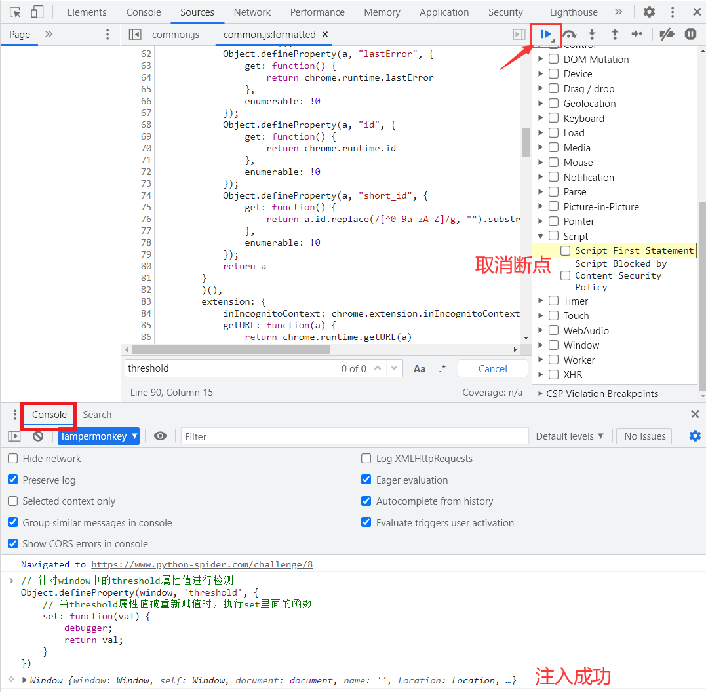

# 控制台检测

这道题是猿人学内部题目，没有会员也是进不去的，就不提供网址了，只分享解题流程。

题目难度：非常简单

### 检测原理

首先，控制台检测一定是通过JS实现。

1. 禁止F12 右键的解决方案：直接手动开启控制台再访问。

2. 呼出控制台弹窗或者跳转的解决方案：script断点，并且先尝试进行关键词搜索找线索。随机打上断点，不断缩小检测范围，直到找到。若是静态js/假动态直接可以Autoresponse干掉，若是真动态则在执行控制台检测逻辑附近的时候重置函数（这个可以参考无限debugger处理方案，重写函数，hook关键位置等）

3. 一些网站针会对Chrome浏览器使用console特性，只有在控制台打开的时候，console才会对一些信息和内容进行打印。如果设置一个定时器，在定时器中不断获取一个参数，并且对这个参数进行了hook，利用 `Object.defineProperty` 处理其get属性，那么当打开控制台的一瞬间console就会生效，获取属性并触发hook，执行 `Object.defineProperty` 内的逻辑。

!> 注意：置空函数的时候，一定要先定义，后重写，且是函数定义之后，函数调用之前重写才有意义。

### 逆向流程

#### 抓包解析

首先，看题目是控制台呼出检测，说明是对控制台检测：


我们先不打开控制台，进入题目看看，**发现需要 `window.threshold` 的值，带window说明该值，是一个全局变量**：


#### 逆向分析

但当我们现在打开控制台时，页面自己跳转到了空白页，**这里就说明有JS检测到了我们打开控制台的行为**：


**既然是通过JS来检测行为的，那我们就在Sources选项右侧的 `Event Listener Breakpoints` 勾选 `Script` 选项，对执行JS的位置打断点：**


现在我们点击浏览器左上角的后退键，后退回题目页面，我们的勾选的断点就触发了，**断点断在了开始加载并执行的第一个JS文件代码的时候**：


这时我们就可以使用刚刚前面所学的Hook技术对 `window.threshold` 的值进行监控：

```javascript
// 针对window中的threshold属性值进行检测
Object.defineProperty(window, 'threshold', {
    // 当threshold属性值被重新赋值时，执行set里面的函数
    set: function(val) {
		debugger;
        return val;
    }
})
```

将Hook代码注入后，取消前面我们勾选的 `Script` 断点，再点击运行按钮：



**点击右侧的 `Call Stack` 回调栈第二行，钩子函数断在了这里，我们在输出栏中打印出该信息，发现正是 `window.threshold` 其赋值为160：**


额外：按照上面的控制台检测的第3点，**全局查找一下 `Object.defineProperty` 方法，发现上面有个 `Object.defineProperty` 方法，里面有两个属性值，一个是 `window.location='about:blank'` 这恰巧就是我们前面打开控制台被跳转的页面，这又说明下面，使用了变量 `x` 中 `id` 属性，从而触发了get里面的函数，执行了跳转；另一个是 `window.threshold = 0` 这又恰巧是我们寻找的答案，但是这是跳转页后重新设置的值，而我们前面已经得到了正确值，估计这个值是烟雾弹：**


#### 扣JS代码

本题不涉及扣JS代码。

### 爬虫代码

本题不涉及爬虫代码。
