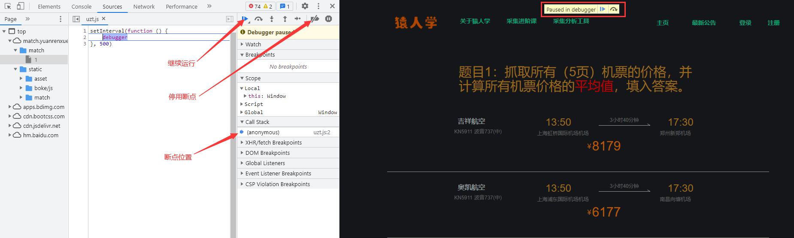

# 猿人学第1题

## 简介

猿人学是一个专注做爬虫和数据结构的卖课平台。猿人学第一届Web端爬虫攻防赛于2020年10月16日开始，总奖金3万，共设10题，主要涉及JS反混淆，CSS反加密，图文验证码对抗等技术。 参加该比赛，你能获得物质奖励，能结识一批志同道合的人，可能拿到更好的offer，欢迎你的参加。比赛已于2020年10月20日结束。

第一届Web端猿人学攻防大赛【官方网站】：https://match.yuanrenxue.com/

第一题题目网址：http://match.yuanrenxue.com/match/1

考察重点：JS混淆源码乱码

题目难度：简单

## 逆向流程

### 抓包解析

开打题目后按f12，会出现setInterval函数，直接禁用断点，然后就可以继续执行了，f5刷新一下



找到网页的数据来源


查看请求头和请求参数

### 逆向分析

### 扣JS代码

```javascript

```

## 爬虫代码

扣取了完整的JS代码，接下来我们就可以写爬虫了，代码如下：

```python

```


解题思路：[Python反反爬之JS混淆---源码乱码](https://www.52pojie.cn/forum.php?mod=viewthread&tid=1288315&extra=page%3D3%26filter%3Dtypeid%26typeid%3D29)

