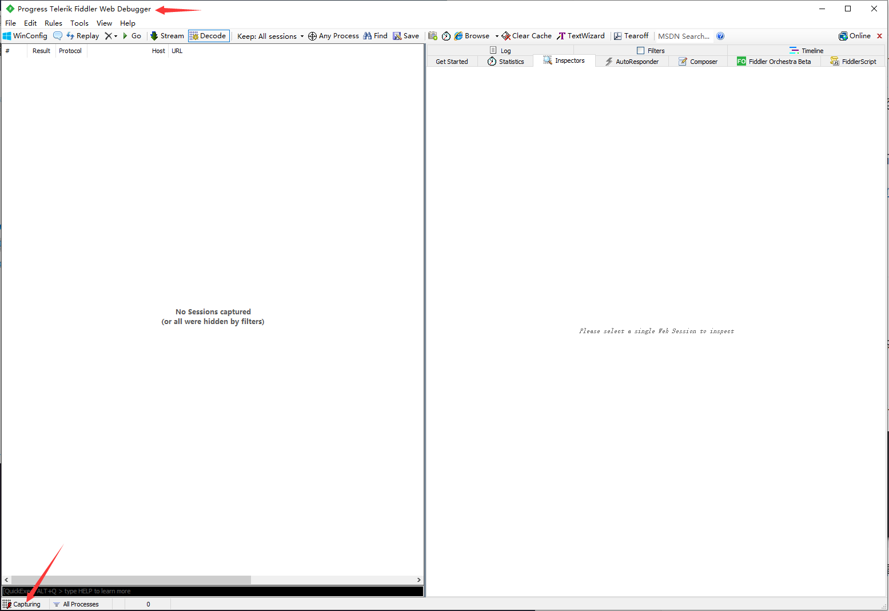
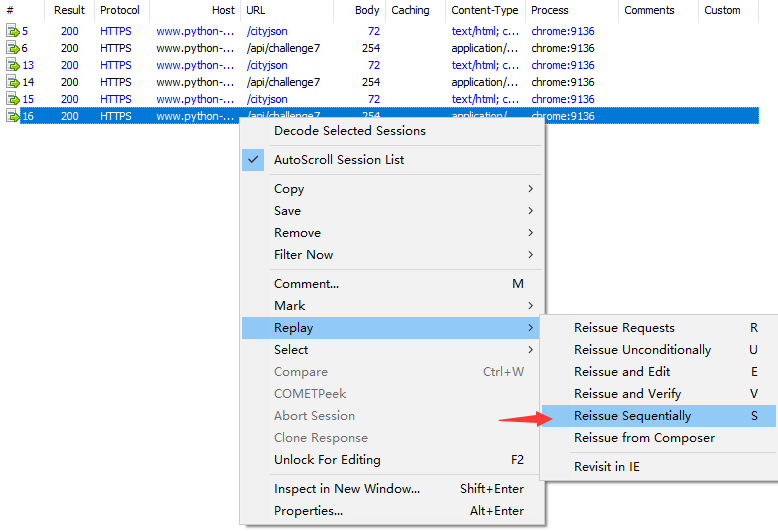

# 简单访问逻辑

## 简介

猿人学是一个专注做爬虫和数据结构的卖课平台。猿人学第一届Web端爬虫攻防赛于2020年10月16日开始，总奖金3万，共设10题，主要涉及JS反混淆，CSS反加密，图文验证码对抗等技术。 参加该比赛，你能获得物质奖励，能结识一批志同道合的人，可能拿到更好的offer，欢迎你的参加。比赛已于2020年10月20日结束。

## 第3题

第一届Web端猿人学攻防大赛【官方网站】：https://match.yuanrenxue.com/

网址：https://match.yuanrenxue.com/match/3

难度：非常简单

### 逆向流程

#### 抓包解析

首先打开Fiddler抓包工具，开启抓包状态：



然后右键单击任务栏中的谷歌浏览器，点击“打开新的无痕窗口”，按F12打开“开发者工具”：


访问网址获取任务，在Network里面的Fetch/XHR选项中定位到了该网页数据的来源请求：


访问前面3页，分析前3页请求头参数后，结合题目的提示，得出初步接结论：**每次向数据的接口发送请求时，都会先去访问一次后缀为jssm的页面。**


#### 逆向分析

回到我们的抓包工具Fiddler上面来，抓包的请求结果和Chrome开发者工具抓包的情况一模一样，结合对请求头和题目提示的分析，更加印证了我们结论的正确性。


#### 扣JS代码

这道题目并不涉及JS代码方面，因此也就不涉及扣JS代码了。

### 爬虫代码

这里有一点需要注意的，本题的考察的是访问逻辑。**但题目却有一个大坑，就是会检测请求头的参数位置顺序，如果位置顺序不正确，也是请求不到参数的，而且Chrome开发者工具的请求头参数是经过调整了的，使用这个请求头是拿不到数据的，必须使用Fiddler里面的请求头参数顺序，最简单的方式就是：选中数据包——点击右侧“header”——右键“Copy All Headers”**


```python
import requests

s = requests.session()

s.headers = {
    'Host': 'match.yuanrenxue.com',
    'Connection': 'keep-alive',
    'Content-Length': '0',
    'sec-ch-ua': '" Not;A Brand";v="99", "Google Chrome";v="91", "Chromium";v="91"',
    'sec-ch-ua-mobile': '?0',
    'Accept': '*/*',
    'User-Agent': 'yuanrenxue.project',
    'Origin': 'https://match.yuanrenxue.com',
    'Sec-Fetch-Site': 'same-origin',
    'Sec-Fetch-Mode': 'cors',
    'Sec-Fetch-Dest': 'empty',
    'Referer': 'https://match.yuanrenxue.com/match/3',
    'Accept-Encoding': 'gzip, deflate, br',
    'Accept-Language': 'zh-CN,zh;q=0.9',
    'Cookie': 'sessionid=iqvwwo5czwr428oh3ioaiejitz0akwmu',
}

all_data = []

# 共5页数据
for page in range(1, 6):
    # 忽略警告
    requests.packages.urllib3.disable_warnings()
    # 接口地址
    jssm_url = 'https://match.yuanrenxue.com/jssm'
    # 输出响应
    jssm_response = s.post(url=jssm_url, verify=False)
    # 接口地址
    url = f'https://match.yuanrenxue.com/api/match/3?page={page}'
    # 输出响应
    response = s.get(url=url, verify=False).json()
    print(f'第{page}页:{response}')
    all_data += response.get("data")

# 出现频率最高的值（众值）
print(max(all_data, key=all_data.count))
```

## 第7题

这道题是猿人学内部题目，没有会员也是进不去的，就不提供网址了，只分享解题流程。

### 逆向流程

#### 抓包解析

首先打开Fiddler抓包工具，开启抓包状态，选择抓取经过浏览器的数据包：


然后右键单击任务栏中的谷歌浏览器，点击“打开新的无痕窗口”，按F12打开“开发者工具”：


访问题目获取题目信息后，往后翻2页，发现每次翻页前都会有一个 `cityjson` 请求：


查看Fiddler的抓包，一模一样：


接下来，我们只选中 `/api/challenge7` 进行重放攻击（重新请求访问），选中请求右键选择 `Replay` 选中 `Reissue Sequentially` 点击：



输入重放次数，我们输入3，点击OK：


进行3次重放攻击，发现请求的状态码都是403，说明只访问 `/api/challenge7` 行不通：


**同时选中 `/cityjson` 和 `/api/challenge7` 两个请求进行重放攻击：**


这里可以看到当两个请求一起重放就成功获取到数据了：


#### 逆向分析

通过上面的操作说明访问获取数据的接口 `/api/challenge7` 就必须要先访问 `/cityjson` 接口才能成功拿到数据。

#### 扣JS代码

这道题目并不涉及JS代码方面，因此也就不涉及扣JS代码了。

### 爬虫代码

```python
import requests

# 建立一个会话
session = requests.session()
# 忽略警告
requests.packages.urllib3.disable_warnings()

def conversion(head):
    items = [item.split(': ') for item in head.split('\n')]
    header = {}
    for item in items:
        header.update({item[0]: item[1]})
    return header

'''
第7题
'''
city_header = '''Host: www.python-spider.com
Connection: keep-alive
Content-Length: 0
sec-ch-ua: " Not;A Brand";v="99", "Google Chrome";v="97", "Chromium";v="97"
sec-ch-ua-mobile: ?0
User-Agent: Mozilla/5.0 (Windows NT 10.0; Win64; x64) AppleWebKit/537.36 (KHTML, like Gecko) Chrome/97.0.4692.71 Safari/537.36
sec-ch-ua-platform: "Windows"
Accept: */*
Origin: https://www.python-spider.com
Sec-Fetch-Site: same-origin
Sec-Fetch-Mode: cors
Sec-Fetch-Dest: empty
Referer: https://www.python-spider.com/challenge/7
Accept-Encoding: gzip, deflate, br
Accept-Language: zh-CN,zh;q=0.9
Cookie: Hm_lvt_337e99a01a907a08d00bed4a1a52e35d=1641312032,1643379069; sessionid=6ove5d44afx58bweu7dd0hx8lozueelh; Hm_lpvt_337e99a01a907a08d00bed4a1a52e35d=1643620620'''

page_header = '''Host: www.python-spider.com
Connection: keep-alive
Content-Length: 6
sec-ch-ua: " Not;A Brand";v="99", "Google Chrome";v="97", "Chromium";v="97"
Accept: application/json, text/javascript, */*; q=0.01
Content-Type: application/x-www-form-urlencoded; charset=UTF-8
X-Requested-With: XMLHttpRequest
sec-ch-ua-mobile: ?0
User-Agent: Mozilla/5.0 (Windows NT 10.0; Win64; x64) AppleWebKit/537.36 (KHTML, like Gecko) Chrome/97.0.4692.71 Safari/537.36
sec-ch-ua-platform: "Windows"
Origin: https://www.python-spider.com
Sec-Fetch-Site: same-origin
Sec-Fetch-Mode: cors
Sec-Fetch-Dest: empty
Referer: https://www.python-spider.com/challenge/7
Accept-Encoding: gzip, deflate, br
Accept-Language: zh-CN,zh;q=0.9
Cookie: Hm_lvt_337e99a01a907a08d00bed4a1a52e35d=1641312032,1643379069; sessionid=6ove5d44afx58bweu7dd0hx8lozueelh; Hm_lpvt_337e99a01a907a08d00bed4a1a52e35d=1643620620'''

# 总和
sum_numbers = 0

# 100页数据
for page in range(1, 101):
    # 第一次请求
    city_url = 'https://www.python-spider.com/cityjson'
    session.post(url=city_url, headers=conversion(city_header), verify=False)
    # 第二次请求
    data = {'page':page}
    page_url = 'https://www.python-spider.com/api/challenge7'
    response = session.post(url=page_url, headers=conversion(page_header), data=data, verify=False).json()
    values = [value.get('value').replace('\r', '') for value in response.get('data')]
    print(f'第{page}页的数据：{values}')
    for value in values:
        sum_numbers += int(value)
print(sum_numbers)
```


