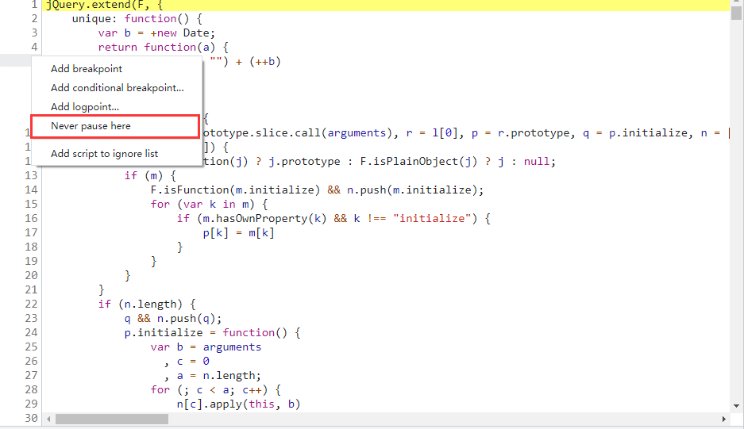

## 调试干扰

## 调试检测

首先，控制台检测一定是通过JS实现。

1. 禁止F12 右键的解决方案：直接手动开启控制台再访问。

2. 呼出控制台弹窗或者跳转的解决方案：script断点，并且先尝试进行关键词搜索找线索。随机打上断点，不断缩小检测范围，直到找到。若是静态js/假动态直接可以Autoresponse干掉，若是真动态则在执行控制台检测逻辑附近的时候重置函数（这个可以参考无限debugger处理方案，重写函数，hook关键位置等）

一些网站针对Chrome浏览器使用console特性，只有在控制台打开的时候，console才会对一些信息和内容进行打印。如果设置一个定时器，在定时器中不断获取一个参数，并且对这个参数进行了hook，利用 `Object.defineProperty` 处理其get属性，那么当打开控制台的一瞬间console就会生效，获取属性并触发hook，执行 `Object.defineProperty` 内的逻辑。

!> 置空函数的时候，一定要先定义，后重写，且是函数定义之后，函数调用之前重写才有意义。

## 无限debugger

无限debugger，还有一个非常靓丽的名字，叫debugger地狱。

无限debugger：**调试过程中一直点击跳转下一个debugger时候，永远的跳转到下一个debugger那去，但是无限debugger不可能无限，否则浏览器会卡死。简单说，就是很频繁的去执行debugger逻辑，而不是真正的死循环。**

**实现debugger的方案：Function，关键字，eval制作虚拟机。**

【不可混淆】

```javascript
debugger; 
```

【可混淆】

```javascript
eval("debugger;")
```

【可重度混淆】

```
Function("debugger").call()/apply()或赋值bind()
XXX.constructor("debugger").call("action")
Function.constructor("debugger").call("action")
(function() {return !![];}["constructor"]("debugger")["call"]("action"))
```

实现无限debugger的方案： 任何可以循环的代码都可以！

```
debugger逻辑放入函数中{
    setInterval
    循环的 setTimeout
}
【函数中可能包含业务逻辑和代码】
```

例如，使用 `setInterval` 来实现一个每0.5秒触发的无限debugger：

```html
<script>
    function a(){
        debugger;
    }
    setInterval(a, 500);
</script>
```

处理debugger方案：

1. **干掉debugger贯穿全局，干掉定时器等全局事件（置空或重写）。**

例如，使用 `setInterval` 实现无限debugger，可以让改函数调用前重写该函数并生效。

```javascript
setInterval_back = setInterval
// 只要定时器里面的参数不包含了'debugger'就执行
setInterval = function(a, b){
    if(a.toString().indexOf('debugger') == -1){
        return setInterval_back(a, b)
    }
}
```

如果业务代码里面是不重要的代码，我们也可以直接置它：

```javascript
setInterval = function(){}
```

2. **无限debugger在加密逻辑之前。这就证明，想要调试到函数入口，必须越过这个无限debugger，针对静态文件/伪动态文件（大部分都是这个情况）。**

方案一：用fiddler中Autoresponse删掉debugger（建议）

方案二：遇到debugger，可以在对应行的左侧右键点击选择 `Nerver pause here` 选择无视它。



方案三：在debugger这里打断点。


在蓝色断点位置，点击鼠标右键，选择Edit breakpoint：


输入属性false：


蓝色断点变黄：


方案四：针对真动态文件或Autoresponse失效或删掉debugger逻辑很繁琐的情况下。

```
1.如果是Function原理的debugger，可以重写函数构造器
2.如果是eval型的构造器，可以重构eval函数
3.如果是定时器，并且2失效了，可以重构定时器
4.在以上方式都失效时，向上找堆栈，在进入无限debugger之前打上断点将触发无限debugger的函数置空（最麻烦，但是适用性最广）
```

重写函数构造器：

```javascript
Function.prototype.constructor_bc = Function.prototype.constructor
Function.prototype.constructor = function(){
    if(arguments[0] === "debugger"){}
    else{
        return Function.prototype.constructor_bc.apply(this, arguments)
    }
}
```

3. **无限debugger在加密逻辑之后。不用管，直接在script第一行断点打上，从头开始。**

## 内存爆破

内存爆破，**指js通过死循环/频繁操作数据库(包括cookie)/频繁调取history等方式，使浏览器崩溃的一种反调试手段。**还有一种特性情况：**js文件很大，电脑内存不足（这种情况在调试层面几乎无解）。**其特点：

1. 正常运行时，一切正常；
2. 调试时利用时间差，调试特点等讲控制流推入循环；
3. 利用正则/toString() 判断代码是否进行格式化；
4. 利用浏览器指纹判断是否为浏览器环境；

## 事件监听断点

非常频繁使用的事件监听断点：script、XHR

一般频繁使用的：Dom断点、Control、timer

不太常用但是偶尔会用到的：Mouse