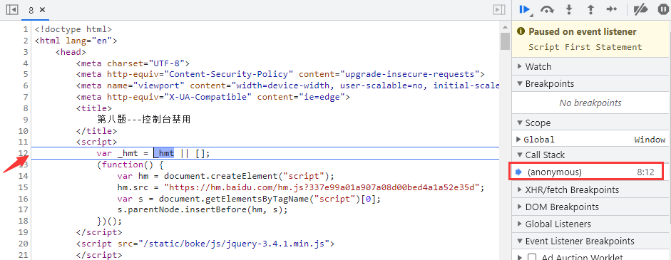
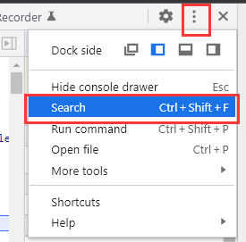
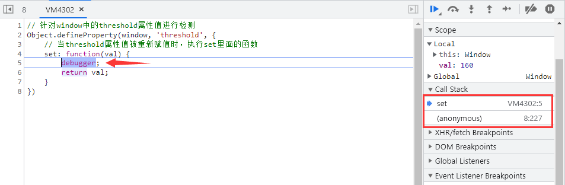
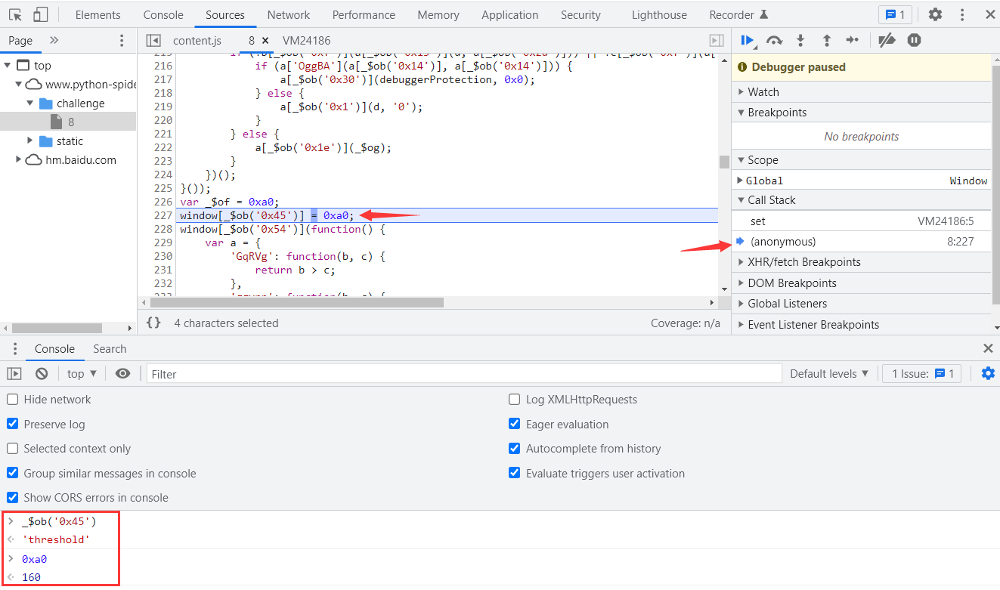
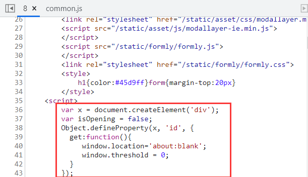
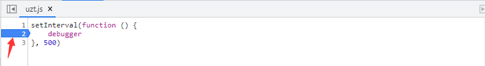
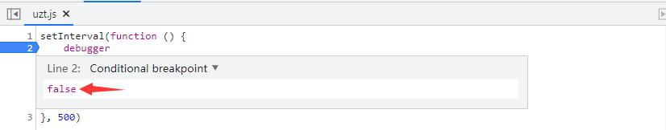
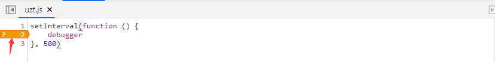

# 调试干扰

## 控制台检测

这道题是猿人学内部题目，没有会员也是进不去的，就不提供网址了，只分享解题流程。

题目难度：非常简单

### 检测原理

**首先，我们要知道在网页上的行为事件都是通过JS实现的，例如鼠标单击事件、内容选中事件、加载事件等，所以控制台检测一定是通过JS实现。**针对控制台行为检测有以下解决方案：

1. 禁止F12 右键的解决方案：**直接手动开启控制台再访问。**

2. 呼出控制台弹窗或者跳转的解决方案：**script事件断点，并且先尝试进行关键词搜索找线索。随机打上断点，不断缩小检测范围，直到找到。若是静态js/假动态直接可以Autoresponse干掉，若是真动态则在执行控制台检测逻辑附近的时候重置函数（这个可以参考无限debugger处理方案，重写函数，hook关键位置等）。**

3. 一些网站针会对Chrome浏览器使用console特性，只有在控制台打开的时候，console才会对一些信息和内容进行打印。如果设置一个定时器，在定时器中不断获取一个参数，并且对这个参数进行了hook，利用 `Object.defineProperty` 处理其get属性，那么当打开控制台的一瞬间console就会生效，获取属性并触发hook，执行 `Object.defineProperty` 内的逻辑。

!> 注意：置空函数的时候，一定要先定义，后重写，且是函数定义之后，函数调用之前重写才有意义。

### 逆向流程

#### 抓包解析

首先，看题目是控制台呼出检测，说明是对控制台检测：


我们先不打开控制台，进入题目看看，**发现需要 `window.threshold` 的值，带window说明该值，是一个全局变量**：


#### 逆向分析

但当我们现在打开控制台时，页面自己跳转到了空白页，**这里就说明有JS检测到了我们打开控制台的行为**：


**既然是通过JS来检测事件行为的，那我们就在Sources选项右侧的 `Event Listener Breakpoints` 事件监听断点中勾选 `Script` 选项，对执行JS的位置打断点：**


现在我们重新进入题目页面，我们的勾选的断点就触发了，**断点断在了开始加载并执行的第一个第一行JS代码的位置，即名称为 `8` 的文件的第12行这段代码**：



既然这道题针对的是 `window.threshold` 的值，我们就可以使用前面所学的Hook技术对 `window.threshold` 的值进行监控：

```javascript
// 针对window中的threshold属性值进行检测
Object.defineProperty(window, 'threshold', {
    // 当threshold属性值被重新赋值时，执行set里面的函数
    set: function(val) {
		debugger;
        return val;
    }
})
```

点击右上角的配置选项，点击里面的Search选项，调出下方的搜索栏：



点击下方的Console选项，将Hook代码注入后，取消前面我们勾选的 `Script` 事件断点，再点击运行按钮：


**马上就被Hook断住了，说明当前JS代码对 `window.threshold` 赋值了，看右侧的 `Call Stack` 回调栈位置在第一行，就是我们现在所在的函数 `set` 位置：**



**点击右侧的 `Call Stack` 回调栈第二行，回到上一层函数，发现Hook在了这里，我们在输出栏中打印出该信息，发现正是 `window.threshold` 其赋值为160：**



最后补充：按照上面的控制台检测的第3点，**全局查找一下 `Object.defineProperty` 方法，发现上面有个 `Object.defineProperty` 方法，里面有两个属性值，一个是 `window.location='about:blank'` 这恰巧就是我们前面打开控制台被跳转的页面，这又说明下面，使用了变量 `x` 中 `id` 属性，从而触发了get里面的函数，执行了跳转；另一个是 `window.threshold = 0` 这又恰巧是我们寻找的答案，但是这是跳转页后重新设置的值，而我们前面已经得到了正确值，但这个值是烟雾弹：**



#### 抠JS代码

本题不涉及抠JS代码。

### 爬虫代码

本题不涉及爬虫代码。

## 无限debugger

无限debugger，还有一个非常靓丽的名字，叫debugger地狱。

无限debugger：**调试过程中一直点击跳转下一个debugger时候，永远的跳转到下一个debugger那去，但是无限debugger不可能无限，否则浏览器会卡死。简单说，就是很频繁的去执行debugger逻辑，而不是真正的死循环。**

**实现debugger的方案：Function，关键字，eval制作虚拟机。**

【不可混淆】

```javascript
debugger; 
```

【可混淆】

```javascript
eval("debugger;")
```

【可重度混淆】

```
Function("debugger").call()/apply()或赋值bind()
XXX.constructor("debugger").call("action")
Function.constructor("debugger").call("action")
(function() {return !![];}["constructor"]("debugger")["call"]("action"))
```

实现无限debugger的方案： 任何可以循环的代码都可以！

```
debugger逻辑放入函数中{
    setInterval
    循环的 setTimeout
}
【函数中可能包含业务逻辑和代码】
```

例如，使用 `setInterval` 来实现一个每0.5秒触发的无限debugger：

```html
<script>
    function a(){
        debugger;
    }
    setInterval(a, 500);
</script>
```

处理debugger方案：

1. **干掉debugger贯穿全局，干掉定时器等全局事件（置空或重写）。**

例如，使用 `setInterval` 实现无限debugger，可以让改函数调用前重写该函数并生效。

```javascript
setInterval_back = setInterval
// 只要定时器里面的参数不包含了'debugger'就执行
setInterval = function(a, b){
    if(a.toString().indexOf('debugger') == -1){
        return setInterval_back(a, b)
    }
}
```

如果业务代码里面是不重要的代码，我们也可以直接置它：

```javascript
setInterval = function(){}
```

2. **无限debugger在加密逻辑之前。这就证明，想要调试到函数入口，必须越过这个无限debugger，针对静态文件/伪动态文件（大部分都是这个情况）。**

方案一：用fiddler中Autoresponse删掉debugger（建议）

方案二：遇到debugger，可以在对应行的左侧右键点击选择 `Nerver pause here` 选择无视它。


方案三：在debugger这里打断点。



在蓝色断点位置，点击鼠标右键，选择Edit breakpoint：


输入属性false：



蓝色断点变黄：



方案四：针对真动态文件或Autoresponse失效或删掉debugger逻辑很繁琐的情况下。

```
1.如果是Function原理的debugger，可以重写函数构造器
2.如果是eval型的构造器，可以重构eval函数
3.如果是定时器，并且2失效了，可以重构定时器
4.在以上方式都失效时，向上找堆栈，在进入无限debugger之前打上断点将触发无限debugger的函数置空（最麻烦，但是适用性最广）
```

重写函数构造器：

```javascript
Function.prototype.constructor_bc = Function.prototype.constructor
Function.prototype.constructor = function(){
    if(arguments[0] === "debugger"){}
    else{
        return Function.prototype.constructor_bc.apply(this, arguments)
    }
}
```

3. **无限debugger在加密逻辑之后。不用管，直接在script第一行断点打上，从头开始。**

## 内存爆破

内存爆破，**指js通过死循环/频繁操作数据库(包括cookie)/频繁调取history等方式，使浏览器崩溃的一种反调试手段。**还有一种特性情况：**js文件很大，电脑内存不足（这种情况在调试层面几乎无解）。**其特点：

1. 正常运行时，一切正常；
2. 调试时利用时间差，调试特点等讲控制流推入循环；
3. 利用正则/toString() 判断代码是否进行格式化；
4. 利用浏览器指纹判断是否为浏览器环境；
