# 逆向进阶

## Hook技术

**Hook技术，当中的hook是”钩、钩子“的意思，又叫做Hook钩子函数，其实就是一小段代码。**在系统没有调用该函数之前，钩子函数就先捕获该消息得到控制权，这时钩子函数既可以加工处理（改变）该函数的执行行为，还可以强制结束消息的传递。**简单来说，就是把系统的程序拉出来变成我们自己执行代码片段。**在js中，系统程序可以指浏览器API，也可以指代码中实现的一些方法等。

1. **Hook钩子函数本质就是代码注入，在文件代码开始运行时（可以在第一行代码打上断点）将其断住，就将Hook代码注入进去，继续运行代码等待Hook被触发。**
2. 当钩子函数被触发时，就执行我们定义的钩子函数的逻辑。
3. **注入的Hook代码仅当前页面有效使用，如果刷新页面或者打开的新的标签页，需要重新注入Hook代码。**
4. **客户端拥有js的最高解释权，可以决定在任何时候注入js，而服务器只能通过检测和混淆手段令Hook难度加大，但无法阻止。**

Hook分类：**手动Hook，自动Hook。**

Hook步骤：**1、寻找hook点；2、编写hook逻辑；3、调试。**

Hook目的：**找到函数入口以及一些参数变化，便于分析js逻辑，但是 hook的能力远不及此，我们只借助其寻找函数入口。**

### 通用公式

通用公式总共两个：**Hook函数公式、Hook对象中属性公式。**

**Hook函数公式**：

```javascript
// 第一步：赋值（func:要hook的函数）
old_func = func
// 第二步：重写（重写func方法）
func = function(argument){
	my task;
	return old_func.apply(argument)
}
// 第三步：原型链（修改一些原生的方法伪装它没有被Hook）
func.prototype..... = .......
```

上面还可以改为局部Hook：

```javascript
// 针对b的值等于5的时候进行Hook
old_b = b;
b = function(val){
    if(val === 5){
        debugger;
    }
    return old_b(val)
}
```

接下来讲Hook对象中属性公式前，我们首先要讲解 `Object.defineProperty()` 函数，**作用就是直接在一个对象上定义一个新属性，或者修改一个已经存在的属性。**

```javascript
Object.defineProperty(obj, prop, desc)
// obj 需要定义属性的当前对象
// prop 当前需要定义的属性名
// desc 属性描述符
```

**数据描述符 --特有的两个属性（value,writable）**是针对数据描述的属性定义，其中value代表值，writable代表值是否可以被赋值改变。

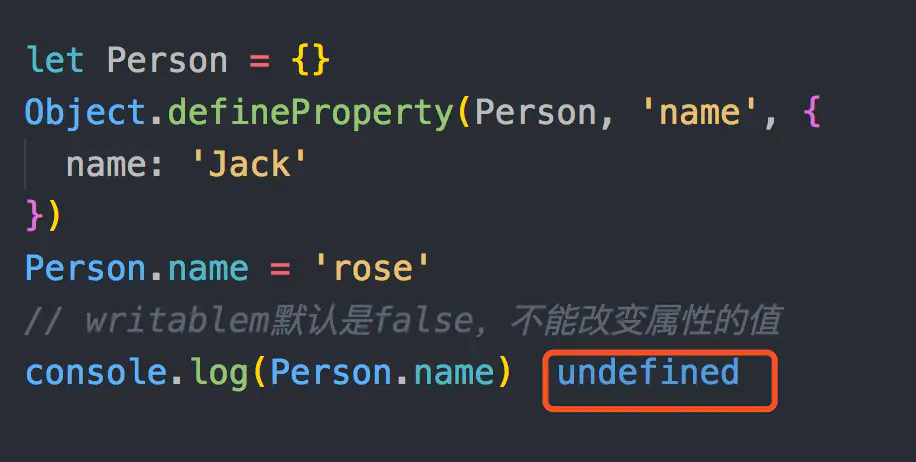

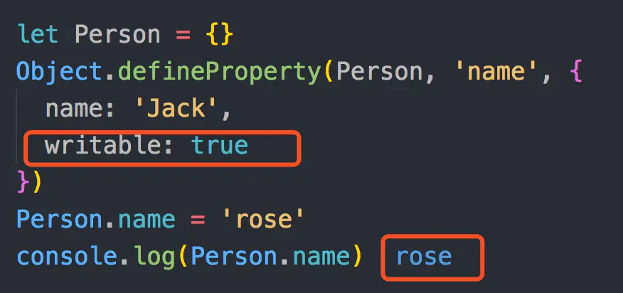

**存取描述符 --是由一对 getter、setter 函数功能来描述的属性。**

`get`：一个给属性提供`getter`的方法，如果没有 `getter` 则为 `undefined`。该方法返回值被用作属性值。默认为 `undefined`。
`set`：一个给属性提供`setter`的方法，如果没有 `setter` 则为 `undefined`。该方法将接受唯一参数，并将该参数的新值分配给该属性。默认值为 `undefined`。

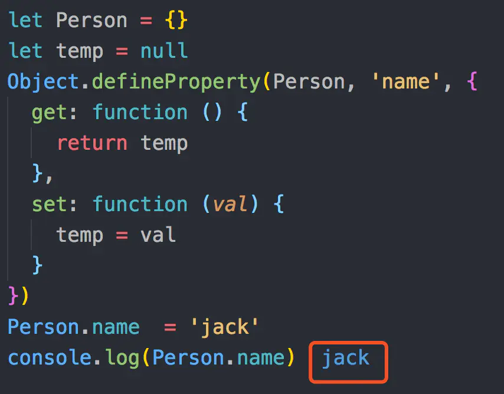

**数据描述符和存取描述均具有**以下描述符：

1. `configrable` 描述属性是否配置，以及可否删除。
2. `enumerable` 描述属性是否会出现在 `for in` 或者 `Object.keys()` 的遍历中。

最后，如果描述符中的某些属性被省略，会使用以下默认规则：

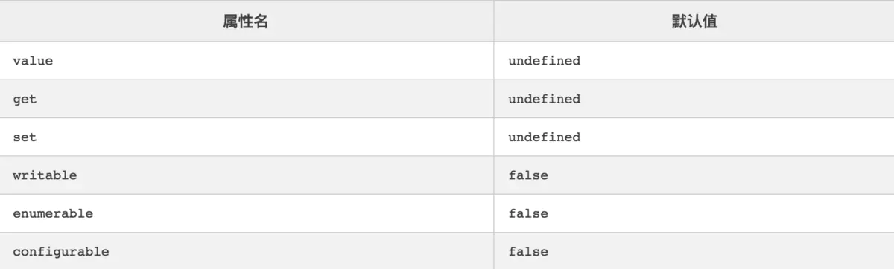

**Hook对象中属性公式**：

```javascript
// 把对象属性赋值给一个变量
old_attr = obj.attr
Object.defineProperty(obj, 'attr', {
    // 获取obj.attr属性时就会执行get里面的函数内容
    get: function() {
        console.log(cookie_cache);
        return old_attr 
	},
    // 设置obj.attr属性时就会执行set里面的函数内容
    set: function(val) {
		return  ......
    }
})
```

同样的，上面的可以改为全局Hook：

```javascript
// 针对全局变量a（相当于window.a）进行Hook
Object.defineProperty(window, 'a', {
    set: function(val) {
		debugger;
    }
})
```

### 简单使用

**在JS调试过程中，我们常用Hook来监控一些调试信息或者进行debugger。**

```javascript
// hook钩子document.cookie属性
document.old_cookie = document.cookie
Object.defineProperty(document, 'cookie', {
    // 获取document.cookie属性时就会执行get里面的函数内容
    get: function() {
        debugger;
        return document.old_cookie
	}
})
```

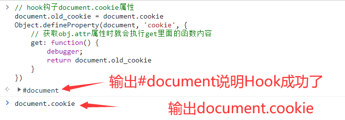

回车后就直接进入了 `get` 函数里面的debugger了，这样就实现了对 `document.cookie` 的监控：

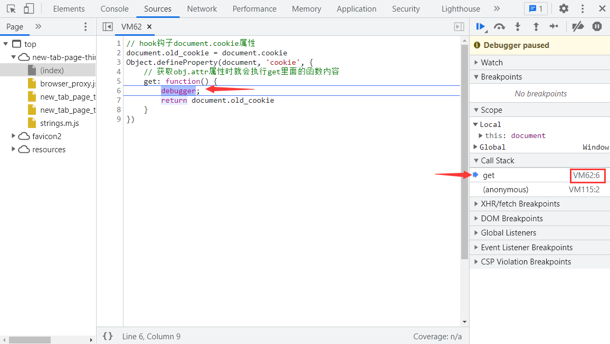

```javascript
//常用JS的HOOK代码

// hook原型链中的方法（以字符串的split方法为例）
String.prototype.split_bk = String.prototype.split;  // 保存原始方法
String.prototype.split = function(val){  // 重写eval方法
    str = this.toString()
    debugger;
    return str.split_bk(val)
}

// hook eval方法
window.__cr_eval = window.eval;  // 保存原始方法
var myeval = function(src){  // 重写eval方法
    console.log(src);
    debugger;
    return window.__cr_eval(src);
}
var _myeval = myeval.bind(null);
_myeval.toString = window.__cr_eval.toString;
Object.defineProperty(window, 'eval', {value: _myeval});

// hook Function函数
window.__cr_fun = window.Function;
var myfun = function(){
    var args = Array.prototype.slice.call(arguments, 0, -1).join(","), src = arguments[arguments.length - 1]
    console.log(src);
    console.log("=============== Function end ===============");
    debugger;
    return window.__cr_fun.apply(this, arguments);
}
myfun.toString = function(){return window.__cr_fun + ""} 
Object.defineProperty(window, 'Function', {value: myfun});

// hook JSON.stringify
var my_stringify = JSON.stringify;
JSON.stringify = function(params){
    console.log("hook", params);
    debugger;
    return my_stringify(params);
};

// hook JSON.parse
var my_parse = JSON.parse;
JSON.parse = function(params){
    console.log("hook", params);
    debugger;
    return my_parse(params);
};

// hook cookie字段RM4hZBv0dDon443M
(function () {
   Object.defineProperty(document, 'cookie', {
       set: function (cookie) {
           // 方法indexOf检索字符串的值若没有出现，则该方法返回-1。
           if(cookie.indexOf('RM4hZBv0dDon443M') != -1){
                debugger;
           }
           return cookie;
       }
   })
})();

// hook window对象
var window_flag_1 = 'object1'; // 修改为需要hook的对象
var window_flag_2 = 'object2'; // hook对象的对象

var key_value_map = {};
var window_value = window[window_flag_1];

Object.defineProperty(window, window_flag_1, {
    get: function(){
        console.log('Getting', window, window_flag_1, '=', window_value);
        debugger;
        return window_value;
    },
    set: function(val){
        console.log('Setting', window, window_flag_1, '=', val);
        debugger;
        window_value = val;
        key_value_map[window[window_flag_1]] = window_flag_1;
        set_obj_attr(window[window_flag_1], window_flag_2);
    },
});

function set_obj_attr(obj, attr){
    var obj_arrt_value = obj[attr];
    Object.defineProperty(obj, attr, {
        get:function(){
            console.log('Getting', key_value_map[obj], attr, '=', obj_arrt_value);
            debugger;
            return obj_arrt_value
        },
        set: function(val){
            console.log('Setting', key_value_map[obj], attr, '=', val);
            debugger;
            obj_arrt_value = val;
        },
    });
};
```

### 缺陷弊端

1. 函数hook一般情况下不会出现hook失败的情况，只有可能是 `__proto__` 模拟的不好导致被检测到了。
2. **属性hook一般只绑定一次，所以当网站的逻辑都采用 `Object.defineProperty` 绑定后，属性hook就会失效，暂时没有发现好的解决方案。**

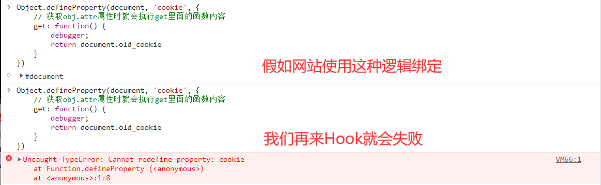

```javascript
// 因此我们需要注意下面逻辑
try:
    hook
catch:
    另外的逻辑
```

3. 这里还有一种我没讲的hook，叫局部hook，原理是一样的，只不过需要在进入作用域的那一刻进行hook。

### 油猴脚本

前面我们提过Hook分为**手动Hook，自动Hook。**上面的所举的例子都是手动Hook，如果不想手动Hook，可以试试 Tampermonkey 油猴脚本，简单讲就是一个给浏览器注入js代码的脚本，支持Chrome（谷歌）、Firefox（火狐）等浏览器。

安装油猴脚本，首先需要**科学上网**，进入Google搜索，搜索“Chrome应用商店”关键词：

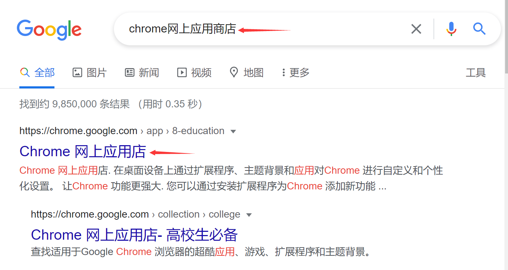

进入商店后，输入 Tampermonkey 进行查找，点击第一个进行安装：

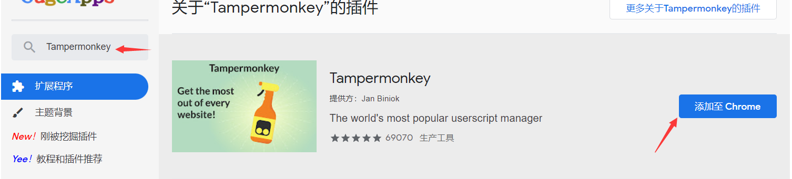

如果安装不成功，本地会有一个油猴脚本的 `crx` 文件：


我们打开chrome浏览器的“更多工具”中的“扩展程序”选项：

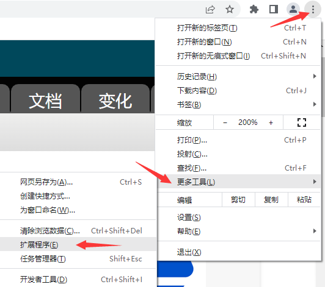

打开开发者模式，将 `crx` 文件拖入其中，油猴脚本就自动安装成功了：

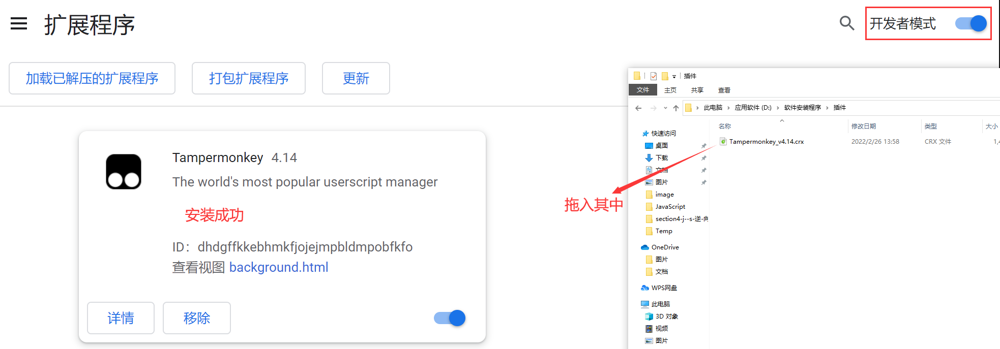

接下来，我们点击扩展程序按钮，再点击固定按钮将油猴程序固定再工具栏：

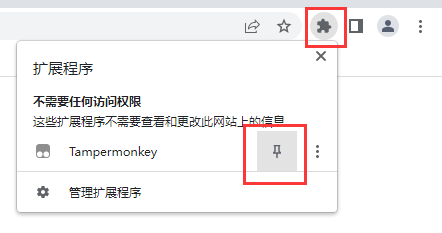

现在我们点击图标，点击“添加新脚本”：

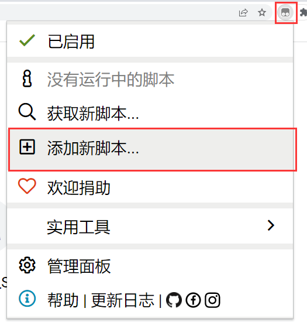

就会出现编辑脚本的页面：

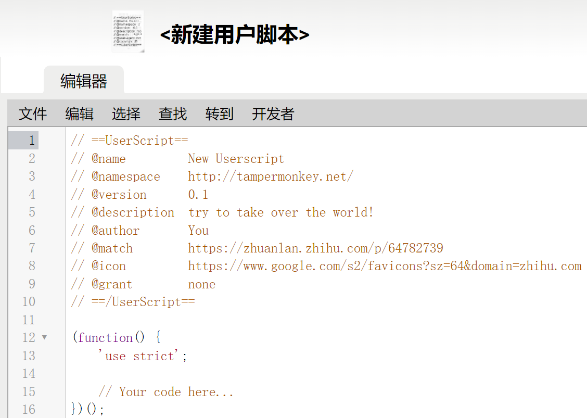

其中里面有些参数信息如下：

```
@name :脚本名，随便命名。
@namespace ：脚本的命名空间，一般就是写个url，告诉自己用在哪里。
@version：版本，随便命名。
@author：作者，随便命名。
@description：描述，随便描述。
@homepage, @homepageURL, @website and @source：从脚本名称链接到给定页面的作者主页。
@icon, @iconURL and @defaulticon：低分辨率脚本图标。
@icon64 and @icon64URL：高分辨率脚本图标。
@updateURL：更新检查的url，@version参数开启，会向url检查更新。
@downloadURL：定时监测到更新会自动下载url内容，若为 none则不检查
@include @match：匹配规则相关。支持精确匹配与正则匹配。（重要）
@exclude是排除，不写相当于脚本白写（重要）
@require @resource ：导包，支持url引入。比如，引入jquery，可以使用$
@connect：标记定义域，感觉很有用，但是我菜，所以很少用。
@grant：白名单函数：比如：@grant window.close 。很强大，如果默认不写则会对一些原生函数如：eval等进行保护，显然这不是我们所期待的，所以就直接 @grant none了
@antifeature ：官方文档的意思：开发人员是否允许别人把脚本货币化。
@noframes：在主页上运行而不在iframes上运行。
@unwrap：卵用没有，官方文档的意思：在chrome上，不需要它，自动被忽略了（淦！）
@nocompat：一般默认，官方文档写了好长，大概的意思指支持标记浏览器。如：@nocompat Chrome，这样就不能在火狐浏览器运行它了。
@run-at： 指定油猴脚本在什么时候执行，默认是在所有js加载完成后执行。（那hook脚本还有个屁用啊！重要）
参数：
@run-at document-start  ：脚本尽快注入（相当于script断点之后，进入页面一瞬间注入）
@run-at document-body ：如果页面body元素存在，则注入（所以练习平台第二题就注不进去了）
@run-at document-end ：脚本将在DOMContentLoaded事件发生注入。
**@run-at document-idle：默认值。脚本将在DOMContentLoaded事件发生之后才注入。**
@run-at context-menu：如果在浏览器上下文菜单中单击脚本（仅限于基于桌面Chrome的浏览 器），则会注入脚本。
```

脚本案例：

```javascript
// ==UserScript==
// @name         万能hook eval函数
// @namespace    http://tampermonkey.net/
// @version      0.1
// @description  eval-everything
// @author       An-lan
// @include      *
// @grant        none
// @run-at      document-start
// ==/UserScript==

alert('hook success');
var eval_bk = eval;
eval = function(val){
    console.log(val)
    return eval_bk(val);
};
eval.toString = function(){
    return "function eval() { [native code] }"
};
eval.length = 1;
```

将脚本拷贝到油猴当中，Ctrl+S进行保存，就会自动启用：

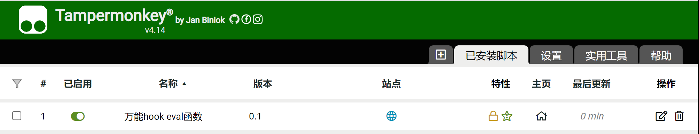

这样，油猴脚本就能自动对网站JS当中的eval进行Hook了。

## webpack

webpack简单讲就是一个前端的打包框架。

### 处理方案

1. 寻找函数入口

2. 处理预设加载器

3. 暴露密文

4. 最后处理


## 逆向核心

JS逆向的核心就分为：**抠代码、补环境。**

### 抠代码

抠代码流程技巧以及优缺点：

```
流程：
1.缺啥补啥，深度优先
2.见文知义，化繁为简
3.了然于胸，如履平地
技巧：
1.如果Console方法在JS中被重写了，我们可以在第一行用一个变量保存Console_old=Console，在最后一行使用Console_old进行输出。这种解决方式，同样也适用其他方法。
2.当我们抠出了所有的JS代码时，最好放在一个大函数内，最后用return返回结果。
3.重点注意try{}catch{}和||、&&能产生不同执行分支的地方，因为这些地方容易被“投毒”，即在本地调试产生与正确结果形式相似的错误结果。
优点：
1.执行效率高
2.并发能力强
3.能感受到进度（抠出一行是一行）
4.只要有耐心，笨办法也能成大事
缺点：
1.比较吃经验，只有勤学苦练才能更快
2.若想精通则对js基础要求较高（尤其是对于浏览器API的掌握程度）
3.网站即使微调，js可能就会失效
4.做不到完全还原浏览器的某些值，对风控响应不够及时。
```

### 补环境

**爬虫的本质就是欺骗服务器，各种的反爬手段就是增强信任的过程，最终让服务器相信你是人在访问网页，如果被反爬了，就是你”骗术不精“被发现了。**补环境就可以理解为在JS环境下精进我们的”骗术“。

**首先我们都清楚，浏览器的环境和我们本地运行 JS 的 Node 环境是完全不同的，平台有很多的检测点来发现我们是在浏览器运行 JS 还是在 Node 环境下运行 JS，补环境做的就是尽可能根据网页上的 Js 完善本地的 Node 环境，让 Js 运行在 Node 中像浏览器一样不报错就可以了。**

其中，大家经常遇到的是 `'window' is not defined` 那像这样的报错提示应该如何处理？Node 环境下一般如下定义：

```javascript
// 运行js时遇到window未定义，添加下面的代码：
window=global;
```

如果只是单单缺少了 `window` 这一个变量的定义，像上面这样报错自然就消失了。除此之外，我们经常还遇到 `'document' is not defined` 和 `'document.cookie' is not defined` 之类的错误。那像这样的 `document` 应该怎么补？Node 环境下一般如下定义：

```javascript
// 运行js时遇到document未定义，添加下面的代码：
document={};
// 运行js时遇到document.cookie未定义，添加下面的代码：
document.cookie='';
```

常用补环境的方法还有：

```javascript
// 运行js时遇到navigator is not defined报错，解决办法添加下面代码：
global.navigator={ userAgent: 'node.js', };
```

还有一些补环境的应用或者常见操作：

```javascript
window || global  // 在浏览器中返回window，在node中window未定义
global || window  // 在浏览器中global未定义，在node中返回global
```

还比如，有些只能在浏览器中运行的方法：


```javascript
// 在浏览器中输出当前网页dom节点中class名称为hero-paragraph的第一个节点中的文本信息
document.getElementsByClassName('hero-paragraph')[0].textContent
```

但在node.js中运行报错，会提示 `document is not defined` document未定义，当我们补上 `document={};` 后，又会提示 `document.getElementsByClassName is not a function` document.getElementsByClassName不是一个方法，那么我们就重写一个方法：

```javascript
// 定义document一个对象
document = {};
// 将getElementsByClassName重写为一个方法
document.getElementsByClassName = function (){
    // 因为使用到了下标，因此这里返回一个数组
    return [
        // 数组中第[0]元素有textContent属性和其对应值
        {textContent: '原赛事简介【比赛已结束】：'}
    ]
}
sign = document.getElementsByClassName('hero-paragraph')[0].textContent
console.log(sign);
```


补环境优缺点：

```
优点：
1.复用性强、开发速度快
2.有现成的库可供调用（如 jsdom）
3.简单网站，相对于抠代码，对熟练度要求更低
4.仅需对服务器的混淆代码做少量处理即可。
缺点：
1. 占用资源大，计算速度可能慢
2. 若想高并发可能需要开发多种浏览器环境，增加时间成本
3. 对于极复杂的网站，可能更靠玄学。无法感受到进度的变化
4. 若想精通则对需对node指纹和浏览器API都足够精通
```

### 小结

```
1.难的网站这两种方法都难。反而抠代码由于可以看到进度不容易轻易放弃。
2.简单的网站补环境更爽，可能会秒破而且耗费不了多少资源。
3.我的建议：你爱用啥用啥（狗头护体）
```

