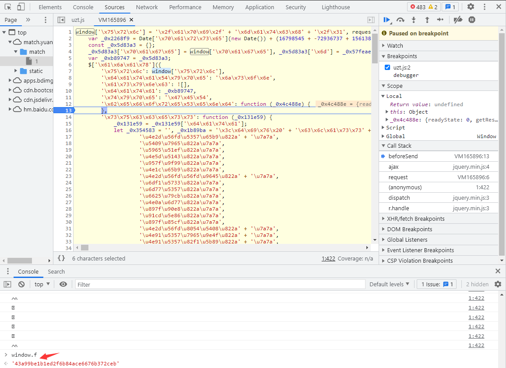
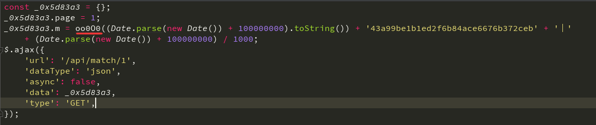

# JS混淆源码乱码

## 简介

猿人学是一个专注做爬虫和数据结构的卖课平台。猿人学第一届Web端爬虫攻防赛于2020年10月16日开始，总奖金3万，共设10题，主要涉及JS反混淆，CSS反加密，图文验证码对抗等技术。 参加该比赛，你能获得物质奖励，能结识一批志同道合的人，可能拿到更好的offer，欢迎你的参加。比赛已于2020年10月20日结束。

第一届Web端猿人学攻防大赛【官方网站】：https://match.yuanrenxue.com/

题目网址：http://match.yuanrenxue.com/match/1

题目难度：简单

## 逆向流程

### 抓包解析

开打题目后按f12，会出现setInterval函数，直接禁用断点，然后就可以继续执行了，f5刷新一下：


但为了后面打断点不受debugger影响，我们还需要在debugger这里打断点：


在蓝色断点位置，点击鼠标右键，选择Edit breakpoint：


输入属性false：


蓝色断点变黄：


定位到网页的数据来源：


查看请求头和请求参数，总体上没有什么特别，但有一个参数m是加密的，结合以往爬虫经验分析，整体形式就是 `m:加密参数丨时间戳`


### 逆向分析

接下就是定位加密参数的生成方式，点击左侧的Initiator选项，它主要是标记请求是由哪个对象或进程发起的（请求源），重点关注里面的request请求：


显示从一个名称为“VM73951”的文件的第6行代码发送了当前请求，点击后面的地址，跳转到了该文件的第6行：


**可以看到文件的内容不像之前那么直观了，代码进行了一定的混淆，提高了我们阅读代码的难度，其实有爬虫经验的一看，这个混淆很简单，其实就是将一部分字符进行了utf-8编码，另一部分字符进行了unicode编码。**

好在猿人学对这类简单的反混淆提供了反混淆工具（地址：http://tool.yuanrenxue.com/deobfuscator），我们可以将混淆内容直接粘贴过去进行反混淆，得到更加容易阅读的代码：


其实看着反混淆后的代码，当中的一些参数我们已经有了一定的眉目。将反混淆的代码格式化后，拷贝进我们的PyCharm里面，将代码进行折叠，可以看到两部分几乎一样的ajax请求代码：


我们只保留其中一部分进行分析，**ajax请求中有 `success`、`complete`、`error` 这三个字段，分别代表请求成功执行；不管是否成功请求都执行；请求不成功执行；**的含义：


**然而这三部分，我们都不需要关心，因为爬虫模拟的请求的参数和过程。**因此我们可以将这三部分干掉，这下看代码就清清爽爽了：


上面出现了Window对象，这里有必要讲一下：

- 所有浏览器都支持window对象。他表示浏览器窗口。
- 所有JavaScript全局对象、函数以及变量均自动成为window对象的成员。
- 全局变量是window对象的属性。
- 全局函数是window对象的方法。

**在这里window对象并未定义，但 `window.url = '/api/match/1'` 是一个赋值过程，可以将 `window.url` 替换为 `/api/match/1`；还有一个 `window.page` 根据经验就是访问的页码数，可以直接给一个定值；除此之外还有 `window.f` 是一个我们未知的具体值，这个值可以在浏览器调试中，对 `window.f` 定义赋值后将其在输出栏中打印出来**从而进行替换：



将整个代码优化替换后，得到了更加简化的样子，但其中还有一个 `oo0O0` 函数我们未知：



同样的放在浏览器调试中，对 `oo0O0`定义赋值后将其在输出栏中打印出来，可以看到结果函数内容，点击后跳转到 `1` 文件当中的该函数位置：


将 `oo0O0` 函数格式化后拷贝过来，


### 扣JS代码

```javascript

```

## 爬虫代码

扣取了完整的JS代码，接下来我们就可以写爬虫了，代码如下：

```python

```

