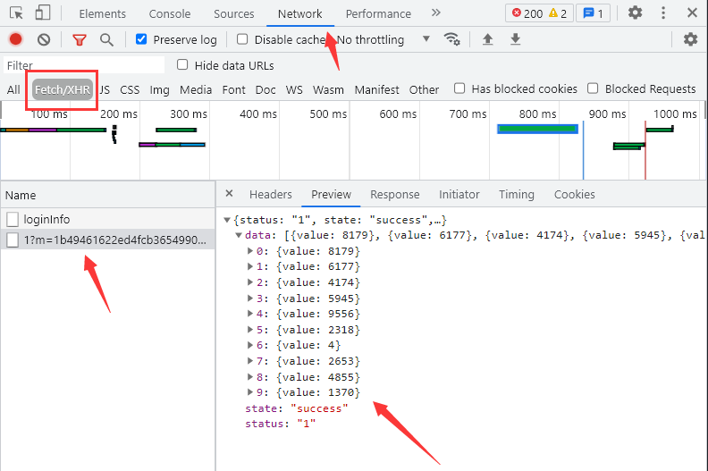
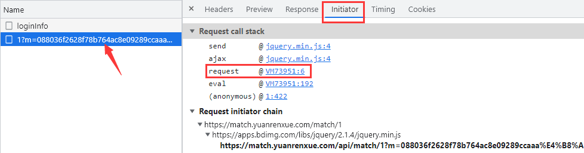

# JS混淆源码乱码

## 简介

猿人学是一个专注做爬虫和数据结构的卖课平台。猿人学第一届Web端爬虫攻防赛于2020年10月16日开始，总奖金3万，共设10题，主要涉及JS反混淆，CSS反加密，图文验证码对抗等技术。 参加该比赛，你能获得物质奖励，能结识一批志同道合的人，可能拿到更好的offer，欢迎你的参加。比赛已于2020年10月20日结束。

第一届Web端猿人学攻防大赛【官方网站】：https://match.yuanrenxue.com/

题目网址：http://match.yuanrenxue.com/match/1

题目难度：简单

## 逆向流程

### 抓包解析

开打题目后按f12，会出现setInterval函数，直接禁用断点，然后就可以继续执行了，f5刷新一下：


但为了后面打断点不受debugger影响，我们还需要在debugger这里打断点：


在蓝色断点位置，点击鼠标右键，选择Edit breakpoint：


输入属性false：


蓝色断点变黄：


定位到网页的数据来源：



查看请求头和请求参数，总体上没有什么特别，但有一个参数m是加密的，结合以往爬虫经验分析，整体形式就是 `m:加密参数丨时间戳`


### 逆向分析

接下就是定位加密参数的生成方式，点击左侧的Initiator选项，它主要是标记请求是由哪个对象或进程发起的（请求源），重点关注里面的request请求：



显示从一个名称为“VM73951”的文件的第6行代码发送了当前请求，点击后面的地址，跳转到了该文件的第6行：


**可以看到文件的内容不像之前那么直观了，代码进行了一定的混淆，提高了我们阅读代码的难度，其实有爬虫经验的一看，这个混淆很简单，其实就是将一部分字符进行了utf-8编码，另一部分字符进行了unicode编码。**

好在猿人学对这类简单的反混淆提供了反混淆工具（地址：http://tool.yuanrenxue.com/deobfuscator），我们可以将混淆内容直接粘贴过去进行反混淆，得到更加容易阅读的代码：


我们只摘取上面我们需要的部分代码，理解分析代码逻辑，对其中的步骤和名称进行进一步优化：


### 扣JS代码

```javascript

```

## 爬虫代码

扣取了完整的JS代码，接下来我们就可以写爬虫了，代码如下：

```python

```

