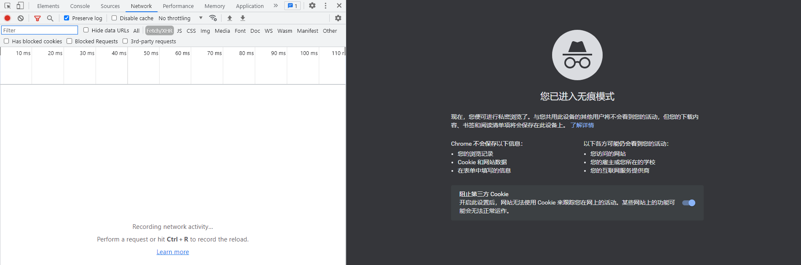

# 简单Cookie加密

## 简介

猿人学是一个专注做爬虫和数据结构的卖课平台。猿人学第一届Web端爬虫攻防赛于2020年10月16日开始，总奖金3万，共设10题，主要涉及JS反混淆，CSS反加密，图文验证码对抗等技术。 参加该比赛，你能获得物质奖励，能结识一批志同道合的人，可能拿到更好的offer，欢迎你的参加。比赛已于2020年10月20日结束。

第一届Web端猿人学攻防大赛【官方网站】：https://match.yuanrenxue.com/

网址：https://match.yuanrenxue.com/match/13

难度：非常简单

## 逆向流程

### 抓包解析

首先打开Fiddler抓包工具，开启抓包状态：


然后右键单击任务栏中的谷歌浏览器，点击“打开新的无痕窗口”，按F12打开“开发者工具”：



访问网址获取任务，在Network里面的Fetch/XHR选项中定位到了该网页数据的来源请求：


多次访问前面3页的页面，发现一个规律，如果访问之间的间隔时间稍微长一点，下次访问就要求强制访问loginfo页面，**说明该页面设置的Cookie的过期时间较短**，分析比较请求头参数，结合根据以往的爬虫经验，得出初步接结论：

```
sessionid参数：不同的请求，该值会发生变化。
Hm_lvt_c99546cf032aaa5a679230de9a95c7db参数：和时间戳有关的参数。
yuanrenxue_cookie：未知加密参数。
Hm_lpvt_c99546cf032aaa5a679230de9a95c7db参数：和时间戳有关的参数。
```


### 逆向分析

现在我们回到Fiddler抓包工具，看看所抓到的数据包：


**可以看到Fiddler抓到的数据包还是和开发者工具所抓到的数据包还是所有不同的，不同点在每次请求loginfo页面时，前面都会有两次请求，我们分别来看看两次请求分别返回了什么。**

第一次请求，在响应头返回一个出现在Cookie的参数sessionid：


并且在响应内容当中发现Cookie当中出现的未知加密参数yuanrenxue_cookie：


第二次请求，看里面的内容就是这道题所要使用的前端代码，分析作用不大。


这下就可以对加密参数完全得出结论了：

```
sessionid参数：由第一次请求，服务器返回在请求头当中。
Hm_lvt_c99546cf032aaa5a679230de9a95c7db参数：和时间戳有关的参数，估计不会验证此参数。
yuanrenxue_cookie：由第一次请求，服务器返回在内容当中的document.cookie里。
Hm_lpvt_c99546cf032aaa5a679230de9a95c7db参数：和时间戳有关的参数，估计不会验证此参数。
```

### 扣JS代码

这里就不用扣JS代码了，直接把第一次响应内容中的 `document.cookie` 扣出来就行了。

## 爬虫代码

```python
import re
import requests


# 请求头
headers = {
    'accept': 'application/json, text/javascript, */*; q=0.01',
    'accept-encoding': 'gzip, deflate, br',
    'accept-language': 'zh-CN,zh;q=0.9',
    'cookie': 'sessionid=登录后的sessionid',
    'user-agent': 'yuanrenxue.project',
    'x-requested-with': 'XMLHttpRequest'
}

# 第一次请求
first_res = requests.get('https://match.yuanrenxue.com/match/13', headers=headers, verify=False)
yrx_cookie = ''
for item in re.findall(r'\(\'(.*?)\'\)', first_res.text):
    yrx_cookie += item

# 更新请求头
headers.update({'cookie':f'{yrx_cookie};sessionid=登录后的sessionid'})

# 数值
values = 0

# 共5页数据
for page in range(1, 6):
    # 接口地址
    url = f'https://match.yuanrenxue.com/api/match/13?page={page}'
    # 输出响应
    response = requests.get(url=url, headers=headers, verify=False)
    print(f'第{page}页:{response.text}')
    for v in re.findall(r'{"value": (-?\d+)}', response.text):
        values += int(v)

# 总值
print(values)
```

