# 简单参数加密


猿人学是一个专注做爬虫和数据结构的卖课平台。猿人学第一届Web端爬虫攻防赛于2020年10月16日开始，总奖金3万，共设10题，主要涉及JS反混淆，CSS反加密，图文验证码对抗等技术。 参加该比赛，你能获得物质奖励，能结识一批志同道合的人，可能拿到更好的offer，欢迎你的参加。比赛已于2020年10月20日结束。

## 简单GET参数加密

第一届Web端猿人学攻防大赛【官方网站】：https://match.yuanrenxue.com/

网址：https://match.yuanrenxue.com/match/12

难度：非常简单

### 逆向流程

#### 抓包解析

首先右键单击任务栏中的谷歌浏览器，点击“打开新的无痕窗口”，按F12打开“开发者工具”：


访问网址获取任务，在Network里面的Fetch/XHR选项中定位到了该网页数据的来源请求：


访问前面3页，分析前3页请求头参数后，得出初步接结论：**page参数就是页码，m参数是加密参数**


#### 逆向分析

现在我们需要定位到，哪一行的代码发送了当前的请求，点击左侧的Initiator选项，它主要是标记请求是由哪个对象或进程发起的（请求源），重点关注里面的request请求：


显示从一个名称为“12”的文件的第723行代码发送了当前请求，点击后面的地址，跳转到了该文件的第723行，看上面有两个很熟悉的参数page和m，再看后面跟的值，一切豁然开朗：


这下就可以对加密参数完全得出结论了：

```
page的参数值为window.page，即页码。
m的参数值为'yuanrenxue'+页码，再通过btoa()方法转为Base64编码。
```

#### 扣JS代码

虽然Python当中有现成的库，可以将字符串转为Base64编码，但这里为了练习和提升我们的JS能力，我们需要自己通过JS脚本来实现此功能。

**这里需要注意一点的是，`btoa()` 方法之所以能在浏览器使用，是因为已经加载关于该方法的源码，但源码的位置并不在上面的“12”文件中，因此我们代码中要使用 `btoa()` 方法就必须要获取该方法的源码，可自行百度得到。**

```javascript
var base64hash = 'ABCDEFGHIJKLMNOPQRSTUVWXYZabcdefghijklmnopqrstuvwxyz0123456789+/';

// btoa方法源码
btoa = function (s) {
        if (/([^\u0000-\u00ff])/.test(s)) {
            throw new Error('INVALID_CHARACTER_ERR');
        }
        var i = 0,
            prev,
            ascii,
            mod,
            result = [];

        while (i < s.length) {
            ascii = s.charCodeAt(i);
            mod = i % 3;

            switch(mod) {
                case 0:
                    result.push(base64hash.charAt(ascii >> 2));
                    break;
                case 1:
                    result.push(base64hash.charAt((prev & 3) << 4 | (ascii >> 4)));
                    break;
                case 2:
                    result.push(base64hash.charAt((prev & 0x0f) << 2 | (ascii >> 6)));
                    result.push(base64hash.charAt(ascii & 0x3f));
                    break;
            }

            prev = ascii;
            i ++;
        }

        if(mod == 0) {
            result.push(base64hash.charAt((prev & 3) << 4));
            result.push('==');
        } else if (mod == 1) {
            result.push(base64hash.charAt((prev & 0x0f) << 2));
            result.push('=');
        }

        return result.join('');
    };
```

### 爬虫代码

```python
#!/usr/bin/env python
#-*- coding:utf-8 -*-
# @Time    : 2021/9/27 1:23
# @Author  : chenzhuo
import re
import execjs
import requests

# 打开JS文件并加载JS文件
with open("上面的js文件名称.js", 'r', encoding = 'utf-8') as f:
    content = f.read()
JsObj = execjs.compile(content)

# 请求头
headers = {
    'accept': 'application/json, text/javascript, */*; q=0.01',
    'accept-encoding': 'gzip, deflate, br',
    'accept-language': 'zh-CN,zh;q=0.9',
    'cookie': '温馨提示：如果您已登录，那么每个人看到的答案都是不一样的，发送请求时请传入cookie中 sessionID参数，否则返回的答案将不是您自己的数据',
    'referer': 'https://match.yuanrenxue.com/match/12',
    'sec-ch-ua': '"Google Chrome";v="93", " Not;A Brand";v="99", "Chromium";v="93"',
    'sec-ch-ua-mobile': '?0',
    'sec-ch-ua-platform': '"Windows"',
    'sec-fetch-dest': 'empty',
    'sec-fetch-mode': 'cors',
    'sec-fetch-site': 'same-origin',
    'user-agent': 'yuanrenxue.project',
    'x-requested-with': 'XMLHttpRequest'
}

# 数值
values = 0

# 共5页数据
for page in range(1, 6):
    # 加密参数m
    m = JsObj.call('btoa', f"yuanrenxue{page}"),  # 调用js方法，第一个参数是JS的方法名，后面则是js方法的参数
    # 接口地址
    url = f'https://match.yuanrenxue.com/api/match/12?page={page}&m={m}'
    # 输出响应
    response = requests.get(url=url, headers=headers, verify=False)
    print(f'第{page}页:{response.text}')
    # 提示：会有负数存在
    for v in re.findall(r'{"value": (-?\d+)}', response.text):
        values += int(v)

# 总值
print(values)
```

## 简单请求头加密

这道题是猿人学内部题目，没有会员也是进不去的，就不提供网址了，只分享解题流程。

题目难度：非常简单

### 逆向流程

#### 抓包解析

首先打开Fiddler抓包工具，开启抓包状态，选择抓取经过浏览器的数据包：


然后右键单击任务栏中的谷歌浏览器，点击“打开新的无痕窗口”，按F12打开“开发者工具”：


访问题目获取题目信息后，往后翻2页：

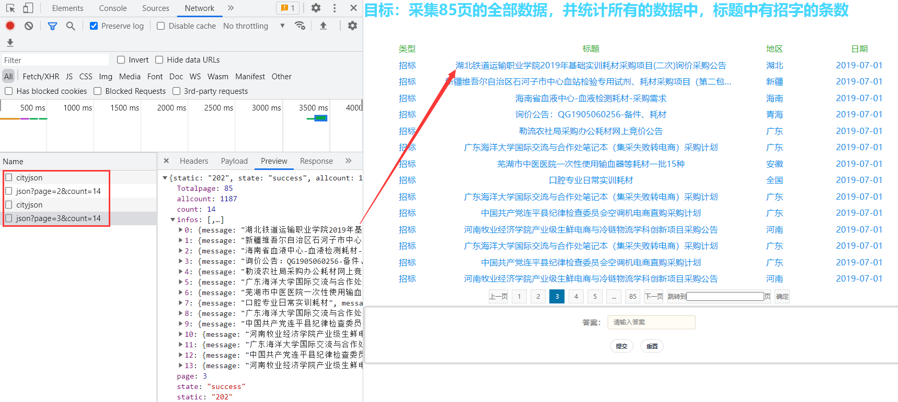

查看Fiddler的抓包，一模一样：

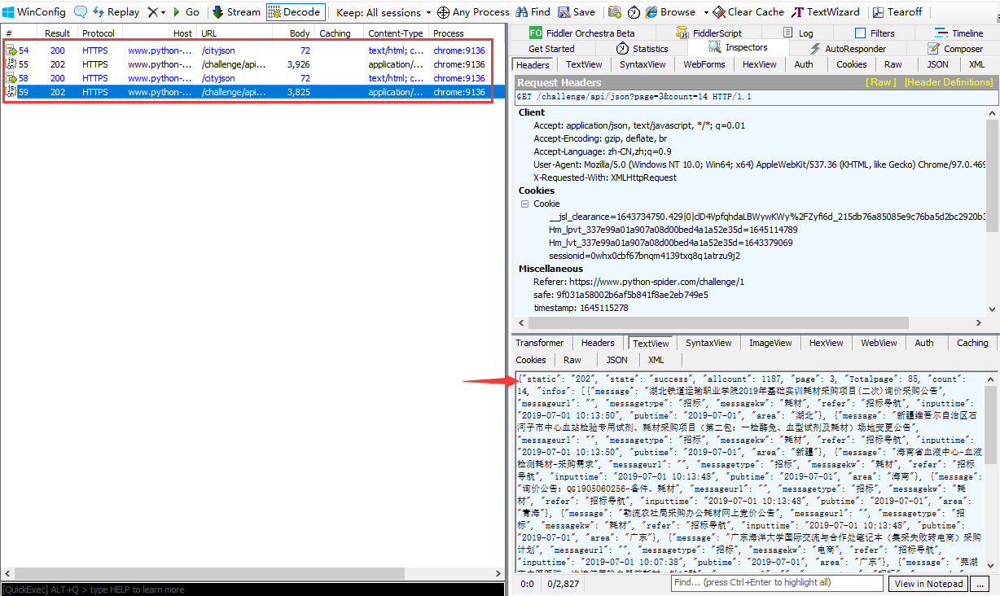

接下来，我们只选中 `/challenge/api` 进行3次重放攻击，发现均失败，而且即使和 `/cityjson` 一起重放攻击，也是失败：

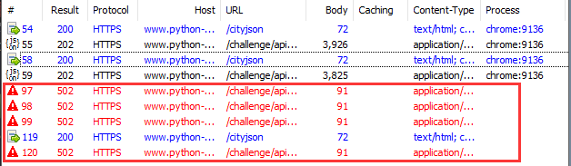

**说明在这期间，请求头中某个参数已经失效，导致重放攻击失败。**现在，我们再往后翻一页，点击URL，对比前后请求参数的变化：

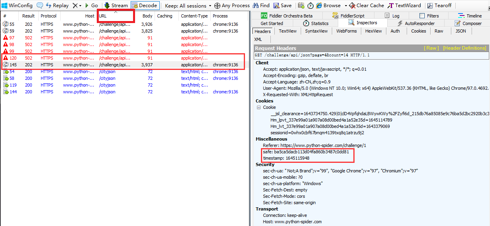

**通过比对发现 `safe`、`timestamp` 两个参数，`safe` 参数的值来源未知，但 `timestamp` 参数的值稍微有点爬虫经验的人都会联想到和时间戳相关。**

#### 逆向分析

现在我们要寻找 `safe`、`timestamp` 两个参数值得来源。回到Chrome浏览器中，现在我们需要定位到哪一行的代码发送了当前的请求，点击左侧的Initiator选项，它主要是标记请求是由哪个对象或进程发起的（请求源），重点关注里面的call调用：

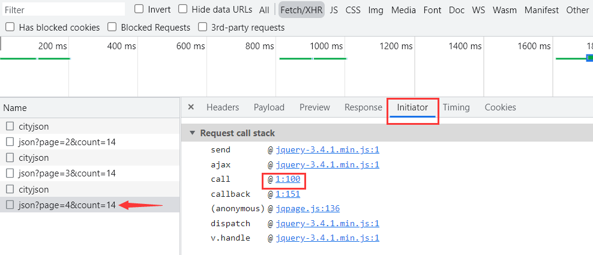

点击后面的 `@1:100` 就跳转到了名称为1的文件，代码行数在100行的位置。可以看到在这里发送了一个ajax请求，而且在发送请求之前也就是 `beforeSend` 里面，有 `request.setRequestHeader` 操作即设置请求头的操作，而且就有我们想要的 `safe`、`timestamp` 两个参数：

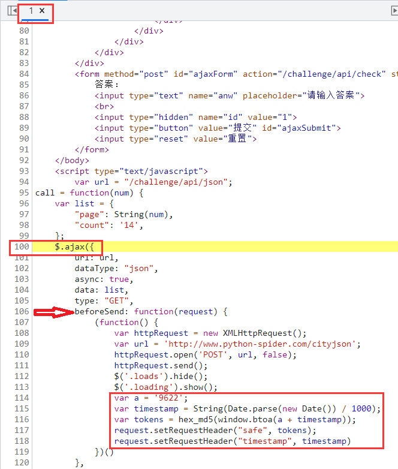

#### 扣JS代码

观察代码，发现 `safe` 参数的值就是 `tokens`，`timestamp` 参数的值就是时间戳除1000后的字符串。将上面代码整理如下：

```javascript
var timestamp = String(Date.parse(new Date()) / 1000);
var safe = hex_md5(window.btoa('9622' + timestamp));
```

**这里 `window.btoa` 方法其实就是上面一道题中的 `btoa` 方法，两者是等价的，可以沿用上面的 `btoa` 方法代码，在浏览器中因为window是底层的对象，有些时候可以省略不写：**

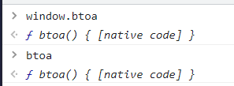

但还有一个 `hex_md5` 我们就需要打断跟踪了，发现该方法的来源于 `md5.js` 中的第25行：

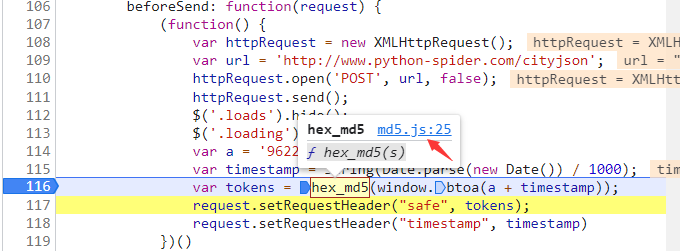

我们点击进入，但里面又有 `binl2hex`、`core_md5`、`str2binl` 三个方法代码未知：

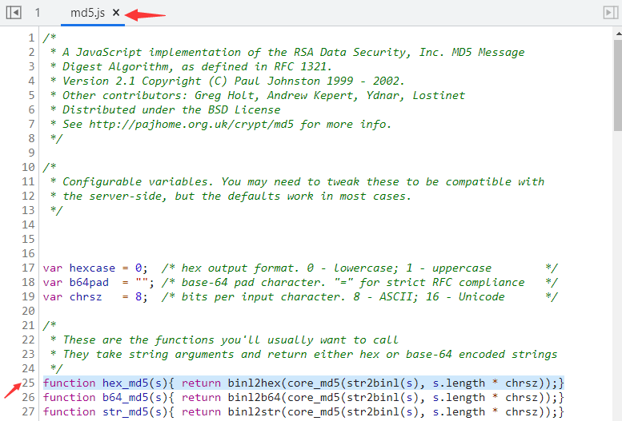

又按上面的方法继续调试，依次找了 `binl2hex`、`core_md5`、`str2binl` 三个函数的代码：

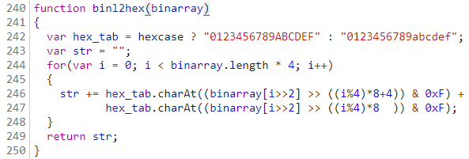

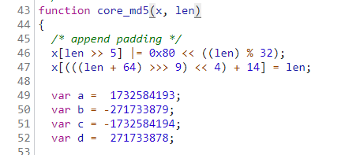

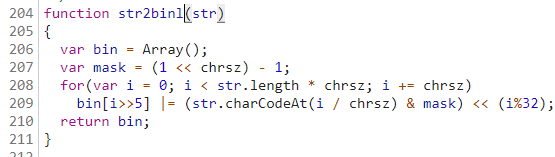

最终整个扣出来的JS代码如下：

```javascript
var base64hash = 'ABCDEFGHIJKLMNOPQRSTUVWXYZabcdefghijklmnopqrstuvwxyz0123456789+/';

// btoa方法源码
btoa = function (s) {
        if (/([^\u0000-\u00ff])/.test(s)) {
            throw new Error('INVALID_CHARACTER_ERR');
        }
        var i = 0,
            prev,
            ascii,
            mod,
            result = [];

        while (i < s.length) {
            ascii = s.charCodeAt(i);
            mod = i % 3;

            switch(mod) {
                case 0:
                    result.push(base64hash.charAt(ascii >> 2));
                    break;
                case 1:
                    result.push(base64hash.charAt((prev & 3) << 4 | (ascii >> 4)));
                    break;
                case 2:
                    result.push(base64hash.charAt((prev & 0x0f) << 2 | (ascii >> 6)));
                    result.push(base64hash.charAt(ascii & 0x3f));
                    break;
            }

            prev = ascii;
            i ++;
        }

        if(mod == 0) {
            result.push(base64hash.charAt((prev & 3) << 4));
            result.push('==');
        } else if (mod == 1) {
            result.push(base64hash.charAt((prev & 0x0f) << 2));
            result.push('=');
        }

        return result.join('');
    };

function binl2hex(binarray)
{
  var hex_tab = hexcase ? "0123456789ABCDEF" : "0123456789abcdef";
  var str = "";
  for(var i = 0; i < binarray.length * 4; i++)
  {
    str += hex_tab.charAt((binarray[i>>2] >> ((i%4)*8+4)) & 0xF) +
           hex_tab.charAt((binarray[i>>2] >> ((i%4)*8  )) & 0xF);
  }
  return str;
}

function core_md5(x, len)
{
  /* append padding */
  x[len >> 5] |= 0x80 << ((len) % 32);
  x[(((len + 64) >>> 9) << 4) + 14] = len;

  var a =  1732584193;
  var b = -271733879;
  var c = -1732584194;
  var d =  271733878;

  for(var i = 0; i < x.length; i += 16)
  {
    var olda = a;
    var oldb = b;
    var oldc = c;
    var oldd = d;

    a = md5_ff(a, b, c, d, x[i+ 0], 7 , -680876936);
    d = md5_ff(d, a, b, c, x[i+ 1], 12, -389564586);
    c = md5_ff(c, d, a, b, x[i+ 2], 17,  606105819);
    b = md5_ff(b, c, d, a, x[i+ 3], 22, -1044525330);
    a = md5_ff(a, b, c, d, x[i+ 4], 7 , -176418897);
    d = md5_ff(d, a, b, c, x[i+ 5], 12,  1200080426);
    c = md5_ff(c, d, a, b, x[i+ 6], 17, -1473231341);
    b = md5_ff(b, c, d, a, x[i+ 7], 22, -45705983);
    a = md5_ff(a, b, c, d, x[i+ 8], 7 ,  1770035416);
    d = md5_ff(d, a, b, c, x[i+ 9], 12, -1958414417);
    c = md5_ff(c, d, a, b, x[i+10], 17, -42063);
    b = md5_ff(b, c, d, a, x[i+11], 22, -1990404162);
    a = md5_ff(a, b, c, d, x[i+12], 7 ,  1804603682);
    d = md5_ff(d, a, b, c, x[i+13], 12, -40341101);
    c = md5_ff(c, d, a, b, x[i+14], 17, -1502002290);
    b = md5_ff(b, c, d, a, x[i+15], 22,  1236535329);

    a = md5_gg(a, b, c, d, x[i+ 1], 5 , -165796510);
    d = md5_gg(d, a, b, c, x[i+ 6], 9 , -1069501632);
    c = md5_gg(c, d, a, b, x[i+11], 14,  643717713);
    b = md5_gg(b, c, d, a, x[i+ 0], 20, -373897302);
    a = md5_gg(a, b, c, d, x[i+ 5], 5 , -701558691);
    d = md5_gg(d, a, b, c, x[i+10], 9 ,  38016083);
    c = md5_gg(c, d, a, b, x[i+15], 14, -660478335);
    b = md5_gg(b, c, d, a, x[i+ 4], 20, -405537848);
    a = md5_gg(a, b, c, d, x[i+ 9], 5 ,  568446438);
    d = md5_gg(d, a, b, c, x[i+14], 9 , -1019803690);
    c = md5_gg(c, d, a, b, x[i+ 3], 14, -187363961);
    b = md5_gg(b, c, d, a, x[i+ 8], 20,  1163531501);
    a = md5_gg(a, b, c, d, x[i+13], 5 , -1444681467);
    d = md5_gg(d, a, b, c, x[i+ 2], 9 , -51403784);
    c = md5_gg(c, d, a, b, x[i+ 7], 14,  1735328473);
    b = md5_gg(b, c, d, a, x[i+12], 20, -1926607734);

    a = md5_hh(a, b, c, d, x[i+ 5], 4 , -378558);
    d = md5_hh(d, a, b, c, x[i+ 8], 11, -2022574463);
    c = md5_hh(c, d, a, b, x[i+11], 16,  1839030562);
    b = md5_hh(b, c, d, a, x[i+14], 23, -35309556);
    a = md5_hh(a, b, c, d, x[i+ 1], 4 , -1530992060);
    d = md5_hh(d, a, b, c, x[i+ 4], 11,  1272893353);
    c = md5_hh(c, d, a, b, x[i+ 7], 16, -155497632);
    b = md5_hh(b, c, d, a, x[i+10], 23, -1094730640);
    a = md5_hh(a, b, c, d, x[i+13], 4 ,  681279174);
    d = md5_hh(d, a, b, c, x[i+ 0], 11, -358537222);
    c = md5_hh(c, d, a, b, x[i+ 3], 16, -722521979);
    b = md5_hh(b, c, d, a, x[i+ 6], 23,  76029189);
    a = md5_hh(a, b, c, d, x[i+ 9], 4 , -640364487);
    d = md5_hh(d, a, b, c, x[i+12], 11, -421815835);
    c = md5_hh(c, d, a, b, x[i+15], 16,  530742520);
    b = md5_hh(b, c, d, a, x[i+ 2], 23, -995338651);

    a = md5_ii(a, b, c, d, x[i+ 0], 6 , -198630844);
    d = md5_ii(d, a, b, c, x[i+ 7], 10,  1126891415);
    c = md5_ii(c, d, a, b, x[i+14], 15, -1416354905);
    b = md5_ii(b, c, d, a, x[i+ 5], 21, -57434055);
    a = md5_ii(a, b, c, d, x[i+12], 6 ,  1700485571);
    d = md5_ii(d, a, b, c, x[i+ 3], 10, -1894986606);
    c = md5_ii(c, d, a, b, x[i+10], 15, -1051523);
    b = md5_ii(b, c, d, a, x[i+ 1], 21, -2054922799);
    a = md5_ii(a, b, c, d, x[i+ 8], 6 ,  1873313359);
    d = md5_ii(d, a, b, c, x[i+15], 10, -30611744);
    c = md5_ii(c, d, a, b, x[i+ 6], 15, -1560198380);
    b = md5_ii(b, c, d, a, x[i+13], 21,  1309151649);
    a = md5_ii(a, b, c, d, x[i+ 4], 6 , -145523070);
    d = md5_ii(d, a, b, c, x[i+11], 10, -1120210379);
    c = md5_ii(c, d, a, b, x[i+ 2], 15,  718787259);
    b = md5_ii(b, c, d, a, x[i+ 9], 21, -343485551);

    a = safe_add(a, olda);
    b = safe_add(b, oldb);
    c = safe_add(c, oldc);
    d = safe_add(d, oldd);
  }
  return Array(a, b, c, d);

}

function str2binl(str)
{
  var bin = Array();
  var mask = (1 << chrsz) - 1;
  for(var i = 0; i < str.length * chrsz; i += chrsz)
    bin[i>>5] |= (str.charCodeAt(i / chrsz) & mask) << (i%32);
  return bin;
}

function hex_md5(s){ return binl2hex(core_md5(str2binl(s), s.length * chrsz));}

// 自定义一个函数返回safe、timestamp的值
function header_value(){
    var timestamp = String(Date.parse(new Date()) / 1000);
    var safe = hex_md5(window.btoa('9622' + timestamp));
    return timestamp, safe
}
```

### 爬虫代码

```python
import requests

# 建立一个会话
session = requests.session()
# 忽略警告
requests.packages.urllib3.disable_warnings()

def conversion(head):
    items = [item.split(': ') for item in head.split('\n')]
    header = {}
    for item in items:
        header.update({item[0]: item[1]})
    return header

'''
第10题
'''
page_header = '''Host: www.python-spider.com
Connection: keep-alive
Content-Length: 6
sec-ch-ua: " Not;A Brand";v="99", "Google Chrome";v="97", "Chromium";v="97"
Accept: application/json, text/javascript, */*; q=0.01
Content-Type: application/x-www-form-urlencoded; charset=UTF-8
X-Requested-With: XMLHttpRequest
sec-ch-ua-mobile: ?0
User-Agent: Mozilla/5.0 (Windows NT 10.0; Win64; x64) AppleWebKit/537.36 (KHTML, like Gecko) Chrome/97.0.4692.71 Safari/537.36
sec-ch-ua-platform: "Windows"
Origin: https://www.python-spider.com
Sec-Fetch-Site: same-origin
Sec-Fetch-Mode: cors
Sec-Fetch-Dest: empty
Referer: https://www.python-spider.com/challenge/10
Accept-Encoding: gzip, deflate, br
Accept-Language: zh-CN,zh;q=0.9
Cookie: Hm_lvt_337e99a01a907a08d00bed4a1a52e35d=1641312032,1643379069; sessionid=6ove5d44afx58bweu7dd0hx8lozueelh; Hm_lpvt_337e99a01a907a08d00bed4a1a52e35d=1643623928'''

# 总和
sum_numbers = 0

# python特性爬虫请求头的顺序会被打乱，需要固定顺序就必须按如下写法
session.headers = conversion(page_header)

# 100页数据
for page in range(1, 101):
    data = {'page':page}
    page_url = 'https://www.python-spider.com/api/challenge10'
    response = session.post(url=page_url, data=data, verify=False).json()
    values = [value.get('value').replace('\r', '') for value in response.get('data')]
    print(f'第{page}页的数据：{values}')
    for value in values:
        sum_numbers += int(value)
print(sum_numbers)
```
