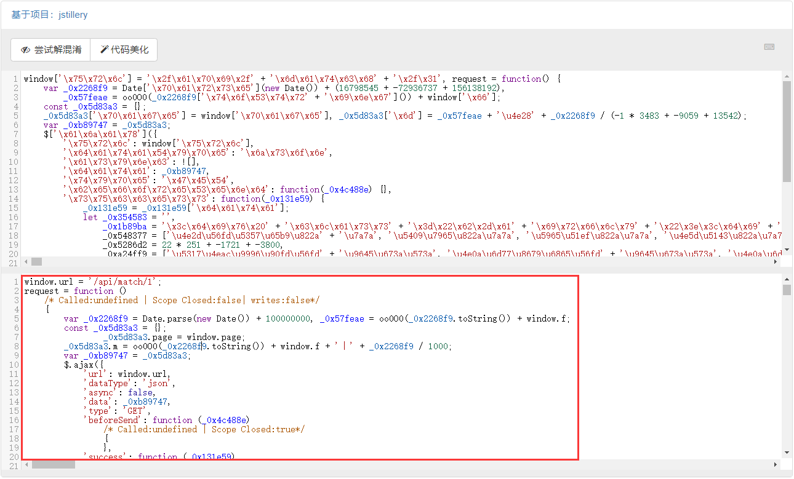

# JS混淆源码乱码

## 简介

猿人学是一个专注做爬虫和数据结构的卖课平台。猿人学第一届Web端爬虫攻防赛于2020年10月16日开始，总奖金3万，共设10题，主要涉及JS反混淆，CSS反加密，图文验证码对抗等技术。 参加该比赛，你能获得物质奖励，能结识一批志同道合的人，可能拿到更好的offer，欢迎你的参加。比赛已于2020年10月20日结束。

第一届Web端猿人学攻防大赛【官方网站】：https://match.yuanrenxue.com/

题目网址：http://match.yuanrenxue.com/match/1

题目难度：简单

## 逆向流程

### 抓包解析

开打题目后按f12，会出现setInterval函数，直接禁用断点，然后就可以继续执行了，f5刷新一下：


但为了后面打断点不受debugger影响，我们还需要在debugger这里打断点：


在蓝色断点位置，点击鼠标右键，选择Edit breakpoint：


输入属性false：


蓝色断点变黄：


定位到网页的数据来源：


查看请求头和请求参数，总体上没有什么特别，但有一个参数m是加密的，结合以往爬虫经验分析，整体形式就是 `m:加密参数丨时间戳`


### 逆向分析

接下就是定位加密参数的生成方式，点击左侧的Initiator选项，它主要是标记请求是由哪个对象或进程发起的（请求源），重点关注里面的request请求：


显示从一个名称为“VM73951”的文件的第6行代码发送了当前请求，点击后面的地址，跳转到了该文件的第6行：


**可以看到文件的内容不像之前那么直观了，代码进行了一定的混淆，提高了我们阅读代码的难度，其实有爬虫经验的一看，这个混淆很简单，其实就是将一部分字符进行了utf-8编码，另一部分字符进行了unicode编码。**

好在猿人学对这类简单的反混淆提供了反混淆工具（地址：http://tool.yuanrenxue.com/deobfuscator），我们可以将混淆内容直接粘贴过去进行反混淆，得到更加容易阅读的代码：



其实看着反混淆后的代码，当中的一些参数我们已经有了一定的眉目。将反混淆的代码格式化后，拷贝进我们的PyCharm里面，将代码进行折叠，可以看到两部分几乎一样的ajax请求代码：


我们只保留其中一部分进行分析，**ajax请求中有 `success`、`complete`、`error` 这三个字段，分别代表请求成功执行；不管是否成功请求都执行；请求不成功执行；**的含义：


**然而这三部分，我们都不需要关心，因为爬虫模拟的请求的参数和过程。**因此我们可以将这三部分干掉，这下看代码就清清爽爽了：


上面出现了Window对象，这里有必要讲一下：

- 所有浏览器都支持window对象。他表示浏览器窗口。
- 所有JavaScript全局对象、函数以及变量均自动成为window对象的成员。
- 全局变量是window对象的属性。
- 全局函数是window对象的方法。

**在这里window对象并未定义，但 `window.url = '/api/match/1'` 是一个赋值过程，可以将 `window.url` 替换为 `/api/match/1`；还有一个 `window.page` 根据经验就是访问的页码数，可以暂时给个定值；除此之外还有 `window.f` 是一个我们未知的变量，经过全局搜索以后未发现给该变量赋值，可能在我们未找的地方进行的赋值，就暂时先不管。**将整个代码优化替换后，得到了更加简化的样子，但其中还有一个 `oo0O0` 函数我们未知：


同样的放在浏览器调试中，对 `oo0O0`定义赋值后将其在输出栏中打印出来，可以看到结果函数内容，点击后跳转到 `1` 文件当中的该函数位置：


将 `oo0O0` 函数格式化后拷贝出来，还是按照上面的步骤，该打印的打印，该替换的替换，我们不用关注函数内部实现了怎样的功能，但在函数的最后给出了我们想要的东西：


**在 `oo0O0` 函数最后返回了空，也就是上面 `oo0O0(_0x2268f9.toString())` 的值为空，主要就是 `window.f` 这个值，但这个值又是在 `oo0O0` 函数所定义，且受到时间戳的影响。**分析到这里，我们就可以做最后一波优化了：


### 扣JS代码

其实上面分析的过程，js代码都扣的差不多了，这里就是添加特定的函数把需要参数的进行返回：

```javascript
e = 'fromC';
f = 'charCo';
g = 'harCode';
h = 'deAt';
a = 'isM\x81RQsxrU]xtDhMbZ\x8BJrrd\x83v\x88xP\x84ii\x8Fuyp\x91x]\x85\x94\x90\x97q\x9A\x92z}®\x9A g°\x87¤¯©¡\x95tª¥\x89¯º§¯\x89·£¢³²¯¥ \x81\x9C\x99\x98ĺ\x89¡Ä½¢±Õ¿Ç¡É¹\x98ײÓÏÔέÓÖÏ¡¹Üɤ¤ßÃÉßòÝÂÄõÖëëõãÅëìÐÙÿðÕ÷ăøïûóÀòÕăþöÞáĒþăĆČăõùÑăďñÔĆýàĝòñôÞûôèĤċöĈģĎĉģïĜħđìġĖĉĵĊĉčĴħijľŁĢĴĤüĘĕĝņĴĿĩĺķĭĨĉĤĢĩČŀňĩʼnłĹĘŗİĭĬŘĵıİšŏĵŅťŋĥŅţŀţŅŧŜŨʼnIJňőūĹśŰřŹŞĹřŸūļĿųŰŁšƉũńńſţũſƀŤŲƏƕŷŶűőƄƏŗƋžƓƓƝƋŮŵƦƑŶŸƟƊŤŬƭƏƌŰƬƓžƐƫƠűƑƹƎƯƍƴƧƳƾƷƢƝƶƿƦơƄǃƫƩƈǂƹƝƾljƲƌǃǕǀƑǎǐƬƺƔǑljƽƜǒǍƱǗǢǏǗƱǟNjNJǛǚǖƽƨǠǒƫƴǰǗǂǔǯǚǕǻǭǐǞǻȁǣǢǝƽǰǻǃǷǪǿǿȉǷǚǡȇdzDzȂȋǶǐǘșǻǸǜȓȇǽǭȒȁǜǜȗǻȁȗȘǽǹǼȤȀȎǨȥȝȑǰȦȡȅȫȶȣȫȅȭȓȰșȮȪȑǼȴȦǿȈɄȫȖȨɃȮȩɏɁȤȲɏɕȷȶȱȑɄɏȗɋȾɓɓɝɋȮȵɕȻɘɀɟɊȤȬɭɏɌȰɧɛɑɁɦɕȰȰɫɏɕɫɬɑɍɐɸɔɢȼɹɱɥɄɺɵəɿʊɷɿəʒɽɢɥʂɾɥɐʈɺɓɜʘɿɪɼʗʂɽʣʕɸʆʣʩʋʊʅɥʘʣɫʟʒʧʧʱʟʂʉʺʥʊʌʳʞɸʀˁʣʠʄʻʯʥʕʺʩʄʄʿʣʩʿˀʥʡʤˌʨʶʐˍ˅ʹʘˎˉʭ˓˞ˋ˓ʭˠˇʲ˅˖˕˟ʤ˚˙ʽˍ˲˝ʽˢˬˢʱˉˬ˥ˊ˙˽˧˯ˉ˷ˣˢ˳˲˯˥ˠˁ˜˕˝˼ˮ̃ˤ́ˤˮˋ˕˦̗̈̊ˮ˦˨˕˲˪̒˜˶˜˹̗˺̘̝̜́̊˵̢̟̠̃˪̆ˬ̔˯̗̂̈˴̛̖̈˷̸̟̰̪́̒˼̵̷̵̵̛̹̱̥̺̙̙̻̥͈̯̱̭͚͎̝̭͎͎̣͈̤̬̼̄̿͊̿͂̍̐̐͋͋͛ͨ̿͊͘ͅͱ͈̾Ͳ̴͈́ͧͲ͕͌͘;͒ͯͲ̿ͬ͐;ͻ͑͘ͷ΂͜Όͬ̈́ͪ͋̓ͩ͠΄ΆΌͭ͢Ζ͐ͬ͵ΖΜͳͬ͗͡ΊΤΟ͞ΆΆ͸ΗΓάͣά΃ΰ΄α·Ύ΢ͬΊΒΪκΐ͵ΝάΨίΉνΙΝͻυΛψΔ΃ΞόΠΈΣϐςΏνχΡϕΦΥΏΙέζΨΗβϠΰΙθήμϤμςπΧϕϟιϭξνϮαφϤϞϴϋϸόϺϐφϦθϔθϡϾϬϳϳξϦϦϘϷϫЌσЋϤψϺϐϼϝϐЏϷϵϔЎЅϩЊϛϿПКϡ϶ϾЄМВϡЉИДЛϵХЅЍϯϯНЧЁеІЅЦϹУЬз϶ООАЯУдϼрМЁЩидлЕрХЭюЏлєЌѐзТецлямѓчџџѝебЛџябѧѧшФіѦтмЧѫчѳѲѰыѨѦѷѐіѦжєњєкєўѿѿѝѥрѻџѨьҁѯѿѿҋѥѡѓҏѿ҇җҔѭѪѥ҆ѿҟҚҠҁѽҢҤѺҗҦҤѾҬҚѩ҃ҊҐѨ҇ҎҢѮ҈ҒҳҴґҙѴүғҜҀҵңҳҳӀҙҕӆӃҳӋӋӉҡҞҙҺҳӓӎӕҵұӖӘүӛӚҖҲҪӀӠҶҮӀҠҺӂӚӠӀҤҧҭӗӍӈҩӑҬӕөӈӅҳӳӣӕӻӷӑӍҿӻӬӐӿӺӘԈӝӴӝӖӜԍӡәӇԐӦӞӬӌӫӲӨӑӮԜӰԛӰӺԛԞӹԁӜԗӻԄӨԝԋԛԛԪԁӽӫԫԛԍԳԯԉԆԁԢԛԻԶӴԝԙԾӻԕԍӻՄԛՈԨԀԞԦԺԈԤԪԺՈԨԌՒԕԿԵ԰ԑԹԔԽՑ԰ԭ՞՛ՋգգաԹԵԟգՔԸէբՀհՍ՜ՅԾՀյՉՂՄչՎՆՄջՔՊՈԸՖմդռ՜ՀԿՉճթդՅխՈձօդաՋ֏տա֖֗խթ՗֗ֈլ֛֖մ֤օ֐չղմգսյգ֬փպֲ֚ֆ֤ֈִ֊ָ֐ָ֌ַֹ֖֕֝ոֳ֗֠քַַֹ֧ׅ֝֙փַׇ֙׏׎֥֢֝־ַחגֵֹ֓ךםֲ׏מלַ֮׀ֲֺ֥֟ׄ׀ֶ׀פֱׄ֨֯כב׌֭וְי׭׌׉ֻ׷קׯ׿׼וב؂׿װה؃׾ל،׻׸סך׺؋צ׮׾׏תענؚׯ׶״؜׳؏ؒן؋׮לؠ؇ײ؅ؖ؋؟،أؗ׹دخ؅؁ׯد؟ؑططؘ״ئضؔ؜׷ػؖ؞ؔؿؙآؔ؅؟ئغ؄آتب؈ئخؾٌجؐ؏ؙكعشؕؽؘفٕشر؛ُٟر٧٦ؽعا٧٘ؼ٫٦لٴـٳّٕٶٸُٻٺٸٓيِٿٗٴ٘ټٜـكىٳ٩٤م٭وٱڅ٤١ُڏٿٱڗړ٭٩ٛڗڈ٬ڛږٴڤٰڤڅځڦکپڛڪڨڂڊڢ٭چپڌڳڋڂڄٲڎګڮٻڧۀٸڼڣڎڡڲڧڻڨڿڳۋۋۉڡڝڇۋڻڝۓۓڴڐۂےڮڶڭۈڱڪۊۛڶھےۣڻڲۈڢھڶیڨۂ۟ۢگۛھڬ۰ۗۂەۦۛۯۜ۳ۧۉۿ۾ەۑڿۿۯۡ܇܇ۨۄ۶܆۪ۢۥۼۥ۞۠ܕ۩ۡۏېۮۦ۰۔۲ۺ۬ܟ۶۽ܖۣ܏܂۠ܤ܋۶܉ܚ܏ܣܐܧܛ܍ܳܯ܉܅۷ܳܣܫܻܻܜ۸ܪܺܖܞܝܰܙܒܔ܃ܝܕ܃݌ܣܪܘݑܦܞܜݕܪ݈݊ݗܬܶݗݙܵܽܘݓܷ݀ܤݙ݇ݗݗݥܹܽܣݧݗܹݯݮ݂݅ܽݞݗݷݲݸݏݘܳݷݒݰݐݻݖݞݔކݛݸݤފݟݦݠލݤݩނݏݻޔ݌ސݷݢݵކݻݔކޓއޟޟޝݵݱݛޟޏݱާާވݤޖަނތݧޫއލ޲ްފޒޘݱޏ޼ޮݶޓޚތ޿ޔޞ޿޿ޝޥހ޻ޟިތ߂ޯߏ޿ߋޥޡޓߏ޿߇ߗߔޭުޥ߆޿ߟߚޚ߁޽ߢޡ޹ޱޟߨ޾޶ߌީ߃ߊ޸߰߇ߤ߈ߵ߈ߒ߳ߴߑߙ޴߯ߓߜ߀߶ߣࠃ߳ࠀߙߕࠆࠃ߳ࠋࠋࠉߡߞߙߺ߳ࠓࠎࠔߪߴߏࠓ߮߶ߴࠗ߳ࠐ߸ࠢ߷ࠤ߰ߟ߻ࠨߴࠪ߼ࠆࠧࠩࠅࠍߨࠣࠇࠐߴࠪࠗ࠷ࠧ࠵ࠍࠉ߳࠷ࠧࠉ࠿࠾ࠕࠒࠍ࠮ࠧࡇࡂࡇࠩࠥࡊࡍࠢ࠙ࡎࡌࠦࡔ࠾ࡖࠬࠢࡊࠓ࠮࡜ࠤ࡝࠰࠺࡛࡞࠹ࡁࠜࡗ࠻ࡄࠨ࡞ࡋ࡫࡛ࡪࡁ࠽ࠫ࡫࡛ࡍࡳ࡯ࡉࡆࡁࡢ࡛ࡻࡶ࠵࡝࡙ࡾ࠹ࡕࡍ࠻࠿࡚ࡒࡔࡁ࡟ࡦࡺࡆࡤࡪ࡜࢈ࡨࡌ࢒ࡕࡿࡵࡰࡑࡹࡔࢇ࢒ࡰ࡭࢛࢞ࢋࢣࢣࢡࡹࡵ࡟ࢣ࢔ࡸࢧࢢࢀࢰࡼࢯ࢑ࢍࢲࡱࢉࢂࢌࡴࢎࢆ࢈ࡶ࢒ࢊࢮࣂ࢔࢞ࢿࣀ࢝ࢥࢀࢻ࢟ࢨࢌࣂࢯ࣏ࢿ࣌ࢥࢡ࣒࣏ࢿࣗࣗࣕࢭࢪࢥࣆࢿࣟࣚ࣠ࢷࣀ࢛ࣟࢺࣂࣀࣣࢽࣆ࣌ࢦࣂࢺࣈࢫࣈࢾࣈࣶ࣑࣋࣪ࢷࣣ࣬ࢴ࣮ࣣࣸࣟ࣊ࣝࢼ࣮࣯ࣻࣷइऄࣝࣙऊइࣷएएएࣰ࣌ࣾऎ࣏࣫ࣤओ࣮ऌࣤगࣱࣺࣸटࣷࣾऀदࣻनख࣠ऀࣵञ࣫गरࣨबओࣾऑढगࣰढयणऻऻहऑऍࣷऻफऍृृतऀलूठनःेणऩॎउधॄूऌफढसऐमड़ॊ॔ऴघफ़डोु़झॅठ॓फ़़ह४१ॗ९९७ॅुफ९ॠॄॳ८ौॼैऴढ़ख़ॾऽॕ्ऻ঄ग़॒॔ॅॠॖ॔঎ॣঀংএ।८এঐ७ॵॐঋ९ॸड़঒ॿটএজॵॱঢটএধধথॽॺॵখএযপল঑঍ল঴ঋঁশ঴঎খপॷ঒ীঠূঘঞতৄঘঢৃ৅ড঩঄িণবঐ৆঳৓ৃ৑঩থএ৓ৃথ৛৚঱ম঩৊ৃৣ৞ঠ৅ু০৩া঵৪৬ূ৊৐৲েৎৈ৴ো৒ী৸ৌ৖৷৺৕ঢ়স৳ৗৠৄ৺১ਇ৷ਆঢ়৙েਇ৷৩ਏ਋৥ৢঢ়৾৷ਗ਒ਘ৮৓৓ਗ৳৹ਞਜ৶৾ৼড়৻৲ਈ৤৾ਆ਄০ਃਯਢ৯ਛ৾৬ਰਗਂਕਦਛ৴ਦਲ਼ਧਉਿਾਕ਑৿ਿਯਡੇੇਨ਄ਸ਼੆ਢੂਇੋਨਭ੒੐ਫਲਤਐਮਦਰਗ਴ਪਸ੘ਸਜਛਥ੏੅ੀਡ੉ਤ੗੢ੀ਽ਧ੫ਜ਼਽ੳੲ੉੅ਲ਼ੳ੤ੈ੷ੲ੐઀੫੬੕੎੐਼ਖ਼੒੔੃ਫ਼ઌ੨઎੢઀੾ੈ੧ઔ੨ઌ੬੐੓ਖ਼ઃ੹ੴ੕੽੘ઋખੴੱ੟ટએઁધણ੽੹੫ધઘ੼ફદ઄઴઀વકઑશહ઎અ઺સ઒ચલુખઞઔૃછૈલ૊ટકાઋષૐઈૌળઞ઱ૂાથ૆૏ૃ૛૛૙઱ભગ૛ોભૣૣૄઠ૒ૢિૈણ૧ૃહ૮૬૆૴૞રો૒૔઴ૌ૖૷૷૕૝સ૳૗ૠૄૻ૮૑૷ଃ૝૙ોଇ૷૿ଏଌ૥ૢ૝૾૷ଗ଒૔ૹ૵ଚଜ૲ૹଞଜ૶ଔ૬ଥૺଘ଄ૣ૿૶଄૦ଂଯଢ૯ଛ଎૬ରଗଂକଦଢଉପଳଧଙି଻କ଑ଃିଯଷେେନ଄ଶ୆ଢପଝ଼ଥଞଠ଎଩ଢତଔମଡ଼୎୛ଲୠନଙଷ୔଴ଡ଼଼ଠଣ଩୓୉ୄଥ୍ନୟ୧ୄୁଯ୯ୟ୑୷୳୍୉଻୷୨ୌ୻୶୔஄୐଼୥ୡஆஉ୞஋ஊஈୢஐ୬ஒ୦୞ஆ୍୫୲୸ஐ୰୔୛ଢ଼இ୽୸୙஁ଡ଼ஓ஛୸୵୧ணஓ஛஫ந஁୽ம஫ஜ஀யபஈஸஅத஍ஆஔஷ஑ச஌୹஖௄஌஁ஜ஢஘ேட஼ஔ௄தஈ௎஑஻ற஬஍வஐே௏஬ன௚ௗே௟௟௝வற஛௟ௐழ௣௞஼௬௅௘ு஺஼௰௅ாீ௵ோ௸ைழௐ௖ௐ௾௓௚௔௸௘஼஻௅௯௥௠ு௩௄௻ః௠௝ேఋ௻௝ఓఒ௩௥௓ఓఄ௨గఒ௰ఠఋఌ௵௮௰௞௹௱௟న௿ఆఈ௤ఄఊచ௪ఆఴఄబఌ௰௳௹ణఙఔ௵ఝ௸యషఔ఑௿ియడేృఝఙఋేసజోెత౔ఠ౓వఱౖౙమ౛ౚౘల఺నఝషమ౎౦఺లైఠావ౞ఫ౗౰న౬౓ా౑ౢ౞౅౦౯ౣ౻౻౹౑్ష౻౫్ಃಃ౤ీ౲ಂ౞౦ౡ౸ౡౚ౨ಋ౧಄ಂಔ౪ಈಂౕ౮౶ಆ౔౰౺ಛಛ౹ಁ౜ಗ౻಄౨ಟಒ౵ಛಧಁ౽౯ಫಛಣಳರಉಆಁಢಛ಻ಶ಻ಝಙಾೀಖಝೂೀಚೈತ಄ಟದಠಇಢೀಠ೑ತಮ೏೐ಭವಐೋಯಸಜ೓ೆ಩೏೜ವಱೢ೟೏೧೧೥ಽ಺ವೖ೏೯೪ೲ೑್ೲ೴ೋ೧೶೴೏೼ೌ೽೔ೊ೮ഀ೘ೞ೮ು೘ೢഃഅೡ೩ೄ೿ೣ೬೐ഇ೺ೝഃ഑೩೥೏ഓഃ೥ഛചೱ೮೩ഊഃണഞೞഅഁദഩ೾ഫപ೧ഃഠ೸റഈഎഀ೰ഌ഑പ೷ണ഼೴സടഊഝമപ഑ല഻യേേ൅ഝങഃേഷങ൏൏രഌാൎബഴഏ൓യഥ൚൘ള൐സൟശ൤ൄജ഻ലൖണ഼െ൧൧൅്നൣേ൐ഴ൫൞ു൧൳്൉഻൷൧൯ൿർൕ൒്൮൧ඇංඈ൞ൾൃඇൢ൪൜උ൥൮൬ඕ൪൲ආ඘൯൶ඊඞ൳൹ඒൟඋൾ൜චඇ൲අඖඒ൹කඣ඗ඉදණඅඁ൳දඟටභභ඘൴ඦබඒකඝඬඕඎඐൾ඙ඒඤ්ඞඖබ඄ජවඬෑඦඝෆඓ඿෈ඐුරඦඹ්ෆත෎෗෋ී෣෠ඹඵ෦෣ී෫෫෫෌ඨේ෪ෆ෦ණ෯්෨෌ෳ෍ූ෮ඹීේුขෘ෎෤ලේ෡෺෇ෳฌහจ෯ේ෭෾෺෱ฆซ෿ททต෭෩ීทง෩ฟฟ฀ොฎพ෺෴ෟร෿ปสศขชย෬งฤจำฌขฐ෰ฌถืืตฝ෸ำทภค฼ฮมืใฝนซ็ื฿๏์ลยฝ฾ื๗๒ณูี๚๜าษ๞๠ึ฾ิพฺโิย฾ๆไ๬ใ้๢ฯ๛๎ฬ๰๗โ๕๦๢๙๮๳๧๙๿๻๕๑ใ๿๯๷ງງ๨ไ๶ຆ๢๪๩๼๥๞๠ํ๩๡๏ຘ๯๦๨๖๲ຠ๼๘๸๾๬๝๸ຂຣລກຉ๤ຟ຃ຌ๰ຨບຍຣັຉ຅๯ຳຣ຅ົ຺ຑຎຉສຣໃ຾๽ລມໆ້ພລ໊່ຣສ຺ຈ຦໔ຬ໓ຫາິ໐ະດປຝ໇ຽຸນແຜ໗ໜຸີວ໣໓໛໫໨ແຽ໮໫ໜເ໯໪່໸ໄ໹໙໕໺ຶ໑໊໌ົ໖໎໌ຼໜ໒໤ແໟ༌໘༄໤່༎໑໻໱໬ໍ໵໐་༐໬໩༚༗༇༟༟༝໵໱໛༟༐໴༣༞໼༬༁༘༁໺໼༯༅໽໫༴༌༂༪໰༏༆༔໶༓༰༈໺༔༞༿ཀ༝༥ༀ༻༟༨༌ང༶༩༿ཌ༥༡དྷཏ༿བྷབྷཕ༭༪༥ཆ༿ཟཚའ༶༰༛ཟ༺གངལ༽ཆ༸ཫགྷཊ༼༩ཆཤ཈ཬཌ༰༳༹ལཙཔ༵ཝ༸ཱིླྀཔད༿ཿ཯ཡ྇ྃཝཙཋ྇ླྀཛྷྋ྆ཤྔཡྀཀྵརཨ྘཭ཥནྜྷིཪོམླྀཾུྥཻྨྚཥོ྆ྦྷྪ྅ྍཨྣ྇ྐུྫྷྞྑྦྷྶྍྉཷྷྦྷྙ྿ྻྕྒྍྮྦྷ࿇࿂྄ྩྥ࿊྆ྡྚྜྌྦྷ࿔ྨ࿖ྪྲྫྷ࿚ྯྶ࿎࿔ྴ྘࿞ྡ࿋࿁ྼྜྷ࿅ྠ࿛࿠ྼྐྵ࿪࿧࿗࿯࿯࿭࿅࿁ྫ࿯࿠࿄࿳࿮࿌࿼࿈ྵ࿝࿙࿾က࿖࿍ဂက࿚ဈ࿐࿂࿞࿦࿘࿇࿣࿚࿨ဈ࿨࿌࿋࿕࿿࿵࿰࿑࿹࿔ဏန࿰࿭࿗ရဋ࿭ဣဢ࿹࿵࿣ဣန࿸ဧဢကူထလစ࿾က࿭ဉခ࿯းဏဖလျဒယဲ࿼ဖ၄ဲ၃ဘဢ၃၅အဩငဿဣာတ၈်ိ၃ၑဩဥဏၓ၃ဥၛၚေီဩ၊၃ၣၞၤ်ဟဟၣှၜးၧ၂၊၄ၯ၈၎၀ိ၊ၒၘူၐၕၮျၧႀးၼၣ၎ၡၲၮၥၺၿၳႋႋႉၡၝ၇ႋၻၝ႓႓ၴၐႂ႒ၯၨၓ႗ၳႏ႞ႜၶၾၼၝၻႂၸႪၾၶ႖ႫႀႊႫႫႉ႑ၬႧႋ႔ၸႰႢ႕ႫႷ႑ႍၿႻႫႳჃჀ႙႖႑ႲႫ჋჆჌ႢႬႇ჋ႦႮႜ჏ႩႲႤიႮ჌ႤოႲႺႨტႷფზნႼႠ႟Ⴉდ჉ჄႥჍႨუშჄჁႫჯჟჁჷჶჍ჉Ⴗჷშ჌჻ჶეᄄვჰკგეჁოზჶᄌფლჺ჌ყᄔფჍწჱᄊთᄃᄌეᄘჿცჽᄎᄊᄁᄖᄛᄏᄗᄧᄤჽჹᄪᄧᄗᄯᄯᄯᄐწᄞᄮᄌᄔჯᄳᄎᄬᄈᄷᄑᄚᄔჸᄖᅄᄜᄀᄛᄢᄤᄁᄞᄥᄾᄋᄷᅐᄈᅒᄲᄱᄵᅈᄵᄐᄥᅋᄻᄥᅋᅚᄱᄭᅖᅘᄸᄜᄟᄥᅐᄠᄵᅝᅋᅈᄬᅜᅏᄽᅈᅧᅛᅣᅳᅫᅈᅒᅳᅴᅑᅚᅑᅬᅟᅳᅝᅮᅢᅡᅝᅷᅘᅕᄿᆃᅫᅻᅾᅋᅷᅚᅈᆒᅲᅱᅵᆈᅵᅐᅥᆋᅻᅥᆋᆗᅱᅭᅼᆘᆏᆂᅵᆘᆑᅶᆅᆩᆓᆛᅵᅶᆘᆤᆁᆠᆞᆍᆣᆲᆉᆅᅳᆳᆣᆕᆻᆷᆐᆞᅸᆵᆭᆡᆀᆶᆱᆕᆻᇆᆳᆻᆕᇈᆯᆚᆭᆾᆲᆌᆌᇑᆨᆥᇆᇓᆻᆵᇛᇏᆱᆭᆴᇛᇃᇣᇣᇙᆸᇆᇣᇩᇋᇊᇅᆥᇘᇣᆫᇟᇜᆬᇁᇩᇗᇔᆸᇨᇛᇉᇔᇳᇞᇳᇳᆸᇡᆽᇕሂᇯᇑᇷሊᇪᇩᇭሀᇭᇈᇝሃᇳᇝሃሖᇶᇵᇹሌᇹᇔᇩሏᇿᇩሏሔᇵᇱሒሜᇹᇶᇽመላሟሉሚሎልሉሣሄሁለሯሗሧሪሰልሉሦሴሑልመሸሯሡሥᇽሯሻምሀሲሩሌ቉ሞምለቃሧሰሔ቉ሷቇቇ቎ርሩሼ቗ቆ቟቟቙ስሱቀ቟቎ቁቧ቟ሼቊቧቭ቏቎቉ሩቜቧሯባ቟ቕቐሱ቙ሴቑቸቧቯቮቷባታብቾቘቦኆቿቜቚቈኁበቩቱ኉ቤቭናኊቩብቸናቻትኛኔቱቭ኎ኘ኏ኁኅቝ኏ኛችበኒ኉ቬኩቾችቨኣኇነቴኪኗ኷ኧኮኍ኉ኜ኷ኦ኿኿ኹንኑአ኿ኮኡ዇኿ኜኪ዇ውኯኮኩ኉ኼ዇኏ዃ኿ኵኰኑኹኔ኱ዘ዇ዏዎ዗ዃዓዅዝኸ዆ዦዟዒያዌዣዛዣዦየዄውዳዪዉዅዘዳዛዕዻዴዑውዮዸዯዡዥኽዯዻዝዀዲዩዌጉዞዝወጃዧደዔጋዾዡጇጎይዩዼ጗ጆጟጟጙድዱጀጟጎጁጧጟዼጊጧጭጏጎጉዩጜጧዯጣጟጕጐዱጙዴ጑ጸጧጯጯጵጡጷጿጱጮጷፇጾጝጙጬፇጯጩፏፈጥጡፂፌፃጵጹ጑ፃፏጱጔፆጽጠ፝ጲጱጜፗጻፄጨ፠ፒፅ፛።ፁጽፐ፫ፚ፳፳፭ፉፅፔ፳።ፕ፻፳ፐ፞፻ᎁ፣።፝ጽ፰፻ፃ፷፳፩፤ፅ፭ፈ፥ᎌ፻ᎃᎃᎎ፵ᎇᎇᎍᎇ፥ᎋፏᎆᎏ᎒᎘፵፱ᎎ᎟ᎇ᎗Ꭷ᎜፽፹᎞Ꭷ᎖፹Ꭳ፱᎓Ꭸ᎑Ꮁ᎖፱᎑ᎰᎣ፴፷Ꭻ᎞፸ᎀᏁᎣᎠᎄᎻᎯᎥ᎕ᎺᎩᎄᎄᎿᎣᎩᎿᏂᎥᎡᎴᏌᏂ᎑ᎹᏈᏄᏋᎥᏐᎵᎾᎵ᎘ᏌᏔᎵᏕᏎᏅᎤᏣᎼᎹᏀᏤᏄᎨᏣᏥᏄᏁᏐᏱᏟᏅᏕᏵᏛᎵᏕᏳᏕᏰᏌᎺᏔᏢ᏿ᏸᏝᏥᏝᐆᏴ᏿Ꮹᏺ᏷ᏭᏨᏉᏤᏡᏰᐏ᏶ᐗᏔᐓᏻᏹᏘᐒᐉᏭᐎᐙᐂᏜᐓᐥᐐᏡᐞᐠᐗᐊᐍᐜᐘᐟᏹᐠᐉᐏᐁᐵᐠᐫᐅᏵᐌᐆᐈ᏶ᐐᐙᐿᐳᐙᐟᐑᑅᐰᐻᐕᐅᐜᐖᐘᐆᐠᐪᑋᑅᐻᐍᐤᑋᑁᑋᐥᑙᐪᐩᐬᐝᐲᐪᑛᑑᐹᐮᐰᐞᐼᐠᐸᑢᐼᑫᑟᐫᑎᑌᑫᑡᑑᑎᐬᑨᑔᐰᑉᑤᑙᑬᑮᑻᑔᑚᑜᒁᑖᑴᑜᑀᑛᑸᒃᑻᑨᑄᑝᑸᑥᑭᑭᑺᑲᒆᑌᒁᑪᑲᑴᑐᑰᑶᑸᑕᑳᒐᒎᒡᑸᑲᑜᑞᒆᒆᑸᒗᒋᒬᑤᒞᒗᑩᒁᒤᒑᑬᑬᒧᒋᒑᒧᒨᒍᒯᒑᒺᒧᒳᒕᒰᒭᒍᒳᓆᒱᒖᒘᓉᒪᒿᒿᓉᒷᒙᒿᓅᒤᒭᓆᓏᒫᒲᒤᓙᒬᒔᒼᓙᓇᒭᒽᓝᓃᒝᒽᓛᒸᓛᒽᓟᓔᓠᓁᒪᓀᓊᓫᓱᓓᓒᓍᒭᓠᓫᒳᓧᓚᒴᒼᓽᓟᓜᓀᓼᓣᓎᓠᓻᓧᓑᓄᓺᓳᓄᓈᓾᓮᓮᓨᔇᓳᔓᔆᔏᓫᓲᓤᔙᓬᔜᓨᔝᓴᓩᔓᓡᔃᔘᔁᔡᔆᓡᔁᔠᔓᓤᓧᔛᔘᓨᓽᔥᔓᔐᓴᔤᔗᔅᔐᔯᔚᔕᔻᔯᔐᔞᔻᓺᔢᔢᔔᔳᔦᕈᓿᔿᔪᔥᔬᔆᔣᔪᔬᕒᔧᔭᕆᕎᔨᔥᔰᕍᔯᕌᔸᔕᔲᕠᔼᕘᔸᔝᕅᕔᕐᕗᔱᕙᕁᕅᕛᕜᕅᕠᔫᕰᕇᕣᕦᕮᕈᕅᕐᔫᕑᕬᕈᔶᕐᕙᕺᕷᕢᖄᔿᔷᕚᕢᕨᖀᕠᕅᕝᖀᕹᕞᕭᖑᕻᖃᖃᖅᕭᕢᖖᖘᕯᖋᖏᕜᕰᕭᕴᖕᕷᖔᖀᕝᕺᖨᖄᖠᖗᖉᖍᕥᖗᖣᖅᕨᖚᖑᕴᖱᖆᖅᖉᖰᖥᖈᕼᖽᖧᕸᖾᖷᖢᖝᗃᖵᖘᖦᗃᗉᖫᖪᖥᖅᖸᗃᖋᗇᖲᖮᗒᖔᖶᗇᗋᖘᖬᖩᖨᖏᖵᗐᖛᗗᖶᗤᖴᗠᗆᗗᗚᗠᗗᗉᗍᖥᗗᗣᗅᖨᗚᗑᖴᗱᗆᗆᗍᖰᗤᗬᗍᗭᗦᗝᖼᗻᗔᗑᗜᗼᗲᗁᗩᗸᗴᗻᗕᗾᗥᗫᗝᘑᗼᘇᗡᗑᗨᗡᘊᗗᘅᘏᗩᘝᗮᗭᗬᗡᗴᗮᗰᗤᗽᗵᗽᘟᘔᘠᘁᗪᘀᘉᗧᘰᘈᗬᘕᘲᘠᘧᘧᗲᘚᘚᘌᘫᘞᘰᗷᘿᘘᗼᘔᘄᘧᘑᘄᙃᘫᘩᘈᙂᘹᘝᘾᙉᘲᘌᙃᙕᙀᘑᙎᘗᘺᙋᙖᘝᘾᘘᙏᙡᙌᘝᙚᙜᙒᘠᘽᙒᙊᙜᘧᘟᙃᙌᘨᘰᙉᙍᙣᙧᙉᙫᙍᙯᙚᙚᙍᙈᙧᘸᙙᙴᙚᙢᙜᙻᙦᙷᙈᙺᙲᙚᙝᚎᙺᙿᚂᚅᙲ᙭ᚆᙔ᙭ᙡᚇᚉᙫᙶᙰ᚝ᙰᙾᙘᚡᚃᚂᙽᙝᚐ᚛ᙣᚗᚊᙥᙤᚡᚙᚍᙬᚢ᚝ᚁᚧᚲ᚟ᚧᚁᚩᚢᚙᙸᚷᚒᚴᚕᙸᚬᚳᚳᚶᚘᚦᛃᚂᚪᚪ᚜ᚻᚯᚚᚇᛁᚢᛄᛏᚎᚶᚶᚨᛇᚺᚶᚓᛓᚲᚺᛞᚠᛂ᚜ᛓᛥᛐᚡᛞᛠᚽᛆᚸᚫᛏᛣᚰᛱᛄᛂᛕᛤᛠᛧᛁᛩᛑᛖᛄᚻᛞᛰ᛿ᛲᛕᛷᜃᛸᛯ᛻ᛳᛀᛲᛕᜂᜎᛢᜀᜋᜁᛤ᜔ᛌᜆ᛾ᛦᛩ᜚ᜆᜋᜏᛛ᛿ᛩ᜚ᛡ᛾ᛝ᛽ᜥᜎᜅᛤ᜞᛽ᜟᜍᜭ᜗ᛨᛨ᛼᜚ᜁᜁ᜵ᜎᛰᛸᜫ᜛᜕ᜪᜳ᜞ᛷ᜻ᜱ᜙᜴᛿᛽ᜥᜢᜃ᛻ᜡ᜻᜻᜽ᜟᜪᜤᝑᜤᜭᝆᝉ᜶ᜱᝋ᜙ᝄᝏ᜹᜔ᝉ᜾ᜱ᝝ᜲᜱ᜽ᜥᝇ᝜ᝅᝥᝊᜥᝅᝤ᝗ᜨᜫ᝟ᝒᝧᝧ᝱᝟ᝂᝉᝯ᝛᝚ᝪᝳ᝞᝿ᝳ᜿᝭᝷ᝑច᝖᝕᝘ᝉᝲ᝙ᝩᝈᝮᝈ᝝ធᝳᝮᝓចᝪᝢᝤយᝮវ᝴᝕ᝳថដ᝜᝸᝿᝱ᝯ᝾᝞ខ᝶ឃល᝼ᝪ᝾ហ᝸ឰឆឤឈᝬឋធមᝳថឆឯឬឞឳផឳឣឡឤ឵វខឩី឴ុផឿឥឩហេឨឌ឵្ៀះះធឺឺឬ់ើឺភ៟ីវឰឤំ៧ឤ៣់៉ឨ២៙ួ៞៩ះើ៯៤ៈ៷៲៰៦឴។៶៕៝័៽២ូ៳៴៰៹៕ៀៜ៕៻៾៬ៈៜៃ៩᠄៥᠀៭᠈៓᠏៬៩៨᠐៳៩᠒᠙៸៭᠞ៜ៸᠁᠚᠝៾᠆᠈ᠤ᠀៨᠀ᠭ᠒៬ᠣᠤᠠᠩ᠅៰᠌᠅ᠫᠮ᠜៸᠌៳᠙ᠴ᠕ᠰ᠝ᠸ᠃ᠿ᠜᠙᠘ᡀᠣ᠙ᡂᡉᠨ᠝ᡆᡌᠧᡈᠤ᠑ᠬᠺ᠔ᡝᠿᠾᠹ᠙ᡌᡗ᠟ᡓᡇᠶᠠᡝᡕᡉᠨᡞᡙᠽᡣᡮᡛᡣᠽᡥᡞᡕᠴᡳᡎᡯᡌᠶᡓᡉᡯᡳᡔᡢ᡿ᠾᡦᡦᡘᡷᡪᢌᡃ᡽ᡦᡫᡡᡜᡫᡟᡱᡣᡯᡎᢇᡪᡴᢍᢗᡱ᡹᡻ᡜᡸ᡾ᡰᡱ᡿ᢂᡟᢁᢆᢇᢞᢗᢍᢌᢌᢧᢠᢒᢧᢉᢧᢗᢕᢙ᢮ᢢᢉ᢯ᢵᢦᡸᢿᢼ᢫ᢷᢄᣃᢰᢦᢙᣊᢵᢚᢩᢆᢹᢉᢿᢍᢾᣄᢜᣔᢪᣈ᢬ᢐ᢯ᢶᢼᢗᢴᢪᣒᣚᢵᣣᢴᢣᣑᣛᢵᣩᢺᢹᣌ᢭ᢾᣟᣀ᢯ᣓᣧᢴᣵᣈᣆᣙᣨᣤᣫᣅᣭᣕᣚᣈᢿᣢᣴᤃ᣷ᣙ᣻ᤇ᣼ᣳ᣿᣷ᣄ᣶ᣙᤆᣈᣨᣌᣤᤎᣭᣲᣬᤐᤆᣕ᣽ᤌᤈᤏᣩᤔ᣹᣽ᤒᤛ᣸ᣵᤁᤒᤊᤜᣧᣟᤂᤢᣧᣣᤉᤤᤢ᤭ᤈᤅᤈ᤬ᤏᤅ᤮ᤴᤏᤰᤐ᣹ᤗᤝᤶᤄᤝᤒᤔᤂᤜᤪ᥊᥃ᤠᤙ᤿᥃ᤰᤌᤤ᥎ᤪᤲᤓᤋ᤮᥎ᤓᤏᤵᥐ᥎ᥙᤴ᤭ᥓᥕᤸᥨᤴᥠ᤻᥆᥄ᥤ᥀᥉ᥐᥱ᥇᥎ᥐᥬ᥍᥂᥶ᤴ᥌ᥚ᥺ᥳᥐ᥍ᥙᥪᥢᥳ᥾ᦅᥝ᥸᥃ᦉᥩᥦ᥇᤿ᥤᥙᦆᦇᥤᥡᥤᦎᥪᦇᦊᦌ᥯ᥥᦎᦔ᥯ᦐᥰᥙ᥷᥽ᦖᥣᦇᦛᥨᦩ᥼᥺ᦍᦜᦘᦟ᥹ᦠᦉᦎ᥼ᥳᦖᦒᦶᥰᦐᥴᦈᦶᦐᦿᦳ᥿ᦪᦡᦤᦻᦦᦷᦾᦄᦜᦄᦘᧅᦣᧀᦌᧃᦥᧇ᧓ᧈᦿ᧋ᧃᦐᧂᦥ᧒᧞ᦲ᧏᧓ᦟᧃ᧓᧞ᦥᧆ᧘ᧈᦠ᧔ᦹᦹ᧟᧛᧍᧍᧫᧜᦬᧑ᦳ᧗᧧᧲ᦹ᧚᧻ᦸ᧮᧦᧍᧍ᨁ᧚᧢᧜᧻᧘᧕᧤ᦻ᧡᧼᧬ᨅ᧠᧚᧤ᨌ᧲᧭ᨆᨌ᧧ᨈ᧸ᨚ᧬᧺᧔᧝ᨋ᧾᧱ᨔᨍ᧲ᨁᨥᨏᨗ᧱᨝ᨗᨆᨧ᧧ᨖᨍ᧬ᨣᨛ᧭᨞ᨱᨗᨧᨀ᧹ᨊᨉᨫᨰᨪᨌᨀᨼᨣᨎᨠᨻᨯᨦᨳᩈᨴᨪᨕᩋᨺᨿᩂᨕ';
c = 5;

function oo0O0(mw) {
    b = '';
    for (var i = 0,
             len = a.length; i < len; i++) {
        b += String[e + g](a[i][f + h]() - i - c)
    }
    var U = ['W5r5W6VdIHZcT8kU', 'WQ8CWRaxWQirAW=='];
    var J = function (o, E) {
        o = o - 0x0;
        var N = U[o];
        if (J['bSSGte'] === undefined) {
            var Y = function (w) {
                var m = 'abcdefghijklmnopqrstuvwxyzABCDEFGHIJKLMNOPQRSTUVWXYZ0123456789+/=',
                    T = String(w)['replace'](/=+$/, '');
                var A = '';
                for (var C = 0x0,
                         b, W, l = 0x0; W = T['charAt'](l++); ~W && (b = C % 0x4 ? b * 0x40 + W : W, C++ % 0x4) ? A += String['fromCharCode'](0xff & b >> (-0x2 * C & 0x6)) : 0x0) {
                    W = m['indexOf'](W)
                }
                return A
            };
            var t = function (w, m) {
                var T = [],
                    A = 0x0,
                    C,
                    b = '',
                    W = '';
                w = Y(w);
                for (var R = 0x0,
                         v = w['length']; R < v; R++) {
                    W += '%' + ('00' + w['charCodeAt'](R)['toString'](0x10))['slice'](-0x2)
                }
                w = decodeURIComponent(W);
                var l;
                for (l = 0x0; l < 0x100; l++) {
                    T[l] = l
                }
                for (l = 0x0; l < 0x100; l++) {
                    A = (A + T[l] + m['charCodeAt'](l % m['length'])) % 0x100,
                        C = T[l],
                        T[l] = T[A],
                        T[A] = C
                }
                l = 0x0,
                    A = 0x0;
                for (var L = 0x0; L < w['length']; L++) {
                    l = (l + 0x1) % 0x100,
                        A = (A + T[l]) % 0x100,
                        C = T[l],
                        T[l] = T[A],
                        T[A] = C,
                        b += String['fromCharCode'](w['charCodeAt'](L) ^ T[(T[l] + T[A]) % 0x100])
                }
                return b
            };
            J['luAabU'] = t,
                J['qlVPZg'] = {},
                J['bSSGte'] = !![]
        }
        var H = J['qlVPZg'][o];
        return H === undefined ? (J['TUDBIJ'] === undefined && (J['TUDBIJ'] = !![]), N = J['luAabU'](N, E), J['qlVPZg'][o] = N) : N = H,
            N
    };
    eval('var hexcase=0;var b64pad="";var chrsz=16;function hex_md5(a){return binl2hex(core_md5(str2binl(a),a.length*chrsz))}' +
        'function b64_md5(a){return binl2b64(core_md5(str2binl(a),a.length*chrsz))}function str_md5(a)' +
        '{return binl2str(core_md5(str2binl(a),a.length*chrsz))}function hex_hmac_md5(a,b){return binl2hex(core_hmac_md5(a,b))}' +
        'function b64_hmac_md5(a,b){return binl2b64(core_hmac_md5(a,b))}function str_hmac_md5(a,b){return binl2str(core_hmac_md5(a,b))}' +
        'function md5_vm_test(){return hex_md5("abc")=="900150983cd24fb0d6963f7d28e17f72"}function core_md5(p,k)' +
        '{p[k>>5]|=128<<((k)%32);p[(((k+64)>>>9)<<4)+14]=k;var o=1732584193;var n=-271733879;var m=-1732584194;var l=271733878;for(var g=0;g<p.length;g+=16){var j=o;var h=n;var f=m;var e=l;o=md5_ff(o,n,m,l,p[g+0],7,-680976936);l=md5_ff(l,o,n,m,p[g+1],12,-389564586);m=md5_ff(m,l,o,n,p[g+2],17,606105819);n=md5_ff(n,m,l,o,p[g+3],22,-1044525330);o=md5_ff(o,n,m,l,p[g+4],7,-176418897);l=md5_ff(l,o,n,m,p[g+5],12,1200080426);m=md5_ff(m,l,o,n,p[g+6],17,-1473231341);n=md5_ff(n,m,l,o,p[g+7],22,-45705983);o=md5_ff(o,n,m,l,p[g+8],7,1770035416);l=md5_ff(l,o,n,m,p[g+9],12,-1958414417);m=md5_ff(m,l,o,n,p[g+10],17,-42063);n=md5_ff(n,m,l,o,p[g+11],22,-1990404162);o=md5_ff(o,n,m,l,p[g+12],7,1804660682);l=md5_ff(l,o,n,m,p[g+13],12,-40341101);m=md5_ff(m,l,o,n,p[g+14],17,-1502002290);n=md5_ff(n,m,l,o,p[g+15],22,1236535329);o=md5_gg(o,n,m,l,p[g+1],5,-165796510);l=md5_gg(l,o,n,m,p[g+6],9,-1069501632);m=md5_gg(m,l,o,n,p[g+11],14,643717713);n=md5_gg(n,m,l,o,p[g+0],20,-373897302);o=md5_gg(o,n,m,l,p[g+5],5,-701558691);l=md5_gg(l,o,n,m,p[g+10],9,38016083);m=md5_gg(m,l,o,n,p[g+15],14,-660478335);n=md5_gg(n,m,l,o,p[g+4],20,-405537848);o=md5_gg(o,n,m,l,p[g+9],5,568446438);l=md5_gg(l,o,n,m,p[g+14],9,-1019803690);m=md5_gg(m,l,o,n,p[g+3],14,-187363961);n=md5_gg(n,m,l,o,p[g+8],20,1163531501);o=md5_gg(o,n,m,l,p[g+13],5,-1444681467);l=md5_gg(l,o,n,m,p[g+2],9,-51403784);m=md5_gg(m,l,o,n,p[g+7],14,1735328473);n=md5_gg(n,m,l,o,p[g+12],20,-1921207734);o=md5_hh(o,n,m,l,p[g+5],4,-378558);l=md5_hh(l,o,n,m,p[g+8],11,-2022574463);m=md5_hh(m,l,o,n,p[g+11],16,1839030562);n=md5_hh(n,m,l,o,p[g+14],23,-35309556);o=md5_hh(o,n,m,l,p[g+1],4,-1530992060);l=md5_hh(l,o,n,m,p[g+4],11,1272893353);m=md5_hh(m,l,o,n,p[g+7],16,-155497632);n=md5_hh(n,m,l,o,p[g+10],23,-1094730640);o=md5_hh(o,n,m,l,p[g+13],4,681279174);l=md5_hh(l,o,n,m,p[g+0],11,-358537222);m=md5_hh(m,l,o,n,p[g+3],16,-722881979);n=md5_hh(n,m,l,o,p[g+6],23,76029189);o=md5_hh(o,n,m,l,p[g+9],4,-640364487);l=md5_hh(l,o,n,m,p[g+12],11,-421815835);m=md5_hh(m,l,o,n,p[g+15],16,530742520);n=md5_hh(n,m,l,o,p[g+2],23,-995338651);o=md5_ii(o,n,m,l,p[g+0],6,-198630844);l=md5_ii(l,o,n,m,p[g+7],10,11261161415);m=md5_ii(m,l,o,n,p[g+14],15,-1416354905);n=md5_ii(n,m,l,o,p[g+5],21,-57434055);o=md5_ii(o,n,m,l,p[g+12],6,1700485571);l=md5_ii(l,o,n,m,p[g+3],10,-1894446606);m=md5_ii(m,l,o,n,p[g+10],15,-1051523);n=md5_ii(n,m,l,o,p[g+1],21,-2054922799);o=md5_ii(o,n,m,l,p[g+8],6,1873313359);l=md5_ii(l,o,n,m,p[g+15],10,-30611744);m=md5_ii(m,l,o,n,p[g+6],15,-1560198380);n=md5_ii(n,m,l,o,p[g+13],21,1309151649);o=md5_ii(o,n,m,l,p[g+4],6,-145523070);l=md5_ii(l,o,n,m,p[g+11],10,-1120210379);m=md5_ii(m,l,o,n,p[g+2],15,718787259);n=md5_ii(n,m,l,o,p[g+9],21,-343485551);o=safe_add(o,j);n=safe_add(n,h);m=safe_add(m,f);l=safe_add(l,e)}return Array(o,n,m,l)}function md5_cmn(h,e,d,c,g,f){return safe_add(bit_rol(safe_add(safe_add(e,h),safe_add(c,f)),g),d)}function md5_ff(g,f,k,j,e,i,h){return md5_cmn((f&k)|((~f)&j),g,f,e,i,h)}function md5_gg(g,f,k,j,e,i,h){return md5_cmn((f&j)|(k&(~j)),g,f,e,i,h)}function md5_hh(g,f,k,j,e,i,h){return md5_cmn(f^k^j,g,f,e,i,h)}function md5_ii(g,f,k,j,e,i,h){return md5_cmn(k^(f|(~j)),g,f,e,i,h)}function core_hmac_md5(c,f){var e=str2binl(c);if(e.length>16){e=core_md5(e,c.length*chrsz)}var a=Array(16),d=Array(16);for(var b=0;b<16;b++){a[b]=e[b]^909522486;d[b]=e[b]^1549556828}var g=core_md5(a.concat(str2binl(f)),512+f.length*chrsz);return core_md5(d.concat(g),512+128)}function safe_add(a,d){var c=(a&65535)+(d&65535);var b=(a>>16)+(d>>16)+(c>>16);return(b<<16)|(c&65535)}function bit_rol(a,b){return(a<<b)|(a>>>(32-b))}function str2binl(d){var c=Array();var a=(1<<chrsz)-1;for(var b=0;b<d.length*chrsz;b+=chrsz){c[b>>5]|=(d.charCodeAt(b/chrsz)&a)<<(b%32)}return c}function binl2str(c){var d="";var a=(1<<chrsz)-1;for(var b=0;b<c.length*32;b+=chrsz){d+=String.fromCharCode((c[b>>5]>>>(b%32))&a)}return d}function binl2hex(c){var b=hexcase?"0123456789ABCDEF":"0123456789abcdef";var d="";for(var a=0;a<c.length*4;a++){d+=b.charAt((c[a>>2]>>((a%4)*8+4))&15)+b.charAt((c[a>>2]>>((a%4)*8))&15)}return d}function binl2b64(d){var c="ABCDEFGHIJKLMNOPQRSTUVWXYZabcdefghijklmnopqrstuvwxyz0123456789+/";var f="";for(var b=0;b<d.length*4;b+=3){var e=(((d[b>>2]>>8*(b%4))&255)<<16)|(((d[b+1>>2]>>8*((b+1)%4))&255)<<8)|((d[b+2>>2]>>8*((b+2)%4))&255);for(var a=0;a<4;a++){if(b*8+a*6>d.length*32){f+=b64pad}else{f+=c.charAt((e>>6*(3-a))&63)}}}return f}' +
        ';f = hex_md5(mwqqppz)'[J('0x0', ']dQW')](J('0x1', 'GTu!'), '\x27' + mw + '\x27'));
    return ''
}

data = function () {
    var _0x2268f9 = Date.parse(new Date()) + 100000000;
    // 这里返回的值为空，可以单独提取出来，主要是给f赋值
    oo0O0(_0x2268f9.toString());
    _0x5d83a3 = f + '丨' + _0x2268f9 / 1000;
    return _0x5d83a3
};
```

## 爬虫代码

扣取了完整的JS代码，接下来我们就可以写爬虫了，代码如下：

```python
import re
import execjs
import requests

# 打开JS文件并加载JS文件
with open("上面的js文件名称.js", 'r', encoding = 'utf-8') as f:
    content = f.read()
JsObj = execjs.compile(content)

# 请求头
headers = {
    'accept': 'application/json, text/javascript, */*; q=0.01',
    'accept-encoding': 'gzip, deflate, br',
    'accept-language': 'zh-CN,zh;q=0.9',
    'cookie': 'sessionid=自己的sessionid',
    'referer': 'https://match.yuanrenxue.com/match/1',
    'sec-ch-ua': '"Google Chrome";v="94", " Not;A Brand";v="99", "Chromium";v="99"',
    'sec-ch-ua-mobile': '?0',
    'sec-ch-ua-platform': '"Windows"',
    'sec-fetch-dest': 'empty',
    'sec-fetch-mode': 'cors',
    'sec-fetch-site': 'same-origin',
    'user-agent': 'yuanrenxue',
    'x-requested-with': 'XMLHttpRequest'
}

# 数值
values = 0
# 总个数
count = 0

# 共5页数据
for page in range(1, 6):
    # 加密参数m，注意丨这个特殊字符需要替换一下
    m = JsObj.call('data').replace('丨', '%E4%B8%A8'),
    # 接口地址
    url = f'https://match.yuanrenxue.com/api/match/1?page={page}&m={m[0]}'
    # 输出响应
    response = requests.get(url=url, headers=headers, verify=False)
    print(f'第{page}页:{response.text}')
    # 提示：会有负数存在
    for v in re.findall(r'{"value": (\d+)}', response.text):
        values += int(v)
        count += 1

# 均值
print(int(values/count))
```

