# 简单参数加密

猿人学是一个专注做爬虫和数据结构的卖课平台。猿人学第一届Web端爬虫攻防赛于2020年10月16日开始，总奖金3万，共设10题，主要涉及JS反混淆，CSS反加密，图文验证码对抗等技术。 参加该比赛，你能获得物质奖励，能结识一批志同道合的人，可能拿到更好的offer，欢迎你的参加。比赛已于2020年10月20日结束。

## 简单GET参数加密

第一届Web端猿人学攻防大赛【官方网站】：https://match.yuanrenxue.com/

网址：https://match.yuanrenxue.com/match/12

难度：非常简单

### 逆向流程

#### 抓包解析

首先右键单击任务栏中的谷歌浏览器，点击“打开新的无痕窗口”，按F12打开“开发者工具”：


访问网址获取任务，在Network里面的Fetch/XHR选项中定位到了该网页数据的来源请求：


访问前面3页，分析前3页请求头参数后，得出初步接结论：**page参数就是页码，m参数是加密参数**


#### 逆向分析

现在我们需要定位到，哪一行的代码发送了当前的请求，点击左侧的Initiator选项，它主要是标记请求是由哪个对象或进程发起的（请求源），重点关注里面的request请求：

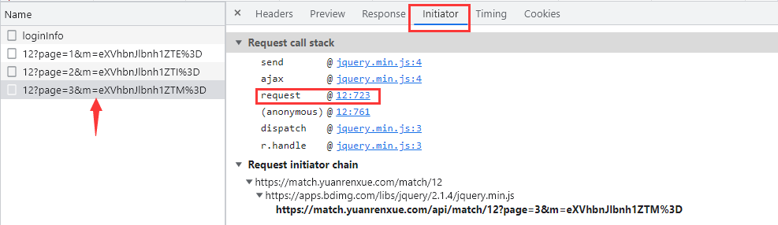

显示从一个名称为“12”的文件的第723行代码发送了当前请求，点击后面的地址，跳转到了该文件的第723行，看上面有两个很熟悉的参数page和m，再看后面跟的值，一切豁然开朗：

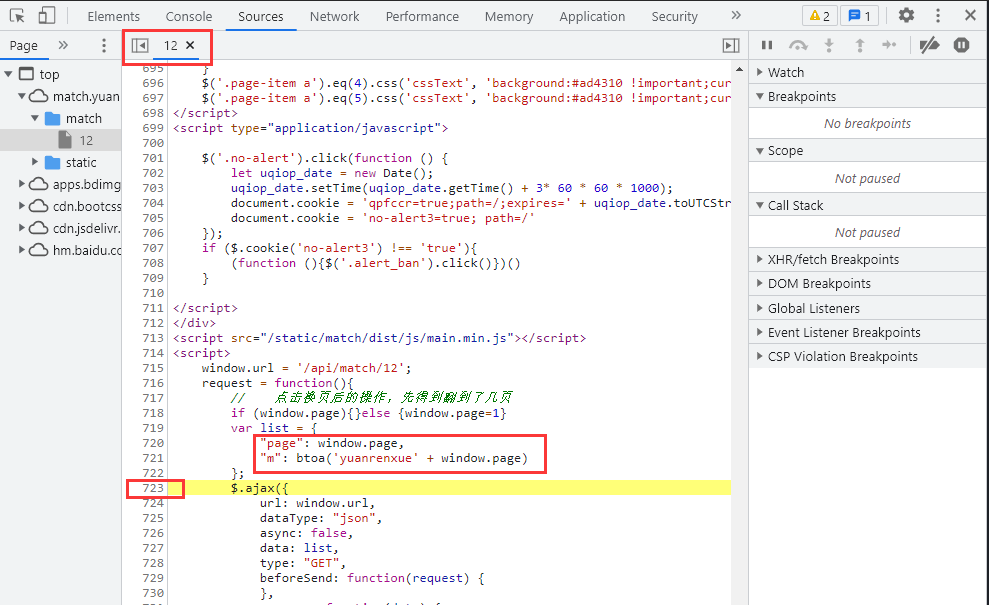

这下就可以对加密参数完全得出结论了：

```
page的参数值为window.page，即页码。
m的参数值为'yuanrenxue'+页码，再通过btoa()方法转为Base64编码。
```

#### 抠JS代码

虽然Python当中有现成的库，可以将字符串转为Base64编码，但这里为了练习和提升我们的JS能力，我们需要自己通过JS脚本来实现此功能。

**这里需要注意一点的是，`btoa()` 方法之所以能在浏览器使用，是因为已经加载关于该方法的源码，但源码的位置并不在上面的“12”文件中，因此我们代码中要使用 `btoa()` 方法就必须要获取该方法的源码，可自行百度得到。**

```javascript
var base64hash = 'ABCDEFGHIJKLMNOPQRSTUVWXYZabcdefghijklmnopqrstuvwxyz0123456789+/';

// btoa方法源码
btoa = function (s) {
        if (/([^\u0000-\u00ff])/.test(s)) {
            throw new Error('INVALID_CHARACTER_ERR');
        }
        var i = 0,
            prev,
            ascii,
            mod,
            result = [];

        while (i < s.length) {
            ascii = s.charCodeAt(i);
            mod = i % 3;

            switch(mod) {
                case 0:
                    result.push(base64hash.charAt(ascii >> 2));
                    break;
                case 1:
                    result.push(base64hash.charAt((prev & 3) << 4 | (ascii >> 4)));
                    break;
                case 2:
                    result.push(base64hash.charAt((prev & 0x0f) << 2 | (ascii >> 6)));
                    result.push(base64hash.charAt(ascii & 0x3f));
                    break;
            }

            prev = ascii;
            i ++;
        }

        if(mod == 0) {
            result.push(base64hash.charAt((prev & 3) << 4));
            result.push('==');
        } else if (mod == 1) {
            result.push(base64hash.charAt((prev & 0x0f) << 2));
            result.push('=');
        }

        return result.join('');
    };
```

### 爬虫代码

```python
#!/usr/bin/env python
#-*- coding:utf-8 -*-
# @Time    : 2021/9/27 1:23
# @Author  : chenzhuo
import re
import execjs
import requests

# 打开JS文件并加载JS文件
with open("上面的js文件名称.js", 'r', encoding = 'utf-8') as f:
    content = f.read()
JsObj = execjs.compile(content)

# 请求头
headers = {
    'accept': 'application/json, text/javascript, */*; q=0.01',
    'accept-encoding': 'gzip, deflate, br',
    'accept-language': 'zh-CN,zh;q=0.9',
    'cookie': '温馨提示：如果您已登录，那么每个人看到的答案都是不一样的，发送请求时请传入cookie中 sessionID参数，否则返回的答案将不是您自己的数据',
    'referer': 'https://match.yuanrenxue.com/match/12',
    'sec-ch-ua': '"Google Chrome";v="93", " Not;A Brand";v="99", "Chromium";v="93"',
    'sec-ch-ua-mobile': '?0',
    'sec-ch-ua-platform': '"Windows"',
    'sec-fetch-dest': 'empty',
    'sec-fetch-mode': 'cors',
    'sec-fetch-site': 'same-origin',
    'user-agent': 'yuanrenxue.project',
    'x-requested-with': 'XMLHttpRequest'
}

# 数值
values = 0

# 共5页数据
for page in range(1, 6):
    # 加密参数m
    m = JsObj.call('btoa', f"yuanrenxue{page}"),  # 调用js方法，第一个参数是JS的方法名，后面则是js方法的参数
    # 接口地址
    url = f'https://match.yuanrenxue.com/api/match/12?page={page}&m={m}'
    # 输出响应
    response = requests.get(url=url, headers=headers, verify=False)
    print(f'第{page}页:{response.text}')
    # 提示：会有负数存在
    for v in re.findall(r'{"value": (-?\d+)}', response.text):
        values += int(v)

# 总值
print(values)
```

## 简单Cookie加密

第一届Web端猿人学攻防大赛【官方网站】：https://match.yuanrenxue.com/

网址：https://match.yuanrenxue.com/match/13

难度：非常简单

### 逆向流程

#### 抓包解析

首先打开Fiddler抓包工具，开启抓包状态：


然后右键单击任务栏中的谷歌浏览器，点击“打开新的无痕窗口”，按F12打开“开发者工具”：


访问网址获取任务，在Network里面的Fetch/XHR选项中定位到了该网页数据的来源请求：

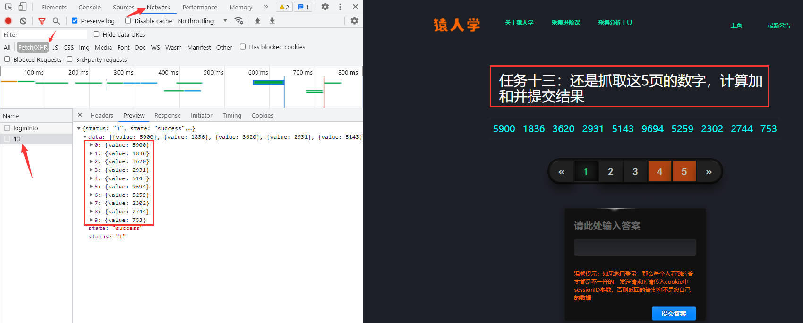

多次访问前面3页的页面，发现一个规律，如果访问之间的间隔时间稍微长一点，下次访问就要求强制访问loginfo页面，**说明该页面设置的Cookie的过期时间较短**，分析比较请求头参数，结合根据以往的爬虫经验，得出初步接结论：

```
sessionid参数：不同的请求，该值会发生变化。
Hm_lvt_c99546cf032aaa5a679230de9a95c7db参数：和时间戳有关的参数。
yuanrenxue_cookie：未知加密参数。
Hm_lpvt_c99546cf032aaa5a679230de9a95c7db参数：和时间戳有关的参数。
```

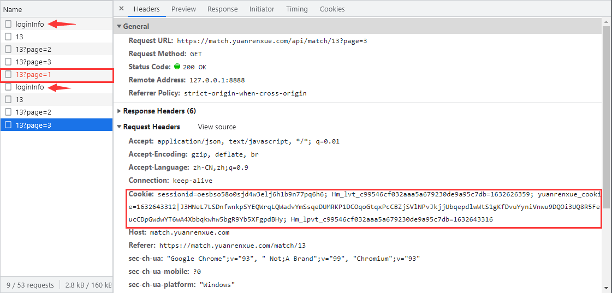

#### 逆向分析

现在我们回到Fiddler抓包工具，看看所抓到的数据包：

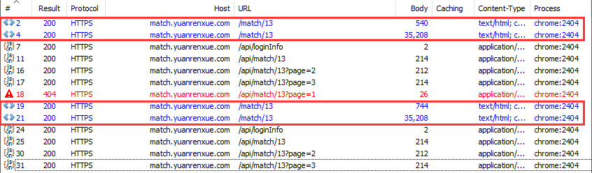

**可以看到Fiddler抓到的数据包还是和开发者工具所抓到的数据包还是所有不同的，不同点在每次请求loginfo页面时，前面都会有两次请求，我们分别来看看两次请求分别返回了什么。**

第一次请求，在响应头返回一个出现在Cookie的参数sessionid：


并且在响应内容当中发现Cookie当中出现的未知加密参数yuanrenxue_cookie：


第二次请求，看里面的内容就是这道题所要使用的前端代码，分析作用不大。


这下就可以对加密参数完全得出结论了：

```
sessionid参数：由第一次请求，服务器返回在请求头当中。
Hm_lvt_c99546cf032aaa5a679230de9a95c7db参数：和时间戳有关的参数，估计不会验证此参数。
yuanrenxue_cookie：由第一次请求，服务器返回在内容当中的document.cookie里。
Hm_lpvt_c99546cf032aaa5a679230de9a95c7db参数：和时间戳有关的参数，估计不会验证此参数。
```

#### 抠JS代码

这里就不用抠JS代码了，直接把第一次响应内容中的 `document.cookie` 抠出来就行了。

### 爬虫代码

```python
import re
import requests


# 请求头
headers = {
    'accept': 'application/json, text/javascript, */*; q=0.01',
    'accept-encoding': 'gzip, deflate, br',
    'accept-language': 'zh-CN,zh;q=0.9',
    'cookie': 'sessionid=登录后的sessionid',
    'user-agent': 'yuanrenxue.project',
    'x-requested-with': 'XMLHttpRequest'
}

# 第一次请求
first_res = requests.get('https://match.yuanrenxue.com/match/13', headers=headers, verify=False)
yrx_cookie = ''
for item in re.findall(r'\(\'(.*?)\'\)', first_res.text):
    yrx_cookie += item

# 更新请求头
headers.update({'cookie':f'{yrx_cookie};sessionid=登录后的sessionid'})

# 数值
values = 0

# 共5页数据
for page in range(1, 6):
    # 接口地址
    url = f'https://match.yuanrenxue.com/api/match/13?page={page}'
    # 输出响应
    response = requests.get(url=url, headers=headers, verify=False)
    print(f'第{page}页:{response.text}')
    for v in re.findall(r'{"value": (-?\d+)}', response.text):
        values += int(v)

# 总值
print(values)
```

## 简单请求头加密

这道题是猿人学内部题目，没有会员也是进不去的，就不提供网址了，只分享解题流程。

题目难度：非常简单

### 逆向流程

#### 抓包解析

首先打开Fiddler抓包工具，开启抓包状态，选择抓取经过浏览器的数据包：

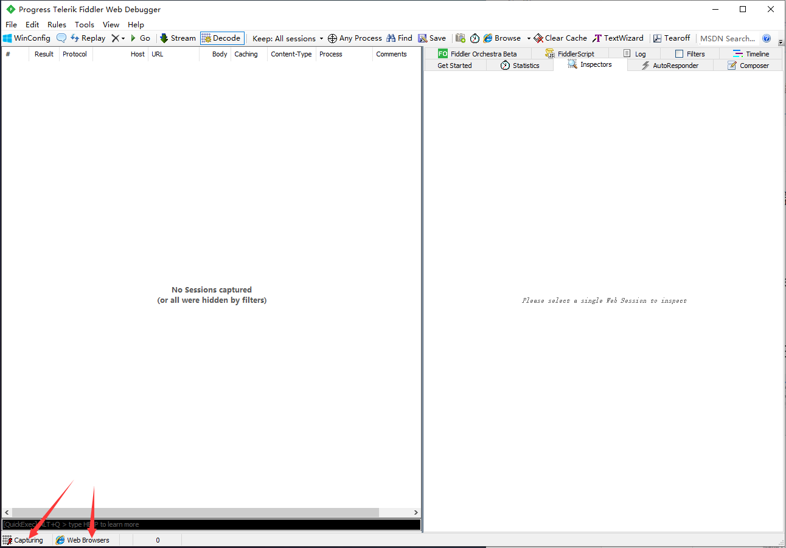

然后右键单击任务栏中的谷歌浏览器，点击“打开新的无痕窗口”，按F12打开“开发者工具”：


访问题目获取题目信息后，往后翻2页：


查看Fiddler的抓包，一模一样：

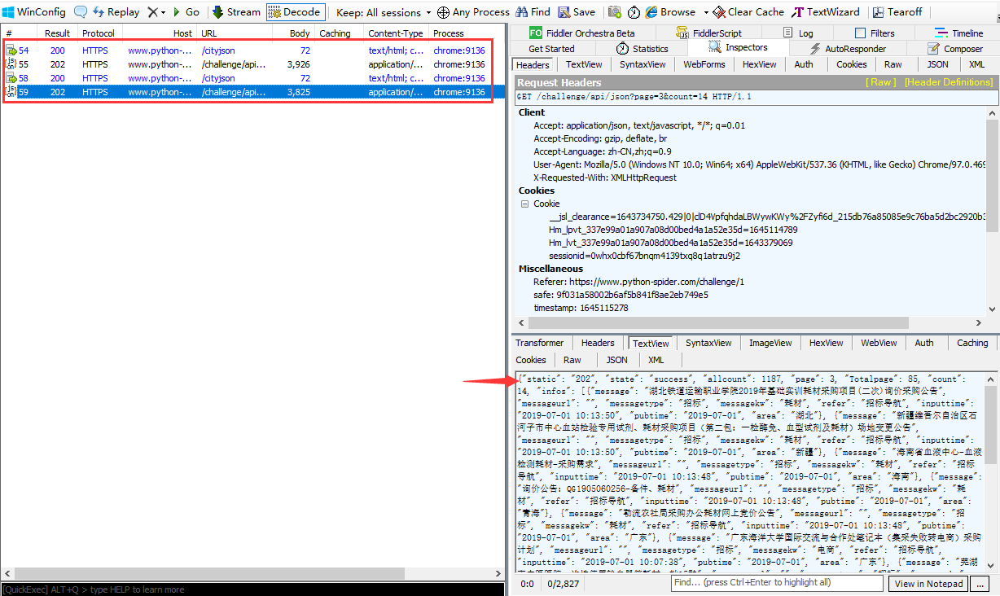

接下来，我们只选中 `/challenge/api` 进行3次重放攻击，发现均失败，而且即使和 `/cityjson` 一起重放攻击，也是失败：

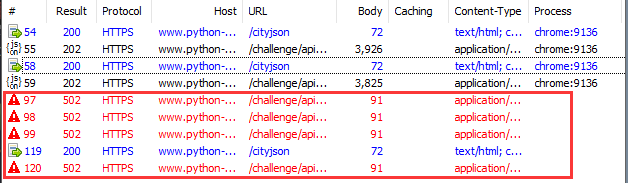

**说明在这期间，请求头中某个参数已经失效，导致重放攻击失败。**现在，我们再往后翻一页，点击URL，对比前后请求参数的变化：

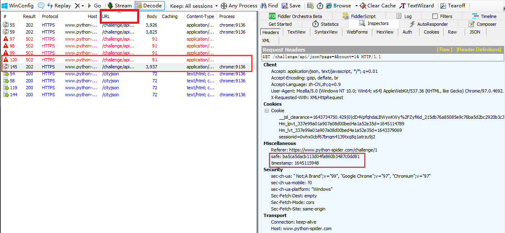

**通过比对发现 `safe`、`timestamp` 两个参数，`safe` 参数的值来源未知，但 `timestamp` 参数的值稍微有点爬虫经验的人都会联想到和时间戳相关。**

#### 逆向分析

现在我们要寻找 `safe`、`timestamp` 两个参数值得来源。回到Chrome浏览器中，现在我们需要定位到哪一行的代码发送了当前的请求，点击左侧的Initiator选项，它主要是标记请求是由哪个对象或进程发起的（请求源），重点关注里面的call调用：


点击后面的 `@1:100` 就跳转到了名称为1的文件，代码行数在100行的位置。可以看到在这里发送了一个ajax请求，**而且在发送请求之前也就是 `beforeSend` 里面有 `request.setRequestHeader` 操作，即设置请求头的操作**，而且就有我们想要的 `safe`、`timestamp` 两个参数：

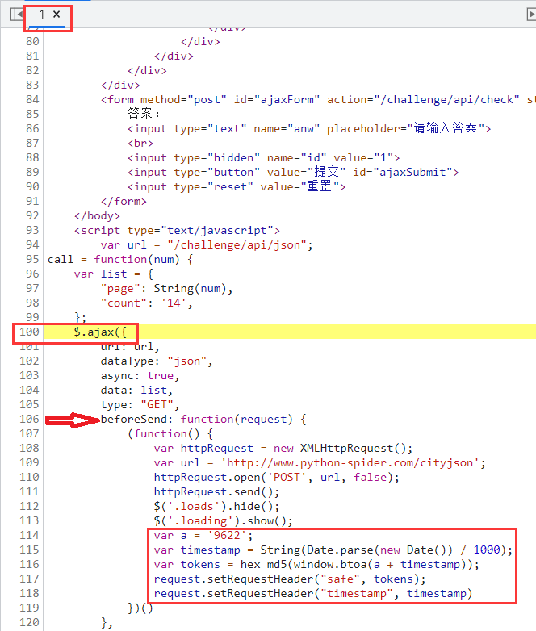

#### 抠JS代码

观察代码，发现 `safe` 参数的值就是 `tokens`，`timestamp` 参数的值就是时间戳除1000后的字符串。将上面代码整理如下：

```javascript
var timestamp = String(Date.parse(new Date()) / 1000);
var safe = hex_md5(window.btoa('9622' + timestamp));
```

**这里 `window.btoa` 方法其实和上面题中的 `btoa` 方法一样，可以沿用上面的 `btoa` 方法代码，在浏览器中因为window是底层的对象，可以省略不写：**


但还有一个 `hex_md5` 我们就需要打断跟踪了，发现该方法的来源于 `md5.js` 中的第25行：


我们点击进入，但里面又有 `binl2hex`、`core_md5`、`str2binl` 三个方法代码未知：


又按上面的方法继续调试，依次找了 `binl2hex`、`core_md5`、`str2binl` 三个函数的代码：

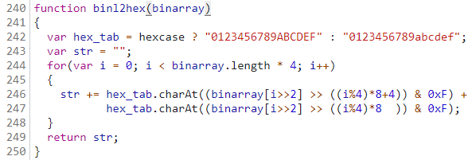

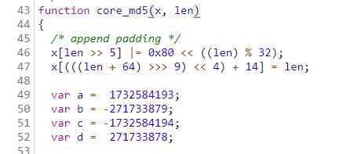

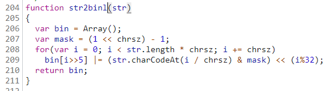

最终整个抠出来的JS代码如下：

```javascript
var base64hash = 'ABCDEFGHIJKLMNOPQRSTUVWXYZabcdefghijklmnopqrstuvwxyz0123456789+/';

// btoa方法源码
btoa = function (s) {
        if (/([^\u0000-\u00ff])/.test(s)) {
            throw new Error('INVALID_CHARACTER_ERR');
        }
        var i = 0,
            prev,
            ascii,
            mod,
            result = [];

        while (i < s.length) {
            ascii = s.charCodeAt(i);
            mod = i % 3;

            switch(mod) {
                case 0:
                    result.push(base64hash.charAt(ascii >> 2));
                    break;
                case 1:
                    result.push(base64hash.charAt((prev & 3) << 4 | (ascii >> 4)));
                    break;
                case 2:
                    result.push(base64hash.charAt((prev & 0x0f) << 2 | (ascii >> 6)));
                    result.push(base64hash.charAt(ascii & 0x3f));
                    break;
            }

            prev = ascii;
            i ++;
        }

        if(mod == 0) {
            result.push(base64hash.charAt((prev & 3) << 4));
            result.push('==');
        } else if (mod == 1) {
            result.push(base64hash.charAt((prev & 0x0f) << 2));
            result.push('=');
        }

        return result.join('');
    };

var hexcase = 0;  /* hex output format. 0 - lowercase; 1 - uppercase        */
var b64pad  = ""; /* base-64 pad character. "=" for strict RFC compliance   */
var chrsz   = 8;  /* bits per input character. 8 - ASCII; 16 - Unicode      */

function binl2hex(binarray)
{
  var hex_tab = hexcase ? "0123456789ABCDEF" : "0123456789abcdef";
  var str = "";
  for(var i = 0; i < binarray.length * 4; i++)
  {
    str += hex_tab.charAt((binarray[i>>2] >> ((i%4)*8+4)) & 0xF) +
           hex_tab.charAt((binarray[i>>2] >> ((i%4)*8  )) & 0xF);
  }
  return str;
}
function bit_rol(num, cnt)
{
  return (num << cnt) | (num >>> (32 - cnt));
}
function md5_cmn(q, a, b, x, s, t)
{
  return safe_add(bit_rol(safe_add(safe_add(a, q), safe_add(x, t)), s),b);
}
function md5_ff(a, b, c, d, x, s, t)
{
  return md5_cmn((b & c) | ((~b) & d), a, b, x, s, t);
}
function md5_gg(a, b, c, d, x, s, t)
{
  return md5_cmn((b & d) | (c & (~d)), a, b, x, s, t);
}
function md5_hh(a, b, c, d, x, s, t)
{
  return md5_cmn(b ^ c ^ d, a, b, x, s, t);
}
function md5_ii(a, b, c, d, x, s, t)
{
  return md5_cmn(c ^ (b | (~d)), a, b, x, s, t);
}
function safe_add(x, y)
{
  var lsw = (x & 0xFFFF) + (y & 0xFFFF);
  var msw = (x >> 16) + (y >> 16) + (lsw >> 16);
  return (msw << 16) | (lsw & 0xFFFF);
}


function core_md5(x, len)
{
  /* append padding */
  x[len >> 5] |= 0x80 << ((len) % 32);
  x[(((len + 64) >>> 9) << 4) + 14] = len;

  var a =  1732584193;
  var b = -271733879;
  var c = -1732584194;
  var d =  271733878;

  for(var i = 0; i < x.length; i += 16)
  {
    var olda = a;
    var oldb = b;
    var oldc = c;
    var oldd = d;

    a = md5_ff(a, b, c, d, x[i+ 0], 7 , -680876936);
    d = md5_ff(d, a, b, c, x[i+ 1], 12, -389564586);
    c = md5_ff(c, d, a, b, x[i+ 2], 17,  606105819);
    b = md5_ff(b, c, d, a, x[i+ 3], 22, -1044525330);
    a = md5_ff(a, b, c, d, x[i+ 4], 7 , -176418897);
    d = md5_ff(d, a, b, c, x[i+ 5], 12,  1200080426);
    c = md5_ff(c, d, a, b, x[i+ 6], 17, -1473231341);
    b = md5_ff(b, c, d, a, x[i+ 7], 22, -45705983);
    a = md5_ff(a, b, c, d, x[i+ 8], 7 ,  1770035416);
    d = md5_ff(d, a, b, c, x[i+ 9], 12, -1958414417);
    c = md5_ff(c, d, a, b, x[i+10], 17, -42063);
    b = md5_ff(b, c, d, a, x[i+11], 22, -1990404162);
    a = md5_ff(a, b, c, d, x[i+12], 7 ,  1804603682);
    d = md5_ff(d, a, b, c, x[i+13], 12, -40341101);
    c = md5_ff(c, d, a, b, x[i+14], 17, -1502002290);
    b = md5_ff(b, c, d, a, x[i+15], 22,  1236535329);

    a = md5_gg(a, b, c, d, x[i+ 1], 5 , -165796510);
    d = md5_gg(d, a, b, c, x[i+ 6], 9 , -1069501632);
    c = md5_gg(c, d, a, b, x[i+11], 14,  643717713);
    b = md5_gg(b, c, d, a, x[i+ 0], 20, -373897302);
    a = md5_gg(a, b, c, d, x[i+ 5], 5 , -701558691);
    d = md5_gg(d, a, b, c, x[i+10], 9 ,  38016083);
    c = md5_gg(c, d, a, b, x[i+15], 14, -660478335);
    b = md5_gg(b, c, d, a, x[i+ 4], 20, -405537848);
    a = md5_gg(a, b, c, d, x[i+ 9], 5 ,  568446438);
    d = md5_gg(d, a, b, c, x[i+14], 9 , -1019803690);
    c = md5_gg(c, d, a, b, x[i+ 3], 14, -187363961);
    b = md5_gg(b, c, d, a, x[i+ 8], 20,  1163531501);
    a = md5_gg(a, b, c, d, x[i+13], 5 , -1444681467);
    d = md5_gg(d, a, b, c, x[i+ 2], 9 , -51403784);
    c = md5_gg(c, d, a, b, x[i+ 7], 14,  1735328473);
    b = md5_gg(b, c, d, a, x[i+12], 20, -1926607734);

    a = md5_hh(a, b, c, d, x[i+ 5], 4 , -378558);
    d = md5_hh(d, a, b, c, x[i+ 8], 11, -2022574463);
    c = md5_hh(c, d, a, b, x[i+11], 16,  1839030562);
    b = md5_hh(b, c, d, a, x[i+14], 23, -35309556);
    a = md5_hh(a, b, c, d, x[i+ 1], 4 , -1530992060);
    d = md5_hh(d, a, b, c, x[i+ 4], 11,  1272893353);
    c = md5_hh(c, d, a, b, x[i+ 7], 16, -155497632);
    b = md5_hh(b, c, d, a, x[i+10], 23, -1094730640);
    a = md5_hh(a, b, c, d, x[i+13], 4 ,  681279174);
    d = md5_hh(d, a, b, c, x[i+ 0], 11, -358537222);
    c = md5_hh(c, d, a, b, x[i+ 3], 16, -722521979);
    b = md5_hh(b, c, d, a, x[i+ 6], 23,  76029189);
    a = md5_hh(a, b, c, d, x[i+ 9], 4 , -640364487);
    d = md5_hh(d, a, b, c, x[i+12], 11, -421815835);
    c = md5_hh(c, d, a, b, x[i+15], 16,  530742520);
    b = md5_hh(b, c, d, a, x[i+ 2], 23, -995338651);

    a = md5_ii(a, b, c, d, x[i+ 0], 6 , -198630844);
    d = md5_ii(d, a, b, c, x[i+ 7], 10,  1126891415);
    c = md5_ii(c, d, a, b, x[i+14], 15, -1416354905);
    b = md5_ii(b, c, d, a, x[i+ 5], 21, -57434055);
    a = md5_ii(a, b, c, d, x[i+12], 6 ,  1700485571);
    d = md5_ii(d, a, b, c, x[i+ 3], 10, -1894986606);
    c = md5_ii(c, d, a, b, x[i+10], 15, -1051523);
    b = md5_ii(b, c, d, a, x[i+ 1], 21, -2054922799);
    a = md5_ii(a, b, c, d, x[i+ 8], 6 ,  1873313359);
    d = md5_ii(d, a, b, c, x[i+15], 10, -30611744);
    c = md5_ii(c, d, a, b, x[i+ 6], 15, -1560198380);
    b = md5_ii(b, c, d, a, x[i+13], 21,  1309151649);
    a = md5_ii(a, b, c, d, x[i+ 4], 6 , -145523070);
    d = md5_ii(d, a, b, c, x[i+11], 10, -1120210379);
    c = md5_ii(c, d, a, b, x[i+ 2], 15,  718787259);
    b = md5_ii(b, c, d, a, x[i+ 9], 21, -343485551);

    a = safe_add(a, olda);
    b = safe_add(b, oldb);
    c = safe_add(c, oldc);
    d = safe_add(d, oldd);
  }
  return Array(a, b, c, d);

}

function str2binl(str)
{
  var bin = Array();
  var mask = (1 << chrsz) - 1;
  for(var i = 0; i < str.length * chrsz; i += chrsz)
    bin[i>>5] |= (str.charCodeAt(i / chrsz) & mask) << (i%32);
  return bin;
}

function hex_md5(s){ return binl2hex(core_md5(str2binl(s), s.length * chrsz));}

// 自定义一个函数返回safe、timestamp的值
function header_value(){
    var timestamp = String(Date.parse(new Date()) / 1000);
    var safe = hex_md5(btoa('9622' + timestamp));
    return Array(timestamp, safe)
}
```

### 爬虫代码

```python
import execjs
import requests

# 建立一个会话
session = requests.session()
# 忽略警告
requests.packages.urllib3.disable_warnings()

def conversion(head):
    items = [item.split(': ') for item in head.split('\n')]
    header = {}
    for item in items:
        header.update({item[0]: item[1]})
    return header

# 打开JS文件并加载JS文件
with open("yrx.js", 'r', encoding = 'utf-8') as f:
    content = f.read()
JsObj = execjs.compile(content)

page_header = '''Host: www.python-spider.com
Connection: keep-alive
sec-ch-ua: " Not A;Brand";v="99", "Chromium";v="98", "Google Chrome";v="98"
sec-ch-ua-mobile: ?0
User-Agent: Mozilla/5.0 (Windows NT 10.0; Win64; x64) AppleWebKit/537.36 (KHTML, like Gecko) Chrome/98.0.4758.102 Safari/537.36
Accept: application/json, text/javascript, */*; q=0.01
X-Requested-With: XMLHttpRequest
sec-ch-ua-platform: "Windows"
Sec-Fetch-Site: same-origin
Sec-Fetch-Mode: cors
Sec-Fetch-Dest: empty
Referer: https://www.python-spider.com/challenge/1
Accept-Encoding: gzip, deflate, br
Accept-Language: zh-CN,zh;q=0.9
Cookie: __jsl_clearance=1643734750.429|0|clD4VpfqhdaLBWywKWy%2FZyfi6d_215db76a85085e9c76ba5d2bc2920b3c3D; Hm_lvt_337e99a01a907a08d00bed4a1a52e35d=1643379069,1645197641; sessionid=m5dazc5eltvvpey47b53aqaea8yzhz2g; Hm_lpvt_337e99a01a907a08d00bed4a1a52e35d=1645462440'''

# 总和
sum_numbers = 0

# 100页数据
for page in range(1, 86):
    header_value = JsObj.call('header_value')
    # python特性爬虫请求头的顺序会被打乱，需要固定顺序就必须按如下写法
    session.headers = conversion(page_header)
    session.headers['timestamp'] = header_value[0]
    session.headers['safe'] = header_value[1]
    page_url = f'https://www.python-spider.com/challenge/api/json?page={page}&count=14'
    response = session.get(url=page_url, verify=False).json()
    print(f'第{page}页的数据：{response.get("infos")}')
    for value in response.get('infos'):
        title = value.get('message')
        if '招' in title:
            sum_numbers += 1
print(sum_numbers)
```

## 有道翻译

有道翻译是网易公司开发的一款翻译软件，其最大特色在于翻译引擎是基于搜索引擎，网络释义的，也就是说它所翻译的词释义都是来自网络。

有道桌面词典背靠其强大的搜索引擎（有道搜索）后台数据和“网页萃取”技术，从数十亿海量网页中提炼出传统词典无法收录的各类新兴词汇和英文缩写，如影视作品名称、品牌名称、名人姓名、地名、专业术语等。由于互联网上的网页内容是时刻更新的，因此有道桌面词典提供的词汇和例句也会随之动态更新，以致将互联网上最新、最酷、最鲜活的中英文词汇及句子一网打尽。

有道翻译网站地址：https://fanyi.youdao.com/

题目难度：非常简单

### 逆向流程

#### 抓包解析

输入一个词“逆向”，通过Chrome自带的开发者工具抓取数据包，在Network(网络部分)的Fetch/XHR选项筛选出返回内容的数据包，在Response部分可以看到返回的结果。


切换到header部分，比较两次相同内容的请求，发现Request Headers参数没有什么变化，但POST有三个参数有变化：

```
salt: 16303966363048
sign: a5ede67eabd2c6a8b06975b09e2c5a6b
lts: 1630396636304
```


可以看到 `salt` 和 `lts` 参数差不多，有爬虫经验的人，第一直觉就是时间戳，因为这个两个参数随着时间在不断的变大，而且数值和时间戳类似，确保万一取数值的前10位进行验证一下：


看来时间戳猜想基本正确，**一般来说，网络上使用时间戳都会精确到毫秒。这里可以进行下一步确定，`lts` 参数是精确到毫秒的13位时间戳，`salt` 参数就是13位时间戳加1个未知参数。**

#### 逆向分析

现在我们未知参数就剩下 `sign` 参数和 `salt` 最后一位参数。我们全局搜索一下 `salt` 的名称：


发现就在一个js文件中出现了 `salt` 的名称，点击进入，跳转到Sources选项中查看 `fanyi.min.js` 文件：


js文件中所有的代码都在一行，点击下方的 `{}` 按钮，在上方出现了 `fanyi.min.js:formatted` 这就是将 `fanyi.min.js` 文件中js代码格式化后的结果，方便我们阅读：


继续在文件中搜索 `salt` 名称，共有12处匹配，经过比对，在8979行找到了和POST参数最为接近的代码：


点击8988行处打上断点，点击翻译，代码运行卡在断点处，里面显示许多我们要使用的参数及来源：


通过观察可得出 `salt` 、`sign`、`lts` 、`bv` 参数与js代码中的 `r` 参数关系密切，查看 `r` 参数就在上方面：


**`r` 参数的构造也很简单，就是一个 `v` 类调用了 `generateSaltSign()` 方法传入了参数 `n` ，即翻译的内容“逆向”。选中方法名称，提示来自于8383行，点击位置跳转。**在8393行打上断点，点击翻译，断点卡住：


一看显示的内容，所有的参数基本都豁然开朗了。**如果有未知参数，点击Search点击Console输入参数名称，直接打印出来。**到这里就可以对参数做一个总结了：

```
r = {
  ts: 字符串类型的时间戳,
  bv: 浏览器user-agent的md5加密,
  salt: 字符串类型的时间戳 + 0到9随机取整,
  sign: "fanyideskweb" + （查询的内容） + （字符串类型的时间戳 + 0到9随机取整） + "Y2FYu%TNSbMCxc3t2u^XT"的md5加密
}

i: 动态值（查询的内容）
from: 默认值“AUTO”（被翻译的语言类型）
to: 默认值“AUTO”（翻译结果的语言类型）
smartresult: 固定值“dict”
client: 固定值“fanyideskweb”
salt: r参数.salt
sign: r参数.sign
lts: r参数.ts
bv: r参数.bv
doctype: 固定值“json”
version: 固定值“2.1”
keyfrom: 固定值“fanyi.web”
action: 固定值“FY_BY_CLICKBUTTION“
```

?> 提示：到这里我们对JS加密参数就分析完成了，我们也可以得到一个经验，就是对JS加密网站，不用分析每一行JS代码的作用，只需要分析加密的那一部分JS代码就可以了。

#### 扣JS代码

**完成对加密参数的分析，接下我们就要使用JS代码对明文POST参数加密。然而加密的JS代码都直接暴露在了JS文件当中，我们将需要JS代码给摘取出来就可以了。因为不是每行JS代码都需要，所以俗称：扣JS代码。**

参数加密主要使用了md5算法，虽然Python当中有对应的md5三方库，但这是标准的md5算法，而且不确定该网站的md5算法是否有改装，保险起见使用改网站的md5算法过程，其他的参数方法由Python实现。

下面就是扣JS代码，这个地方要注意：


需要将上面的方法指定名称为md5，接下就是将有关该方法的参数和函数全部粘贴进 `md5.js` 文件当中方便爬虫调用：

```javascript
function md5(e) {
var t, n, i, o, a, s, m, g, v, y = Array();
for (e = h(e),
y = f(e),
s = 1732584193,
m = 4023233417,
g = 2562383102,
v = 271733878,
t = 0; t < y.length; t += 16)
    n = s,
    i = m,
    o = g,
    a = v,
    s = l(s, m, g, v, y[t + 0], 7, 3614090360),
    v = l(v, s, m, g, y[t + 1], 12, 3905402710),
    g = l(g, v, s, m, y[t + 2], 17, 606105819),
    m = l(m, g, v, s, y[t + 3], 22, 3250441966),
    s = l(s, m, g, v, y[t + 4], 7, 4118548399),
    v = l(v, s, m, g, y[t + 5], 12, 1200080426),
    g = l(g, v, s, m, y[t + 6], 17, 2821735955),
    m = l(m, g, v, s, y[t + 7], 22, 4249261313),
    s = l(s, m, g, v, y[t + 8], 7, 1770035416),
    v = l(v, s, m, g, y[t + 9], 12, 2336552879),
    g = l(g, v, s, m, y[t + 10], 17, 4294925233),
    m = l(m, g, v, s, y[t + 11], 22, 2304563134),
    s = l(s, m, g, v, y[t + 12], 7, 1804603682),
    v = l(v, s, m, g, y[t + 13], 12, 4254626195),
    g = l(g, v, s, m, y[t + 14], 17, 2792965006),
    m = l(m, g, v, s, y[t + 15], 22, 1236535329),
    s = c(s, m, g, v, y[t + 1], 5, 4129170786),
    v = c(v, s, m, g, y[t + 6], 9, 3225465664),
    g = c(g, v, s, m, y[t + 11], 14, 643717713),
    m = c(m, g, v, s, y[t + 0], 20, 3921069994),
    s = c(s, m, g, v, y[t + 5], 5, 3593408605),
    v = c(v, s, m, g, y[t + 10], 9, 38016083),
    g = c(g, v, s, m, y[t + 15], 14, 3634488961),
    m = c(m, g, v, s, y[t + 4], 20, 3889429448),
    s = c(s, m, g, v, y[t + 9], 5, 568446438),
    v = c(v, s, m, g, y[t + 14], 9, 3275163606),
    g = c(g, v, s, m, y[t + 3], 14, 4107603335),
    m = c(m, g, v, s, y[t + 8], 20, 1163531501),
    s = c(s, m, g, v, y[t + 13], 5, 2850285829),
    v = c(v, s, m, g, y[t + 2], 9, 4243563512),
    g = c(g, v, s, m, y[t + 7], 14, 1735328473),
    m = c(m, g, v, s, y[t + 12], 20, 2368359562),
    s = u(s, m, g, v, y[t + 5], 4, 4294588738),
    v = u(v, s, m, g, y[t + 8], 11, 2272392833),
    g = u(g, v, s, m, y[t + 11], 16, 1839030562),
    m = u(m, g, v, s, y[t + 14], 23, 4259657740),
    s = u(s, m, g, v, y[t + 1], 4, 2763975236),
    v = u(v, s, m, g, y[t + 4], 11, 1272893353),
    g = u(g, v, s, m, y[t + 7], 16, 4139469664),
    m = u(m, g, v, s, y[t + 10], 23, 3200236656),
    s = u(s, m, g, v, y[t + 13], 4, 681279174),
    v = u(v, s, m, g, y[t + 0], 11, 3936430074),
    g = u(g, v, s, m, y[t + 3], 16, 3572445317),
    m = u(m, g, v, s, y[t + 6], 23, 76029189),
    s = u(s, m, g, v, y[t + 9], 4, 3654602809),
    v = u(v, s, m, g, y[t + 12], 11, 3873151461),
    g = u(g, v, s, m, y[t + 15], 16, 530742520),
    m = u(m, g, v, s, y[t + 2], 23, 3299628645),
    s = d(s, m, g, v, y[t + 0], 6, 4096336452),
    v = d(v, s, m, g, y[t + 7], 10, 1126891415),
    g = d(g, v, s, m, y[t + 14], 15, 2878612391),
    m = d(m, g, v, s, y[t + 5], 21, 4237533241),
    s = d(s, m, g, v, y[t + 12], 6, 1700485571),
    v = d(v, s, m, g, y[t + 3], 10, 2399980690),
    g = d(g, v, s, m, y[t + 10], 15, 4293915773),
    m = d(m, g, v, s, y[t + 1], 21, 2240044497),
    s = d(s, m, g, v, y[t + 8], 6, 1873313359),
    v = d(v, s, m, g, y[t + 15], 10, 4264355552),
    g = d(g, v, s, m, y[t + 6], 15, 2734768916),
    m = d(m, g, v, s, y[t + 13], 21, 1309151649),
    s = d(s, m, g, v, y[t + 4], 6, 4149444226),
    v = d(v, s, m, g, y[t + 11], 10, 3174756917),
    g = d(g, v, s, m, y[t + 2], 15, 718787259),
    m = d(m, g, v, s, y[t + 9], 21, 3951481745),
    s = r(s, n),
    m = r(m, i),
    g = r(g, o),
    v = r(v, a);
return (p(s) + p(m) + p(g) + p(v)).toLowerCase()
};

var n = function(e, t) {
    return e << t | e >>> 32 - t
};

r = function(e, t) {
    var n, r, i, o, a;
    return i = 2147483648 & e,
    o = 2147483648 & t,
    n = 1073741824 & e,
    r = 1073741824 & t,
    a = (1073741823 & e) + (1073741823 & t),
    n & r ? 2147483648 ^ a ^ i ^ o : n | r ? 1073741824 & a ? 3221225472 ^ a ^ i ^ o : 1073741824 ^ a ^ i ^ o : a ^ i ^ o
};

o = function(e, t, n) {
    return e & n | t & ~n
}
  ;i = function(e, t, n) {
        return e & t | ~e & n
}
  ;a = function(e, t, n) {
    return e ^ t ^ n
}
  ; s = function(e, t, n) {
    return t ^ (e | ~n)
}
  ; l = function(e, t, o, a, s, l, c) {
    return e = r(e, r(r(i(t, o, a), s), c)),
    r(n(e, l), t)
}
  ; c = function(e, t, i, a, s, l, c) {
    return e = r(e, r(r(o(t, i, a), s), c)),
    r(n(e, l), t)
}
  ; u = function(e, t, i, o, s, l, c) {
    return e = r(e, r(r(a(t, i, o), s), c)),
    r(n(e, l), t)
}
  ; d = function(e, t, i, o, a, l, c) {
    return e = r(e, r(r(s(t, i, o), a), c)),
    r(n(e, l), t)
};

f = function(e) {
    for (var t, n = e.length, r = n + 8, i = 16 * ((r - r % 64) / 64 + 1), o = Array(i - 1), a = 0, s = 0; s < n; )
        a = s % 4 * 8,
        o[t = (s - s % 4) / 4] = o[t] | e.charCodeAt(s) << a,
        s++;
    return t = (s - s % 4) / 4,
    a = s % 4 * 8,
    o[t] = o[t] | 128 << a,
    o[i - 2] = n << 3,
    o[i - 1] = n >>> 29,
    o
};

h = function(e) {
    e = e.replace(/\x0d\x0a/g, "\n");
    for (var t = "", n = 0; n < e.length; n++) {
        var r = e.charCodeAt(n);
        if (r < 128)
            t += String.fromCharCode(r);
        else if (r > 127 && r < 2048)
            t += String.fromCharCode(r >> 6 | 192),
            t += String.fromCharCode(63 & r | 128);
        else if (r >= 55296 && r <= 56319) {
            if (n + 1 < e.length) {
                var i = e.charCodeAt(n + 1);
                if (i >= 56320 && i <= 57343) {
                    var o = 1024 * (r - 55296) + (i - 56320) + 65536;
                    t += String.fromCharCode(240 | o >> 18 & 7),
                    t += String.fromCharCode(128 | o >> 12 & 63),
                    t += String.fromCharCode(128 | o >> 6 & 63),
                    t += String.fromCharCode(128 | 63 & o),
                    n++
                }
            }
        } else
            t += String.fromCharCode(r >> 12 | 224),
            t += String.fromCharCode(r >> 6 & 63 | 128),
            t += String.fromCharCode(63 & r | 128)
    }
    return t
};


p = function(e) {
    var t, n = "", r = "";
    for (t = 0; t <= 3; t++)
        n += (r = "0" + (e >>> 8 * t & 255).toString(16)).substr(r.length - 2, 2);
    return n
};

// 定义一个变量aaa赋值123456的md5加密结果
var aaaa = md5('123456');
// 输出加密结果
console.log(aaaa);
```

### 爬虫代码

扣取了完整的JS代码，接下来我们就可以写爬虫了，代码如下：

```python
import time
import execjs
import random
import requests


# 查询内容
word = '逆向'
# 13位时间戳
time_stamp = str(int(time.time()*1000))
# salt参数
salt = time_stamp + str(random.randint(0, 9))
# user_agent
user_agent = "5.0 (Windows NT 10.0; Win64; x64) AppleWebKit/537.36 (KHTML, like Gecko) Chrome/92.0.4515.159 Safari/537.36"

# 打开JS文件并加载JS文件
with open("md5.js", 'r', encoding = 'utf-8') as f:
    content = f.read()
JsObj = execjs.compile(content)

# 请求头
headers = {
    'Accept': 'application/json, text/javascript, */*; q=0.01',
    'Accept-Encoding': 'gzip, deflate, br',
    'Accept-Language': 'zh-CN,zh;q=0.9',
    'Connection': 'keep-alive',
    'Content-Length': '256',
    'Content-Type': 'application/x-www-form-urlencoded; charset=UTF-8',
    'Host': 'fanyi.youdao.com',
    'Origin': 'https://fanyi.youdao.com',
    'Referer': 'https://fanyi.youdao.com/',
    'Cookie': 'OUTFOX_SEARCH_USER_ID=-118587183@10.169.0.82; JSESSIONID=aaah9AG3VDhIWgjtBlBUx; OUTFOX_SEARCH_USER_ID_NCOO=721202366.2451781; fanyi-ad-id=114757; fanyi-ad-closed=1; ___rl__test__cookies=1630401422673',
    'sec-ch-ua': '"Chromium";v="92", " Not A;Brand";v="99", "Google Chrome";v="92"',
    'sec-ch-ua-mobile': '?0',
    'Sec-Fetch-Dest': 'empty',
    'Sec-Fetch-Mode': 'cors',
    'Sec-Fetch-Site': 'same-origin',
    'User-Agent': 'Mozilla/5.0 (Windows NT 10.0; Win64; x64) AppleWebKit/537.36 (KHTML, like Gecko) Chrome/92.0.4515.159 Safari/537.36',
    'X-Requested-With': 'XMLHttpRequest'
}

# post参数
data = {
    'i': word,
    'from': 'AUTO',
    'to': 'AUTO',
    'smartresult': 'dict',
    'client': 'fanyideskweb',
    'salt': salt,
    'sign': JsObj.call('md5', f"fanyideskweb{word}{salt}Y2FYu%TNSbMCxc3t2u^XT"),# 调用js方法，第一个参数是JS的方法名，后面则是js方法的参数
    'lts': time_stamp,
    'bv': JsObj.call('md5', user_agent),
    'doctype': 'json',
    'version': '2.1',
    'keyfrom': 'fanyi.web',
    'action': 'FY_BY_CLICKBUTTION'
}

# 接口地址
url = 'https://fanyi.youdao.com/translate_o?smartresult=dict&smartresult=rule'

# 输出响应
response = requests.post(url=url, headers=headers, data=data, verify=False)
print(response.text)

'''
输出：
{"translateResult":[[{"tgt":"The reverse","src":"逆向"}]],"errorCode":0,"type":"zh-CHS2en","smartResult":{"entries":["","reverse\r\n","backward\r\n","reversal\r\n"],"type":1}}
'''
```
