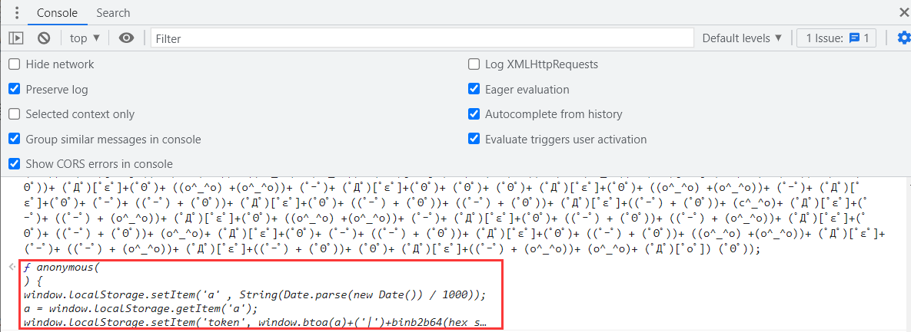

# 简单的JS编码

## JS_Fuck代码

这道题是猿人学内部题目，没有会员也是进不去的，就不提供网址了，只分享解题流程。

题目难度：非常简单

### 逆向流程

#### 抓包解析

首先右键单击任务栏中的谷歌浏览器，点击“打开新的无痕窗口”，按F12打开“开发者工具”：


访问题目获取题目信息，并找到数据来源接口：


向后翻了2页，发现请求中的POST参数每次都会发生变化，其中 `page` 参数是页码，`uc` 参数是加密参数 ：


选择 `Initiator` 选项卡，点击请求回调栈中的 `call` 跳转到发送该请求的位置：


#### 逆向分析

跳转后，发现了想要的参数信息。**但是从图中可以看到 `window.a` 是一个函数，但在上面的POST传递的参数中 `window.a` 是一个加密字符串，说明该变量在代码过程当中被重新赋值了，而中间代码就只剩下 `[](![]+[])...` 这段了，根据前面《逆向基础》中“编码与混淆”内容，判断该段代码是经过JS_Fuck编码后的JS代码：**


我们将这段代码拷贝下来，在Console栏中运行，发现报错了，并提示了错误位置：


**我们点击错误位置，追进去后就是还原后的JS代码了。发现 `window.a` 果然被重新赋值了：**


#### 抠JS代码

接下来，我们将还原的JS代码和前面的代码进行拼接， 并补充上有关AES加密的JS源码以及相关环境：

```javascript
// 这里要引入lib文件夹中的CryptoJS源码

function get_params(encrypt_str,desKey,desIV){
    var key = CryptoJS.enc.Hex.parse(desKey);
    var result = CryptoJS.DES.encrypt(encrypt_str,key,{
        iv:CryptoJS.enc.Utf8.parse(desIV),
        mode:CryptoJS.mode.CBC,
        padding:CryptoJS.pad.Pkcs7
    }).toString();

    return result
};

// num页码参数
function uc(num){
    // 补环境
    window = global;
    window.k = 'wdf2ff*TG@*(F4)*YH)g430HWR(*)' + 'wse';
    window.t = Date.parse(new Date())/1000;
    window.m = CryptoJS.enc.Utf8.parse(k);
    window.a = function(word){
        var srcs = CryptoJS.enc.Utf8.parse(word);
        var encrypted = CryptoJS.AES.encrypt(srcs, m, {
            mode: CryptoJS.mode.ECB,
            padding: CryptoJS.pad.Pkcs7
        });
        return encrypted.toString();
        };

    // 这里将window.num替换为num
    window.s = window.a(window.t + '|' + num);
    window.a = window.s;

    return window.a;
};
```

### 爬虫代码

```python
import execjs
import requests

# 建立一个会话
session = requests.session()
# 忽略警告
requests.packages.urllib3.disable_warnings()

def conversion(head):
    items = [item.split(': ') for item in head.split('\n')]
    header = {}
    for item in items:
        header.update({item[0]: item[1]})
    return header

with open("yrx.js", 'r', encoding = 'utf-8') as f:
    content = f.read()
JsObj = execjs.compile(content)

page_header = '''Host: www.python-spider.com
Connection: keep-alive
Content-Length: 40
sec-ch-ua: " Not A;Brand";v="99", "Chromium";v="98", "Google Chrome";v="98"
Accept: application/json, text/javascript, */*; q=0.01
Content-Type: application/x-www-form-urlencoded; charset=UTF-8
X-Requested-With: XMLHttpRequest
sec-ch-ua-mobile: ?0
User-Agent: Mozilla/5.0 (Windows NT 10.0; Win64; x64) AppleWebKit/537.36 (KHTML, like Gecko) Chrome/98.0.4758.102 Safari/537.36
sec-ch-ua-platform: "Windows"
Origin: https://www.python-spider.com
Sec-Fetch-Site: same-origin
Sec-Fetch-Mode: cors
Sec-Fetch-Dest: empty
Referer: https://www.python-spider.com/challenge/14
Accept-Encoding: gzip, deflate, br
Accept-Language: zh-CN,zh;q=0.9
Cookie: Hm_lvt_337e99a01a907a08d00bed4a1a52e35d=1646797488; sessionid=hdgl43y50uvxjz98incrabm2ses5fy98; Hm_lpvt_337e99a01a907a08d00bed4a1a52e35d=1646817147'''

# 总和
sum_numbers = 0

page = 1
# 100页数据
while True:
    try:
        # 固定请求头
        session.headers = conversion(page_header)
        # 数据地址
        page_url = 'https://www.python-spider.com/api/challenge14'
        # 请求参数
        data = {'page': page, 'uc':JsObj.call('uc', page)}
        # 访问
        response = session.post(url=page_url, data=data, verify=False, timeout=10)
        if response.status_code != 200:
            continue
        print(f'第{page}页的数据：{response.json().get("data")}')
        for value in response.json().get('data'):
            sum_numbers += int(value.get('value'))
        page += 1
        if page == 101:
            break
    except Exception as e:
        print(f'报错：{e}')

print(sum_numbers)
```

## aaencode代码

这道题是猿人学内部题目，没有会员也是进不去的，就不提供网址了，只分享解题流程。

题目难度：非常简单

### 逆向流程

#### 抓包解析

首先右键单击任务栏中的谷歌浏览器，点击“打开新的无痕窗口”，按F12打开“开发者工具”：


一来就首先遇到一个定时的debugger；我们再左边侧栏右键选择 `Never pause here` 永远不停留这里：


注意里面的外面定时器 `setInterval(function(){}` 和里面debugger都要打上，打上断点的效果如下，在右侧Breakpoint显示有两个断点：


理解题目要求，找到数据接口：


往后翻动两页，观察请求头，发现每次请求safe参数都会有所变化：


选择 `Initiator` 选项卡，点击请求回调栈中的 `call` 跳转到发送该请求的位置：


#### 逆向分析

跳转后，发现了想要的参数信息。**在我们打断点的位置上面两行，有一个request.setRequestHeader设置请求头的操作，参数名称是safe，值是token，但我们全局搜索发现整个页面token只有一个，那么很有可能问题就在出在了中间那一串表情字符的aaencode代码当中了：**


为了验证我们猜想，**在201行、202行打上断点，并在控制台分别打印token的值，发现两次打印token的值都不一样，说明aaencode代码对token进行了赋值操作：**


我们将这段代码拷贝下来，**在Console栏中运行并没有报错，返回了一个undefined，说明代码是很可能是一个没有设置返回值的自执行函数**：


**在上图中末尾有一个独立的 `('_')` 符号，我们删掉它再次打印，就会发现函数的内容：**



双击输出的函数内容就会跳转到一个临时的VM文件里面，其内容就是完整的函数内容，逻辑也很简单就是围绕a这个有关时间戳的变量进行编码加密，我们在不熟悉的方法前面打上断点，继续运行：


所有不熟悉的方法都指向了这个文件：


**进入这个mian.js文件，发现内容也是被ob混淆了的，但无论怎么混淆，它终究是可以运行的：**


#### 抠JS代码

接下来，就是将VM文件里面的函数内容和被混淆的mian.js内容结合起来，最后生成token并返回就可以了。

首先我们写一个函数，将VM函数内容粘贴过来，将mian.js未格式化的内容（这里是为了防止JS代码进行格式化检测）粘贴过来并注释掉，再一层层解封mian.js文件中的方法：


注意这里有的JS代码两个坑：

1. 题目中JS代码会向btoa方法中传递数组，引发报错。我们需要在btoa的源码当中新增 `s = s.toString()` 将数组转为字符串再进行处理。

2. 本题中JS代码使用了 `iｉl` 变量含有不常见字符，在python脚本中调用会引发报错，最好替换一个名称，我替换为了 `gnsifndg` 这个名称。

最后的JS代码为：

```javascript
var base64hash = 'ABCDEFGHIJKLMNOPQRSTUVWXYZabcdefghijklmnopqrstuvwxyz0123456789+/';

// btoa方法源码
btoa = function (s) {
        // 转为字符串方法
        s = s.toString()
        if (/([^\u0000-\u00ff])/.test(s)) {
            throw new Error('INVALID_CHARACTER_ERR');
        }
        var i = 0,
            prev,
            ascii,
            mod,
            result = [];

        while (i < s.length) {
            ascii = s.charCodeAt(i);
            mod = i % 3;

            switch(mod) {
                case 0:
                    result.push(base64hash.charAt(ascii >> 2));
                    break;
                case 1:
                    result.push(base64hash.charAt((prev & 3) << 4 | (ascii >> 4)));
                    break;
                case 2:
                    result.push(base64hash.charAt((prev & 0x0f) << 2 | (ascii >> 6)));
                    result.push(base64hash.charAt(ascii & 0x3f));
                    break;
            }

            prev = ascii;
            i ++;
        }

        if(mod == 0) {
            result.push(base64hash.charAt((prev & 3) << 4));
            result.push('==');
        } else if (mod == 1) {
            result.push(base64hash.charAt((prev & 0x0f) << 2));
            result.push('=');
        }

        return result.join('');
    };

function get_token(){
    // mian.js文件未格式化的内容
    var gnsifndg='jsjiami.com.v6',i1l1i=[gnsifndg,'\x77\x6f\x50\x44\x74\x77\x62\x44\x72\x45\x41\x79','\x61\x73\x4b\x44\x52\x77\x68\x48\x77\x34\x63\x3d','\x55\x68\x5a\x54\x77\x6f\x62\x43\x6c\x53\x77\x3d','\x4b\x4d\x4f\x2f\x64\x47\x45\x53\x48\x77\x3d\x3d','\x65\x47\x5a\x50\x77\x35\x66\x44\x70\x4d\x4f\x7a','\x41\x73\x4f\x75\x77\x6f\x44\x43\x67\x63\x4b\x2f','\x77\x71\x41\x67\x4a\x79\x6f\x61\x77\x72\x45\x3d','\x77\x34\x62\x43\x6c\x58\x78\x70\x62\x63\x4b\x38','\x77\x70\x66\x43\x6d\x77\x50\x44\x6b\x6d\x56\x6f','\x58\x33\x49\x72\x41\x30\x55\x4e','\x77\x71\x7a\x44\x6a\x69\x66\x44\x70\x55\x73\x6e','\x77\x35\x77\x72\x46\x4d\x4b\x52\x58\x51\x3d\x3d','\x77\x71\x31\x4a\x4a\x38\x4b\x77\x44\x38\x4f\x6e\x65\x63\x4b\x67\x77\x37\x37\x44\x71\x67\x3d\x3d','\x77\x34\x45\x63\x77\x34\x49\x41\x55\x77\x6f\x3d','\x57\x44\x74\x76\x77\x37\x66\x44\x6f\x51\x3d\x3d','\x57\x4d\x4f\x72\x66\x4d\x4f\x4f\x52\x51\x3d\x3d','\x59\x38\x4b\x48\x57\x6c\x76\x44\x75\x73\x4b\x69','\x43\x4d\x4f\x61\x55\x52\x6b\x53\x48\x77\x3d\x3d','\x52\x38\x4f\x56\x62\x55\x67\x73\x49\x67\x3d\x3d','\x55\x73\x4b\x39\x66\x41\x46\x61\x77\x72\x41\x3d','\x58\x7a\x48\x43\x72\x63\x4b\x57\x61\x63\x4f\x69','\x77\x6f\x58\x44\x70\x6b\x48\x44\x6d\x63\x4f\x49\x77\x71\x66\x44\x71\x4d\x4f\x2b\x77\x72\x33\x43\x74\x63\x4b\x74','\x47\x55\x38\x54\x4b\x41\x62\x43\x74\x67\x3d\x3d','\x52\x54\x4d\x72\x57\x31\x30\x3d','\x5a\x38\x4b\x4e\x4e\x55\x30\x4a\x41\x67\x3d\x3d','\x77\x71\x63\x51\x4c\x38\x4b\x75\x49\x4d\x4f\x6b','\x50\x6e\x62\x43\x71\x38\x4f\x7a\x41\x73\x4f\x69','\x77\x71\x37\x44\x75\x6d\x6b\x52\x53\x73\x4f\x57','\x77\x72\x33\x43\x6d\x41\x54\x44\x6d\x47\x31\x31','\x77\x6f\x48\x43\x76\x38\x4f\x71\x77\x72\x37\x44\x71\x68\x63\x3d','\x77\x71\x4a\x45\x4b\x4d\x4b\x6c\x4f\x4d\x4f\x67','\x77\x71\x64\x63\x66\x45\x73\x71\x77\x70\x6f\x3d','\x77\x70\x38\x4c\x53\x58\x48\x44\x6c\x6e\x45\x3d','\x77\x6f\x64\x5a\x66\x44\x4e\x53\x77\x36\x49\x3d','\x65\x63\x4f\x54\x54\x4d\x4b\x73\x77\x34\x31\x5a','\x4b\x38\x4f\x47\x77\x36\x51\x4f\x77\x36\x62\x43\x6b\x51\x3d\x3d','\x63\x56\x58\x43\x68\x53\x49\x61\x77\x72\x59\x3d','\x77\x72\x39\x7a\x45\x53\x77\x3d','\x77\x6f\x64\x6f\x64\x38\x4b\x75\x4a\x63\x4f\x42','\x77\x72\x6f\x4c\x4d\x53\x6e\x44\x73\x33\x45\x3d','\x51\x44\x6b\x2b\x57\x4d\x4b\x52\x47\x41\x3d\x3d','\x66\x79\x6f\x75\x65\x30\x55\x6f','\x4a\x38\x4b\x32\x77\x35\x33\x44\x75\x63\x4b\x61\x59\x51\x3d\x3d','\x54\x42\x59\x64\x77\x34\x6a\x44\x6c\x56\x38\x3d','\x66\x46\x6b\x56\x77\x34\x62\x43\x72\x38\x4f\x67','\x77\x35\x72\x44\x71\x4d\x4f\x67\x57\x63\x4f\x37\x77\x70\x73\x3d','\x77\x6f\x76\x43\x67\x6b\x77\x55\x54\x38\x4f\x32','\x49\x67\x74\x71\x43\x63\x4b\x6c\x48\x77\x3d\x3d','\x51\x47\x51\x65\x42\x63\x4b\x78\x47\x41\x3d\x3d','\x61\x73\x4b\x44\x48\x79\x68\x69\x77\x70\x6f\x3d','\x64\x46\x58\x43\x68\x53\x64\x48\x77\x72\x59\x3d','\x77\x71\x77\x44\x77\x37\x67\x74\x55\x4d\x4b\x61','\x62\x4d\x4f\x65\x56\x78\x6a\x44\x73\x4d\x4b\x45\x77\x36\x51\x35\x77\x35\x6b\x4c','\x49\x6c\x5a\x50\x4c\x4d\x4b\x6c\x5a\x77\x3d\x3d','\x77\x35\x72\x43\x74\x63\x4f\x6c\x57\x63\x4b\x44\x77\x34\x59\x3d','\x64\x43\x33\x43\x6f\x41\x64\x43\x77\x36\x34\x3d','\x43\x4d\x4b\x69\x4b\x54\x6c\x71\x5a\x77\x3d\x3d','\x65\x63\x4b\x67\x52\x68\x48\x44\x6c\x73\x4b\x54','\x77\x37\x58\x43\x71\x38\x4f\x6d\x57\x4d\x4f\x78\x77\x34\x4c\x43\x6d\x43\x6c\x74\x77\x34\x48\x43\x69\x45\x59\x3d','\x4c\x63\x4b\x69\x64\x42\x6c\x4b\x4f\x67\x3d\x3d','\x56\x6c\x67\x64\x77\x37\x33\x43\x67\x73\x4f\x39','\x65\x63\x4f\x7a\x4d\x31\x67\x37\x77\x34\x38\x3d','\x77\x37\x72\x43\x73\x4d\x4f\x6c\x57\x63\x4f\x65\x77\x34\x4d\x3d','\x63\x4d\x4b\x51\x58\x68\x37\x44\x69\x41\x4d\x42\x4f\x4d\x4f\x6b\x77\x36\x66\x44\x6e\x7a\x70\x2f\x77\x34\x42\x65\x77\x71\x55\x3d','\x4b\x38\x4f\x46\x66\x77\x4d\x6e\x77\x34\x77\x34\x47\x53\x31\x31\x51\x38\x4b\x49\x46\x55\x67\x43\x77\x34\x59\x3d','\x77\x71\x34\x65\x61\x4d\x4b\x69\x77\x35\x4c\x43\x69\x67\x3d\x3d','\x77\x6f\x6b\x50\x77\x37\x38\x44\x53\x4d\x4f\x44','\x77\x34\x52\x42\x77\x36\x49\x41\x55\x77\x6f\x3d','\x61\x6a\x30\x57\x47\x38\x4b\x35\x58\x51\x3d\x3d','\x77\x70\x66\x43\x76\x67\x62\x44\x6b\x6d\x41\x3d','\x77\x6f\x6e\x43\x6b\x77\x66\x44\x67\x45\x73\x48','\x77\x6f\x54\x43\x75\x73\x4f\x50\x77\x34\x62\x44\x71\x6a\x49\x3d','\x4a\x38\x4f\x75\x77\x35\x6a\x43\x67\x63\x4b\x2f\x59\x51\x3d\x3d','\x77\x6f\x6f\x6b\x4c\x7a\x45\x79\x77\x71\x77\x3d','\x4a\x38\x4f\x4f\x77\x35\x33\x43\x6f\x63\x4b\x36','\x77\x6f\x64\x5a\x65\x57\x34\x4b\x77\x36\x49\x3d','\x77\x36\x62\x43\x6c\x56\x77\x78\x61\x4d\x4b\x63','\x41\x4d\x4f\x52\x57\x78\x52\x6d\x45\x44\x58\x44\x71\x41\x39\x45\x77\x34\x35\x75\x4d\x78\x33\x43\x6a\x73\x4f\x51\x77\x34\x70\x67\x4b\x38\x4b\x6b\x58\x45\x64\x4d\x54\x38\x4b\x34\x55\x73\x4b\x72\x47\x45\x64\x33\x77\x34\x4d\x57\x53\x73\x4f\x35\x53\x42\x33\x43\x68\x4d\x4b\x6f\x55\x6b\x48\x44\x72\x6c\x48\x44\x73\x43\x45\x53\x5a\x38\x4f\x47\x58\x43\x48\x43\x69\x4d\x4b\x64\x43\x63\x4f\x44\x77\x34\x6e\x44\x71\x46\x58\x44\x70\x6a\x78\x6d\x77\x37\x33\x44\x6a\x32\x6a\x43\x76\x78\x59\x3d','\x5a\x56\x51\x34\x77\x72\x66\x44\x6f\x31\x6f\x3d','\x77\x71\x7a\x43\x6c\x69\x66\x44\x67\x47\x73\x6e','\x77\x36\x66\x43\x70\x38\x4f\x56\x77\x71\x37\x43\x76\x30\x41\x3d','\x41\x73\x4b\x32\x77\x35\x33\x43\x67\x63\x4b\x2f\x59\x51\x3d\x3d','\x77\x36\x45\x63\x77\x34\x64\x64\x63\x79\x38\x3d','\x51\x41\x77\x39\x77\x34\x2f\x43\x75\x79\x49\x3d','\x77\x71\x42\x39\x49\x6e\x49\x36\x77\x36\x6b\x3d','\x4b\x63\x4f\x4e\x4a\x52\x7a\x43\x6b\x46\x38\x3d','\x77\x6f\x7a\x43\x6b\x77\x66\x43\x6e\x55\x34\x43','\x77\x71\x35\x47\x62\x63\x4f\x2f\x77\x6f\x72\x43\x6a\x77\x3d\x3d','\x43\x63\x4f\x4e\x4a\x52\x7a\x43\x6c\x58\x38\x3d','\x77\x6f\x64\x5a\x65\x57\x34\x4b\x77\x34\x63\x3d','\x58\x4d\x4f\x57\x4d\x77\x41\x37\x77\x36\x6f\x3d','\x77\x36\x4c\x43\x70\x38\x4b\x74\x77\x71\x76\x43\x75\x6d\x55\x3d','\x58\x7a\x48\x43\x72\x63\x4f\x4c\x53\x63\x4f\x48','\x57\x42\x4a\x62\x77\x72\x33\x43\x6e\x54\x45\x3d','\x50\x67\x37\x43\x71\x38\x4f\x32\x57\x73\x4f\x69','\x77\x71\x37\x43\x67\x6a\x51\x52\x53\x73\x4f\x57','\x77\x71\x50\x44\x6c\x77\x62\x44\x71\x57\x55\x33','\x5a\x58\x52\x6c\x77\x72\x66\x44\x6f\x77\x49\x3d','\x4f\x52\x49\x57\x4b\x41\x3d\x3d','\x5a\x56\x67\x36\x77\x70\x6e\x44\x76\x67\x4d\x3d','\x77\x37\x33\x44\x74\x68\x6a\x44\x72\x4d\x4f\x4c\x77\x36\x6f\x3d','\x63\x68\x5a\x54\x77\x6f\x62\x44\x72\x58\x51\x3d','\x58\x57\x39\x49\x77\x35\x6e\x44\x75\x63\x4f\x33','\x51\x47\x51\x65\x49\x4d\x4b\x52\x51\x41\x3d\x3d','\x77\x71\x48\x44\x6f\x42\x5a\x71\x43\x73\x4b\x39','\x77\x36\x50\x43\x6e\x48\x74\x6e\x63\x4d\x4b\x39','\x4d\x6d\x50\x44\x75\x42\x6b\x79\x77\x35\x67\x3d','\x57\x63\x4f\x54\x53\x63\x4f\x55\x77\x36\x67\x3d','\x5a\x7a\x6e\x44\x6c\x73\x4b\x2b\x77\x35\x4a\x75','\x77\x35\x6b\x72\x54\x4d\x4f\x70\x4a\x63\x4f\x74','\x57\x6b\x4d\x44\x77\x37\x62\x44\x72\x79\x41\x43\x59\x7a\x6c\x63\x50\x57\x6e\x44\x76\x63\x4b\x74\x77\x34\x6c\x43\x77\x35\x35\x65\x44\x73\x4f\x4d\x53\x43\x54\x44\x74\x41\x74\x58\x4d\x57\x49\x4c\x77\x70\x55\x34\x53\x77\x2f\x43\x71\x63\x4b\x36\x77\x6f\x78\x39\x45\x78\x62\x43\x76\x4d\x4f\x74','\x77\x6f\x48\x43\x6e\x38\x4b\x33\x77\x72\x37\x44\x72\x7a\x49\x3d','\x77\x36\x66\x44\x6e\x38\x4b\x49\x77\x6f\x73\x3d','\x50\x30\x6a\x43\x71\x67\x3d\x3d','\x77\x34\x62\x43\x6c\x56\x77\x78\x61\x41\x3d\x3d','\x63\x73\x4b\x55\x77\x71\x76\x44\x72\x38\x4f\x61\x54\x67\x3d\x3d','\x44\x77\x59\x4a\x77\x72\x50\x44\x71\x6a\x6b\x49\x4b\x54\x78\x62\x63\x57\x37\x43\x75\x63\x4b\x72\x77\x6f\x4d\x54\x77\x34\x41\x4e\x51\x63\x4b\x52\x42\x69\x51\x3d','\x61\x73\x4f\x62\x48\x79\x68\x6e\x77\x36\x49\x3d','\x52\x32\x48\x44\x6c\x73\x4b\x2b\x77\x37\x4a\x75','\x77\x35\x33\x43\x71\x78\x6a\x44\x69\x63\x4b\x57\x77\x36\x6f\x3d','\x77\x72\x38\x4c\x4d\x53\x7a\x43\x72\x69\x77\x3d','\x4b\x4d\x4b\x69\x63\x54\x78\x50\x5a\x77\x3d\x3d','\x51\x6a\x7a\x44\x74\x73\x4b\x2b\x77\x37\x49\x7a','\x77\x6f\x5a\x79\x77\x34\x76\x44\x71\x73\x4f\x72\x52\x41\x3d\x3d','\x59\x48\x51\x64\x77\x70\x4c\x43\x75\x77\x49\x3d','\x51\x73\x4b\x71\x57\x63\x4f\x75\x57\x41\x3d\x3d','\x66\x63\x4b\x54\x47\x55\x64\x36\x61\x67\x3d\x3d','\x77\x35\x74\x69\x77\x70\x54\x44\x6e\x38\x4b\x53\x63\x56\x74\x79\x77\x72\x6f\x35\x57\x63\x4b\x53\x5a\x51\x3d\x3d','\x77\x71\x64\x4e\x4b\x73\x4f\x7a\x66\x63\x4b\x35','\x77\x6f\x78\x62\x77\x37\x67\x49\x55\x4d\x4b\x61','\x42\x4d\x4b\x79\x64\x4d\x4f\x78\x51\x63\x4b\x71','\x77\x6f\x42\x39\x42\x77\x6f\x36','\x65\x47\x4d\x58\x77\x35\x66\x44\x68\x4d\x4f\x32','\x77\x6f\x54\x43\x75\x73\x4f\x76\x77\x72\x37\x44\x6a\x78\x63\x3d','\x6a\x48\x67\x51\x73\x6a\x69\x61\x6d\x44\x71\x69\x2e\x78\x63\x6f\x6e\x6d\x62\x2e\x44\x76\x36\x59\x56\x6e\x51\x45\x49\x3d\x3d'];(function(_0xc7f4ca,_0x3cecbb,_0x1ef73c){var _0x262f91=function(_0x880fe7,_0x46cd03,_0x5dad3e,_0x28ce45,_0x59d897){_0x46cd03=_0x46cd03>>0x8,_0x59d897='po',asdfds='shift',afew1='push';if(_0x46cd03<_0x880fe7){while(--_0x880fe7){_0x28ce45=_0xc7f4ca[asdfds]();if(_0x46cd03===_0x880fe7){_0x46cd03=_0x28ce45;_0x5dad3e=_0xc7f4ca[_0x59d897+'p']();}else if(_0x46cd03&&_0x5dad3e['replace'](/[HgQDqxnbDYVnQEI=]/g,'')===_0x46cd03){_0xc7f4ca[afew1](_0x28ce45);}}_0xc7f4ca[afew1](_0xc7f4ca[asdfds]());}return 0x3b945;};var _0x9ed49b=function(){var _0x5e4fda={'data':{'key':'cookie','value':'timeout'},'setCookie':function(_0x5ea586,_0x3cc921,_0x2604fe,_0x59eb19){_0x59eb19=_0x59eb19||{};var _0x40216=_0x3cc921+'='+_0x2604fe;var _0x26a535=0x0;for(var _0x26a535=0x0,_0x3de3ff=_0x5ea586['length'];_0x26a535<_0x3de3ff;_0x26a535++){var _0x473b80=_0x5ea586[_0x26a535];_0x40216+=';\x20'+_0x473b80;var _0x44fd2b=_0x5ea586[_0x473b80];_0x5ea586['push'](_0x44fd2b);_0x3de3ff=_0x5ea586['length'];if(_0x44fd2b!==!![]){_0x40216+='='+_0x44fd2b;}}_0x59eb19['cookie']=_0x40216;},'removeCookie':function(){return'dev';},'getCookie':function(_0xd43ed2,_0x51a60e){_0xd43ed2=_0xd43ed2||function(_0x17ee98){return _0x17ee98;};var _0x237b67=_0xd43ed2(new RegExp('(?:^|;\x20)'+_0x51a60e['replace'](/([.$?*|{}()[]\/+^])/g,'$1')+'=([^;]*)'));var _0x4a806d=typeof gnsifndg=='undefined'?'undefined':gnsifndg,_0x2b2876=_0x4a806d['split'](''),_0x16987d=_0x2b2876['length'],_0x83dd8c=_0x16987d-0xe,_0x436a64;while(_0x436a64=_0x2b2876['pop']()){_0x16987d&&(_0x83dd8c+=_0x436a64['charCodeAt']());}var _0x466b41=function(_0xc76e3e,_0x981b5,_0x3f60c1){_0xc76e3e(++_0x981b5,_0x3f60c1);};_0x83dd8c^-_0x16987d===-0x524&&(_0x436a64=_0x83dd8c)&&_0x466b41(_0x262f91,_0x3cecbb,_0x1ef73c);return _0x436a64>>0x2===0x14b&&_0x237b67?decodeURIComponent(_0x237b67[0x1]):undefined;}};var _0x4aaad3=function(){var _0x3b11d0=new RegExp('\x5cw+\x20*\x5c(\x5c)\x20*{\x5cw+\x20*[\x27|\x22].+[\x27|\x22];?\x20*}');return _0x3b11d0['test'](_0x5e4fda['removeCookie']['toString']());};_0x5e4fda['updateCookie']=_0x4aaad3;var _0xfbc2b0='';var _0x419520=_0x5e4fda['updateCookie']();if(!_0x419520){_0x5e4fda['setCookie'](['*'],'counter',0x1);}else if(_0x419520){_0xfbc2b0=_0x5e4fda['getCookie'](null,'counter');}else{_0x5e4fda['removeCookie']();}};_0x9ed49b();}(i1l1i,0x1f3,0x1f300));
    var Iil1Il=function(_0x4bf79a,_0x117cdd){_0x4bf79a=~~'0x'['concat'](_0x4bf79a);var _0x2cc711=i1l1i[_0x4bf79a];if(Iil1Il['i1i11I']===undefined){(function(){var _0xcc8d5f=typeof window!=='undefined'?window:typeof process==='object'&&typeof require==='function'&&typeof global==='object'?global:this;var _0x5393d5='ABCDEFGHIJKLMNOPQRSTUVWXYZabcdefghijklmnopqrstuvwxyz0123456789+/=';_0xcc8d5f['atob']||(_0xcc8d5f['atob']=function(_0x16b8a2){var _0x425428=String(_0x16b8a2)['replace'](/=+$/,'');for(var _0x1b3ea6=0x0,_0x42d849,_0xcb25c7,_0x25e094=0x0,_0x2a2ecb='';_0xcb25c7=_0x425428['charAt'](_0x25e094++);~_0xcb25c7&&(_0x42d849=_0x1b3ea6%0x4?_0x42d849*0x40+_0xcb25c7:_0xcb25c7,_0x1b3ea6++%0x4)?_0x2a2ecb+=String['fromCharCode'](0xff&_0x42d849>>(-0x2*_0x1b3ea6&0x6)):0x0){_0xcb25c7=_0x5393d5['indexOf'](_0xcb25c7);}return _0x2a2ecb;});}());var _0x15ab40=function(_0xa93869,_0x117cdd){var _0x3967ef=[],_0x3e7e05=0x0,_0x436d99,_0x541c42='',_0x411ff4='';_0xa93869=atob(_0xa93869);for(var _0x34b3ce=0x0,_0x9e0cb8=_0xa93869['length'];_0x34b3ce<_0x9e0cb8;_0x34b3ce++){_0x411ff4+='%'+('00'+_0xa93869['charCodeAt'](_0x34b3ce)['toString'](0x10))['slice'](-0x2);}_0xa93869=decodeURIComponent(_0x411ff4);for(var _0x145f68=0x0;_0x145f68<0x100;_0x145f68++){_0x3967ef[_0x145f68]=_0x145f68;}for(_0x145f68=0x0;_0x145f68<0x100;_0x145f68++){_0x3e7e05=(_0x3e7e05+_0x3967ef[_0x145f68]+_0x117cdd['charCodeAt'](_0x145f68%_0x117cdd['length']))%0x100;_0x436d99=_0x3967ef[_0x145f68];_0x3967ef[_0x145f68]=_0x3967ef[_0x3e7e05];_0x3967ef[_0x3e7e05]=_0x436d99;}_0x145f68=0x0;_0x3e7e05=0x0;for(var _0xa6e3ff=0x0;_0xa6e3ff<_0xa93869['length'];_0xa6e3ff++){_0x145f68=(_0x145f68+0x1)%0x100;_0x3e7e05=(_0x3e7e05+_0x3967ef[_0x145f68])%0x100;_0x436d99=_0x3967ef[_0x145f68];_0x3967ef[_0x145f68]=_0x3967ef[_0x3e7e05];_0x3967ef[_0x3e7e05]=_0x436d99;_0x541c42+=String['fromCharCode'](_0xa93869['charCodeAt'](_0xa6e3ff)^_0x3967ef[(_0x3967ef[_0x145f68]+_0x3967ef[_0x3e7e05])%0x100]);}return _0x541c42;};Iil1Il['il1iIl']=_0x15ab40;Iil1Il['iii1ii']={};Iil1Il['i1i11I']=!![];}var _0x5c6cdd=Iil1Il['iii1ii'][_0x4bf79a];if(_0x5c6cdd===undefined){if(Iil1Il['il1iIi']===undefined){var _0x3ec07d=function(_0x1eb2ad){this['illIi1']=_0x1eb2ad;this['ii1ili']=[0x1,0x0,0x0];this['liil1i']=function(){return'newState';};this['lI1lil']='\x5cw+\x20*\x5c(\x5c)\x20*{\x5cw+\x20*';this['i1l1iI']='[\x27|\x22].+[\x27|\x22];?\x20*}';};_0x3ec07d['prototype']['liil1l']=function(){var _0x15ec83=new RegExp(this['lI1lil']+this['i1l1iI']);var _0x26bde2=_0x15ec83['test'](this['liil1i']['toString']())?--this['ii1ili'][0x1]:--this['ii1ili'][0x0];return this['lI1lii'](_0x26bde2);};_0x3ec07d['prototype']['lI1lii']=function(_0x496576){if(!Boolean(~_0x496576)){return _0x496576;}return this['Iiili1'](this['illIi1']);};_0x3ec07d['prototype']['Iiili1']=function(_0xdd4cc1){for(var _0x129620=0x0,_0x34a5ab=this['ii1ili']['length'];_0x129620<_0x34a5ab;_0x129620++){this['ii1ili']['push'](Math['round'](Math['random']()));_0x34a5ab=this['ii1ili']['length'];}return _0xdd4cc1(this['ii1ili'][0x0]);};new _0x3ec07d(Iil1Il)['liil1l']();Iil1Il['il1iIi']=!![];}_0x2cc711=Iil1Il['il1iIl'](_0x2cc711,_0x117cdd);Iil1Il['iii1ii'][_0x4bf79a]=_0x2cc711;}else{_0x2cc711=_0x5c6cdd;}return _0x2cc711;};
    var I1lli1=function(){var _0x212228=!![];return function(_0xf378bd,_0x453f56){var _0x402ad5=_0x212228?function(){if(_0x453f56){var _0x5d8b94=_0x453f56['apply'](_0xf378bd,arguments);_0x453f56=null;return _0x5d8b94;}}:function(){};_0x212228=![];return _0x402ad5;};}();
    var lillIi=I1lli1(this,function(){var _0xe0483d=function(){return'\x64\x65\x76';},_0x23a7eb=function(){return'\x77\x69\x6e\x64\x6f\x77';};var _0x7ae092=function(){var _0x35c4b9=new RegExp('\x5c\x77\x2b\x20\x2a\x5c\x28\x5c\x29\x20\x2a\x7b\x5c\x77\x2b\x20\x2a\x5b\x27\x7c\x22\x5d\x2e\x2b\x5b\x27\x7c\x22\x5d\x3b\x3f\x20\x2a\x7d');return!_0x35c4b9['\x74\x65\x73\x74'](_0xe0483d['\x74\x6f\x53\x74\x72\x69\x6e\x67']());};var _0x25b675=function(){var _0x55400e=new RegExp('\x28\x5c\x5c\x5b\x78\x7c\x75\x5d\x28\x5c\x77\x29\x7b\x32\x2c\x34\x7d\x29\x2b');return _0x55400e['\x74\x65\x73\x74'](_0x23a7eb['\x74\x6f\x53\x74\x72\x69\x6e\x67']());};var _0x56c077=function(_0x14fc4f){var _0x3001ff=~-0x1>>0x1+0xff%0x0;if(_0x14fc4f['\x69\x6e\x64\x65\x78\x4f\x66']('\x69'===_0x3001ff)){_0x4aac8(_0x14fc4f);}};var _0x4aac8=function(_0x36f234){var _0x2338df=~-0x4>>0x1+0xff%0x0;if(_0x36f234['\x69\x6e\x64\x65\x78\x4f\x66']((!![]+'')[0x3])!==_0x2338df){_0x56c077(_0x36f234);}};if(!_0x7ae092()){if(!_0x25b675()){_0x56c077('\x69\x6e\x64\u0435\x78\x4f\x66');}else{_0x56c077('\x69\x6e\x64\x65\x78\x4f\x66');}}else{_0x56c077('\x69\x6e\x64\u0435\x78\x4f\x66');}});
    lillIi();
    var hexcase=0x0;var b64pad='';var chrsz=0x8;
    function hex_sha1(lIIii1){var ll1i1={'\x6c\x49\x31\x49\x69\x69':function(IIli1i,I1iIi1,lliil1){return IIli1i(I1iIi1,lliil1);},'\x69\x31\x6c\x69':function(IIllI,lliilI){return IIllI*lliilI;}};return binb2hex(ll1i1[Iil1Il('0','\x5b\x44\x56\x24')](core_sha1,str2binb(lIIii1),ll1i1[Iil1Il('1','\x69\x44\x32\x62')](lIIii1[Iil1Il('2','\x5b\x44\x56\x24')],chrsz)));}
    function b64_sha1(lili1){var ll1l1={'\x49\x6c\x69\x49\x31\x31':function(IllIIi,IllIIl){return IllIIi(IllIIl);},'\x69\x31\x6c\x6c':function(IiiIi1,l1ii1,ii1ll){return IiiIi1(l1ii1,ii1ll);},'\x69\x31\x6c\x31\x6c\x49':function(IliI1l,lliiil){return IliI1l*lliiil;}};return ll1l1[Iil1Il('3','\x37\x54\x32\x7a')](binb2b64,ll1l1['\x69\x31\x6c\x6c'](core_sha1,ll1l1[Iil1Il('4','\x79\x48\x49\x44')](str2binb,lili1),ll1l1['\x69\x31\x6c\x31\x6c\x49'](lili1[Iil1Il('5','\x68\x45\x71\x26')],chrsz)));}
    function core_sha1(liliI,ll1lI){var l1iii={'\x69\x31\x6c\x31\x6c\x6c':function(liliI,l1iil){return liliI>>l1iil;},'\x49\x31\x69\x49\x69\x49':function(liliI,lIIill){return liliI<<lIIill;},'\x6c\x69\x31\x49\x31':function(liliI,I1ilII){return liliI&I1ilII;},'\x69\x31\x69\x6c\x69\x6c':function(liliI,l1l11l){return liliI%l1l11l;},'\x69\x31\x69\x6c\x6c\x31':function(liliI,l1iIi){return liliI+l1iIi;},'\x69\x49\x49\x6c\x31\x6c':function(liliI,l1iIl){return liliI>>l1iIl;},'\x6c\x6c\x49\x6c\x69\x31':function(liliI,iIli1I){return liliI<iIli1I;},'\x69\x6c\x69\x49\x49\x49':Iil1Il('12','\x61\x64\x76\x6b'),'\x69\x49\x49\x6c\x31\x69':Iil1Il('13','\x79\x48\x49\x44'),'\x49\x31\x6c\x6c\x6c\x49':function(Iiil1,iiilli,l1iIIl){return Iiil1(iiilli,l1iIIl);},'\x69\x6c\x6c\x31\x31\x31':function(liliI,lI11Il){return liliI<lI11Il;},'\x49\x6c\x69\x69\x6c\x31':function(lIII1i,l11i11,IilIl1){return lIII1i(l11i11,IilIl1);},'\x69\x31\x49\x49\x49':function(liliI,l1iIIi){return liliI^l1iIIi;},'\x49\x69\x31\x69\x49\x69':function(liliI,l1l11I){return liliI^l1l11I;},'\x69\x6c\x69\x49\x49\x6c':function(liliI,IilIlI){return liliI-IilIlI;},'\x49\x69\x31\x69\x49\x6c':function(liliI,Iiiil){return liliI-Iiiil;},'\x69\x6c\x69\x49\x49\x69':function(liliI,l11i1I){return liliI-l11i1I;},'\x69\x6c\x6c\x31\x31\x49':function(IiII,llIIli,lIII1I){return IiII(llIIli,lIII1I);},'\x49\x6c\x69\x69\x69\x6c':function(illIlI,liIiI,l1il1I){return illIlI(liIiI,l1il1I);},'\x6c\x69\x31\x49\x6c':function(Iiili,IilIli,li1){return Iiili(IilIli,li1);},'\x6c\x69\x31\x49\x69':function(illIl1,l1llII){return illIl1(l1llII);},'\x49\x6c\x69\x69\x69\x69':function(IilIll,lI11Ii,Iiill){return IilIll(lI11Ii,Iiill);},'\x69\x31\x69\x6c\x6c\x49':function(l11i1i,lI11I1,l1il11){return l11i1i(lI11I1,l1il11);},'\x69\x31\x49\x49\x6c':function(IiI1,liI,illIli,l11i1l,lIII11,IiilI){return IiI1(liI,illIli,l11i1l,lIII11,IiilI);}};liliI[ll1lI>>0x5]|=l1iii[Iil1Il('14','\x38\x38\x31\x74')](0x80,0x18-l1iii[Iil1Il('15','\x37\x46\x57\x72')](ll1lI,0x20));liliI[l1iii[Iil1Il('16','\x37\x54\x32\x7a')](l1iii['\x49\x31\x69\x49\x69\x49'](l1iii[Iil1Il('17','\x6a\x64\x78\x40')](l1iii[Iil1Il('18','\x6a\x5b\x5d\x5b')](ll1lI,0x40),0x9),0x4),0xf)]=ll1lI;var ii1I11=Array(0x50);var liIi1=0x67452301;var lI11II=-0x10325477;var l1llI1=-0x67452302;var llIIll=0x10325476;var IillIi=-0x3c2d1e10;for(var lii=0x0;l1iii[Iil1Il('19','\x37\x46\x57\x72')](lii,liliI['\x6c\x65\x6e\x67\x74\x68']);lii+=0x10){if('\x69\x31\x69\x69'!==l1iii[Iil1Il('1a','\x63\x30\x6b\x21')]){var IllI1i=l1iii[Iil1Il('1b','\x5b\x44\x56\x24')][Iil1Il('1c','\x52\x35\x58\x63')]('\x7c'),i11I1l=0x0;while(!![]){switch(IllI1i[i11I1l++]){case'\x30':lI11II=l1iii[Iil1Il('1d','\x61\x36\x2a\x49')](safe_add,lI11II,llliil);continue;case'\x31':for(var lil=0x0;lil<0x50;lil++){var IllI1l=Iil1Il('1e','\x63\x30\x6b\x21')['\x73\x70\x6c\x69\x74']('\x7c'),i11I1i=0x0;while(!![]){switch(IllI1l[i11I1i++]){case'\x30':IillIi=llIIll;continue;case'\x31':llIIll=l1llI1;continue;case'\x32':liIi1=IillIl;continue;case'\x33':lI11II=liIi1;continue;case'\x34':if(l1iii[Iil1Il('1f','\x5b\x62\x23\x21')](lil,0x10)){ii1I11[lil]=liliI[l1iii[Iil1Il('20','\x39\x4b\x4f\x45')](lii,lil)];}else{ii1I11[lil]=l1iii[Iil1Il('21','\x76\x62\x6b\x62')](rol,l1iii[Iil1Il('22','\x74\x5d\x41\x35')](l1iii[Iil1Il('23','\x68\x45\x71\x26')](ii1I11[l1iii[Iil1Il('24','\x58\x73\x48\x6e')](lil,0x3)]^ii1I11[l1iii[Iil1Il('25','\x56\x5b\x75\x4d')](lil,0x8)],ii1I11[l1iii[Iil1Il('26','\x38\x38\x31\x74')](lil,0xe)]),ii1I11[l1iii[Iil1Il('27','\x79\x48\x49\x44')](lil,0x10)]),0x1);}continue;case'\x35':l1llI1=rol(lI11II,0x1e);continue;case'\x36':var IillIl=safe_add(safe_add(l1iii[Iil1Il('28','\x6a\x5b\x5d\x5b')](rol,liIi1,0x5),sha1_ft(lil,lI11II,l1llI1,llIIll)),l1iii[Iil1Il('29','\x68\x45\x71\x26')](safe_add,l1iii[Iil1Il('2a','\x63\x28\x39\x59')](safe_add,IillIi,ii1I11[lil]),l1iii['\x6c\x69\x31\x49\x69'](sha1_kt,lil)));continue;}break;}}continue;case'\x32':l1llI1=l1iii[Iil1Il('2b','\x74\x5d\x41\x35')](safe_add,l1llI1,II1lll);continue;case'\x33':var llliil=lI11II;continue;case'\x34':var liIl1=liIi1;continue;case'\x35':IillIi=l1iii[Iil1Il('2c','\x46\x28\x48\x78')](safe_add,IillIi,ii1I1I);continue;case'\x36':var II1lll=l1llI1;continue;case'\x37':liIi1=l1iii[Iil1Il('2d','\x73\x72\x6e\x78')](safe_add,liIi1,liIl1);continue;case'\x38':llIIll=l1iii['\x69\x31\x69\x6c\x6c\x49'](safe_add,llIIll,II1lli);continue;case'\x39':var II1lli=llIIll;continue;case'\x31\x30':var ii1I1I=IillIi;continue;}break;}}else{bin[l1iii[Iil1Il('2e','\x70\x31\x75\x24')](lii,0x5)]|=l1iii[Iil1Il('2f','\x4e\x29\x4d\x73')](l1iii[Iil1Il('30','\x40\x75\x6a\x34')](str[Iil1Il('31','\x5b\x62\x23\x21')](lii/chrsz),mask),0x18-l1iii[Iil1Il('32','\x6a\x72\x44\x53')](lii,0x20));}}return l1iii[Iil1Il('33','\x68\x45\x71\x26')](Array,liIi1,lI11II,l1llI1,llIIll,IillIi);}
    function sha1_ft(IiIi,iI1ll1,IlI1Il,l1il1l){var liIil={'\x69\x31\x49\x49\x69':function(IllI1I,liIii){return IllI1I<liIii;},'\x49\x49\x49\x49\x31\x49':function(II1ll1,IlI1Ii){return II1ll1&IlI1Ii;},'\x49\x69\x69\x31\x31\x31':function(i11I1I,l1il1i){return i11I1I^l1il1i;},'\x6c\x31\x6c\x31\x49\x49':function(ll1,iI1llI){return ll1|iI1llI;},'\x49\x69\x6c\x31\x49\x31':function(llliii,IllI11){return llliii&IllI11;},'\x49\x69\x31\x69\x49\x49':function(l1llIi,II1llI){return l1llIi^II1llI;}};if(liIil[Iil1Il('34','\x52\x35\x58\x63')](IiIi,0x14)){return liIil['\x49\x49\x49\x49\x31\x49'](iI1ll1,IlI1Il)|~iI1ll1&l1il1l;}if(IiIi<0x28){return liIil['\x49\x69\x69\x31\x31\x31'](liIil['\x49\x69\x69\x31\x31\x31'](iI1ll1,IlI1Il),l1il1l);}if(IiIi<0x3c){return liIil[Iil1Il('35','\x4c\x4e\x46\x68')](liIil[Iil1Il('36','\x6a\x5b\x5d\x5b')](iI1ll1,IlI1Il)|iI1ll1&l1il1l,liIil['\x49\x69\x6c\x31\x49\x31'](IlI1Il,l1il1l));}return liIil[Iil1Il('37','\x58\x4b\x29\x47')](iI1ll1^IlI1Il,l1il1l);}
    function sha1_kt(i11I11){var l1llIl={'\x49\x49\x31\x31\x49\x49':function(ii1I1l,ii1I1i){return ii1I1l<ii1I1i;}};return l1llIl[Iil1Il('38','\x56\x5d\x28\x4f')](i11I11,0x14)?0x5a827999:l1llIl[Iil1Il('39','\x6f\x69\x5e\x30')](i11I11,0x28)?0x6ed9eba1:l1llIl['\x49\x49\x31\x31\x49\x49'](i11I11,0x3c)?-0x70e44324:-0x359d3e2a;}
    function safe_add(iIII1I,ilil1i){var IlIIi={'\x69\x49\x49\x6c\x31\x49':function(iIII1I,ilil1i){return iIII1I+ilil1i;},'\x49\x31\x69\x49\x6c\x69':function(iIII1I,ilil1i){return iIII1I&ilil1i;},'\x6c\x49\x31\x49\x6c\x6c':function(iIII1I,ilil1i){return iIII1I&ilil1i;},'\x6c\x49\x31\x49\x6c\x69':function(iIII1I,ilil1i){return iIII1I>>ilil1i;},'\x49\x6c\x69\x69\x6c\x49':function(iIII1I,ilil1i){return iIII1I<<ilil1i;}};var lI1liI=IlIIi['\x69\x49\x49\x6c\x31\x49'](IlIIi[Iil1Il('47','\x4d\x48\x78\x54')](iIII1I,0xffff),IlIIi['\x6c\x49\x31\x49\x6c\x6c'](ilil1i,0xffff));var i1i1Ii=(iIII1I>>0x10)+IlIIi[Iil1Il('48','\x6d\x6f\x62\x4c')](ilil1i,0x10)+(lI1liI>>0x10);return IlIIi['\x49\x6c\x69\x69\x6c\x49'](i1i1Ii,0x10)|lI1liI&0xffff;}
    function rol(lllii,iI11Ii){var iIII1l={'\x69\x49\x49\x6c\x31\x31':function(lllil,iI11Il){return lllil|iI11Il;},'\x6c\x31\x6c\x31\x49\x31':function(iIII1i,iil1i1){return iIII1i-iil1i1;}};return iIII1l[Iil1Il('49','\x75\x56\x73\x38')](lllii<<iI11Ii,lllii>>>iIII1l['\x6c\x31\x6c\x31\x49\x31'](0x20,iI11Ii));}
    function str2binb(il1i11){var IlIll1={'\x49\x31\x6c\x6c\x69\x49':function(IlIII,ilil1l){return IlIII+ilil1l;},'\x6c\x6c\x49\x6c\x6c\x49':function(illlIi,I1lIii){return illlIi&I1lIii;},'\x49\x31\x69\x6c\x49\x31':function(IiI1I,illlIl){return IiI1I>>illlIl;},'\x69\x69\x6c\x6c\x6c\x6c':function(i11ill,IIIIIi){return i11ill+IIIIIi;},'\x6c\x49\x49\x69\x6c\x49':function(IIIIIl,I1lIil){return IIIIIl*I1lIil;},'\x49\x49\x31\x6c\x69\x31':function(IIIl1i,liiII1){return IIIl1i-liiII1;},'\x6c\x31\x6c\x49\x6c\x49':function(IIIl1l,lllll){return IIIl1l%lllll;},'\x49\x69\x69\x49\x6c\x31':function(i11ili,iil1l1){return i11ili>>iil1l1;},'\x6c\x49\x49\x69\x6c\x31':function(lllli,iiili1){return lllli-iiili1;},'\x49\x49\x31\x6c\x69\x49':function(ill11i){return ill11i();},'\x49\x6c\x49\x31\x69\x31':function(lllill,ill11l){return lllill<<ill11l;},'\x6c\x31\x6c\x49\x6c\x31':function(I1lIiI,lllili){return I1lIiI<lllili;},'\x49\x69\x69\x49\x6c\x49':function(IliiiI,Ill11){return IliiiI*Ill11;},'\x49\x69\x6c\x6c\x69\x31':function(liiIII,li1i11){return liiIII===li1i11;},'\x49\x31\x6c\x31\x49\x6c':Iil1Il('4a','\x6a\x64\x78\x40'),'\x6c\x6c\x49\x6c\x6c\x31':function(iI11I1,il1i1l){return iI11I1/ il1i1l;},'\x49\x6c\x6c\x6c\x31\x6c':function(IlIlll,IIIl1I){return IlIlll%IIIl1I;}};var iil1ii=IlIll1[Iil1Il('4b','\x5b\x62\x23\x21')](Array);var IlIlli=IlIll1[Iil1Il('4c','\x6a\x64\x78\x40')](IlIll1[Iil1Il('4d','\x79\x56\x46\x40')](0x1,chrsz),0x1);for(var il1i1i=0x0;IlIll1['\x6c\x31\x6c\x49\x6c\x31'](il1i1i,IlIll1[Iil1Il('4e','\x70\x31\x75\x24')](il1i11['\x6c\x65\x6e\x67\x74\x68'],chrsz));il1i1i+=chrsz){if(IlIll1['\x49\x69\x6c\x6c\x69\x31'](IlIll1[Iil1Il('4f','\x63\x28\x39\x59')],'\x6c\x49\x31\x49\x6c\x31')){il1i11+=IlIll1[Iil1Il('50','\x6d\x24\x56\x48')](hex_tab[Iil1Il('51','\x39\x71\x39\x79')](IlIll1['\x6c\x6c\x49\x6c\x6c\x49'](binarray[IlIll1[Iil1Il('52','\x58\x39\x46\x58')](il1i1i,0x2)]>>IlIll1['\x69\x69\x6c\x6c\x6c\x6c'](IlIll1[Iil1Il('53','\x44\x65\x61\x73')](IlIll1['\x49\x49\x31\x6c\x69\x31'](0x3,IlIll1[Iil1Il('54','\x26\x23\x75\x72')](il1i1i,0x4)),0x8),0x4),0xf)),hex_tab['\x63\x68\x61\x72\x41\x74'](IlIll1['\x6c\x6c\x49\x6c\x6c\x49'](IlIll1[Iil1Il('55','\x79\x56\x46\x40')](binarray[IlIll1[Iil1Il('56','\x38\x38\x31\x74')](il1i1i,0x2)],IlIll1[Iil1Il('57','\x75\x56\x73\x38')](0x3,il1i1i%0x4)*0x8),0xf)));}else{iil1ii[IlIll1[Iil1Il('58','\x39\x4b\x4f\x45')](il1i1i,0x5)]|=IlIll1['\x6c\x6c\x49\x6c\x6c\x49'](il1i11[Iil1Il('59','\x4c\x4e\x46\x68')](IlIll1[Iil1Il('5a','\x26\x23\x75\x72')](il1i1i,chrsz)),IlIlli)<<IlIll1['\x6c\x49\x49\x69\x6c\x31'](0x18,IlIll1[Iil1Il('5b','\x58\x39\x46\x58')](il1i1i,0x20));}}return iil1ii;}
    function binb2hex(iil1ll){var iiilil={'\x49\x31\x69\x31\x31\x69':Iil1Il('64','\x4c\x30\x23\x72'),'\x49\x31\x69\x31\x31\x6c':function(iil1li,lillIl){return iil1li<lillIl;},'\x6c\x6c\x49\x6c\x69\x69':function(iIiIl,iiilii){return iIiIl*iiilii;},'\x6c\x6c\x49\x6c\x69\x6c':function(li1i1i,IlIli1){return li1i1i+IlIli1;},'\x49\x49\x6c\x69\x6c':function(illIiI,lI1lli){return illIiI>>lI1lli;},'\x69\x6c\x49\x31\x6c\x49':function(Ill1l,llI1Il){return Ill1l-llI1Il;},'\x49\x69\x69\x49\x6c\x6c':function(ii1iii,i11iil){return ii1iii%i11iil;},'\x49\x49\x6c\x69\x69':function(Ill1i,ii1iil){return Ill1i&ii1iil;},'\x49\x6c\x49\x31\x69\x6c':function(lllI1l,i11iii){return lllI1l>>i11iii;},'\x49\x69\x6c\x6c\x69\x49':function(llI1Ii,lllI1i){return llI1Ii*lllI1i;},'\x49\x6c\x49\x31\x69\x69':function(li1i1l,II1i1){return li1i1l%II1i1;}};var lI1lll=hexcase?Iil1Il('65','\x56\x5d\x28\x4f'):iiilil['\x49\x31\x69\x31\x31\x69'];var iIiII='';for(var iil1lI=0x0;iiilil[Iil1Il('66','\x4f\x33\x35\x45')](iil1lI,iiilil['\x6c\x6c\x49\x6c\x69\x69'](iil1ll[Iil1Il('67','\x39\x4b\x4f\x45')],0x4));iil1lI++){iIiII+=iiilil[Iil1Il('68','\x6a\x72\x44\x53')](lI1lll[Iil1Il('69','\x79\x56\x46\x40')](iiilil[Iil1Il('6a','\x73\x72\x6e\x78')](iil1ll[iil1lI>>0x2],iiilil[Iil1Il('6b','\x4e\x29\x4d\x73')](iiilil[Iil1Il('6c','\x58\x73\x48\x6e')](0x3,iiilil[Iil1Il('6d','\x63\x28\x39\x59')](iil1lI,0x4)),0x8)+0x4)&0xf),lI1lll[Iil1Il('6e','\x74\x5d\x41\x35')](iiilil[Iil1Il('6f','\x63\x28\x39\x59')](iil1ll[iiilil['\x49\x6c\x49\x31\x69\x6c'](iil1lI,0x2)]>>iiilil[Iil1Il('70','\x5d\x47\x33\x21')](iiilil[Iil1Il('71','\x46\x28\x48\x78')](0x3,iiilil['\x49\x6c\x49\x31\x69\x69'](iil1lI,0x4)),0x8),0xf)));}return iIiII;}
    function binb2b64(iiiliI){var li1i1I={'\x69\x49\x31\x6c\x6c\x69':function(illIii,ii1il1){return illIii(ii1il1);},'\x69\x49\x31\x6c\x6c\x6c':Iil1Il('72','\x6a\x5b\x5d\x5b'),'\x6c\x31\x6c\x49\x6c\x6c':function(lI1llI,illIil){return lI1llI!==illIil;},'\x49\x31\x6c\x31\x49\x49':Iil1Il('73','\x5b\x44\x56\x24'),'\x49\x49\x6c\x69\x31\x49':Iil1Il('74','\x4e\x29\x4d\x73'),'\x49\x31\x69\x31\x31\x49':function(Ill1I,i11iiI){return Ill1I|i11iiI;},'\x6c\x6c\x49\x6c\x69\x49':function(lIli11,lllI1I){return lIli11&lllI1I;},'\x49\x31\x6c\x31\x49\x31':function(lillI1,IlIlii){return lillI1>>IlIlii;},'\x49\x31\x69\x31\x31\x31':function(i1l1i1,liil11){return i1l1i1-liil11;},'\x69\x6c\x49\x31\x6c\x69':function(iiillI,l1l111){return iiillI%l1l111;},'\x49\x49\x6c\x69\x49':function(l1iIII,llI1I1){return l1iIII+llI1I1;},'\x69\x6c\x49\x31\x6c\x6c':function(IlIlil,lIli1I){return IlIlil-lIli1I;},'\x49\x69\x6c\x6c\x69\x69':function(II1il,lllI11){return II1il%lllI11;},'\x49\x6c\x49\x31\x69\x49':function(I1lIll,I1lIli){return I1lIll+I1lIli;},'\x49\x69\x6c\x6c\x69\x6c':function(II1ii,IIIIII){return II1ii&IIIIII;},'\x6c\x31\x6c\x49\x6c\x69':function(lillII,ii1ilI){return lillII>ii1ilI;},'\x6c\x49\x49\x69\x69\x49':function(lI1ll1,iIiI1){return lI1ll1*iIiI1;},'\x49\x49\x31\x6c\x69\x6c':function(liil1I,i11ii1){return liil1I*i11ii1;},'\x49\x49\x6c\x69\x31\x6c':function(IlIliI,l1iII1){return IlIliI&l1iII1;},'\x49\x49\x31\x6c\x69\x69':function(iiill1,lIli1i){return iiill1-lIli1i;}};var IIIII1=li1i1I[Iil1Il('75','\x6d\x5e\x42\x67')];var I1lIlI='';for(var ii1ill=0x0;ii1ill<iiiliI['\x6c\x65\x6e\x67\x74\x68']*0x4;ii1ill+=0x3){if(li1i1I[Iil1Il('76','\x63\x28\x39\x59')](li1i1I[Iil1Il('77','\x6a\x72\x44\x53')],li1i1I['\x49\x49\x6c\x69\x31\x49'])){var II1iI=li1i1I['\x49\x31\x69\x31\x31\x49'](li1i1I[Iil1Il('78','\x5b\x44\x56\x24')](li1i1I['\x6c\x6c\x49\x6c\x69\x49'](li1i1I[Iil1Il('79','\x74\x5d\x41\x35')](iiiliI[ii1ill>>0x2],0x8*li1i1I['\x49\x31\x69\x31\x31\x31'](0x3,li1i1I[Iil1Il('7a','\x4c\x30\x23\x72')](ii1ill,0x4))),0xff)<<0x10,li1i1I['\x6c\x6c\x49\x6c\x69\x49'](iiiliI[li1i1I['\x49\x49\x6c\x69\x49'](ii1ill,0x1)>>0x2]>>0x8*li1i1I[Iil1Il('7b','\x4e\x29\x4d\x73')](0x3,li1i1I[Iil1Il('7c','\x4f\x33\x35\x45')](li1i1I[Iil1Il('7d','\x4c\x30\x23\x72')](ii1ill,0x1),0x4)),0xff)<<0x8),li1i1I[Iil1Il('7e','\x5d\x47\x33\x21')](iiiliI[ii1ill+0x2>>0x2]>>0x8*(0x3-li1i1I[Iil1Il('7f','\x41\x68\x40\x37')](ii1ill,0x2)%0x4),0xff));for(var llI1II=0x0;llI1II<0x4;llI1II++){if(li1i1I['\x6c\x31\x6c\x49\x6c\x69'](li1i1I['\x49\x6c\x49\x31\x69\x49'](ii1ill*0x8,li1i1I[Iil1Il('80','\x6d\x5e\x42\x67')](llI1II,0x6)),li1i1I[Iil1Il('81','\x6f\x69\x5e\x30')](iiiliI['\x6c\x65\x6e\x67\x74\x68'],0x20))){I1lIlI+=b64pad;}else{I1lIlI+=IIIII1[Iil1Il('82','\x79\x48\x49\x44')](li1i1I[Iil1Il('83','\x65\x79\x51\x65')](II1iI>>li1i1I['\x49\x49\x31\x6c\x69\x6c'](0x6,li1i1I[Iil1Il('84','\x44\x65\x61\x73')](0x3,llI1II)),0x3f));}}}else{return li1i1I[Iil1Il('85','\x56\x5b\x75\x4d')](binb2str,core_hmac_sha1(key,data));}}return I1lIlI;}

    //VM中函数内容
    a = String(Date.parse(new Date()) / 1000)
    return btoa(a)+('|')+binb2b64(hex_sha1(btoa(core_sha1(a)))) + b64_sha1(a)
}
```

### 爬虫代码

```python
import execjs
import requests

# 建立一个会话
session = requests.session()
# 忽略警告
requests.packages.urllib3.disable_warnings()

def conversion(head):
    items = [item.split(': ') for item in head.split('\n')]
    header = {}
    for item in items:
        header.update({item[0]: item[1]})
    return header

with open("yrx.js", 'r', encoding = 'utf-8') as f:
    content = f.read()
JsObj = execjs.compile(content)

page_header = '''Host: www.python-spider.com
Connection: keep-alive
Content-Length: 6
sec-ch-ua: " Not A;Brand";v="99", "Chromium";v="98", "Google Chrome";v="98"
sec-ch-ua-mobile: ?0
User-Agent: Mozilla/5.0 (Windows NT 10.0; Win64; x64) AppleWebKit/537.36 (KHTML, like Gecko) Chrome/98.0.4758.102 Safari/537.36
Content-Type: application/x-www-form-urlencoded; charset=UTF-8
Accept: application/json, text/javascript, */*; q=0.01
X-Requested-With: XMLHttpRequest
sec-ch-ua-platform: "Windows"
Origin: https://www.python-spider.com
Sec-Fetch-Site: same-origin
Sec-Fetch-Mode: cors
Sec-Fetch-Dest: empty
Referer: https://www.python-spider.com/challenge/16
Accept-Encoding: gzip, deflate, br
Accept-Language: zh-CN,zh;q=0.9
Cookie: Hm_lvt_337e99a01a907a08d00bed4a1a52e35d=1647113468; sessionid=0fnl2gml7yglcrx53ukn0eaamedhmcva; Hm_lpvt_337e99a01a907a08d00bed4a1a52e35d=1647113831'''

# 总和
sum_numbers = 0

page = 1
# 100页数据
while True:
    try:
        # 固定请求头
        session.headers = conversion(page_header)
        session.headers.update({'safe': JsObj.call('get_token')})
        # 数据地址
        page_url = 'https://www.python-spider.com/api/challenge16'
        # 请求参数
        data = {'page': page}
        # 访问
        response = session.post(url=page_url, data=data, verify=False, timeout=10)
        if response.status_code != 200:
            continue
        print(f'第{page}页的数据：{response.json().get("data")}')
        for value in response.json().get('data'):
            sum_numbers += int(value.get('value'))
        page += 1
        if page == 101:
            break
    except Exception as e:
        print(f'报错：{e}')

print(sum_numbers)
```

