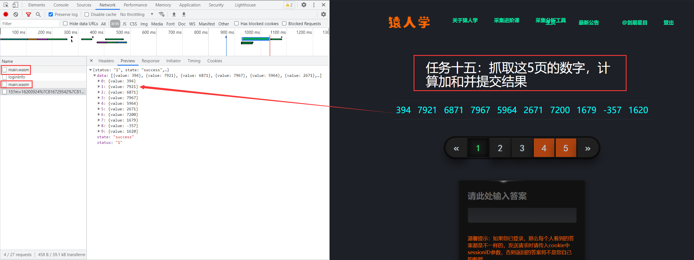
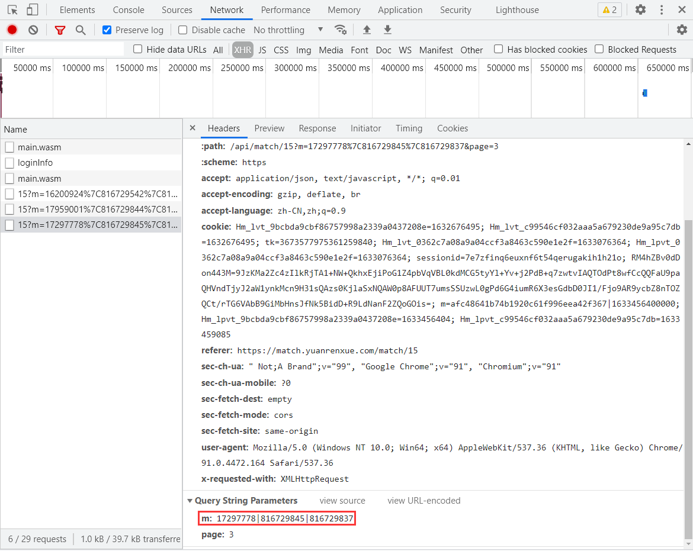
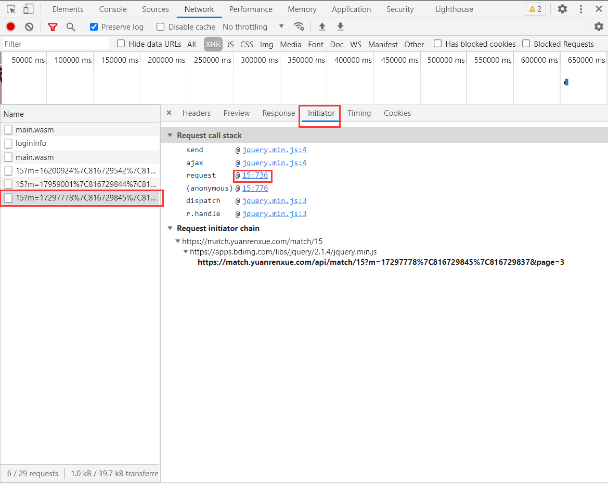
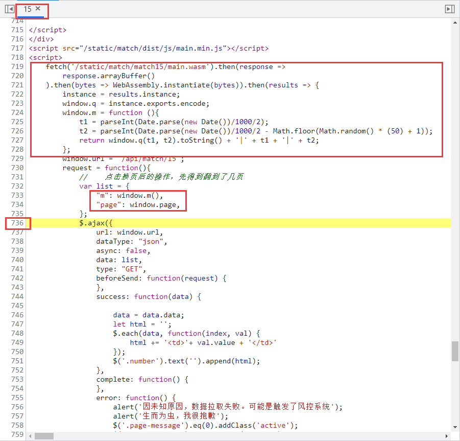
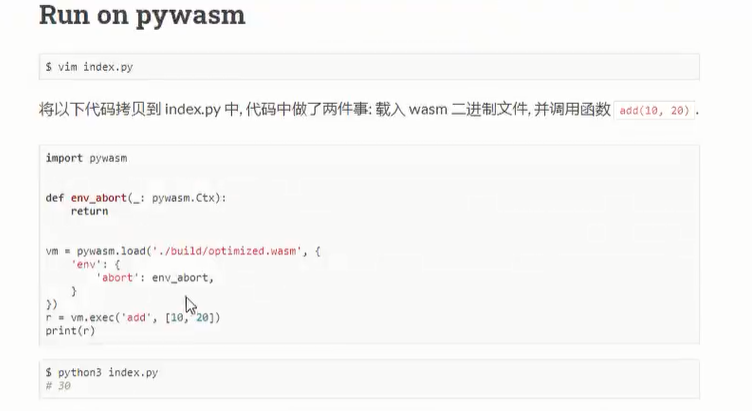
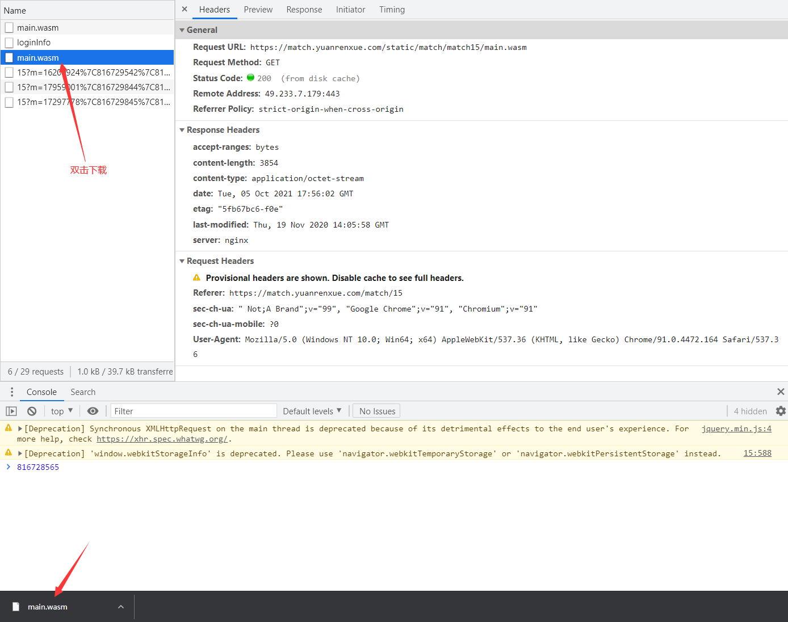
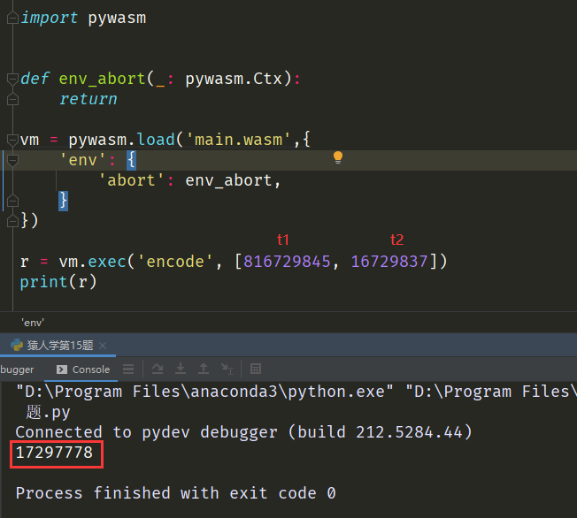

# 读取wasm文件

## 简介

猿人学是一个专注做爬虫和数据结构的卖课平台。猿人学第一届Web端爬虫攻防赛于2020年10月16日开始，总奖金3万，共设10题，主要涉及JS反混淆，CSS反加密，图文验证码对抗等技术。 参加该比赛，你能获得物质奖励，能结识一批志同道合的人，可能拿到更好的offer，欢迎你的参加。比赛已于2020年10月20日结束。

第一届Web端猿人学攻防大赛【官方网站】：https://match.yuanrenxue.com/

网址：https://match.yuanrenxue.com/match/15

难度：非常简单

## 逆向流程

### 抓包解析

首先打开Fiddler抓包工具，开启抓包状态，然后右键单击任务栏中的谷歌浏览器，点击“打开新的无痕窗口”，按F12打开“开发者工具”：


访问网址获取任务，在Network里面的Fetch/XHR选项中定位到了该网页数据的来源请求，**并且相对于前面的题目还多加载了两次 `main.wasm` 文件，直觉告诉我肯定有用，不然加载它干嘛**，继续分析：



多次访问前面3页的页面，分析比较请求头参数，得出初步接结论：**每次请求，请求头的参数没有发生变化，但参数m的值在不断发生变化，参数page则是页码数。**



### 逆向分析

现在我们需要定位到，哪一行的代码发送了当前的请求，点击左侧的Initiator选项，它主要是标记请求是由哪个对象或进程发起的（请求源），重点关注里面的request请求：



显示从一个名称为“15”的文件的第736行代码发送了当前请求，点击后面的地址，跳转到了该文件的第736行，看上面有两个很熟悉的参数page和m，而且还看到一个名称很熟悉的文件 `main.wasm`，这正是最开始第一次请求加载的文件：



这里简单解读一下上面的代码：**参数m的值来源于 `window.m()` 方法的返回值，其中返回值涉及到三个变量，`window.q` 方法、`t1`、`t2`，其中 `t1`、`t2` 的值和时间戳有关，而 `window.q` 方法和 `results` 的 `encode` 方法有关，而 `results` 就是 `main.wasm` 文件内容。**

这下就可以对加密参数完全得出结论了：

```
参数m：和变量t1、t2、main.wasm文件的encode方法有关
参数page：页码数
```

### 扣JS代码

扣JS代码之前，我们需要读取并使用 `main.wasm` 文件的 `encode` 方法，因为JS中使用到了该方法。

第一步，我们需要了解一个概念什么是 `.wasm` 文件。WebAssembly也叫浏览器字节码技术，通过WebAssembly编译后的文件即为 `.wasm` 文件。

第二步，如何通过Python来调用 `.wasm` 文件里面的方法。通过网上搜索，发现用的第三方库 `pywasm` 来进行调用，有现成的代码：



第三步：下载安装第三方库 `pywasm` ：

```
# 下载安装第三方库pywasm
pip install pywasm
```

下载并保存网站上的 `main.wasm` 文件，双击开发者工具里的`main.wasm`文件进行下载：



修改上面的示例代码，结合上面截图的m参数试运行，结果和m参数最前面的数一样：



这里我们就只需要扣生成变量 `t1` 、`t2` 的JS代码，最后返回一个数组即可：

```javascript
m = function (){
    t1 = parseInt(Date.parse(new Date())/1000/2);
    t2 = parseInt(Date.parse(new Date())/1000/2 - Math.floor(Math.random() * (50) + 1));
    return Array(t1,t2);
};
```

## 爬虫代码

```python
import re
import execjs
import pywasm
import requests

# 请求头
headers = {
    'accept': 'application/json, text/javascript, */*; q=0.01',
    'accept-encoding': 'gzip, deflate, br',
    'accept-language': 'zh-CN,zh;q=0.9',
    'cookie': 'sessionid=自己的sessionid值',
    'referer': 'https://match.yuanrenxue.com/match/12',
    'sec-ch-ua': '"Google Chrome";v="93", " Not;A Brand";v="99", "Chromium";v="93"',
    'sec-ch-ua-mobile': '?0',
    'sec-ch-ua-platform': '"Windows"',
    'sec-fetch-dest': 'empty',
    'sec-fetch-mode': 'cors',
    'sec-fetch-site': 'same-origin',
    'user-agent': 'yuanrenxue.project',
    'x-requested-with': 'XMLHttpRequest'
}

def env_abort(_: pywasm.Ctx):
    return

vm = pywasm.load('main.wasm',{
    'env': {
        'abort': env_abort,
    }
})

# 打开JS文件并加载JS文件
with open("上面js文件名称.js", 'r', encoding = 'utf-8') as f:
    content = f.read()

# 执行m方法
JsObj = execjs.compile(content).call('m')
first = vm.exec('encode', JsObj)

# 数值
values = 0

# 共5页数据
for page in range(1, 6):
    # 接口地址
    url = f'https://match.yuanrenxue.com/api/match/15?page={page}&m={first}|{JsObj[0]}|{JsObj[1]}'
    # 输出响应
    response = requests.get(url=url, headers=headers, verify=False)
    print(f'第{page}页:{response.text}')
    # 提示：会有负数存在
    for v in re.findall(r'{"value": (-?\d+)}', response.text):
        values += int(v)

# 总值
print(values)
```

