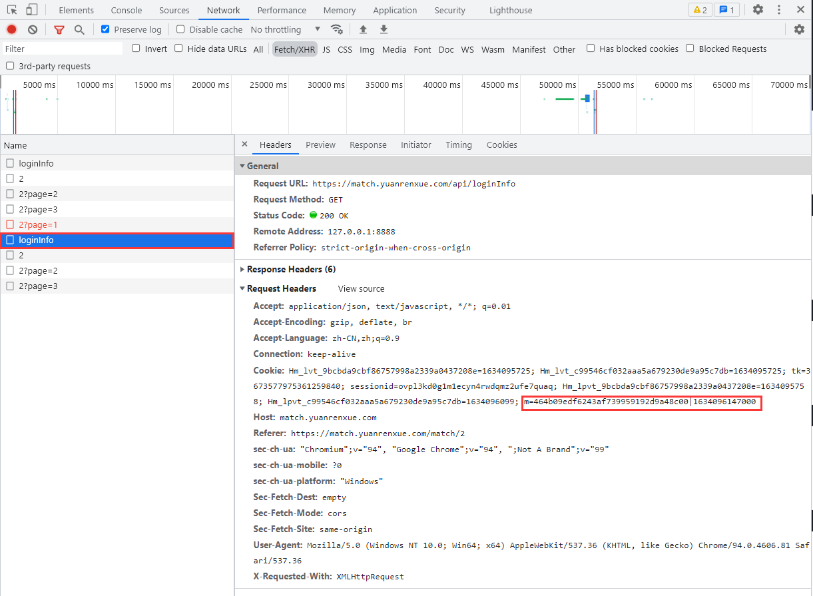
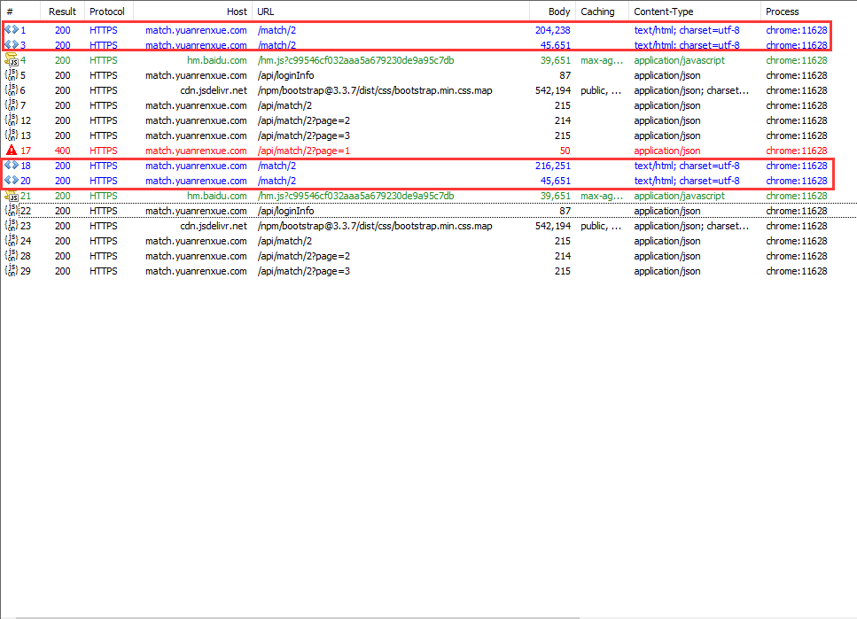
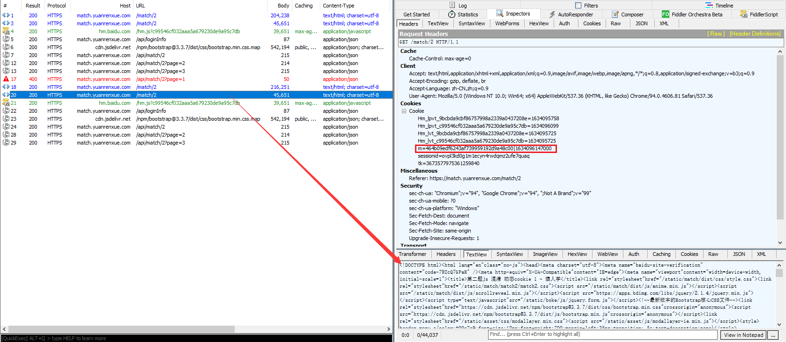
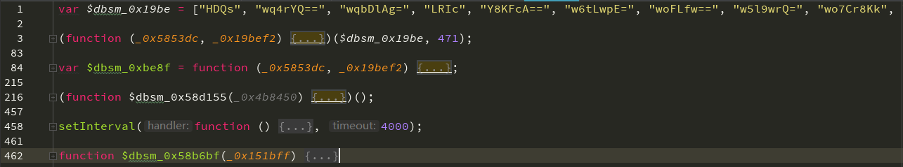

# 动态Cookie加密

## 简介

猿人学是一个专注做爬虫和数据结构的卖课平台。猿人学第一届Web端爬虫攻防赛于2020年10月16日开始，总奖金3万，共设10题，主要涉及JS反混淆，CSS反加密，图文验证码对抗等技术。 参加该比赛，你能获得物质奖励，能结识一批志同道合的人，可能拿到更好的offer，欢迎你的参加。比赛已于2020年10月20日结束。

第一届Web端猿人学攻防大赛【官方网站】：https://match.yuanrenxue.com/

网址：https://match.yuanrenxue.com/match/2

难度：简单

提示：该题和[JS逆向04-简单Cookie加密](JS逆向04-简单Cookie加密.md)非常类似

## 逆向流程

### 抓包解析

首先打开Fiddler抓包工具，开启抓包状态，并选择进程为浏览器：


然后右键单击任务栏中的谷歌浏览器，点击“打开新的无痕窗口”，按F12打开“开发者工具”：


访问网址获取任务，在Network里面的Fetch/XHR选项中定位到了该网页数据的来源请求：


多次访问前面3页的页面，发现一个规律，如果访问之间的间隔时间稍微长一点，下次访问就要求强制访问loginfo页面，**说明该页面设置的Cookie的过期时间较短**，分析比较请求头参数，结合根据以往的爬虫经验，得出初步接结论：**Cookie的加密参数为m，其中m的值有两部分组成，前半部分为加密值，后半部分为时间戳相关的参数。**



### 逆向分析

现在我们回到Fiddler抓包工具，看看所抓到的数据包：



**可以看到Fiddler抓到的数据包还是和开发者工具所抓到的数据包还是所有不同的，不同点在每次请求loginfo页面时，前面都会有两次请求，我们分别来看看两次请求分别返回了什么。**

第一次请求，可以看到返回了一段加密后的js代码，**注意这个时候加密参数m的值还是上一次请求的值**：


第二次请求，看里面的内容就是这道题所要使用的前端代码，分析作用不大，**但这个时候加密参数m的值已经发生改变**：



通过对以上请求的分析可以得出一个结论：**加密参数m的值的变化，发生在第一次请求之后，也就是说，第一次请求的返回的加密js里面改变了m的值。**

### 扣JS代码

这里我们把第一次请求返回的加密js先扣拷贝出来，**可以看到js代码被混淆加密了，而且经常出现 `\x` 这类字符，可以判定该加密混淆是ob混淆**，这里介绍一下什么是ob混淆：

ob混淆全称是 obfuscator，其官网是:https://obfuscator.io/，它是一款**免费、开源**的 JavaScript **混淆工具**,用以**保护**你的核心JavaScript代码不轻易被破解。爬虫工程师，面对这样的代码，就算经验丰富，硬刚的话，掉头发是少不了的事情，而如果你掌握了AST，将这些代码进行还原，则可以大大的降低硬钢的难度，非常的nice！

使用猿人学网页自带的ob反混淆工具，将去掉首位 `<script>` 的js代码进行反混淆：http://tool.yuanrenxue.com/decode_obfuscator

!> 该题的js代码过长，该工具只会返回部分的代码，因此只能分段反混淆，后拼接。


再将完整的反混淆后的代码格式化，美化，折叠，得到如下代码：**当中有一个名称为 `setInterval` ，这是个定时器函数，后面的 `timeout` 参数给的4000，意味着每4秒调用一次该函数。**



我们搜索关键词”cookie“发现在447行出现了”m“并且后面加上了一个字符”|“，再看前面 `document["cookie"]` 基本可以判定该m就是cookie里面的加密参数了：


结合请求中的m的值进行比较可以得出：

```
请求中：
m=73321de886f7efd22801e07ec312cdc6|1634197698000
代码中：
document["cookie"] = "m" + _0x4589e9() + "=" + _0x18960b(_0x2f947f) + "|" + _0x2f947f + "; path=/";
结论：
_0x4589e9()：返回为空
_0x18960b(_0x2f947f)：返回加密的部分
_0x2f947f：返回时间戳的部分

这下我们只需要将于该 `_0x983c32` 函数相关的js代码扣出来即可，代码如下：

```javascript

```

## 爬虫代码

```python

```

