# JS混淆乱码增强

## 简介

猿人学是一个专注做爬虫和数据结构的卖课平台。猿人学第一届Web端爬虫攻防赛于2020年10月16日开始，总奖金3万，共设10题，主要涉及JS反混淆，CSS反加密，图文验证码对抗等技术。 参加该比赛，你能获得物质奖励，能结识一批志同道合的人，可能拿到更好的offer，欢迎你的参加。比赛已于2020年10月20日结束。

第一届Web端猿人学攻防大赛【官方网站】：https://match.yuanrenxue.com/

网址：https://match.yuanrenxue.com/match/5

难度：中等

## 逆向流程

### 抓包解析

首先打开Fiddler抓包工具，开启抓包状态，然后右键单击任务栏中的谷歌浏览器，点击“打开新的无痕窗口”，按F12打开“开发者工具”：


访问网址获取任务，并在任务当中已提示“cookie有效期仅有50秒钟”，**说明有很大的可能性使用了cookie加密**，在Network里面的Fetch/XHR选项中定位到了该网页数据的来源请求，继续分析：


多次访问前面3页的页面，分析比较请求头参数并结合以往爬虫经验，可以得出初步接结论：**变动的加密参数有两大部分，cookie加密参数和get加密参数。**

```
# cookie加密参数
m：未知加密参数
RM4hZBv0dDon443M：未知加密参数

# get加密参数
page: 页码
m: 和时间戳有关
f: 和时间戳有关
```


### 逆向分析

**从上面的初步结论也可以看出来，get加密参数比较简单，我们从简单的开始弄。**

现在我们需要定位到，哪一行的代码发送了当前的请求，点击左侧的Initiator选项，它主要是标记请求是由哪个对象或进程发起的（请求源），重点关注里面的request请求：


点击request请求，就自动跳转到，对应的文件的指定位置，在上面可以看到三个熟悉的get请求参数：


重点攻克 `m` 参数的对应值 `window._$is` 和 `f` 参数的对应值 `window.$_zw[23]` 的产生来源。全局搜索 `window.$_zw` 有四处，经过断点调试发现 `window.$_zw` 原本是一个空列表，当中所有的元素来源于下面 `$_aiding.$_zw.push(元素)` 填充：


那么就有 `f = window.$_zw[23] = $_t1` 这个关系，`$_t1` 这个变量也恰好就在上面，这样我们就轻松的破解了第一个get加密的 `f` 参数：


**然而在当前文件当中搜索并未找到该参数 `m` 即 `window._$is` 的赋值过程，该条线索断开。那么我们换一条路，去定位cookie加密参数的位置，也许能有意外收获。**

任务中有提示“cookie有效期仅有50秒钟”，也就是距离上次请求时间过去50秒后，这时我们去请求其他页面必定会有一个对cookie重新赋值的过程。这时回到我们的抓包工具，对流程进行分析：


通过对比请求，发现cookie参数改变发生在 `loginInfor` 请求和 `/api/match/5` 请求之间，然而中并没有能导致cookie改变的请求或其他的js文件，那么还剩下一种可能性就是：**虚拟机产生了临时的js文件改变了cookie，然而这种临时文件是抓包工具抓不到的。**到这里可能就要讲解一下相关概念了：

**JavaScript 是一种解释型语言，在执行 JavaScript 代码过程中会生成字节码。字节码不能直接被运行的，而是运行在 JavaScript 引擎之上，一般也把JavaScript 引擎称为虚拟机（Virtual Machine）。**

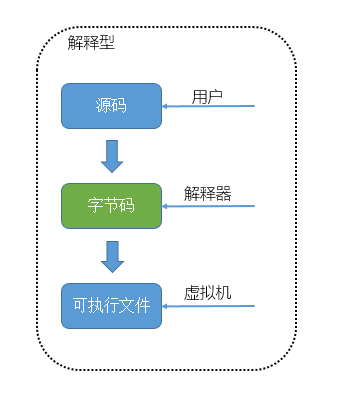

**虚拟机可以理解成软件、代码的运行环境模拟器，其中分为“系统虚拟机”和“进程虚拟机”。“系统虚拟机”提供了一个可以运行操作系统的真完整仿平台。**Mac 用户很熟悉的 Parallels 就是一个允许你在 Mac 上运行 Windows系统虚拟机。**“进程虚拟机”不具备全部的功能，(只)能运行一个程序或者进程。**Wine 是一个允许你在 Linux 机器上运行 Windows 应用的进程虚拟机，但是并不在 Linux 中提供完整的 Windows 操作系统。**JavaScript 虚拟机是一种进程虚拟机，专门设计来解释和执行的 JavaScript 代码**。下面是目前现代浏览器采用的常见JavaScript虚拟机：

- Chakra(Microsoft Internet Explorer)
- Nitro/JavaScript Core (Safari)
- Carakan (Opera)
- SpiderMonkey (Firefox)
- V8 (Chrome, Chromium)  

理解了虚拟机，接下来讲解“临时js文件”。**临时js文件名称通常以 `VM` 开头后面跟数字**，在Chrome调试中经常可以看到VM+数字的JS文件：

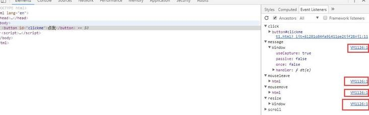

临时的js文件生成方式有两种：在**控制台里执行代码**生成临时文件、在**代码中执行了eval方法**生成临时文件。


除此之外，**使用Chrome调试临时js文件时，其背景为黄色**：


理解了临时js文件产生机制，结合上面分析流程，说明在肯定在js代码中执行了eval方法。现在我们回到js文件当中，在所有执行eval方法的地方打上断点，断点过来后，我们点击执行下一步的操作按钮：


果然就跳进了临时js文件VM当中：


注意，这里这个题有个坑就是，可能大家已经注意到了，打开console在方不停的刷”世上无难事，只要肯放弃“这段话，其来源就是这个虚拟的VM文件当中的死循环代码：


同时这也导致，浏览器的负载高，占用资源过高：

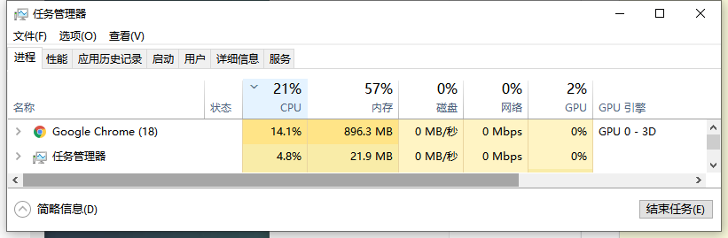

**因此，千万不能将VM文件含有死循环的代码复制到本机Pycharm的js文件当中调试，即使该文件没有在运行，由于要预加载函数，电脑的CPU也会很快满载**：


**因此从此开始，逆向代码的调试尽量在浏览器中进行，因为浏览器中已经加载好环境、函数、变量，是最好的调试场所。**

将VM文件点击格式化 `{}` 后，得到如下进3千行的代码：


**根据前面的学习经验，可以看出该代码先经过了一次ob混淆，再经过了一次utf-8编码。如果我们硬着头皮去找cookie的两个加密参数肯定不好找，因此我们这里就要学习一种新的方法：hook钩子函数**

1. hook钩子函数当中hook就是”钩、钩子“的意思，其实就是一小段代码，可以是js或其他语言编写的。
2. hook钩子函数作用就是代码运行的过程当中，当钩子函数被触发时，就停在该处。类似打断点一样，只不过打断点的位置是确定的，而hook钩子函数的断点位置是不确定的。
3. hook钩子函数本质就是代码注入，在文件代码开始运行时（可以在第一行代码打上断点）将其断住，就将hook代码注入进去，继续运行代码等待hook被触发。
4. 注入的hook代码仅当前当次页面有效使用，如果页面被刷新了，需要重新注入hook代码。

```javascript
//常用JS的HOOK代码

// hook eval方法
window.__cr_eval = window.eval; // 保存原始方法
var myeval = function(src){ // 重写eval方法
    console.log(src);
    console.log("=============== eval end ===============");
    debugger;
    return window.__cr_eval(src);
}
var _myeval = myeval.bind(null);
_myeval.toString = window.__cr_eval.toString;
Object.defineProperty(window, 'eval', {value: _myeval});

// hook Function函数
window.__cr_fun = window.Function;
var myfun = function(){
    var args = Array.prototype.slice.call(arguments, 0, -1).join(","), src = arguments[arguments.length - 1]
    console.log(src);
    console.log("=============== Function end ===============");
    debugger;
    return window.__cr_fun.apply(this, arguments);
}
myfun.toString = function(){return window.__cr_fun + ""} 
Object.defineProperty(window, 'Function', {value: myfun});

// hook JSON.stringify
var my_stringify = JSON.stringify;
JSON.stringify = function(params){
    console.log("hook", params);
    debugger;
    return my_stringify(params);
};

// hook JSON.parse
var my_parse = JSON.parse;
JSON.parse = function(params){
    console.log("hook", params);
    debugger;
    return my_parse(params);
};

// hook cookie字段RM4hZBv0dDon443M
(function () {
   Object.defineProperty(document, 'cookie', {
       set: function (cookie) {
           // 方法indexOf检索字符串的值若没有出现，则该方法返回-1。
           if(cookie.indexOf('RM4hZBv0dDon443M') != -1){
                debugger;
           }
           return cookie;
       }
   })
})();

// hook window对象
var window_flag_1 = 'object1'; // 修改为需要hook的对象
var window_flag_2 = 'object2'; // hook对象的对象

var key_value_map = {};
var window_value = window[window_flag_1];

Object.defineProperty(window, window_flag_1, {
    get: function(){
        console.log('Getting', window, window_flag_1, '=', window_value);
        debugger;
        return window_value;
    },
    set: function(val){
        console.log('Setting', window, window_flag_1, '=', val);
        debugger;
        window_value = val;
        key_value_map[window[window_flag_1]] = window_flag_1;
        set_obj_attr(window[window_flag_1], window_flag_2);
    },
});

function set_obj_attr(obj, attr){
    var obj_arrt_value = obj[attr];
    Object.defineProperty(obj, attr, {
        get:function(){
            console.log('Getting', key_value_map[obj], attr, '=', obj_arrt_value);
            debugger;
            return obj_arrt_value
        },
        set: function(val){
            console.log('Setting', key_value_map[obj], attr, '=', val);
            debugger;
            obj_arrt_value = val;
        },
    });
};
```

现在我们在VM文件第一行处打上断点，断点过来过后，因为cookie加密参数 `RM4hZBv0dDon443M` 相比于加密参数 `m` 更好定位，因此我们在console中注入以下hook代码：


?> 方法 `indexOf` 检索指定字符串的值若没有出现，则该方法返回-1。

继续运行该代码，马上hook就被触发了，**只不过当前cookie中 `RM4hZBv0dDon443M` 字段还未被定义，其方法 `indexOf` 返回值等于0，所以触发了hook，没关系点击右侧按钮继续运行**：

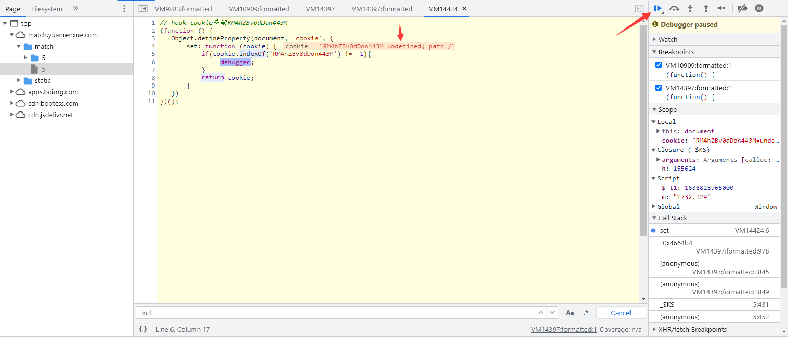

经过了几次hook触发，终于 `RM4hZBv0dDon443M` 字段被赋值了，**这时关注右侧边栏中 `Call Stack` 调用堆栈，这里可以看到函数的调用顺序，最后被调用的函数出现在最上方**，我们点击第二个栏里面的函数：


点击后，回到触发hook函数的上一步位置，发现 `RM4hZBv0dDon443M` 字段是通过字符拼接的方式生成的，所以这也给了我们一个经验，**关键的字符串在代码中不一定都是现成的，也可能是通过拼接生成**：


同时也说明了 `_0x3d0f3f[_$Fe] = document['cookie']` 这个关系：


现在可以看出， `RM4hZBv0dDon443M` 字段值等于 `_0x4e96b4['_$ss']` 的值，通过调试发现 `_0x4e96b4` 就是  `window` 窗口，但搜索没有发现给 `_$ss` 全局变量属性赋值：


那我们将上面的hook代码修改如下，再次注入：

```javascript
(function () {
   Object.defineProperty(window, '_$ss', {
       set: function (window) {
           debugger;
           return window;
       }
   })
})();
```


继续运行js文件，hook被触发，继续关注 `Call Stack` 调用堆栈中的第二栏：

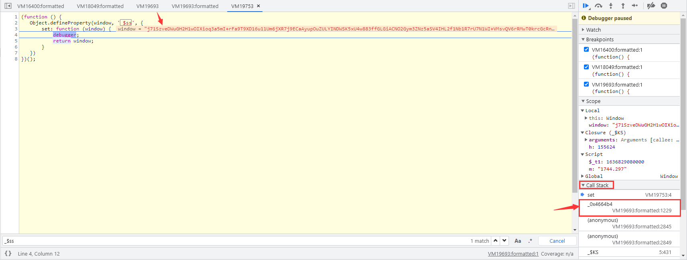

点击跳转后，发现 `_$ss` 这个变量名称竟然也是通过拼接生成的，其值等于 `_0x29dd83[toString]()` 的值：

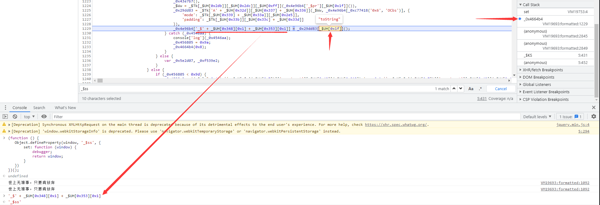

现在关注点变到 `_0x29dd83` 函数上了，刚好函数就在上方，我们将所有未知参数进行打印：

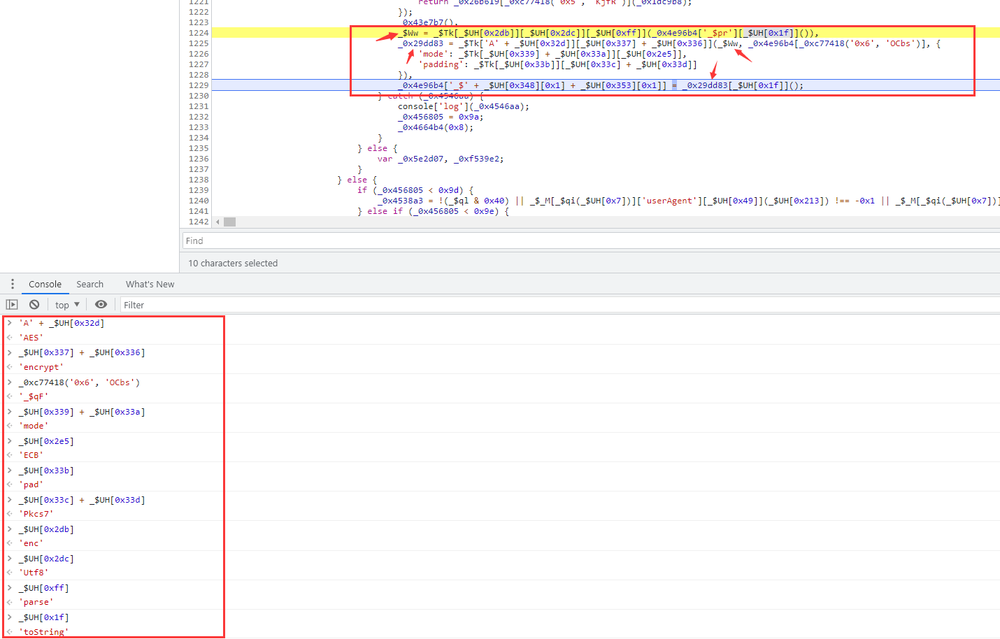

最终解析出来的代码如下：

```javascript
_$Ww = CryptoJS['enc']['Utf8']['parse'](_0x4e96b4['_$pr']['toString']());
_0x29dd83 = CryptoJS['AES']['encrypt'](_$Ww, _0x4e96b4['_$qF'], {
    'mode': CryptoJS['mode']['ECB'],
    'padding': CryptoJS['pad']['Pkcs7']
});
_0x4e96b4['_$ss'] = _0x29dd83['toString']();
```

通过打印 `_0x4e96b4['_$pr']` 是一个含有5个字符串数组的列表：

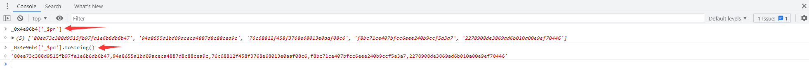

全局搜索发现初始的 `_0x4e96b4['_$pr']` 是个空数组：

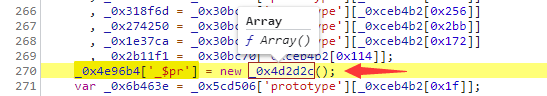

将有关 `_0x4e96b4['_$pr']` 的赋值操作全部打上断点，发现在1717行执行了5次push操作，也就是往里面推了5个字符串：


接下就是扣取和 `_0x4e96b4['_$pr']` 该变量有关的代码了，**这步需要不断的调试、替换，保持耐心。**

接下来就是 `_0x4e96b4['_$qF']` 这个变量了，通过全局搜索只有两个地方，断点显示走的上部分代码，将其他未知变量打印出来：


?> 在最后面有一个 `['slice']` 含义就是将前面的字符串进行切片，`(0x0, 0x10)` 范围就是0到16，因为0x是16进制。

接下来就是找 `_0x4e96b4['_$is']` 这个变量了，全局搜索发现3个位置，断点显示在867行进行了赋值：


扣取上面 `_0x4e96b4['_$pr']` 相关代码，就会发现 `_$yw` 这个变量已经扣过了：

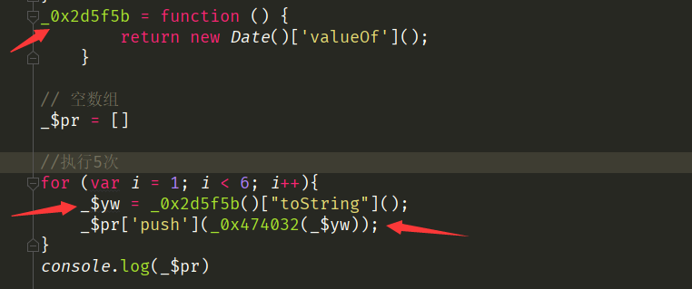

这下就可以宣告 `RM4hZBv0dDon443M` 字段加密参数已经全部知晓了，下面根据 `_0x3d0f3f[_$Fe] = document['cookie']` 这个关系继续查找参数 `m` 赋值点。发现就在1716行，而且和 `_0x4e96b4['_$qF']` 这个变量用的值都是一样的，利用上面的结论： **`_0x4e96b4['_$pr']` 执行了5次push操作，通过代码逻辑可知 `m` 的值变了5次，即等于最后一次所附值，这下也就宣告参数 `m` 的值破解成功了**：


现在我们搞定了cookie的加密参数，接下来就是回看get加密的 `m` 参数：

```
"m": window._$is
```

对照VM虚拟文件内容发现 `window._$is = _0x4e96b4['_$is']` 关系，get中 `m` 参数的值就是一个时间戳：

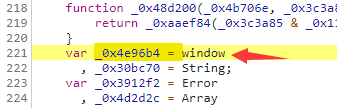


那么现在所有的加密参数都已破解成功！

### 扣JS代码

```javascript
f = Date.parse(new Date());
console.log('get参数：' + f)


_0x4e96b4['_$pr']['push'](_0x474032(_$Wa));

_$Ww = CryptoJS["enc"]["Utf8"]["parse"](_0x4e96b4['_$pr']["toString"]())
_0x29dd83 = CryptoJS["AES"]["encrypt"](_$Ww, _0x4e96b4["_$qF"], {
    'mode': CryptoJS["mode"]["ECB"],
    'padding': CryptoJS["pad"]["Pkcs7"]
})

_$ss = _0x29dd83["toString"]()
cookie1 = 'RM4hZBv0dDon443M=' + _$ss;
```

## 爬虫代码

```python

```

