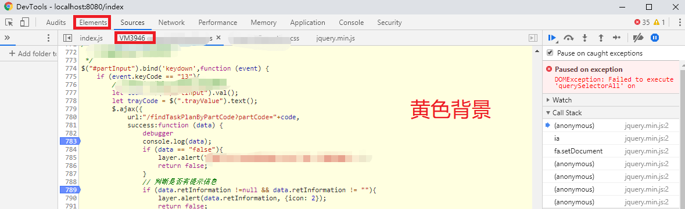

# JS混淆乱码增强

## 简介

猿人学是一个专注做爬虫和数据结构的卖课平台。猿人学第一届Web端爬虫攻防赛于2020年10月16日开始，总奖金3万，共设10题，主要涉及JS反混淆，CSS反加密，图文验证码对抗等技术。 参加该比赛，你能获得物质奖励，能结识一批志同道合的人，可能拿到更好的offer，欢迎你的参加。比赛已于2020年10月20日结束。

第一届Web端猿人学攻防大赛【官方网站】：https://match.yuanrenxue.com/

网址：https://match.yuanrenxue.com/match/5

难度：中等

## 逆向流程

### 抓包解析

首先打开Fiddler抓包工具，开启抓包状态，然后右键单击任务栏中的谷歌浏览器，点击“打开新的无痕窗口”，按F12打开“开发者工具”：


访问网址获取任务，并在任务当中已提示“cookie有效期仅有50秒钟”，**说明有很大的可能性使用了cookie加密**，在Network里面的Fetch/XHR选项中定位到了该网页数据的来源请求，继续分析：


多次访问前面3页的页面，分析比较请求头参数并结合以往爬虫经验，可以得出初步接结论：**变动的加密参数有两大部分，cookie加密参数和get加密参数。**

```
# cookie加密参数
m：未知加密参数
RM4hZBv0dDon443M：未知加密参数

# get加密参数
page: 页码
m: 和时间戳有关
f: 和时间戳有关
```


### 逆向分析

**从上面的初步结论也可以看出来，get加密参数比较简单，我们从简单的开始弄。**

现在我们需要定位到，哪一行的代码发送了当前的请求，点击左侧的Initiator选项，它主要是标记请求是由哪个对象或进程发起的（请求源），重点关注里面的request请求：


点击request请求，就自动跳转到，对应的文件的指定位置，在上面可以看到三个熟悉的get请求参数：


重点攻克 `m` 参数的对应值 `window._$is` 和 `f` 参数的对应值 `window.$_zw[23]` 的产生来源。**然而在当前文件当中搜索并未找到该参数的赋值过程，该条线索断开。那么我们换一条路，去定位cookie加密参数的位置，也许能有意外收获。**

任务中有提示“cookie有效期仅有50秒钟”，也就是距离上次请求时间过去50秒后，这时我们去请求其他页面必定会有一个对cookie重新赋值的过程。这时回到我们的抓包工具，对流程进行分析：


通过对比请求，发现cookie参数改变发生在 `loginInfor` 请求和 `/api/match/5` 请求之间，然而中并没有能导致cookie改变的请求或其他的js文件，那么还剩下一种可能性就是：**虚拟机产生了临时的js文件改变了cookie，然而这种临时文件是抓包工具抓不到的。**到这里可能就要讲解一下相关概念了：

**JavaScript 是一种解释型语言，在执行 JavaScript 代码过程中会生成字节码。字节码不能直接被运行的，而是运行在 JavaScript 引擎之上，一般也把JavaScript 引擎称为虚拟机（Virtual Machine）。**


**虚拟机可以理解成软件、代码的运行环境模拟器，其中分为“系统虚拟机”和“进程虚拟机”。“系统虚拟机”提供了一个可以运行操作系统的真完整仿平台。**Mac 用户很熟悉的 Parallels 就是一个允许你在 Mac 上运行 Windows系统虚拟机。**“进程虚拟机”不具备全部的功能，(只)能运行一个程序或者进程。**Wine 是一个允许你在 Linux 机器上运行 Windows 应用的进程虚拟机，但是并不在 Linux 中提供完整的 Windows 操作系统。**JavaScript 虚拟机是一种进程虚拟机，专门设计来解释和执行的 JavaScript 代码**。下面是目前现代浏览器采用的常见JavaScript虚拟机：

- Chakra(Microsoft Internet Explorer)
- Nitro/JavaScript Core (Safari)
- Carakan (Opera)
- SpiderMonkey (Firefox)
- V8 (Chrome, Chromium)  

理解了虚拟机，接下来讲解“临时js文件”。**临时js文件名称通常以 `VM` 开头后面跟数字**，在Chrome调试中经常可以看到VM+数字的JS文件：


临时的js文件生成方式有两种：在**控制台里执行代码**生成临时文件、在**代码中执行了eval方法**生成临时文件。


除此之外，**使用Chrome调试临时js文件时，其背景为黄色**：



理解了临时js文件产生机制，结合上面分析流程，说明在肯定在js代码中执行了eval方法。现在我们回到js文件当中，在所有执行eval方法的地方打上断点，断点过来后，我们点击执行下一步的操作按钮：


果然就跳进了临时js文件VM当中：


**可以看到js代码中频繁出现 `\x` 字符，说明js代码被utf8编码过一次。 从这里开始，后面的步骤就和[JS逆向08-JS混淆源码乱码](JS逆向08-JS混淆源码乱码.md)类似了，因为他也是在临时文件中进行调试。**将临时js文件中的代码拷贝出来，放入反混淆工具http://tool.yuanrenxue.com/decode_obfuscator中进行解码：


将反编码后的代码结果拷贝出来，进行格式化、折叠，发现整个代码就是一个大的js函数，并且在函数的**开头可以看到明显的一个数组，这就是ob混淆的常见特性。**


我们继续修剪代码，该删除的删除，该替换的替换。回看cookie加密参数有两个，一个是 `m` 参数，另一个是 `RM4hZBv0dDon443M` 参数，我们在代码当中搜索 `RM4hZBv0dDon443M` 字符串，发现全局就一个相关参数，说明就是它了：


这下就可以对加密参数完全得出结论了：

```

```

### 扣JS代码

修改上面的示例代码，结合上面截图的m参数试运行，结果和m参数最前面的数一样：

这里我们就只需要扣生成变量 `t1` 、`t2` 的JS代码，最后返回一个数组即可：

```javascript

```

## 爬虫代码

```python

```

