# 加速乐

## 简单加速乐

这道题是猿人学内部题目，没有会员也是进不去的，就不提供网址了，只分享解题流程。

题目难度：简单

### 逆向流程

#### 抓包解析

首先打开Fiddler抓包工具，开启抓包状态，选择抓取经过浏览器的数据包：


然后右键单击任务栏中的谷歌浏览器，点击“打开新的无痕窗口”，按F12打开“开发者工具”：


访问题目获取题目信息后，我们从Doc选项卡中的第二个请求找到了数据来源：

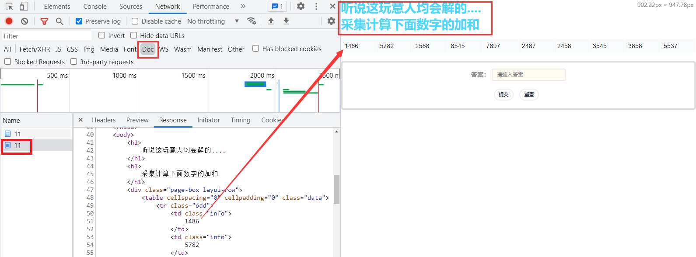

**查看Fiddler的抓包一模一样，也是有两次请求，数据出现在了第二次请求响应中，而且和第一次请求相比发现在Cookie中多了一个 `__jsl_clearance` 字段，这就是加速乐的典型特征：**

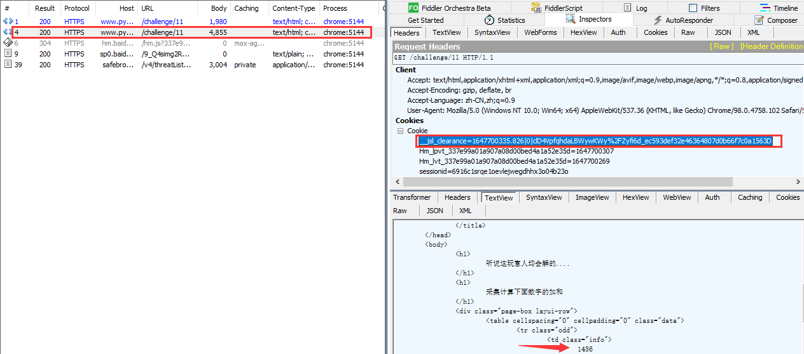

那就毫无疑问了，肯定是上一个请求返回的响应使Cookie中添加了 `__jsl_clearance` 字，查看第一个请求的响应是一串JS代码：

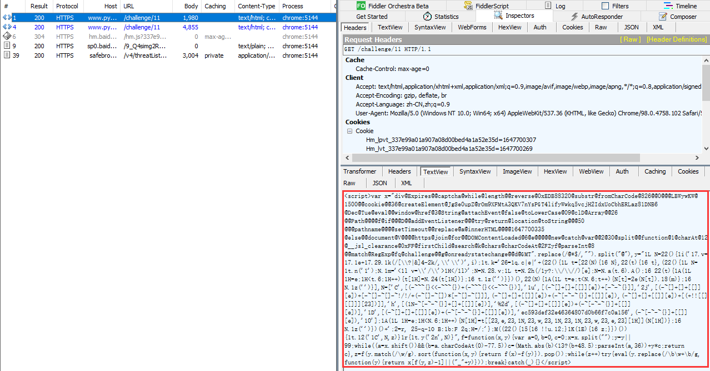

#### 逆向分析

将代码拷贝到Pycharm当中，去掉头尾 `<script>` 标签后，格式化得到如下代码，**而且运行这段代码一直没有结果输出，那么这十几行的代码唯一可疑的地方就是 `while(z++)try{}catch{}` 循环异常处理这段：**

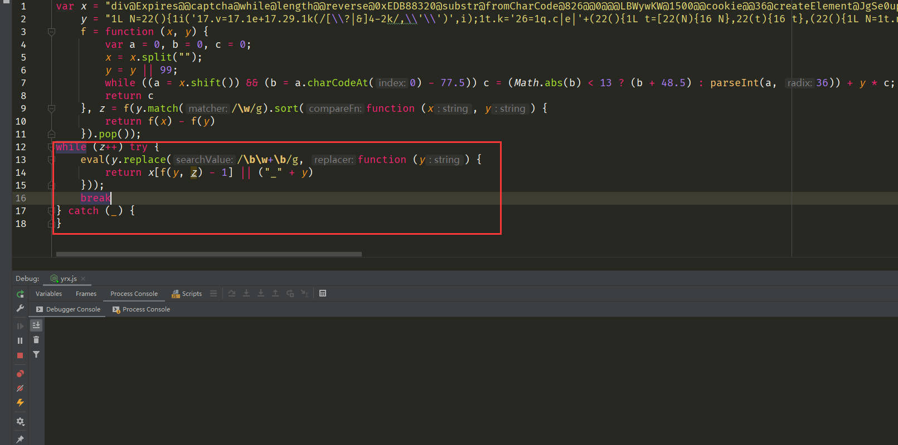

我们在catch当中添加输出操作，运行代码发现不断的在输出 `error`，那么就说明上面的**eval函数执行的字符串类型的JS代码报错了**：

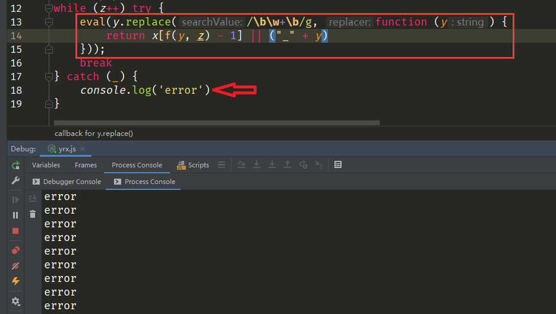

我们将 `eval` 函数改成 `console.log` 函数进行输出，得到了下面的JS代码：

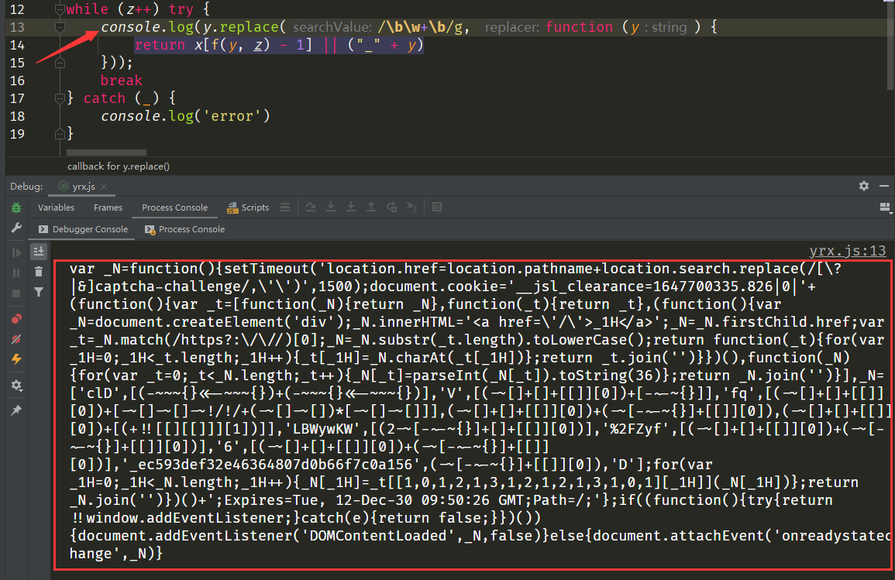

**继续拷贝JS代码并进行格式化，但要注意 `_N` 变量后面赋值的内容有格式化检测，不能对其进行格式化，否则会报错：**

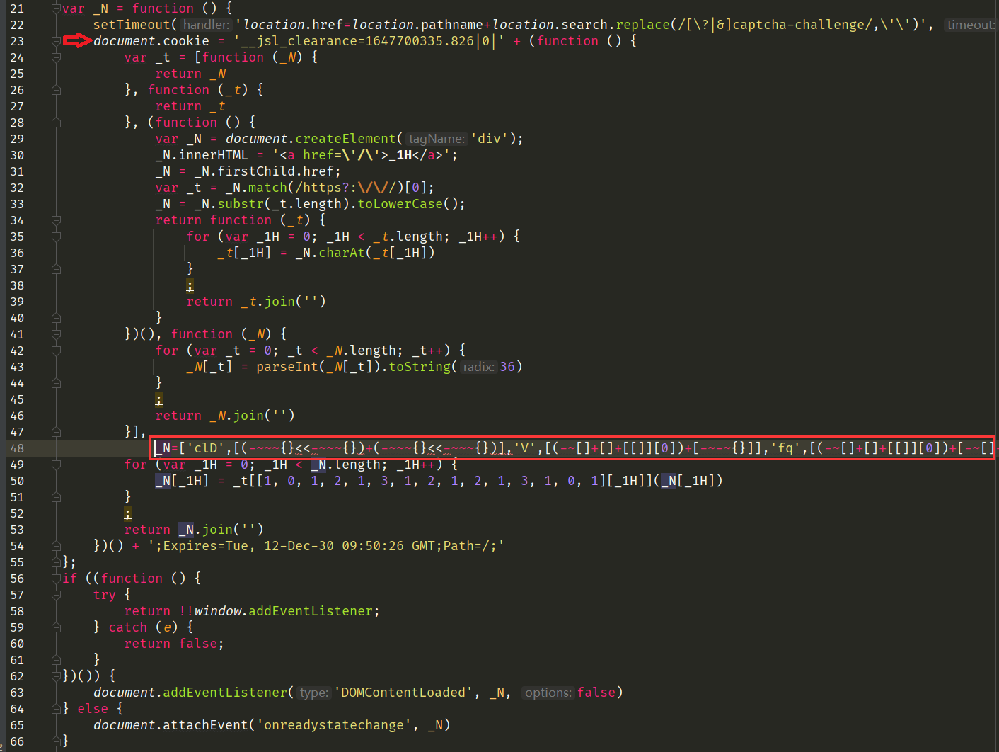

首先我们看看这段代码，其实已经很明显了，在函数第23行中 `document.cookie` 就是我们想要的值。现在，我们开始上往下补环境：

**第22行有一个setTimeout定时器来进行刷新操作，并使用到了 `location.pathname`、`location.search` 变量在Console栏打印得到，因此这行补的环境内容如下：**

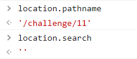

```javascript
setTimeout = function(){};
location = {};
// 提示location.href是被赋值不用补。
location.pathname = '/challenge/11';
location.search = '';
```

第23行使用 `document.cookie` 属性，因此所补的环境如下：

```javascript
document = {};
document.cookie = '';
```

**第29行 `var _N = document.createElement('div');` 创建了一个div标签节点，这里要注意的是关于这种标签节点的都是补不了的，但可以用函数临时返回空进行替代，因此所补的环境如下：**

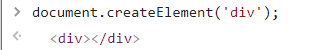

```javascript
// 上面定义了document就直接写，这里函数名必须和方法一样才有替换效果
document.createElement = function(val){
    return ''
}
```

**第30行 `_N.innerHTML = '<a href=\'/\'>_1H</a>';` 给 `innerHTML` 属性赋值，说明29行结果返回的是一个对象且有这个属性，因此修改上面代码为：**

```javascript
// 修改上面代码
document.createElement = function(val){
    return {
        // 该属性是被赋值操作，直接置为空
        innerHTML: "", 
    }
}
```

**第31行 `_N = _N.firstChild.href;` 给 `_N` 变量赋值对象的 `firstChild` 中的 `href` 属性值，说明该对象有该属性，直接打印 `_N.firstChild.href` 值如下，因此修改上面代码为：**

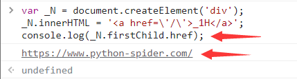

```javascript
// 修改上面代码
document.createElement = function(val){
    return {
        innerHTML: "", 
        // 直接将该对象的属性值置为结果值
        firstChild: {
            href: "https://www.python-spider.com/"
        }
    }
}
```

**第58行 `return !!window.addEventListener;` 返回了一个事件监听的布尔值，通过在浏览器调试实际返回的是一个 `true`，因此我们可以将此函数置空，其关系如下图，因此我们所补的代码如下：**

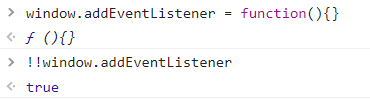

```javascript
window = global;
window.addEventListener = function (){};
```

**第63行 `document.addEventListener('DOMContentLoaded', _N, false)` 添加了一个事件监听，并传入3个实参，其中一个就是 `_N` 函数，传入了肯定是要执行的，因此我们所补的代码如下：**

```javascript
// 上面定义了document就直接写
document.addEventListener = function (a, b, c){
    b()
};
```

**第64行 `document.attachEvent('onreadystatechange', _N)` 通过调试发现并不走这行代码，直接置为空函数即可，因此我们所补的代码如下：**

```javascript
document.attachEvent = function (){};
```

最后我们添加一个cookie的输出操作：

```javascript
console.log(document.cookie);
```

将上面所有代码补全后，运行就得到了正确的结果了：

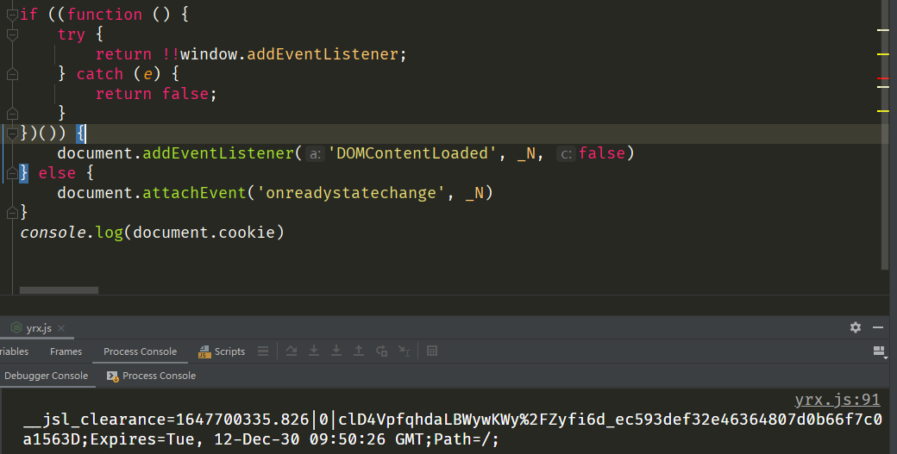

**但到这里还没有结束，这是因为这段代码是eval函数执行的第二层代码，我们需要在第一层去执行看看效果，将所有补环境的代码拷贝到第一层代码的最上面运行，记得将之前第一层的 `console.log` 改回 `eval` 函数，发现也能得到正确的结果：**

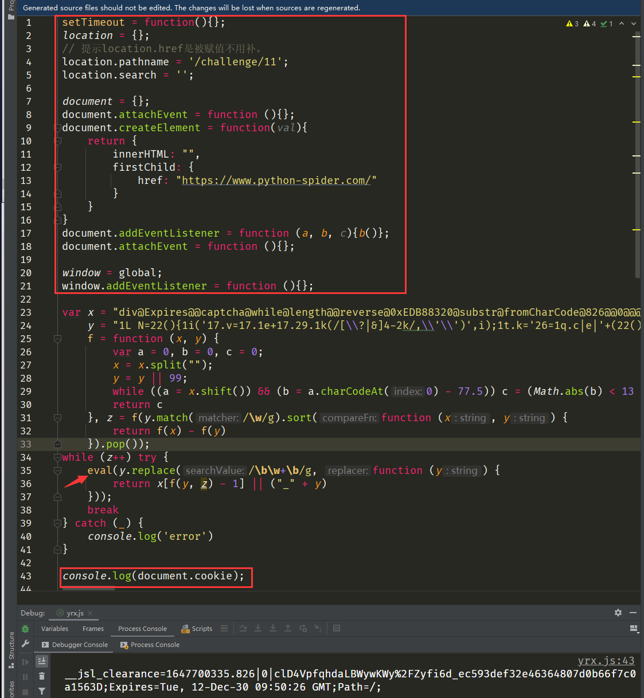

#### 抠JS代码

通过上面的分析，可以直接使用上面的JS代码。还有个问题，就是第一次请求的返回的JS代码是否每次都一样？但确定的是肯定要执行第一层响应的JS代码，因此我们可以封装第一响应的JS代码为sdk，直接放在爬虫代码中运行：

```javascript
function sdk(){
    setTimeout = function(){};
    location = {};
    // 提示location.href是被赋值不用补。
    location.pathname = '/challenge/11';
    location.search = '';

    document = {};
    document.attachEvent = function (){};
    document.createElement = function(val){
    return {
        innerHTML: "",
        firstChild: {
            href: "https://www.python-spider.com/"
            }
        }
    }
    document.addEventListener = function (a, b, c){b()};
    document.attachEvent = function (){};

    window = global;
    window.addEventListener = function (){};
    
    // 添加第一次请求响应的JS代码
    
    return document.cookie;}
```

### 爬虫代码

```python
import re

import execjs
import requests

# 建立一个会话
session = requests.session()
# 忽略警告
requests.packages.urllib3.disable_warnings()

def conversion(head):
    items = [item.split(': ') for item in head.split('\n')]
    header = {}
    for item in items:
        header.update({item[0]: item[1]})
    return header

page_header = '''Host: www.python-spider.com
Connection: keep-alive
Cache-Control: max-age=0
sec-ch-ua: " Not A;Brand";v="99", "Chromium";v="98", "Google Chrome";v="98"
sec-ch-ua-mobile: ?0
sec-ch-ua-platform: "Windows"
Upgrade-Insecure-Requests: 1
User-Agent: Mozilla/5.0 (Windows NT 10.0; Win64; x64) AppleWebKit/537.36 (KHTML, like Gecko) Chrome/98.0.4758.102 Safari/537.36
Accept: text/html,application/xhtml+xml,application/xml;q=0.9,image/avif,image/webp,image/apng,*/*;q=0.8,application/signed-exchange;v=b3;q=0.9
Sec-Fetch-Site: none
Sec-Fetch-Mode: navigate
Sec-Fetch-User: ?1
Sec-Fetch-Dest: document
Accept-Encoding: gzip, deflate, br
Accept-Language: zh-CN,zh;q=0.9
Cookie: Hm_lvt_337e99a01a907a08d00bed4a1a52e35d=1647700269; sessionid=tt6oofp2v5ikwc3q8unucwx12l2abgb4; Hm_lpvt_337e99a01a907a08d00bed4a1a52e35d=1647768259'''

try:
    # 固定请求头
    session.headers = conversion(page_header)
    # 数据地址
    url = 'https://www.python-spider.com/challenge/11'
    # 第一层访问
    response = session.get(url=url,  verify=False, timeout=10)
    if response.status_code != 200:
        print('访问报错')
    # 去掉<script>标签
    js_one = re.findall(r'<script>(.*)</script>', response.text)[0]
    # 添加补环境的代码
    js_content = '''
        function sdk(){
            setTimeout = function(){};
            location = {};
            // 提示location.href是被赋值不用补。
            location.pathname = '/challenge/11';
            location.search = '';
            
            document = {};
            document.attachEvent = function (){};
            document.createElement = function(val){
                return {
                    innerHTML: "",
                    firstChild: {
                        href: "https://www.python-spider.com/"
                    }
                }
            }
            document.addEventListener = function (a, b, c){b()};
            document.attachEvent = function (){};
            
            window = global;
            window.addEventListener = function (){};''' + js_one + '''return document.cookie;}
    '''
    # 编译JS代码，执行sdk函数
    JsObj = execjs.compile(js_content).call('sdk')
    # 获取__jsl_clearance的值，更新到cookie当中
    cookie = session.headers.get('Cookie') + ';' + JsObj.split('=')[0] + '=' + JsObj.split('=')[1].split(';')[0]
    session.headers.update({'Cookie': cookie})
    # 第二层访问
    response = session.get(url=url, verify=False, timeout=10)
    if response.status_code != 200:
        print('访问报错')
    # 获取值列表
    str_list = re.findall(r'<td class="info">.*?(\d+)', response.text, re.S)
    num_list = [int(item) for item in str_list]
    print(f'结果值和为：{sum(num_list)}')
except Exception as e:
    print(f'报错：{e}')
```
