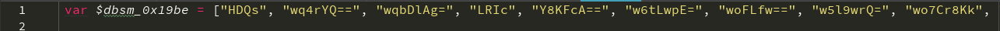

# 动态Cookie加密

## 动态Cookie值

猿人学是一个专注做爬虫和数据结构的卖课平台。猿人学第一届Web端爬虫攻防赛于2020年10月16日开始，总奖金3万，共设10题，主要涉及JS反混淆，CSS反加密，图文验证码对抗等技术。 参加该比赛，你能获得物质奖励，能结识一批志同道合的人，可能拿到更好的offer，欢迎你的参加。比赛已于2020年10月20日结束。

第一届Web端猿人学攻防大赛【官方网站】：https://match.yuanrenxue.com/

网址：https://match.yuanrenxue.com/match/2

难度：简单

### 逆向流程

#### 抓包解析

首先打开Fiddler抓包工具，开启抓包状态，并选择进程为浏览器：


然后右键单击任务栏中的谷歌浏览器，点击“打开新的无痕窗口”，按F12打开“开发者工具”：


访问网址获取任务，在Network里面的Fetch/XHR选项中定位到了该网页数据的来源请求：


多次访问前面3页的页面，发现一个规律，如果访问之间的间隔时间稍微长一点，下次访问就要求强制访问loginfo页面，**说明该页面设置的Cookie的过期时间较短**，分析比较请求头参数，结合根据以往的爬虫经验，得出初步接结论：**Cookie的加密参数为m，其中m的值有两部分组成，前半部分为加密值，后半部分为时间戳相关的参数。**


#### 逆向分析

现在我们回到Fiddler抓包工具，看看所抓到的数据包：


**可以看到Fiddler抓到的数据包还是和开发者工具所抓到的数据包还是所有不同的，不同点在每次请求loginfo页面时，前面都会有两次请求，我们分别来看看两次请求分别返回了什么。**

第一次请求，可以看到返回了一段加密后的js代码，**注意这个时候加密参数m的值还是上一次请求的值**：


第二次请求，看里面的内容就是这道题所要使用的前端代码，分析作用不大，**但这个时候加密参数m的值已经发生改变**：


通过对以上请求的分析可以得出一个结论：**加密参数m的值的变化，发生在第一次请求之后，也就是说，第一次请求的返回的加密js里面改变了m的值。**

#### 扣JS代码

我们把第一次请求返回的加密js先扣拷贝出来，可以看到js代码中经常出现 `\x` 这类字符，说明代码通过一次utf-8编码。这里使用猿人学网页自带的ob反混淆工具，注意将去掉首位 `<script>` 的js代码，再进行反编码：http://tool.yuanrenxue.com/decode_obfuscator


!> 注意：该题的js代码过长，该工具只会返回部分的代码，因此只能分段反编码，后拼接。



看看反编码后的样子，**第一行可以看到明显的一个数组，这就是ob混淆的常见特性。**不清楚什么是ob混淆回看《逆向基础》中编码与混淆章节。

再将完整的反混淆后的代码格式化，美化，折叠，得到如下代码：**当中有一个名称为 `setInterval` ，这是个定时函数，后面的 `timeout` 参数给的4000，意味着每4秒调用一次该函数。**


我们搜索关键词”cookie“发现在447行出现了”m“并且后面加上了一个字符”|“，再看前面 `document["cookie"]` 基本可以判定该m就是cookie里面的加密参数了。结合请求中的m的值进行比较可以得出：

```
浏览器请求中：
m=73321de886f7efd22801e07ec312cdc6|1634197698000
js代码中：
document["cookie"] = "m" + _0x4589e9() + "=" + _0x18960b(_0x2f947f) + "|" + _0x2f947f + "; path=/";
结论：
_0x4589e9()：返回为空
_0x18960b(_0x2f947f)：返回加密的部分
_0x2f947f：返回时间戳的部分
```


这下我们只需要将涉及 `_0x983c32` 函数相关的js代码扣出来即可，代码如下：

!> 注意： `_0x4589e9` 函数里面执行时间过长，而且执行了 `$dbsm_0x58b6bf` 函数调用了Debugger，可以跳过该函数，调试的时候直接查漏补缺。

```javascript
  qz = [10, 99, 111, 110, 115, 111, 108, 101, 32, 61, 32, 110, 101, 119, 32, 79, 98, 106, 101, 99, 116, 40, 41, 10, 99, 111, 110, 115, 111, 108, 101, 46, 108, 111, 103, 32, 61, 32, 102, 117, 110, 99, 116, 105, 111, 110, 32, 40, 115, 41, 32, 123, 10, 32, 32, 32, 32, 119, 104, 105, 108, 101, 32, 40, 49, 41, 123, 10, 32, 32, 32, 32, 32, 32, 32, 32, 102, 111, 114, 40, 105, 61, 48, 59, 105, 60, 49, 49, 48, 48, 48, 48, 48, 59, 105, 43, 43, 41, 123, 10, 32, 32, 32, 32, 32, 32, 32, 32, 104, 105, 115, 116, 111, 114, 121, 46, 112, 117, 115, 104, 83, 116, 97, 116, 101, 40, 48, 44, 48, 44, 105, 41, 10, 32, 32, 32, 32, 32, 32, 32, 32, 32, 32, 32, 32, 125, 10, 32, 32, 32, 32, 125, 10, 10, 125, 10, 99, 111, 110, 115, 111, 108, 101, 46, 116, 111, 83, 116, 114, 105, 110, 103, 32, 61, 32, 39, 91, 111, 98, 106, 101, 99, 116, 32, 79, 98, 106, 101, 99, 116, 93, 39, 10, 99, 111, 110, 115, 111, 108, 101, 46, 108, 111, 103, 46, 116, 111, 83, 116, 114, 105, 110, 103, 32, 61, 32, 39, 402, 32, 116, 111, 83, 116, 114, 105, 110, 103, 40, 41, 32, 123, 32, 91, 110, 97, 116, 105, 118, 101, 32, 99, 111, 100, 101, 93, 32, 125, 39, 10];

  function _0x5045da(_0x1d54b7, _0x16671a, _0x212b60, _0xc68bea, _0x57f20c, _0x3a44d9, _0x4d2d1d) {
    return _0xe84997(_0x212b60 ^ (_0x16671a | ~_0xc68bea), _0x1d54b7, _0x16671a, _0x57f20c, _0x3a44d9, _0x4d2d1d);
  }

  function _0x2a78c6(_0x24ab9e, _0x42f248, _0x3bc904, _0x1eeb14, _0x188240, _0x11a4be, _0xc373a) {
    return _0xe84997(_0x42f248 ^ _0x3bc904 ^ _0x1eeb14, _0x24ab9e, _0x42f248, _0x188240, _0x11a4be, _0xc373a);
  }

  function _0x5479ef(_0x4ebc8c, _0x145bdd, _0x242399, _0x586e47, _0x22d7cd, _0x5b302e, _0x32dd8d) {
    return _0xe84997(_0x145bdd & _0x586e47 | _0x242399 & ~_0x586e47, _0x4ebc8c, _0x145bdd, _0x22d7cd, _0x5b302e, _0x32dd8d);
  }

  function _0x31485c(_0x86f8b3, _0x582b27) {
    return _0x86f8b3 << _0x582b27 | _0x86f8b3 >>> 32 - _0x582b27;
  }

  function _0x5ddaeb(_0x1fabfa, _0x54a1f7) {
    var _0x3c20f2 = (65535 & _0x1fabfa) + (65535 & _0x54a1f7);

    return (_0x1fabfa >> 16) + (_0x54a1f7 >> 16) + (_0x3c20f2 >> 16) << 16 | 65535 & _0x3c20f2;
  }

  function _0xe84997(_0x3c964b, _0x5cfff2, _0x3178f5, _0x4ae303, _0x461767, _0x512958) {
    return _0x5ddaeb(_0x31485c(_0x5ddaeb(_0x5ddaeb(_0x5cfff2, _0x3c964b), _0x5ddaeb(_0x4ae303, _0x512958)), _0x461767), _0x3178f5);
  }

  function _0x27ddbe(_0x532b40, _0x327f67, _0x5e3950, _0x48b9fc, _0x375495, _0xde81f8, _0x415889) {
    return _0xe84997(_0x327f67 & _0x5e3950 | ~_0x327f67 & _0x48b9fc, _0x532b40, _0x327f67, _0x375495, _0xde81f8, _0x415889);
  }

  function _0x34aa6a(_0x13872e) {
    var _0x3cdb3a,
        _0x4e04cb = [];

    for (_0x4e04cb[(_0x13872e["length"] >> 2) - 1] = undefined, _0x3cdb3a = 0; _0x3cdb3a < _0x4e04cb["length"]; _0x3cdb3a += 1) _0x4e04cb[_0x3cdb3a] = 0;

    var _0x3ba6f3 = 8 * _0x13872e["length"];

    for (_0x3cdb3a = 0; _0x3cdb3a < _0x3ba6f3; _0x3cdb3a += 8) _0x4e04cb[_0x3cdb3a >> 5] |= (255 & _0x13872e["charCodeAt"](_0x3cdb3a / 8)) << _0x3cdb3a % 32;

    return _0x4e04cb;
  }

  function _0x287771(_0x56dd7d, _0x4fbd9a) {
    _0x56dd7d[_0x4fbd9a >> 5] |= 128 << _0x4fbd9a % 32, _0x56dd7d[14 + (_0x4fbd9a + 64 >>> 9 << 4)] = _0x4fbd9a;

    if (qz) {
      var _0x436248,
          _0x2fa60b,
          _0x10dbc4,
          _0x185b23,
          _0x259ed0,
          _0x1506d0 = 1732584193,
          _0x5807b4 = -271733879,
          _0x42adce = -1732584194,
          _0x238ad9 = 271733878;
    } else {
      var _0x436248,
          _0x2fa60b,
          _0x10dbc4,
          _0x185b23,
          _0x259ed0,
          _0x1506d0 = 0,
          _0x5807b4 = -0,
          _0x42adce = -0,
          _0x238ad9 = 0;
    }

    for (_0x436248 = 0; _0x436248 < _0x56dd7d["length"]; _0x436248 += 16) _0x2fa60b = _0x1506d0, _0x10dbc4 = _0x5807b4, _0x185b23 = _0x42adce, _0x259ed0 = _0x238ad9, _0x1506d0 = _0x27ddbe(_0x1506d0, _0x5807b4, _0x42adce, _0x238ad9, _0x56dd7d[_0x436248], 7, -680876936), _0x238ad9 = _0x27ddbe(_0x238ad9, _0x1506d0, _0x5807b4, _0x42adce, _0x56dd7d[_0x436248 + 1], 12, -389564586), _0x42adce = _0x27ddbe(_0x42adce, _0x238ad9, _0x1506d0, _0x5807b4, _0x56dd7d[_0x436248 + 2], 17, 606105819), _0x5807b4 = _0x27ddbe(_0x5807b4, _0x42adce, _0x238ad9, _0x1506d0, _0x56dd7d[_0x436248 + 3], 22, -1044525330), _0x1506d0 = _0x27ddbe(_0x1506d0, _0x5807b4, _0x42adce, _0x238ad9, _0x56dd7d[_0x436248 + 4], 7, -176418897), _0x238ad9 = _0x27ddbe(_0x238ad9, _0x1506d0, _0x5807b4, _0x42adce, _0x56dd7d[_0x436248 + 5], 12, 1200080426), _0x42adce = _0x27ddbe(_0x42adce, _0x238ad9, _0x1506d0, _0x5807b4, _0x56dd7d[_0x436248 + 6], 17, -1473231341), _0x5807b4 = _0x27ddbe(_0x5807b4, _0x42adce, _0x238ad9, _0x1506d0, _0x56dd7d[_0x436248 + 7], 22, -45705983), _0x1506d0 = _0x27ddbe(_0x1506d0, _0x5807b4, _0x42adce, _0x238ad9, _0x56dd7d[_0x436248 + 8], 7, 1770010416), _0x238ad9 = _0x27ddbe(_0x238ad9, _0x1506d0, _0x5807b4, _0x42adce, _0x56dd7d[_0x436248 + 9], 12, -1958414417), _0x42adce = _0x27ddbe(_0x42adce, _0x238ad9, _0x1506d0, _0x5807b4, _0x56dd7d[_0x436248 + 10], 17, -42063), _0x5807b4 = _0x27ddbe(_0x5807b4, _0x42adce, _0x238ad9, _0x1506d0, _0x56dd7d[_0x436248 + 11], 22, -1990404162), _0x1506d0 = _0x27ddbe(_0x1506d0, _0x5807b4, _0x42adce, _0x238ad9, _0x56dd7d[_0x436248 + 12], 7, 1804603682), _0x238ad9 = _0x27ddbe(_0x238ad9, _0x1506d0, _0x5807b4, _0x42adce, _0x56dd7d[_0x436248 + 13], 12, -40341101), _0x42adce = _0x27ddbe(_0x42adce, _0x238ad9, _0x1506d0, _0x5807b4, _0x56dd7d[_0x436248 + 14], 17, -1502882290), _0x5807b4 = _0x27ddbe(_0x5807b4, _0x42adce, _0x238ad9, _0x1506d0, _0x56dd7d[_0x436248 + 15], 22, 1236535329), _0x1506d0 = _0x5479ef(_0x1506d0, _0x5807b4, _0x42adce, _0x238ad9, _0x56dd7d[_0x436248 + 1], 5, -165796510), _0x238ad9 = _0x5479ef(_0x238ad9, _0x1506d0, _0x5807b4, _0x42adce, _0x56dd7d[_0x436248 + 6], 9, -1069501632), _0x42adce = _0x5479ef(_0x42adce, _0x238ad9, _0x1506d0, _0x5807b4, _0x56dd7d[_0x436248 + 11], 14, 643717713), _0x5807b4 = _0x5479ef(_0x5807b4, _0x42adce, _0x238ad9, _0x1506d0, _0x56dd7d[_0x436248], 20, -373897302), _0x1506d0 = _0x5479ef(_0x1506d0, _0x5807b4, _0x42adce, _0x238ad9, _0x56dd7d[_0x436248 + 5], 5, -701558691), _0x238ad9 = _0x5479ef(_0x238ad9, _0x1506d0, _0x5807b4, _0x42adce, _0x56dd7d[_0x436248 + 10], 9, 38016083), _0x42adce = _0x5479ef(_0x42adce, _0x238ad9, _0x1506d0, _0x5807b4, _0x56dd7d[_0x436248 + 15], 14, -660478335), _0x5807b4 = _0x5479ef(_0x5807b4, _0x42adce, _0x238ad9, _0x1506d0, _0x56dd7d[_0x436248 + 4], 20, -405537848), _0x1506d0 = _0x5479ef(_0x1506d0, _0x5807b4, _0x42adce, _0x238ad9, _0x56dd7d[_0x436248 + 9], 5, 568446438), _0x238ad9 = _0x5479ef(_0x238ad9, _0x1506d0, _0x5807b4, _0x42adce, _0x56dd7d[_0x436248 + 14], 9, -1019803690), _0x42adce = _0x5479ef(_0x42adce, _0x238ad9, _0x1506d0, _0x5807b4, _0x56dd7d[_0x436248 + 3], 14, -187363961), _0x5807b4 = _0x5479ef(_0x5807b4, _0x42adce, _0x238ad9, _0x1506d0, _0x56dd7d[_0x436248 + 8], 20, 1163531501), _0x1506d0 = _0x5479ef(_0x1506d0, _0x5807b4, _0x42adce, _0x238ad9, _0x56dd7d[_0x436248 + 13], 5, -1444681467), _0x238ad9 = _0x5479ef(_0x238ad9, _0x1506d0, _0x5807b4, _0x42adce, _0x56dd7d[_0x436248 + 2], 9, -51403784), _0x42adce = _0x5479ef(_0x42adce, _0x238ad9, _0x1506d0, _0x5807b4, _0x56dd7d[_0x436248 + 7], 14, 1735328473), _0x5807b4 = _0x5479ef(_0x5807b4, _0x42adce, _0x238ad9, _0x1506d0, _0x56dd7d[_0x436248 + 12], 20, -1926607734), _0x1506d0 = _0x2a78c6(_0x1506d0, _0x5807b4, _0x42adce, _0x238ad9, _0x56dd7d[_0x436248 + 5], 4, -378558), _0x238ad9 = _0x2a78c6(_0x238ad9, _0x1506d0, _0x5807b4, _0x42adce, _0x56dd7d[_0x436248 + 8], 11, -2022574463), _0x42adce = _0x2a78c6(_0x42adce, _0x238ad9, _0x1506d0, _0x5807b4, _0x56dd7d[_0x436248 + 11], 16, 1839030562), _0x5807b4 = _0x2a78c6(_0x5807b4, _0x42adce, _0x238ad9, _0x1506d0, _0x56dd7d[_0x436248 + 14], 23, -35309556), _0x1506d0 = _0x2a78c6(_0x1506d0, _0x5807b4, _0x42adce, _0x238ad9, _0x56dd7d[_0x436248 + 1], 4, -1530992060), _0x238ad9 = _0x2a78c6(_0x238ad9, _0x1506d0, _0x5807b4, _0x42adce, _0x56dd7d[_0x436248 + 4], 11, 1272893353), _0x42adce = _0x2a78c6(_0x42adce, _0x238ad9, _0x1506d0, _0x5807b4, _0x56dd7d[_0x436248 + 7], 16, -155497632), _0x5807b4 = _0x2a78c6(_0x5807b4, _0x42adce, _0x238ad9, _0x1506d0, _0x56dd7d[_0x436248 + 10], 23, -1094730640), _0x1506d0 = _0x2a78c6(_0x1506d0, _0x5807b4, _0x42adce, _0x238ad9, _0x56dd7d[_0x436248 + 13], 4, 681279174), _0x238ad9 = _0x2a78c6(_0x238ad9, _0x1506d0, _0x5807b4, _0x42adce, _0x56dd7d[_0x436248], 11, -358537222), _0x42adce = _0x2a78c6(_0x42adce, _0x238ad9, _0x1506d0, _0x5807b4, _0x56dd7d[_0x436248 + 3], 16, -722521979), _0x5807b4 = _0x2a78c6(_0x5807b4, _0x42adce, _0x238ad9, _0x1506d0, _0x56dd7d[_0x436248 + 6], 23, 76029189), _0x1506d0 = _0x2a78c6(_0x1506d0, _0x5807b4, _0x42adce, _0x238ad9, _0x56dd7d[_0x436248 + 9], 4, -640364487), _0x238ad9 = _0x2a78c6(_0x238ad9, _0x1506d0, _0x5807b4, _0x42adce, _0x56dd7d[_0x436248 + 12], 11, -421815835), _0x42adce = _0x2a78c6(_0x42adce, _0x238ad9, _0x1506d0, _0x5807b4, _0x56dd7d[_0x436248 + 15], 16, 530742520), _0x5807b4 = _0x2a78c6(_0x5807b4, _0x42adce, _0x238ad9, _0x1506d0, _0x56dd7d[_0x436248 + 2], 23, -995338651), _0x1506d0 = _0x5045da(_0x1506d0, _0x5807b4, _0x42adce, _0x238ad9, _0x56dd7d[_0x436248], 6, -198630844), _0x238ad9 = _0x5045da(_0x238ad9, _0x1506d0, _0x5807b4, _0x42adce, _0x56dd7d[_0x436248 + 7], 10, 1126891415), _0x42adce = _0x5045da(_0x42adce, _0x238ad9, _0x1506d0, _0x5807b4, _0x56dd7d[_0x436248 + 14], 15, -1416354905), _0x5807b4 = _0x5045da(_0x5807b4, _0x42adce, _0x238ad9, _0x1506d0, _0x56dd7d[_0x436248 + 5], 21, -57434055), _0x1506d0 = _0x5045da(_0x1506d0, _0x5807b4, _0x42adce, _0x238ad9, _0x56dd7d[_0x436248 + 12], 6, 1700485571), _0x238ad9 = _0x5045da(_0x238ad9, _0x1506d0, _0x5807b4, _0x42adce, _0x56dd7d[_0x436248 + 3], 10, -1894986606), _0x42adce = _0x5045da(_0x42adce, _0x238ad9, _0x1506d0, _0x5807b4, _0x56dd7d[_0x436248 + 10], 15, -1051523), _0x5807b4 = _0x5045da(_0x5807b4, _0x42adce, _0x238ad9, _0x1506d0, _0x56dd7d[_0x436248 + 1], 21, -2054922799), _0x1506d0 = _0x5045da(_0x1506d0, _0x5807b4, _0x42adce, _0x238ad9, _0x56dd7d[_0x436248 + 8], 6, 1873313359), _0x238ad9 = _0x5045da(_0x238ad9, _0x1506d0, _0x5807b4, _0x42adce, _0x56dd7d[_0x436248 + 15], 10, -30611744), _0x42adce = _0x5045da(_0x42adce, _0x238ad9, _0x1506d0, _0x5807b4, _0x56dd7d[_0x436248 + 6], 15, -1560198380), _0x5807b4 = _0x5045da(_0x5807b4, _0x42adce, _0x238ad9, _0x1506d0, _0x56dd7d[_0x436248 + 13], 21, 1309151649), _0x1506d0 = _0x5045da(_0x1506d0, _0x5807b4, _0x42adce, _0x238ad9, _0x56dd7d[_0x436248 + 4], 6, -145523070), _0x238ad9 = _0x5045da(_0x238ad9, _0x1506d0, _0x5807b4, _0x42adce, _0x56dd7d[_0x436248 + 11], 10, -1120210379), _0x42adce = _0x5045da(_0x42adce, _0x238ad9, _0x1506d0, _0x5807b4, _0x56dd7d[_0x436248 + 2], 15, 718787259), _0x5807b4 = _0x5045da(_0x5807b4, _0x42adce, _0x238ad9, _0x1506d0, _0x56dd7d[_0x436248 + 9], 21, -343485441), _0x1506d0 = _0x5ddaeb(_0x1506d0, _0x2fa60b), _0x5807b4 = _0x5ddaeb(_0x5807b4, _0x10dbc4), _0x42adce = _0x5ddaeb(_0x42adce, _0x185b23), _0x238ad9 = _0x5ddaeb(_0x238ad9, _0x259ed0);

    return [_0x1506d0, _0x5807b4, _0x42adce, _0x238ad9];
  }

  function _0x43f1af(_0x2070df) {
    var _0x328eb0,
        _0x1a9fd6 = "",
        _0x26ce21 = 32 * _0x2070df["length"];

    for (_0x328eb0 = 0; _0x328eb0 < _0x26ce21; _0x328eb0 += 8) _0x1a9fd6 += String["fromCharCode"](_0x2070df[_0x328eb0 >> 5] >>> _0x328eb0 % 32 & 255);

    return _0x1a9fd6;
  }

  function _0x243dbd(_0x31ddbc) {
    return unescape(encodeURIComponent(_0x31ddbc));
  }

  function _0x459e76(_0x2fade0) {
    return _0x43f1af(_0x287771(_0x34aa6a(_0x2fade0), 8 * _0x2fade0["length"]));
  }

  function _0x384820(_0x13189f) {
    var _0x525524,
        _0x2262d8,
        _0x108006 = "0123456789abcdef",
        _0x24067c = "";

    for (_0x2262d8 = 0; _0x2262d8 < _0x13189f["length"]; _0x2262d8 += 1) _0x525524 = _0x13189f["charCodeAt"](_0x2262d8), _0x24067c += _0x108006["charAt"](_0x525524 >>> 4 & 15) + _0x108006["charAt"](15 & _0x525524);

    return _0x24067c;
  }

  function _0x13505b(_0x44d09c) {
    return _0x384820(_0x27b538(_0x44d09c));
  }

  function _0x27b538(_0x5cbc8f) {
    return _0x459e76(_0x243dbd(_0x5cbc8f));
  }

  function _0x528362(_0x21e58d, _0x368d39) {
    let _0x345e3e = [99, 111, 110, 115, 111, 108, 101];
    let _0x19d98e = "";

    for (let _0x1c7123 = 0; _0x1c7123 < _0x345e3e["length"]; _0x1c7123++) {
      _0x19d98e += String["fromCharCode"](_0x345e3e[_0x1c7123]);
    }

    return _0x19d98e;
  }

  function _0x18960b(_0x2567af, _0x4c8bfc, _0x125383) {
    return _0x4c8bfc ? _0x125383 ? _0x528362(_0x4c8bfc, _0x2567af) : y(_0x4c8bfc, _0x2567af) : _0x125383 ? _0x27b538(_0x2567af) : _0x13505b(_0x2567af);
  }

  function _0xff2b48() {
    return Date["parse"](new Date());
  }

  function _0x983c32(_0x2f947f, _0x556f77) {
    m = "m=" + _0x18960b(_0x2f947f) + "|" + _0x2f947f + ";";
    return m
  }

  m = function(){
    return _0x983c32(_0xff2b48())
  };
```

### 爬虫代码

```python
import re
import execjs
import requests

# 打开JS文件并加载JS文件
with open("上面js文件名称.js", 'r', encoding = 'utf-8') as f:
    content = f.read()
JsObj = execjs.compile(content)

# 请求头
headers = {
    'accept': 'application/json, text/javascript, */*; q=0.01',
    'accept-encoding': 'gzip, deflate, br',
    'accept-language': 'zh-CN,zh;q=0.9',
    'referer': 'https://match.yuanrenxue.com/match/2',
    'sec-ch-ua': '"Google Chrome";v="94", " Not;A Brand";v="99", "Chromium";v="99"',
    'sec-ch-ua-mobile': '?0',
    'sec-ch-ua-platform': '"Windows"',
    'sec-fetch-dest': 'empty',
    'sec-fetch-mode': 'cors',
    'sec-fetch-site': 'same-origin',
    'user-agent': 'yuanrenxue',
    'x-requested-with': 'XMLHttpRequest'
}

# 数值
values = 0

# 共5页数据
for page in range(1, 6):
    # 调用m方法
    m = JsObj.call('m')
    headers.update({'cookie': m+'sessionid=自己的sessionid'})
    # 接口地址
    url = f'https://match.yuanrenxue.com/api/match/2?page={page}'
    # 输出响应
    response = requests.get(url=url, headers=headers, verify=False)
    print(f'第{page}页:{response.text}')
    for v in re.findall(r'{"value": (\d+)}', response.text):
        values += int(v)

# 总值
print(int(values))
```

## 动态sign值

这道题是猿人学内部题目，没有会员也是进不去的，就不提供网址了，只分享解题流程。

题目难度：简单

### 逆向流程

#### 抓包解析

首先右键单击任务栏中的谷歌浏览器，点击“打开新的无痕窗口”，按F12打开“开发者工具”：


访问题目获取题目信息，**发现题目答案是一个固定时间戳对应的sign值，说明Cookie中的sign值是会随着时间戳的变化而变化的，因此接下来我们就必须要找到sign值的生成方法：**


#### 逆向分析

首先我们点击Application选项卡，点击Cookies中的网址，选中sign值右键点击Delete进行删除：


**现在Cookies中的sign值已经被删除，重新访问肯定会触发sign值的生成逻辑，那我们就重新打开一个浏览器选项卡，再打上Script事件来对重新访问进行监听。**可以看到该页面首先加载了md5.js资源，根据经验判断这显然和sign值得生成关系不大，我们点击右上角运行按钮继续：


**出现了一个名称为2的文件，一看内容第三行是一个大数组说明也是经过了ob混淆的，估计里面的内容涉及到sign值逻辑，那我们现在就可以取消Script事件监听了：**


##### 方案一

和上面一样，一眼就能看出代码被混淆了，同样的放入猿人学网页自带的ob反混淆工具，注意将去掉首位 `<script>` 的js代码，再进行反编码：http://tool.yuanrenxue.com/decode_obfuscator


我们将解混淆后的代码拷贝下来，**发现cookie的sign值的生成方法就在其中，而且可以看出变量c就是那个影响sign值的时间戳**：


##### 方案二

**既然这个文件可能涉及sign值逻辑，那我们就可以使用Hook钩子函数来监控Cookie值：**

```javascript
Object.defineProperty(document, 'cookie', {
    // 设置document.cookie属性时就会执行set里面的函数内容
    set: function(cookie) {
        debugger;
        return cookie
	}
})
```

接下来，在输出栏中注入Hook钩子函数：


**点击运行按钮后，这时触发了ob混淆后的js中无限debugger，选择debugger一行左侧，然后右键选中 `Never pause here` 选项，即不在这里暂停：**


点击继续运行，这时钩子函数才真正被触发，说明cookie过期重新设置时，被钩住了：


右侧的 `Call Stack` 回调栈第一行是我们的钩子函数的名称set，第二行就是开始设置cookie的地方：


#### 扣JS代码

接下来，我们补充上所有未知方法的代码，并给c重新赋值为指定的时间戳，最后输出该指定时间戳对应的sign值：

```javascript
var base64hash = 'ABCDEFGHIJKLMNOPQRSTUVWXYZabcdefghijklmnopqrstuvwxyz0123456789+/';

// btoa方法源码
btoa = function (s) {
        if (/([^\u0000-\u00ff])/.test(s)) {
            throw new Error('INVALID_CHARACTER_ERR');
        }
        var i = 0,
            prev,
            ascii,
            mod,
            result = [];

        while (i < s.length) {
            ascii = s.charCodeAt(i);
            mod = i % 3;

            switch(mod) {
                case 0:
                    result.push(base64hash.charAt(ascii >> 2));
                    break;
                case 1:
                    result.push(base64hash.charAt((prev & 3) << 4 | (ascii >> 4)));
                    break;
                case 2:
                    result.push(base64hash.charAt((prev & 0x0f) << 2 | (ascii >> 6)));
                    result.push(base64hash.charAt(ascii & 0x3f));
                    break;
            }

            prev = ascii;
            i ++;
        }

        if(mod == 0) {
            result.push(base64hash.charAt((prev & 3) << 4));
            result.push('==');
        } else if (mod == 1) {
            result.push(base64hash.charAt((prev & 0x0f) << 2));
            result.push('=');
        }

        return result.join('');
    };

var hexcase = 0;  /* hex output format. 0 - lowercase; 1 - uppercase        */
var b64pad  = ""; /* base-64 pad character. "=" for strict RFC compliance   */
var chrsz   = 8;  /* bits per input character. 8 - ASCII; 16 - Unicode      */

function binl2hex(binarray)
{
  var hex_tab = hexcase ? "0123456789ABCDEF" : "0123456789abcdef";
  var str = "";
  for(var i = 0; i < binarray.length * 4; i++)
  {
    str += hex_tab.charAt((binarray[i>>2] >> ((i%4)*8+4)) & 0xF) +
           hex_tab.charAt((binarray[i>>2] >> ((i%4)*8  )) & 0xF);
  }
  return str;
}
function bit_rol(num, cnt)
{
  return (num << cnt) | (num >>> (32 - cnt));
}
function md5_cmn(q, a, b, x, s, t)
{
  return safe_add(bit_rol(safe_add(safe_add(a, q), safe_add(x, t)), s),b);
}
function md5_ff(a, b, c, d, x, s, t)
{
  return md5_cmn((b & c) | ((~b) & d), a, b, x, s, t);
}
function md5_gg(a, b, c, d, x, s, t)
{
  return md5_cmn((b & d) | (c & (~d)), a, b, x, s, t);
}
function md5_hh(a, b, c, d, x, s, t)
{
  return md5_cmn(b ^ c ^ d, a, b, x, s, t);
}
function md5_ii(a, b, c, d, x, s, t)
{
  return md5_cmn(c ^ (b | (~d)), a, b, x, s, t);
}
function safe_add(x, y)
{
  var lsw = (x & 0xFFFF) + (y & 0xFFFF);
  var msw = (x >> 16) + (y >> 16) + (lsw >> 16);
  return (msw << 16) | (lsw & 0xFFFF);
}


function core_md5(x, len)
{
  /* append padding */
  x[len >> 5] |= 0x80 << ((len) % 32);
  x[(((len + 64) >>> 9) << 4) + 14] = len;

  var a =  1732584193;
  var b = -271733879;
  var c = -1732584194;
  var d =  271733878;

  for(var i = 0; i < x.length; i += 16)
  {
    var olda = a;
    var oldb = b;
    var oldc = c;
    var oldd = d;

    a = md5_ff(a, b, c, d, x[i+ 0], 7 , -680876936);
    d = md5_ff(d, a, b, c, x[i+ 1], 12, -389564586);
    c = md5_ff(c, d, a, b, x[i+ 2], 17,  606105819);
    b = md5_ff(b, c, d, a, x[i+ 3], 22, -1044525330);
    a = md5_ff(a, b, c, d, x[i+ 4], 7 , -176418897);
    d = md5_ff(d, a, b, c, x[i+ 5], 12,  1200080426);
    c = md5_ff(c, d, a, b, x[i+ 6], 17, -1473231341);
    b = md5_ff(b, c, d, a, x[i+ 7], 22, -45705983);
    a = md5_ff(a, b, c, d, x[i+ 8], 7 ,  1770035416);
    d = md5_ff(d, a, b, c, x[i+ 9], 12, -1958414417);
    c = md5_ff(c, d, a, b, x[i+10], 17, -42063);
    b = md5_ff(b, c, d, a, x[i+11], 22, -1990404162);
    a = md5_ff(a, b, c, d, x[i+12], 7 ,  1804603682);
    d = md5_ff(d, a, b, c, x[i+13], 12, -40341101);
    c = md5_ff(c, d, a, b, x[i+14], 17, -1502002290);
    b = md5_ff(b, c, d, a, x[i+15], 22,  1236535329);

    a = md5_gg(a, b, c, d, x[i+ 1], 5 , -165796510);
    d = md5_gg(d, a, b, c, x[i+ 6], 9 , -1069501632);
    c = md5_gg(c, d, a, b, x[i+11], 14,  643717713);
    b = md5_gg(b, c, d, a, x[i+ 0], 20, -373897302);
    a = md5_gg(a, b, c, d, x[i+ 5], 5 , -701558691);
    d = md5_gg(d, a, b, c, x[i+10], 9 ,  38016083);
    c = md5_gg(c, d, a, b, x[i+15], 14, -660478335);
    b = md5_gg(b, c, d, a, x[i+ 4], 20, -405537848);
    a = md5_gg(a, b, c, d, x[i+ 9], 5 ,  568446438);
    d = md5_gg(d, a, b, c, x[i+14], 9 , -1019803690);
    c = md5_gg(c, d, a, b, x[i+ 3], 14, -187363961);
    b = md5_gg(b, c, d, a, x[i+ 8], 20,  1163531501);
    a = md5_gg(a, b, c, d, x[i+13], 5 , -1444681467);
    d = md5_gg(d, a, b, c, x[i+ 2], 9 , -51403784);
    c = md5_gg(c, d, a, b, x[i+ 7], 14,  1735328473);
    b = md5_gg(b, c, d, a, x[i+12], 20, -1926607734);

    a = md5_hh(a, b, c, d, x[i+ 5], 4 , -378558);
    d = md5_hh(d, a, b, c, x[i+ 8], 11, -2022574463);
    c = md5_hh(c, d, a, b, x[i+11], 16,  1839030562);
    b = md5_hh(b, c, d, a, x[i+14], 23, -35309556);
    a = md5_hh(a, b, c, d, x[i+ 1], 4 , -1530992060);
    d = md5_hh(d, a, b, c, x[i+ 4], 11,  1272893353);
    c = md5_hh(c, d, a, b, x[i+ 7], 16, -155497632);
    b = md5_hh(b, c, d, a, x[i+10], 23, -1094730640);
    a = md5_hh(a, b, c, d, x[i+13], 4 ,  681279174);
    d = md5_hh(d, a, b, c, x[i+ 0], 11, -358537222);
    c = md5_hh(c, d, a, b, x[i+ 3], 16, -722521979);
    b = md5_hh(b, c, d, a, x[i+ 6], 23,  76029189);
    a = md5_hh(a, b, c, d, x[i+ 9], 4 , -640364487);
    d = md5_hh(d, a, b, c, x[i+12], 11, -421815835);
    c = md5_hh(c, d, a, b, x[i+15], 16,  530742520);
    b = md5_hh(b, c, d, a, x[i+ 2], 23, -995338651);

    a = md5_ii(a, b, c, d, x[i+ 0], 6 , -198630844);
    d = md5_ii(d, a, b, c, x[i+ 7], 10,  1126891415);
    c = md5_ii(c, d, a, b, x[i+14], 15, -1416354905);
    b = md5_ii(b, c, d, a, x[i+ 5], 21, -57434055);
    a = md5_ii(a, b, c, d, x[i+12], 6 ,  1700485571);
    d = md5_ii(d, a, b, c, x[i+ 3], 10, -1894986606);
    c = md5_ii(c, d, a, b, x[i+10], 15, -1051523);
    b = md5_ii(b, c, d, a, x[i+ 1], 21, -2054922799);
    a = md5_ii(a, b, c, d, x[i+ 8], 6 ,  1873313359);
    d = md5_ii(d, a, b, c, x[i+15], 10, -30611744);
    c = md5_ii(c, d, a, b, x[i+ 6], 15, -1560198380);
    b = md5_ii(b, c, d, a, x[i+13], 21,  1309151649);
    a = md5_ii(a, b, c, d, x[i+ 4], 6 , -145523070);
    d = md5_ii(d, a, b, c, x[i+11], 10, -1120210379);
    c = md5_ii(c, d, a, b, x[i+ 2], 15,  718787259);
    b = md5_ii(b, c, d, a, x[i+ 9], 21, -343485551);

    a = safe_add(a, olda);
    b = safe_add(b, oldb);
    c = safe_add(c, oldc);
    d = safe_add(d, oldd);
  }
  return Array(a, b, c, d);

}

function str2binl(str)
{
  var bin = Array();
  var mask = (1 << chrsz) - 1;
  for(var i = 0; i < str.length * chrsz; i += chrsz)
    bin[i>>5] |= (str.charCodeAt(i / chrsz) & mask) << (i%32);
  return bin;
}

function hex_md5(s){ return binl2hex(core_md5(str2binl(s), s.length * chrsz));}

// 重新赋值为题目指定的时间戳
var c = '1587102734000';
token = btoa("aiding_win" + String(c));
md = hex_md5(btoa("aiding_win" + String(Math["round"](c / 1000))));
sign = Math["round"](c / 1000) + "~" + token + "|" + md;
console.log(sign);
```

### 爬虫代码

这里不涉及爬虫代码，直接运行上面的JS文件得到的结果就是答案。

## 动态sign值

这道题是猿人学内部题目，没有会员也是进不去的，就不提供网址了，只分享解题流程。

题目难度：简单

### 逆向流程

首先提示这道题和上面的题目很相似，但也很重要。

#### 抓包解析

首先打开Fiddler抓包工具，开启抓包状态，并选择进程为浏览器：


然后右键单击任务栏中的谷歌浏览器，点击“打开新的无痕窗口”，按F12打开“开发者工具”：


访问题目获取题目信息，**发现题目答案是一个固定时间戳对应的sign值，说明Cookie中的sign值是会随着时间戳的变化而变化的，因此接下来我们就必须要找到sign值的生成方法：**


#### 逆向分析

既然Cookie中的sign值是不断变化的，那我们就可以使用Hook钩子函数来监控Cookie值：

```javascript
Object.defineProperty(document, 'cookie', {
    // 设置document.cookie属性时就会执行set里面的函数内容
    set: function(cookie) {
        debugger;
        return cookie
	}
})
```

接下来，在输出栏中注入Hook钩子函数：


**因为cookie都有一个过期时间，因此需要不断刷新网页，等待cookie过期后，重新设置cookie时触发钩子函数。**经过多次刷新，发现有个请求的状态是202：


这时钩子函数也被触发，说明cookie过期重新设置时，被钩住了。右侧的 `Call Stack` 回调栈第一行是我们的钩子函数debugger，第二行就是开始设置cookie的地方：


和上面一样，一眼就能看出代码被混淆了，同样的放入猿人学网页自带的ob反混淆工具，注意将去掉首位 `<script>` 的js代码，再进行反编码：http://tool.yuanrenxue.com/decode_obfuscator


我们将解混淆后的代码拷贝下来，**发现cookie的sign值的生成方法就在其中，而且可以看出变量c就是那个影响sign值的时间戳**：


#### 扣JS代码

接下来，我们补充上所有未知方法的代码，并给c重新赋值为指定的时间戳，最后输出该指定时间戳对应的sign值：

```javascript
var base64hash = 'ABCDEFGHIJKLMNOPQRSTUVWXYZabcdefghijklmnopqrstuvwxyz0123456789+/';

// btoa方法源码
btoa = function (s) {
        if (/([^\u0000-\u00ff])/.test(s)) {
            throw new Error('INVALID_CHARACTER_ERR');
        }
        var i = 0,
            prev,
            ascii,
            mod,
            result = [];

        while (i < s.length) {
            ascii = s.charCodeAt(i);
            mod = i % 3;

            switch(mod) {
                case 0:
                    result.push(base64hash.charAt(ascii >> 2));
                    break;
                case 1:
                    result.push(base64hash.charAt((prev & 3) << 4 | (ascii >> 4)));
                    break;
                case 2:
                    result.push(base64hash.charAt((prev & 0x0f) << 2 | (ascii >> 6)));
                    result.push(base64hash.charAt(ascii & 0x3f));
                    break;
            }

            prev = ascii;
            i ++;
        }

        if(mod == 0) {
            result.push(base64hash.charAt((prev & 3) << 4));
            result.push('==');
        } else if (mod == 1) {
            result.push(base64hash.charAt((prev & 0x0f) << 2));
            result.push('=');
        }

        return result.join('');
    };

var hexcase = 0;  /* hex output format. 0 - lowercase; 1 - uppercase        */
var b64pad  = ""; /* base-64 pad character. "=" for strict RFC compliance   */
var chrsz   = 8;  /* bits per input character. 8 - ASCII; 16 - Unicode      */

function binl2hex(binarray)
{
  var hex_tab = hexcase ? "0123456789ABCDEF" : "0123456789abcdef";
  var str = "";
  for(var i = 0; i < binarray.length * 4; i++)
  {
    str += hex_tab.charAt((binarray[i>>2] >> ((i%4)*8+4)) & 0xF) +
           hex_tab.charAt((binarray[i>>2] >> ((i%4)*8  )) & 0xF);
  }
  return str;
}
function bit_rol(num, cnt)
{
  return (num << cnt) | (num >>> (32 - cnt));
}
function md5_cmn(q, a, b, x, s, t)
{
  return safe_add(bit_rol(safe_add(safe_add(a, q), safe_add(x, t)), s),b);
}
function md5_ff(a, b, c, d, x, s, t)
{
  return md5_cmn((b & c) | ((~b) & d), a, b, x, s, t);
}
function md5_gg(a, b, c, d, x, s, t)
{
  return md5_cmn((b & d) | (c & (~d)), a, b, x, s, t);
}
function md5_hh(a, b, c, d, x, s, t)
{
  return md5_cmn(b ^ c ^ d, a, b, x, s, t);
}
function md5_ii(a, b, c, d, x, s, t)
{
  return md5_cmn(c ^ (b | (~d)), a, b, x, s, t);
}
function safe_add(x, y)
{
  var lsw = (x & 0xFFFF) + (y & 0xFFFF);
  var msw = (x >> 16) + (y >> 16) + (lsw >> 16);
  return (msw << 16) | (lsw & 0xFFFF);
}


function core_md5(x, len)
{
  /* append padding */
  x[len >> 5] |= 0x80 << ((len) % 32);
  x[(((len + 64) >>> 9) << 4) + 14] = len;

  var a =  1732584193;
  var b = -271733879;
  var c = -1732584194;
  var d =  271733878;

  for(var i = 0; i < x.length; i += 16)
  {
    var olda = a;
    var oldb = b;
    var oldc = c;
    var oldd = d;

    a = md5_ff(a, b, c, d, x[i+ 0], 7 , -680876936);
    d = md5_ff(d, a, b, c, x[i+ 1], 12, -389564586);
    c = md5_ff(c, d, a, b, x[i+ 2], 17,  606105819);
    b = md5_ff(b, c, d, a, x[i+ 3], 22, -1044525330);
    a = md5_ff(a, b, c, d, x[i+ 4], 7 , -176418897);
    d = md5_ff(d, a, b, c, x[i+ 5], 12,  1200080426);
    c = md5_ff(c, d, a, b, x[i+ 6], 17, -1473231341);
    b = md5_ff(b, c, d, a, x[i+ 7], 22, -45705983);
    a = md5_ff(a, b, c, d, x[i+ 8], 7 ,  1770035416);
    d = md5_ff(d, a, b, c, x[i+ 9], 12, -1958414417);
    c = md5_ff(c, d, a, b, x[i+10], 17, -42063);
    b = md5_ff(b, c, d, a, x[i+11], 22, -1990404162);
    a = md5_ff(a, b, c, d, x[i+12], 7 ,  1804603682);
    d = md5_ff(d, a, b, c, x[i+13], 12, -40341101);
    c = md5_ff(c, d, a, b, x[i+14], 17, -1502002290);
    b = md5_ff(b, c, d, a, x[i+15], 22,  1236535329);

    a = md5_gg(a, b, c, d, x[i+ 1], 5 , -165796510);
    d = md5_gg(d, a, b, c, x[i+ 6], 9 , -1069501632);
    c = md5_gg(c, d, a, b, x[i+11], 14,  643717713);
    b = md5_gg(b, c, d, a, x[i+ 0], 20, -373897302);
    a = md5_gg(a, b, c, d, x[i+ 5], 5 , -701558691);
    d = md5_gg(d, a, b, c, x[i+10], 9 ,  38016083);
    c = md5_gg(c, d, a, b, x[i+15], 14, -660478335);
    b = md5_gg(b, c, d, a, x[i+ 4], 20, -405537848);
    a = md5_gg(a, b, c, d, x[i+ 9], 5 ,  568446438);
    d = md5_gg(d, a, b, c, x[i+14], 9 , -1019803690);
    c = md5_gg(c, d, a, b, x[i+ 3], 14, -187363961);
    b = md5_gg(b, c, d, a, x[i+ 8], 20,  1163531501);
    a = md5_gg(a, b, c, d, x[i+13], 5 , -1444681467);
    d = md5_gg(d, a, b, c, x[i+ 2], 9 , -51403784);
    c = md5_gg(c, d, a, b, x[i+ 7], 14,  1735328473);
    b = md5_gg(b, c, d, a, x[i+12], 20, -1926607734);

    a = md5_hh(a, b, c, d, x[i+ 5], 4 , -378558);
    d = md5_hh(d, a, b, c, x[i+ 8], 11, -2022574463);
    c = md5_hh(c, d, a, b, x[i+11], 16,  1839030562);
    b = md5_hh(b, c, d, a, x[i+14], 23, -35309556);
    a = md5_hh(a, b, c, d, x[i+ 1], 4 , -1530992060);
    d = md5_hh(d, a, b, c, x[i+ 4], 11,  1272893353);
    c = md5_hh(c, d, a, b, x[i+ 7], 16, -155497632);
    b = md5_hh(b, c, d, a, x[i+10], 23, -1094730640);
    a = md5_hh(a, b, c, d, x[i+13], 4 ,  681279174);
    d = md5_hh(d, a, b, c, x[i+ 0], 11, -358537222);
    c = md5_hh(c, d, a, b, x[i+ 3], 16, -722521979);
    b = md5_hh(b, c, d, a, x[i+ 6], 23,  76029189);
    a = md5_hh(a, b, c, d, x[i+ 9], 4 , -640364487);
    d = md5_hh(d, a, b, c, x[i+12], 11, -421815835);
    c = md5_hh(c, d, a, b, x[i+15], 16,  530742520);
    b = md5_hh(b, c, d, a, x[i+ 2], 23, -995338651);

    a = md5_ii(a, b, c, d, x[i+ 0], 6 , -198630844);
    d = md5_ii(d, a, b, c, x[i+ 7], 10,  1126891415);
    c = md5_ii(c, d, a, b, x[i+14], 15, -1416354905);
    b = md5_ii(b, c, d, a, x[i+ 5], 21, -57434055);
    a = md5_ii(a, b, c, d, x[i+12], 6 ,  1700485571);
    d = md5_ii(d, a, b, c, x[i+ 3], 10, -1894986606);
    c = md5_ii(c, d, a, b, x[i+10], 15, -1051523);
    b = md5_ii(b, c, d, a, x[i+ 1], 21, -2054922799);
    a = md5_ii(a, b, c, d, x[i+ 8], 6 ,  1873313359);
    d = md5_ii(d, a, b, c, x[i+15], 10, -30611744);
    c = md5_ii(c, d, a, b, x[i+ 6], 15, -1560198380);
    b = md5_ii(b, c, d, a, x[i+13], 21,  1309151649);
    a = md5_ii(a, b, c, d, x[i+ 4], 6 , -145523070);
    d = md5_ii(d, a, b, c, x[i+11], 10, -1120210379);
    c = md5_ii(c, d, a, b, x[i+ 2], 15,  718787259);
    b = md5_ii(b, c, d, a, x[i+ 9], 21, -343485551);

    a = safe_add(a, olda);
    b = safe_add(b, oldb);
    c = safe_add(c, oldc);
    d = safe_add(d, oldd);
  }
  return Array(a, b, c, d);

}

function str2binl(str)
{
  var bin = Array();
  var mask = (1 << chrsz) - 1;
  for(var i = 0; i < str.length * chrsz; i += chrsz)
    bin[i>>5] |= (str.charCodeAt(i / chrsz) & mask) << (i%32);
  return bin;
}

function hex_md5(s){ return binl2hex(core_md5(str2binl(s), s.length * chrsz));}

// 重新赋值为题目指定的时间戳
var c = '1587102734000';
token = btoa("aiding_win" + String(c));
md = hex_md5(btoa("aiding_win" + String(Math["round"](c / 1000))));
sign = Math["round"](c / 1000) + "~" + token + "|" + md;
console.log(sign);
```

### 爬虫代码

这里不涉及爬虫代码，直接运行上面的JS文件得到的结果就是答案。
