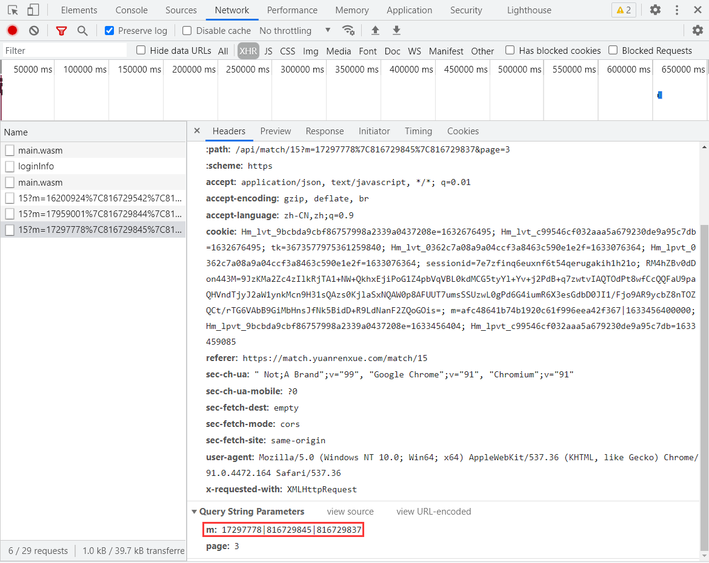
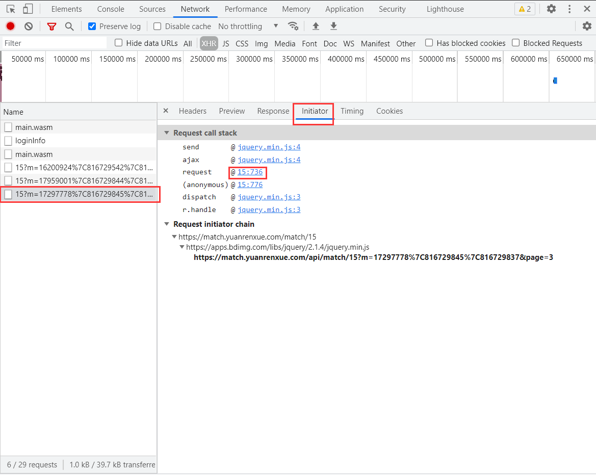
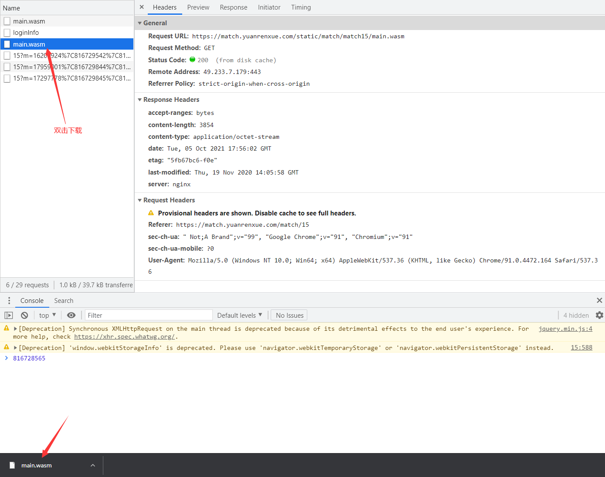
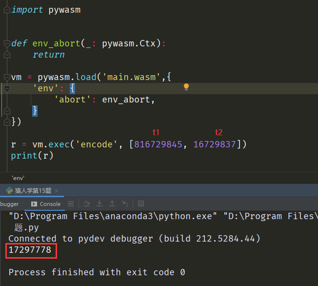

# 文件加密

## wasm文件加密

猿人学是一个专注做爬虫和数据结构的卖课平台。猿人学第一届Web端爬虫攻防赛于2020年10月16日开始，总奖金3万，共设10题，主要涉及JS反混淆，CSS反加密，图文验证码对抗等技术。 参加该比赛，你能获得物质奖励，能结识一批志同道合的人，可能拿到更好的offer，欢迎你的参加。比赛已于2020年10月20日结束。

第一届Web端猿人学攻防大赛【官方网站】：https://match.yuanrenxue.com/

网址：https://match.yuanrenxue.com/match/15

难度：简单

### 逆向流程

#### 抓包解析

首先打开Fiddler抓包工具，开启抓包状态，然后右键单击任务栏中的谷歌浏览器，点击“打开新的无痕窗口”，按F12打开“开发者工具”：


访问网址获取任务，在Network里面的Fetch/XHR选项中定位到了该网页数据的来源请求，**并且相对于前面的题目还多加载了两次 `main.wasm` 文件**，继续分析：


多次访问前面3页的页面，分析比较请求头参数，得出初步接结论：**每次请求，请求头的参数没有发生变化，但参数m的值在不断发生变化，参数page则是页码数。**



#### 逆向分析

现在我们需要定位到，哪一行的代码发送了当前的请求，点击左侧的Initiator选项，它主要是标记请求是由哪个对象或进程发起的（请求源），重点关注里面的request请求：



显示从一个名称为“15”的文件的第736行代码发送了当前请求，点击后面的地址，跳转到了该文件的第736行，看上面有两个很熟悉的参数 `page` 页码和 `m` 加密参数，**参数m的值来源于 `window.m()` 方法的返回值，其中 `window.m()` 方法返回值涉及到三个变量，`window.q()` 方法、`t1`、`t2`，其中 `t1`、`t2` 的值和时间戳有关，而 `window.q` 方法和 `results` 的 `encode` 方法有关，而 `results` 就是 `main.wasm` 文件内容，也正是最开始第一次请求加载的文件：**


这下就可以对加密参数完全得出结论了：

```
参数m：和变量t1、t2、main.wasm文件的encode方法有关
参数page：页码数
```

#### 抠JS代码

抠JS代码之前，我们需要读取并使用 `main.wasm` 文件的 `encode` 方法，因为JS中使用到了该方法。

第一步，我们需要了解一个概念什么是 `.wasm` 文件。**WebAssembly也叫浏览器字节码技术，通过WebAssembly编译后的文件即为 `.wasm` 文件。**

第二步，如何通过Python来调用 `.wasm` 文件里面的方法。**通过网上搜索，发现用的第三方库 `pywasm` 来进行调用，有现成的代码：**


第三步：下载安装第三方库 `pywasm` ：

```
# 下载安装第三方库pywasm
pip install pywasm
```

下载并保存网站上的 `main.wasm` 文件，双击开发者工具里的`main.wasm`文件进行下载：



修改上面的示例代码，结合上面截图的m参数试运行，结果和m参数最前面的数一样：



这里我们就只需要抠生成变量 `t1` 、`t2` 的JS代码，最后返回一个数组即可：

```javascript
m = function (){
    t1 = parseInt(Date.parse(new Date())/1000/2);
    t2 = parseInt(Date.parse(new Date())/1000/2 - Math.floor(Math.random() * (50) + 1));
    return Array(t1, t2);
};
```

### 爬虫代码

```python
import re
import execjs
import pywasm
import requests

# 请求头
headers = {
    'accept': 'application/json, text/javascript, */*; q=0.01',
    'accept-encoding': 'gzip, deflate, br',
    'accept-language': 'zh-CN,zh;q=0.9',
    'cookie': 'sessionid=自己的sessionid值',
    'referer': 'https://match.yuanrenxue.com/match/12',
    'sec-ch-ua': '"Google Chrome";v="93", " Not;A Brand";v="99", "Chromium";v="93"',
    'sec-ch-ua-mobile': '?0',
    'sec-ch-ua-platform': '"Windows"',
    'sec-fetch-dest': 'empty',
    'sec-fetch-mode': 'cors',
    'sec-fetch-site': 'same-origin',
    'user-agent': 'yuanrenxue.project',
    'x-requested-with': 'XMLHttpRequest'
}

def env_abort(_: pywasm.Ctx):
    return

vm = pywasm.load('main.wasm',{
    'env': {
        'abort': env_abort,
    }
})

# 打开JS文件并加载JS文件
with open("上面js文件名称.js", 'r', encoding = 'utf-8') as f:
    content = f.read()

# 执行m方法
JsObj = execjs.compile(content).call('m')
first = vm.exec('encode', JsObj)

# 数值
values = 0

# 共5页数据
for page in range(1, 6):
    # 接口地址
    url = f'https://match.yuanrenxue.com/api/match/15?page={page}&m={first}|{JsObj[0]}|{JsObj[1]}'
    # 输出响应
    response = requests.get(url=url, headers=headers, verify=False)
    print(f'第{page}页:{response.text}')
    # 提示：会有负数存在
    for v in re.findall(r'{"value": (-?\d+)}', response.text):
        values += int(v)

# 总值
print(values)
```

## woff文件加密

字体加密，已经变成了常见的一种反爬措施。**其原理就是，将一种特定的字体库来代替浏览器本身的字体库显示的过程，且加密的字体数量一般都不会太大。**

题目测试网址：https://match.yuanrenxue.com/match/7

难度：简单

### 逆向流程

#### 抓包解析

打开Chrome浏览器及开发者工具：


访问题目测试网址，明确任务目的，确定返回数据的接口，**发现返回的数据中value的值被编码，但根据经验可以估计到被编码的数据就是页面中胜点数据，下面还有一个woff数据，根据经验判断这是一个经过了Base64编码字体文件的内容**：


?> 提示：web开放字体格式（web open font format，简称woff），字体格式文件的后缀名就是 `.woff`，该文件在CSS中需要使用 `@font face` 规则引用。

#### 逆向分析

**这里有一点需要说一下就是，我们可以看到数字和value的值被编码是一一对应的关系，虽然我们可以通过编码总结出和数字对应的关系，但是这个编码并不是一成不变的，即动态字体加密。**现在，我们将woff数据通过Base64解码后，保存为woff文件，再将其转换为xml文件：

```python
from fontTools.ttLib import TTFont

woffb64 = response.json().get('woff')
with open('07.woff', 'wb') as f:
    f.write(base64.b64decode(woffb64.encode()))
TTFont('07.woff').saveXML('07.xml')
```

**需要进行文件格式转换的原因就是，woff文件是看不出来字体和编码的对应规律的，而XML文件内容是一种用于标记电子文件使其具有结构性的可扩展标记语言，简称XML。**我们可以看看如下将woff文件转换为xml的例子：打开xml文件，**可以看到他里面主要包含有 GlyphOrder 字形排序、cmap 存储unicode跟Name的映射关系、glyf 绘画字体的轮廓信息**：


在img1中我们可以看到GlyphOrder中 `id="4"`的对应 `unif7e2`，对应img2中cmap的 `unif7e2` 与 `0xf7e2`，对应在img3中可以看到 `name="unif7e2"` 下面的轮廓线条，其中：

```xml
<TTGlyph name="_#212" xMin="0" yMin="-164" xMax="996" yMax="804">
      #轮廓
      <contour>
        #点 x.y on 0表示为弧形区域 1表示矩形
        <pt x="22" y="-72" on="1"/>
        <pt x="96" y="59" on="0"/>
        <pt x="102" y="322" on="1"/>
```

接下来我们就把那个contour用matplotlib对glyf的坐标进行描绘：

```python
#encoding: utf-8
import matplotlib.pyplot as plt
import re

str = """
      <contour>
        <pt x="310" y="728" on="1"/>
        <pt x="202" y="728" on="0"/>
        <pt x="69" y="585" on="0"/>
        <pt x="68" y="465" on="1"/>
        <pt x="150" y="465" on="1"/>
        <pt x="152" y="560" on="0"/>
        <pt x="194" y="608" on="1"/>
        <pt x="233" y="659" on="0"/>
        <pt x="307" y="658" on="1"/>
        <pt x="377" y="658" on="0"/>
        <pt x="455" y="587" on="0"/>
        <pt x="455" y="521" on="1"/>
        <pt x="455" y="452" on="0"/>
        <pt x="400" y="393" on="1"/>
        <pt x="372" y="364" on="0"/>
        <pt x="288" y="304" on="1"/>
        <pt x="175" y="226" on="0"/>
        <pt x="133" y="177" on="1"/>
        <pt x="62" y="98" on="0"/>
        <pt x="62" y="0" on="1"/>
        <pt x="538" y="0" on="1"/>
        <pt x="538" y="73" on="1"/>
        <pt x="163" y="73" on="1"/>
        <pt x="183" y="145" on="0"/>
        <pt x="319" y="237" on="1"/>
        <pt x="430" y="313" on="0"/>
        <pt x="467" y="352" on="1"/>
        <pt x="537" y="427" on="0"/>
        <pt x="537" y="614" on="0"/>
        <pt x="409" y="728" on="0"/>
      </contour>
"""
x = [int(i) for i in re.findall(r'<pt x="(.*?)" y=', str)]
y = [int(i) for i in re.findall(r'y="(.*?)" on=', str)]
plt.plot(x, y)
plt.show()
```

从结果图中可以看到2，他就是所要表达的数字：


回到题目中转换的 `07.xml` 文件，**我们可以通过上面的轮廓代码来绘制出数字，得出数字和代码的对应关系，有一个难点在于每页的字体文件都会有或多或少的变化，但变化的都是数字，我们这里可以取一个巧，将代码内容和行数与数字相对应。**现在胜点这一步我们已经搞定了，接下就是获取玩家名称及玩家顺序了，点击请求中 `initiator` 选项，再点击 `request` 后面的数字部分：


跳转到发送请求的 `request` 地方，可以看到当ajax请求成功后，网页通过 `@font-face` 使用了woff数据，初始化的玩家为 `mad` 中的 `九不想乖`，但会玩家名称被后面所替换，代码来看玩家生成的顺序就是玩家列表 `name` 中第2个到第51个，即下标为 `[1:52]`：


#### 抠JS代码

本题主要检测点是字体库，不涉及抠JS代码。

### 爬虫代码

```python
import re
import os
import base64
import requests
from fontTools.ttLib import TTFont

# 请求头
headers = {
    'Host': 'match.yuanrenxue.com',
    'user-agent': 'yuanrenxue.project',
    'accept-encoding': 'gzip, deflate, br',
    'accept': 'application/json, text/javascript, */*; q=0.01',
    'Connection': 'keep-alive',
    'accept-language': 'zh-CN,zh;q=0.9',
    'cookie': '自己的cookie',
    'referer': 'https://match.yuanrenxue.com/match/7',
    'sec-ch-ua': '"Google Chrome";v="94", " Not;A Brand";v="99", "Chromium";v="99"',
    'sec-ch-ua-mobile': '?0',
    'sec-ch-ua-platform': '"Windows"',
    'sec-fetch-dest': 'empty',
    'sec-fetch-mode': 'cors',
    'sec-fetch-site': 'same-origin',
    'Sec-Fetch-Site': 'none',
    'Sec-Fetch-Mode': 'navigate',
    'Sec-Fetch-User': '?1',
    'Sec-Fetch-Dest': 'document',
    'Accept-Encoding': 'gzip, deflate, br',
    'Accept-Language': 'zh-CN,zh;q=0.9',
    'x-requested-with': 'XMLHttpRequest'
}


# 玩家列表(代码规律发现取的第2个到第51个)
player_list = ['极镀ギ紬荕', '爷灬霸气傀儡', '梦战苍穹', '傲世哥', 'мaη肆風聲', '一刀メ隔世', '横刀メ绝杀', 'Q不死你R死你', '魔帝殤邪', '封刀不再战', '倾城孤狼', '戎马江湖',
        '狂得像风', '影之哀伤', '謸氕づ独尊', '傲视狂杀', '追风之梦', '枭雄在世', '傲视之巅', '黑夜刺客', '占你心为王', '爷来取你狗命', '御风踏血', '凫矢暮城', '孤影メ残刀',
        '野区霸王', '噬血啸月', '风逝无迹', '帅的睡不着', '血色杀戮者', '冷视天下', '帅出新高度', '風狆瑬蒗', '灵魂禁锢', 'ヤ地狱篮枫ゞ', '溅血メ破天', '剑尊メ杀戮', '塞外う飛龍',
        '哥‘K纯帅', '逆風祈雨', '恣意踏江山', '望断、天涯路', '地獄惡灵', '疯狂メ孽杀', '寂月灭影', '骚年霸称帝王', '狂杀メ无赦', '死灵的哀伤', '撩妹界扛把子', '霸刀☆藐视天下',
        '潇洒又能打', '狂卩龙灬巅丷峰', '羁旅天涯.', '南宫沐风', '风恋绝尘', '剑下孤魂', '一蓑烟雨', '领域★倾战', '威龙丶断魂神狙', '辉煌战绩', '屎来运赚', '伱、Bu够档次',
        '九音引魂箫', '骨子里的傲气', '霸海断长空', '没枪也很狂', '死魂★之灵'][1: 52]

# 胜点列表
num_list = []

# 共5页数据
for page in range(1, 6):
    # 接口地址
    url = f'https://match.yuanrenxue.com/api/match/7?page={page}'
    # 忽略掉警告
    requests.packages.urllib3.disable_warnings()
    # 输出响应
    response = requests.get(url=url, headers=headers, verify=False)
    print(response.request.url)
    print(f'第{page}页:{response.json().get("data")}')
    # 提取woff数据进行base64解码
    woffb64 = response.json().get('woff')
    with open('07.woff', 'wb') as f:
        f.write(base64.b64decode(woffb64.encode()))
    # 转换为xml文件
    TTFont('07.woff').saveXML('07.xml')
    # 读取xml文件
    with open('07.xml', 'r', encoding='utf-8') as f:
        woff = f.read()
    # 将代码内容和数字进行对应
    values = {}
    for zt in re.findall(r'<TTGlyph.*?</TTGlyph>', woff, re.S | re.I)[1:]:
        name = '&#x' + re.findall(r'name=".*?(.\d{,3})"', zt)[0]
        cons = re.findall(r'(<contour>.*?</contour>)', zt, re.S | re.I)
        if len(cons) == 1:
            if len(re.findall(r'(<pt.*?>)', cons[0], re.S | re.I)) == 30:
                values.update({name: '2'})
            elif len(re.findall(r'(<pt.*?>)', cons[0], re.S | re.I)) == 7:
                values.update({name: '7'})
            elif len(re.findall(r'(<pt.*?>)', cons[0], re.S | re.I)) == 10:
                values.update({name: '1'})
            elif len(re.findall(r'(<pt.*?>)', cons[0], re.S | re.I)) == 37:
                values.update({name: '5'})
            elif len(re.findall(r'(<pt.*?>)', cons[0], re.S | re.I)) == 44:
                values.update({name: '3'})
        elif len(cons) == 2:
            if len(re.findall(r'(<pt.*?>)', cons[0], re.S | re.I)) == 11 and len(
                    re.findall(r'(<pt.*?>)', cons[1], re.S | re.I)) == 4:
                values.update({name: '4'})
            elif len(re.findall(r'(<pt.*?>)', cons[0], re.S | re.I)) == 29 and len(
                    re.findall(r'(<pt.*?>)', cons[1], re.S | re.I)) == 12:
                values.update({name: '9'})
            elif len(re.findall(r'(<pt.*?>)', cons[0], re.S | re.I)) == 28 and len(
                    re.findall(r'(<pt.*?>)', cons[1], re.S | re.I)) == 13:
                values.update({name: '6'})
            elif len(re.findall(r'(<pt.*?>)', cons[0], re.S | re.I)) == 13 and len(
                    re.findall(r'(<pt.*?>)', cons[1], re.S | re.I)) == 13:
                values.update({name: '0'})
        elif len(cons) == 3:
            if len(re.findall(r'(<pt.*?>)', cons[0], re.S | re.I)) == 32 and len(
                    re.findall(r'(<pt.*?>)', cons[1], re.S | re.I)) == 13 and len(
                re.findall(r'(<pt.*?>)', cons[2], re.S | re.I)) == 12:
                values.update({name: '8'})
    # 将数据内容替换为数字
    for item in response.json().get('data'):
        num = ''
        for nu in item.get('value').split(' ')[:-1]:
            num += values.get(nu)
        num_list.append(int(num))
    # 清除缓存
    os.remove('07.woff')
    os.remove('07.xml')

# 胜点列表
print(num_list)
# 最大胜点下标
index = num_list.index(max(num_list))
# 最高胜点玩家
top_1 = player_list[index]
print(top_1)
```
