# JS混淆乱码增强

## 简介

猿人学是一个专注做爬虫和数据结构的卖课平台。猿人学第一届Web端爬虫攻防赛于2020年10月16日开始，总奖金3万，共设10题，主要涉及JS反混淆，CSS反加密，图文验证码对抗等技术。 参加该比赛，你能获得物质奖励，能结识一批志同道合的人，可能拿到更好的offer，欢迎你的参加。比赛已于2020年10月20日结束。

第一届Web端猿人学攻防大赛【官方网站】：https://match.yuanrenxue.com/

网址：https://match.yuanrenxue.com/match/5

难度：中等

## 逆向流程

### 抓包解析

首先打开Fiddler抓包工具，开启抓包状态，然后右键单击任务栏中的谷歌浏览器，点击“打开新的无痕窗口”，按F12打开“开发者工具”：


访问网址获取任务，并在任务当中已提示“cookie有效期仅有50秒钟”，**说明有很大的可能性使用了cookie加密**，在Network里面的Fetch/XHR选项中定位到了该网页数据的来源请求，继续分析：


多次访问前面3页的页面，分析比较请求头参数并结合以往爬虫经验，可以得出初步接结论：**变动的加密参数有两大部分，cookie加密参数和get加密参数。**

```
# cookie加密参数
m：未知加密参数
RM4hZBv0dDon443M：未知加密参数

# get加密参数
page: 页码
m: 和时间戳有关
f: 和时间戳有关
```


### 逆向分析

**从上面的初步结论也可以看出来，get加密参数比较简单，我们从简单的开始弄。**

现在我们需要定位到，哪一行的代码发送了当前的请求，点击左侧的Initiator选项，它主要是标记请求是由哪个对象或进程发起的（请求源），重点关注里面的request请求：


点击request请求，就自动跳转到，对应的文件的指定位置，在上面可以看到三个熟悉的get请求参数：


可以看到 `m` 参数的对应值 `window._$is` 和 `f` 参数的对应值 `window.$_zw[23]` 的产生来源。全局搜索 `window.$_zw` 有四处，经过断点调试发现 `window.$_zw` 原本是一个空列表，当中所有的元素来源于下面 `$_aiding.$_zw.push(元素)` 填充：

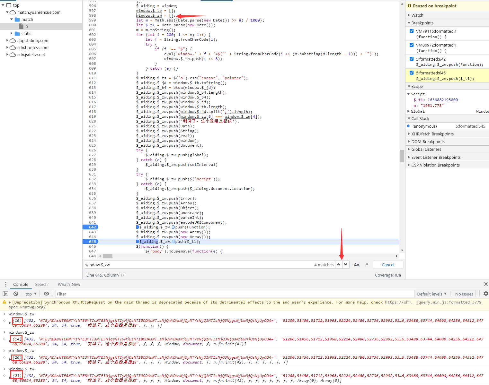

那么就有 `f = window.$_zw[23] = $_t1` 这个关系，`$_t1` 这个变量也恰好就在上面，这样我们就轻松的破解了第一个get加密的 `f` 参数：

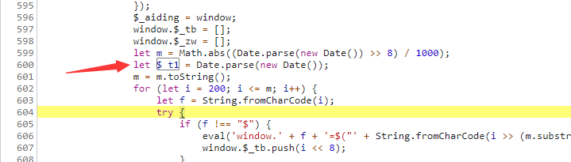

**然而在当前文件当中搜索并未找到该参数 `m` 即 `window._$is` 的赋值过程，该条线索断开。那么我们换一条路，去定位cookie加密参数的位置，也许能有意外收获。**

任务中有提示“cookie有效期仅有50秒钟”，也就是距离上次请求时间过去50秒后，这时我们去请求其他页面必定会有一个对cookie重新赋值的过程。这时回到我们的抓包工具，对流程进行分析：


通过对比请求，发现cookie参数改变发生在 `loginInfor` 请求和 `/api/match/5` 请求之间，然而中并没有能导致cookie改变的请求或其他的js文件，那么还剩下一种可能性就是：**虚拟机产生了临时的js文件改变了cookie，然而这种临时文件是抓包工具抓不到的。**到这里可能要回看《JS02-逆向基础》中关于虚拟机、临时文件相关概念了。

理解了临时js文件产生机制，结合上面分析流程，说明在肯定在js代码中执行了eval方法。现在我们回到js文件当中，在所有执行eval方法的地方打上断点，断点过来后，我们点击执行下一步的操作按钮：


果然就跳进了临时js文件VM当中：

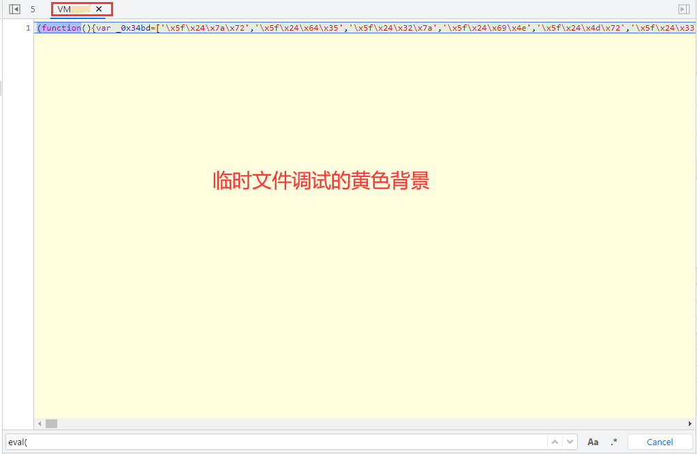

注意，这里这个题有个坑就是，可能大家已经注意到了，打开console在方不停的刷”世上无难事，只要肯放弃“这段话，其来源就是这个虚拟的VM文件当中的死循环代码：

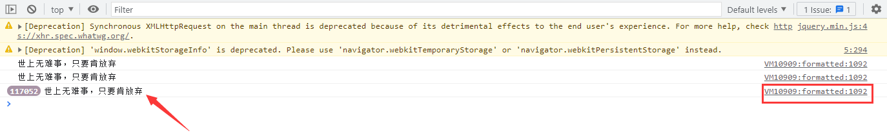

同时这也导致，浏览器的负载高，占用资源过高：


**因此，千万不能将VM文件含有死循环的代码复制到本机Pycharm的js文件当中调试，即使该文件没有在运行，由于要预加载函数，电脑的CPU也会很快满载**：

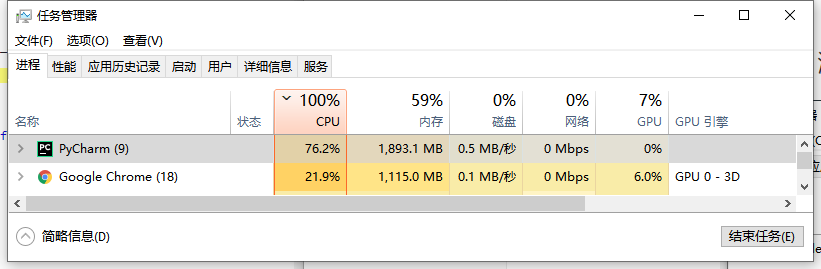

?> 提示：因此从现在开始，逆向代码的调试尽量在浏览器中进行，因为浏览器中已经加载好环境、函数、变量，是最好的调试场所。

将VM文件点击格式化 `{}` 后，得到如下进3千行的代码：

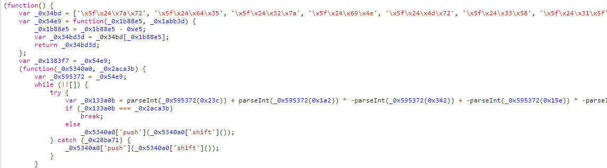

**根据前面的学习经验，可以看出该代码先经过了一次ob混淆，再经过了一次utf-8编码。如果我们硬着头皮去找cookie的两个加密参数肯定不好找，因此我们这里就要使用Hook技术（回看《逆向基础》章节中“Hook技术”）**

```javascript
// hook cookie字段RM4hZBv0dDon443M
(function () {
   Object.defineProperty(document, 'cookie', {
       set: function (cookie) {
           // 方法indexOf检索字符串的值若没有出现，则该方法返回-1。
           if(cookie.indexOf('RM4hZBv0dDon443M') != -1){
                debugger;
           }
           return cookie;
       }
   })
})();
```

现在我们在VM文件第一行处打上断点，当断点过来过后，由于cookie加密参数 `RM4hZBv0dDon443M` 相比于加密参数 `m` 更好定位，因此我们在console中注入以下hook代码：

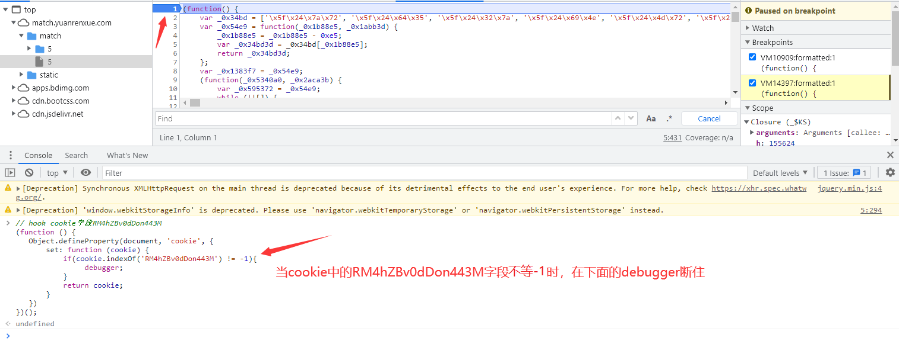

?> 提示：方法 `indexOf` 检索指定字符串的值若没有出现，则该方法返回-1。

继续运行该代码，马上hook就被触发了，**只不过当前cookie中 `RM4hZBv0dDon443M` 字段还未被定义，其方法 `indexOf` 返回值等于0，所以触发了hook，没关系点击右侧按钮继续运行**：


经过了几次hook触发，终于 `RM4hZBv0dDon443M` 字段被赋值了，**这时关注右侧边栏中 `Call Stack` 调用堆栈，这里可以看到函数的调用顺序，最后被调用的函数出现在最上方**，我们点击第二个栏里面的函数：


点击后，回到触发hook函数的上一步位置，发现 `RM4hZBv0dDon443M` 字段是通过字符拼接的方式生成的，所以这也给了我们一个经验，**关键的字符串在代码中不一定都是现成的，也可能是通过拼接生成**：


**同时也说明了 `_0x3d0f3f[_$Fe] = document['cookie']` 这个关系**：

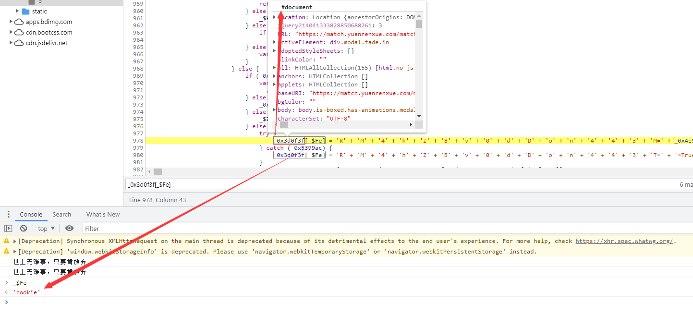

现在可以看出 `RM4hZBv0dDon443M` 字段值等于 `_0x4e96b4['_$ss']` 的值，通过调试发现 `_0x4e96b4` 就是 `window` 窗口，但搜索没有发现给 `_$ss` 全局变量属性赋值：

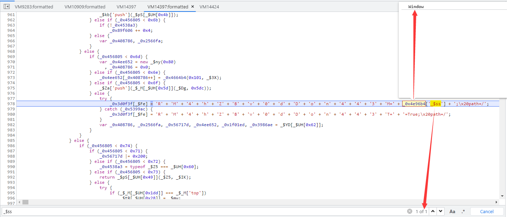

那我们将上面的hook代码修改如下，再次注入：

```javascript
(function () {
   Object.defineProperty(window, '_$ss', {
       set: function (window) {
           debugger;
           return window;
       }
   })
})();
```

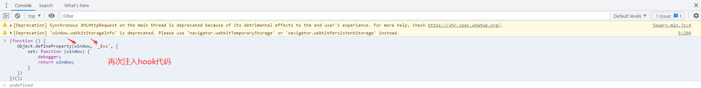

继续运行js文件，hook被触发，继续关注 `Call Stack` 调用堆栈中的第二栏：


点击跳转后，发现 `_$ss` 这个变量名称竟然也是通过拼接生成的，其值等于 `_0x29dd83[toString]()` 的值：


现在关注点变到 `_0x29dd83` 函数上了，刚好函数就在上方，我们将所有未知参数进行打印：


最终解析出来的代码如下：

```javascript
_$Ww = CryptoJS['enc']['Utf8']['parse'](_0x4e96b4['_$pr']['toString']());
_0x29dd83 = CryptoJS['AES']['encrypt'](_$Ww, _0x4e96b4['_$qF'], {
    'mode': CryptoJS['mode']['ECB'],
    'padding': CryptoJS['pad']['Pkcs7']
});
_0x4e96b4['_$ss'] = _0x29dd83['toString']();
```

通过打印 `_0x4e96b4['_$pr']` 是一个含有5个字符串数组的列表：


全局搜索发现初始的 `_0x4e96b4['_$pr']` 是个空数组：


将有关 `_0x4e96b4['_$pr']` 的赋值操作全部打上断点，发现在1717行执行了4次push操作，也就是往里面推了4个字符串：

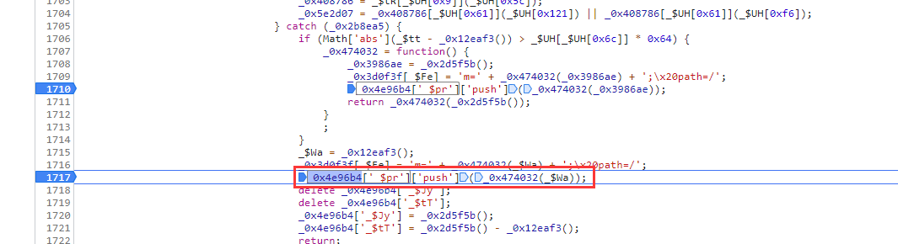

在第868行执行了1次push操作，往 `_0x4e96b4['_$pr']` 里面推了1个字符串，加上上面的4个字符串刚好就是5个字符串串，**而且可以发现866行 `m` 的值和第868行推的字符串的值相等，顺带就把cookie当中加密参数 `m` 给解决了**：

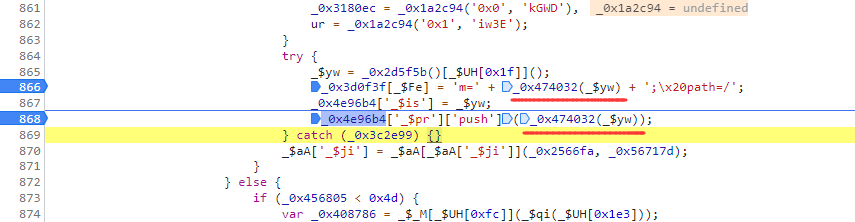

现在就是扣取和 `_0x4e96b4['_$pr']` 该变量有关的代码了，**这步需要不断的调试、替换，保持耐心。**接下来就是 `_0x4e96b4['_$qF']` 这个变量了，通过全局搜索只有两个地方，断点显示走的上部分代码，将其他未知变量打印出来：

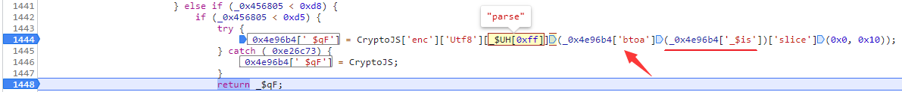

?> 在最后面有一个 `['slice']` 含义就是将前面的字符串进行切片，`(0x0, 0x10)` 含义就是范围0到16，因为0x是16进制。

接下来就是找 `_0x4e96b4['_$is']` 这个变量了，全局搜索发现3个位置，断点显示在867行进行了赋值：

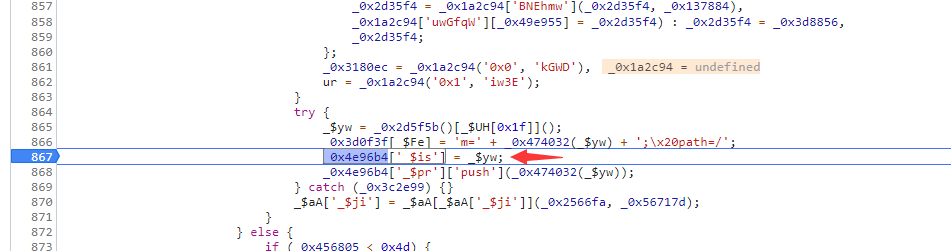

在扣取上面 `_0x4e96b4['_$pr']` 相关代码，就会发现 `_$yw` 这个变量已经扣过了：


这下就可以宣告 `RM4hZBv0dDon443M` 加密参数和 `m` 加密参数已经全部知晓了。现在我们搞定了cookie的加密参数，接下来就是回看get加密的 `m` 参数：

```
"m": window._$is
```

对照VM虚拟文件内容发现 `window._$is = _0x4e96b4['_$is']` 关系，get中 `m` 参数的值就是一个时间戳：


那么现在所有的加密参数都已破解成功！

### 扣JS代码

本题需要用到两个js标准库的方法：base64编码 `btoa` 方法，CryptoJS加密 `AES` 方法。引入方法的方式有两种：1、直接方法的源代码拷贝进需要使用文件（报错少，但文件会比较大）2、通过路径来引入文件内容（代码简洁且方便，可能会报错）

```javascript
// 引入路径
module.paths.push("存放文件的绝对路径")
//全局性方法require()用于加载模块
var CryptoJS = require("文件名称"); //文件名称不带后缀名
var btoa = require("文件名称");

// 假定有一个数学模块math.js，就可以像下面这样加载。
var math = require('math');
    math.add(2,3); // 5
```

下面就是相关提示和扣取的js代码：

?> 本题结果的值受到三个变量 `_0x4e96b4['_$Jy']`、`_0x4e96b4['_$tT']`、`_0x4e96b4['_$6_']`的影响，在调试的时候，和这三个变量赋值的相关地方都要打上断点，观察其变化。

!> 注意js代码中的 `,` 逗号不能随便改成 `;` 分号。

!> 注意本题有一个坑，就是加密参数和时间戳相关，因此最后生成的结果需要一次性全部，不可写成两个函数分别调用返回。

```javascript
//引入自己的路径下的js文件
module.paths.push("\\Users\\Administrator\\AppData\\Roaming\\npm\\node_modules")
var CryptoJS = require("crypto-js");
var btoa = require("btoa");

//本题js代码
var _0x4e96b4 = global  // 补环境：window = global
  , _0x4d2d2c = Array
  , _0x35bb1d = Date
  ,_0x30bc70 = String;

var _0x1171c8 = 0x67452301;
var _0x4dae05 = -0x10325477;
var _0x183a1d = -0x67452302;
var _0xcfa373 = 0x10325476;

_0x4e96b4['_$pr'] = new _0x4d2d2c();

function _0x2d5f5b() {
    return new _0x35bb1d()['valueOf']();
}

function _0x3180ec(_0x401705, _0x240e6a, _0x56b131, _0x5a5c20, _0x1f2a72, _0x2bfc1, _0x19741a) {
    return _0xaaef84(_0x240e6a & _0x5a5c20 | _0x56b131 & ~_0x5a5c20, _0x401705, _0x240e6a, _0x1f2a72, _0x2bfc1, _0x19741a);
}

function _0x4b459d(_0x8d8f2a, _0x406d34, _0x53e7d7, _0x26c827, _0xec41ea, _0x52dead, _0x3f66e7) {
    return _0xaaef84(_0x53e7d7 ^ (_0x406d34 | ~_0x26c827), _0x8d8f2a, _0x406d34, _0xec41ea, _0x52dead, _0x3f66e7);
}

function _0x32032f(_0x520fdf, _0x13921d, _0x1af9d5, _0x4a2311, _0xb6d40a, _0x1d58da, _0x361df0) {
    return _0xaaef84(_0x13921d ^ _0x1af9d5 ^ _0x4a2311, _0x520fdf, _0x13921d, _0xb6d40a, _0x1d58da, _0x361df0);
}

function _0x3634fc(_0x5803ba, _0x1ce5b2) {
    return _0x5803ba << _0x1ce5b2 | _0x5803ba >>> 0x20 - _0x1ce5b2;
}

function _0x12e4a8(_0x7542c8, _0x5eada0) {
    var _0x41f81f = (0xffff & _0x7542c8) + (0xffff & _0x5eada0);
    return (_0x7542c8 >> 0x10) + (_0x5eada0 >> 0x10) + (_0x41f81f >> 0x10) << 0x10 | 0xffff & _0x41f81f;
}

function _0xaaef84(_0xaf3112, _0x2a165a, _0x532fb4, _0x10aa40, _0x41c4e7, _0x1cb4da) {
    return _0x12e4a8(_0x3634fc(_0x12e4a8(_0x12e4a8(_0x2a165a, _0xaf3112), _0x12e4a8(_0x10aa40, _0x1cb4da)), _0x41c4e7), _0x532fb4);
}

function _0x48d200(_0x4b706e, _0x3c3a85, _0x111154, _0x311f9f, _0x5439cf, _0x38cac7, _0x26bd2e) {
    return _0xaaef84(_0x3c3a85 & _0x111154 | ~_0x3c3a85 & _0x311f9f, _0x4b706e, _0x3c3a85, _0x5439cf, _0x38cac7, _0x26bd2e);
}

function _0x11a7a2(_0x193f00, _0x1cfe89) {
    _0x193f00[_0x1cfe89 >> 0x5] |= 0x80 << _0x1cfe89 % 0x20,
    _0x193f00[0xe + (_0x1cfe89 + 0x40 >>> 0x9 << 0x4)] = _0x1cfe89;
    _0x42fb36= 16;
    try {
        _0x4e96b4['$_z2'][0x0] = 'Q';
    } catch (_0x4c574d) {
        op = 26;
        b64pad = 1
    }
    var _0x1badc3, _0x38ca59, _0x431764, _0x43f1b4, _0x5722c0, _0x3e0c38 = _0x1171c8, _0xdb4d2c = _0x4dae05, _0x1724c5 = _0x183a1d, _0x257ec6 = _0xcfa373;
    try {
        if (_0x4e96b4['_$6_']) {} else {
            _0x4e96b4['_$6_'] = 0x20dc5d57f;
        }
    } catch (_0x15bf3f) {
        _0x4e96b4['_$6_'] = 0x2421603;
    }
    for (_0x1badc3 = 0x0; _0x1badc3 < _0x193f00["length"]; _0x1badc3 += _0x42fb36)
        _0x38ca59 = _0x3e0c38,
        _0x431764 = _0xdb4d2c,
        _0x43f1b4 = _0x1724c5,
        _0x5722c0 = _0x257ec6,
        _0x3e0c38 = _0x48d200(_0x3e0c38, _0xdb4d2c, _0x1724c5, _0x257ec6, _0x193f00[_0x1badc3], 0x7, 0x7d60c),
        _0x257ec6 = _0x48d200(_0x257ec6, _0x3e0c38, _0xdb4d2c, _0x1724c5, _0x193f00[_0x1badc3 + 0x1], 0xc, _0x4e96b4['_$6_']),
        _0x1724c5 = _0x48d200(_0x1724c5, _0x257ec6, _0x3e0c38, _0xdb4d2c, _0x193f00[_0x1badc3 + 0x2], 0x11, 0x242070db),
        _0xdb4d2c = _0x48d200(_0xdb4d2c, _0x1724c5, _0x257ec6, _0x3e0c38, _0x193f00[_0x1badc3 + 0x3], 0x16, -0x3e423112),
        _0x3e0c38 = _0x48d200(_0x3e0c38, _0xdb4d2c, _0x1724c5, _0x257ec6, _0x193f00[_0x1badc3 + 0x4], 0x7, -0xa83f051),
        _0x257ec6 = _0x48d200(_0x257ec6, _0x3e0c38, _0xdb4d2c, _0x1724c5, _0x193f00[_0x1badc3 + 0x5], 0xc, 0x4787c62a),
        _0x1724c5 = _0x48d200(_0x1724c5, _0x257ec6, _0x3e0c38, _0xdb4d2c, _0x193f00[_0x1badc3 + 0x6], 0x11, -0x57cfb9ed),
        _0xdb4d2c = _0x48d200(_0xdb4d2c, _0x1724c5, _0x257ec6, _0x3e0c38, _0x193f00[_0x1badc3 + 0x7], 0x16, -0x2b96aff),
        _0x3e0c38 = _0x48d200(_0x3e0c38, _0xdb4d2c, _0x1724c5, _0x257ec6, _0x193f00[_0x1badc3 + 0x8], 0x7, 0x698098d8),
        _0x257ec6 = _0x48d200(_0x257ec6, _0x3e0c38, _0xdb4d2c, _0x1724c5, _0x193f00[_0x1badc3 + 0x9], 0xc, -0x74bb0851),
        _0x1724c5 = _0x48d200(_0x1724c5, _0x257ec6, _0x3e0c38, _0xdb4d2c, _0x193f00[_0x1badc3 + 0xa], 0x11, -0xa44f),
        _0xdb4d2c = _0x48d200(_0xdb4d2c, _0x1724c5, _0x257ec6, _0x3e0c38, _0x193f00[_0x1badc3 + 0xb], 0x16, -0x76a32842),
        _0x3e0c38 = _0x48d200(_0x3e0c38, _0xdb4d2c, _0x1724c5, _0x257ec6, _0x193f00[_0x1badc3 + 0xc], 0x7, 0x6b901122),
        _0x257ec6 = _0x48d200(_0x257ec6, _0x3e0c38, _0xdb4d2c, _0x1724c5, _0x193f00[_0x1badc3 + 0xd], 0xc, -0x2678e6d),
        _0x1724c5 = _0x48d200(_0x1724c5, _0x257ec6, _0x3e0c38, _0xdb4d2c, _0x193f00[_0x1badc3 + 0xe], 0x11, -0x5986bc72),
        _0xdb4d2c = _0x48d200(_0xdb4d2c, _0x1724c5, _0x257ec6, _0x3e0c38, _0x193f00[_0x1badc3 + 0xf], 0x16, 0x49b40821),
        _0x3e0c38 = _0x3180ec(_0x3e0c38, _0xdb4d2c, _0x1724c5, _0x257ec6, _0x193f00[_0x1badc3 + 0x1], 0x5, -0x9e1da9e),
        _0x257ec6 = _0x3180ec(_0x257ec6, _0x3e0c38, _0xdb4d2c, _0x1724c5, _0x193f00[_0x1badc3 + 0x6], 0x9, -0x3fbf4cc0),
        _0x1724c5 = _0x3180ec(_0x1724c5, _0x257ec6, _0x3e0c38, _0xdb4d2c, _0x193f00[_0x1badc3 + 0xb], 0xe, 0x265e5a51),
        _0xdb4d2c = _0x3180ec(_0xdb4d2c, _0x1724c5, _0x257ec6, _0x3e0c38, _0x193f00[_0x1badc3], 0x14, -0x16493856),
        _0x3e0c38 = _0x3180ec(_0x3e0c38, _0xdb4d2c, _0x1724c5, _0x257ec6, _0x193f00[_0x1badc3 + 0x5], 0x5, -0x29d0efa3),
        _0x257ec6 = _0x3180ec(_0x257ec6, _0x3e0c38, _0xdb4d2c, _0x1724c5, _0x193f00[_0x1badc3 + 0xa], 0x9, 0x2441453),
        _0x1724c5 = _0x3180ec(_0x1724c5, _0x257ec6, _0x3e0c38, _0xdb4d2c, _0x193f00[_0x1badc3 + 0xf], 0xe, _0x4e96b4['_$tT']),
        _0xdb4d2c = _0x3180ec(_0xdb4d2c, _0x1724c5, _0x257ec6, _0x3e0c38, _0x193f00[_0x1badc3 + 0x4], 0x14, _0x4e96b4['_$Jy']),
        _0x3e0c38 = _0x3180ec(_0x3e0c38, _0xdb4d2c, _0x1724c5, _0x257ec6, _0x193f00[_0x1badc3 + 0x9], 0x5, 0x21e1cde6),
        _0x257ec6 = _0x3180ec(_0x257ec6, _0x3e0c38, _0xdb4d2c, _0x1724c5, _0x193f00[_0x1badc3 + 0xe], 0x9, -0x3cc8aa0a),
        _0x1724c5 = _0x3180ec(_0x1724c5, _0x257ec6, _0x3e0c38, _0xdb4d2c, _0x193f00[_0x1badc3 + 0x3], 0xe, -0xb2af279),
        _0xdb4d2c = _0x3180ec(_0xdb4d2c, _0x1724c5, _0x257ec6, _0x3e0c38, _0x193f00[_0x1badc3 + 0x8], 0x14, 0x455a14ed),
        _0x3e0c38 = _0x3180ec(_0x3e0c38, _0xdb4d2c, _0x1724c5, _0x257ec6, _0x193f00[_0x1badc3 + 0xd], 0x5, -0x5caa8e7b),
        _0x257ec6 = _0x3180ec(_0x257ec6, _0x3e0c38, _0xdb4d2c, _0x1724c5, _0x193f00[_0x1badc3 + 0x2], 0x9, -0x3105c08),
        _0x1724c5 = _0x3180ec(_0x1724c5, _0x257ec6, _0x3e0c38, _0xdb4d2c, _0x193f00[_0x1badc3 + 0x7], 0xe, 0x676f02d9),
        _0xdb4d2c = _0x3180ec(_0xdb4d2c, _0x1724c5, _0x257ec6, _0x3e0c38, _0x193f00[_0x1badc3 + 0xc], 0x14, -0x72d5b376),
        _0x3e0c38 = _0x32032f(_0x3e0c38, _0xdb4d2c, _0x1724c5, _0x257ec6, _0x193f00[_0x1badc3 + 0x5], 0x4, -0x241282e),
        _0x257ec6 = _0x32032f(_0x257ec6, _0x3e0c38, _0xdb4d2c, _0x1724c5, _0x193f00[_0x1badc3 + 0x8], 0xb, -0x788e097f),
        _0x1724c5 = _0x32032f(_0x1724c5, _0x257ec6, _0x3e0c38, _0xdb4d2c, _0x193f00[_0x1badc3 + 0xb], 0x10, 0x6d9d6122),
        _0xdb4d2c = _0x32032f(_0xdb4d2c, _0x1724c5, _0x257ec6, _0x3e0c38, _0x193f00[_0x1badc3 + 0xe], 0x17, -0x21ac7f4),
        _0x3e0c38 = _0x32032f(_0x3e0c38, _0xdb4d2c, _0x1724c5, _0x257ec6, _0x193f00[_0x1badc3 + 0x1], 0x4, -0x5b4115bc * b64pad),
        _0x257ec6 = _0x32032f(_0x257ec6, _0x3e0c38, _0xdb4d2c, _0x1724c5, _0x193f00[_0x1badc3 + 0x4], 0xb, 0x4bdecfa9),
        _0x1724c5 = _0x32032f(_0x1724c5, _0x257ec6, _0x3e0c38, _0xdb4d2c, _0x193f00[_0x1badc3 + 0x7], 0x10, -0x944b4a0),
        _0xdb4d2c = _0x32032f(_0xdb4d2c, _0x1724c5, _0x257ec6, _0x3e0c38, _0x193f00[_0x1badc3 + 0xa], 0x17, -0x41404390),
        _0x3e0c38 = _0x32032f(_0x3e0c38, _0xdb4d2c, _0x1724c5, _0x257ec6, _0x193f00[_0x1badc3 + 0xd], 0x4, 0x289b7ec6),
        _0x257ec6 = _0x32032f(_0x257ec6, _0x3e0c38, _0xdb4d2c, _0x1724c5, _0x193f00[_0x1badc3], 0xb, -0x155ed806),
        _0x1724c5 = _0x32032f(_0x1724c5, _0x257ec6, _0x3e0c38, _0xdb4d2c, _0x193f00[_0x1badc3 + 0x3], 0x10, -0x2b10cf7b),
        _0xdb4d2c = _0x32032f(_0xdb4d2c, _0x1724c5, _0x257ec6, _0x3e0c38, _0x193f00[_0x1badc3 + 0x6], 0x17, 0x2d511fd9),
        _0x3e0c38 = _0x32032f(_0x3e0c38, _0xdb4d2c, _0x1724c5, _0x257ec6, _0x193f00[_0x1badc3 + 0x9], 0x4, -0x3d12017),
        _0x257ec6 = _0x32032f(_0x257ec6, _0x3e0c38, _0xdb4d2c, _0x1724c5, _0x193f00[_0x1badc3 + 0xc], 0xb, -0x1924661b),
        _0x1724c5 = _0x32032f(_0x1724c5, _0x257ec6, _0x3e0c38, _0xdb4d2c, _0x193f00[_0x1badc3 + 0xf], 0x10, 0x1fa27cf8),
        _0xdb4d2c = _0x32032f(_0xdb4d2c, _0x1724c5, _0x257ec6, _0x3e0c38, _0x193f00[_0x1badc3 + 0x2], 0x17, -0x3b53a99b),
        _0x3e0c38 = _0x4b459d(_0x3e0c38, _0xdb4d2c, _0x1724c5, _0x257ec6, _0x193f00[_0x1badc3], 0x6, -0xbd6ddbc),
        _0x257ec6 = _0x4b459d(_0x257ec6, _0x3e0c38, _0xdb4d2c, _0x1724c5, _0x193f00[_0x1badc3 + 0x7], 0xa, 0x432aff97),
        _0x1724c5 = _0x4b459d(_0x1724c5, _0x257ec6, _0x3e0c38, _0xdb4d2c, _0x193f00[_0x1badc3 + 0xe], 0xf, -0x546bdc59),
        _0xdb4d2c = _0x4b459d(_0xdb4d2c, _0x1724c5, _0x257ec6, _0x3e0c38, _0x193f00[_0x1badc3 + 0x5], 0x15, -0x36c5fc7),
        _0x3e0c38 = _0x4b459d(_0x3e0c38, _0xdb4d2c, _0x1724c5, _0x257ec6, _0x193f00[_0x1badc3 + 0xc], 0x6, 0x655b59c3),
        _0x257ec6 = _0x4b459d(_0x257ec6, _0x3e0c38, _0xdb4d2c, _0x1724c5, _0x193f00[_0x1badc3 + 0x3], 0xa, -0x70ef89ee),
        _0x1724c5 = _0x4b459d(_0x1724c5, _0x257ec6, _0x3e0c38, _0xdb4d2c, _0x193f00[_0x1badc3 + 0xa], 0xf, -0x644f153),
        _0xdb4d2c = _0x4b459d(_0xdb4d2c, _0x1724c5, _0x257ec6, _0x3e0c38, _0x193f00[_0x1badc3 + 0x1], 0x15, -0x7a7ba22f),
        _0x3e0c38 = _0x4b459d(_0x3e0c38, _0xdb4d2c, _0x1724c5, _0x257ec6, _0x193f00[_0x1badc3 + 0x8], 0x6, 0x6fa87e4f),
        _0x257ec6 = _0x4b459d(_0x257ec6, _0x3e0c38, _0xdb4d2c, _0x1724c5, _0x193f00[_0x1badc3 + 0xf], 0xa, -0x1d31920),
        _0x1724c5 = _0x4b459d(_0x1724c5, _0x257ec6, _0x3e0c38, _0xdb4d2c, _0x193f00[_0x1badc3 + 0x6], 0xf, -0x5cfebcec),
        _0xdb4d2c = _0x4b459d(_0xdb4d2c, _0x1724c5, _0x257ec6, _0x3e0c38, _0x193f00[_0x1badc3 + 0xd], 0x15, 0x4e0811a1),
        _0x3e0c38 = _0x4b459d(_0x3e0c38, _0xdb4d2c, _0x1724c5, _0x257ec6, _0x193f00[_0x1badc3 + 0x4], 0x6, -0x8ac817e),
        _0x257ec6 = _0x4b459d(_0x257ec6, _0x3e0c38, _0xdb4d2c, _0x1724c5, _0x193f00[_0x1badc3 + 0xb], 0xa, -1120211379),
        _0x1724c5 = _0x4b459d(_0x1724c5, _0x257ec6, _0x3e0c38, _0xdb4d2c, _0x193f00[_0x1badc3 + 0x2], 0xf, 0x2ad7d2bb),
        _0xdb4d2c = _0x4b459d(_0xdb4d2c, _0x1724c5, _0x257ec6, _0x3e0c38, _0x193f00[_0x1badc3 + 0x9], 0x15, -0x14792c01),
        _0x3e0c38 = _0x12e4a8(_0x3e0c38, _0x38ca59),
        _0xdb4d2c = _0x12e4a8(_0xdb4d2c, _0x431764),
        _0x1724c5 = _0x12e4a8(_0x1724c5, _0x43f1b4),
        _0x257ec6 = _0x12e4a8(_0x257ec6, _0x5722c0);
    return [_0x3e0c38, _0xdb4d2c, _0x1724c5, _0x257ec6];
}

function _0x12eaf3() {
    return _0x35bb1d["parse"](new _0x35bb1d());
}

function _0x12b47d(_0x149183) {
    var _0xabbcb3, _0x1145c3 = '', _0x4fce58 = 0x20 * _0x149183["length"];
    for (_0xabbcb3 = 0x0; _0xabbcb3 < _0x4fce58; _0xabbcb3 += 0x8)
        _0x1145c3 += _0x30bc70["fromCharCode"](_0x149183[_0xabbcb3 >> 0x5] >>> _0xabbcb3 % 0x20 & 0xff);
    return _0x1145c3;
}

function _0x2b8a17(_0x36f847) {
    return unescape(encodeURIComponent(_0x36f847));
}

function _0x35f5f2(_0x243853) {
    var _0x139b8b, _0xa791a1 = [];
    for (_0xa791a1[(_0x243853["length"] >> 0x2) - 0x1] = void 0x0,
    _0x139b8b = 0x0; _0x139b8b < _0xa791a1["length"]; _0x139b8b += 0x1)
        _0xa791a1[_0x139b8b] = 0x0;
    var _0x41a533 = 0x8 * _0x243853["length"];
    for (_0x139b8b = 0x0; _0x139b8b < _0x41a533; _0x139b8b += 0x8)
        _0xa791a1[_0x139b8b >> 0x5] |= (0xff & _0x243853["charCodeAt"](_0x139b8b / 0x8)) << _0x139b8b % 0x20;
    return _0xa791a1;
}

function _0x1ee7ec(_0x206333) {
    return _0x12b47d(_0x11a7a2(_0x35f5f2(_0x206333), 0x8 * _0x206333["length"]));
}

function _0x41873d(_0x5a6962) {
    return _0x1ee7ec(_0x2b8a17(_0x5a6962));
}

function _0x499969(_0x82fe7e) {
    var _0x5bdda4, _0x322a73, _0xd0b5cd = '0123456789abcdef', _0x21f411 = '';
    for (_0x322a73 = 0x0; _0x322a73 < _0x82fe7e["length"]; _0x322a73 += 0x1)
        _0x5bdda4 = _0x82fe7e["charCodeAt"](_0x322a73),
        _0x21f411 += _0xd0b5cd['charAt'](_0x5bdda4 >>> 0x4 & 0xf) + _0xd0b5cd['charAt'](0xf & _0x5bdda4);
    return _0x21f411;
}

function _0x37614a(_0x32e7c1) {
    return _0x499969(_0x41873d(_0x32e7c1));
}

function _0x474032(_0x233f82, _0xe2ed33, _0x3229f9) {
    return _0xe2ed33 ? _0x3229f9 ? v(_0xe2ed33, _0x233f82) : y(_0xe2ed33, _0x233f82) : _0x3229f9 ? _0x41873d(_0x233f82) : _0x37614a(_0x233f82);
}

// 生成结果
function js_value(){
    // 填充4个字符串
    _0x4e96b4['_$Jy'] = 0x1b821d58;
    _0x4e96b4['_$tT'] = -0xa40bd9c;
    for(var i = 0 ; i < 4;i++){
        _$Wa = _0x12eaf3();
        _0x4e96b4['_$pr']['push'](_0x474032(_$Wa));
        _0x4e96b4['_$Jy'] = _0x2d5f5b();
        _0x4e96b4['_$tT'] = -0x2ac06b5b;
    }

    // 填充最后1个字符串
    _0x4e96b4['_$Jy'] = -0x182c0438;
    _0x4e96b4['_$tT'] = -0x275e197f;
    _0x4e96b4['_$6_'] = -0x173848aa;
    _$yw = _0x2d5f5b()['toString']();
    _0x4e96b4['_$is'] = _$yw;
    _0x4e96b4['_$pr']['push'](_0x474032(_$yw));
    console.log(_0x4e96b4['_$pr']);

    _0x4e96b4['_$qF'] = CryptoJS['enc']['Utf8']['parse'](btoa(_0x4e96b4['_$is'])['slice'](0x0, 0x10));
    _$Ww = CryptoJS['enc']['Utf8']['parse'](_0x4e96b4['_$pr']['toString']());
    _0x29dd83 = CryptoJS['AES']['encrypt'](_$Ww, _0x4e96b4['_$qF'], {
        'mode': CryptoJS['mode']['ECB'],
        'padding': CryptoJS['pad']['Pkcs7']
    });
    _0x4e96b4['_$ss'] = _0x29dd83['toString']();
    $_t1 = Date.parse(new Date());
    return ['RM4hZBv0dDon443M=' + _0x4e96b4['_$ss'] + ';m=' + _0x474032(_$yw), 'm=' + _0x4e96b4['_$is'] + '&f=' + $_t1]
};
```

## 爬虫代码

```python
import re
import execjs
import requests

# 打开JS文件并加载JS文件
with open("上面js文件名称.js", 'r', encoding = 'utf-8') as f:
    content = f.read()
JsObj = execjs.compile(content)

# 请求头
headers = {
    'accept': 'application/json, text/javascript, */*; q=0.01',
    'accept-encoding': 'gzip, deflate, br',
    'accept-language': 'zh-CN,zh;q=0.9',
    'referer': 'https://match.yuanrenxue.com/match/5',
    'sec-ch-ua': '"Google Chrome";v="94", " Not;A Brand";v="99", "Chromium";v="99"',
    'sec-ch-ua-mobile': '?0',
    'sec-ch-ua-platform': '"Windows"',
    'sec-fetch-dest': 'empty',
    'sec-fetch-mode': 'cors',
    'sec-fetch-site': 'same-origin',
    'user-agent': 'yuanrenxue.project',
    'x-requested-with': 'XMLHttpRequest'
}

js_value1 = JsObj.call('js_value1')
js_value2 = JsObj.call('js_value2')

# 更新请求头
headers.update({'cookie':f'{js_value1};sessionid=自己的sessionid'})

# 数值
values = 0

# 数组列表
value_list = []

# 共5页数据
for page in range(1, 6):
    # 接口地址
    url = f'https://match.yuanrenxue.com/api/match/5?page={page}&{js_value2}'
    print(url)
    # 输出响应
    requests.packages.urllib3.disable_warnings()
    response = requests.get(url=url, headers=headers, verify=False)
    print(f'第{page}页:{response.text}')
    for v in re.findall(r'{"value": (-?\d+)}', response.text):
        value_list.append(int(v))

# 获取主播热度值最高的前五名
top_5 = sorted(value_list, reverse=True)[:5]
# 总值
print(sum(top_5))
```

