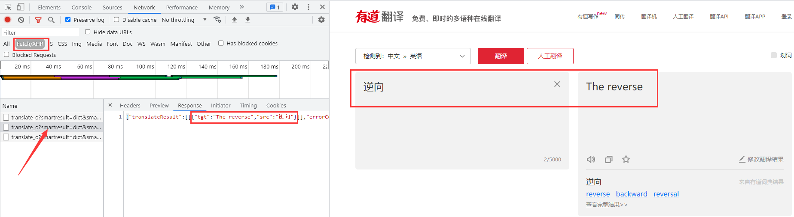
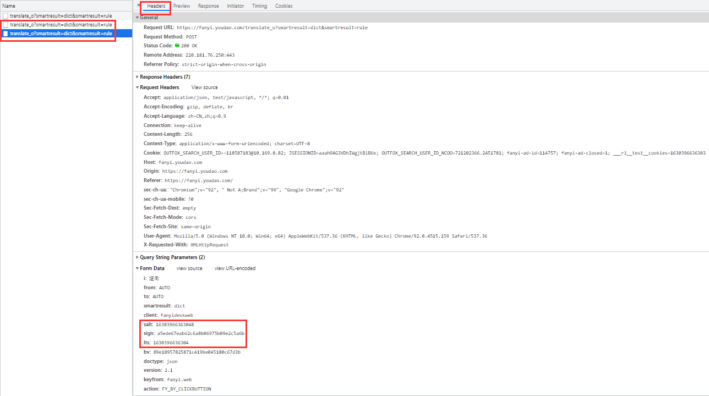
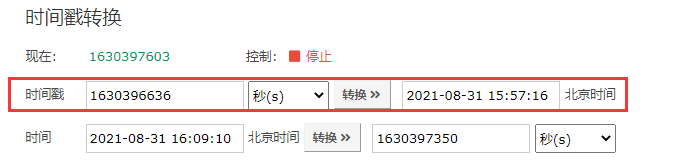
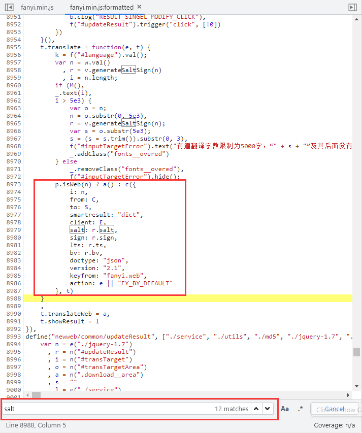

# 百家网站

本章节将展示针对100家网站进行逆向的过程。

## 有道翻译

有道翻译是网易公司开发的一款翻译软件，其最大特色在于翻译引擎是基于搜索引擎，网络释义的，也就是说它所翻译的词释义都是来自网络。

有道翻译网站地址：https://fanyi.youdao.com/

题目难度：简单

### 逆向流程

#### 抓包解析

输入一个词“逆向”，通过Chrome自带的开发者工具抓取数据包，在Network(网络部分)的Fetch/XHR选项筛选出返回内容的数据包，在Response部分可以看到返回的结果。



切换到header部分，比较两次相同内容的请求，发现Request Headers参数没有什么变化，但POST有三个参数有变化：

```
salt: 16303966363048
sign: a5ede67eabd2c6a8b06975b09e2c5a6b
lts: 1630396636304
```



可以看到 `salt` 和 `lts` 参数差不多，有爬虫经验的人，第一直觉就是时间戳，因为这个两个参数随着时间在不断的变大，而且数值和时间戳类似，确保万一取数值的前10位进行验证一下：



看来时间戳猜想基本正确，**一般来说，网络上使用时间戳都会精确到毫秒。这里可以进行下一步确定，`lts` 参数是精确到毫秒的13位时间戳，`salt` 参数就是13位时间戳加1个未知参数。**

#### 逆向分析

现在我们未知参数就剩下 `sign` 参数和 `salt` 最后一位参数。我们全局搜索一下 `salt` 的名称：


发现就在一个js文件中出现了 `salt` 的名称，点击进入，跳转到Sources选项中查看 `fanyi.min.js` 文件：


js文件中所有的代码都在一行，点击下方的 `{}` 按钮，在上方出现了 `fanyi.min.js:formatted` 这就是将 `fanyi.min.js` 文件中js代码格式化后的结果，方便我们阅读：


继续在文件中搜索 `salt` 名称，共有12处匹配，经过比对，在8979行找到了和POST参数最为接近的代码：



点击8988行处打上断点，点击翻译，代码运行卡在断点处，里面显示许多我们要使用的参数及来源：


通过观察可得出 `salt` 、`sign`、`lts` 、`bv` 参数与js代码中的 `r` 参数关系密切，查看 `r` 参数就在上方面：


**`r` 参数的构造也很简单，就是一个 `v` 类调用了 `generateSaltSign()` 方法传入了参数 `n` ，即翻译的内容“逆向”。选中方法名称，提示来自于8383行，点击位置跳转。**在8393行打上断点，点击翻译，断点卡住：


一看显示的内容，所有的参数基本都豁然开朗了。**如果有未知参数，点击Search点击Console输入参数名称，直接打印出来。**到这里就可以对参数做一个总结了：

```
r = {
  ts: 字符串类型的时间戳,
  bv: 浏览器user-agent的md5加密,
  salt: 字符串类型的时间戳 + 0到9随机取整,
  sign: "fanyideskweb" + （查询的内容） + （字符串类型的时间戳 + 0到9随机取整） + "Y2FYu%TNSbMCxc3t2u^XT"的md5加密
}

i: 动态值（查询的内容）
from: 默认值“AUTO”（被翻译的语言类型）
to: 默认值“AUTO”（翻译结果的语言类型）
smartresult: 固定值“dict”
client: 固定值“fanyideskweb”
salt: r参数.salt
sign: r参数.sign
lts: r参数.ts
bv: r参数.bv
doctype: 固定值“json”
version: 固定值“2.1”
keyfrom: 固定值“fanyi.web”
action: 固定值“FY_BY_CLICKBUTTION“
```

?> 提示：到这里我们对JS加密参数就分析完成了，我们也可以得到一个经验，就是对JS加密网站，不用分析每一行JS代码的作用，只需要分析加密的那一部分JS代码就可以了。

#### 抠JS代码

**完成对加密参数的分析，接下我们就要使用JS代码对明文POST参数加密。然而加密的JS代码都直接暴露在了JS文件当中，我们将需要JS代码给摘取出来就可以了。因为不是每行JS代码都需要，所以俗称：抠JS代码。**

参数加密主要使用了md5算法，虽然Python当中有对应的md5三方库，但这是标准的md5算法，而且不确定该网站的md5算法是否有改装，保险起见使用改网站的md5算法过程，其他的参数方法由Python实现。

下面就是抠JS代码，这个地方要注意：


需要将上面的方法指定名称为md5，接下就是将有关该方法的参数和函数全部粘贴进 `md5.js` 文件当中方便爬虫调用：

```javascript
function md5(e) {
var t, n, i, o, a, s, m, g, v, y = Array();
for (e = h(e),y = f(e),s = 1732584193,m = 4023233417,g = 2562383102,v = 271733878,t = 0; t < y.length; t += 16)n = s,i = m,o = g,a = v,s = l(s, m, g, v, y[t + 0], 7, 3614090360),v = l(v, s, m, g, y[t + 1], 12, 3905402710),g = l(g, v, s, m, y[t + 2], 17, 606105819),m = l(m, g, v, s, y[t + 3], 22, 3250441966),s = l(s, m, g, v, y[t + 4], 7, 4118548399),v = l(v, s, m, g, y[t + 5], 12, 1200080426),g = l(g, v, s, m, y[t + 6], 17, 2821735955),m = l(m, g, v, s, y[t + 7], 22, 4249261313),s = l(s, m, g, v, y[t + 8], 7, 1770035416),v = l(v, s, m, g, y[t + 9], 12, 2336552879),g = l(g, v, s, m, y[t + 10], 17, 4294925233),m = l(m, g, v, s, y[t + 11], 22, 2304563134),s = l(s, m, g, v, y[t + 12], 7, 1804603682),v = l(v, s, m, g, y[t + 13], 12, 4254626195),g = l(g, v, s, m, y[t + 14], 17, 2792965006),m = l(m, g, v, s, y[t + 15], 22, 1236535329),s = c(s, m, g, v, y[t + 1], 5, 4129170786),v = c(v, s, m, g, y[t + 6], 9, 3225465664),g = c(g, v, s, m, y[t + 11], 14, 643717713),m = c(m, g, v, s, y[t + 0], 20, 3921069994),s = c(s, m, g, v, y[t + 5], 5, 3593408605),v = c(v, s, m, g, y[t + 10], 9, 38016083),g = c(g, v, s, m, y[t + 15], 14, 3634488961),m = c(m, g, v, s, y[t + 4], 20, 3889429448),s = c(s, m, g, v, y[t + 9], 5, 568446438),v = c(v, s, m, g, y[t + 14], 9, 3275163606),g = c(g, v, s, m, y[t + 3], 14, 4107603335),m = c(m, g, v, s, y[t + 8], 20, 1163531501),s = c(s, m, g, v, y[t + 13], 5, 2850285829),v = c(v, s, m, g, y[t + 2], 9, 4243563512),g = c(g, v, s, m, y[t + 7], 14, 1735328473),m = c(m, g, v, s, y[t + 12], 20, 2368359562),s = u(s, m, g, v, y[t + 5], 4, 4294588738),v = u(v, s, m, g, y[t + 8], 11, 2272392833),g = u(g, v, s, m, y[t + 11], 16, 1839030562),m = u(m, g, v, s, y[t + 14], 23, 4259657740),s = u(s, m, g, v, y[t + 1], 4, 2763975236),v = u(v, s, m, g, y[t + 4], 11, 1272893353),g = u(g, v, s, m, y[t + 7], 16, 4139469664),m = u(m, g, v, s, y[t + 10], 23, 3200236656),s = u(s, m, g, v, y[t + 13], 4, 681279174),v = u(v, s, m, g, y[t + 0], 11, 3936430074),g = u(g, v, s, m, y[t + 3], 16, 3572445317),m = u(m, g, v, s, y[t + 6], 23, 76029189),s = u(s, m, g, v, y[t + 9], 4, 3654602809),v = u(v, s, m, g, y[t + 12], 11, 3873151461),g = u(g, v, s, m, y[t + 15], 16, 530742520),m = u(m, g, v, s, y[t + 2], 23, 3299628645),s = d(s, m, g, v, y[t + 0], 6, 4096336452),v = d(v, s, m, g, y[t + 7], 10, 1126891415),g = d(g, v, s, m, y[t + 14], 15, 2878612391),m = d(m, g, v, s, y[t + 5], 21, 4237533241),s = d(s, m, g, v, y[t + 12], 6, 1700485571),v = d(v, s, m, g, y[t + 3], 10, 2399980690),g = d(g, v, s, m, y[t + 10], 15, 4293915773),m = d(m, g, v, s, y[t + 1], 21, 2240044497),s = d(s, m, g, v, y[t + 8], 6, 1873313359),v = d(v, s, m, g, y[t + 15], 10, 4264355552),g = d(g, v, s, m, y[t + 6], 15, 2734768916),m = d(m, g, v, s, y[t + 13], 21, 1309151649),s = d(s, m, g, v, y[t + 4], 6, 4149444226),v = d(v, s, m, g, y[t + 11], 10, 3174756917),g = d(g, v, s, m, y[t + 2], 15, 718787259),m = d(m, g, v, s, y[t + 9], 21, 3951481745),s = r(s, n),m = r(m, i),g = r(g, o),v = r(v, a);return (p(s) + p(m) + p(g) + p(v)).toLowerCase()
};

var n = function(e, t) {return e << t | e >>> 32 - t};

r = function(e, t) {var n, r, i, o, a;return i = 2147483648 & e,o = 2147483648 & t,n = 1073741824 & e,r = 1073741824 & t,a = (1073741823 & e) + (1073741823 & t),n & r ? 2147483648 ^ a ^ i ^ o : n | r ? 1073741824 & a ? 3221225472 ^ a ^ i ^ o : 1073741824 ^ a ^ i ^ o : a ^ i ^ o};

o = function(e, t, n) {return e & n | t & ~n};
i = function(e, t, n) {return e & t | ~e & n};
a = function(e, t, n) {return e ^ t ^ n}; 
s = function(e, t, n) {return t ^ (e | ~n)}; 
l = function(e, t, o, a, s, l, c) {return e = r(e, r(r(i(t, o, a), s), c)),r(n(e, l), t)}; 
c = function(e, t, i, a, s, l, c) {return e = r(e, r(r(o(t, i, a), s), c)),r(n(e, l), t)}; 
u = function(e, t, i, o, s, l, c) {return e = r(e, r(r(a(t, i, o), s), c)),r(n(e, l), t)}; 
d = function(e, t, i, o, a, l, c) {return e = r(e, r(r(s(t, i, o), a), c)),r(n(e, l), t)};

f = function(e) {for (var t, n = e.length, r = n + 8, i = 16 * ((r - r % 64) / 64 + 1), o = Array(i - 1), a = 0, s = 0; s < n; )a = s % 4 * 8,o[t = (s - s % 4) / 4] = o[t] | e.charCodeAt(s) << a,s++;return t = (s - s % 4) / 4,a = s % 4 * 8,o[t] = o[t] | 128 << a,o[i - 2] = n << 3,o[i - 1] = n >>> 29,o};

h = function(e) {e = e.replace(/\x0d\x0a/g, "\n");for (var t = "", n = 0; n < e.length; n++) {var r = e.charCodeAt(n);if (r < 128)t += String.fromCharCode(r);else if (r > 127 && r < 2048)t += String.fromCharCode(r >> 6 | 192),t += String.fromCharCode(63 & r | 128);else if (r >= 55296 && r <= 56319) {if (n + 1 < e.length) {var i = e.charCodeAt(n + 1);if (i >= 56320 && i <= 57343) {var o = 1024 * (r - 55296) + (i - 56320) + 65536;t += String.fromCharCode(240 | o >> 18 & 7),t += String.fromCharCode(128 | o >> 12 & 63),t += String.fromCharCode(128 | o >> 6 & 63),t += String.fromCharCode(128 | 63 & o),n++}}} else t += String.fromCharCode(r >> 12 | 224),t += String.fromCharCode(r >> 6 & 63 | 128),t += String.fromCharCode(63 & r | 128)}return t};

p = function(e) {var t, n = "", r = "";for (t = 0; t <= 3; t++)n += (r = "0" + (e >>> 8 * t & 255).toString(16)).substr(r.length - 2, 2);return n};
```

### 爬虫代码

抠取了完整的JS代码，接下来我们就可以写爬虫了，代码如下：

```python
import time
import execjs
import random
import requests

# 查询内容
word = '逆向'
# 13位时间戳
time_stamp = str(int(time.time()*1000))
# salt参数
salt = time_stamp + str(random.randint(0, 9))
# user_agent
user_agent = "5.0 (Windows NT 10.0; Win64; x64) AppleWebKit/537.36 (KHTML, like Gecko) Chrome/92.0.4515.159 Safari/537.36"

# 打开JS文件并加载JS文件
with open("md5.js", 'r', encoding = 'utf-8') as f:
    content = f.read()
JsObj = execjs.compile(content)

# 请求头
headers = {
    'Accept': 'application/json, text/javascript, */*; q=0.01',
    'Accept-Encoding': 'gzip, deflate, br',
    'Accept-Language': 'zh-CN,zh;q=0.9',
    'Connection': 'keep-alive',
    'Content-Length': '256',
    'Content-Type': 'application/x-www-form-urlencoded; charset=UTF-8',
    'Host': 'fanyi.youdao.com',
    'Origin': 'https://fanyi.youdao.com',
    'Referer': 'https://fanyi.youdao.com/',
    'Cookie': 'OUTFOX_SEARCH_USER_ID=-118587183@10.169.0.82; JSESSIONID=aaah9AG3VDhIWgjtBlBUx; OUTFOX_SEARCH_USER_ID_NCOO=721202366.2451781; fanyi-ad-id=114757; fanyi-ad-closed=1; ___rl__test__cookies=1630401422673',
    'sec-ch-ua': '"Chromium";v="92", " Not A;Brand";v="99", "Google Chrome";v="92"',
    'sec-ch-ua-mobile': '?0',
    'Sec-Fetch-Dest': 'empty',
    'Sec-Fetch-Mode': 'cors',
    'Sec-Fetch-Site': 'same-origin',
    'User-Agent': 'Mozilla/5.0 (Windows NT 10.0; Win64; x64) AppleWebKit/537.36 (KHTML, like Gecko) Chrome/92.0.4515.159 Safari/537.36',
    'X-Requested-With': 'XMLHttpRequest'
}

# post参数
data = {
    'i': word,
    'from': 'AUTO',
    'to': 'AUTO',
    'smartresult': 'dict',
    'client': 'fanyideskweb',
    'salt': salt,
    'sign': JsObj.call('md5', f"fanyideskweb{word}{salt}Y2FYu%TNSbMCxc3t2u^XT"),# 调用js方法，第一个参数是JS的方法名，后面则是js方法的参数
    'lts': time_stamp,
    'bv': JsObj.call('md5', user_agent),
    'doctype': 'json',
    'version': '2.1',
    'keyfrom': 'fanyi.web',
    'action': 'FY_BY_CLICKBUTTION'
}

# 接口地址
url = 'https://fanyi.youdao.com/translate_o?smartresult=dict&smartresult=rule'

# 输出响应
response = requests.post(url=url, headers=headers, data=data, verify=False)
print(response.text)

'''
输出：
{"translateResult":[[{"tgt":"The reverse","src":"逆向"}]],"errorCode":0,"type":"zh-CHS2en","smartResult":{"entries":["","reverse\r\n","backward\r\n","reversal\r\n"],"type":1}}
'''
```

## 百度翻译

百度翻译依托互联网数据资源和自然语言处理技术优势，致力于帮助用户跨越语言鸿沟，方便快捷地获取信息和服务。支持全球200多个语言互译，包括中文（简体）、英语、日语等，覆盖4万多个翻译方向，通过开放平台支持超过40万企业和个人开发者，是国内市场份额第一的翻译类产品。

地址：https://fanyi.baidu.com/

题目难度：简单

### 逆向流程

#### 抓包解析

首先我们打开地址，检查cookie，在通过逐个排查发现cookie中没有 `BAIDUID` 字段的话会再次刷新获取：


而获取的方式，就在我们清空cookie刷新的第一次请求当中：


接下来通过几次变换词语，点击翻译后，抓到v2transapi?from=zh&to=en这条接口地址，可以看到Form Data表单，其中除了sign和token以及query（待翻译字符）外其余参数可以设置为固定值。


#### 逆向分析

首先我们来解决token，**通过全局搜索发现，token第一次被赋值就出现在最开始的第二次请求当中，而搜索下面有行注释引人注目，就是没有cookie的话，是不会返回token的，这也就解释了为什么最开始会有两次请求：第一次请求就是获取cookie，第二次请求需要带上cookie来获取token。**


经过测试成功获取token，说明前面的逻辑完全正确：


接下来搜索sign看看是否能找到加密入口：


找到单独的sign高亮，且有赋值的过程，在可疑点上打断点：


接下来再次点击翻译，看到断点停到了7045行处，细心一点的朋友可以看到token也在这里：


`sign:f(n)` 这里sign是就是 `f(n)` 函数的返回值，n看上面有调试信息 `n = "兔子"`，看看 `f()` 函数的内容：


进入e函数后看到如下代码块：


现在将e函数拷贝下来，进行输出，发现报错 i 未定义：


先看这段代码：`u = null !== i ? i : (i = window[l] || “”) || “”;` 大致意思就是 `u=i=window[l]`，经过几次调试发现 `window[l]` 是一个固定值320305.131321201，所以我们可以直接添加一个定义 `i = 320305.131321201` 变量：


我们再次运行js代码，提示n未定义：


我们返回网页看看，提示n是一个外部引入的函数：


进入n函数：


将n函数的代码拷贝下来运行，正常输出结果，但还有待爬虫来验证：


#### 抠JS代码

```javascript
function n(r, o) {
    for (var t = 0; t < o.length - 2; t += 3) {
        var a = o.charAt(t + 2);
        a = a >= "a" ? a.charCodeAt(0) - 87 : Number(a),
        a = "+" === o.charAt(t + 1) ? r >>> a : r << a,
        r = "+" === o.charAt(t) ? r + a & 4294967295 : r ^ a
    }
    return r
}

i = '320305.131321201';

e = function (r) {
    var o = r.match(/[\uD800-\uDBFF][\uDC00-\uDFFF]/g);
    if (null === o) {
        var t = r.length;
        t > 30 && (r = "" + r.substr(0, 10) + r.substr(Math.floor(t / 2) - 5, 10) + r.substr(-10, 10))
    } else {
        for (var e = r.split(/[\uD800-\uDBFF][\uDC00-\uDFFF]/), C = 0, h = e.length, f = []; h > C; C++)
            "" !== e[C] && f.push.apply(f, a(e[C].split(""))),
            C !== h - 1 && f.push(o[C]);
        var g = f.length;
        g > 30 && (r = f.slice(0, 10).join("") + f.slice(Math.floor(g / 2) - 5, Math.floor(g / 2) + 5).join("") + f.slice(-10).join(""))
    }
    var u = void 0
      , l = "" + String.fromCharCode(103) + String.fromCharCode(116) + String.fromCharCode(107);
    u = null !== i ? i : (i = window[l] || "") || "";
    for (var d = u.split("."), m = Number(d[0]) || 0, s = Number(d[1]) || 0, S = [], c = 0, v = 0; v < r.length; v++) {
        var A = r.charCodeAt(v);
        128 > A ? S[c++] = A : (2048 > A ? S[c++] = A >> 6 | 192 : (55296 === (64512 & A) && v + 1 < r.length && 56320 === (64512 & r.charCodeAt(v + 1)) ? (A = 65536 + ((1023 & A) << 10) + (1023 & r.charCodeAt(++v)),
        S[c++] = A >> 18 | 240,
        S[c++] = A >> 12 & 63 | 128) : S[c++] = A >> 12 | 224,
        S[c++] = A >> 6 & 63 | 128),
        S[c++] = 63 & A | 128)
    }
    for (var p = m, F = "" + String.fromCharCode(43) + String.fromCharCode(45) + String.fromCharCode(97) + ("" + String.fromCharCode(94) + String.fromCharCode(43) + String.fromCharCode(54)), D = "" + String.fromCharCode(43) + String.fromCharCode(45) + String.fromCharCode(51) + ("" + String.fromCharCode(94) + String.fromCharCode(43) + String.fromCharCode(98)) + ("" + String.fromCharCode(43) + String.fromCharCode(45) + String.fromCharCode(102)), b = 0; b < S.length; b++)
        p += S[b],
        p = n(p, F);
    return p = n(p, D),
    p ^= s,
    0 > p && (p = (2147483647 & p) + 2147483648),
    p %= 1e6,
    p.toString() + "." + (p ^ m)
};

console.log(e('兔子'));
```

### 爬虫代码

这段js代码不长，我们完全可以放到爬虫当中：

```python
import re
import execjs
import requests

# 建立一个会话
session = requests.session()
# 忽略警告
requests.packages.urllib3.disable_warnings()

def conversion(head):
    items = [item.split(': ') for item in head.split('\n')]
    header = {}
    for item in items:
        header.update({item[0]: item[1]})
    return header

page_header = '''Host: fanyi.baidu.com
Connection: keep-alive
Cache-Control: max-age=0
sec-ch-ua: " Not A;Brand";v="99", "Chromium";v="99", "Google Chrome";v="99"
sec-ch-ua-mobile: ?0
sec-ch-ua-platform: "Windows"
Upgrade-Insecure-Requests: 1
User-Agent: Mozilla/5.0 (Windows NT 10.0; Win64; x64) AppleWebKit/537.36 (KHTML, like Gecko) Chrome/99.0.4844.82 Safari/537.36
Accept: text/html,application/xhtml+xml,application/xml;q=0.9,image/avif,image/webp,image/apng,*/*;q=0.8,application/signed-exchange;v=b3;q=0.9
Sec-Fetch-Site: none
Sec-Fetch-Mode: navigate
Sec-Fetch-User: ?1
Sec-Fetch-Dest: document
Accept-Encoding: gzip, deflate, br
Accept-Language: zh-CN,zh;q=0.9'''

# 获取BAIDUID
first_url = 'https://fanyi.baidu.com/'
first_res = session.get(url=first_url, headers=conversion(page_header), verify=False)
session.headers.update({'BAIDUID': first_res.headers.get('Set-Cookie').split('=')[1]+'=1'})

# 获取token
second_url = 'https://fanyi.baidu.com/'
second_res = session.get(url=second_url, headers=conversion(page_header), verify=False)
token = re.findall(r"token: '(.*?)',", second_res.text)[0]

# 生成sign
content = '''function n(r, o) {
    for (var t = 0; t < o.length - 2; t += 3) {
        var a = o.charAt(t + 2);
        a = a >= "a" ? a.charCodeAt(0) - 87 : Number(a),
        a = "+" === o.charAt(t + 1) ? r >>> a : r << a,
        r = "+" === o.charAt(t) ? r + a & 4294967295 : r ^ a
    }
    return r
};
i = '320305.131321201';
e = function (r) {
    var o = r.match(/[\\uD800-\\uDBFF][\\uDC00-\\uDFFF]/g);
    if (null === o) {
        var t = r.length;
        t > 30 && (r = "" + r.substr(0, 10) + r.substr(Math.floor(t / 2) - 5, 10) + r.substr(-10, 10))
    } else {
        for (var e = r.split(/[\\uD800-\\uDBFF][\\uDC00-\\uDFFF]/), C = 0, h = e.length, f = []; h > C; C++)
            "" !== e[C] && f.push.apply(f, a(e[C].split(""))),
            C !== h - 1 && f.push(o[C]);
        var g = f.length;
        g > 30 && (r = f.slice(0, 10).join("") + f.slice(Math.floor(g / 2) - 5, Math.floor(g / 2) + 5).join("") + f.slice(-10).join(""))
    }
    var u = void 0
      , l = "" + String.fromCharCode(103) + String.fromCharCode(116) + String.fromCharCode(107);
    u = null !== i ? i : (i = window[l] || "") || "";
    for (var d = u.split("."), m = Number(d[0]) || 0, s = Number(d[1]) || 0, S = [], c = 0, v = 0; v < r.length; v++) {
        var A = r.charCodeAt(v);
        128 > A ? S[c++] = A : (2048 > A ? S[c++] = A >> 6 | 192 : (55296 === (64512 & A) && v + 1 < r.length && 56320 === (64512 & r.charCodeAt(v + 1)) ? (A = 65536 + ((1023 & A) << 10) + (1023 & r.charCodeAt(++v)),
        S[c++] = A >> 18 | 240,
        S[c++] = A >> 12 & 63 | 128) : S[c++] = A >> 12 | 224,
        S[c++] = A >> 6 & 63 | 128),
        S[c++] = 63 & A | 128)
    }
    for (var p = m, F = "" + String.fromCharCode(43) + String.fromCharCode(45) + String.fromCharCode(97) + ("" + String.fromCharCode(94) + String.fromCharCode(43) + String.fromCharCode(54)), D = "" + String.fromCharCode(43) + String.fromCharCode(45) + String.fromCharCode(51) + ("" + String.fromCharCode(94) + String.fromCharCode(43) + String.fromCharCode(98)) + ("" + String.fromCharCode(43) + String.fromCharCode(45) + String.fromCharCode(102)), b = 0; b < S.length; b++)
        p += S[b],
        p = n(p, F);
    return p = n(p, D),
    p ^= s,
    0 > p && (p = (2147483647 & p) + 2147483648),
    p %= 1e6,
    p.toString() + "." + (p ^ m)
};'''

word = '兔子'
form = {'from': 'zh',
        'to': 'en',
        'query': word,
        'transtype': 'realtime',
        'simple_means_flag': '3',
        'sign': execjs.compile(content).call('e', word),
        'token': token,
        'domain': 'common'}
three_url = 'https://fanyi.baidu.com/v2transapi?from=zh&to=en'
three_res = session.post(url=three_url, headers=session.headers, data=form, verify=False)
print(three_res.text)
```

## 马蜂窝旅游网

马蜂窝旅游网是广受中国年轻一代追捧的旅行玩乐平台，被誉为中国的旅行圣经。得益于“内容+交易”的核心优势，马蜂窝将复杂的旅游决策、预订和体验，变得简单、高效和便捷。马蜂窝是旅游社交网站，是数据趋动平台，也是新型旅游电商，提供全球6万个旅游目的地的交通、酒店、景点、餐饮、购物、当地玩乐等信息内容和产品预订服务。

地址：https://www.mafengwo.cn

题目难度：中等

### 逆向流程

#### 抓包解析

首先打开Fiddler抓包工具，开启抓包状态，选择抓取经过浏览器的数据包：


然后右键单击任务栏中的谷歌浏览器，点击“打开新的无痕窗口”，按F12打开“开发者工具”：


首先我们访问马蜂窝的网站，回看Fiddler中产生了三次请求，在第三次请求中返回了我们想要的结果，**在Cookie中发现存在 `jsl` 字段，这是加速乐的典型特征**：


#### 逆向分析

看第一次请求，在响应头中有设置Cookie的 `__jsluid_s` 字段操作：


看第一次请求，响应内容中有设置Cookie的 `__jsl_clearance_s` 字段操作：


**看第二次请求，发现在Cookie中多出了两个 `__jsluid_s`、`__jsl_clearance_s` 字段，其值和上面第一次请求中的响应头和响应内容设置的值完全一样，可以说带着第一次请求设置的值进行的第二次访问。响应内容是经过ob混淆的js代码，暂不知作用：**


**看第三次请求，发现Cookie当中的 `__jsl_clearance_s` 的值发生了变化，说明第二次请求返回的内容会修改 `__jsl_clearance_s` 的值：**


#### 抠JS代码

这里我们首先处理第一次请求返回的js代码，首先我们将代码拷贝下来，去掉 `<script>` 标签，补上缺失的环境，成功返回我们想要的结果：


```javascript
// 所补环境
document = {};
location = {};
location.pathname = '';
location.search = '';

function a(){
    // 加上第一次请求的内容
    return document.cookie
};
```

现在我们处理第二次请求返回的ob混淆的js代码，首先我们将代码拷贝下来，去掉 `<script>` 标签，**补上环境，通过断点调试发现，在150行设置了 `document.cookie` 属性，其字段恰好是 `__jsl_clearance_s`，其值刚好就是go函数中传递实参中的bts数组的拼接值，但中间有两个字符 `Av` 未知来源：**


最后通过调试断点跟踪，破解了所有字段：

```javascript
go({
    "bts": ["1648231315.137|0|TG4", "PqsyjB7CBobpmQHgyOTC4M%3D"],  // __jsl_clearance_s的值
    "chars": "nHCaAKLYoaXvshPXndsWQw",  // 提供拼接字符
    "ct": "e3ab1c60ec1220af58399a0b455ee6a28496dcbf",  // 加密后的值
    "ha": "sha1",  // 加密方式
    "tn": "__jsl_clearance_s",  // cookie中的__jsl_clearance_s字段
    "vt": "3600",  // Max-age的值（不重要）
    "wt": "1500"  // 定时器的间隔时间（不重要）
}
// 逻辑流程如下：从chars的值中随机提供两个字符，将字符拼接在bts数组的值当中，通过ha的值的加密方式，直到加密结果的值等于ct的值，最后值就是1648231315.137|0|TG4AvPqsyjB7CBobpmQHgyOTC4M%3D
```

我们来验证一下字符 `1648231315.137|0|TG4AvPqsyjB7CBobpmQHgyOTC4M%3D` 的sha1加密是否等于 `e3ab1c60ec1220af58399a0b455ee6a28496dcbf`，经过下面的验证猜想正确：


**在后面的测试，除了 `sha1` 加密外，还发现了 `md5` 加密、`sha256` 加密，这些加密方式我们都可用python的hashlib库进行模拟。**

### 爬虫代码

现在我们完全破解了这个网站，接下来我们就可以写爬虫了，代码如下：

```python
import hashlib
import json
import re
import execjs
import requests

# 建立一个会话
session = requests.session()
# 忽略警告
requests.packages.urllib3.disable_warnings()

def conversion(head):
    items = [item.split(': ') for item in head.split('\n')]
    header = {}
    for item in items:
        header.update({item[0]: item[1]})
    return header

page_header = '''Host: www.mafengwo.cn
Connection: keep-alive
Cache-Control: max-age=0
sec-ch-ua: " Not A;Brand";v="99", "Chromium";v="99", "Google Chrome";v="99"
sec-ch-ua-mobile: ?0
sec-ch-ua-platform: "Windows"
Upgrade-Insecure-Requests: 1
User-Agent: Mozilla/5.0 (Windows NT 10.0; Win64; x64) AppleWebKit/537.36 (KHTML, like Gecko) Chrome/99.0.4844.82 Safari/537.36
Accept: text/html,application/xhtml+xml,application/xml;q=0.9,image/avif,image/webp,image/apng,*/*;q=0.8,application/signed-exchange;v=b3;q=0.9
Sec-Fetch-Site: none
Sec-Fetch-Mode: navigate
Sec-Fetch-User: ?1
Sec-Fetch-Dest: document
Accept-Encoding: gzip, deflate, br
Accept-Language: zh-CN,zh;q=0.9'''

headers = conversion(page_header)
# 第一次请求
response_1 = session.get('https://www.mafengwo.cn', headers=headers, verify=False)
jsluid_s = re.findall(r'(__jsluid_s=.*?;)', str(response_1.headers))[0]
js_script = re.findall(r'(document\.cookie=.*?location.search)', response_1.text)[0]
# 执行第一次请求返回的js代码
content = '''function a(){document={};document.cookie='';location={};location.pathname='';location.search='';'''+js_script+''';return document.cookie};'''
JsObj = execjs.compile(content).call('a')
headers.update({'Cookie': JsObj+';'+jsluid_s})
# 第二此请求
response_2 = session.get('https://www.mafengwo.cn', headers=headers, verify=False).text
go = json.loads(re.findall(r'};go\((.*?)\)</script>', response_2)[0])
# 筛选拼接函数
for i in range(len(go['chars'])):
    for j in range(len(go['chars'])):
        # 拼接结果值
        vales = go['bts'][0] + go['chars'][i] + go['chars'][j] + go['bts'][1]
        # 三种加密方式
        if go['ha'] == 'md5':
            ha = hashlib.md5(vales.encode()).hexdigest()
        elif go['ha'] == 'sha1':
            ha = hashlib.sha1(vales.encode()).hexdigest()
        else:
            ha = hashlib.sha256(vales.encode()).hexdigest()
        # 判断加密结果值
        if ha == go['ct']:
            headers.update({'Cookie': '__jsl_clearance_s='+vales+';'+jsluid_s})
            break
# 第三次请求
response_3 = session.get('https://www.mafengwo.cn', headers=headers, verify=False).text
print(response_3)
```

