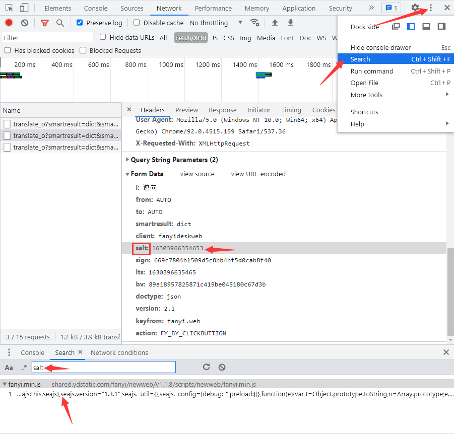
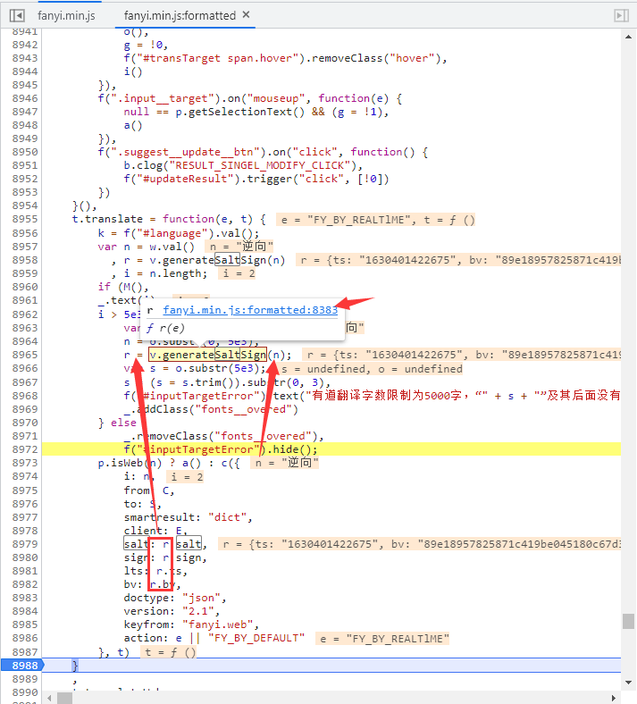
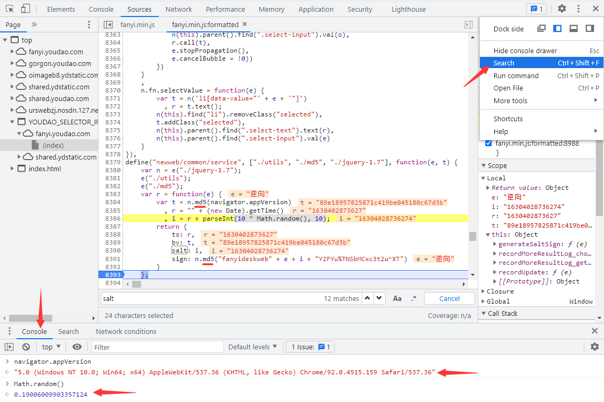
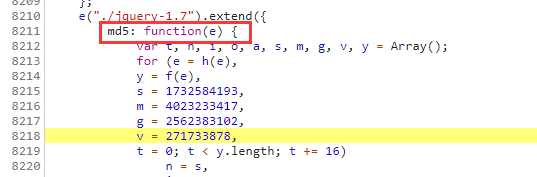

# 百家网站

本章节将展示针对100家网站进行逆向的过程。

## 有道翻译

有道翻译是网易公司开发的一款翻译软件，其最大特色在于翻译引擎是基于搜索引擎，网络释义的，也就是说它所翻译的词释义都是来自网络。

有道翻译网站地址：https://fanyi.youdao.com/

题目难度：简单

### 逆向流程

#### 抓包解析

输入一个词“逆向”，通过Chrome自带的开发者工具抓取数据包，在Network(网络部分)的Fetch/XHR选项筛选出返回内容的数据包，在Response部分可以看到返回的结果。


切换到header部分，比较两次相同内容的请求，发现Request Headers参数没有什么变化，但POST有三个参数有变化：

```
salt: 16303966363048
sign: a5ede67eabd2c6a8b06975b09e2c5a6b
lts: 1630396636304
```


可以看到 `salt` 和 `lts` 参数差不多，有爬虫经验的人，第一直觉就是时间戳，因为这个两个参数随着时间在不断的变大，而且数值和时间戳类似，确保万一取数值的前10位进行验证一下：


看来时间戳猜想基本正确，**一般来说，网络上使用时间戳都会精确到毫秒。这里可以进行下一步确定，`lts` 参数是精确到毫秒的13位时间戳，`salt` 参数就是13位时间戳加1个未知参数。**

#### 逆向分析

现在我们未知参数就剩下 `sign` 参数和 `salt` 最后一位参数。我们全局搜索一下 `salt` 的名称：



发现就在一个js文件中出现了 `salt` 的名称，点击进入，跳转到Sources选项中查看 `fanyi.min.js` 文件：


js文件中所有的代码都在一行，点击下方的 `{}` 按钮，在上方出现了 `fanyi.min.js:formatted` 这就是将 `fanyi.min.js` 文件中js代码格式化后的结果，方便我们阅读：


继续在文件中搜索 `salt` 名称，共有12处匹配，经过比对，在8979行找到了和POST参数最为接近的代码：


点击8988行处打上断点，点击翻译，代码运行卡在断点处，里面显示许多我们要使用的参数及来源：


通过观察可得出 `salt` 、`sign`、`lts` 、`bv` 参数与js代码中的 `r` 参数关系密切，查看 `r` 参数就在上方面：



**`r` 参数的构造也很简单，就是一个 `v` 类调用了 `generateSaltSign()` 方法传入了参数 `n` ，即翻译的内容“逆向”。选中方法名称，提示来自于8383行，点击位置跳转。**在8393行打上断点，点击翻译，断点卡住：



一看显示的内容，所有的参数基本都豁然开朗了。**如果有未知参数，点击Search点击Console输入参数名称，直接打印出来。**到这里就可以对参数做一个总结了：

```
r = {
  ts: 字符串类型的时间戳,
  bv: 浏览器user-agent的md5加密,
  salt: 字符串类型的时间戳 + 0到9随机取整,
  sign: "fanyideskweb" + （查询的内容） + （字符串类型的时间戳 + 0到9随机取整） + "Y2FYu%TNSbMCxc3t2u^XT"的md5加密
}

i: 动态值（查询的内容）
from: 默认值“AUTO”（被翻译的语言类型）
to: 默认值“AUTO”（翻译结果的语言类型）
smartresult: 固定值“dict”
client: 固定值“fanyideskweb”
salt: r参数.salt
sign: r参数.sign
lts: r参数.ts
bv: r参数.bv
doctype: 固定值“json”
version: 固定值“2.1”
keyfrom: 固定值“fanyi.web”
action: 固定值“FY_BY_CLICKBUTTION“
```

?> 提示：到这里我们对JS加密参数就分析完成了，我们也可以得到一个经验，就是对JS加密网站，不用分析每一行JS代码的作用，只需要分析加密的那一部分JS代码就可以了。

#### 抠JS代码

**完成对加密参数的分析，接下我们就要使用JS代码对明文POST参数加密。然而加密的JS代码都直接暴露在了JS文件当中，我们将需要JS代码给摘取出来就可以了。因为不是每行JS代码都需要，所以俗称：抠JS代码。**

参数加密主要使用了md5算法，虽然Python当中有对应的md5三方库，但这是标准的md5算法，而且不确定该网站的md5算法是否有改装，保险起见使用改网站的md5算法过程，其他的参数方法由Python实现。

下面就是抠JS代码，这个地方要注意：



需要将上面的方法指定名称为md5，接下就是将有关该方法的参数和函数全部粘贴进 `md5.js` 文件当中方便爬虫调用：

```javascript
function md5(e) {
var t, n, i, o, a, s, m, g, v, y = Array();
for (e = h(e),y = f(e),s = 1732584193,m = 4023233417,g = 2562383102,v = 271733878,t = 0; t < y.length; t += 16)n = s,i = m,o = g,a = v,s = l(s, m, g, v, y[t + 0], 7, 3614090360),v = l(v, s, m, g, y[t + 1], 12, 3905402710),g = l(g, v, s, m, y[t + 2], 17, 606105819),m = l(m, g, v, s, y[t + 3], 22, 3250441966),s = l(s, m, g, v, y[t + 4], 7, 4118548399),v = l(v, s, m, g, y[t + 5], 12, 1200080426),g = l(g, v, s, m, y[t + 6], 17, 2821735955),m = l(m, g, v, s, y[t + 7], 22, 4249261313),s = l(s, m, g, v, y[t + 8], 7, 1770035416),v = l(v, s, m, g, y[t + 9], 12, 2336552879),g = l(g, v, s, m, y[t + 10], 17, 4294925233),m = l(m, g, v, s, y[t + 11], 22, 2304563134),s = l(s, m, g, v, y[t + 12], 7, 1804603682),v = l(v, s, m, g, y[t + 13], 12, 4254626195),g = l(g, v, s, m, y[t + 14], 17, 2792965006),m = l(m, g, v, s, y[t + 15], 22, 1236535329),s = c(s, m, g, v, y[t + 1], 5, 4129170786),v = c(v, s, m, g, y[t + 6], 9, 3225465664),g = c(g, v, s, m, y[t + 11], 14, 643717713),m = c(m, g, v, s, y[t + 0], 20, 3921069994),s = c(s, m, g, v, y[t + 5], 5, 3593408605),v = c(v, s, m, g, y[t + 10], 9, 38016083),g = c(g, v, s, m, y[t + 15], 14, 3634488961),m = c(m, g, v, s, y[t + 4], 20, 3889429448),s = c(s, m, g, v, y[t + 9], 5, 568446438),v = c(v, s, m, g, y[t + 14], 9, 3275163606),g = c(g, v, s, m, y[t + 3], 14, 4107603335),m = c(m, g, v, s, y[t + 8], 20, 1163531501),s = c(s, m, g, v, y[t + 13], 5, 2850285829),v = c(v, s, m, g, y[t + 2], 9, 4243563512),g = c(g, v, s, m, y[t + 7], 14, 1735328473),m = c(m, g, v, s, y[t + 12], 20, 2368359562),s = u(s, m, g, v, y[t + 5], 4, 4294588738),v = u(v, s, m, g, y[t + 8], 11, 2272392833),g = u(g, v, s, m, y[t + 11], 16, 1839030562),m = u(m, g, v, s, y[t + 14], 23, 4259657740),s = u(s, m, g, v, y[t + 1], 4, 2763975236),v = u(v, s, m, g, y[t + 4], 11, 1272893353),g = u(g, v, s, m, y[t + 7], 16, 4139469664),m = u(m, g, v, s, y[t + 10], 23, 3200236656),s = u(s, m, g, v, y[t + 13], 4, 681279174),v = u(v, s, m, g, y[t + 0], 11, 3936430074),g = u(g, v, s, m, y[t + 3], 16, 3572445317),m = u(m, g, v, s, y[t + 6], 23, 76029189),s = u(s, m, g, v, y[t + 9], 4, 3654602809),v = u(v, s, m, g, y[t + 12], 11, 3873151461),g = u(g, v, s, m, y[t + 15], 16, 530742520),m = u(m, g, v, s, y[t + 2], 23, 3299628645),s = d(s, m, g, v, y[t + 0], 6, 4096336452),v = d(v, s, m, g, y[t + 7], 10, 1126891415),g = d(g, v, s, m, y[t + 14], 15, 2878612391),m = d(m, g, v, s, y[t + 5], 21, 4237533241),s = d(s, m, g, v, y[t + 12], 6, 1700485571),v = d(v, s, m, g, y[t + 3], 10, 2399980690),g = d(g, v, s, m, y[t + 10], 15, 4293915773),m = d(m, g, v, s, y[t + 1], 21, 2240044497),s = d(s, m, g, v, y[t + 8], 6, 1873313359),v = d(v, s, m, g, y[t + 15], 10, 4264355552),g = d(g, v, s, m, y[t + 6], 15, 2734768916),m = d(m, g, v, s, y[t + 13], 21, 1309151649),s = d(s, m, g, v, y[t + 4], 6, 4149444226),v = d(v, s, m, g, y[t + 11], 10, 3174756917),g = d(g, v, s, m, y[t + 2], 15, 718787259),m = d(m, g, v, s, y[t + 9], 21, 3951481745),s = r(s, n),m = r(m, i),g = r(g, o),v = r(v, a);return (p(s) + p(m) + p(g) + p(v)).toLowerCase()
};

var n = function(e, t) {return e << t | e >>> 32 - t};

r = function(e, t) {var n, r, i, o, a;return i = 2147483648 & e,o = 2147483648 & t,n = 1073741824 & e,r = 1073741824 & t,a = (1073741823 & e) + (1073741823 & t),n & r ? 2147483648 ^ a ^ i ^ o : n | r ? 1073741824 & a ? 3221225472 ^ a ^ i ^ o : 1073741824 ^ a ^ i ^ o : a ^ i ^ o};

o = function(e, t, n) {return e & n | t & ~n};
i = function(e, t, n) {return e & t | ~e & n};
a = function(e, t, n) {return e ^ t ^ n}; 
s = function(e, t, n) {return t ^ (e | ~n)}; 
l = function(e, t, o, a, s, l, c) {return e = r(e, r(r(i(t, o, a), s), c)),r(n(e, l), t)}; 
c = function(e, t, i, a, s, l, c) {return e = r(e, r(r(o(t, i, a), s), c)),r(n(e, l), t)}; 
u = function(e, t, i, o, s, l, c) {return e = r(e, r(r(a(t, i, o), s), c)),r(n(e, l), t)}; 
d = function(e, t, i, o, a, l, c) {return e = r(e, r(r(s(t, i, o), a), c)),r(n(e, l), t)};

f = function(e) {for (var t, n = e.length, r = n + 8, i = 16 * ((r - r % 64) / 64 + 1), o = Array(i - 1), a = 0, s = 0; s < n; )a = s % 4 * 8,o[t = (s - s % 4) / 4] = o[t] | e.charCodeAt(s) << a,s++;return t = (s - s % 4) / 4,a = s % 4 * 8,o[t] = o[t] | 128 << a,o[i - 2] = n << 3,o[i - 1] = n >>> 29,o};

h = function(e) {e = e.replace(/\x0d\x0a/g, "\n");for (var t = "", n = 0; n < e.length; n++) {var r = e.charCodeAt(n);if (r < 128)t += String.fromCharCode(r);else if (r > 127 && r < 2048)t += String.fromCharCode(r >> 6 | 192),t += String.fromCharCode(63 & r | 128);else if (r >= 55296 && r <= 56319) {if (n + 1 < e.length) {var i = e.charCodeAt(n + 1);if (i >= 56320 && i <= 57343) {var o = 1024 * (r - 55296) + (i - 56320) + 65536;t += String.fromCharCode(240 | o >> 18 & 7),t += String.fromCharCode(128 | o >> 12 & 63),t += String.fromCharCode(128 | o >> 6 & 63),t += String.fromCharCode(128 | 63 & o),n++}}} else t += String.fromCharCode(r >> 12 | 224),t += String.fromCharCode(r >> 6 & 63 | 128),t += String.fromCharCode(63 & r | 128)}return t};

p = function(e) {var t, n = "", r = "";for (t = 0; t <= 3; t++)n += (r = "0" + (e >>> 8 * t & 255).toString(16)).substr(r.length - 2, 2);return n};
```

### 爬虫代码

抠取了完整的JS代码，接下来我们就可以写爬虫了，代码如下：

```python
import time
import execjs
import random
import requests

# 查询内容
word = '逆向'
# 13位时间戳
time_stamp = str(int(time.time()*1000))
# salt参数
salt = time_stamp + str(random.randint(0, 9))
# user_agent
user_agent = "5.0 (Windows NT 10.0; Win64; x64) AppleWebKit/537.36 (KHTML, like Gecko) Chrome/92.0.4515.159 Safari/537.36"

# 打开JS文件并加载JS文件
with open("md5.js", 'r', encoding = 'utf-8') as f:
    content = f.read()
JsObj = execjs.compile(content)

# 请求头
headers = {
    'Accept': 'application/json, text/javascript, */*; q=0.01',
    'Accept-Encoding': 'gzip, deflate, br',
    'Accept-Language': 'zh-CN,zh;q=0.9',
    'Connection': 'keep-alive',
    'Content-Length': '256',
    'Content-Type': 'application/x-www-form-urlencoded; charset=UTF-8',
    'Host': 'fanyi.youdao.com',
    'Origin': 'https://fanyi.youdao.com',
    'Referer': 'https://fanyi.youdao.com/',
    'Cookie': 'OUTFOX_SEARCH_USER_ID=-118587183@10.169.0.82; JSESSIONID=aaah9AG3VDhIWgjtBlBUx; OUTFOX_SEARCH_USER_ID_NCOO=721202366.2451781; fanyi-ad-id=114757; fanyi-ad-closed=1; ___rl__test__cookies=1630401422673',
    'sec-ch-ua': '"Chromium";v="92", " Not A;Brand";v="99", "Google Chrome";v="92"',
    'sec-ch-ua-mobile': '?0',
    'Sec-Fetch-Dest': 'empty',
    'Sec-Fetch-Mode': 'cors',
    'Sec-Fetch-Site': 'same-origin',
    'User-Agent': 'Mozilla/5.0 (Windows NT 10.0; Win64; x64) AppleWebKit/537.36 (KHTML, like Gecko) Chrome/92.0.4515.159 Safari/537.36',
    'X-Requested-With': 'XMLHttpRequest'
}

# post参数
data = {
    'i': word,
    'from': 'AUTO',
    'to': 'AUTO',
    'smartresult': 'dict',
    'client': 'fanyideskweb',
    'salt': salt,
    'sign': JsObj.call('md5', f"fanyideskweb{word}{salt}Y2FYu%TNSbMCxc3t2u^XT"),# 调用js方法，第一个参数是JS的方法名，后面则是js方法的参数
    'lts': time_stamp,
    'bv': JsObj.call('md5', user_agent),
    'doctype': 'json',
    'version': '2.1',
    'keyfrom': 'fanyi.web',
    'action': 'FY_BY_CLICKBUTTION'
}

# 接口地址
url = 'https://fanyi.youdao.com/translate_o?smartresult=dict&smartresult=rule'

# 输出响应
response = requests.post(url=url, headers=headers, data=data, verify=False)
print(response.text)

'''
输出：
{"translateResult":[[{"tgt":"The reverse","src":"逆向"}]],"errorCode":0,"type":"zh-CHS2en","smartResult":{"entries":["","reverse\r\n","backward\r\n","reversal\r\n"],"type":1}}
'''
```

## 百度翻译

百度翻译依托互联网数据资源和自然语言处理技术优势，致力于帮助用户跨越语言鸿沟，方便快捷地获取信息和服务。支持全球200多个语言互译，包括中文（简体）、英语、日语等，覆盖4万多个翻译方向，通过开放平台支持超过40万企业和个人开发者，是国内市场份额第一的翻译类产品。

地址：https://fanyi.baidu.com/

题目难度：简单

### 逆向流程

#### 抓包解析

首先我们打开地址，检查cookie，在通过逐个排查发现cookie中没有 `BAIDUID` 字段的话会再次刷新获取：


而获取的方式，就在我们清空cookie刷新的第一次请求当中：


接下来通过几次变换词语，点击翻译后，抓到v2transapi?from=zh&to=en这条接口地址，可以看到Form Data表单，其中除了sign和token以及query（待翻译字符）外其余参数可以设置为固定值。


#### 逆向分析

首先我们来解决token，**通过全局搜索发现，token第一次被赋值就出现在最开始的第二次请求当中，而搜索下面有行注释引人注目，就是没有cookie的话，是不会返回token的，这也就解释了为什么最开始会有两次请求：第一次请求就是获取cookie，第二次请求需要带上cookie来获取token。**


经过测试成功获取token，说明前面的逻辑完全正确：


接下来搜索sign看看是否能找到加密入口：


找到单独的sign高亮，且有赋值的过程，在可疑点上打断点：


接下来再次点击翻译，看到断点停到了7045行处，细心一点的朋友可以看到token也在这里：


`sign:f(n)` 这里sign是就是 `f(n)` 函数的返回值，n看上面有调试信息 `n = "兔子"`，看看 `f()` 函数的内容：


进入e函数后看到如下代码块：


现在将e函数拷贝下来，进行输出，发现报错 i 未定义：


先看这段代码：`u = null !== i ? i : (i = window[l] || “”) || “”;` 大致意思就是 `u=i=window[l]`，经过几次调试发现 `window[l]` 是一个固定值320305.131321201，所以我们可以直接添加一个定义 `i = 320305.131321201` 变量：


我们再次运行js代码，提示n未定义：


我们返回网页看看，提示n是一个外部引入的函数：


进入n函数：


将n函数的代码拷贝下来运行，正常输出结果，但还有待爬虫来验证：


#### 抠JS代码

```javascript
function n(r, o) {
    for (var t = 0; t < o.length - 2; t += 3) {
        var a = o.charAt(t + 2);
        a = a >= "a" ? a.charCodeAt(0) - 87 : Number(a),
        a = "+" === o.charAt(t + 1) ? r >>> a : r << a,
        r = "+" === o.charAt(t) ? r + a & 4294967295 : r ^ a
    }
    return r
}

i = '320305.131321201';

e = function (r) {
    var o = r.match(/[\uD800-\uDBFF][\uDC00-\uDFFF]/g);
    if (null === o) {
        var t = r.length;
        t > 30 && (r = "" + r.substr(0, 10) + r.substr(Math.floor(t / 2) - 5, 10) + r.substr(-10, 10))
    } else {
        for (var e = r.split(/[\uD800-\uDBFF][\uDC00-\uDFFF]/), C = 0, h = e.length, f = []; h > C; C++)
            "" !== e[C] && f.push.apply(f, a(e[C].split(""))),
            C !== h - 1 && f.push(o[C]);
        var g = f.length;
        g > 30 && (r = f.slice(0, 10).join("") + f.slice(Math.floor(g / 2) - 5, Math.floor(g / 2) + 5).join("") + f.slice(-10).join(""))
    }
    var u = void 0
      , l = "" + String.fromCharCode(103) + String.fromCharCode(116) + String.fromCharCode(107);
    u = null !== i ? i : (i = window[l] || "") || "";
    for (var d = u.split("."), m = Number(d[0]) || 0, s = Number(d[1]) || 0, S = [], c = 0, v = 0; v < r.length; v++) {
        var A = r.charCodeAt(v);
        128 > A ? S[c++] = A : (2048 > A ? S[c++] = A >> 6 | 192 : (55296 === (64512 & A) && v + 1 < r.length && 56320 === (64512 & r.charCodeAt(v + 1)) ? (A = 65536 + ((1023 & A) << 10) + (1023 & r.charCodeAt(++v)),
        S[c++] = A >> 18 | 240,
        S[c++] = A >> 12 & 63 | 128) : S[c++] = A >> 12 | 224,
        S[c++] = A >> 6 & 63 | 128),
        S[c++] = 63 & A | 128)
    }
    for (var p = m, F = "" + String.fromCharCode(43) + String.fromCharCode(45) + String.fromCharCode(97) + ("" + String.fromCharCode(94) + String.fromCharCode(43) + String.fromCharCode(54)), D = "" + String.fromCharCode(43) + String.fromCharCode(45) + String.fromCharCode(51) + ("" + String.fromCharCode(94) + String.fromCharCode(43) + String.fromCharCode(98)) + ("" + String.fromCharCode(43) + String.fromCharCode(45) + String.fromCharCode(102)), b = 0; b < S.length; b++)
        p += S[b],
        p = n(p, F);
    return p = n(p, D),
    p ^= s,
    0 > p && (p = (2147483647 & p) + 2147483648),
    p %= 1e6,
    p.toString() + "." + (p ^ m)
};

console.log(e('兔子'));
```

### 爬虫代码

这段js代码不长，我们完全可以放到爬虫当中：

```python
import re
import execjs
import requests

# 建立一个会话
session = requests.session()
# 忽略警告
requests.packages.urllib3.disable_warnings()

def conversion(head):
    items = [item.split(': ') for item in head.split('\n')]
    header = {}
    for item in items:
        header.update({item[0]: item[1]})
    return header

page_header = '''Host: fanyi.baidu.com
Connection: keep-alive
Cache-Control: max-age=0
sec-ch-ua: " Not A;Brand";v="99", "Chromium";v="99", "Google Chrome";v="99"
sec-ch-ua-mobile: ?0
sec-ch-ua-platform: "Windows"
Upgrade-Insecure-Requests: 1
User-Agent: Mozilla/5.0 (Windows NT 10.0; Win64; x64) AppleWebKit/537.36 (KHTML, like Gecko) Chrome/99.0.4844.82 Safari/537.36
Accept: text/html,application/xhtml+xml,application/xml;q=0.9,image/avif,image/webp,image/apng,*/*;q=0.8,application/signed-exchange;v=b3;q=0.9
Sec-Fetch-Site: none
Sec-Fetch-Mode: navigate
Sec-Fetch-User: ?1
Sec-Fetch-Dest: document
Accept-Encoding: gzip, deflate, br
Accept-Language: zh-CN,zh;q=0.9'''

# 获取BAIDUID
first_url = 'https://fanyi.baidu.com/'
first_res = session.get(url=first_url, headers=conversion(page_header), verify=False)
session.headers.update({'BAIDUID': first_res.headers.get('Set-Cookie').split('=')[1]+'=1'})

# 获取token
second_url = 'https://fanyi.baidu.com/'
second_res = session.get(url=second_url, headers=conversion(page_header), verify=False)
token = re.findall(r"token: '(.*?)',", second_res.text)[0]

# 生成sign
content = '''function n(r, o) {
    for (var t = 0; t < o.length - 2; t += 3) {
        var a = o.charAt(t + 2);
        a = a >= "a" ? a.charCodeAt(0) - 87 : Number(a),
        a = "+" === o.charAt(t + 1) ? r >>> a : r << a,
        r = "+" === o.charAt(t) ? r + a & 4294967295 : r ^ a
    }
    return r
};
i = '320305.131321201';
e = function (r) {
    var o = r.match(/[\\uD800-\\uDBFF][\\uDC00-\\uDFFF]/g);
    if (null === o) {
        var t = r.length;
        t > 30 && (r = "" + r.substr(0, 10) + r.substr(Math.floor(t / 2) - 5, 10) + r.substr(-10, 10))
    } else {
        for (var e = r.split(/[\\uD800-\\uDBFF][\\uDC00-\\uDFFF]/), C = 0, h = e.length, f = []; h > C; C++)
            "" !== e[C] && f.push.apply(f, a(e[C].split(""))),
            C !== h - 1 && f.push(o[C]);
        var g = f.length;
        g > 30 && (r = f.slice(0, 10).join("") + f.slice(Math.floor(g / 2) - 5, Math.floor(g / 2) + 5).join("") + f.slice(-10).join(""))
    }
    var u = void 0
      , l = "" + String.fromCharCode(103) + String.fromCharCode(116) + String.fromCharCode(107);
    u = null !== i ? i : (i = window[l] || "") || "";
    for (var d = u.split("."), m = Number(d[0]) || 0, s = Number(d[1]) || 0, S = [], c = 0, v = 0; v < r.length; v++) {
        var A = r.charCodeAt(v);
        128 > A ? S[c++] = A : (2048 > A ? S[c++] = A >> 6 | 192 : (55296 === (64512 & A) && v + 1 < r.length && 56320 === (64512 & r.charCodeAt(v + 1)) ? (A = 65536 + ((1023 & A) << 10) + (1023 & r.charCodeAt(++v)),
        S[c++] = A >> 18 | 240,
        S[c++] = A >> 12 & 63 | 128) : S[c++] = A >> 12 | 224,
        S[c++] = A >> 6 & 63 | 128),
        S[c++] = 63 & A | 128)
    }
    for (var p = m, F = "" + String.fromCharCode(43) + String.fromCharCode(45) + String.fromCharCode(97) + ("" + String.fromCharCode(94) + String.fromCharCode(43) + String.fromCharCode(54)), D = "" + String.fromCharCode(43) + String.fromCharCode(45) + String.fromCharCode(51) + ("" + String.fromCharCode(94) + String.fromCharCode(43) + String.fromCharCode(98)) + ("" + String.fromCharCode(43) + String.fromCharCode(45) + String.fromCharCode(102)), b = 0; b < S.length; b++)
        p += S[b],
        p = n(p, F);
    return p = n(p, D),
    p ^= s,
    0 > p && (p = (2147483647 & p) + 2147483648),
    p %= 1e6,
    p.toString() + "." + (p ^ m)
};'''

word = '兔子'
form = {'from': 'zh',
        'to': 'en',
        'query': word,
        'transtype': 'realtime',
        'simple_means_flag': '3',
        'sign': execjs.compile(content).call('e', word),
        'token': token,
        'domain': 'common'}
three_url = 'https://fanyi.baidu.com/v2transapi?from=zh&to=en'
three_res = session.post(url=three_url, headers=session.headers, data=form, verify=False)
print(three_res.text)
```

## 新榜查询

新榜是上海看榜信息科技有限公司旗下产品，注册地在中国上海市崇明县。2012年2月22日成立。是其他有限责任公司。法人代表是徐俊。上海看榜信息科技有限公司成立于2012年02月22日，注册资本为100万人民币。新榜在上海、北京、成都三地设有办公室。

地址：https://newrank.cn/public/info/search.html?value=gzyxgzyx&isBind=false

题目难度：简单

### 逆向流程

#### 抓包解析

首先，访问地址，在搜索框随便输入一个关键词进行查询，定位到相关请求：由于该接口查询一次会产生6次接口，返回6个不同的响应，且参数都大体相同，我们这里就拿返回数据最多的WeixinData接口，经过几次测试改变的参数主要有三个。

```
keyName: 查询关键词
nonce: 加密参数
xyz: 加密参数
```


#### 逆向分析

点击Initiator选项卡，跳过上面常规的jquery文件开头，直接点击第三个，进行跳转：


跳转后，可以看到是发送的ajax请求的 `data` 数据部分的值是 `l`，而上面有 `l = k.objParameter;` 这个关系，我们在Console输出 `k.objParameter` 的值，发现就是我们post传递的参数，再上面又有 `k = g(a, d)` 这个关系，其中a就是接口的后半段 `/xdnphb/data/weixinuser/searchWeixinDataByCondition` 的值，d就是一个对象 `{keyName: '关键词', order: 'relation', filter: '', hasDeal: 'false'}` 的值，现在重点关注的就是 ` g()` 函数的生成逻辑了。


选中 ` g()` 函数出现来源，点击进行跳转：


跳转后，**重点观察 ` g()` 函数最后返回值的逻辑，发现参数 `nonce` 的值来源于 `j()` 函数的返回值，变量 `h` 的值就是一个固定的字符串加上 `nonce` 的值，即 `'/xdnphb/data/weixinuser/searchWeixinDataByCondition?AppKey=joker&filter=&hasDeal=false&keyName=qq&order=relation&nonce=加上nonce的值'`，参数 `xyz` 的值来源于 `d(h)` 返回值，在下面输出了该值和post传递的 `xyz` 的值长度一样：**


#### 抠JS代码

到这里，其实分析就结束了，后面就是把d函数的代码抠下来，补上运行中缺失的函数和变量，最后经过优化的代码如下：

```javascript
// word就是关键词
xb = function(word){
    j = function(){for(var a=["0","1","2","3","4","5","6","7","8","9","a","b","c","d","e","f"],b=0;b<500;b++)for(var c="",d=0;d<9;d++){var e=Math.floor(16*Math.random());c+=a[e]}return c};
    var nonce = j();
    h = "/xdnphb/data/weixinuser/searchWeixinDataByCondition?AppKey=joker&filter=&hasDeal=false&keyName="+word+"&order=relation&nonce=" + nonce,
    done = function b(a){function b(a){return d(c(e(a)))}function c(a){return g(h(f(a),8*a.length))}function d(a){for(var b,c=p?"0123456789ABCDEF":"0123456789abcdef",d="",e=0;e<a.length;e++)b=a.charCodeAt(e),d+=c.charAt(b>>>4&15)+c.charAt(15&b);return d}function e(a){for(var b,c,d="",e=-1;++e<a.length;)b=a.charCodeAt(e),c=e+1<a.length?a.charCodeAt(e+1):0,55296<=b&&b<=56319&&56320<=c&&c<=57343&&(b=65536+((1023&b)<<10)+(1023&c),e++),b<=127?d+=String.fromCharCode(b):b<=2047?d+=String.fromCharCode(192|b>>>6&31,128|63&b):b<=65535?d+=String.fromCharCode(224|b>>>12&15,128|b>>>6&63,128|63&b):b<=2097151&&(d+=String.fromCharCode(240|b>>>18&7,128|b>>>12&63,128|b>>>6&63,128|63&b));return d}function f(a){for(var b=Array(a.length>>2),c=0;c<b.length;c++)b[c]=0;for(var c=0;c<8*a.length;c+=8)b[c>>5]|=(255&a.charCodeAt(c/8))<<c%32;return b}function g(a){for(var b="",c=0;c<32*a.length;c+=8)b+=String.fromCharCode(a[c>>5]>>>c%32&255);return b}function h(a,b){a[b>>5]|=128<<b%32,a[14+(b+64>>>9<<4)]=b;for(var c=1732584193,d=-271733879,e=-1732584194,f=271733878,g=0;g<a.length;g+=16){var h=c,i=d,o=e,p=f;c=j(c,d,e,f,a[g+0],7,-680876936),f=j(f,c,d,e,a[g+1],12,-389564586),e=j(e,f,c,d,a[g+2],17,606105819),d=j(d,e,f,c,a[g+3],22,-1044525330),c=j(c,d,e,f,a[g+4],7,-176418897),f=j(f,c,d,e,a[g+5],12,1200080426),e=j(e,f,c,d,a[g+6],17,-1473231341),d=j(d,e,f,c,a[g+7],22,-45705983),c=j(c,d,e,f,a[g+8],7,1770035416),f=j(f,c,d,e,a[g+9],12,-1958414417),e=j(e,f,c,d,a[g+10],17,-42063),d=j(d,e,f,c,a[g+11],22,-1990404162),c=j(c,d,e,f,a[g+12],7,1804603682),f=j(f,c,d,e,a[g+13],12,-40341101),e=j(e,f,c,d,a[g+14],17,-1502002290),d=j(d,e,f,c,a[g+15],22,1236535329),c=k(c,d,e,f,a[g+1],5,-165796510),f=k(f,c,d,e,a[g+6],9,-1069501632),e=k(e,f,c,d,a[g+11],14,643717713),d=k(d,e,f,c,a[g+0],20,-373897302),c=k(c,d,e,f,a[g+5],5,-701558691),f=k(f,c,d,e,a[g+10],9,38016083),e=k(e,f,c,d,a[g+15],14,-660478335),d=k(d,e,f,c,a[g+4],20,-405537848),c=k(c,d,e,f,a[g+9],5,568446438),f=k(f,c,d,e,a[g+14],9,-1019803690),e=k(e,f,c,d,a[g+3],14,-187363961),d=k(d,e,f,c,a[g+8],20,1163531501),c=k(c,d,e,f,a[g+13],5,-1444681467),f=k(f,c,d,e,a[g+2],9,-51403784),e=k(e,f,c,d,a[g+7],14,1735328473),d=k(d,e,f,c,a[g+12],20,-1926607734),c=l(c,d,e,f,a[g+5],4,-378558),f=l(f,c,d,e,a[g+8],11,-2022574463),e=l(e,f,c,d,a[g+11],16,1839030562),d=l(d,e,f,c,a[g+14],23,-35309556),c=l(c,d,e,f,a[g+1],4,-1530992060),f=l(f,c,d,e,a[g+4],11,1272893353),e=l(e,f,c,d,a[g+7],16,-155497632),d=l(d,e,f,c,a[g+10],23,-1094730640),c=l(c,d,e,f,a[g+13],4,681279174),f=l(f,c,d,e,a[g+0],11,-358537222),e=l(e,f,c,d,a[g+3],16,-722521979),d=l(d,e,f,c,a[g+6],23,76029189),c=l(c,d,e,f,a[g+9],4,-640364487),f=l(f,c,d,e,a[g+12],11,-421815835),e=l(e,f,c,d,a[g+15],16,530742520),d=l(d,e,f,c,a[g+2],23,-995338651),c=m(c,d,e,f,a[g+0],6,-198630844),f=m(f,c,d,e,a[g+7],10,1126891415),e=m(e,f,c,d,a[g+14],15,-1416354905),d=m(d,e,f,c,a[g+5],21,-57434055),c=m(c,d,e,f,a[g+12],6,1700485571),f=m(f,c,d,e,a[g+3],10,-1894986606),e=m(e,f,c,d,a[g+10],15,-1051523),d=m(d,e,f,c,a[g+1],21,-2054922799),c=m(c,d,e,f,a[g+8],6,1873313359),f=m(f,c,d,e,a[g+15],10,-30611744),e=m(e,f,c,d,a[g+6],15,-1560198380),d=m(d,e,f,c,a[g+13],21,1309151649),c=m(c,d,e,f,a[g+4],6,-145523070),f=m(f,c,d,e,a[g+11],10,-1120210379),e=m(e,f,c,d,a[g+2],15,718787259),d=m(d,e,f,c,a[g+9],21,-343485551),c=n(c,h),d=n(d,i),e=n(e,o),f=n(f,p)}return Array(c,d,e,f)}function i(a,b,c,d,e,f){return n(o(n(n(b,a),n(d,f)),e),c)}function j(a,b,c,d,e,f,g){return i(b&c|~b&d,a,b,e,f,g)}function k(a,b,c,d,e,f,g){return i(b&d|c&~d,a,b,e,f,g)}function l(a,b,c,d,e,f,g){return i(b^c^d,a,b,e,f,g)}function m(a,b,c,d,e,f,g){return i(c^(b|~d),a,b,e,f,g)}function n(a,b){var c=(65535&a)+(65535&b);return(a>>16)+(b>>16)+(c>>16)<<16|65535&c}function o(a,b){return a<<b|a>>>32-b}var p=0;return b(a)};
    xyz = done(h);
    return {nonce, xyz};
};
```

### 爬虫代码

爬虫代码如下：

```python
import execjs
import requests

# 建立一个会话
session = requests.session()
# 忽略警告
requests.packages.urllib3.disable_warnings()

def conversion(head):
    items = [item.split(': ') for item in head.split('\n')]
    header = {}
    for item in items:
        header.update({item[0]: item[1]})
    return header

page_header = '''accept: application/json, text/javascript, */*; q=0.01
accept-encoding: gzip, deflate, br
accept-language: zh-CN,zh;q=0.9
content-length: 100
content-type: application/x-www-form-urlencoded; charset=UTF-8
cookie: 自己登录的cookie
origin: https://newrank.cn
referer: https://newrank.cn/public/info/search.html?value=aa&isBind=false
sec-ch-ua: " Not A;Brand";v="99", "Chromium";v="99", "Google Chrome";v="99"
sec-ch-ua-mobile: ?0
sec-ch-ua-platform: "Windows"
sec-fetch-dest: empty
sec-fetch-mode: cors
sec-fetch-site: same-origin
user-agent: Mozilla/5.0 (Windows NT 10.0; Win64; x64) AppleWebKit/537.36 (KHTML, like Gecko) Chrome/99.0.4844.82 Safari/537.36
x-requested-with: XMLHttpRequest'''

with open('yrx.js', 'r', encoding='utf-8') as f:
    content = f.read()

# 需要查询的关键词
word = 'qq'
pwd = execjs.compile(content).call('xb', word)

data = {
    'filter': '',
    'hasDeal': 'false',
    'keyName': word,
    'order': 'relation',
    'nonce': pwd.get('nonce'),
    'xyz': pwd.get('xyz')
}

url = 'https://newrank.cn/xdnphb/data/weixinuser/searchWeixinDataByCondition'
res = session.post(url=url, headers=conversion(page_header), data=data, verify=False)
print(res.text)
```

## 微信公众平台登录

微信公众平台，简称公众号。曾命名为“官号平台”、“媒体平台”、微信公众号，最终定位为“公众平台”，无疑让我们看到一个微信对后续更大的期望。利用公众账号平台进行自媒体活动，简单来说就是进行一对多的媒体性行为活动，如商家通过申请公众微信服务号通过二次开发展示商家微官网、微会员、微推送、微支付、微活动、微报名、微分享、微名片等，已经形成了一种主流的线上线下微信互动营销方式。

地址：https://mp.weixin.qq.com/

题目难度：简单

### 逆向流程

#### 抓包解析

首先访问网站，输入账号和密码均为 `123456789@qq.com`，点击登录，定位发送登录的请求，关键参数如下：

```
username: 账号
pwd: 加密参数
imgcode: 
f: json
userlang: zh_CN
redirect_url: 
token: 
lang: zh_CN
ajax: 1
```


点击Initiator选项，观察发现有一个_loginPost，和我们定位发送登录的请求相符，点击跳转：


#### 逆向分析

跳转后，发现有一个pwd参数，打上断点调试，和Post发送的pwd的值相同，而pwd的值就是 `f(密码)` 函数的返回值：


选中 `f()` 函数，展示来源，点击跳转：


跳转后，发现是调用的是md5加密算法里面的一个函数，其中参数（e, t, n）分别是（密码，undefined，undefined）的值：


#### 抠JS代码

既然这样，那么我们就把整个md5算法抠下来，在最后删除掉 `n.exports = function(e, t, n)` 这段，保留return直接返回，代码如下：

```javascript
n = function(e,t,n){function p(e,t){var n=(65535&e)+(65535&t);return(e>>16)+(t>>16)+(n>>16)<<16|65535&n}function a(e,t,n,o,r,i){return p((t=p(p(t,e),p(o,i)))<<r|t>>>32-r,n)}function l(e,t,n,o,r,i,s){return a(t&n|~t&o,e,t,r,i,s)}function m(e,t,n,o,r,i,s){return a(t&o|n&~o,e,t,r,i,s)}function f(e,t,n,o,r,i,s){return a(t^n^o,e,t,r,i,s)}function g(e,t,n,o,r,i,s){return a(n^(t|~o),e,t,r,i,s)}function s(e,t){e[t>>5]|=128<<t%32,e[14+(t+64>>>9<<4)]=t;for(var n,o,r,d,i=1732584193,s=-271733879,a=-1732584194,c=271733878,u=0;u<e.length;u+=16)i=l(n=i,o=s,r=a,d=c,e[u],7,-680876936),c=l(c,i,s,a,e[u+1],12,-389564586),a=l(a,c,i,s,e[u+2],17,606105819),s=l(s,a,c,i,e[u+3],22,-1044525330),i=l(i,s,a,c,e[u+4],7,-176418897),c=l(c,i,s,a,e[u+5],12,1200080426),a=l(a,c,i,s,e[u+6],17,-1473231341),s=l(s,a,c,i,e[u+7],22,-45705983),i=l(i,s,a,c,e[u+8],7,1770035416),c=l(c,i,s,a,e[u+9],12,-1958414417),a=l(a,c,i,s,e[u+10],17,-42063),s=l(s,a,c,i,e[u+11],22,-1990404162),i=l(i,s,a,c,e[u+12],7,1804603682),c=l(c,i,s,a,e[u+13],12,-40341101),a=l(a,c,i,s,e[u+14],17,-1502002290),i=m(i,s=l(s,a,c,i,e[u+15],22,1236535329),a,c,e[u+1],5,-165796510),c=m(c,i,s,a,e[u+6],9,-1069501632),a=m(a,c,i,s,e[u+11],14,643717713),s=m(s,a,c,i,e[u],20,-373897302),i=m(i,s,a,c,e[u+5],5,-701558691),c=m(c,i,s,a,e[u+10],9,38016083),a=m(a,c,i,s,e[u+15],14,-660478335),s=m(s,a,c,i,e[u+4],20,-405537848),i=m(i,s,a,c,e[u+9],5,568446438),c=m(c,i,s,a,e[u+14],9,-1019803690),a=m(a,c,i,s,e[u+3],14,-187363961),s=m(s,a,c,i,e[u+8],20,1163531501),i=m(i,s,a,c,e[u+13],5,-1444681467),c=m(c,i,s,a,e[u+2],9,-51403784),a=m(a,c,i,s,e[u+7],14,1735328473),i=f(i,s=m(s,a,c,i,e[u+12],20,-1926607734),a,c,e[u+5],4,-378558),c=f(c,i,s,a,e[u+8],11,-2022574463),a=f(a,c,i,s,e[u+11],16,1839030562),s=f(s,a,c,i,e[u+14],23,-35309556),i=f(i,s,a,c,e[u+1],4,-1530992060),c=f(c,i,s,a,e[u+4],11,1272893353),a=f(a,c,i,s,e[u+7],16,-155497632),s=f(s,a,c,i,e[u+10],23,-1094730640),i=f(i,s,a,c,e[u+13],4,681279174),c=f(c,i,s,a,e[u],11,-358537222),a=f(a,c,i,s,e[u+3],16,-722521979),s=f(s,a,c,i,e[u+6],23,76029189),i=f(i,s,a,c,e[u+9],4,-640364487),c=f(c,i,s,a,e[u+12],11,-421815835),a=f(a,c,i,s,e[u+15],16,530742520),i=g(i,s=f(s,a,c,i,e[u+2],23,-995338651),a,c,e[u],6,-198630844),c=g(c,i,s,a,e[u+7],10,1126891415),a=g(a,c,i,s,e[u+14],15,-1416354905),s=g(s,a,c,i,e[u+5],21,-57434055),i=g(i,s,a,c,e[u+12],6,1700485571),c=g(c,i,s,a,e[u+3],10,-1894986606),a=g(a,c,i,s,e[u+10],15,-1051523),s=g(s,a,c,i,e[u+1],21,-2054922799),i=g(i,s,a,c,e[u+8],6,1873313359),c=g(c,i,s,a,e[u+15],10,-30611744),a=g(a,c,i,s,e[u+6],15,-1560198380),s=g(s,a,c,i,e[u+13],21,1309151649),i=g(i,s,a,c,e[u+4],6,-145523070),c=g(c,i,s,a,e[u+11],10,-1120210379),a=g(a,c,i,s,e[u+2],15,718787259),s=g(s,a,c,i,e[u+9],21,-343485551),i=p(i,n),s=p(s,o),a=p(a,r),c=p(c,d);return[i,s,a,c]}function c(e){for(var t="",n=0;n<32*e.length;n+=8)t+=String.fromCharCode(e[n>>5]>>>n%32&255);return t}function u(e){var t,n=[];for(n[(e.length>>2)-1]=void 0,t=0;t<n.length;t+=1)n[t]=0;for(t=0;t<8*e.length;t+=8)n[t>>5]|=(255&e.charCodeAt(t/8))<<t%32;return n}function o(e){for(var t,n="0123456789abcdef",o="",r=0;r<e.length;r+=1)t=e.charCodeAt(r),o+=n.charAt(t>>>4&15)+n.charAt(15&t);return o}function d(e){return unescape(encodeURIComponent(e))}function r(e){return c(s(u(e=d(e)),8*e.length))}function i(e,t){var n,e=d(e),t=d(t),o=u(e),r=[],i=[];for(r[15]=i[15]=void 0,16<o.length&&(o=s(o,8*e.length)),n=0;n<16;n+=1)r[n]=909522486^o[n],i[n]=1549556828^o[n];return e=s(r.concat(u(t)),512+8*t.length),c(s(i.concat(e),640))} return t?n?i(t,e):o(i(t,e)):n?r(e):o(r(e))};
// 下面输出：315be36db8ad7b3e3a7bb0839d6fa839，和post发送的pwd值一样
console.log(n('123456789@qq.com',undefined,undefined));
```

### 爬虫代码

本次练习主要是熟悉掌握js逆向的能力，这里就不涉及爬虫代码了。

## 房天下登录

房天下是房地产家居行业专业网络平台，1999年由莫天全先生创立，一直专注于新房、二手房、租房、家居、房地产研究等领域的互联网创新，为全球24个国家，658个城市提供服务，房天下APP累计装机量超2亿，在移动技术、产品、推广方面全面布局，锁定了移动领域的优势地位。2010年9月，房天下在美国纽交所上市。

地址：https://passport.fang.com/?backurl=https%3A%2F%2Fwww.fang.com%2Fdefault.htm

题目难度：简单

### 逆向流程

#### 抓包解析

首先我们访问房天下的登录地址，选择账号密码登录，输入账号：13588888888， 输入密码：88888888，点击登录，回看XHR中的请求所发送的表单信息：

```
uid: 账号
pwd: 加密参数
Service: soufun-passport-web（可能为固定值）
AutoLogin: 1（可能为固定值）
```


点击Initiator，点send跳转到发送该ajax请求的地方：


#### 逆向分析

在该处打上断点，重新点击登录，断点卡住，看Call Stack（调用堆栈），忽略jquery常规文件，直接点击第三个 `loginClickFn` 进行跳转：


跳转后，我们在登录注释下面data中看到了和表单一样的数据结构，可以看到pwd的值是 `encryptedString(key_to_encode, that.password.val())` 的返回值，现在我们在pwd行打上断点，重新登录：


断点过来后，选中 `that.password.val()` 发现就是密码本身：


选中 `key_to_encode` 发现是**通过调用RSAKeyPair方法得到的一个对象：**


**我们全局搜索一下这个RSAKeyPair方法，发现第二个有个function很明显就是该方法，点击跳转，该方法就完整的展示我们面前了，仔细观察该方法，需要传入三个参数才能返回对象，而我们上面选中 `key_to_encode` 就已经是一个对象了，也就是已经完成了三个参数的传递了，那么是哪里生成了这个对象呢？图中最下面的 `new RSAKeyPair` 给了我们灵感：**


点击跳转到 `new RSAKeyPair` 位置，给我们完整的展示了该对象的生成的所需参数：


最后剩下一个参数了，选中 `encryptedString` 是一个函数，点击进行跳转：


跳转后，就是 `encryptedString` 函数的完整方法了：


#### 抠JS代码

将上面完整的方法，抠下来补充缺失的变量和方法，再用一个函数包装一下，代码如下：

```javascript
function pwd(password) {
    function setMaxDigits(n) {
    maxDigits = n;
    ZERO_ARRAY = new Array(maxDigits);
    for (var t = 0; t < ZERO_ARRAY.length; t++)
        ZERO_ARRAY[t] = 0;
    bigZero = new BigInt;
    bigOne = new BigInt;
    bigOne.digits[0] = 1
    }

    function BigInt(n) {
    this.digits = typeof n == "boolean" && n == !0 ? null : ZERO_ARRAY.slice(0);
    this.isNeg = !1
    }

    function biFromHex(n) {
    for (var i = new BigInt, u = n.length, t = u, r = 0; t > 0; t -= 4, ++r)
        i.digits[r] = hexToDigit(n.substr(Math.max(t - 4, 0), Math.min(t, 4)));
    return i
    }

    function RSAKeyPair(n, t, i) {
        this.e = biFromHex(n);
        this.d = biFromHex(t);
        this.m = biFromHex(i);
        this.digitSize = 2 * biHighIndex(this.m) + 2;
        this.chunkSize = this.digitSize - 11;
        this.radix = 16;
        this.barrett = new BarrettMu(this.m)
    }

    function biFromNumber(n) {
    var t = new BigInt, i;
    for (t.isNeg = n < 0,
    n = Math.abs(n),
    i = 0; n > 0; )
        t.digits[i++] = n & maxDigitVal,
        n = Math.floor(n / biRadix);
    return t
    }

    function hexToDigit(n) {
    for (var t = 0, r = Math.min(n.length, 4), i = 0; i < r; ++i)
        t <<= 4,
        t |= charToHex(n.charCodeAt(i));
    return t
    }

    function charToHex(n) {
    var t = 48
      , u = t + 9
      , i = 97
      , f = i + 25
      , r = 65;
    return n >= t && n <= u ? n - t : n >= r && n <= 90 ? 10 + n - r : n >= i && n <= f ? 10 + n - i : 0
    }

    function biHighIndex(n) {
    for (var t = n.digits.length - 1; t > 0 && n.digits[t] == 0; )
        --t;
    return t
    }

    function BarrettMu(n) {
    this.modulus = biCopy(n);
    this.k = biHighIndex(this.modulus) + 1;
    var t = new BigInt;
    t.digits[2 * this.k] = 1;
    this.mu = biDivide(t, this.modulus);
    this.bkplus1 = new BigInt;
    this.bkplus1.digits[this.k + 1] = 1;
    this.modulo = BarrettMu_modulo;
    this.multiplyMod = BarrettMu_multiplyMod;
    this.powMod = BarrettMu_powMod
    }

    function biCopy(n) {
    var t = new BigInt(!0);
    return t.digits = n.digits.slice(0),
    t.isNeg = n.isNeg,
    t
    }

    function biDivide(n, t) {
        return biDivideModulo(n, t)[0]
    }

    function biDivideModulo(n, t) {
    var a = biNumBits(n), s = biNumBits(t), v = t.isNeg, r, i, u, e, h, o, f, y, p;
    if (a < s)
        return n.isNeg ? (r = biCopy(bigOne),
        r.isNeg = !t.isNeg,
        n.isNeg = !1,
        t.isNeg = !1,
        i = biSubtract(t, n),
        n.isNeg = !0,
        t.isNeg = v) : (r = new BigInt,
        i = biCopy(n)),
        [r, i];
    for (r = new BigInt,
    i = n,
    u = Math.ceil(s / bitsPerDigit) - 1,
    e = 0; t.digits[u] < biHalfRadix; )
        t = biShiftLeft(t, 1),
        ++e,
        ++s,
        u = Math.ceil(s / bitsPerDigit) - 1;
    for (i = biShiftLeft(i, e),
    a += e,
    h = Math.ceil(a / bitsPerDigit) - 1,
    o = biMultiplyByRadixPower(t, h - u); biCompare(i, o) != -1; )
        ++r.digits[h - u],
        i = biSubtract(i, o);
    for (f = h; f > u; --f) {
        var c = f >= i.digits.length ? 0 : i.digits[f]
          , w = f - 1 >= i.digits.length ? 0 : i.digits[f - 1]
          , b = f - 2 >= i.digits.length ? 0 : i.digits[f - 2]
          , l = u >= t.digits.length ? 0 : t.digits[u]
          , k = u - 1 >= t.digits.length ? 0 : t.digits[u - 1];
        for (r.digits[f - u - 1] = c == l ? maxDigitVal : Math.floor((c * biRadix + w) / l),
        y = r.digits[f - u - 1] * (l * biRadix + k),
        p = c * biRadixSquared + (w * biRadix + b); y > p; )
            --r.digits[f - u - 1],
            y = r.digits[f - u - 1] * (l * biRadix | k),
            p = c * biRadix * biRadix + (w * biRadix + b);
        o = biMultiplyByRadixPower(t, f - u - 1);
        i = biSubtract(i, biMultiplyDigit(o, r.digits[f - u - 1]));
        i.isNeg && (i = biAdd(i, o),
        --r.digits[f - u - 1])
    }
    return i = biShiftRight(i, e),
    r.isNeg = n.isNeg != v,
    n.isNeg && (r = v ? biAdd(r, bigOne) : biSubtract(r, bigOne),
    t = biShiftRight(t, e),
    i = biSubtract(t, i)),
    i.digits[0] == 0 && biHighIndex(i) == 0 && (i.isNeg = !1),
    [r, i]
    }

    function biNumBits(n) {
    for (var i = biHighIndex(n), r = n.digits[i], u = (i + 1) * bitsPerDigit, t = u; t > u - bitsPerDigit; --t) {
        if ((r & 32768) != 0)
            break;
        r <<= 1
    }
    return t
    }

    function arrayCopy(n, t, i, r, u) {
    for (var o = Math.min(t + u, n.length), f = t, e = r; f < o; ++f,
    ++e)
        i[e] = n[f]
    }

    function biMultiplyByRadixPower(n, t) {
    var i = new BigInt;
    return arrayCopy(n.digits, 0, i.digits, t, i.digits.length - t),
    i
    }

    function biCompare(n, t) {
    if (n.isNeg != t.isNeg)
        return 1 - 2 * Number(n.isNeg);
    for (var i = n.digits.length - 1; i >= 0; --i)
        if (n.digits[i] != t.digits[i])
            return n.isNeg ? 1 - 2 * Number(n.digits[i] > t.digits[i]) : 1 - 2 * Number(n.digits[i] < t.digits[i]);
    return 0
    }

    function biSubtract(n, t) {
    var r, f, u, i;
    if (n.isNeg != t.isNeg)
        t.isNeg = !t.isNeg,
        r = biAdd(n, t),
        t.isNeg = !t.isNeg;
    else {
        for (r = new BigInt,
        u = 0,
        i = 0; i < n.digits.length; ++i)
            f = n.digits[i] - t.digits[i] + u,
            r.digits[i] = f % biRadix,
            r.digits[i] < 0 && (r.digits[i] += biRadix),
            u = 0 - Number(f < 0);
        if (u == -1) {
            for (u = 0,
            i = 0; i < n.digits.length; ++i)
                f = 0 - r.digits[i] + u,
                r.digits[i] = f % biRadix,
                r.digits[i] < 0 && (r.digits[i] += biRadix),
                u = 0 - Number(f < 0);
            r.isNeg = !n.isNeg
        } else
            r.isNeg = n.isNeg
    }
    return r
    }

    function biShiftLeft(n, t) {
    var e = Math.floor(t / bitsPerDigit), i = new BigInt, u, o, r, f;
    for (arrayCopy(n.digits, 0, i.digits, e, i.digits.length - e),
    u = t % bitsPerDigit,
    o = bitsPerDigit - u,
    r = i.digits.length - 1,
    f = r - 1; r > 0; --r,
    --f)
        i.digits[r] = i.digits[r] << u & maxDigitVal | (i.digits[f] & highBitMasks[u]) >>> o;
    return i.digits[0] = i.digits[r] << u & maxDigitVal,
    i.isNeg = n.isNeg,
    i
    }

    function biMultiplyDigit(n, t) {
    var u, r, f, i;
    for (result = new BigInt,
    u = biHighIndex(n),
    r = 0,
    i = 0; i <= u; ++i)
        f = result.digits[i] + n.digits[i] * t + r,
        result.digits[i] = f & maxDigitVal,
        r = f >>> biRadixBits;
    return result.digits[1 + u] = r,
    result
    }

    function biShiftRight(n, t) {
    var e = Math.floor(t / bitsPerDigit), i = new BigInt, u, o, r, f;
    for (arrayCopy(n.digits, e, i.digits, 0, n.digits.length - e),
    u = t % bitsPerDigit,
    o = bitsPerDigit - u,
    r = 0,
    f = r + 1; r < i.digits.length - 1; ++r,
    ++f)
        i.digits[r] = i.digits[r] >>> u | (i.digits[f] & lowBitMasks[u]) << o;
    return i.digits[i.digits.length - 1] >>>= u,
    i.isNeg = n.isNeg,
    i
    }

    function BarrettMu_modulo(n) {
    var r = biDivideByRadixPower(n, this.k - 1), u = biMultiply(r, this.mu), f = biDivideByRadixPower(u, this.k + 1), e = biModuloByRadixPower(n, this.k + 1), o = biMultiply(f, this.modulus), s = biModuloByRadixPower(o, this.k + 1), t = biSubtract(e, s), i;
    for (t.isNeg && (t = biAdd(t, this.bkplus1)),
    i = biCompare(t, this.modulus) >= 0; i; )
        t = biSubtract(t, this.modulus),
        i = biCompare(t, this.modulus) >= 0;
    return t
    }

    function BarrettMu_multiplyMod(n, t) {
    var i = biMultiply(n, t);
    return this.modulo(i)
    }

    function BarrettMu_powMod(n, t) {
    var u = new BigInt, r, i;
    for (u.digits[0] = 1,
    r = n,
    i = t; ; ) {
        if ((i.digits[0] & 1) != 0 && (u = this.multiplyMod(u, r)),
        i = biShiftRight(i, 1),
        i.digits[0] == 0 && biHighIndex(i) == 0)
            break;
        r = this.multiplyMod(r, r)
    }
    return u
    }

    function biMultiply(n, t) {
    for (var i = new BigInt, u, o = biHighIndex(n), s = biHighIndex(t), e, f, r = 0; r <= s; ++r) {
        for (u = 0,
        f = r,
        j = 0; j <= o; ++j,
        ++f)
            e = i.digits[f] + n.digits[j] * t.digits[r] + u,
            i.digits[f] = e & maxDigitVal,
            u = e >>> biRadixBits;
        i.digits[r + o + 1] = u
    }
    return i.isNeg = n.isNeg != t.isNeg,
    i
    }

    function biDivideByRadixPower(n, t) {
    var i = new BigInt;
    return arrayCopy(n.digits, t, i.digits, 0, i.digits.length - t),
    i
    }

    function biModuloByRadixPower(n, t) {
    var i = new BigInt;
    return arrayCopy(n.digits, 0, i.digits, 0, t),
    i
    }

    function biToHex(n) {
    for (var i = "", r = biHighIndex(n), t = biHighIndex(n); t > -1; --t)
        i += digitToHex(n.digits[t]);
    return i
    }

    function digitToHex(n) {
    var t = "";
    for (i = 0; i < 4; ++i)
        t += hexToChar[n & 15],
        n >>>= 4;
    return reverseStr(t)
    }

    function reverseStr(n) {
    for (var i = "", t = n.length - 1; t > -1; --t)
        i += n.charAt(t);
    return i
    }

    var biRadixBase = 2, biRadixBits = 16, bitsPerDigit = biRadixBits, biRadix = 65536, biHalfRadix = biRadix >>> 1, biRadixSquared = biRadix * biRadix, maxDigitVal = biRadix - 1, maxInteger = 9999999999999998, maxDigits, ZERO_ARRAY, bigZero, bigOne, dpl10, lr10, hexatrigesimalToChar, hexToChar, highBitMasks, lowBitMasks;
    setMaxDigits(20);
    dpl10 = 15;
    lr10 = biFromNumber(1e15);
    hexatrigesimalToChar = ["0", "1", "2", "3", "4", "5", "6", "7", "8", "9", "a", "b", "c", "d", "e", "f", "g", "h", "i", "j", "k", "l", "m", "n", "o", "p", "q", "r", "s", "t", "u", "v", "w", "x", "y", "z"];
    hexToChar = ["0", "1", "2", "3", "4", "5", "6", "7", "8", "9", "a", "b", "c", "d", "e", "f"];
    highBitMasks = [0, 32768, 49152, 57344, 61440, 63488, 64512, 65024, 65280, 65408, 65472, 65504, 65520, 65528, 65532, 65534, 65535];
    lowBitMasks = [0, 1, 3, 7, 15, 31, 63, 127, 255, 511, 1023, 2047, 4095, 8191, 16383, 32767, 65535];
    setMaxDigits(129);

    var key_to_encode = new RSAKeyPair("010001", "", "978C0A92D2173439707498F0944AA476B1B62595877DD6FA87F6E2AC6DCB3D0BF0B82857439C99B5091192BC134889DFF60C562EC54EFBA4FF2F9D55ADBCCEA4A2FBA80CB398ED501280A007C83AF30C3D1A142D6133C63012B90AB26AC60C898FB66EDC3192C3EC4FF66925A64003B72496099F4F09A9FB72A2CF9E4D770C41");

    function encryptedString(n, t) {
        var e, o, s, h, c, i, f, u, v, l, y;
        if (n.chunkSize > n.digitSize - 11)
            return "Error";
        for (var a = [], p = t.length, r = 0; r < p; )
            a[r] = t.charCodeAt(r),
            r++;
        for (e = a.length,
        o = "",
        r = 0; r < e; r += n.chunkSize) {
            for (c = new BigInt,
            s = 0,
            f = r + n.chunkSize > e ? e % n.chunkSize : n.chunkSize,
            u = [],
            i = 0; i < f; i++)
                u[i] = a[r + f - 1 - i];
            for (u[f] = 0,
            v = Math.max(8, n.digitSize - 3 - f),
            i = 0; i < v; i++)
                u[f + 1 + i] = Math.floor(Math.random() * 254) + 1;
            for (u[n.digitSize - 2] = 2,
            u[n.digitSize - 1] = 0,
            h = 0; h < n.digitSize; ++s)
                c.digits[s] = u[h++],
                c.digits[s] += u[h++] << 8;
            l = n.barrett.powMod(c, n.e);
            y = n.radix == 16 ? biToHex(l) : biToString(l, n.radix);
            o += y + " "
        }
        return o.substring(0, o.length - 1)
    }

    return encryptedString(key_to_encode, password)
}
```

### 爬虫代码

大家可以免费注册一个，试试下面的爬虫代码：

```python
import re
import execjs
import requests

# 建立一个会话
session = requests.session()
# 忽略警告
requests.packages.urllib3.disable_warnings()

def conversion(head):
    items = [item.split(': ') for item in head.split('\n')]
    header = {}
    for item in items:
        header.update({item[0]: item[1]})
    return header

page_header = '''Host: passport.fang.com
Connection: keep-alive
Content-Length: 316
sec-ch-ua: " Not A;Brand";v="99", "Chromium";v="99", "Google Chrome";v="99"
Accept: */*
Content-Type: application/x-www-form-urlencoded; charset=UTF-8
X-Requested-With: XMLHttpRequest
sec-ch-ua-mobile: ?0
User-Agent: Mozilla/5.0 (Windows NT 10.0; Win64; x64) AppleWebKit/537.36 (KHTML, like Gecko) Chrome/99.0.4844.82 Safari/537.36
sec-ch-ua-platform: "Windows"
Origin: https://passport.fang.com
Sec-Fetch-Site: same-origin
Sec-Fetch-Mode: cors
Sec-Fetch-Dest: empty
Referer: https://passport.fang.com/?backurl=https%3A%2F%2Fwww.fang.com%2Fdefault.htm
Accept-Encoding: gzip, deflate, br
Accept-Language: zh-CN,zh;q=0.9
Cookie: token=fd06224c56b04ba1a415d550b19907bd; __jsluid_s=c26bc9fbef7ec8d8aa0a14b97e7dca04; global_cookie=c5xv8it7s8axmopitbi6hbya322l1g6wtk3; g_sourcepage=txz_dl%5Egg_pc; __utma=147393320.2013796639.1648803298.1648803298.1648803298.1; __utmc=147393320; __utmz=147393320.1648803298.1.1.utmcsr=(direct)|utmccn=(direct)|utmcmd=(none); unique_cookie=U_c5xv8it7s8axmopitbi6hbya322l1g6wtk3*1'''

with open('yrx.js', 'r', encoding='utf-8') as f:
    content = f.read()

# 输出密码加密后的pwd
pwd = execjs.compile(content).call('pwd', '密码')

data = {
    'uid':'账号',
    'pwd':pwd,
    'Service':'soufun-passport-web',
    'AutoLogin':'1'
}

url = 'https://passport.fang.com/login.api'
res = session.get(url=url, headers=conversion(page_header), data=data, verify=False)
print(res.text)
```

## 马蜂窝旅游网

马蜂窝旅游网是广受中国年轻一代追捧的旅行玩乐平台，被誉为中国的旅行圣经。得益于“内容+交易”的核心优势，马蜂窝将复杂的旅游决策、预订和体验，变得简单、高效和便捷。马蜂窝是旅游社交网站，是数据趋动平台，也是新型旅游电商，提供全球6万个旅游目的地的交通、酒店、景点、餐饮、购物、当地玩乐等信息内容和产品预订服务。

地址：https://www.mafengwo.cn

题目难度：中等

### 逆向流程

#### 抓包解析

首先打开Fiddler抓包工具，开启抓包状态，选择抓取经过浏览器的数据包：


然后右键单击任务栏中的谷歌浏览器，点击“打开新的无痕窗口”，按F12打开“开发者工具”：


首先我们访问马蜂窝的网站，回看Fiddler中产生了三次请求，在第三次请求中返回了我们想要的结果，**在Cookie中发现存在 `jsl` 字段，这是加速乐的典型特征**：


#### 逆向分析

看第一次请求，在响应头中有设置Cookie的 `__jsluid_s` 字段操作：


看第一次请求，响应内容中有设置Cookie的 `__jsl_clearance_s` 字段操作：


**看第二次请求，发现在Cookie中多出了两个 `__jsluid_s`、`__jsl_clearance_s` 字段，其值和上面第一次请求中的响应头和响应内容设置的值完全一样，可以说带着第一次请求设置的值进行的第二次访问。响应内容是经过ob混淆的js代码，暂不知作用：**


**看第三次请求，发现Cookie当中的 `__jsl_clearance_s` 的值发生了变化，说明第二次请求返回的内容会修改 `__jsl_clearance_s` 的值：**


#### 抠JS代码

这里我们首先处理第一次请求返回的js代码，首先我们将代码拷贝下来，去掉 `<script>` 标签，补上缺失的环境，成功返回我们想要的结果：


```javascript
// 所补环境
document = {};
location = {};
location.pathname = '';
location.search = '';

function a(){
    // 加上第一次请求的内容
    return document.cookie
};
```

现在我们处理第二次请求返回的ob混淆的js代码，首先我们将代码拷贝下来，去掉 `<script>` 标签，**补上环境，通过断点调试发现，在150行设置了 `document.cookie` 属性，其字段恰好是 `__jsl_clearance_s`，其值刚好就是go函数中传递实参中的bts数组的拼接值，但中间有两个字符 `Av` 未知来源：**


最后通过调试断点跟踪，破解了所有字段：

```javascript
go({
    "bts": ["1648231315.137|0|TG4", "PqsyjB7CBobpmQHgyOTC4M%3D"],  // __jsl_clearance_s的值
    "chars": "nHCaAKLYoaXvshPXndsWQw",  // 提供拼接字符
    "ct": "e3ab1c60ec1220af58399a0b455ee6a28496dcbf",  // 加密后的值
    "ha": "sha1",  // 加密方式
    "tn": "__jsl_clearance_s",  // cookie中的__jsl_clearance_s字段
    "vt": "3600",  // Max-age的值（不重要）
    "wt": "1500"  // 定时器的间隔时间（不重要）
}
// 逻辑流程如下：从chars的值中随机提供两个字符，将字符拼接在bts数组的值当中，通过ha的值的加密方式，直到加密结果的值等于ct的值，最后值就是1648231315.137|0|TG4AvPqsyjB7CBobpmQHgyOTC4M%3D
```

我们来验证一下字符 `1648231315.137|0|TG4AvPqsyjB7CBobpmQHgyOTC4M%3D` 的sha1加密是否等于 `e3ab1c60ec1220af58399a0b455ee6a28496dcbf`，经过下面的验证猜想正确：


**在后面的测试，除了 `sha1` 加密外，还发现了 `md5` 加密、`sha256` 加密，这些加密方式我们都可用python的hashlib库进行模拟。**

### 爬虫代码

现在我们完全破解了这个网站，接下来我们就可以写爬虫了，代码如下：

```python
import hashlib
import json
import re
import execjs
import requests

# 建立一个会话
session = requests.session()
# 忽略警告
requests.packages.urllib3.disable_warnings()

def conversion(head):
    items = [item.split(': ') for item in head.split('\n')]
    header = {}
    for item in items:
        header.update({item[0]: item[1]})
    return header

page_header = '''Host: www.mafengwo.cn
Connection: keep-alive
Cache-Control: max-age=0
sec-ch-ua: " Not A;Brand";v="99", "Chromium";v="99", "Google Chrome";v="99"
sec-ch-ua-mobile: ?0
sec-ch-ua-platform: "Windows"
Upgrade-Insecure-Requests: 1
User-Agent: Mozilla/5.0 (Windows NT 10.0; Win64; x64) AppleWebKit/537.36 (KHTML, like Gecko) Chrome/99.0.4844.82 Safari/537.36
Accept: text/html,application/xhtml+xml,application/xml;q=0.9,image/avif,image/webp,image/apng,*/*;q=0.8,application/signed-exchange;v=b3;q=0.9
Sec-Fetch-Site: none
Sec-Fetch-Mode: navigate
Sec-Fetch-User: ?1
Sec-Fetch-Dest: document
Accept-Encoding: gzip, deflate, br
Accept-Language: zh-CN,zh;q=0.9'''

headers = conversion(page_header)
# 第一次请求
response_1 = session.get('https://www.mafengwo.cn', headers=headers, verify=False)
jsluid_s = re.findall(r'(__jsluid_s=.*?;)', str(response_1.headers))[0]
js_script = re.findall(r'(document\.cookie=.*?location.search)', response_1.text)[0]
# 执行第一次请求返回的js代码
content = '''function a(){document={};document.cookie='';location={};location.pathname='';location.search='';'''+js_script+''';return document.cookie};'''
JsObj = execjs.compile(content).call('a')
headers.update({'Cookie': JsObj+';'+jsluid_s})
# 第二此请求
response_2 = session.get('https://www.mafengwo.cn', headers=headers, verify=False).text
go = json.loads(re.findall(r'};go\((.*?)\)</script>', response_2)[0])
# 筛选拼接函数
for i in range(len(go['chars'])):
    for j in range(len(go['chars'])):
        # 拼接结果值
        vales = go['bts'][0] + go['chars'][i] + go['chars'][j] + go['bts'][1]
        # 三种加密方式
        if go['ha'] == 'md5':
            ha = hashlib.md5(vales.encode()).hexdigest()
        elif go['ha'] == 'sha1':
            ha = hashlib.sha1(vales.encode()).hexdigest()
        else:
            ha = hashlib.sha256(vales.encode()).hexdigest()
        # 判断加密结果值
        if ha == go['ct']:
            headers.update({'Cookie': '__jsl_clearance_s='+vales+';'+jsluid_s})
            break
# 第三次请求
response_3 = session.get('https://www.mafengwo.cn', headers=headers, verify=False).text
print(response_3)
```

